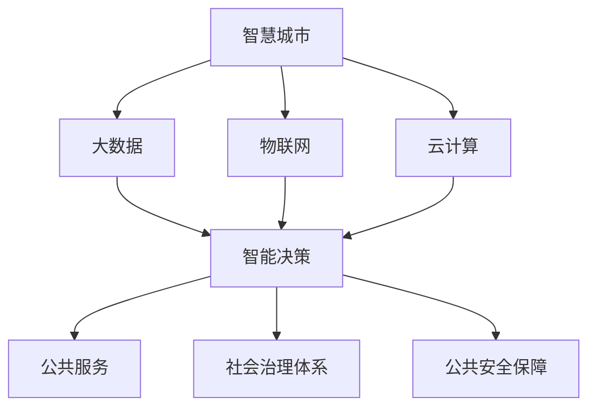

                 

# 科技创新：社会治理的新思路

> 关键词：科技创新,社会治理,数字化转型,智能决策,数据驱动,公共服务,智慧城市

## 1. 背景介绍

### 1.1 问题由来

随着信息技术的飞速发展，科技创新的浪潮正在改变全球经济社会的方方面面。传统的社会治理方式正在经历深刻的变革，智能化、数据化、服务化的趋势日益明显。如何利用科技创新，实现社会治理的现代化、高效化、精准化，成为了时代赋予的重大课题。

在数字化转型的大背景下，信息技术的广泛应用为社会治理注入了新的活力。尤其是人工智能、大数据、云计算等先进技术，为社会治理提供了强有力的技术支撑。从智慧城市建设到公共安全保障，从医疗健康管理到教育资源优化，科技创新正在为社会治理带来革命性的变化。

### 1.2 问题核心关键点

社会治理的科技创新，主要集中在以下几个方面：

- **智慧城市**：利用物联网、云计算、大数据等技术，实现城市运行和管理的智能化、精细化。
- **智能决策**：借助数据分析、机器学习、深度学习等技术，提升政府决策的科学性和准确性。
- **公共服务优化**：通过移动互联网、移动应用等手段，提供更加便捷、高效、个性化的公共服务。
- **社会治理体系创新**：利用AI、区块链等技术，优化治理结构，提升治理效率。
- **公共安全保障**：应用大数据分析、图像识别、自然语言处理等技术，实现公共安全监控和预警。

这些关键点的实现，离不开科技创新的持续推动和支撑。只有通过科技创新，不断提升社会治理的智能化水平，才能适应快速变化的社会环境，满足人民群众对美好生活的向往。

### 1.3 问题研究意义

社会治理的科技创新，具有重要的理论和实践意义：

1. **提升治理效率**：科技手段能够帮助政府更快、更准确地获取信息、分析问题和制定决策，有效提高社会治理的响应速度和决策效率。
2. **增强治理精准性**：通过数据驱动的方式，深入分析社会现象，预测未来趋势，实现精准的社会管理和公共服务。
3. **改善治理体验**：利用移动互联网、AI等技术，提供更加便捷、人性化的公共服务，增强公众的获得感和满意度。
4. **优化治理结构**：引入区块链、智能合约等技术，提升治理透明度和信任度，优化治理流程。
5. **防范治理风险**：利用图像识别、自然语言处理等技术，及时发现和预防安全风险，保障公共安全。

科技创新不仅能够改变社会治理的方式，还能够推动经济社会的全面进步，提升国家竞争力。科技创新已成为现代化社会治理不可或缺的重要驱动力。

## 2. 核心概念与联系

### 2.1 核心概念概述

为更好地理解科技创新在社会治理中的应用，本节将介绍几个密切相关的核心概念：

- **智慧城市**：通过大数据、物联网、云计算等技术，实现城市运行的智能化和精细化管理。
- **智能决策**：利用数据分析、机器学习等技术，提升政府决策的科学性和准确性。
- **公共服务**：通过移动互联网、AI等技术，提供更加便捷、高效、个性化的公共服务。
- **社会治理体系**：包括治理结构、流程、工具、方法等，通过科技创新实现治理体系的优化和升级。
- **公共安全保障**：利用大数据分析、图像识别等技术，实现公共安全的智能化监控和预警。

这些核心概念之间的逻辑关系可以通过以下Mermaid流程图来展示：



这个流程图展示了大数据、物联网、云计算、智能决策、公共服务、社会治理体系和公共安全保障之间的关系：

1. 大数据、物联网、云计算为智慧城市和智能决策提供数据支撑。
2. 智慧城市和智能决策为公共服务和社会治理体系提供技术手段。
3. 公共服务和社会治理体系优化了公共安全保障的流程和工具。

## 3. 核心算法原理 & 具体操作步骤

### 3.1 算法原理概述

社会治理的科技创新，本质上是一个数据驱动的智能化过程。其核心思想是：利用大数据、人工智能等先进技术，对社会现象进行全面、深入、动态的分析和预测，从而实现精准治理、高效服务。

形式化地，假设社会治理系统的输入为社会现象 $X$，输出为治理措施 $Y$。治理过程可以通过一个映射函数 $f$ 描述，即：

$$
Y = f(X)
$$

其中 $f$ 为治理决策模型，利用机器学习、深度学习等算法实现。模型的训练和优化，依赖于历史数据 $D$，通过有监督学习或无监督学习，学习社会现象与治理措施之间的映射关系。

在实践中，具体的算法流程如下：

1. 数据收集：通过传感器、调查问卷、社交媒体等多种方式，收集社会现象相关的数据。
2. 数据清洗和处理：对原始数据进行去噪、归一化、特征提取等处理，准备模型训练的数据。
3. 模型训练：利用训练数据集，训练治理决策模型。
4. 模型评估和优化：在测试数据集上评估模型性能，根据评估结果对模型进行优化调整。
5. 模型部署和应用：将优化后的模型部署到实际治理系统中，提供智能化的决策和服务。

### 3.2 算法步骤详解

以下是社会治理科技创新的一般流程：

**Step 1: 数据收集与处理**
- 通过多种数据源收集社会现象数据，如城市交通流量、空气质量、公共服务需求等。
- 对原始数据进行清洗、去重、标注等处理，生成可用于模型训练的数据集。

**Step 2: 模型设计与训练**
- 选择适合问题的算法模型，如回归、分类、聚类等。
- 设计模型结构和超参数，使用训练数据集进行模型训练。
- 根据评估指标调整模型参数，优化模型性能。

**Step 3: 模型应用与优化**
- 将训练好的模型部署到实际治理系统中，提供智能化服务。
- 实时收集系统反馈数据，对模型进行微调，持续优化模型效果。
- 引入先进技术，如深度强化学习、迁移学习等，进一步提升治理效果。

### 3.3 算法优缺点

社会治理科技创新的算法具有以下优点：

1. **数据驱动**：能够基于海量数据进行分析和预测，提升决策的科学性和准确性。
2. **高效服务**：利用人工智能技术，提供自动化、个性化的公共服务，提升服务效率。
3. **实时响应**：能够实时监测和预测社会现象，及时做出响应，提高治理效率。
4. **智能优化**：通过机器学习等技术，实现治理措施的动态优化和调整，提升治理效果。

同时，该算法也存在一些局限性：

1. **数据依赖**：依赖于高质量、全面、多样化的数据，数据质量问题会直接影响模型效果。
2. **模型复杂**：复杂的算法模型需要高性能计算资源，对硬件和算力要求较高。
3. **隐私问题**：处理敏感数据时，需要严格保护用户隐私，避免数据泄露和滥用。
4. **伦理风险**：模型决策过程可能存在偏见和歧视，需要伦理审查和监管。
5. **可解释性**：复杂的模型难以解释，决策过程缺乏透明性和可解释性。

尽管存在这些局限性，但就目前而言，社会治理科技创新的算法仍是最主流的研究范式。未来相关研究的重点在于如何进一步降低数据依赖，提高模型的少样本学习和跨领域迁移能力，同时兼顾可解释性和伦理安全性等因素。

### 3.4 算法应用领域

社会治理科技创新的算法在多个领域得到了广泛应用，例如：

- **智慧城市建设**：利用大数据、物联网、云计算等技术，实现城市管理的智能化和精细化。
- **智能决策支持**：通过数据分析、机器学习等技术，提升政府决策的科学性和准确性。
- **公共服务优化**：通过移动互联网、AI等技术，提供更加便捷、高效、个性化的公共服务。
- **社会治理体系优化**：利用区块链、智能合约等技术，优化治理结构，提升治理效率。
- **公共安全保障**：利用大数据分析、图像识别等技术，实现公共安全的智能化监控和预警。

除了上述这些经典应用外，社会治理科技创新的算法还被创新性地应用到更多场景中，如智能交通管理、环境监测、健康医疗等，为社会治理带来了全新的突破。

## 4. 数学模型和公式 & 详细讲解 & 举例说明

### 4.1 数学模型构建

社会治理科技创新的核心算法可以抽象为一个数据驱动的映射函数，即：

$$
Y = f(X) = M(X; \theta)
$$

其中 $M$ 为机器学习模型，$\theta$ 为模型参数。假设 $X$ 为社会现象的特征向量，$Y$ 为对应的治理措施。模型的训练过程可以表示为：

$$
\theta^* = \mathop{\arg\min}_{\theta} \sum_{i=1}^N \ell(y_i, M(x_i; \theta))
$$

其中 $\ell$ 为损失函数，$\ell(y_i, M(x_i; \theta))$ 表示模型在样本 $x_i$ 上的预测结果 $y_i$ 与实际结果 $M(x_i; \theta)$ 之间的误差。

### 4.2 公式推导过程

以回归问题为例，推导最小二乘法的公式。假设训练数据集为 $D=\{(x_i, y_i)\}_{i=1}^N$，其中 $x_i \in \mathbb{R}^d, y_i \in \mathbb{R}$。回归问题的目标是最小化预测值与真实值之间的平方误差，即：

$$
\ell(y, \hat{y}) = (y - \hat{y})^2
$$

因此，最小二乘法的目标函数可以表示为：

$$
\mathcal{L}(\theta) = \frac{1}{N} \sum_{i=1}^N (y_i - M(x_i; \theta))^2
$$

对上述目标函数求导，得到模型参数 $\theta$ 的梯度：

$$
\frac{\partial \mathcal{L}(\theta)}{\partial \theta} = -\frac{2}{N} \sum_{i=1}^N (y_i - M(x_i; \theta)) \frac{\partial M(x_i; \theta)}{\partial \theta}
$$

将梯度更新公式代入，得：

$$
\theta \leftarrow \theta - \eta \nabla_{\theta}\mathcal{L}(\theta)
$$

其中 $\eta$ 为学习率。

通过最小二乘法，模型能够学习社会现象与治理措施之间的映射关系，预测未来的治理措施。

### 4.3 案例分析与讲解

以智慧城市中的交通流量预测为例，分析如何利用机器学习进行预测。

假设获取到城市交通流量 $X$ 的历史数据，其中 $X_t$ 表示第 $t$ 天的交通流量。要预测第 $t+1$ 天的交通流量 $y_{t+1}$，可以采用以下步骤：

1. **数据准备**：收集城市交通流量相关的历史数据，包括温度、湿度、天气等环境因素，以及节假日、活动等事件因素。
2. **特征工程**：对原始数据进行特征提取和归一化，生成可用于模型训练的特征向量。
3. **模型训练**：选择适当的回归模型，如线性回归、决策树回归等，利用历史数据训练模型。
4. **模型评估**：在测试数据集上评估模型性能，选择合适的评估指标，如均方误差、平均绝对误差等。
5. **模型应用**：将训练好的模型应用于实际交通流量预测中，提供智能化服务。

## 5. 项目实践：代码实例和详细解释说明

### 5.1 开发环境搭建

在进行社会治理科技创新项目的开发前，我们需要准备好开发环境。以下是使用Python进行Scikit-learn开发的典型环境配置流程：

1. 安装Anaconda：从官网下载并安装Anaconda，用于创建独立的Python环境。

2. 创建并激活虚拟环境：
```bash
conda create -n sklearn-env python=3.8 
conda activate sklearn-env
```

3. 安装Scikit-learn：
```bash
pip install scikit-learn
```

4. 安装各类工具包：
```bash
pip install numpy pandas scikit-learn matplotlib tqdm jupyter notebook ipython
```

完成上述步骤后，即可在`sklearn-env`环境中开始项目实践。

### 5.2 源代码详细实现

这里我们以智慧城市交通流量预测为例，给出使用Scikit-learn进行回归分析的Python代码实现。

首先，定义数据处理函数：

```python
import numpy as np
from sklearn.model_selection import train_test_split
from sklearn.metrics import mean_squared_error

def load_data():
    # 读取交通流量数据
    data = np.loadtxt('traffic_flow.csv', delimiter=',')
    x = data[:, :-1]
    y = data[:, -1]
    return x, y

def train_test_split_data(x, y, test_size=0.2):
    # 将数据划分为训练集和测试集
    x_train, x_test, y_train, y_test = train_test_split(x, y, test_size=test_size, random_state=42)
    return x_train, x_test, y_train, y_test
```

然后，定义模型训练和评估函数：

```python
from sklearn.linear_model import LinearRegression

def train_model(x_train, y_train, test_size):
    # 训练线性回归模型
    model = LinearRegression()
    model.fit(x_train, y_train)
    y_pred = model.predict(x_test)
    mse = mean_squared_error(y_test, y_pred)
    return mse

def evaluate_model(model, x_test, y_test):
    # 评估模型性能
    y_pred = model.predict(x_test)
    mse = mean_squared_error(y_test, y_pred)
    return mse
```

最后，启动训练流程并在测试集上评估：

```python
# 加载数据
x, y = load_data()

# 数据划分
x_train, x_test, y_train, y_test = train_test_split_data(x, y, test_size=0.2)

# 训练模型
mse_train = train_model(x_train, y_train, test_size)
print(f'训练集均方误差: {mse_train:.3f}')

# 评估模型
mse_test = evaluate_model(x_test, y_test)
print(f'测试集均方误差: {mse_test:.3f}')
```

以上就是使用Scikit-learn进行智慧城市交通流量预测的完整代码实现。可以看到，得益于Scikit-learn的强大封装，我们可以用相对简洁的代码完成模型的训练和评估。

### 5.3 代码解读与分析

让我们再详细解读一下关键代码的实现细节：

**load_data函数**：
- 加载交通流量数据，生成特征向量和目标变量。

**train_test_split_data函数**：
- 将数据划分为训练集和测试集，默认80%为训练集，20%为测试集。

**train_model函数**：
- 训练线性回归模型，生成模型预测结果和均方误差。

**evaluate_model函数**：
- 在测试集上评估模型性能，返回均方误差。

**训练流程**：
- 加载数据
- 数据划分
- 训练模型并输出训练集均方误差
- 评估模型并输出测试集均方误差

可以看到，Scikit-learn库提供了简单易用的API接口，使得模型训练和评估过程变得非常高效便捷。

当然，工业级的系统实现还需考虑更多因素，如模型的保存和部署、超参数的自动搜索、更灵活的数据接口等。但核心的社会治理科技创新流程基本与此类似。

## 6. 实际应用场景

### 6.1 智慧城市建设

智慧城市建设是社会治理科技创新的一个重要应用场景。通过利用大数据、物联网、云计算等技术，实现城市运行的智能化和精细化管理，提升城市治理效率和居民生活品质。

在实践中，可以利用城市交通流量、空气质量、公共设施利用率等数据，通过机器学习等算法，进行实时监控和预测。例如，利用深度学习模型对交通流量进行预测，及时调整交通信号灯，避免拥堵；利用图像识别技术对城市公共设施进行智能维护，及时发现和修复故障；利用数据分析对城市能源消耗进行优化，提升资源利用效率。

### 6.2 智能决策支持

智能决策支持系统通过数据分析和机器学习技术，为政府决策提供科学依据，提升决策的科学性和准确性。

在实践中，可以利用历史数据和实时数据，通过回归分析、分类算法等技术，建立决策支持模型。例如，通过机器学习对经济指标、社会事件等进行分析，预测未来的经济趋势和潜在风险；通过分类算法对公共安全事件进行分类，及时采取应对措施。

### 6.3 公共服务优化

通过移动互联网、AI等技术，提供更加便捷、高效、个性化的公共服务，提升服务效率和居民满意度。

在实践中，可以利用机器学习技术对公共服务需求进行预测，动态调整服务资源配置。例如，利用深度学习模型对教育资源、医疗资源等进行优化分配，提升服务质量；利用自然语言处理技术对公共服务咨询进行自动化处理，提高服务响应速度。

### 6.4 社会治理体系优化

利用区块链、智能合约等技术，优化治理结构，提升治理效率。

在实践中，可以利用区块链技术实现公共服务的透明化、可追溯性，提升政府治理的信任度。例如，利用智能合约自动执行公共服务流程，提高服务效率；利用区块链技术实现公共数据的安全存储和共享，提升数据利用效率。

### 6.5 公共安全保障

利用大数据分析、图像识别等技术，实现公共安全的智能化监控和预警。

在实践中，可以利用图像识别技术对公共安全事件进行实时监控和预警，提升安全防范能力。例如，利用视频监控和图像识别技术对人员流动进行监控，及时发现和预防潜在风险；利用大数据分析技术对犯罪案件进行预测，提前采取防范措施。

## 7. 工具和资源推荐

### 7.1 学习资源推荐

为了帮助开发者系统掌握社会治理科技创新的理论基础和实践技巧，这里推荐一些优质的学习资源：

1. 《智慧城市与大数据》系列博文：由大数据专家撰写，深入浅出地介绍了智慧城市的建设思路和技术方法。

2. 《数据分析与机器学习》课程：斯坦福大学开设的机器学习课程，涵盖基本概念和经典算法，帮助理解数据驱动的决策过程。

3. 《智慧城市与人工智能》书籍：全面介绍了智慧城市的概念、技术和应用，是系统学习智慧城市建设的理想读物。

4. HuggingFace官方文档：包含大量预训练语言模型的介绍和微调样例，是入门AI应用开发的好资料。

5. Kaggle数据集：包含各种社会治理相关的数据集，是进行数据科学和机器学习实践的好平台。

通过对这些资源的学习实践，相信你一定能够快速掌握社会治理科技创新的精髓，并用于解决实际的治理问题。

### 7.2 开发工具推荐

高效的开发离不开优秀的工具支持。以下是几款用于社会治理科技创新开发的常用工具：

1. Python：作为数据科学和机器学习领域的主流语言，Python具有丰富的库和工具，适合进行数据处理和模型开发。

2. Scikit-learn：基于Python的机器学习库，提供了简单易用的API接口，支持多种算法模型的训练和评估。

3. TensorFlow和PyTorch：流行的深度学习框架，支持分布式计算，适合处理大规模数据和复杂模型。

4. Tableau和Power BI：数据可视化工具，能够帮助数据科学家更好地理解数据，发现规律和趋势。

5. Jupyter Notebook：交互式开发环境，支持代码的快速迭代和展示。

合理利用这些工具，可以显著提升社会治理科技创新的开发效率，加快创新迭代的步伐。

### 7.3 相关论文推荐

社会治理科技创新的研究源于学界的持续研究。以下是几篇奠基性的相关论文，推荐阅读：

1. 《大数据与智慧城市》：讨论了大数据在智慧城市建设中的应用，提供了丰富的案例和实践经验。

2. 《深度学习在社会治理中的应用》：探讨了深度学习在公共服务、公共安全等方面的应用，介绍了一些前沿技术和方法。

3. 《数据驱动的社会治理》：分析了数据在社会治理中的重要作用，讨论了数据收集、处理和利用的关键问题。

4. 《社会治理的智能决策支持》：介绍了智能决策支持系统的构建思路和实现方法，提供了一些典型的应用案例。

5. 《区块链在社会治理中的应用》：讨论了区块链在公共服务、公共安全等方面的应用，介绍了一些前沿技术和方法。

这些论文代表了大数据、智慧城市、智能决策、区块链等技术在社会治理中的应用，是学习和研究社会治理科技创新的重要参考资料。

## 8. 总结：未来发展趋势与挑战

### 8.1 总结

本文对社会治理科技创新的理论基础和实践方法进行了全面系统的介绍。首先阐述了社会治理科技创新的研究背景和意义，明确了科技创新在提升治理效率、精准性、服务优化等方面的独特价值。其次，从原理到实践，详细讲解了数据驱动的社会治理决策模型，给出了社会治理科技创新项目的完整代码实例。同时，本文还广泛探讨了社会治理科技创新在智慧城市、智能决策、公共服务、社会治理体系和公共安全保障等多个领域的应用前景，展示了科技创新对社会治理的深远影响。

通过本文的系统梳理，可以看到，社会治理科技创新的算法正在不断拓展社会治理的智能化水平，推动治理方式和服务的全面升级。科技创新已成为现代化社会治理不可或缺的重要驱动力，为构建高效、精准、智能的社会治理体系提供了有力支撑。

### 8.2 未来发展趋势

展望未来，社会治理科技创新的发展趋势如下：

1. **数据智能化**：随着大数据技术的不断发展，数据采集、存储、处理和利用将更加高效便捷，推动社会治理向更加智能化、精细化的方向发展。

2. **算法多样化**：未来将涌现更多智能决策算法，如深度强化学习、图神经网络等，提升决策的科学性和预测的准确性。

3. **模型可解释性**：随着可解释AI技术的不断发展，社会治理模型将具备更好的可解释性和透明性，增强决策的信任度。

4. **技术融合化**：未来将更多地引入物联网、区块链、智能合约等技术，提升社会治理的透明度和信任度。

5. **跨领域协作**：未来将更多地引入跨学科合作，如地理信息系统、社交网络分析、公共政策等，提升治理的全面性和综合性。

6. **伦理道德化**：随着AI伦理研究的不断深入，社会治理科技创新的应用将更加注重伦理道德问题，确保技术应用的公平性和安全性。

这些趋势凸显了社会治理科技创新技术的广阔前景，为构建高效、智能、公平的社会治理体系提供了新的方向。

### 8.3 面临的挑战

尽管社会治理科技创新的算法已经取得了显著成果，但在迈向更加智能化、普适化应用的过程中，仍面临以下挑战：

1. **数据隐私保护**：处理敏感数据时，需要严格保护用户隐私，避免数据泄露和滥用。

2. **模型复杂度**：复杂的算法模型需要高性能计算资源，对硬件和算力要求较高。

3. **伦理道德风险**：模型决策过程可能存在偏见和歧视，需要伦理审查和监管。

4. **技术应用落地**：如何将先进的算法模型应用到实际治理系统中，仍然存在诸多技术和管理障碍。

5. **跨部门协作**：社会治理需要不同部门和领域的协作，跨部门的数据共享和协同工作仍需进一步优化。

6. **资源投入巨大**：社会治理科技创新的应用需要大量的资源投入，包括数据采集、模型训练、系统部署等，对财政和人力都是巨大的挑战。

正视社会治理科技创新面临的这些挑战，积极应对并寻求突破，将是大数据和AI技术在社会治理中实现规模化应用的关键。相信随着学界和产业界的共同努力，这些挑战终将一一被克服，社会治理科技创新的技术将进一步成熟和完善。

### 8.4 研究展望

未来，社会治理科技创新的研究方向如下：

1. **数据隐私保护**：研究数据匿名化、加密等技术，确保数据使用的安全性。

2. **模型可解释性**：研究可解释AI方法，提升模型的透明性和可信度。

3. **算法优化**：研究优化算法，提高模型训练效率，降低资源消耗。

4. **跨领域融合**：研究跨学科技术融合，提升治理的综合性和系统性。

5. **伦理道德**：研究伦理审查和监管方法，确保技术应用的公平性和安全性。

6. **技术应用落地**：研究治理系统的建设方法和管理机制，促进技术的实际应用。

这些研究方向将引领社会治理科技创新的技术不断成熟和完善，为构建高效、智能、公平的社会治理体系提供坚实的技术基础。

## 9. 附录：常见问题与解答

**Q1：社会治理科技创新的算法是否适用于所有社会治理场景？**

A: 社会治理科技创新的算法在大多数社会治理场景上都能取得不错的效果，特别是对于数据量较大的场景。但对于一些特殊场景，如极端天气预测、重大突发事件等，可能需要引入其他领域的专业知识和技术。

**Q2：如何选择合适的算法模型？**

A: 选择算法模型时，需要根据具体问题的特点进行选择。例如，对于预测类问题，可以选择回归模型；对于分类问题，可以选择分类模型。同时，还需要考虑模型的复杂度和计算资源，选择适合的模型进行训练。

**Q3：在实际应用中，如何保护用户隐私？**

A: 在处理敏感数据时，需要采用数据匿名化、加密等技术，确保用户隐私不被泄露。同时，需要严格控制数据的访问权限，防止数据滥用。

**Q4：如何应对算力不足的问题？**

A: 可以通过数据分批处理、模型压缩、分布式计算等技术，降低计算资源消耗，提升算力利用效率。同时，可以引入更高效的算法模型，如深度学习模型，提高训练效率。

**Q5：如何确保模型决策的公平性？**

A: 在模型训练过程中，需要引入公平性评估指标，如精确度、召回率等，确保模型决策的公平性。同时，需要定期进行模型审查和优化，防止模型决策中的偏见和歧视。

通过对这些问题的回答，可以看到社会治理科技创新在实际应用中的复杂性和挑战性。只有在数据、算法、工程、伦理等多个维度协同发力，才能真正实现社会治理的智能化和高效化。

