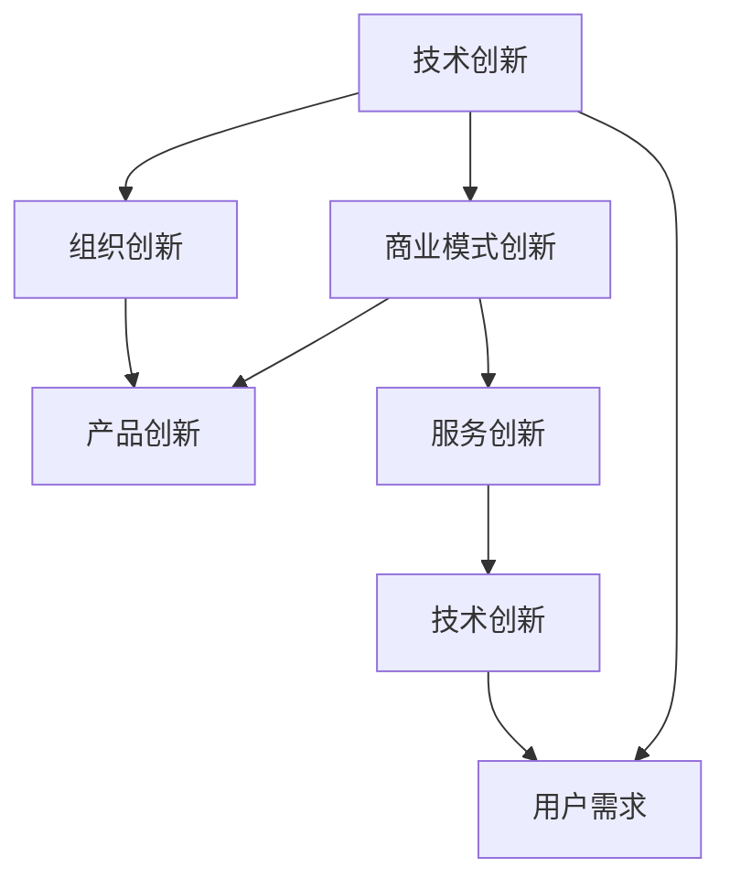

                 

# 科技创新：社会进步的阶梯

## 1. 背景介绍

### 1.1 科技创新的意义

科技创新是推动社会进步的根本动力。人类历史上的每一次重大技术突破，都带来了社会结构、生产方式和价值观念的深刻变革。从蒸汽机、电力到互联网，科技创新不断解放和发展生产力，推动了人类文明的飞速发展。

当前，科技创新已经成为全球各国竞争的焦点。科技进步不仅仅关乎经济效益，更涉及国家安全、社会稳定和人类福祉。面对全球性挑战，如气候变化、资源匮乏、疾病防控等，科技创新提供了关键的解决方案，展示了科技创新的巨大价值。

### 1.2 科技创新的挑战

尽管科技创新具有重要的战略意义，但在实现过程中也面临着诸多挑战。首先是技术实现的复杂性。许多前沿技术涉及跨学科的交叉，技术路径复杂多样，且需要长期的研发投入。其次是技术成果转化的难度。从实验室到市场的转化需要克服诸多障碍，包括技术成熟度、市场接受度、法律合规性等。最后是国际科技竞争的激烈程度。全球科技巨头纷纷加码研发投入，创新竞赛白热化，如何在这场竞争中占据优势，是摆在各国政府和企业面前的重要课题。

## 2. 核心概念与联系

### 2.1 核心概念概述

科技创新涉及诸多关键概念，包括技术创新、商业模式创新、组织创新等。这些概念之间相互联系，共同构成了创新生态的有机体系。

- **技术创新**：指通过研究和开发新技术、新材料、新工艺，推动产品和服务的改进和升级。
- **商业模式创新**：指通过创新价值主张、销售渠道、客户关系管理等，实现商业模式的优化和升级。
- **组织创新**：指通过创新组织结构、管理方式、团队文化等，提升企业的创新能力和效率。
- **产品创新**：指通过创新产品功能、性能、设计等，满足市场需求和提高用户满意度。
- **服务创新**：指通过创新服务模式、流程、体验等，提供更高效、更优质的服务。

这些概念之间的逻辑关系可以通过以下Mermaid流程图来展示：



这个流程图展示了一个典型的创新生态系统：

1. 技术创新提供底层的技术支撑。
2. 商业模式创新和产品创新基于技术创新，满足市场需求。
3. 组织创新提升企业的创新能力。
4. 服务创新改进用户体验，进一步推动技术创新和产品创新。
5. 用户需求是推动整个创新生态的根本动力。

### 2.2 核心概念原理和架构的 Mermaid 流程图


这个流程图表明，技术创新是推动整个创新生态的基石，商业模式、组织结构、产品设计和服务模式都需基于技术创新，并相互促进，共同驱动创新进步。

## 3. 核心算法原理 & 具体操作步骤

### 3.1 算法原理概述

科技创新是一种复杂的多层次活动，涉及技术、市场、组织等多个方面。其核心算法原理主要包括：

- **系统性分析**：通过系统工程方法，全面分析和优化技术创新的全过程，确保各环节的协调配合。
- **跨学科协作**：通过跨学科的协作，整合不同领域的知识和技术，推动复杂技术问题的解决。
- **数据驱动决策**：通过大数据和人工智能技术，辅助决策者做出科学合理的决策，提高创新成功率。
- **开放创新**：通过开放创新平台和机制，促进技术、人才、资本等的流动和共享，加速技术创新。

### 3.2 算法步骤详解

科技创新通常包含以下几个关键步骤：

**Step 1: 需求分析**

需求分析是科技创新的起点。通过市场调研、用户反馈、数据分析等方式，明确目标用户的需求和痛点，确定创新的方向和目标。

**Step 2: 技术选型**

在明确需求后，选择最适合的技术方案和路径。这一过程需要充分考虑技术的可行性、成熟度、成本效益等因素。

**Step 3: 研发实施**

根据选定的技术方案，组织研发团队进行产品或服务的开发和测试。这一过程通常包括实验室研究、原型开发、用户测试、改进完善等环节。

**Step 4: 商业模式设计**

在技术研发的同时，设计相应的商业模式。商业模式设计需要考虑收益模式、销售渠道、客户关系管理等，确保创新成果能够顺利落地和推广。

**Step 5: 市场推广**

技术研发完成后，进入市场推广阶段。这一过程包括市场调研、市场定位、品牌建设、渠道拓展等，确保产品或服务能够顺利推广和销售。

**Step 6: 持续改进**

产品或服务进入市场后，需要根据市场反馈和用户需求进行持续改进和优化，提升用户体验和市场竞争力。

### 3.3 算法优缺点

科技创新具有以下几个优点：

- **推动经济增长**：科技创新能够带动新的产业和技术集群，推动经济结构优化和产业升级。
- **提升竞争力**：通过技术突破和产品创新，企业能够提升市场竞争力，获取更高的市场份额。
- **促进社会进步**：科技创新能够解决重大社会问题，如疾病防控、环境保护、资源利用等，提升社会福祉。

同时，科技创新也存在一些局限性：

- **高风险性**：技术研发过程中存在诸多不确定因素，成功率无法保证，投入巨大且周期长。
- **高成本性**：技术创新需要大量的资金投入，包括研发费用、市场推广费用等。
- **知识产权争议**：技术创新常常涉及知识产权问题，需花费大量时间和精力进行保护和维权。

### 3.4 算法应用领域

科技创新广泛应用在多个领域，包括但不限于：

- **智能制造**：通过物联网、人工智能等技术，实现生产过程的智能化和自动化，提升生产效率和质量。
- **健康医疗**：通过基因编辑、生物信息学等技术，推动医学研究和临床应用，提升疾病防控和治疗水平。
- **能源环保**：通过可再生能源、清洁技术等，推动能源结构优化和环境保护，实现可持续发展。
- **智慧城市**：通过大数据、物联网等技术，构建智能城市管理体系，提升城市治理和居民生活质量。
- **新兴产业**：如人工智能、量子计算、区块链等，正在催生新的经济增长点和市场机会。

## 4. 数学模型和公式 & 详细讲解 & 举例说明

### 4.1 数学模型构建

科技创新过程中涉及的数学模型多种多样，但核心目标是对创新过程进行量化分析和优化。这里以技术创新的复杂度模型为例进行讲解。

设 $T$ 为技术创新所需的研发时间，$C$ 为研发投入成本，$P$ 为技术创新的成功概率，则技术创新的复杂度 $S$ 可以表示为：

$$
S = f(T, C, P)
$$

其中，$f$ 为复杂度函数，依赖于技术创新的具体参数。

### 4.2 公式推导过程

根据上述模型，我们可以推导出技术创新的复杂度函数。假设技术创新的成功概率 $P$ 与研发时间 $T$ 成正比，研发投入 $C$ 与研发时间 $T$ 成二次方关系，即：

$$
P = kT, \quad C = cT^2
$$

其中 $k$ 和 $c$ 为常数。则技术创新的复杂度 $S$ 可以表示为：

$$
S = f(T, C, P) = f(kT, cT^2, kT)
$$

由于 $k$ 和 $c$ 的具体值未知，我们可以使用蒙特卡罗模拟等方法进行估算。设 $k=0.1, c=0.01$，则有：

$$
S(T) = f(0.1T, 0.01T^2, 0.1T)
$$

通过计算可以得出，随着研发时间 $T$ 的增加，技术创新的复杂度 $S$ 呈指数级增长，反映了技术创新的高风险和高成本特性。

### 4.3 案例分析与讲解

以谷歌的TensorFlow为例，分析其在科技创新中的应用。

TensorFlow 是一个开源的深度学习框架，通过其强大的计算能力和丰富的工具，推动了人工智能技术的快速发展。其科技创新主要体现在以下几个方面：

1. **技术突破**：TensorFlow 通过优化算法和架构，提升了深度学习模型的训练速度和准确率，推动了人工智能技术的普及和应用。
2. **商业模式创新**：谷歌通过开源和商业化双重策略，构建了强大的生态系统，吸引了大量开发者和企业的支持，成为全球领先的AI平台。
3. **组织创新**：谷歌在人工智能领域建立了强大的研发团队和创新文化，推动了众多前沿技术的突破和应用。
4. **产品创新**：TensorFlow 提供了丰富的API和工具，支持从研究到应用的全流程，推动了人工智能技术的快速落地和应用。

TensorFlow 的成功展示了科技创新在技术、商业、组织和产品等方面的协同效应，为其他企业提供了宝贵的经验和借鉴。

## 5. 项目实践：代码实例和详细解释说明

### 5.1 开发环境搭建

在进行科技创新项目实践前，需要先搭建好开发环境。以下是Python环境下使用TensorFlow的开发环境配置流程：

1. 安装Anaconda：从官网下载并安装Anaconda，用于创建独立的Python环境。

2. 创建并激活虚拟环境：
```bash
conda create -n tensorflow-env python=3.8 
conda activate tensorflow-env
```

3. 安装TensorFlow：根据CUDA版本，从官网获取对应的安装命令。例如：
```bash
conda install tensorflow-gpu=2.4 -c pytorch -c conda-forge
```

4. 安装各类工具包：
```bash
pip install numpy pandas scikit-learn matplotlib tqdm jupyter notebook ipython
```

完成上述步骤后，即可在`tensorflow-env`环境中开始项目开发。

### 5.2 源代码详细实现

这里我们以TensorFlow的应用为例，使用TensorFlow搭建一个简单的深度学习模型。

首先，定义一个简单的分类模型：

```python
import tensorflow as tf
from tensorflow.keras import layers, models

model = models.Sequential([
    layers.Dense(64, activation='relu', input_shape=(784,)),
    layers.Dense(10)
])
```

然后，定义损失函数和优化器：

```python
model.compile(optimizer='adam',
              loss=tf.keras.losses.SparseCategoricalCrossentropy(from_logits=True),
              metrics=['accuracy'])
```

接着，使用MNIST数据集进行训练：

```python
mnist = tf.keras.datasets.mnist
(x_train, y_train), (x_test, y_test) = mnist.load_data()
x_train, x_test = x_train / 255.0, x_test / 255.0

model.fit(x_train, y_train, epochs=5, validation_data=(x_test, y_test))
```

最后，评估模型性能：

```python
model.evaluate(x_test, y_test, verbose=2)
```

以上就是使用TensorFlow搭建并训练一个简单的深度学习模型的完整代码实现。可以看到，TensorFlow提供了丰富的API和工具，使得模型搭建和训练变得相对简洁高效。

### 5.3 代码解读与分析

让我们再详细解读一下关键代码的实现细节：

**Sequential模型定义**：
- `Sequential`模型是TensorFlow中的一个线性堆叠模型，适合搭建顺序连接的神经网络。
- `Dense`层是标准的全连接层，使用ReLU激活函数，输入维度为784，输出维度为10，用于10个类别的分类任务。

**损失函数和优化器**：
- `SparseCategoricalCrossentropy`是稀疏分类交叉熵损失函数，用于多分类任务。
- `adam`是TensorFlow中常用的优化器，结合了Adagrad和RMSprop的优点，适合处理稀疏梯度问题。

**数据预处理**：
- 对输入数据进行归一化，将其值缩放到[0, 1]之间。
- 使用`load_data`方法从MNIST数据集中加载训练集和测试集，并进行预处理。

**模型训练和评估**：
- 使用`fit`方法对模型进行训练，设置训练轮数为5轮，并在测试集上进行验证。
- 使用`evaluate`方法评估模型在测试集上的性能，输出精度和损失值。

可以看到，TensorFlow提供了一个高效便捷的模型搭建和训练平台，帮助开发者快速实现深度学习项目。

### 5.4 运行结果展示

运行上述代码后，TensorFlow将输出训练过程中的损失值和精度，最终输出测试集上的精度和损失值。这些结果可以帮助开发者评估模型的性能，并进行相应的调整和优化。

## 6. 实际应用场景

### 6.1 智能制造

智能制造是科技创新在工业领域的重要应用。通过物联网、人工智能等技术，实现生产过程的智能化和自动化，提升生产效率和质量。

在技术实现上，可以搭建智能工厂系统，利用传感器采集生产数据，通过AI算法进行数据分析和预测，指导生产过程。例如，使用机器学习算法预测设备故障，实现预测性维护；使用自然语言处理技术分析工人操作日志，提升生产效率。

### 6.2 健康医疗

科技创新在健康医疗领域具有重要的应用价值。通过基因编辑、生物信息学等技术，推动医学研究和临床应用，提升疾病防控和治疗水平。

具体应用包括：

1. **基因编辑**：利用CRISPR等技术，进行基因编辑和修复，治疗遗传疾病。
2. **生物信息学**：利用大数据和算法技术，进行基因序列分析和预测，辅助疾病诊断和研究。
3. **人工智能**：利用深度学习算法，辅助医生进行病历分析、影像识别等，提高诊断准确率。

这些技术的应用，将大大提升健康医疗服务的质量和效率，改善人民健康水平。

### 6.3 能源环保

科技创新在能源环保领域具有广泛的应用前景。通过可再生能源、清洁技术等，推动能源结构优化和环境保护，实现可持续发展。

具体应用包括：

1. **太阳能和风能**：利用太阳能和风能等可再生能源，替代传统的化石能源，减少环境污染。
2. **智能电网**：利用物联网和人工智能技术，构建智能电网，实现能源的高效管理和优化。
3. **碳捕集与封存**：利用新技术进行碳捕集与封存，减少温室气体排放，缓解气候变化。

这些技术的应用，将推动能源领域的绿色转型，实现能源结构的优化和环境的改善。

### 6.4 智慧城市

智慧城市是科技创新在城市管理中的重要应用。通过大数据、物联网等技术，构建智能城市管理体系，提升城市治理和居民生活质量。

具体应用包括：

1. **智能交通**：利用大数据和算法技术，优化交通流量，减少拥堵和污染。
2. **智慧公共服务**：利用AI技术，提供智能化的公共服务，提升城市管理效率和居民满意度。
3. **环境监测**：利用传感器和AI技术，实时监测城市环境数据，保障城市环境质量。

这些技术的应用，将大大提升城市管理的智能化水平，提高城市居民的生活质量。

## 7. 工具和资源推荐

### 7.1 学习资源推荐

为了帮助开发者系统掌握科技创新的方法和实践，这里推荐一些优质的学习资源：

1. **《创新驱动发展战略》白皮书**：由国家发展和改革委员会、科学技术部等联合发布，全面解读创新驱动发展的战略方向和政策措施。
2. **《科技创新2030—重大项目》实施方案**：由国务院发布，旨在推动国家重大科技项目的实施，提升国家科技创新能力。
3. **《未来简史》**：尤瓦尔·赫拉利的著作，探讨科技创新的未来走向和人类社会的演变趋势。
4. **Coursera《创新管理》课程**：斯坦福大学教授乔纳森·赫斯曼讲授的创新管理课程，涵盖创新管理的理论和方法。
5. **创新创业实验室**：国内各大高校和机构设立的创新创业平台，提供创业指导和资源支持。

通过对这些资源的学习实践，相信你一定能够系统掌握科技创新的方法和实践技巧，为推动社会进步做出贡献。

### 7.2 开发工具推荐

高效的开发离不开优秀的工具支持。以下是几款用于科技创新开发的常用工具：

1. **Jupyter Notebook**：开源的交互式编程环境，支持多种编程语言，适合数据科学和机器学习项目。
2. **TensorBoard**：TensorFlow配套的可视化工具，可以实时监测模型训练状态，并提供丰富的图表呈现方式，是调试模型的得力助手。
3. **Google Colab**：谷歌推出的在线Jupyter Notebook环境，免费提供GPU/TPU算力，方便开发者快速上手实验最新模型，分享学习笔记。
4. **GitHub**：全球最大的开源代码托管平台，支持代码的版本控制和协作开发，是科技创新项目的重要工具。

合理利用这些工具，可以显著提升科技创新项目的开发效率，加快创新迭代的步伐。

### 7.3 相关论文推荐

科技创新是当前学界和产业界的研究热点，以下是几篇奠基性的相关论文，推荐阅读：

1. **《科技创新范式转型》**：张志强、张伟明的著作，全面分析了科技创新的范式转型，提出了创新生态系统建设的方法和路径。
2. **《创新管理与技术转移》**：吴晓波、田志刚的著作，系统介绍了创新管理的基本理论和实践方法，为科技创新提供了理论支持。
3. **《创新驱动发展战略》**：国家发展和改革委员会、科学技术部的政策文件，全面解读了创新驱动发展的战略方向和政策措施。
4. **《工业4.0与中国制造2025》**：国家发展和改革委员会、工业和信息化部的政策文件，探讨了工业4.0和智能制造的战略意义和实施路径。
5. **《未来简史》**：尤瓦尔·赫拉利的著作，探讨科技创新的未来走向和人类社会的演变趋势，具有深刻的思想洞察力。

这些论文代表了大科技创新的发展脉络。通过学习这些前沿成果，可以帮助研究者把握学科前进方向，激发更多的创新灵感。

## 8. 总结：未来发展趋势与挑战

### 8.1 总结

本文对科技创新在社会进步中的重要意义进行了全面系统的介绍。首先阐述了科技创新对经济增长、社会进步和人类福祉的推动作用，明确了科技创新的战略地位。其次，从原理到实践，详细讲解了科技创新的一般流程和关键步骤，给出了科技创新项目的完整代码实现。同时，本文还广泛探讨了科技创新在智能制造、健康医疗、能源环保和智慧城市等多个领域的应用前景，展示了科技创新的广阔前景。此外，本文精选了科技创新过程中的各类学习资源，力求为读者提供全方位的技术指引。

通过本文的系统梳理，可以看到，科技创新已经深度融入经济、社会、环境等各个领域，成为推动社会进步的重要动力。科技创新的复杂性和多样性，要求我们在技术、商业、组织等多个维度进行综合分析和优化，才能实现其最大的社会价值。

### 8.2 未来发展趋势

展望未来，科技创新将呈现以下几个发展趋势：

1. **深度融合**：科技创新将与其他领域深度融合，如工业互联网、智慧农业等，形成更广泛的应用场景。
2. **多学科交叉**：科技创新的方向将更加跨学科，涉及人工智能、生物医学、材料科学等多个领域，形成多领域的协同创新。
3. **开放合作**：科技创新将更加开放，通过国际合作、开放创新平台等方式，推动知识的共享和交流。
4. **社会责任**：科技创新将更加注重社会责任，推动可持续发展，关注环保、公平、伦理等问题。
5. **持续创新**：科技创新将成为一种常态，持续的研发投入和创新活动将成为企业发展的重要驱动力。

以上趋势凸显了科技创新的广阔前景和深远意义。这些方向的探索发展，必将进一步推动社会进步，提升人类福祉。

### 8.3 面临的挑战

尽管科技创新具有重要的战略意义，但在实现过程中也面临诸多挑战：

1. **资源瓶颈**：科技创新需要大量的资金、技术和人力资源，资源分配和管理是重要难题。
2. **知识产权问题**：科技创新的成果往往涉及复杂的知识产权问题，如何保护和维权是一大挑战。
3. **技术壁垒**：科技创新的技术路径复杂多样，技术壁垒高，难以快速突破。
4. **市场接受度**：科技创新的成果往往需要突破传统市场壁垒，获取用户的认可和接受，难度较大。
5. **伦理风险**：科技创新在提升效率的同时，也带来了伦理和隐私问题，需加强监管和规范。

这些挑战需要我们在实践中不断探索和解决，才能实现科技创新的最大社会价值。

### 8.4 研究展望

面对科技创新所面临的挑战，未来的研究需要在以下几个方面寻求新的突破：

1. **多学科协同创新**：建立跨学科的创新平台和机制，推动多领域的协同创新，提升创新的整体效率和质量。
2. **智能化研发平台**：开发智能化研发工具和平台，支持大数据分析和AI辅助设计，提升研发效率和创新能力。
3. **开放式创新生态**：构建开放式的创新生态系统，促进知识共享和协作创新，提升创新成果的转化率。
4. **社会责任导向**：推动科技创新向社会责任导向转变，关注环保、公平、伦理等问题，提升创新成果的社会价值。
5. **伦理和法律规范**：加强科技创新伦理和法律规范，保护知识产权，规范创新行为，保障创新成果的安全性。

这些研究方向的探索，必将推动科技创新向更高的层次发展，为社会进步贡献更大力量。

## 9. 附录：常见问题与解答

**Q1：科技创新是如何推动社会进步的？**

A: 科技创新通过提升生产力、推动新产业的形成、解决社会问题等方式，推动社会进步。具体而言，科技创新能够带动新的技术和管理方法，提升生产效率和质量，推动经济发展；通过新技术和新产业的形成，创造新的经济增长点，促进经济结构优化；通过解决重大社会问题，如疾病防控、环境保护、资源利用等，提升社会福祉。

**Q2：科技创新的关键因素有哪些？**

A: 科技创新的关键因素包括技术突破、市场需求、组织结构、资金投入等。技术突破是科技创新的核心驱动力，市场需求推动创新方向和目标，组织结构保障创新能力，资金投入提供资源支持。

**Q3：如何推动科技创新向社会责任导向转变？**

A: 推动科技创新向社会责任导向转变，需要加强伦理和法律规范，关注环保、公平、伦理等问题，提升创新成果的社会价值。具体措施包括：加强知识产权保护，规范创新行为；推动可持续发展，关注环保和社会责任；建立社会责任评估机制，推动创新成果的社会应用。

**Q4：科技创新的资源管理有哪些方法？**

A: 科技创新的资源管理需要科学合理的规划和管理，包括：建立科学的项目评估机制，优化资源配置；加强团队协作，提升创新效率；引入大数据和AI技术，进行资源优化和预测。

**Q5：科技创新的未来趋势有哪些？**

A: 科技创新的未来趋势包括深度融合、多学科交叉、开放合作、社会责任、持续创新等。这些趋势将推动科技创新向更广泛的应用领域发展，提升其社会价值和影响力。

---

作者：禅与计算机程序设计艺术 / Zen and the Art of Computer Programming

