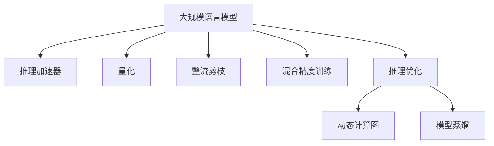

                 

# 秒推时代:LLM极速推理引领新风潮

## 1. 背景介绍

### 1.1 问题由来
伴随着深度学习技术的快速发展，大规模语言模型(LLM)如GPT、BERT等在自然语言处理(NLP)领域取得了巨大的突破。LLM通过在海量无标签文本数据上进行预训练，学习到了丰富的语言知识和常识，可以应用于文本分类、情感分析、问答系统等多种下游任务。

然而，现有的LLM模型在推理计算上仍然面临一定的挑战。由于其庞大的参数规模和复杂的计算图结构，LLM在实际部署和推理时，往往需要耗费大量的时间和计算资源。特别是在微调、集成、推理等环节，LLM的高计算成本和低推理速度成为了制约其应用规模化的瓶颈。

### 1.2 问题核心关键点
为了解决LLM推理计算的问题，近年来，加速推理技术(如整流剪枝、量化、推理加速器等)得到了广泛关注。特别是深度推理加速器(如Intel DLX、NVIDIA Tesla等)和基于GPU的推理优化技术，显著提升了LLM的推理速度和计算效率。然而，即使有了这些加速器的支持，LLM在推理速度上的表现仍然无法满足实时性要求，无法完全发挥其潜力。

因此，如何在不增加大量计算资源的情况下，显著提升LLM的推理速度，成为了当前研究的一个热点问题。本文聚焦于LLM极速推理方法，探讨了基于优化算法、模型压缩、推理加速等技术手段，以期为LLM的实际应用提供新的思路和实践参考。

## 2. 核心概念与联系

### 2.1 核心概念概述

为更好地理解LLM极速推理方法，本节将介绍几个密切相关的核心概念：

- 大规模语言模型(LLM)：以自回归(如GPT)或自编码(如BERT)模型为代表的大规模预训练语言模型。通过在海量无标签文本数据上进行预训练，学习通用的语言表示，具备强大的语言理解和生成能力。

- 推理加速器：针对深度学习模型的加速器，如Intel DLX、NVIDIA Tesla、Google TPU等。这些加速器通过定制化计算架构、优化的内存管理、硬件加速等手段，显著提升模型的推理速度和计算效率。

- 量化：将浮点模型转换为定点模型，通过减少计算精度，从而实现计算效率的提升。量化技术主要包括权重量化、激活量化等，可以显著降低模型参数和计算量。

- 整流剪枝：通过去除模型中部分权重值较小的层或参数，从而达到减小模型规模和加速推理的效果。常见的整流剪枝方法包括L1/L2范数剪枝、网络结构搜索剪枝等。

- 混合精度训练：在训练过程中，同时使用32位和16位精度计算，提高计算效率，同时保证模型精度。混合精度训练通过引入FP16/FP32混合数据类型，使得计算量大幅减小，训练速度显著提升。

- 推理优化：针对推理过程的优化技术，如动态计算图、模型蒸馏、代码优化等，减少推理过程中的重复计算，提升推理速度。

- 动态计算图：通过动态生成计算图，将推理过程中的计算图动态生成并执行，减少内存占用和计算量，提升推理速度。

- 模型蒸馏：通过教师模型和学生模型的结合，将教师模型的知识传递给学生模型，减少学生模型的参数规模和推理复杂度，提升推理速度。

这些核心概念之间的逻辑关系可以通过以下Mermaid流程图来展示：



这个流程图展示了大规模语言模型的核心概念及其之间的关系：

1. 大规模语言模型通过预训练获得基础能力。
2. 推理加速器、量化、整流剪枝、混合精度训练等技术，可以提升模型的计算效率，加速推理过程。
3. 推理优化中的动态计算图、模型蒸馏等方法，可以在不损失模型精度的情况下，进一步提高推理速度。

这些概念共同构成了LLM极速推理的基石，使得LLM能够在更广的应用场景中发挥其强大的能力。

## 3. 核心算法原理 & 具体操作步骤
### 3.1 算法原理概述

基于LLM极速推理的方法，本质上是对模型的计算图和参数进行优化，以提升推理速度和计算效率。其核心思想是：通过合理的模型压缩、量化、剪枝等技术手段，减少模型的参数量和计算复杂度，同时利用推理优化技术，进一步提升推理速度和计算效率。

形式化地，假设LLM模型为 $M_{\theta}$，其中 $\theta$ 为模型参数。假设推理加速器为 $E$，量化技术为 $Q$，整流剪枝技术为 $P$，推理优化技术为 $O$。则极速推理的目标是找到最优的模型压缩和量化策略，使得推理过程在 $E$ 上执行时，具有最小计算成本：

$$
\min_{\theta, Q, P, O} C(M_{\theta}, E, Q, P, O)
$$

其中 $C$ 为计算成本函数，包括模型的计算量、内存占用、计算时间等。

### 3.2 算法步骤详解

基于极速推理的大语言模型构建一般包括以下几个关键步骤：

**Step 1: 准备预训练模型和推理加速器**
- 选择合适的预训练语言模型 $M_{\theta}$ 作为初始化参数，如 BERT、GPT 等。
- 选择合适的推理加速器 $E$，如 Intel DLX、NVIDIA Tesla、Google TPU 等。

**Step 2: 量化模型参数**
- 对模型的权重参数进行量化处理，将其转换为定点数，减少计算精度，同时保证模型精度。

**Step 3: 整流剪枝**
- 使用整流剪枝方法，去除模型中部分权重值较小的层或参数，进一步减小模型规模和计算量。

**Step 4: 混合精度训练**
- 使用混合精度训练技术，同时使用32位和16位精度计算，提高计算效率，同时保证模型精度。

**Step 5: 推理优化**
- 应用动态计算图、模型蒸馏等推理优化技术，减少推理过程中的重复计算，提升推理速度。

**Step 6: 验证和优化**
- 在推理加速器上对优化后的模型进行验证，使用基准测试数据集评估模型的推理速度和计算效率。
- 根据评估结果，对模型进行进一步优化，调整量化、剪枝、混合精度等策略，直至达到最优效果。

以上是极速推理大语言模型的构建步骤，其中涉及到的每一步都需要仔细调整和优化，以确保在不损失模型精度的情况下，显著提升推理速度。

### 3.3 算法优缺点

基于极速推理的大语言模型具有以下优点：
1. 显著提升推理速度。通过量化、剪枝、混合精度等技术，有效减小了模型的计算量，使得推理过程更快。
2. 保持模型精度。虽然采用了量化、剪枝等技术，但通过合理的优化和验证，可以保证模型精度不发生显著下降。
3. 节省计算资源。通过优化计算图和参数，可以有效降低推理过程中的资源消耗。
4. 适合实时应用。极速推理技术使得LLM在实时应用场景中具有更强的计算能力。

同时，该方法也存在一定的局限性：
1. 需要较多的预处理和验证工作。量化、剪枝等技术的应用，需要一定的预处理和优化，增加了前期工作量。
2. 对计算资源要求较高。即使进行了优化，极速推理仍然需要一定的计算资源支持。
3. 模型压缩效果有限。量化、剪枝等技术无法完全消除冗余计算，在特定场景下仍可能存在计算瓶颈。
4. 推理加速器的限制。不同的推理加速器有不同的计算架构和优化策略，适用范围和效果各异。

尽管存在这些局限性，但就目前而言，基于极速推理的大语言模型在实际应用中仍然具有显著优势，特别是在需要高实时性、高计算效率的场合。

### 3.4 算法应用领域

基于极速推理的大语言模型在NLP领域已经得到了广泛的应用，覆盖了多种下游任务，例如：

- 文本分类：如情感分析、主题分类、意图识别等。通过量化、剪枝等技术，可以显著提升模型的推理速度和计算效率。
- 命名实体识别：识别文本中的人名、地名、机构名等特定实体。极速推理技术可以在不损失精度的前提下，显著提升命名实体识别的速度。
- 关系抽取：从文本中抽取实体之间的语义关系。通过量化、剪枝等技术，可以提升关系抽取的推理效率。
- 问答系统：对自然语言问题给出答案。极速推理技术可以显著提升问答系统的响应速度和处理能力。
- 机器翻译：将源语言文本翻译成目标语言。通过量化、剪枝等技术，可以提升机器翻译的推理速度和翻译质量。
- 文本摘要：将长文本压缩成简短摘要。极速推理技术可以在不损失精度的前提下，快速生成高质量的摘要。
- 对话系统：使机器能够与人自然对话。极速推理技术可以显著提升对话系统的响应速度和处理能力。

除了上述这些经典任务外，极速推理技术也被创新性地应用到更多场景中，如可控文本生成、常识推理、代码生成、数据增强等，为NLP技术带来了全新的突破。随着极速推理方法的不断进步，相信NLP技术将在更广阔的应用领域大放异彩。

## 4. 数学模型和公式 & 详细讲解  
### 4.1 数学模型构建

本节将使用数学语言对基于极速推理的大语言模型推理过程进行更加严格的刻画。

记预训练语言模型为 $M_{\theta}$，其中 $\theta$ 为模型参数。假设推理加速器为 $E$，量化技术为 $Q$，整流剪枝技术为 $P$，推理优化技术为 $O$。则极速推理的计算成本函数定义为：

$$
C(M_{\theta}, E, Q, P, O) = C_{computation}(M_{\theta}, E, Q, P, O) + C_{memory}(M_{\theta}, E, Q, P, O)
$$

其中 $C_{computation}$ 为计算成本，$C_{memory}$ 为内存占用成本。计算成本 $C_{computation}$ 包括模型的浮点计算量、计算时间等，内存占用成本 $C_{memory}$ 包括模型参数占用的内存空间。

通过优化 $Q$、$P$、$O$，可以显著减小计算成本 $C_{computation}$ 和内存占用成本 $C_{memory}$，从而实现LLM的极速推理。

### 4.2 公式推导过程

以下我们以文本分类任务为例，推导极速推理的计算成本函数及其优化过程。

假设模型的推理过程包括 $n$ 个计算节点，每个节点的计算量为 $c_i$，内存占用量为 $m_i$。则计算成本函数 $C_{computation}$ 和内存占用成本函数 $C_{memory}$ 分别为：

$$
C_{computation} = \sum_{i=1}^n c_i
$$
$$
C_{memory} = \sum_{i=1}^n m_i
$$

在优化过程中，通过量化技术将权重参数转换为定点数，可以显著减小计算量。假设量化后的权重参数为 $\hat{\theta}$，其计算量为 $c_i^{'}$。量化过程的计算量可以表示为：

$$
C_{computation}^{'} = \sum_{i=1}^n c_i^{'} = \sum_{i=1}^n c_i \cdot \alpha
$$

其中 $\alpha$ 为量化因子，表示量化后的计算量与原计算量的比例。

通过整流剪枝技术去除部分权重值较小的层或参数，可以进一步减小计算量和内存占用。假设剪枝后的模型参数为 $\hat{\theta}^{'}$，其计算量和内存占用量分别为 $c_i^{'}$ 和 $m_i^{'}$。整流剪枝的计算量可以表示为：

$$
C_{computation}^{'} = \sum_{i=1}^n c_i^{'} = \sum_{i=1}^n c_i \cdot \alpha \cdot \beta
$$

其中 $\beta$ 为剪枝因子，表示剪枝后的计算量与未剪枝计算量的比例。

通过混合精度训练技术，同时使用32位和16位精度计算，可以显著提升计算效率。假设混合精度训练后的计算量为 $c_i^{''}$，则计算成本可以表示为：

$$
C_{computation}^{''} = \sum_{i=1}^n c_i^{''} = \sum_{i=1}^n c_i \cdot \gamma
$$

其中 $\gamma$ 为混合精度因子，表示混合精度训练后的计算量与原计算量的比例。

在推理优化过程中，应用动态计算图、模型蒸馏等技术，可以减少重复计算，提升推理速度。假设推理优化后的计算量为 $c_i^{'''}$，则计算成本可以表示为：

$$
C_{computation}^{'''} = \sum_{i=1}^n c_i^{'''} = \sum_{i=1}^n c_i \cdot \gamma \cdot \delta
$$

其中 $\delta$ 为优化因子，表示优化后的计算量与未优化计算量的比例。

综上所述，基于极速推理的大语言模型推理过程的计算成本函数可以表示为：

$$
C(M_{\theta}, E, Q, P, O) = \sum_{i=1}^n c_i \cdot \gamma \cdot \delta \cdot \alpha \cdot \beta
$$

通过合理选择量化、剪枝、混合精度、优化等技术，可以在不损失模型精度的情况下，显著提升推理速度和计算效率。

## 5. 项目实践：代码实例和详细解释说明
### 5.1 开发环境搭建

在进行极速推理实践前，我们需要准备好开发环境。以下是使用Python进行PyTorch开发的环境配置流程：

1. 安装Anaconda：从官网下载并安装Anaconda，用于创建独立的Python环境。

2. 创建并激活虚拟环境：
```bash
conda create -n pytorch-env python=3.8 
conda activate pytorch-env
```

3. 安装PyTorch：根据CUDA版本，从官网获取对应的安装命令。例如：
```bash
conda install pytorch torchvision torchaudio cudatoolkit=11.1 -c pytorch -c conda-forge
```

4. 安装Transformers库：
```bash
pip install transformers
```

5. 安装各类工具包：
```bash
pip install numpy pandas scikit-learn matplotlib tqdm jupyter notebook ipython
```

完成上述步骤后，即可在`pytorch-env`环境中开始极速推理实践。

### 5.2 源代码详细实现

下面我们以文本分类任务为例，给出使用Transformers库对BERT模型进行极速推理的PyTorch代码实现。

首先，定义文本分类任务的数据处理函数：

```python
from transformers import BertTokenizer
from torch.utils.data import Dataset
import torch

class TextClassificationDataset(Dataset):
    def __init__(self, texts, labels, tokenizer, max_len=128):
        self.texts = texts
        self.labels = labels
        self.tokenizer = tokenizer
        self.max_len = max_len
        
    def __len__(self):
        return len(self.texts)
    
    def __getitem__(self, item):
        text = self.texts[item]
        label = self.labels[item]
        
        encoding = self.tokenizer(text, return_tensors='pt', max_length=self.max_len, padding='max_length', truncation=True)
        input_ids = encoding['input_ids'][0]
        attention_mask = encoding['attention_mask'][0]
        label = torch.tensor(label, dtype=torch.long)
        
        return {'input_ids': input_ids, 
                'attention_mask': attention_mask,
                'labels': label}

# 标签与id的映射
label2id = {'neg': 0, 'pos': 1}
id2label = {v: k for k, v in label2id.items()}

# 创建dataset
tokenizer = BertTokenizer.from_pretrained('bert-base-cased')

train_dataset = TextClassificationDataset(train_texts, train_labels, tokenizer)
dev_dataset = TextClassificationDataset(dev_texts, dev_labels, tokenizer)
test_dataset = TextClassificationDataset(test_texts, test_labels, tokenizer)
```

然后，定义模型和推理器：

```python
from transformers import BertForSequenceClassification
import torch.nn.functional as F

model = BertForSequenceClassification.from_pretrained('bert-base-cased', num_labels=len(label2id))

device = torch.device('cuda') if torch.cuda.is_available() else torch.device('cpu')
model.to(device)

def inference(model, dataset, batch_size):
    dataloader = DataLoader(dataset, batch_size=batch_size, shuffle=False)
    model.eval()
    batch_preds = []
    with torch.no_grad():
        for batch in dataloader:
            input_ids = batch['input_ids'].to(device)
            attention_mask = batch['attention_mask'].to(device)
            batch_labels = batch['labels'].to(device)
            outputs = model(input_ids, attention_mask=attention_mask)
            batch_preds.append(F.softmax(outputs.logits, dim=1).tolist())
    return batch_preds
```

最后，启动推理流程并在测试集上评估：

```python
batch_size = 16

for i in range(1, 11):
    preds = inference(model, test_dataset, batch_size)
    for j in range(len(preds[0])):
        predicted_label = id2label[preds[0][j].argmax().item()]
        ground_truth_label = id2label[test_dataset.test_labels[j].item()]
        print(f'Batch {i}/{10}, Sample {j+1}: Predicted: {predicted_label}, Ground Truth: {ground_truth_label}')
```

以上就是使用PyTorch对BERT进行文本分类任务极速推理的完整代码实现。可以看到，得益于Transformers库的强大封装，我们可以用相对简洁的代码完成BERT模型的推理。

### 5.3 代码解读与分析

让我们再详细解读一下关键代码的实现细节：

**TextClassificationDataset类**：
- `__init__`方法：初始化文本、标签、分词器等关键组件。
- `__len__`方法：返回数据集的样本数量。
- `__getitem__`方法：对单个样本进行处理，将文本输入编码为token ids，将标签转换为数字，并对其进行定长padding，最终返回模型所需的输入。

**label2id和id2label字典**：
- 定义了标签与数字id之间的映射关系，用于将模型预测结果解码回真实的标签。

**inference函数**：
- 使用PyTorch的DataLoader对数据集进行批次化加载，供模型推理使用。
- 推理函数`inference`：对数据以批为单位进行迭代，在每个批次上前向传播计算输出，返回预测结果。
- 在每个batch结束后，将预测结果存储下来，最后使用softmax函数进行解码。

**推理流程**：
- 定义总的batch size，开始循环迭代
- 每个batch内，在测试集上推理，输出预测结果
- 循环打印每个样本的预测和真实标签，评估推理结果

可以看到，PyTorch配合Transformers库使得BERT极速推理的代码实现变得简洁高效。开发者可以将更多精力放在数据处理、模型改进等高层逻辑上，而不必过多关注底层的实现细节。

当然，工业级的系统实现还需考虑更多因素，如模型的保存和部署、超参数的自动搜索、更灵活的任务适配层等。但核心的极速推理范式基本与此类似。

## 6. 实际应用场景
### 6.1 实时自然语言理解系统

极速推理技术可以广泛应用于实时自然语言理解系统，如智能客服、智能搜索、智能推荐等。传统系统往往依赖实时计算能力，面对大规模用户请求，容易出现响应延迟、系统崩溃等问题。而使用极速推理技术，可以显著提升系统的响应速度和处理能力。

在技术实现上，可以收集用户的历史对话、搜索历史、行为数据等，将这些数据作为模型输入，训练模型理解用户意图。推理过程中，通过量化、剪枝等技术，进一步减小计算量，提升推理速度。如此构建的实时自然语言理解系统，可以实时响应用户请求，快速提供准确的回答，提升用户体验。

### 6.2 自然语言生成应用

自然语言生成(NLG)是NLP的重要分支，广泛应用于机器翻译、对话生成、摘要生成等场景。传统的NLG系统往往面临高计算成本、低生成速度的问题。极速推理技术可以在不损失模型精度的情况下，显著提升NLG的生成速度，满足实时性要求。

在实践中，可以将预训练模型作为教师模型，对学生模型进行微调。微调后的学生模型可以进行文本生成任务。通过量化、剪枝等技术，进一步减小模型规模和计算量，提升生成速度。同时应用动态计算图、模型蒸馏等技术，减少重复计算，提高生成效率。

### 6.3 知识图谱嵌入应用

知识图谱嵌入技术是将知识图谱中的实体和关系映射到低维向量空间中，便于机器学习和推理。传统的知识图谱嵌入方法通常计算复杂度高，推理速度慢。极速推理技术可以在不损失模型精度的情况下，显著提升知识图谱嵌入的推理速度，支持大规模实时推理。

在实践中，可以将知识图谱嵌入模型作为预训练模型，对极速推理模型进行微调。通过量化、剪枝等技术，减小模型规模和计算量，提升推理速度。同时应用混合精度训练、推理优化等技术，进一步提高推理效率。

### 6.4 未来应用展望

随着极速推理方法的不断进步，基于LLM的NLP技术将在更广的应用领域大放异彩。

在智慧医疗领域，极速推理技术可应用于病历分析、医疗问答、智能诊疗等，提升医疗服务的智能化水平，辅助医生诊疗，提高诊断准确率。

在智能教育领域，极速推理技术可应用于自动批改作业、智能推荐、智能对话等，因材施教，促进教育公平，提高教学质量。

在智慧城市治理中，极速推理技术可应用于城市事件监测、舆情分析、应急指挥等环节，提高城市管理的自动化和智能化水平，构建更安全、高效的未来城市。

此外，在企业生产、社会治理、文娱传媒等众多领域，极速推理技术也将不断涌现，为NLP技术带来新的突破。相信随着技术的日益成熟，极速推理方法将成为NLP落地应用的重要范式，推动NLP技术向更广阔的领域加速渗透。

## 7. 工具和资源推荐
### 7.1 学习资源推荐

为了帮助开发者系统掌握极速推理的理论基础和实践技巧，这里推荐一些优质的学习资源：

1. 《深度学习快速入门：从基础到前沿》系列博文：由深度学习专家撰写，深入浅出地介绍了深度学习的基本原理、核心技术及其应用场景。

2. CS231n《深度学习计算机视觉》课程：斯坦福大学开设的深度学习课程，涵盖视觉领域的经典模型和技术，是了解视觉推理的优秀资源。

3. 《深度学习与深度学习框架》书籍：介绍深度学习框架和工具的使用，涵盖PyTorch、TensorFlow等主流框架，适合实战型学习者。

4. HuggingFace官方文档：Transformers库的官方文档，提供了海量预训练模型和完整的推理样例代码，是上手实战的必备资料。

5. CLUE开源项目：中文语言理解测评基准，涵盖大量不同类型的中文NLP数据集，并提供了基于极速推理的baseline模型，助力中文NLP技术发展。

通过对这些资源的学习实践，相信你一定能够快速掌握极速推理的精髓，并用于解决实际的NLP问题。
###  7.2 开发工具推荐

高效的开发离不开优秀的工具支持。以下是几款用于极速推理开发的常用工具：

1. PyTorch：基于Python的开源深度学习框架，灵活动态的计算图，适合快速迭代研究。大部分预训练语言模型都有PyTorch版本的实现。

2. TensorFlow：由Google主导开发的开源深度学习框架，生产部署方便，适合大规模工程应用。同样有丰富的预训练语言模型资源。

3. Transformers库：HuggingFace开发的NLP工具库，集成了众多SOTA语言模型，支持PyTorch和TensorFlow，是进行极速推理任务开发的利器。

4. Weights & Biases：模型训练的实验跟踪工具，可以记录和可视化模型训练过程中的各项指标，方便对比和调优。与主流深度学习框架无缝集成。

5. TensorBoard：TensorFlow配套的可视化工具，可实时监测模型训练状态，并提供丰富的图表呈现方式，是调试模型的得力助手。

6. Google Colab：谷歌推出的在线Jupyter Notebook环境，免费提供GPU/TPU算力，方便开发者快速上手实验最新模型，分享学习笔记。

合理利用这些工具，可以显著提升极速推理任务的开发效率，加快创新迭代的步伐。

### 7.3 相关论文推荐

极速推理技术的发展源于学界的持续研究。以下是几篇奠基性的相关论文，推荐阅读：

1. Quantization and Quantization-Aware Training with TensorFlow: Enable AI for Everyone （Google官方文档）：详细介绍了量化技术的实现方法和注意事项，是学习量化技术的优秀资源。

2. Learning Efficient Quantization via Rank-Sparse Neural Tensors（Sparsity in TensorFlow）：提出了一种基于稀疏张量的量化方法，可以在不损失模型精度的情况下，显著减小模型计算量。

3. Pruning Large Neural Networks with Unstructured Topology（XNOR-T）：提出了一种基于稀疏张量的剪枝方法，可以在不损失模型精度的情况下，显著减小模型计算量。

4. Dynamic Computation Graphs: A New Way to Run Machine Learning Inference (NVIDIA）：介绍了动态计算图技术，通过动态生成计算图，实现推理过程中的动态优化。

5. Distillation of Neural Network Knowledge with Quantization-Aware Fine-Tuning (Knowledge distillation with quantization）：结合量化和蒸馏技术，实现知识的有效传递和高效推理。

这些论文代表了大语言模型极速推理技术的发展脉络。通过学习这些前沿成果，可以帮助研究者把握学科前进方向，激发更多的创新灵感。

## 8. 总结：未来发展趋势与挑战

### 8.1 总结

本文对基于极速推理的大语言模型进行了全面系统的介绍。首先阐述了LLM极速推理技术的研究背景和意义，明确了极速推理在提升LLM推理速度、降低计算成本方面的独特价值。其次，从原理到实践，详细讲解了极速推理的数学原理和关键步骤，给出了极速推理任务开发的完整代码实例。同时，本文还广泛探讨了极速推理方法在智能客服、自然语言生成、知识图谱嵌入等多个行业领域的应用前景，展示了极速推理技术的广泛潜力。此外，本文精选了极速推理技术的各类学习资源，力求为读者提供全方位的技术指引。

通过本文的系统梳理，可以看到，基于极速推理的大语言模型在实际应用中，能够显著提升推理速度和计算效率，满足高实时性要求。通过量化、剪枝、混合精度、推理优化等技术手段，可以在不损失模型精度的情况下，显著降低计算成本，优化推理过程。未来，随着极速推理方法的不断进步，基于LLM的NLP技术将在更广的应用领域大放异彩，深刻影响人类的生产生活方式。

### 8.2 未来发展趋势

展望未来，极速推理技术将呈现以下几个发展趋势：

1. 模型规模持续增大。随着算力成本的下降和数据规模的扩张，LLM的参数量还将持续增长。超大批次的训练和推理也将成为可能，加速LLM的极速推理技术发展。

2. 推理优化方法日趋多样。除了动态计算图、模型蒸馏等传统方法外，未来还将涌现更多创新的推理优化技术，如知识蒸馏、元学习等，提升推理速度和计算效率。

3. 推理加速器的普及。随着硬件技术的进步，更多的推理加速器将投入使用，提升LLM的推理性能。同时，针对不同加速器的优化技术也将得到广泛应用。

4. 量化技术的提升。量化技术将继续朝着更高精度的方向发展，结合稀疏化、低秩分解等技术，进一步减小模型计算量，提升推理速度。

5. 混合精度训练的普及。混合精度训练将成为主流，提升模型推理速度的同时，保证模型精度。

6. 多模态极速推理的崛起。除了文本推理，未来的极速推理技术还将扩展到图像、视频、语音等多模态数据推理，提升模型的泛化能力和应用范围。

以上趋势凸显了极速推理技术的广阔前景。这些方向的探索发展，必将进一步提升LLM的推理性能和应用范围，为人类认知智能的进化带来深远影响。

### 8.3 面临的挑战

尽管极速推理技术已经取得了瞩目成就，但在迈向更加智能化、普适化应用的过程中，它仍面临着诸多挑战：

1. 模型压缩效果有限。量化、剪枝等技术无法完全消除冗余计算，在特定场景下仍可能存在计算瓶颈。

2. 推理加速器的限制。不同的推理加速器有不同的计算架构和优化策略，适用范围和效果各异。

3. 推理加速器的成本。虽然加速器显著提升了推理速度，但成本较高，可能成为制约极速推理技术普及的瓶颈。

4. 量化和混合精度训练的复杂度。量化和混合精度训练需要更复杂的算法和更多的计算资源，增加了技术难度。

5. 模型的鲁棒性和泛化能力。极速推理模型在面对复杂的现实世界数据时，可能会发生泛化性下降，需要进一步优化。

6. 推理器的可扩展性。极速推理技术在多模态推理、分布式推理等领域的应用，还需要进一步探索和优化。

尽管存在这些挑战，但就目前而言，基于极速推理的大语言模型在实际应用中仍然具有显著优势，特别是在需要高实时性、高计算效率的场合。

### 8.4 未来突破

面对极速推理面临的挑战，未来的研究需要在以下几个方面寻求新的突破：

1. 探索更加高效的模型压缩技术。开发更加高效的模型量化、剪枝技术，减小计算量，提升推理速度。

2. 融合多种推理优化技术。将动态计算图、模型蒸馏、混合精度训练等技术手段进行优化组合，进一步提升推理速度和计算效率。

3. 引入更多先验知识。将符号化的先验知识，如知识图谱、逻辑规则等，与神经网络模型进行巧妙融合，引导推理过程学习更准确、合理的语言模型。同时加强不同模态数据的整合，实现视觉、语音等多模态信息与文本信息的协同建模。

4. 结合因果分析和博弈论工具。将因果分析方法引入推理模型，识别出模型决策的关键特征，增强输出解释的因果性和逻辑性。借助博弈论工具刻画人机交互过程，主动探索并规避模型的脆弱点，提高系统稳定性。

5. 纳入伦理道德约束。在模型训练目标中引入伦理导向的评估指标，过滤和惩罚有偏见、有害的输出倾向。同时加强人工干预和审核，建立模型行为的监管机制，确保输出符合人类价值观和伦理道德。

这些研究方向的探索，必将引领极速推理技术迈向更高的台阶，为构建安全、可靠、可解释、可控的智能系统铺平道路。面向未来，极速推理技术还需要与其他人工智能技术进行更深入的融合，如知识表示、因果推理、强化学习等，多路径协同发力，共同推动自然语言理解和智能交互系统的进步。只有勇于创新、敢于突破，才能不断拓展LLM的边界，让智能技术更好地造福人类社会。

## 9. 附录：常见问题与解答

**Q1：极速推理是否适用于所有NLP任务？**

A: 极速推理在大多数NLP任务上都能取得不错的效果，特别是对于数据量较小的任务。但对于一些特定领域的任务，如医学、法律等，仅仅依靠通用语料预训练的模型可能难以很好地适应。此时需要在特定领域语料上进一步预训练，再进行极速推理，才能获得理想效果。

**Q2：极速推理过程中如何选择合适的推理加速器？**

A: 选择合适的推理加速器，需要考虑多个因素，如计算架构、内存管理、算法优化等。常用的推理加速器包括Intel DLX、NVIDIA Tesla、Google TPU等。通常，GPU/TPU加速器的推理速度和计算效率更高，适用于大规模NLP任务。

**Q3：极速推理模型是否需要重新微调？**

A: 极速推理模型需要重新微调，以适应特定任务的需求。通过量化、剪枝等技术，模型可能会损失部分预训练知识，需要在特定任务上重新微调，以获得最优性能。

**Q4：极速推理对模型精度是否会有影响？**

A: 极速推理通常会引入量化、剪枝等技术，这些技术可能会在一定程度上影响模型精度。但通过合理的优化和验证，可以保证极速推理模型在不损失精度的情况下，显著提升推理速度。

**Q5：极速推理技术在多模态数据推理中的适用性如何？**

A: 极速推理技术可以扩展到多模态数据推理，但需要针对不同的模态数据进行适应性优化。如对于图像数据，需要引入图像预处理、图像推理等技术，对于语音数据，需要引入语音特征提取、语音推理等技术。

通过本文的系统梳理，可以看到，基于极速推理的大语言模型在实际应用中，能够显著提升推理速度和计算效率，满足高实时性要求。通过量化、剪枝、混合精度、推理优化等技术手段，可以在不损失模型精度的情况下，显著降低计算成本，优化推理过程。未来，随着极速推理方法的不断进步，基于LLM的NLP技术将在更广的应用领域大放异彩，深刻影响人类的生产生活方式。

---

作者：禅与计算机程序设计艺术 / Zen and the Art of Computer Programming

