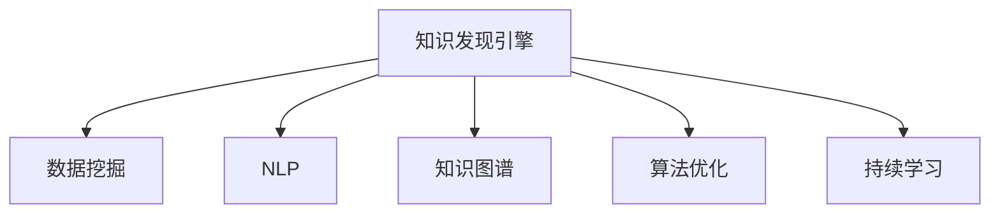

                 

# 程序员利用知识发现引擎提高创新力的方法

> 关键词：知识发现引擎,创新力,软件工程,数据挖掘,人工智能,智能辅助,算法优化

## 1. 背景介绍

### 1.1 问题由来
在当下竞争激烈的软件开发环境中，创新力已成为企业生存和发展的关键要素。然而，如何有效利用现有知识库，提高编程效率和代码质量，成为众多软件开发者的共同挑战。传统的代码复用、版本控制等方法，已难以适应日益复杂的软件开发需求。为此，知识发现引擎(Knowledge Discovery Engine, KDE)应运而生，利用数据挖掘和人工智能技术，从代码库和文档资料中挖掘出潜在知识，辅助程序员提高创新能力。

### 1.2 问题核心关键点
知识发现引擎的核心在于从代码库和文档资料中提取知识模式，辅助程序员快速定位问题、优化代码、创新设计。这包括：
- 知识抽取：从代码注释、开发日志、问题报告等非结构化文本中，自动抽取关键信息和知识片段。
- 知识关联：将抽取的知识片段进行关联，构建知识图谱，揭示代码库和文档间的内在联系。
- 智能推荐：基于关联的知识图谱，提供代码自动补全、设计模式推荐、问题诊断等功能。
- 持续学习：通过持续分析和挖掘新代码和新文档，更新知识图谱，增强知识发现引擎的智能水平。

这些核心功能使得知识发现引擎在提升程序员创新力方面具备巨大的潜力和应用前景。

## 2. 核心概念与联系

### 2.1 核心概念概述

为更好地理解知识发现引擎的工作原理和优化方向，本节将介绍几个密切相关的核心概念：

- 知识发现引擎(KDE)：利用数据挖掘和人工智能技术，从代码库和文档资料中提取和关联知识，辅助程序员提高创新能力。
- 数据挖掘(Data Mining)：从大量数据中挖掘出潜在知识模式和规律，广泛应用于金融、医疗、NLP等领域。
- 自然语言处理(NLP)：处理和分析人类语言的技术，常用于从代码注释、问题报告等文本中抽取关键信息。
- 知识图谱(Knowledge Graph)：将知识组织成图形化的网络结构，便于分析和查询，应用于各类知识工程系统。
- 算法优化(Algorithm Optimization)：通过优化算法提高程序性能和代码质量，常应用于编译器、代码生成器等工具中。
- 持续学习(Continuous Learning)：持续分析和挖掘新代码和新文档，更新知识图谱，增强知识发现引擎的智能水平。

这些核心概念之间的逻辑关系可以通过以下Mermaid流程图来展示：



这个流程图展示了几类关键技术之间的联系：

1. 知识发现引擎通过数据挖掘技术从代码库和文档资料中抽取知识模式。
2. 使用NLP技术从文本中提取关键信息。
3. 将提取的知识组织成知识图谱，便于分析和查询。
4. 通过算法优化提高程序的性能和代码质量。
5. 持续学习新的代码和文档，不断更新知识图谱，增强智能水平。

这些概念共同构成了知识发现引擎的核心技术框架，使其能够从大规模的软件工程项目中提取和应用知识，提升程序员的创新能力。

## 3. 核心算法原理 & 具体操作步骤
### 3.1 算法原理概述

知识发现引擎利用数据挖掘和人工智能技术，从代码库和文档资料中提取和关联知识，辅助程序员提高创新能力。其核心思想是：

1. **数据挖掘**：从代码库和文档资料中抽取结构化和非结构化数据。
2. **自然语言处理**：利用NLP技术从代码注释、开发日志、问题报告等文本中提取关键信息。
3. **知识图谱构建**：将抽取的知识组织成图形化的网络结构，揭示代码库和文档间的内在联系。
4. **智能推荐**：基于关联的知识图谱，提供代码自动补全、设计模式推荐、问题诊断等功能。
5. **持续学习**：通过持续分析和挖掘新代码和新文档，更新知识图谱，增强知识发现引擎的智能水平。

通过以上步骤，知识发现引擎能够辅助程序员快速定位问题、优化代码、创新设计，从而提高软件开发效率和代码质量。

### 3.2 算法步骤详解

知识发现引擎通常包括以下几个关键步骤：

**Step 1: 数据准备和预处理**
- 收集代码库、文档资料等数据，进行去重、格式化等预处理。
- 使用NLP技术对文本数据进行分词、命名实体识别、情感分析等处理，提取关键信息。

**Step 2: 知识抽取和关联**
- 利用文本挖掘技术，从代码注释、开发日志、问题报告等文本中抽取关键信息。
- 使用关联规则、网络分析等方法，将抽取的知识组织成知识图谱，揭示代码库和文档间的内在联系。

**Step 3: 智能推荐**
- 基于知识图谱，提供代码自动补全、设计模式推荐、问题诊断等功能。
- 使用协同过滤、深度学习等算法，对推荐结果进行优化，提高准确性和相关性。

**Step 4: 持续学习**
- 定期分析和挖掘新代码和新文档，更新知识图谱。
- 引入机器学习技术，对知识图谱进行动态调整和优化，增强智能水平。

**Step 5: 部署与应用**
- 将知识发现引擎集成到开发工具中，如IDE、版本控制系统等。
- 提供用户友好的界面和操作方式，方便程序员使用。

以上是知识发现引擎的一般流程。在实际应用中，还需要针对具体任务的特点，对各个环节进行优化设计，如改进文本挖掘算法、优化知识图谱构建方法、提升智能推荐精度等，以进一步提升知识发现引擎的效果。

### 3.3 算法优缺点

知识发现引擎具有以下优点：
1. 自动化高：从代码库和文档资料中自动化抽取和关联知识，减轻程序员的工作负担。
2. 覆盖广泛：能够涵盖代码库、文档资料、开发日志等多方面信息，全面支持软件开发。
3. 个性化强：基于用户行为和偏好，提供个性化的推荐和服务，提高用户体验。
4. 易于集成：可方便集成到开发工具中，如IDE、版本控制系统等，无缝对接现有工作流程。
5. 不断更新：通过持续学习和分析新代码和新文档，不断优化知识图谱，提升智能水平。

同时，知识发现引擎也存在一些局限性：
1. 数据质量和数量：依赖高质量、大数量的数据，获取难度较大。
2. 抽取精度：文本挖掘和知识抽取算法的精度直接影响推荐效果。
3. 适用场景：适用于已有知识模式和关系明确的场景，对于新颖问题或特殊领域可能效果有限。
4. 冷启动问题：对于新项目或新开发者，需要一定时间积累数据和知识，才能发挥最佳效果。

尽管存在这些局限性，但就目前而言，知识发现引擎在提高程序员创新力方面具备重要的应用价值。

### 3.4 算法应用领域

知识发现引擎在软件开发中的应用广泛，涵盖以下领域：

- 代码质量分析：通过分析代码质量、复杂度、重复度等指标，提供优化建议，提升代码质量。
- 问题定位与解决：利用知识图谱快速定位问题，提供解决方案，缩短故障处理时间。
- 设计模式推荐：从代码库中抽取设计模式，推荐给开发者，提升代码可维护性和可扩展性。
- 代码自动补全：基于知识图谱提供代码自动补全功能，提高编写效率。
- 持续集成与部署：集成知识发现引擎，优化持续集成和部署流程，提升软件交付效率。
- 团队协作与知识共享：通过知识图谱，促进团队成员之间的知识共享与协作，提高开发效率。

此外，知识发现引擎在其他领域也有广泛的应用，如医疗、金融、教育等，帮助用户从大量数据中挖掘出潜在知识，提升决策能力和创新水平。

## 4. 数学模型和公式 & 详细讲解 & 举例说明

### 4.1 数学模型构建

本节将使用数学语言对知识发现引擎的原理进行严格刻画。

设代码库包含 $N$ 个代码片段 $C=\{c_1, c_2, \cdots, c_N\}$，每个代码片段 $c_i$ 包含注释、开发日志等文本资料 $T_i$，描述代码片段的功能和实现细节。

知识发现引擎的数学模型构建分为以下步骤：

1. **文本挖掘**：使用NLP技术从 $T_i$ 中抽取关键信息，如方法名、变量名、函数调用等，构建特征向量 $F_i$。

2. **知识抽取**：利用关联规则、网络分析等方法，从 $F_i$ 中抽取知识模式，构建知识图谱 $G$。

3. **智能推荐**：基于知识图谱 $G$，使用协同过滤、深度学习等算法，提供代码自动补全、设计模式推荐、问题诊断等功能。

4. **持续学习**：通过定期分析和挖掘新代码和新文档，更新知识图谱 $G$，增强智能水平。

### 4.2 公式推导过程

以代码自动补全为例，推导知识发现引擎的实现原理。

假设代码片段 $c_i$ 中的变量名、方法名、函数调用等关键信息已经抽取，构建特征向量 $F_i$。知识发现引擎利用知识图谱 $G$ 提供代码自动补全功能，具体步骤如下：

1. **构建知识图谱**：将 $F_i$ 中出现的关键信息作为节点，将关键信息之间的关系作为边，构建知识图谱 $G$。

2. **匹配知识图谱**：对于输入的代码片段 $c_j$，将其中的变量名、方法名等关键信息作为查询，在知识图谱 $G$ 中匹配相关的代码片段 $c_k$。

3. **推荐代码片段**：将 $c_k$ 的代码片段推荐给用户，作为代码自动补全的候选答案。

数学上，可以表示为：

$$
\text{Recommendation}(c_j) = \text{Match}(c_j, G)
$$

其中 $\text{Match}(c_j, G)$ 表示在知识图谱 $G$ 中匹配与 $c_j$ 相关的代码片段 $c_k$，可以采用基于图神经网络、图匹配算法等方法实现。

### 4.3 案例分析与讲解

以一个简单的代码库为例，展示知识发现引擎的具体应用：

```python
# 代码库
code_library = {
    'c1': 'def func1():\n    print("Hello, World!")',
    'c2': 'def func2(x):\n    return x * 2',
    'c3': 'def func3(x, y):\n    return x + y'
}
```

**Step 1: 数据准备和预处理**
- 收集代码片段 $c_1, c_2, c_3$，并进行去重、格式化等预处理。
- 使用NLP技术对代码片段的注释、开发日志等文本数据进行分词、命名实体识别、情感分析等处理，提取关键信息。

**Step 2: 知识抽取和关联**
- 利用文本挖掘技术，从代码注释、开发日志等文本中抽取关键信息，如方法名、变量名、函数调用等。
- 使用关联规则、网络分析等方法，将抽取的知识组织成知识图谱，揭示代码库和文档间的内在联系。

**Step 3: 智能推荐**
- 基于知识图谱，提供代码自动补全、设计模式推荐、问题诊断等功能。
- 使用协同过滤、深度学习等算法，对推荐结果进行优化，提高准确性和相关性。

**Step 4: 持续学习**
- 定期分析和挖掘新代码和新文档，更新知识图谱。
- 引入机器学习技术，对知识图谱进行动态调整和优化，增强智能水平。

## 5. 项目实践：代码实例和详细解释说明
### 5.1 开发环境搭建

在进行知识发现引擎实践前，我们需要准备好开发环境。以下是使用Python进行Jupyter Notebook开发的环境配置流程：

1. 安装Anaconda：从官网下载并安装Anaconda，用于创建独立的Python环境。

2. 创建并激活虚拟环境：
```bash
conda create -n kde-env python=3.8 
conda activate kde-env
```

3. 安装相关库：
```bash
pip install nltk gensim networkx scikit-learn py2neo graphviz
```

4. 安装Jupyter Notebook：
```bash
pip install jupyter notebook
```

5. 启动Jupyter Notebook服务：
```bash
jupyter notebook
```

完成上述步骤后，即可在`kde-env`环境中开始知识发现引擎的开发实践。

### 5.2 源代码详细实现

下面我们以知识图谱的构建为例，给出使用Python和NetworkX库进行知识图谱构建的代码实现。

```python
import networkx as nx
import gensim

# 构建知识图谱
G = nx.DiGraph()

# 代码库中的所有代码片段
code_library = {
    'c1': 'def func1():\n    print("Hello, World!")',
    'c2': 'def func2(x):\n    return x * 2',
    'c3': 'def func3(x, y):\n    return x + y'
}

# 从代码片段中抽取关键信息
for code in code_library.values():
    lines = code.split('\n')
    for line in lines:
        tokens = line.strip().split()
        method_name = tokens[0]
        variable_names = [token for token in tokens if token.isalpha()]
        function_calls = [token for token in tokens if token.isalnum()]

        # 将抽取的关键信息添加到知识图谱中
        G.add_node(method_name, name=method_name)
        for variable in variable_names:
            G.add_node(variable, name=variable)
            G.add_edge(method_name, variable)
        for function_call in function_calls:
            G.add_node(function_call, name=function_call)
            G.add_edge(method_name, function_call)

# 可视化知识图谱
pos = nx.spring_layout(G)
nx.draw(G, pos=pos, with_labels=True)
```

以上代码实现了从代码片段中抽取关键信息，构建知识图谱，并可视化展示知识图谱的过程。可以看到，通过简单的文本挖掘和知识抽取，我们就能够构建出代码库的知识图谱，并利用图形化的方式展示代码间的内在联系。

### 5.3 代码解读与分析

让我们再详细解读一下关键代码的实现细节：

**知识图谱构建**：
- 使用NetworkX库构建一个有向图 $G$。
- 遍历代码库中的每个代码片段，解析代码行的内容，抽取方法名、变量名、函数调用等关键信息。
- 将抽取的关键信息作为节点添加到知识图谱 $G$ 中，并建立对应的边，表示关键信息之间的关系。

**可视化展示**：
- 使用spring_layout方法计算节点的位置，使用nx.draw方法绘制知识图谱，并展示每个节点的名称。

以上代码展示了知识图谱构建的基本流程，开发者可以通过进一步扩展和优化，实现更复杂的知识抽取和关联算法，构建更全面、精确的知识图谱。

## 6. 实际应用场景

### 6.1 软件开发中的知识发现

在软件开发过程中，知识发现引擎可以广泛应用于以下场景：

- **代码质量分析**：通过分析代码质量、复杂度、重复度等指标，提供优化建议，提升代码质量。
- **问题定位与解决**：利用知识图谱快速定位问题，提供解决方案，缩短故障处理时间。
- **设计模式推荐**：从代码库中抽取设计模式，推荐给开发者，提升代码可维护性和可扩展性。
- **代码自动补全**：基于知识图谱提供代码自动补全功能，提高编写效率。
- **持续集成与部署**：集成知识发现引擎，优化持续集成和部署流程，提升软件交付效率。

以代码自动补全为例，假设我们有一个正在编写的函数，代码片段如下：

```python
def func():
    # 代码
```

此时，知识发现引擎可以自动从代码库中搜索与 `func` 相关的函数和方法，推荐给用户作为代码自动补全的候选答案。例如，如果代码库中包含如下代码片段：

```python
def func1(x):
    return x * 2
```

则知识发现引擎会将 `func1` 推荐给用户，并提供参数列表、函数描述等信息，帮助用户更快速地编写代码。

### 6.2 学术研究中的知识发现

在学术研究中，知识发现引擎同样可以发挥重要作用。例如，研究人员可以借助知识图谱分析文献中的关键技术、算法和应用，快速定位相关论文和研究团队。

以论文推荐为例，假设研究人员需要查找关于深度学习在自然语言处理中的应用，知识发现引擎可以通过分析已有文献，构建一个涵盖深度学习、自然语言处理等领域的知识图谱，并推荐给用户相关论文。用户可以在图谱中找到感兴趣的论文，并进一步阅读其引文和引用情况，获取更全面的研究成果。

### 6.3 教育培训中的知识发现

在教育培训领域，知识发现引擎可以用于辅助教师和学生提高学习效率。例如，教师可以利用知识图谱推荐相关教材、课程和案例，帮助学生更好地理解和掌握课程内容。

以编程课程为例，教师可以将已有的课程和教材信息组织成知识图谱，并根据学生的学习进度和兴趣推荐相关内容。例如，学生学习了函数调用和变量赋值的基础知识后，教师可以推荐包含这些知识点的代码片段和示例，帮助学生更好地理解和应用。

## 7. 工具和资源推荐
### 7.1 学习资源推荐

为了帮助开发者系统掌握知识发现引擎的理论基础和实践技巧，这里推荐一些优质的学习资源：

1. **《数据挖掘导论》**：斯坦福大学Data Science课程，详细介绍了数据挖掘的基础理论和常用算法。
2. **《自然语言处理综论》**：清华大学自然语言处理课程，涵盖了NLP的核心技术和应用场景。
3. **《Python网络编程》**：网络编程基础教程，介绍了使用Python进行网络编程的常用方法和技术。
4. **《知识图谱与语义计算》**：深入浅出地介绍了知识图谱的基本概念和应用场景。
5. **《深度学习与模式识别》**：斯坦福大学深度学习课程，介绍了深度学习的基本原理和常用模型。

通过这些资源的学习实践，相信你一定能够快速掌握知识发现引擎的精髓，并用于解决实际的NLP问题。

### 7.2 开发工具推荐

高效的开发离不开优秀的工具支持。以下是几款用于知识发现引擎开发的常用工具：

1. **Jupyter Notebook**：免费的交互式开发环境，支持Python代码的快速原型开发和结果展示。
2. **PyTorch**：开源深度学习框架，支持高效的神经网络模型训练和推理。
3. **TensorFlow**：Google主导的深度学习框架，生产部署方便，支持多种模型和算法。
4. **NetworkX**：Python的网络图库，支持大规模知识图谱的构建和分析。
5. **Gensim**：Python的自然语言处理库，支持主题建模、相似度计算等任务。
6. **Py2neo**：Python的GraphDB客户端，支持对Neo4j等图数据库的操作。

合理利用这些工具，可以显著提升知识发现引擎的开发效率，加快创新迭代的步伐。

### 7.3 相关论文推荐

知识发现引擎的研究方向涉及数据挖掘、自然语言处理、图数据库等多个领域，以下是几篇奠基性的相关论文，推荐阅读：

1. **"《Apache Jena: A Metaphor for Web and Semantic Applications"**：介绍了Jena知识图谱框架的设计和实现，详细说明了如何使用RDF描述和查询知识图谱。
2. **"《Semantic Web Data Mining》**：总结了语义Web数据挖掘的研究进展和技术框架，涵盖了知识抽取、模式发现、应用建模等多个方面。
3. **"《Knowledge Discovery in Databases: An Overview》**：综述了知识发现领域的主要研究方法、技术和应用，涵盖数据挖掘、数据预处理、知识表示等多个方面。
4. **"《Deep Learning》**：深度学习领域的经典教材，介绍了深度学习的基本原理和常用模型。
5. **"《Python Data Science Handbook》**：介绍了使用Python进行数据科学项目开发的实用方法，涵盖数据清洗、探索性分析、模型训练等多个方面。

这些论文代表了大规模知识发现引擎的研究脉络，通过学习这些前沿成果，可以帮助研究者把握学科前进方向，激发更多的创新灵感。

## 8. 总结：未来发展趋势与挑战

### 8.1 总结

本文对知识发现引擎的原理和实践进行了全面系统的介绍。首先阐述了知识发现引擎在提高程序员创新力方面的重要应用，明确了知识发现引擎在软件开发、学术研究、教育培训等领域的多样化价值。其次，从原理到实践，详细讲解了知识发现引擎的数学模型、算法步骤和具体实现，提供了完整的代码实例。同时，本文还广泛探讨了知识发现引擎在实际应用中的多种场景，展示了其广泛的应用前景。

通过本文的系统梳理，可以看到，知识发现引擎在提升程序员创新力方面具备巨大的潜力和应用价值。这些核心技术的不断发展和优化，必将推动知识发现引擎在更多领域得到应用，为人工智能技术的普及和应用带来新的突破。

### 8.2 未来发展趋势

展望未来，知识发现引擎将呈现以下几个发展趋势：

1. **自动化水平提升**：随着自然语言处理和数据挖掘技术的不断进步，知识发现引擎的自动化水平将进一步提升，减轻程序员的工作负担。
2. **覆盖领域扩展**：知识发现引擎将从软件开发逐步扩展到更多领域，如医疗、金融、教育等，帮助用户从大量数据中挖掘出潜在知识，提升决策能力和创新水平。
3. **知识图谱丰富化**：通过引入更多领域知识和数据，知识图谱将变得更加丰富和全面，能够更好地支持用户的学习、研究和设计。
4. **深度学习融合**：将深度学习技术引入知识图谱的构建和分析中，提升知识发现引擎的智能水平，更好地识别和理解复杂模式。
5. **多模态融合**：结合文本、图像、语音等多种数据模态，构建多模态知识图谱，提升知识发现引擎的全面性和准确性。

以上趋势凸显了知识发现引擎在提高程序员创新力方面的广阔前景，这些方向的探索发展，必将进一步提升知识发现引擎的效果和智能水平。

### 8.3 面临的挑战

尽管知识发现引擎在提高程序员创新力方面取得了一定的成果，但在迈向更加智能化、普适化应用的过程中，它仍面临着诸多挑战：

1. **数据质量和数量**：依赖高质量、大数量的数据，获取难度较大。
2. **知识抽取精度**：文本挖掘和知识抽取算法的精度直接影响推荐效果。
3. **适用场景**：适用于已有知识模式和关系明确的场景，对于新颖问题或特殊领域可能效果有限。
4. **冷启动问题**：对于新项目或新开发者，需要一定时间积累数据和知识，才能发挥最佳效果。
5. **计算资源消耗**：构建和分析大规模知识图谱需要较大的计算资源，可能存在计算成本高昂的问题。

尽管存在这些挑战，但通过不断优化算法和技术，知识发现引擎有望克服这些障碍，更好地服务于软件开发和创新。

### 8.4 研究展望

面对知识发现引擎面临的挑战，未来的研究需要在以下几个方面寻求新的突破：

1. **多领域知识融合**：结合更多领域知识，构建更加全面和精确的知识图谱，提升知识发现引擎的泛化能力和应用范围。
2. **高效算法优化**：开发更高效的算法和数据结构，降低计算资源消耗，提升知识发现引擎的运行效率和性能。
3. **智能推荐优化**：引入深度学习等高级技术，优化推荐算法，提升推荐结果的准确性和相关性。
4. **知识图谱动态化**：设计动态知识图谱构建算法，根据用户行为和偏好实时更新知识图谱，增强智能水平。
5. **跨领域知识迁移**：通过跨领域知识迁移技术，将知识发现引擎应用于更多领域，提升其应用范围和价值。

这些研究方向的探索，必将引领知识发现引擎技术迈向更高的台阶，为知识工程的普及和应用带来新的突破。面向未来，知识发现引擎需要与其他人工智能技术进行更深入的融合，如深度学习、自然语言处理、知识表示等，多路径协同发力，共同推动知识发现引擎的发展和创新。

## 9. 附录：常见问题与解答

**Q1：知识发现引擎的构建需要依赖大量数据吗？**

A: 知识发现引擎的构建确实需要依赖高质量、大数量的数据。这些数据通常包括代码库、文档资料、开发日志等，能够全面覆盖项目的各个方面。数据质量和数量的提升，将直接提升知识发现引擎的性能和效果。

**Q2：如何提升知识发现引擎的知识抽取精度？**

A: 提升知识抽取精度的方法包括：
1. 优化文本挖掘算法，引入更多的语言特征和规则，提高抽取的准确性。
2. 使用深度学习等高级技术，如BERT、GPT等预训练模型，提升抽取的精确度。
3. 引入知识图谱，对抽取的关键信息进行关系分析，提高抽取的全面性和准确性。
4. 定期更新和维护数据集，避免知识抽取算法的过拟合和偏见。

**Q3：知识发现引擎在软件开发中的应用场景有哪些？**

A: 知识发现引擎在软件开发中的应用场景包括：
1. 代码质量分析：通过分析代码质量、复杂度、重复度等指标，提供优化建议，提升代码质量。
2. 问题定位与解决：利用知识图谱快速定位问题，提供解决方案，缩短故障处理时间。
3. 设计模式推荐：从代码库中抽取设计模式，推荐给开发者，提升代码可维护性和可扩展性。
4. 代码自动补全：基于知识图谱提供代码自动补全功能，提高编写效率。
5. 持续集成与部署：集成知识发现引擎，优化持续集成和部署流程，提升软件交付效率。
6. 团队协作与知识共享：通过知识图谱，促进团队成员之间的知识共享与协作，提高开发效率。

**Q4：知识发现引擎在实际应用中需要注意哪些问题？**

A: 在实际应用中，知识发现引擎需要注意以下问题：
1. 数据质量和数量：依赖高质量、大数量的数据，获取难度较大，需要不断优化数据采集和预处理流程。
2. 知识抽取精度：文本挖掘和知识抽取算法的精度直接影响推荐效果，需要不断优化算法和技术。
3. 适用场景：适用于已有知识模式和关系明确的场景，对于新颖问题或特殊领域可能效果有限，需要不断扩展知识库和算法。
4. 计算资源消耗：构建和分析大规模知识图谱需要较大的计算资源，可能存在计算成本高昂的问题，需要优化算法和资源使用。
5. 智能推荐优化：通过深度学习等高级技术，优化推荐算法，提升推荐结果的准确性和相关性。

**Q5：如何改进知识发现引擎的持续学习能力？**

A: 改进知识发现引擎的持续学习能力的方法包括：
1. 引入机器学习技术，对知识图谱进行动态调整和优化，增强智能水平。
2. 引入跨领域知识迁移技术，将知识发现引擎应用于更多领域，提升其应用范围和价值。
3. 设计动态知识图谱构建算法，根据用户行为和偏好实时更新知识图谱，增强智能水平。
4. 引入多模态数据融合技术，结合文本、图像、语音等多种数据模态，提升知识发现引擎的全面性和准确性。

这些改进措施将帮助知识发现引擎更好地适应数据和任务的变化，持续提升其智能水平和应用效果。

---

作者：禅与计算机程序设计艺术 / Zen and the Art of Computer Programming

