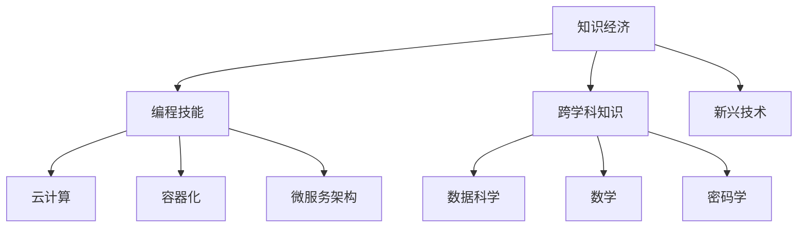

                 

# 程序员在知识经济时代的发展趋势

在知识经济的时代，程序员作为信息技术领域的中坚力量，其发展趋势和所面临的机遇与挑战，成为了一个值得深入探讨的话题。本文将从背景介绍、核心概念、算法原理、数学模型、项目实践、应用场景、工具资源、总结展望以及常见问题等维度，全面分析程序员在知识经济时代的发展趋势。

## 1. 背景介绍

### 1.1 知识经济的兴起
21世纪以来，全球进入了一个以知识驱动经济增长的新阶段。知识经济以信息技术、网络技术、数据科学为支撑，以知识创造、应用和传播为核心，呈现出快速增长和深度融合的特征。编程语言、算法框架和软件开发工具的不断迭代，使得程序员在知识经济时代的重要性日益凸显。

### 1.2 编程技能与知识体系的变化
随着知识经济的演进，程序员的技能需求和知识体系也在发生变化。大数据、人工智能、区块链等新兴技术的应用，使得程序员需要掌握更多的跨学科知识，如数据科学、数学模型、密码学等。同时，云计算、容器化、微服务等新兴架构的兴起，也对程序员的基础架构技能提出了更高的要求。

## 2. 核心概念与联系

### 2.1 核心概念概述

为更好地理解程序员在知识经济时代的发展趋势，本节将介绍几个密切相关的核心概念：

- 知识经济（Knowledge Economy）：以知识为基础的经济模式，强调知识创新、传播和应用在经济增长中的关键作用。
- 编程技能（Programming Skills）：程序员所具备的技术技能，包括编程语言、算法、数据结构、软件工程等。
- 跨学科知识（Interdisciplinary Knowledge）：程序员需要掌握的多领域知识，如数据科学、数学、密码学等。
- 新兴技术（Emerging Technologies）：如大数据、人工智能、区块链等，是知识经济时代的重要驱动力。
- 云计算（Cloud Computing）：基于互联网的计算服务模式，改变了传统的软件部署和运维方式。
- 容器化（Containerization）：通过容器技术实现应用的快速部署和高效管理。
- 微服务架构（Microservices Architecture）：将大型应用拆分成小型、独立的服务，提高系统的灵活性和可扩展性。

这些核心概念之间的逻辑关系可以通过以下Mermaid流程图来展示：



这个流程图展示了知识经济对程序员技能和知识体系的多维度影响。

## 3. 核心算法原理 & 具体操作步骤
### 3.1 算法原理概述

程序员在知识经济时代的发展，离不开对前沿算法和技术的掌握。这里我们将重点介绍几种核心算法及其操作步骤。

- 机器学习（Machine Learning）：程序员需要掌握基本的机器学习算法，如监督学习、无监督学习、强化学习等。
- 深度学习（Deep Learning）：通过神经网络结构实现对复杂数据模式的拟合，程序员需要了解反向传播、梯度下降等基本概念。
- 自然语言处理（NLP）：处理和理解自然语言的技术，程序员需要掌握词嵌入、RNN、Transformer等模型。
- 数据挖掘（Data Mining）：从大量数据中发现有用信息和知识，程序员需要熟悉关联规则、聚类、分类等技术。

### 3.2 算法步骤详解

这里以机器学习中的监督学习为例，介绍其基本步骤：

1. 数据准备：收集训练数据集，并进行数据清洗和预处理。
2. 模型选择：选择合适的算法模型，如线性回归、逻辑回归、决策树等。
3. 模型训练：使用训练数据集训练模型，调整模型参数以最小化损失函数。
4. 模型评估：使用测试数据集评估模型性能，选择合适的性能指标，如准确率、召回率、F1-score等。
5. 模型优化：根据评估结果调整模型参数，进行交叉验证和超参数调优。
6. 模型应用：将训练好的模型应用到实际问题中，进行预测或分类。

### 3.3 算法优缺点

监督学习具有以下优点：
1. 模型性能稳定：在标注数据充足的情况下，监督学习能够得到较为准确的模型。
2. 泛化能力强：经过充分训练的模型，对未知数据的泛化能力较强。
3. 可解释性强：监督学习模型具有明确的预测规则，易于解释和理解。

同时，监督学习也存在以下缺点：
1. 数据标注成本高：监督学习需要大量标注数据，标注成本较高。
2. 模型依赖数据：模型性能受训练数据的影响较大，数据偏差可能导致模型过拟合。
3. 特征工程复杂：需要手动设计特征，特征选择和构造对模型性能影响较大。

### 3.4 算法应用领域

监督学习在多个领域都有广泛应用，例如：

- 推荐系统：通过用户行为数据进行预测，推荐个性化内容。
- 金融风控：通过历史交易数据进行风险评估和欺诈检测。
- 医疗诊断：通过患者历史数据进行疾病预测和诊断。
- 自然语言处理：通过标注数据进行语言模型训练和文本分类。

## 4. 数学模型和公式 & 详细讲解 & 举例说明

### 4.1 数学模型构建

监督学习的数学模型通常包括训练数据集 $D=\{(x_i,y_i)\}_{i=1}^N$，其中 $x_i$ 为输入特征，$y_i$ 为标签。

### 4.2 公式推导过程

以线性回归为例，其数学模型为：

$$ y_i = w_0 + w_1x_{i1} + w_2x_{i2} + \cdots + w_nx_{in} + \epsilon_i $$

其中 $w_0, w_1, \cdots, w_n$ 为模型参数，$\epsilon_i$ 为误差项。

线性回归的损失函数为均方误差（MSE）：

$$ L(w) = \frac{1}{2N}\sum_{i=1}^N (y_i - \hat{y}_i)^2 $$

其中 $\hat{y}_i = w_0 + w_1x_{i1} + w_2x_{i2} + \cdots + w_nx_{in}$。

求解最小化损失函数的过程，可以通过梯度下降算法实现：

$$ w_{k+1} = w_k - \alpha \frac{\partial L(w_k)}{\partial w_k} $$

其中 $\alpha$ 为学习率。

### 4.3 案例分析与讲解

假设有一组房价数据，通过线性回归模型进行预测，其中 $x_1$ 为房屋面积，$x_2$ 为房屋位置，$y$ 为房价。模型参数为 $w_0, w_1, w_2$。

- 数据准备：收集历史房价数据，进行数据清洗和标准化。
- 模型选择：选择线性回归模型。
- 模型训练：使用梯度下降算法训练模型，调整参数 $w_0, w_1, w_2$。
- 模型评估：使用测试集评估模型性能，输出预测房价。
- 模型优化：根据评估结果调整参数，提高预测精度。

## 5. 项目实践：代码实例和详细解释说明
### 5.1 开发环境搭建

在进行机器学习项目开发前，我们需要准备好开发环境。以下是使用Python进行Scikit-learn开发的环境配置流程：

1. 安装Anaconda：从官网下载并安装Anaconda，用于创建独立的Python环境。

2. 创建并激活虚拟环境：
```bash
conda create -n py-env python=3.8 
conda activate py-env
```

3. 安装Scikit-learn：
```bash
conda install scikit-learn
```

4. 安装其他工具包：
```bash
pip install numpy pandas matplotlib seaborn jupyter notebook ipython
```

完成上述步骤后，即可在`py-env`环境中开始项目开发。

### 5.2 源代码详细实现

以下是一个使用Scikit-learn库进行线性回归模型开发的Python代码示例：

```python
from sklearn.model_selection import train_test_split
from sklearn.linear_model import LinearRegression
from sklearn.metrics import mean_squared_error
import numpy as np
import pandas as pd

# 加载数据集
data = pd.read_csv('house_prices.csv')

# 数据预处理
X = data[['area', 'location']]
y = data['price']

# 数据分割
X_train, X_test, y_train, y_test = train_test_split(X, y, test_size=0.2, random_state=42)

# 模型训练
model = LinearRegression()
model.fit(X_train, y_train)

# 模型评估
y_pred = model.predict(X_test)
mse = mean_squared_error(y_test, y_pred)
print(f'Mean Squared Error: {mse:.2f}')
```

以上代码展示了线性回归模型的完整实现流程，从数据加载、预处理、模型训练到评估，每一步都有详细的注释。

### 5.3 代码解读与分析

让我们再详细解读一下关键代码的实现细节：

- `train_test_split`函数：用于数据集的分割，将数据集分为训练集和测试集。
- `LinearRegression`类：定义线性回归模型。
- `mean_squared_error`函数：计算均方误差，用于模型评估。

## 6. 实际应用场景
### 6.1 金融风控

金融行业的数据标注成本较高，但监督学习模型在风险评估和欺诈检测方面具有显著优势。通过历史交易数据训练模型，可以对新交易进行风险评估，及时发现异常行为，减少损失。

### 6.2 医疗诊断

医疗行业的数据标注复杂，监督学习模型通过患者历史数据进行疾病预测和诊断，提高了诊断的准确率和效率。例如，通过影像数据训练的卷积神经网络，可以对X光片进行肺部疾病的自动诊断。

### 6.3 推荐系统

推荐系统需要大量用户行为数据进行训练，监督学习模型通过用户历史行为预测推荐内容，提高用户满意度，增加用户粘性。例如，电商平台通过监督学习模型推荐商品，提升销售转化率。

### 6.4 自然语言处理

自然语言处理任务如文本分类、命名实体识别、情感分析等，都需要大量的标注数据。监督学习模型通过标注数据训练语言模型，提高文本处理的准确率和泛化能力。例如，通过标注数据训练的BERT模型，可以对文本进行情感分类。

## 7. 工具和资源推荐
### 7.1 学习资源推荐

为了帮助程序员掌握前沿技能，推荐以下学习资源：

1. 《机器学习实战》：适合入门学习，通过实际案例理解机器学习算法。
2. 《深度学习》（Ian Goodfellow等著）：深度学习领域的经典教材，涵盖深度学习的基本概念和算法。
3. 《自然语言处理综论》：介绍自然语言处理的基本概念和技术，涵盖NLP的多个领域。
4. Kaggle：数据科学竞赛平台，提供海量数据集和开源代码，可以实践机器学习项目。
5. Coursera：在线学习平台，提供多门机器学习和数据科学的课程，如Andrew Ng的《机器学习》课程。

### 7.2 开发工具推荐

以下是几款用于机器学习项目开发的常用工具：

1. Scikit-learn：Python的机器学习库，提供了丰富的算法和工具，适合初学者入门。
2. TensorFlow：Google开源的深度学习框架，支持分布式计算，适合大规模模型训练。
3. PyTorch：Facebook开源的深度学习框架，支持动态计算图，易于调试和优化。
4. Jupyter Notebook：基于Web的交互式计算环境，支持代码实现和结果展示，适合数据分析和机器学习项目。
5. Anaconda：Python环境的统一管理工具，支持虚拟环境创建和依赖管理。

### 7.3 相关论文推荐

以下是几篇奠基性的机器学习相关论文，推荐阅读：

1. J. Nocedal and S. J. Wright, *Numerical Optimization* (2006)：介绍数值优化算法，适用于机器学习模型的参数优化。
2. G. Hinton et al., *A Neural Network for Machine Learning* (1989)：介绍多层感知器，是深度学习的开端。
3. Y. Bengio et al., *Representation Learning: A Review and New Perspectives* (2015)：综述机器学习和深度学习的最新进展。
4. Y. LeCun et al., *Deep Learning* (2015)：深度学习领域的经典教材，涵盖深度学习的基本概念和算法。

## 8. 总结：未来发展趋势与挑战
### 8.1 总结

本文对程序员在知识经济时代的发展趋势进行了全面系统的介绍。首先阐述了知识经济对程序员技能和知识体系的多维度影响，明确了监督学习在多个领域的应用价值。其次，从原理到实践，详细讲解了监督学习的数学模型和操作步骤，给出了机器学习项目开发的完整代码示例。同时，本文还广泛探讨了监督学习模型在金融风控、医疗诊断、推荐系统、自然语言处理等多个行业领域的应用前景，展示了监督学习技术的巨大潜力。最后，本文精选了监督学习技术的各类学习资源，力求为读者提供全方位的技术指引。

通过本文的系统梳理，可以看到，程序员在知识经济时代面临着前所未有的发展机遇和挑战。未来，随着新兴技术和大数据的发展，程序员需要不断学习和掌握新技能，紧跟技术前沿，才能在激烈的市场竞争中占据优势。

### 8.2 未来发展趋势

展望未来，程序员在知识经济时代的发展趋势将呈现以下几个方向：

1. 跨领域技能融合：随着知识经济的发展，程序员需要掌握更多跨学科技能，如数据科学、数学模型、密码学等。
2. 新兴技术应用：大数据、人工智能、区块链等新兴技术的应用，将为程序员带来新的发展机遇。
3. 软件开发工具升级：云计算、容器化、微服务等新兴架构的普及，将推动软件开发工具的不断升级。
4. 软件工程实践创新：敏捷开发、DevOps、持续集成等软件工程实践的创新，将提升程序员的开发效率和系统稳定性。
5. 人工智能融合：程序员需要掌握更多人工智能技术，如图像处理、自然语言处理等，实现多模态数据的协同建模。

### 8.3 面临的挑战

尽管程序员在知识经济时代的发展充满机遇，但也面临诸多挑战：

1. 学习曲线陡峭：新兴技术和大数据的发展，要求程序员不断学习和掌握新技能，学习曲线较陡。
2. 数据量和质量问题：数据标注成本高，数据质量差，将影响模型的训练效果。
3. 技术更新速度快：新技术和新工具层出不穷，程序员需要不断更新知识体系，保持技术敏锐度。
4. 工程实践难度高：复杂的系统架构和微服务化设计，对程序员的工程实践能力提出了更高的要求。
5. 市场竞争激烈：知识经济时代，技术的更新迭代速度加快，市场竞争激烈，程序员需要不断提升自己的竞争力。

### 8.4 研究展望

面对程序员在知识经济时代面临的挑战，未来的研究需要在以下几个方面寻求新的突破：

1. 提升数据标注效率：通过自动标注和半监督学习等技术，降低数据标注的复杂性和成本。
2. 优化模型训练过程：通过高效的模型压缩和参数优化技术，提升模型的训练速度和效率。
3. 增强模型可解释性：通过可解释性技术，如因果推断、规则引擎等，提升模型的透明性和可解释性。
4. 促进跨领域合作：促进程序员与其他领域的专家合作，实现技术交叉融合和创新。
5. 推动伦理和社会责任：在技术研发过程中，注重算法伦理和社会责任，确保技术应用的安全和公正。

这些研究方向的探索，将为程序员在知识经济时代的发展提供新的思路和方法，推动编程技术和软件工程的发展。

## 9. 附录：常见问题与解答

**Q1：程序员需要掌握哪些新兴技术？**

A: 程序员需要掌握的新兴技术包括但不限于：
1. 大数据技术：如Hadoop、Spark等，用于处理海量数据。
2. 人工智能技术：如深度学习、自然语言处理、计算机视觉等，用于实现智能应用。
3. 区块链技术：用于实现去中心化应用和安全交易。
4. 云计算技术：如AWS、Azure、Google Cloud等，用于实现分布式计算和存储。
5. 容器化技术：如Docker、Kubernetes等，用于实现应用的快速部署和弹性扩展。

**Q2：程序员如何提高学习效率？**

A: 程序员可以通过以下方式提高学习效率：
1. 制定学习计划：明确学习目标和计划，有针对性地学习。
2. 利用在线资源：利用在线课程、视频教程和文档，方便随时随地学习。
3. 实践和项目：通过实际项目实践，加深理解和技术掌握。
4. 加入社区：加入技术社区，与同行交流，分享经验和资源。
5. 持续学习：技术更新迭代快，需要持续学习和更新知识体系。

**Q3：程序员如何进行软件架构设计？**

A: 程序员在进行软件架构设计时，可以遵循以下步骤：
1. 需求分析：明确系统的需求和功能。
2. 模块划分：将系统划分为多个模块，每个模块负责独立的业务功能。
3. 技术选型：选择适合的技术栈和工具，如前端框架、后端语言等。
4. 设计模式：引入设计模式，提升系统的可扩展性和可维护性。
5. 系统集成：将各个模块进行集成和测试，确保系统功能的完整性和正确性。
6. 性能优化：对系统进行性能分析和优化，提升系统的响应速度和吞吐量。

**Q4：程序员如何应对市场竞争？**

A: 程序员可以采取以下措施应对市场竞争：
1. 提升技能水平：不断学习和掌握新技能，保持技术前沿。
2. 创新项目实践：创新开发项目，实现技术突破和应用创新。
3. 网络化协作：加入技术社区和开源项目，扩大影响力和资源共享。
4. 品牌塑造：建立个人品牌，提升个人在行业内的知名度和影响力。
5. 持续改进：持续改进技术和管理方法，提升自身和团队的工作效率。

---

作者：禅与计算机程序设计艺术 / Zen and the Art of Computer Programming

