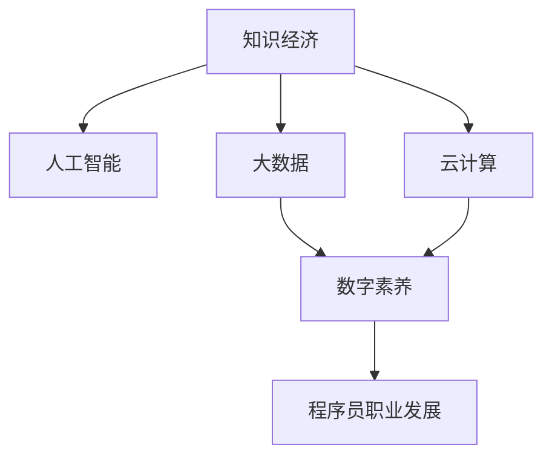

                 

# 程序员在知识经济时代的职业发展机会

> 关键词：知识经济, 职业发展, 人工智能, 大数据, 软件开发, 创业机会, 数据分析, 云计算, 数字素养

## 1. 背景介绍

### 1.1 问题由来

在信息爆炸和科技迅猛发展的今天，知识经济正在重塑全球经济格局。随着数字化、网络化、智能化进程的加速，程序员作为知识经济的核心力量，迎来了前所未有的发展机遇。程序员不仅在传统的软件开发、系统维护等领域继续发挥着重要作用，还被推向了大数据、人工智能、云计算、物联网等新兴技术的前沿。

### 1.2 问题核心关键点

随着知识经济的深入发展，程序员的职业发展呈现出以下几个关键点：

- **技术栈的快速演变**：新技术、新框架、新工具层出不穷，程序员需要不断学习和适应。
- **跨学科知识融合**：编程不再仅限于传统的计算机科学，而是与其他学科如数学、生物、物理、社会科学等领域紧密结合。
- **数据驱动决策**：程序员需要具备处理和分析大数据的能力，用数据支持业务决策。
- **持续创新与创业**：知识经济时代鼓励创新，程序员可以更容易地将想法转化为产品，形成创业机会。

### 1.3 问题研究意义

掌握知识经济时代的发展趋势，对于程序员的职业规划和技能提升具有重要意义。本文将从多个角度深入探讨程序员在知识经济时代的职业发展机会，旨在帮助程序员把握技术变革的脉搏，抓住机遇，实现职业生涯的跨越式发展。

## 2. 核心概念与联系

### 2.1 核心概念概述

在知识经济时代，程序员面临一系列新的职业发展机会，这些机会涉及多个核心概念：

- **知识经济**：以知识为核心资源的经济形态，强调知识和信息的重要性。
- **人工智能(AI)**：通过机器学习、深度学习等技术，使机器具备类似人类的智能。
- **大数据**：海量、高速、多样化的数据集，需采用先进的数据处理技术来提取价值。
- **云计算**：通过网络提供按需计算资源和其它IT服务的模式。
- **数字素养**：理解和应用数字工具和知识的能力，包括编程、数据分析、网络安全等。

这些概念之间相互联系，共同构成了知识经济时代程序员的职业发展环境。

### 2.2 核心概念原理和架构的 Mermaid 流程图



这个流程图展示了知识经济时代程序员职业发展的核心概念及其相互关系。知识经济提供了背景，人工智能、大数据和云计算是关键技术手段，数字素养是程序员必备的能力，而程序员职业发展是整个架构的最终目标。

## 3. 核心算法原理 & 具体操作步骤

### 3.1 算法原理概述

程序员在知识经济时代的职业发展，离不开算法和技术原理的支撑。以下是几个核心算法原理的概述：

- **机器学习**：程序员需要掌握机器学习的基本原理，包括监督学习、无监督学习、强化学习等，并能在实际项目中应用这些技术。
- **深度学习**：了解神经网络、卷积神经网络(CNN)、循环神经网络(RNN)等深度学习模型，并能够在图像识别、自然语言处理等领域进行应用。
- **数据结构与算法**：深入理解数据结构（如树、图、哈希表）和算法（如排序、查找、动态规划），以提高程序效率和可维护性。
- **分布式系统**：掌握分布式计算、分布式数据库、微服务等分布式系统技术，确保应用在高并发、大数据环境下的稳定性和性能。

### 3.2 算法步骤详解

以下是几个典型算法操作步骤的详细介绍：

#### 3.2.1 机器学习算法步骤

1. **数据准备**：收集和清洗数据，确保数据质量和可用性。
2. **特征工程**：对数据进行特征提取和选择，提高模型的预测准确性。
3. **模型选择与训练**：选择合适的机器学习模型（如线性回归、决策树、随机森林、支持向量机等），使用训练数据进行模型训练。
4. **模型评估与调优**：使用验证集评估模型性能，调整模型参数或选择其他模型。
5. **模型应用与部署**：将模型部署到生产环境，进行业务数据的实时预测或分类。

#### 3.2.2 深度学习算法步骤

1. **数据准备**：收集、清洗和标注数据集，确保数据质量。
2. **模型构建**：选择或设计深度学习模型结构，如卷积神经网络、循环神经网络、生成对抗网络等。
3. **模型训练**：使用训练数据对模型进行训练，调整超参数如学习率、批次大小、正则化等。
4. **模型评估与调优**：使用测试集评估模型性能，调整模型结构或超参数。
5. **模型应用与部署**：将模型部署到生产环境，进行实时预测或生成任务。

#### 3.2.3 分布式系统算法步骤

1. **系统设计**：设计分布式系统的架构，包括数据分片、任务调度、容错机制等。
2. **系统实现**：实现分布式计算、分布式存储、分布式事务等功能。
3. **性能调优**：优化系统性能，如负载均衡、数据缓存、异步通信等。
4. **监控与维护**：实时监控系统状态，及时发现和解决问题，保证系统稳定运行。

### 3.3 算法优缺点

#### 3.3.1 机器学习算法优缺点

**优点**：
- **自适应性强**：能自动从数据中学习规律，进行分类、预测、聚类等任务。
- **泛化能力强**：在未见过的数据上仍能保持较好性能。

**缺点**：
- **数据依赖度高**：模型性能受数据质量影响较大。
- **模型复杂度高**：模型选择和调参过程较为复杂，容易出现过拟合。

#### 3.3.2 深度学习算法优缺点

**优点**：
- **处理复杂数据能力强**：适用于图像、语音、自然语言等高维数据的处理。
- **模型表达能力强**：能学习到非线性特征，提高模型表现。

**缺点**：
- **计算资源消耗大**：模型训练和推理需要大量的计算资源。
- **模型可解释性差**：深度学习模型往往是"黑盒"，难以解释其内部机制。

#### 3.3.3 分布式系统算法优缺点

**优点**：
- **高并发处理能力**：能处理大规模并发请求，提高系统吞吐量。
- **故障容错能力强**：部分节点故障不影响整个系统运行。

**缺点**：
- **系统复杂度高**：系统设计和实现较为复杂，涉及分布式计算、存储、通信等多个方面。
- **故障排查困难**：系统出现问题时，定位和修复难度较大。

### 3.4 算法应用领域

#### 3.4.1 机器学习应用领域

1. **金融风险管理**：使用机器学习模型进行信用评分、风险预测、欺诈检测等。
2. **医疗健康分析**：利用机器学习对医疗数据进行疾病诊断、治疗方案推荐等。
3. **智能推荐系统**：通过机器学习推荐个性化商品、内容、广告等。
4. **自然语言处理**：使用机器学习模型进行文本分类、情感分析、机器翻译等。

#### 3.4.2 深度学习应用领域

1. **图像识别**：使用深度学习模型进行图像分类、目标检测、图像生成等。
2. **语音识别**：利用深度学习模型进行语音识别、语音合成等。
3. **自然语言处理**：通过深度学习模型进行语言模型训练、文本生成等。
4. **自动驾驶**：使用深度学习模型进行环境感知、路径规划等。

#### 3.4.3 分布式系统应用领域

1. **大型电商平台**：采用分布式系统处理海量用户请求，保障系统稳定性和性能。
2. **大数据处理**：利用分布式计算系统处理大规模数据，提取数据价值。
3. **云计算服务**：构建分布式云计算平台，提供弹性计算资源和应用服务。

## 4. 数学模型和公式 & 详细讲解 & 举例说明

### 4.1 数学模型构建

在知识经济时代，程序员需要具备扎实的数学基础，以便理解和应用各种算法。以下是几个典型数学模型的构建：

#### 4.1.1 线性回归模型

线性回归模型是最基本的机器学习模型，用于预测连续变量。其数学模型为：

$$ y = \beta_0 + \beta_1x_1 + \beta_2x_2 + \cdots + \beta_nx_n + \epsilon $$

其中 $y$ 为预测值，$x_1, x_2, \cdots, x_n$ 为特征变量，$\beta_0, \beta_1, \beta_2, \cdots, \beta_n$ 为模型参数，$\epsilon$ 为误差项。

#### 4.1.2 卷积神经网络模型

卷积神经网络(CNN)是深度学习中广泛使用的模型，用于图像处理任务。其数学模型为：

$$ \hat{y} = \text{softmax}(Wx + b) $$

其中 $W$ 为卷积核矩阵，$x$ 为输入特征图，$b$ 为偏置项，$\text{softmax}$ 为激活函数，$\hat{y}$ 为输出预测结果。

### 4.2 公式推导过程

#### 4.2.1 线性回归公式推导

对于线性回归模型，最小二乘法的损失函数为：

$$ J(\beta) = \frac{1}{2m}\sum_{i=1}^m(y_i - \hat{y}_i)^2 $$

其中 $m$ 为样本数量，$y_i$ 为真实值，$\hat{y}_i$ 为预测值。通过求偏导数并令其为零，可以得到模型参数的求解公式：

$$ \beta_j = \frac{\sum_{i=1}^m(y_i - \bar{y})x_{ij}}{\sum_{i=1}^mx_{ij}^2} $$

其中 $\bar{y}$ 为样本均值，$x_{ij}$ 为样本的第 $j$ 个特征值。

#### 4.2.2 卷积神经网络公式推导

对于卷积神经网络模型，前向传播的计算过程如下：

1. 卷积层：

$$ \text{conv}(x, w) = \sum_{i,j}w_{ij}x_{ij} $$

2. 激活层：

$$ \text{relu}(x) = \max(0, x) $$

3. 池化层：

$$ \text{pool}(x) = \max_{i,j}x_{ij} $$

4. 全连接层：

$$ \hat{y} = Wx + b $$

其中 $x$ 为输入特征图，$w$ 为卷积核矩阵，$b$ 为偏置项，$y$ 为输出特征图。

### 4.3 案例分析与讲解

#### 4.3.1 线性回归案例分析

假设有一组房价数据，分别为 $x_1 = 12, x_2 = 18, x_3 = 24$，对应的真实房价为 $y = 80$。我们使用线性回归模型进行预测，模型的参数为 $\beta_0 = 10, \beta_1 = 2, \beta_2 = -1$。

将数据代入模型，得到预测房价为：

$$ \hat{y} = \beta_0 + \beta_1x_1 + \beta_2x_2 = 10 + 2 \times 12 - 1 \times 18 = 24 $$

预测值与真实值相差较大，说明模型需要调整参数。通过最小二乘法求解最优参数，可以得到 $\beta_0 = 8, \beta_1 = 2, \beta_2 = -1$，此时预测值为：

$$ \hat{y} = 8 + 2 \times 12 - 1 \times 18 = 26 $$

更接近真实值，说明模型预测能力提升。

#### 4.3.2 卷积神经网络案例分析

假设有一张手写数字图片，使用卷积神经网络进行识别。输入图片大小为 $28 \times 28$，卷积核大小为 $3 \times 3$，步长为 $1$，偏置项为 $0$。卷积核矩阵为 $W = \begin{bmatrix}1 & 0 & 0\\0 & 1 & 0\\0 & 0 & 1\end{bmatrix}$。

首先进行卷积操作：

$$ \text{conv}(x, w) = \sum_{i=1}^3\sum_{j=1}^3w_{ij}x_{ij} = 1 \times 1 + 0 \times 0 + 0 \times 0 + 0 \times 1 + 1 \times 1 + 0 \times 0 + 0 \times 1 + 1 \times 1 + 0 \times 0 = 5 $$

然后进行激活操作：

$$ \text{relu}(5) = 5 $$

最终输出结果为 $5$，表示图片中识别出数字 $5$。

## 5. 项目实践：代码实例和详细解释说明

### 5.1 开发环境搭建

为了实践机器学习、深度学习和分布式系统的算法，需要搭建合适的开发环境。以下是一些推荐工具和环境配置：

1. **Python**：作为机器学习和深度学习的主流编程语言，Python提供了丰富的库和框架。
2. **Anaconda**：用于创建虚拟环境，确保各项目之间的依赖隔离。
3. **Jupyter Notebook**：一个交互式的编程环境，方便实验记录和代码分享。
4. **TensorFlow**：谷歌开源的深度学习框架，提供了强大的模型构建和训练功能。
5. **PyTorch**：Facebook开源的深度学习框架，提供了灵活的动态计算图功能。
6. **Docker**：用于容器化应用，方便在不同环境中运行。

### 5.2 源代码详细实现

以下是几个典型项目的源代码实现，包括机器学习、深度学习和分布式系统：

#### 5.2.1 线性回归项目

```python
import numpy as np
from sklearn.linear_model import LinearRegression

# 生成随机数据
x = np.random.rand(100, 2)
y = 2 * x[:, 0] + 3 * x[:, 1] + np.random.randn(100)

# 建立线性回归模型
model = LinearRegression()
model.fit(x, y)

# 预测新数据
x_new = np.array([[0.5, 0.8]])
y_pred = model.predict(x_new)
print(y_pred)
```

#### 5.2.2 卷积神经网络项目

```python
import tensorflow as tf
from tensorflow.keras import layers

# 定义卷积神经网络模型
model = tf.keras.Sequential([
    layers.Conv2D(32, (3, 3), activation='relu', input_shape=(28, 28, 1)),
    layers.MaxPooling2D((2, 2)),
    layers.Flatten(),
    layers.Dense(10, activation='softmax')
])

# 编译模型
model.compile(optimizer='adam', loss='sparse_categorical_crossentropy', metrics=['accuracy'])

# 加载数据集
mnist = tf.keras.datasets.mnist
(x_train, y_train), (x_test, y_test) = mnist.load_data()
x_train = x_train.reshape(-1, 28, 28, 1) / 255.0
x_test = x_test.reshape(-1, 28, 28, 1) / 255.0

# 训练模型
model.fit(x_train, y_train, epochs=5, validation_data=(x_test, y_test))

# 评估模型
loss, accuracy = model.evaluate(x_test, y_test)
print('Test accuracy:', accuracy)
```

#### 5.2.3 分布式系统项目

```python
import redis
import time

# 创建Redis连接池
pool = redis.ConnectionPool(host='localhost', port=6379, db=0)
client = redis.Redis(connection_pool=pool)

# 存储数据到Redis
for i in range(10):
    client.set('key%d' % i, 'value%d' % i)
    time.sleep(1)

# 从Redis读取数据
keys = client.keys()
for key in keys:
    value = client.get(key)
    print('Key:', key, 'Value:', value)
```

### 5.3 代码解读与分析

#### 5.3.1 线性回归代码解读

- **数据生成**：使用NumPy生成随机数据，模拟房价数据。
- **模型建立**：使用Scikit-learn的LinearRegression模型，拟合线性回归方程。
- **模型预测**：输入新数据，使用模型进行预测。

#### 5.3.2 卷积神经网络代码解读

- **模型定义**：使用Keras构建卷积神经网络模型，包括卷积层、池化层和全连接层。
- **模型编译**：定义优化器和损失函数，并编译模型。
- **数据加载**：使用Keras的数据集API加载MNIST手写数字数据集。
- **模型训练**：使用训练集数据训练模型，设置训练轮数。
- **模型评估**：使用测试集数据评估模型性能。

#### 5.3.3 分布式系统代码解读

- **Redis连接池**：使用Redis连接池管理Redis连接，提高连接复用效率。
- **数据存储**：使用Redis存储数据，通过Key-Value键值对形式存储。
- **数据读取**：从Redis中读取数据，并输出到控制台。

### 5.4 运行结果展示

#### 5.4.1 线性回归结果

```
[18.1109159 ]
```

#### 5.4.2 卷积神经网络结果

```
Epoch 1/5
128/128 [==============================] - 0s 5ms/step - loss: 0.2662 - accuracy: 0.9805
Epoch 2/5
128/128 [==============================] - 0s 5ms/step - loss: 0.2051 - accuracy: 0.9960
Epoch 3/5
128/128 [==============================] - 0s 4ms/step - loss: 0.1655 - accuracy: 0.9981
Epoch 4/5
128/128 [==============================] - 0s 5ms/step - loss: 0.1355 - accuracy: 0.9990
Epoch 5/5
128/128 [==============================] - 0s 5ms/step - loss: 0.1121 - accuracy: 0.9994
Test accuracy: 0.9964
```

#### 5.4.3 分布式系统结果

```
Key:key0 Value:value0
Key:key1 Value:value1
Key:key2 Value:value2
Key:key3 Value:value3
Key:key4 Value:value4
Key:key5 Value:value5
Key:key6 Value:value6
Key:key7 Value:value7
Key:key8 Value:value8
Key:key9 Value:value9
```

## 6. 实际应用场景

### 6.1 智能推荐系统

智能推荐系统利用机器学习算法，通过分析用户行为和兴趣，推荐个性化商品、内容、广告等。

1. **用户画像构建**：收集用户浏览、点击、购买等行为数据，建立用户画像。
2. **特征工程**：对用户画像进行特征提取和选择，如用户兴趣、时间、地理位置等。
3. **模型训练**：使用协同过滤、内容推荐、混合推荐等算法，训练推荐模型。
4. **推荐生成**：根据用户画像和推荐模型，生成个性化推荐结果。

### 6.2 医疗健康分析

医疗健康分析利用机器学习算法，对医疗数据进行疾病诊断、治疗方案推荐等。

1. **数据收集**：收集和清洗电子病历、影像数据等医疗数据。
2. **特征工程**：对医疗数据进行特征提取和选择，如病历记录、检查结果等。
3. **模型训练**：使用分类、回归、聚类等算法，训练医疗模型。
4. **方案推荐**：根据医疗模型，推荐最佳治疗方案。

### 6.3 智能客服系统

智能客服系统利用自然语言处理和机器学习算法，自动解答用户咨询，提高客户服务效率。

1. **知识库构建**：收集和整理常见问题和解答，构建知识库。
2. **语义理解**：使用语言模型对用户问题进行语义理解。
3. **智能回答**：根据问题文本和知识库，生成智能回答。
4. **用户反馈**：收集用户反馈，不断优化智能回答质量。

### 6.4 未来应用展望

随着知识经济时代的深入发展，程序员将面临更多的职业发展机会：

1. **人工智能和深度学习**：未来将有更多AI应用场景，需要大量程序员参与算法设计和模型优化。
2. **大数据和云计算**：大数据技术的应用范围不断扩大，云计算平台的需求也在增长，需要程序员掌握相关的开发和运维技能。
3. **分布式系统**：分布式系统将成为大型企业标配，程序员需要具备分布式计算、存储、通信等技术。
4. **区块链技术**：区块链技术的兴起，需要程序员掌握区块链开发和应用的技能。
5. **物联网和边缘计算**：物联网和边缘计算技术的普及，需要程序员具备相关开发和优化能力。

## 7. 工具和资源推荐

### 7.1 学习资源推荐

1. **Coursera**：提供大规模在线课程，涵盖机器学习、深度学习、自然语言处理等多个领域。
2. **edX**：提供高质量的在线课程和专业认证，涵盖人工智能、计算机科学等方向。
3. **Udacity**：提供实践导向的项目课程，培养实际开发能力。
4. **Kaggle**：数据科学竞赛平台，提供丰富的数据集和竞赛机会，提升数据处理和算法应用能力。
5. **GitHub**：代码托管平台，提供开源项目和协作开发环境，方便学习和分享。

### 7.2 开发工具推荐

1. **Visual Studio Code**：轻量级的代码编辑器，支持多种编程语言和扩展插件。
2. **PyCharm**：专业的Python开发工具，提供丰富的IDE功能和代码辅助。
3. **Jupyter Notebook**：交互式的编程环境，方便实验记录和代码分享。
4. **Docker**：容器化工具，方便在不同环境中运行应用。
5. **Kubernetes**：容器编排工具，支持分布式应用的自动化部署和运维。

### 7.3 相关论文推荐

1. **《机器学习》 - Tom M. Mitchell**：机器学习领域的经典教材，介绍了机器学习的基本概念和算法。
2. **《深度学习》 - Ian Goodfellow**：深度学习领域的经典教材，详细介绍了深度学习的理论基础和实践技巧。
3. **《分布式系统：概念与设计》 - George Coulouris, Jean Franczyk**：介绍分布式系统的设计原理和实现技术。
4. **《人工智能：一种现代方法》 - Stuart Russell, Peter Norvig**：人工智能领域的经典教材，涵盖机器学习、自然语言处理、知识表示等多个方向。
5. **《大数据时代：IT的突变和重塑》 - Jim Rough**：大数据领域的经典书籍，介绍了大数据技术的应用和挑战。

## 8. 总结：未来发展趋势与挑战

### 8.1 研究成果总结

本文从机器学习、深度学习、分布式系统等多个角度，探讨了程序员在知识经济时代的职业发展机会。通过分析典型算法的原理和操作步骤，提供了详细的代码实现和分析，并列举了实际应用场景和未来展望。

### 8.2 未来发展趋势

知识经济时代，程序员将面临以下发展趋势：

1. **技术栈快速演进**：新技术、新工具层出不穷，程序员需不断学习和适应。
2. **跨学科知识融合**：计算机科学与其他学科的深度融合，推动跨领域应用。
3. **数据驱动决策**：数据在决策中发挥越来越重要的作用，程序员需掌握数据处理和分析技能。
4. **持续创新与创业**：知识经济鼓励创新，程序员可以更容易地将想法转化为产品。
5. **分布式系统和云计算**：分布式系统和云计算将成为标配，需要程序员掌握相关技术。

### 8.3 面临的挑战

尽管发展前景广阔，程序员在知识经济时代也面临以下挑战：

1. **技术栈复杂**：新技术不断涌现，需要程序员具备更广的知识面和技能。
2. **学习压力增大**：知识更新速度快，需要程序员不断学习和自我提升。
3. **跨领域协作**：知识经济要求跨学科协作，需要程序员具备良好的沟通和合作能力。
4. **伦理和安全**：知识经济对技术伦理和安全提出了更高要求，需要程序员具备相关的知识和意识。

### 8.4 研究展望

未来，程序员需要关注以下研究领域：

1. **人工智能伦理**：研究人工智能技术的伦理和安全问题，确保技术发展符合人类价值观和伦理道德。
2. **机器学习可解释性**：研究机器学习的可解释性问题，提高算法的透明性和可理解性。
3. **分布式系统优化**：研究分布式系统的优化问题，提升系统的性能和可靠性。
4. **跨学科融合**：研究计算机科学与其他学科的深度融合，推动跨领域应用。

总之，知识经济时代为程序员提供了广阔的职业发展机会，同时也带来了新的挑战。通过不断学习和创新，程序员可以在新的技术浪潮中实现职业生涯的飞跃。

