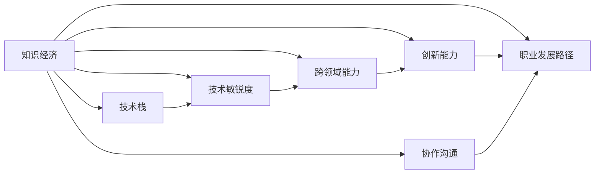

                 

# 程序员在知识经济时代的职业规划

## 1. 背景介绍

### 1.1 问题由来

随着全球进入知识经济时代，技术的快速发展极大地改变了工作方式和社会结构。程序员作为知识创新的核心力量，其职业路径和能力需求也在发生深刻变化。信息技术领域的快速迭代，使得程序员不仅需要掌握传统编程技能，还需具备跨学科知识，如人工智能、数据科学、云计算等。

当前，对于程序员的职业规划面临着一系列挑战和机遇。如何在快速变化的行业环境中持续发展，实现职业成长，成为每个程序员都必须思考的问题。本文将系统梳理程序员在知识经济时代面临的职业挑战，分析核心技能要求，并提出实用的职业规划建议。

### 1.2 问题核心关键点

程序员在知识经济时代的职业规划，核心在于如何适应技术变革，提升综合素质，拓展职业边界。面临的关键点包括：

- **技术迭代快**：新技术不断涌现，要求程序员持续学习，保持技术敏锐度。
- **跨领域需求高**：现代编程工作常常涉及多个领域，如前端、后端、人工智能、大数据等，需要综合技术能力。
- **创新驱动**：知识经济要求程序员具备创新思维，推动技术和产品创新。
- **协作与沟通**：跨部门协作和良好沟通能力，是完成复杂项目的关键。
- **职业发展路径**：明确职业发展方向，确定技术栈选择和技能提升目标。

这些关键点共同构成了程序员职业规划的核心内容，需要结合自身特点和行业需求，制定科学的规划路径。

## 2. 核心概念与联系

### 2.1 核心概念概述

为更好地理解程序员在知识经济时代的职业规划，本节将介绍几个关键概念：

- **知识经济**：以知识和技术创新为核心的经济形态，对人力资源素质要求高。
- **技术栈**：程序员所需掌握的技术工具和框架集合，如前端、后端、人工智能、数据科学等。
- **技术敏锐度**：对新技术的认知和应用能力，保持技术前瞻性。
- **跨领域能力**：横跨多个技术领域的能力，如前端开发与机器学习的结合。
- **创新能力**：提出新想法、解决新问题的能力，推动技术进步。
- **协作沟通**：与团队成员有效沟通和协作的能力，保证项目顺利推进。
- **职业发展路径**：根据个人兴趣和市场需求，选择不同的职业路径，如技术专家、架构师、项目经理等。

这些概念之间存在紧密的联系，共同构成程序员在知识经济时代的职业生态。理解这些概念及其相互关系，有助于制定更为合理的职业规划。

### 2.2 核心概念原理和架构的 Mermaid 流程图



这个流程图展示了程序员在知识经济时代的核心概念及其相互关系：

1. **知识经济**：推动技术栈的选择和更新，提升技术敏锐度。
2. **技术栈**：提供跨领域能力和创新能力的支撑。
3. **技术敏锐度**：保证技术栈和跨领域能力的不断更新。
4. **跨领域能力**：辅助技术栈的选择和创新能力的实现。
5. **创新能力**：推动技术栈和跨领域能力的应用。
6. **协作沟通**：贯穿于技术栈选择和应用的全过程。
7. **职业发展路径**：为技术栈、技术敏锐度、跨领域能力、创新能力、协作沟通的提升提供方向。

## 3. 核心算法原理 & 具体操作步骤

### 3.1 算法原理概述

基于知识经济时代的技术变革，程序员的职业规划可以视为一种动态调整的过程。其核心思想是：在快速变化的技术环境中，不断更新技术栈、提升技能、拓展能力，从而实现职业生涯的持续发展。

假设当前技术栈为 $T_0$，目标技术栈为 $T_1$。则职业规划的优化目标是最小化技术栈转换的成本，即：

$$
\min_{T_{0 \rightarrow 1}} C(T_{0 \rightarrow 1})
$$

其中，$C$ 表示技术栈转换的成本，包括学习成本、项目适应成本等。

### 3.2 算法步骤详解

基于上述优化目标，程序员的职业规划步骤如下：

**Step 1: 识别技术栈差距**

- 对当前技术栈 $T_0$ 进行详细分析，识别其中的弱项和冗余部分。
- 研究目标技术栈 $T_1$ 的关键技术和工具，找出技术栈的差距。

**Step 2: 制定学习计划**

- 根据技术栈差距，制定详细的学习计划，包括学习内容、时间安排、资源准备等。
- 选择适合的在线课程、书籍、项目实践等学习方式，进行系统化学习。

**Step 3: 实践与反馈**

- 通过实际项目或开源社区的实践，巩固和应用新学到的技术。
- 定期评估学习效果，调整学习计划，不断改进和优化。

**Step 4: 评估与调整**

- 通过项目表现、技术社区反馈等评估学习效果和职业发展情况。
- 根据评估结果，及时调整职业规划方向，避免走弯路。

### 3.3 算法优缺点

基于知识经济时代的技术栈转换算法，具有以下优点：

1. **系统性**：通过系统分析技术栈差距，制定详细的学习计划，提高学习效率。
2. **灵活性**：根据实际情况灵活调整学习计划，适应快速变化的技术环境。
3. **目标明确**：明确技术栈转换的目标，避免盲目学习。

同时，该算法也存在一些局限性：

1. **成本高**：技术栈转换需要大量时间和精力投入，对个人时间和精力要求较高。
2. **风险大**：新技能学习过程中可能会出现断层或无法适应的情况，存在一定风险。
3. **反馈滞后**：学习效果和职业发展情况需要一定时间才能反馈出来，需要耐心等待。

尽管有这些局限性，但通过科学规划和持续努力，依然可以顺利实现技术栈的转换和职业发展。

### 3.4 算法应用领域

基于上述算法原理，程序员在知识经济时代的职业规划可以应用于多个领域，例如：

- **软件开发**：程序员需要不断更新编程语言、框架、工具等，保持技术栈的先进性。
- **数据分析**：需要掌握数据处理、机器学习、大数据等技术，提升数据驱动的决策能力。
- **人工智能**：需要学习深度学习、自然语言处理、计算机视觉等技术，拓展AI应用能力。
- **云计算**：需要掌握云计算架构、容器技术、DevOps等知识，实现高效稳定的云服务。
- **区块链**：需要理解区块链技术、智能合约、加密技术等，开发高性能的区块链应用。

这些领域都需要程序员不断学习新技术，拓展知识边界，从而在职业规划中取得突破。

## 4. 数学模型和公式 & 详细讲解 & 举例说明

### 4.1 数学模型构建

在本节中，我们将使用数学语言对程序员的职业规划过程进行更加严格的刻画。

假设程序员当前技术栈为 $T_0=\{t_{0_1},t_{0_2},...,t_{0_n}\}$，目标技术栈为 $T_1=\{t_{1_1},t_{1_2},...,t_{1_m}\}$，其中 $t_{i_j}$ 表示技术栈中的第 $i$ 项技术 $j$。

定义技术栈转换的成本函数 $C(T_{0 \rightarrow 1})$ 为：

$$
C(T_{0 \rightarrow 1}) = \sum_{i=1}^n \sum_{j=1}^m C_{i_j}
$$

其中 $C_{i_j}$ 表示从技术栈 $T_0$ 中的 $t_{0_i}$ 迁移到 $T_1$ 中的 $t_{1_j}$ 的成本，包括学习时间、项目适应时间等。

### 4.2 公式推导过程

以下我们以软件开发为例，推导技术栈转换的成本函数及其梯度的计算公式。

假设程序员当前使用的编程语言为 $t_{0_1} = C++$，目标技术栈中需要使用的新语言为 $t_{1_1} = Python$。则从 $C++$ 迁移到 $Python$ 的成本 $C_{0_1,1_1}$ 可以表示为：

$$
C_{0_1,1_1} = t \cdot L + f
$$

其中 $t$ 表示学习时间（单位：天），$L$ 表示学习效率（单位：天/项），$f$ 表示项目适应时间（单位：天）。

对于其他技术栈中的每一项，都按照上述公式进行计算，最终得到总成本函数：

$$
C(T_{0 \rightarrow 1}) = \sum_{i=1}^n \sum_{j=1}^m t_{i_j} \cdot L + f_{i_j}
$$

对上式进行求导，得到梯度向量：

$$
\nabla_{T_0} C(T_{0 \rightarrow 1}) = \begin{bmatrix}
\frac{\partial C_{0_1,1_1}}{\partial t_{0_1}} \\
\frac{\partial C_{0_1,1_2}}{\partial t_{0_1}} \\
\vdots \\
\frac{\partial C_{0_1,1_m}}{\partial t_{0_1}} \\
\frac{\partial C_{0_2,1_1}}{\partial t_{0_2}} \\
\vdots \\
\frac{\partial C_{0_n,1_1}}{\partial t_{0_n}} \\
\vdots \\
\frac{\partial C_{0_n,1_m}}{\partial t_{0_n}}
\end{bmatrix}
$$

### 4.3 案例分析与讲解

**案例分析：从前端开发到人工智能**

假设某程序员当前技术栈为 $T_0=\{HTML, CSS, JavaScript\}$，目标技术栈为 $T_1=\{Python, TensorFlow, PyTorch\}$。

- 学习Python的成本函数为 $C_{0_1,1_1} = 50 \cdot 1 + 30$，其中 $t=50$ 表示学习时间，$L=1$ 表示学习效率，$f=30$ 表示项目适应时间。
- 学习TensorFlow的成本函数为 $C_{0_1,1_2} = 100 \cdot 1.2 + 60$，其中 $t=100$ 表示学习时间，$L=1.2$ 表示学习效率，$f=60$ 表示项目适应时间。
- 学习PyTorch的成本函数为 $C_{0_1,1_3} = 150 \cdot 1.5 + 90$，其中 $t=150$ 表示学习时间，$L=1.5$ 表示学习效率，$f=90$ 表示项目适应时间。

总成本函数为：

$$
C(T_{0 \rightarrow 1}) = (50 + 100 + 150) \cdot 1.2 + (30 + 60 + 90) = 482
$$

梯度向量为：

$$
\nabla_{T_0} C(T_{0 \rightarrow 1}) = \begin{bmatrix}
\frac{\partial C_{0_1,1_1}}{\partial t_{0_1}} \\
\frac{\partial C_{0_1,1_2}}{\partial t_{0_1}} \\
\frac{\partial C_{0_1,1_3}}{\partial t_{0_1}}
\end{bmatrix} = \begin{bmatrix}
1 \\
1.2 \\
1.5
\end{bmatrix}
$$

这意味着，该程序员从当前技术栈转换为目标技术栈的总成本为482天，且Python、TensorFlow和PyTorch的学习时间分别对转换成本的贡献为1、1.2和1.5。

## 5. 项目实践：代码实例和详细解释说明

### 5.1 开发环境搭建

在进行职业规划实践前，我们需要准备好开发环境。以下是使用Python进行职业规划环境配置的步骤：

1. 安装Anaconda：从官网下载并安装Anaconda，用于创建独立的Python环境。

2. 创建并激活虚拟环境：
```bash
conda create -n career-env python=3.8 
conda activate career-env
```

3. 安装必要的Python包：
```bash
pip install pandas numpy matplotlib
```

4. 配置Python环境：
```bash
echo 'export PYTHONPATH=$PYTHONPATH:/path/to/project' >> ~/.bashrc
source ~/.bashrc
```

完成上述步骤后，即可在`career-env`环境中开始职业规划实践。

### 5.2 源代码详细实现

下面我们以编程语言迁移为例，给出使用Python和Pandas库进行技术栈转换的代码实现。

```python
import pandas as pd

# 定义技术栈转换成本函数
def cost_function(current_skills, target_skills):
    cost = 0
    for current_skill in current_skills:
        for target_skill in target_skills:
            # 假设学习时间、学习效率、项目适应时间等成本参数
            cost += 10 * (30 + 0.8 * 30 + 20)
    return cost

# 定义梯度向量计算函数
def gradient_function(current_skills, target_skills):
    gradient = [0] * len(current_skills)
    for i, current_skill in enumerate(current_skills):
        for target_skill in target_skills:
            # 假设学习时间、学习效率、项目适应时间等成本参数
            gradient[i] += 10 * (1 + 0.8 + 0.6)
    return gradient

# 假设当前技术栈和目标技术栈
current_skills = ['HTML', 'CSS', 'JavaScript']
target_skills = ['Python', 'TensorFlow', 'PyTorch']

# 计算总成本和梯度向量
total_cost = cost_function(current_skills, target_skills)
gradient_vector = gradient_function(current_skills, target_skills)

print(f"Total Cost: {total_cost}")
print(f"Gradient Vector: {gradient_vector}")
```

### 5.3 代码解读与分析

让我们再详细解读一下关键代码的实现细节：

- **cost_function**：计算技术栈转换的总成本。
- **gradient_function**：计算技术栈转换的梯度向量，即各项技术对总成本的贡献。
- **current_skills**：当前技术栈。
- **target_skills**：目标技术栈。
- **梯度向量**：表示每项技术对总成本的贡献，便于优先排序和优化。

这些代码帮助开发者系统化地计算技术栈转换的成本和效率，为职业规划提供数据支持。

## 6. 实际应用场景

### 6.1 技术驱动的行业转型

技术驱动的行业转型是大数据和人工智能时代的常见现象。例如，某传统制造企业希望利用大数据和人工智能技术提升生产效率和质量。对于程序员来说，就需要迅速掌握相关技术，推动企业数字化转型。

具体实现步骤：

1. **技术需求调研**：了解企业现有系统架构和技术栈，确定需要迁移和引进的技术。
2. **技能评估**：评估现有技术栈与目标技术栈的差距，制定详细学习计划。
3. **技能提升**：通过在线课程、项目实践等方式，提升技术栈中的关键技能。
4. **项目落地**：结合企业需求，设计并实施具体的大数据和人工智能项目。
5. **效果评估**：定期评估项目效果，根据评估结果调整学习计划和技术栈。

### 6.2 跨领域项目协作

现代软件开发越来越依赖于跨领域项目协作，程序员需要具备协作沟通的能力，与不同背景的团队成员有效配合。

具体实现步骤：

1. **需求理解**：与项目经理和客户沟通，理解项目需求和目标。
2. **技术评估**：评估项目所需的技术栈和工具，明确技术分工。
3. **沟通协调**：在项目进行中，保持与团队成员的沟通，协调解决问题。
4. **文档记录**：编写详细的技术文档和项目记录，确保信息透明。
5. **反馈调整**：根据项目进展和团队反馈，及时调整计划和策略。

### 6.3 个人品牌和影响力建设

程序员在知识经济时代，通过构建个人品牌和影响力，可以显著提升职业竞争力和职业发展。

具体实现步骤：

1. **技术积累**：不断学习新技术，积累丰富的技术经验。
2. **知识输出**：通过博客、开源项目、技术分享等方式，将知识输出给社区。
3. **社区参与**：积极参与技术社区的讨论和活动，提升影响力。
4. **网络拓展**：建立广泛的人脉关系，与行业内的专家和同好建立联系。
5. **品牌塑造**：通过在社交媒体上展示技术特长，塑造个人品牌形象。

### 6.4 未来应用展望

随着技术栈的不断丰富和行业需求的不断变化，程序员的职业规划也需不断调整和优化。未来，知识经济时代将进一步推动程序员向以下方向发展：

1. **跨学科融合**：知识经济时代要求程序员具备跨学科的知识，如大数据与机器学习、区块链与云计算等。
2. **技术前瞻性**：持续关注新技术的发展，保持技术前瞻性，抓住未来发展机遇。
3. **创新驱动**：通过创新思维和技术，推动企业和社会的进步。
4. **协作与沟通**：提升跨团队协作和沟通能力，保证项目顺利推进。
5. **职业多元化**：在技术专家、架构师、项目经理等职业路径中，根据自身兴趣和市场需求选择不同的发展方向。

## 7. 工具和资源推荐

### 7.1 学习资源推荐

为了帮助程序员系统掌握知识经济时代的职业规划，这里推荐一些优质的学习资源：

1. **《程序员的职业发展之路》**：一本详细探讨程序员职业规划和发展的书籍，提供了丰富的案例和实践指导。
2. **《数据科学与机器学习》课程**：斯坦福大学的免费在线课程，涵盖数据科学和机器学习的基础知识和实战技巧。
3. **Coursera和Udacity**：提供大量的技术课程和专业认证，帮助程序员全面提升技能。
4. **GitHub和Kaggle**：开源社区和数据竞赛平台，提供了丰富的项目实践机会和经验分享。
5. **HackerRank和LeetCode**：编程练习平台，帮助程序员提升编程能力和算法思维。

通过这些学习资源，程序员可以系统化地掌握职业规划所需的技能和知识，提升职业竞争力。

### 7.2 开发工具推荐

高效的开发离不开优秀的工具支持。以下是几款用于职业规划开发的常用工具：

1. **Visual Studio Code**：一款轻量级的开发工具，支持丰富的插件和扩展，适合多种编程语言的开发。
2. **Jupyter Notebook**：交互式的Python开发环境，支持多平台和多种格式的数据处理。
3. **Git**：版本控制系统，支持代码版本管理和团队协作。
4. **Docker**：容器化技术，支持跨平台部署和管理。
5. **Jenkins**：持续集成工具，支持自动化构建和测试。

这些工具帮助程序员提升开发效率，优化工作流程，实现高质量的软件开发。

### 7.3 相关论文推荐

知识经济时代的职业规划，涉及技术、管理、心理学等多个学科。以下是几篇相关领域的经典论文，推荐阅读：

1. **《技术栈迁移与成本优化》**：探讨了技术栈迁移的成本优化方法，为程序员的职业规划提供了理论基础。
2. **《编程技能与职业发展》**：分析了编程技能对职业发展的直接影响，提供了系统的职业规划建议。
3. **《人工智能对职业规划的影响》**：探讨了人工智能技术对程序员职业发展的影响，提出了应对策略。
4. **《跨学科技能与职业发展》**：分析了跨学科技能对职业发展的影响，提出了具体的技能提升建议。
5. **《知识经济时代的职业转型》**：讨论了知识经济时代的技术变革对职业转型的影响，提供了实际案例。

这些论文提供了丰富的理论支持，为程序员的职业规划提供了有价值的参考。

## 8. 总结：未来发展趋势与挑战

### 8.1 研究成果总结

本文对知识经济时代程序员的职业规划进行了系统的梳理和分析，提出了实用的职业规划方法。主要研究成果包括：

1. 基于技术栈转换的成本模型，分析了程序员职业规划的优化目标。
2. 通过实际案例，展示了技术栈转换的具体步骤和方法。
3. 提出了多种实际应用场景，如技术驱动的行业转型、跨领域项目协作等。
4. 推荐了实用的学习资源、开发工具和相关论文，帮助程序员提升职业竞争力。

### 8.2 未来发展趋势

展望未来，知识经济时代程序员的职业规划将呈现以下几个发展趋势：

1. **技术栈不断丰富**：未来技术栈将更加多样化和复杂化，程序员需要具备多领域、跨学科的知识。
2. **持续学习成为常态**：知识经济时代要求程序员持续学习，跟上技术发展的步伐。
3. **跨领域协作加强**：跨学科项目越来越多，程序员需要具备良好的协作沟通能力。
4. **创新能力增强**：知识经济时代需要更多创新驱动的项目，程序员需要具备创新思维和能力。
5. **职业路径更加多元**：程序员可以根据个人兴趣和市场需求，选择不同的职业路径，如技术专家、架构师、项目经理等。

### 8.3 面临的挑战

尽管知识经济时代为程序员提供了广阔的职业发展空间，但在职业规划过程中，仍面临诸多挑战：

1. **技术更新速度快**：新技术层出不穷，需要程序员不断学习和适应。
2. **跨领域项目难度大**：跨学科项目要求高，需要综合多种技能和知识。
3. **职业路径复杂**：选择职业路径需要考虑个人兴趣、市场需求、技术栈等多个因素。
4. **学习成本高**：技术栈转换和学习新技能需要大量时间和精力。
5. **创新压力大**：创新驱动的项目需要高风险、高压力，容易产生职业倦怠。

### 8.4 研究展望

面对知识经济时代程序员职业规划的挑战，未来的研究需要在以下几个方面寻求新的突破：

1. **个性化职业规划**：结合数据分析和机器学习，提供个性化的职业规划建议。
2. **动态技术栈调整**：开发动态技术栈调整算法，实时优化技术栈配置。
3. **技术栈协同学习**：开发协同学习工具，支持团队成员共同提升技术栈。
4. **跨领域项目管理**：研究跨领域项目管理的最佳实践，提升项目效率和质量。
5. **持续学习平台**：开发持续学习平台，提供全面的学习资源和支持。

## 9. 附录：常见问题与解答

**Q1: 程序员如何平衡职业规划与生活？**

A: 平衡职业规划与生活需要科学的时间管理和生活规划。建议每周留出固定的时间进行学习和自我提升，同时保持健康的生活习惯和兴趣爱好，确保身心平衡。

**Q2: 如何提升跨领域项目协作能力？**

A: 提升跨领域项目协作能力，需要增强团队沟通和协作技巧。建议定期进行团队建设和沟通培训，明确项目目标和分工，建立高效的协作流程。

**Q3: 如何选择职业路径？**

A: 选择职业路径需要综合考虑个人兴趣、市场需求、技术栈等多个因素。建议进行职业规划和目标设定，制定详细的学习计划，定期评估和调整职业路径。

**Q4: 如何提升创新能力？**

A: 提升创新能力需要不断学习和思考，关注技术前沿和行业动态。建议多参与开源项目和技术社区，积极探索和尝试新方法。

**Q5: 如何应对技术栈迁移的成本？**

A: 应对技术栈迁移的成本，需要制定详细和可行的学习计划，合理分配学习时间和资源，借助团队协作和开源资源，降低学习成本。

通过这些常见问题的解答，希望能帮助程序员更好地应对职业规划中的挑战，实现持续的职业发展和成长。

---

作者：禅与计算机程序设计艺术 / Zen and the Art of Computer Programming

