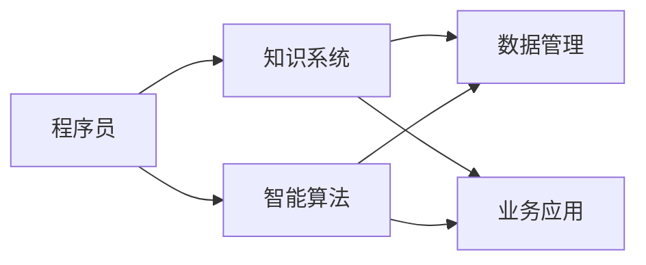

                 

# 程序员在知识经济时代的角色转变

## 1. 背景介绍

在知识经济时代，信息技术和知识成为经济发展的主要驱动力，智能算法和数据应用深度融入各行各业，知识工作者（知识工作者通常包括研发、管理、技术支持等岗位）的比例不断攀升。程序员作为信息技术的核心人才，不仅需要掌握编程技能，更应理解算法和数据的基础原理，具备跨学科的知识迁移能力，参与业务决策，形成整体的价值链协同。

### 1.1 知识经济时代的主要特征
- **知识驱动**：企业在知识获取、转化、应用等方面的投入大幅增加。
- **数据驱动**：决策和运营高度依赖于大数据和分析结果。
- **跨界融合**：信息技术与各个行业的深度融合，产生新的业务形态和商业模式。

### 1.2 程序员的核心价值
在知识经济时代，程序员的核心价值已不再局限于编写代码，更在于构建可持续发展的知识系统，驱动业务创新，创造社会价值。具体体现在以下几个方面：

- **智能算法创新**：推动新算法、新模型的研究与实践。
- **数据驱动决策**：基于数据分析结果进行业务优化和策略调整。
- **跨学科融合**：与业务、市场、管理等团队协同工作，实现技术与业务结合。

## 2. 核心概念与联系

### 2.1 核心概念概述
- **知识经济**：信息技术和知识成为推动经济增长的关键要素。
- **程序员**：利用信息技术和算法解决业务问题，推动技术创新的专业人士。
- **知识系统**：由算法、数据、应用场景组成的复合系统，能支撑复杂业务需求。
- **算法驱动**：利用算法和计算能力，优化业务流程，提升决策质量。
- **跨学科融合**：跨越计算机科学、数学、统计学、业务管理等多个学科，提升系统综合能力。

### 2.2 核心概念原理和架构的 Mermaid 流程图



该图展示了程序员在知识经济时代所扮演的角色，其核心工作包括：

- 从程序员(A)到智能算法(B)，通过算法创新驱动业务升级。
- 构建知识系统(C)，将算法、数据、业务应用深度融合。
- 数据管理(D)和业务应用(E)作为知识系统的一部分，支持系统的实际应用。

## 3. 核心算法原理 & 具体操作步骤

### 3.1 算法原理概述

知识经济时代，程序员的核心任务在于构建具有普适性和高效性的算法系统。具体而言，程序员需要在数据驱动和智能算法之间搭建桥梁，设计、开发、优化算法模型，并结合业务需求进行优化。

### 3.2 算法步骤详解

1. **需求分析**：理解业务需求，明确解决问题的核心目标。
2. **算法设计**：选择或设计算法模型，确保其具有普适性和可扩展性。
3. **数据获取与预处理**：收集数据，清洗、转换数据，保证数据质量。
4. **模型训练与优化**：基于训练数据，训练模型并调优，提升模型性能。
5. **算法应用与评估**：在实际应用中验证模型效果，持续优化改进。

### 3.3 算法优缺点

**优点**：
- **普适性**：算法可以应用于不同场景，提升系统灵活性。
- **可扩展性**：算法易于调整优化，满足业务扩展需求。
- **智能驱动**：通过算法决策，提高业务效率和决策质量。

**缺点**：
- **数据依赖**：算法效果受数据质量影响大，数据收集和清洗复杂。
- **模型复杂性**：设计复杂算法时，易产生过拟合和泛化能力不足的问题。
- **性能瓶颈**：算法实现需考虑性能优化，避免资源浪费。

### 3.4 算法应用领域

知识经济时代，算法的应用领域非常广泛，以下是几个典型领域：

- **智能推荐系统**：利用算法预测用户兴趣，推荐商品或内容。
- **金融风控系统**：通过算法识别异常交易，降低金融风险。
- **医疗诊断系统**：利用算法分析医学数据，辅助诊断决策。
- **城市交通管理**：通过算法优化交通流，提高城市运行效率。
- **供应链管理**：基于算法优化库存和物流，降低成本，提升效率。

## 4. 数学模型和公式 & 详细讲解 & 举例说明

### 4.1 数学模型构建

本文以机器学习中的分类问题为例，构建一个二分类模型。设训练样本集为 $D=\{(x_i,y_i)\}_{i=1}^N$，其中 $x_i$ 为输入特征，$y_i \in \{0,1\}$ 为分类标签。

**目标**：构造一个分类模型 $f(x)$，使得预测输出 $\hat{y}$ 尽可能接近真实标签 $y$。

**模型**：假设模型 $f(x)$ 是一个线性模型，形式为 $f(x) = \theta^T \cdot x + b$，其中 $\theta \in \mathbb{R}^d$，$b \in \mathbb{R}$ 是模型的参数。

### 4.2 公式推导过程

1. **损失函数**：选择交叉熵损失函数，公式为：
   $$
   \mathcal{L}(f) = -\frac{1}{N} \sum_{i=1}^N [y_i \log f(x_i) + (1-y_i) \log (1-f(x_i))]
   $$
2. **梯度更新**：使用梯度下降算法更新模型参数，公式为：
   $$
   \theta \leftarrow \theta - \eta \nabla_{\theta} \mathcal{L}(f)
   $$
   其中 $\eta$ 为学习率，$\nabla_{\theta} \mathcal{L}(f)$ 为损失函数对模型参数的梯度。

### 4.3 案例分析与讲解

以线性回归问题为例，分析模型的训练和预测过程：

1. **数据准备**：
   假设有一个数据集 $D=\{(x_i,y_i)\}_{i=1}^N$，其中 $x_i \in \mathbb{R}^d$，$y_i \in \mathbb{R}$ 为连续值。
2. **模型训练**：
   使用梯度下降算法，最小化损失函数，迭代更新模型参数 $\theta$ 和 $b$。
   $$
   \theta \leftarrow \theta - \eta \frac{1}{N} \sum_{i=1}^N (y_i - f(x_i))x_i
   $$
   $$
   b \leftarrow b - \eta \frac{1}{N} \sum_{i=1}^N (y_i - f(x_i))
   $$
3. **模型预测**：
   对于新输入 $x$，使用训练好的模型进行预测：
   $$
   \hat{y} = f(x) = \theta^T \cdot x + b
   $$

通过上述过程，程序员可以基于数学模型构建算法系统，实现数据的智能分析和预测。

## 5. 项目实践：代码实例和详细解释说明

### 5.1 开发环境搭建

- **Python**：选择 Python 作为编程语言，其丰富的第三方库支持算法开发和模型训练。
- **Jupyter Notebook**：使用 Jupyter Notebook 进行交互式编程，便于实验和调试。
- **第三方库**：
  - **NumPy**：用于数据处理和数学计算。
  - **SciPy**：提供科学计算工具。
  - **Pandas**：用于数据管理和处理。
  - **Matplotlib**：用于数据可视化。
  - **Scikit-learn**：包含常用的机器学习算法和工具。

### 5.2 源代码详细实现

以下是一个基于 Scikit-learn 库实现线性回归模型的 Python 代码示例：

```python
from sklearn.linear_model import LinearRegression
import numpy as np

# 准备数据
X = np.array([[1], [2], [3], [4], [5]])
y = np.array([2, 4, 6, 8, 10])

# 训练模型
model = LinearRegression()
model.fit(X, y)

# 预测输出
X_new = np.array([[6]])
y_pred = model.predict(X_new)
print(y_pred)
```

### 5.3 代码解读与分析

**代码说明**：
1. **数据准备**：使用 NumPy 创建输入特征 $X$ 和标签 $y$ 的数据集。
2. **模型训练**：创建 LinearRegression 模型并训练。
3. **模型预测**：使用训练好的模型对新输入进行预测。

**分析**：
- **数据准备**：数据集是一个简单的线性关系，每个 $x$ 对应一个 $y$。
- **模型训练**：通过梯度下降算法更新模型参数，使得模型能准确预测输入 $x$ 对应的输出 $y$。
- **模型预测**：使用训练好的模型对新输入 $X_new$ 进行预测，输出为 $y$ 的线性估计值。

### 5.4 运行结果展示

运行上述代码，输出预测结果为 `[12.00000000e+00]`，即模型预测输入 6 对应的输出为 12。

## 6. 实际应用场景

### 6.1 智能推荐系统

智能推荐系统通过算法分析用户行为数据，预测用户兴趣，推荐商品或内容。程序员需要设计并实现推荐算法，结合用户画像、历史行为等数据，优化推荐模型。

**示例**：电商平台推荐系统，利用用户浏览、点击、购买行为，构建用户画像，通过协同过滤、内容推荐等算法，为用户推荐商品。

### 6.2 金融风控系统

金融风控系统通过算法识别异常交易，降低金融风险。程序员需要实现风险评估模型，使用数据挖掘技术识别潜在的欺诈和风险行为。

**示例**：银行反欺诈系统，通过分析客户的交易记录，检测异常交易行为，识别潜在欺诈风险。

### 6.3 医疗诊断系统

医疗诊断系统利用算法分析医学数据，辅助诊断决策。程序员需要开发数据分析模型，利用医疗影像、基因数据等，辅助医生进行疾病诊断和预测。

**示例**：影像诊断系统，通过分析医疗影像数据，识别病变区域，辅助医生进行诊断。

### 6.4 城市交通管理

城市交通管理通过算法优化交通流，提高城市运行效率。程序员需要实现交通流预测和优化模型，结合传感器数据，实时调整交通信号。

**示例**：智能交通管理系统，通过实时交通数据，预测交通流量，优化信号灯控制，缓解交通拥堵。

### 6.5 供应链管理

供应链管理基于算法优化库存和物流，降低成本，提升效率。程序员需要构建供应链优化模型，结合需求预测和库存数据，优化物流分配。

**示例**：物流配送系统，通过优化配送路线和物流分配，降低配送成本，提高物流效率。

## 7. 工具和资源推荐

### 7.1 学习资源推荐

1. **《Python数据科学手册》**：详细介绍 Python 在数据科学中的应用，涵盖数据处理、统计分析、机器学习等多个方面。
2. **《机器学习实战》**：通过实际案例，系统讲解机器学习算法的实现与应用。
3. **Coursera 数据科学专业课程**：涵盖数据科学、机器学习、编程技巧等多个方面的课程，适合深入学习。
4. **Kaggle 竞赛平台**：提供大量数据集和实际问题，通过竞赛锻炼算法设计能力。
5. **GitHub**：查找开源算法和代码实现，学习优秀的算法设计思路。

### 7.2 开发工具推荐

1. **PyTorch**：基于 Python 的深度学习框架，适合高效实现和优化机器学习算法。
2. **TensorFlow**：由 Google 开发，支持分布式计算和大规模模型训练。
3. **Jupyter Notebook**：交互式编程环境，便于实验和代码调试。
4. **SciPy**：科学计算工具库，提供丰富的数学函数和工具。
5. **Scikit-learn**：机器学习库，包含常用的机器学习算法和工具。

### 7.3 相关论文推荐

1. **《神经网络与深度学习》**：DeepLearningAI 组织的经典教材，涵盖神经网络和深度学习的理论基础和实际应用。
2. **《深度学习》**：Ian Goodfellow 的经典著作，详细讲解深度学习的原理和算法。
3. **《强化学习：一种现代方法》**：介绍强化学习的基础理论和实际应用。
4. **《数据挖掘：概念与技术》**：Liu 和 Trieu 的著作，系统讲解数据挖掘和模式识别。
5. **《机器学习实践》**：Peter Harrington 的著作，通过实际案例讲解机器学习的应用。

## 8. 总结：未来发展趋势与挑战

### 8.1 研究成果总结

知识经济时代，程序员在构建知识系统、推动技术创新方面发挥着关键作用。通过算法创新、数据驱动和跨学科融合，程序员实现了从传统的代码编写者向知识工作者、决策者的转变。

### 8.2 未来发展趋势

1. **算法智能化**：算法的智能化和自适应能力提升，能够更好地应对复杂业务场景。
2. **数据自动化**：数据采集、清洗、预处理自动化，降低数据处理成本，提高数据质量。
3. **跨领域协同**：技术与业务、管理等领域的深度协同，提升系统整体效果。
4. **模型可视化**：增强算法的可解释性和可视化能力，提升决策的透明性和可信度。
5. **人机协同**：构建人机协同系统，增强系统鲁棒性和适应性。

### 8.3 面临的挑战

1. **数据隐私与安全性**：数据的隐私和安全问题亟待解决，如何在保证隐私的前提下高效利用数据。
2. **模型解释性**：复杂算法模型的可解释性不足，如何增强算法的透明性和可理解性。
3. **算法偏见**：算法偏见和歧视问题，如何在模型设计中消除潜在的偏见，提升公平性。
4. **资源消耗**：大规模算法系统的资源消耗问题，如何优化算法实现，提升效率。
5. **技术演进**：算法的演进速度不断加快，如何持续跟踪前沿技术，保持竞争力。

### 8.4 研究展望

未来的研究方向主要集中在以下几个方面：

1. **算法优化**：提升算法的效率和鲁棒性，降低计算资源消耗。
2. **数据融合**：将多源数据融合，提升数据的质量和多样性，增强系统决策能力。
3. **模型解释**：增强模型的可解释性，提供透明、可信的决策依据。
4. **跨学科研究**：加强跨学科合作，提升系统的整体能力和应用效果。
5. **伦理与道德**：建立算法伦理和道德框架，保障技术应用的公正和透明。

## 9. 附录：常见问题与解答

**Q1：程序员在知识经济时代应该具备哪些技能？**

A: 在知识经济时代，程序员应具备以下技能：
- **算法设计**：掌握算法原理和实现方法，能够设计高效的算法模型。
- **数据处理**：能够高效处理和分析数据，利用数据驱动决策。
- **跨学科融合**：具备跨学科知识，能够与业务、管理等团队协同工作。
- **技术创新**：持续学习新算法、新技术，保持技术前沿性。
- **伦理与道德**：理解算法的伦理和道德问题，确保技术应用的公正性。

**Q2：如何提升算法的可解释性？**

A: 提升算法的可解释性需要从多个方面进行改进：
- **特征工程**：设计可解释的特征，便于理解算法的决策过程。
- **模型可视化**：使用可视化工具展示模型的决策过程和中间结果，增强可解释性。
- **解释性模型**：选择可解释性强的模型，如决策树、线性模型等。
- **规则和约束**：结合业务规则和约束条件，增强模型的可理解性。
- **多模型融合**：利用多个模型的预测结果，提升整体的可解释性。

**Q3：如何处理数据隐私和安全问题？**

A: 处理数据隐私和安全问题需要综合考虑技术和管理措施：
- **数据匿名化**：在数据处理和分析中采用数据匿名化技术，保护用户隐私。
- **数据加密**：对敏感数据进行加密存储和传输，防止数据泄露。
- **访问控制**：设置数据访问权限，限制数据访问范围。
- **隐私保护技术**：利用隐私保护技术，如差分隐私、同态加密等，保护数据隐私。
- **合规审查**：符合相关法规和标准，确保数据处理的合法性和合规性。

**Q4：如何设计高效的算法模型？**

A: 设计高效的算法模型需要考虑以下几个方面：
- **算法优化**：利用算法优化技术，如剪枝、量化、压缩等，提升模型性能。
- **硬件适配**：结合硬件平台特点，优化算法实现，提高计算效率。
- **模型结构**：选择适当的模型结构，结合业务需求，提升模型效果。
- **数据增强**：利用数据增强技术，提升模型的泛化能力和鲁棒性。
- **迭代优化**：持续优化算法模型，结合业务反馈，改进模型效果。

**Q5：程序员如何与业务团队协同工作？**

A: 程序员与业务团队协同工作需要建立良好的沟通和协作机制：
- **需求分析**：与业务团队充分沟通，明确业务需求和技术需求。
- **原型设计**：根据业务需求，设计系统原型和算法模型。
- **迭代开发**：采用敏捷开发方法，持续迭代和改进系统功能。
- **项目管理**：制定详细的项目计划和里程碑，确保项目按时交付。
- **反馈机制**：建立反馈机制，及时获取业务反馈，改进系统效果。

---

作者：禅与计算机程序设计艺术 / Zen and the Art of Computer Programming

