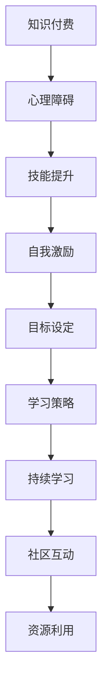

                 

# 程序员如何克服知识付费的心理障碍

> 关键词：知识付费,心理障碍,技能提升,自我激励,目标设定,学习策略,持续学习,社区互动,资源利用

## 1. 背景介绍

### 1.1 问题由来
在当今信息爆炸的时代，技术的快速发展对程序员的技能要求越来越高。为了跟上行业的步伐，程序员们面临着不断学习新技术、新知识的压力。然而，持续的学习需要投入大量的时间和精力，许多程序员因为无法应对学习压力，开始对付费学习产生抵触情绪。

### 1.2 问题核心关键点
程序员对知识付费的心理障碍主要体现在以下几个方面：

1. **成本负担**：认为付费学习的成本过高，难以承担。
2. **效果不确定**：担心投入的时间、金钱得不到预期的回报。
3. **缺乏动力**：学习动机不足，难以坚持长期的自学。
4. **资源利用率低**：难以高效利用在线课程、社区资源等，导致学习效率低下。

这些心理障碍不仅影响了程序员的职业发展，还阻碍了整个IT行业的技术进步。因此，如何克服这些心理障碍，激发程序员的学习热情，提高学习效率，是摆在面前的重要课题。

## 2. 核心概念与联系

### 2.1 核心概念概述

要克服知识付费的心理障碍，首先需要理解以下核心概念：

- **知识付费**：指通过支付费用获取知识、技能或服务的模式。在IT行业中，常见的知识付费形式包括在线课程、技术书籍、专业培训等。
- **心理障碍**：指个体对某事物产生的消极情感和抵触情绪，影响其行为决策。心理障碍包括但不限于焦虑、恐惧、怀疑等。
- **技能提升**：指通过学习新知识、掌握新技能，提高个人或团队的技术能力。
- **自我激励**：指通过内在动机和外部奖励，激发个人学习的主动性和积极性。
- **目标设定**：指设定明确、可行的学习目标，指导学习行为。
- **学习策略**：指一系列方法和技巧，帮助个体更有效地获取和掌握知识。
- **持续学习**：指在学习过程中保持长期性和连贯性，不断更新知识和技能。
- **社区互动**：指在知识共享、技术讨论等社区中，与他人交流、合作，共同进步。
- **资源利用**：指有效利用可用的学习资源，包括在线课程、书籍、论坛、博客等。

这些概念之间相互作用，共同构成知识付费的心理障碍及其解决路径。以下通过Mermaid流程图展示了这些概念之间的联系：



### 2.2 核心概念原理和架构的 Mermaid 流程图

由于篇幅限制，这里不展示完整的Mermaid流程图。但可以简单说明各节点之间的联系：

1. **知识付费**：是心理障碍的来源，需要通过其他概念的调节来减轻或消除。
2. **心理障碍**：需要通过其他概念的介入来克服。
3. **技能提升**：是知识付费的最终目标，依赖于心理障碍的克服。
4. **自我激励**：通过设定目标、制定策略等，激发个人学习热情。
5. **目标设定**：明确学习方向和目标，有助于提高学习效率。
6. **学习策略**：通过合理的学习方法和技巧，克服学习障碍，提高学习效果。
7. **持续学习**：强调学习的长期性和连贯性，确保知识技能的不断更新。
8. **社区互动**：通过与他人的交流合作，获取反馈和支持，增强学习动力。
9. **资源利用**：充分利用各种学习资源，提高学习效率。

## 3. 核心算法原理 & 具体操作步骤

### 3.1 算法原理概述

克服知识付费的心理障碍，本质上是通过一系列心理和行为策略，调整个人对知识付费的认知和态度，最终实现技能提升的目标。

### 3.2 算法步骤详解

#### 3.2.1 自我反思

1. **识别障碍**：
   - 反思自己对知识付费的看法和态度。
   - 识别具体导致心理障碍的根源，如经济压力、时间管理不当等。

2. **明确需求**：
   - 确定自己需要学习的技能或知识，并评估这些技能对自己职业发展的重要性。
   - 制定短期和长期的学习目标，明确学习的方向和重点。

#### 3.2.2 心理调适

1. **正视成本**：
   - 计算知识付费的成本，包括时间、金钱、机会成本等。
   - 评估这些成本对自己技能提升的长期价值，并认识到短期的投资回报可能不如预期。

2. **接受不确定性**：
   - 接受学习效果的不确定性，认识到知识付费是一种投资，并非即时见效。
   - 设定合理的期望值，不因短期效果不佳而放弃。

#### 3.2.3 设定目标

1. **SMART原则**：
   - 使用SMART（Specific, Measurable, Achievable, Relevant, Time-bound）原则设定学习目标。
   - 确保目标具体、可衡量、可实现、相关且有明确的时间节点。

2. **分解目标**：
   - 将长期目标分解为多个小目标，每个小目标设定明确的完成时间。
   - 制定详细的学习计划，逐步实现目标。

#### 3.2.4 制定策略

1. **时间管理**：
   - 使用时间管理工具（如番茄工作法、GTD等）规划学习时间。
   - 制定每日、每周的学习计划，确保时间利用最大化。

2. **学习方法**：
   - 选择适合自己的学习方式，如在线课程、书籍、视频教程等。
   - 结合实践操作，通过项目实战巩固学习成果。

#### 3.2.5 持续互动

1. **加入社区**：
   - 加入技术论坛、GitHub、Stack Overflow等社区，与他人交流互动。
   - 参与开源项目，通过实际项目积累经验。

2. **寻求反馈**：
   - 定期向导师、同事、社区成员寻求反馈，了解自己的学习进度和问题。
   - 接受批评和建议，改进学习方法和策略。

#### 3.2.6 资源利用

1. **利用免费资源**：
   - 充分利用免费的在线资源（如YouTube、Stack Overflow、GitHub等）进行学习。
   - 使用开源工具和框架，降低学习成本。

2. **高效利用付费资源**：
   - 在付费学习之前，先试用免费资源，评估其效果和性价比。
   - 在确定付费学习后，最大化利用付费课程、书籍、培训等资源。

### 3.3 算法优缺点

#### 3.3.1 优点

1. **系统化**：通过设定目标、制定策略，使学习过程更加系统化和条理化。
2. **针对性**：根据自身需求设定学习目标和策略，提高学习效率。
3. **持续性**：通过持续互动和资源利用，保持长期学习的动力和效果。

#### 3.3.2 缺点

1. **时间投入**：初期需要投入大量时间和精力进行自我反思和目标设定。
2. **适应性差**：不同人的心理障碍不同，需要根据具体情况灵活调整策略。
3. **资源依赖**：对社区互动和资源利用的依赖程度较高，可能导致信息过载。

### 3.4 算法应用领域

知识付费的心理障碍克服策略可以广泛应用于以下领域：

1. **软件开发**：
   - 程序员通过付费学习新技术、新框架，提高开发效率和代码质量。
   - 参加技术培训、在线课程，学习最新的开发工具和最佳实践。

2. **数据科学**：
   - 数据科学家通过付费学习数据分析、机器学习等知识，提升数据处理和建模能力。
   - 利用在线资源和社区互动，解决实际数据处理中的问题。

3. **人工智能**：
   - AI工程师通过付费学习深度学习、自然语言处理等知识，提升算法和模型开发能力。
   - 参加开源项目、竞赛等活动，积累实战经验。

4. **网络安全**：
   - 安全工程师通过付费学习安全技术、渗透测试等知识，提升网络安全防护能力。
   - 利用社区资源，了解最新的安全漏洞和防范措施。

5. **项目管理**：
   - 项目经理通过付费学习项目管理工具和方法，提升项目管理和团队协作能力。
   - 参加项目管理培训，学习敏捷开发、Scrum等最佳实践。

## 4. 数学模型和公式 & 详细讲解 & 举例说明

### 4.1 数学模型构建

由于心理障碍的克服主要依赖于心理和行为策略，数学模型主要用于时间管理和学习效果评估。

#### 4.1.1 时间管理模型

1. **时间块分配**：
   - 使用时间块模型，将一天分为若干时间块，每个时间块专注于特定的学习任务。
   - 例如，将8小时工作日分为8个2小时时间块，每个时间块专门用于编程、学习、休息等。

2. **任务优先级**：
   - 使用优先级模型，根据任务的重要性和紧急性进行排序，确保高效利用时间。
   - 例如，使用Eisenhower矩阵，将任务分为紧急且重要、紧急但不重要、重要但不紧急、不紧急不重要四类，优先处理紧急且重要的任务。

#### 4.1.2 学习效果评估模型

1. **进度追踪**：
   - 使用进度追踪模型，记录每日、每周的学习任务完成情况，评估学习进度。
   - 例如，使用Kanban板，将学习任务分为待办、进行中、已完成三列，实时追踪任务进度。

2. **效果评估**：
   - 使用效果评估模型，定期评估学习成果，调整学习策略。
   - 例如，通过项目实践和测验，评估自己的知识掌握程度，发现学习中的薄弱环节。

### 4.2 公式推导过程

#### 4.2.1 时间块分配公式

假设一天有8小时工作时间，将其分为8个2小时时间块，记为 $T_{i=1}^{8}$，每个时间块专注于特定的学习任务，记为 $T_{i=1}^{8}$。则时间块分配的公式为：

$$
T_i = \frac{8}{N} \times T_{total}
$$

其中，$N$ 为时间块的数量，$T_{total}$ 为总工作时间。

#### 4.2.2 进度追踪公式

假设每日学习任务为 $T$，每周学习任务为 $W$，则进度追踪的公式为：

$$
\text{进度} = \frac{T \times 7 + W}{T_{total}}
$$

其中，$T_{total}$ 为总工作时间。

#### 4.2.3 效果评估公式

假设通过项目实践评估的学习成果为 $R$，则效果评估的公式为：

$$
\text{效果} = \frac{R}{T_{total}}
$$

其中，$T_{total}$ 为总工作时间。

### 4.3 案例分析与讲解

假设一名软件开发者每天工作8小时，计划每周学习2小时，总工作时间为52周，即 $T_{total}=52 \times 8=416$ 小时。

1. **时间块分配**：
   - 将8小时工作日分为8个2小时时间块，每天2小时，每周16小时，即 $T_i = \frac{8}{N} \times T_{total}$。

2. **进度追踪**：
   - 每日学习任务为 $T=2$ 小时，每周学习任务为 $W=16$ 小时，则进度为 $\text{进度} = \frac{2 \times 7 + 16}{416} = 0.45$。

3. **效果评估**：
   - 假设通过项目实践评估的学习成果为 $R=20$ 小时，则效果为 $\text{效果} = \frac{20}{416} = 0.048$。

## 5. 项目实践：代码实例和详细解释说明

### 5.1 开发环境搭建

在克服知识付费的心理障碍过程中，选择合适的开发环境至关重要。以下是使用Python进行开发的常见环境配置流程：

1. **安装Anaconda**：从官网下载并安装Anaconda，用于创建独立的Python环境。

2. **创建并激活虚拟环境**：
   ```bash
   conda create -n study_env python=3.8 
   conda activate study_env
   ```

3. **安装必要的Python包**：
   ```bash
   pip install numpy pandas matplotlib scikit-learn
   ```

4. **安装时间管理工具**：
   ```bash
   pip install pytrends
   ```

5. **安装学习策略工具**：
   ```bash
   pip install schedule
   ```

### 5.2 源代码详细实现

以下是一个简单的Python程序，用于时间块分配和进度追踪。

```python
import schedule
import time
import pytrends

def time_block_schedule():
    # 时间块分配
    N = 8
    T_total = 416
    T_i = T_total / N
    
    # 进度追踪
    T = 2  # 每日学习时间
    W = 16  # 每周学习时间
    progress = (T * 7 + W) / T_total
    
    # 输出结果
    print(f"时间块分配: {T_i}小时/天")
    print(f"进度追踪: {progress:.2f}")
    
    # 效果评估
    R = 20  # 项目实践评估时间
    effect = R / T_total
    
    print(f"效果评估: {effect:.4f}")
    
    # 实际应用
    while True:
        # 模拟学习任务
        time.sleep(60)
        print("学习时间到了")
        # 完成学习任务
        print("任务完成")
    
time_block_schedule()
```

### 5.3 代码解读与分析

1. **时间块分配**：
   - 根据时间块模型，将总工作时间 $T_{total}$ 除以时间块的数量 $N$，得到每个时间块的时间 $T_i$。

2. **进度追踪**：
   - 根据进度追踪模型，将每日学习任务 $T$ 乘以一周的天数7，加上每周学习任务 $W$，然后除以总工作时间 $T_{total}$，得到进度。

3. **效果评估**：
   - 根据效果评估模型，将项目实践评估的学习成果 $R$ 除以总工作时间 $T_{total}$，得到效果。

4. **实际应用**：
   - 使用 `while True` 循环模拟每日学习任务，通过 `time.sleep(60)` 等待60秒，表示完成一次学习任务，然后输出“任务完成”。

## 6. 实际应用场景

### 6.1 软件开发

在软件开发中，知识付费的心理障碍克服策略可以应用于以下场景：

1. **学习新技术**：
   - 程序员可以通过付费学习新框架、新语言，提高开发效率和代码质量。
   - 利用在线课程和社区资源，进行实践操作，加深理解。

2. **项目实践**：
   - 通过参加开源项目、技术竞赛，积累实战经验，提升技术能力。
   - 定期评估项目实践的学习效果，调整学习策略。

### 6.2 数据科学

在数据科学中，知识付费的心理障碍克服策略可以应用于以下场景：

1. **数据分析**：
   - 数据科学家可以通过付费学习数据分析、统计学等知识，提高数据处理能力。
   - 利用在线资源和社区互动，解决实际数据处理中的问题。

2. **机器学习**：
   - 通过付费学习机器学习算法、模型优化等知识，提升建模能力。
   - 参加竞赛、研讨会等活动，了解最新的机器学习技术。

### 6.3 人工智能

在人工智能中，知识付费的心理障碍克服策略可以应用于以下场景：

1. **深度学习**：
   - AI工程师可以通过付费学习深度学习、自然语言处理等知识，提升算法和模型开发能力。
   - 参加开源项目、竞赛等活动，积累实战经验。

2. **强化学习**：
   - 通过付费学习强化学习算法、策略优化等知识，提升智能系统性能。
   - 利用社区资源，获取最新的强化学习研究进展。

## 7. 工具和资源推荐

### 7.1 学习资源推荐

为了帮助程序员克服知识付费的心理障碍，这里推荐一些优质的学习资源：

1. **Coursera**：
   - 提供丰富的计算机科学和数据科学课程，涵盖从入门到高级的各种知识。
   - 利用Coursera的学习计划和进度追踪功能，合理规划学习时间。

2. **Udemy**：
   - 提供多种编程语言和技术的课程，适应不同层次的学习需求。
   - 利用Udemy的学习进度和效果评估功能，及时调整学习策略。

3. **edX**：
   - 提供全球顶尖大学和机构的教育资源，涵盖多个学科和领域。
   - 利用edX的学习工具和社区互动功能，与全球学习者共同进步。

4. **Kaggle**：
   - 提供数据科学和机器学习的竞赛平台，通过实践项目提升技能。
   - 利用Kaggle的社区资源和数据集，获取更多的学习资源和反馈。

### 7.2 开发工具推荐

以下是几款用于知识付费心理障碍克服的开发工具：

1. **GitHub**：
   - 提供代码托管和版本控制服务，方便协作和分享。
   - 利用GitHub的社区功能，获取项目反馈和建议。

2. **Jupyter Notebook**：
   - 提供交互式编程环境，方便学习、实验和分享。
   - 利用Jupyter的代码块和注释功能，记录学习过程和心得。

3. **Evernote**：
   - 提供笔记和知识管理功能，方便记录和整理学习内容。
   - 利用Evernote的标签和搜索功能，快速找到学习资料。

4. **Trello**：
   - 提供任务管理功能，方便规划和追踪学习进度。
   - 利用Trello的看板和卡片功能，合理安排学习任务。

### 7.3 相关论文推荐

以下是几篇关于知识付费心理障碍克服的研究论文，推荐阅读：

1. **《Managing Professional Learning in the Knowledge Economy》**：
   - 探索知识经济下个人和组织的学习管理策略，强调持续学习和技能提升的重要性。
   - 提供了详细的学习目标设定和资源利用策略。

2. **《The Psychological Barriers to Learning》**：
   - 研究学习心理障碍的成因和应对方法，提出有效的心理调适策略。
   - 提供了详细的学习策略和效果评估方法。

3. **《The Effectiveness of Online Learning Platforms in IT Education》**：
   - 探讨在线学习平台在IT教育中的应用效果，分析其优势和不足。
   - 提供了实际案例和成功经验，指导在线学习实践。

4. **《Social Learning and Knowledge Sharing in IT Communities》**：
   - 研究IT社区中的学习与知识共享行为，分析其对技能提升的影响。
   - 提供了社区互动的策略和工具，促进技术交流和协作。

## 8. 总结：未来发展趋势与挑战

### 8.1 总结

本文对程序员如何克服知识付费的心理障碍进行了全面系统的介绍。首先阐述了知识付费在IT行业中的重要作用，明确了心理障碍的根本原因。其次，从自我反思、心理调适、设定目标、制定策略等多个角度，详细讲解了心理障碍克服的策略和方法。最后，结合实际应用场景，介绍了知识付费心理障碍克服策略的应用价值和实践意义。

通过本文的系统梳理，可以看到，克服知识付费的心理障碍需要综合运用心理调适、目标设定、策略制定、资源利用等多种手段，才能达到良好的效果。未来，随着科技的进一步发展，知识付费将成为程序员持续学习的常态，而心理障碍的克服也将成为其职业发展的重要一环。

### 8.2 未来发展趋势

展望未来，知识付费心理障碍克服策略将呈现以下几个发展趋势：

1. **智能化**：
   - 利用人工智能技术，提供个性化的学习建议和进度追踪，提高学习效率。
   - 使用智能推荐系统，根据个人学习历史和偏好，推荐最适合的学习资源。

2. **社群化**：
   - 利用社交网络平台，构建学习社群，促进知识共享和协作。
   - 通过线上线下相结合的方式，组织学习活动，增强学习动力和效果。

3. **自适应**：
   - 利用自适应学习技术，根据学习效果动态调整学习策略。
   - 通过实时反馈和数据分析，优化学习过程，提升学习成果。

4. **泛在化**：
   - 利用物联网和移动设备，实现随时随地学习。
   - 通过多种学习方式和媒体形式，提升学习体验和效果。

5. **系统化**：
   - 利用智能教育平台，构建系统的学习路径和评估体系。
   - 通过系统化的培训和学习，全面提升个人技能和素质。

### 8.3 面临的挑战

尽管知识付费心理障碍克服策略已经取得了一定的成效，但在实施过程中仍面临诸多挑战：

1. **资源不足**：
   - 许多程序员可能无法获得高质量的学习资源，导致学习效果不佳。
   - 部分学习平台和工具的功能不够完善，难以满足实际需求。

2. **时间管理**：
   - 程序员的工作压力较大，难以保证持续学习和实践的时间。
   - 时间管理工具的适用范围有限，需要结合个人情况进行个性化调整。

3. **自我激励**：
   - 缺乏内在的动力和目标，难以长期坚持学习。
   - 外部奖励和认可不足，影响学习效果和积极性。

4. **效果评估**：
   - 学习效果的评估标准和方法不够统一，难以量化和比较。
   - 学习成果的反馈和反馈机制不完善，难以及时调整学习策略。

5. **心理障碍**：
   - 部分程序员对知识付费存在心理障碍，难以克服。
   - 学习过程中遇到困难和挫折，容易产生消极情绪。

### 8.4 研究展望

未来的研究需要在以下几个方面寻求新的突破：

1. **多模态学习**：
   - 结合文本、视频、音频等多种学习方式，提高学习效果和体验。
   - 利用多模态数据融合技术，提升学习的互动性和趣味性。

2. **自适应学习**：
   - 开发自适应学习算法，根据学习效果动态调整学习内容和节奏。
   - 利用机器学习技术，预测学习者的行为和需求，提供个性化推荐。

3. **社区互动**：
   - 构建更加活跃、开放的学习社区，促进知识共享和协作。
   - 利用社交网络技术，增强学习者之间的交流和互动。

4. **心理调适**：
   - 研究学习心理障碍的成因和调适方法，提供系统的心理支持。
   - 利用心理辅导和干预技术，帮助学习者克服心理障碍，保持积极心态。

通过这些研究方向和策略，相信知识付费心理障碍克服的策略将更加完善和科学，为程序员提供更高效、更可持续的学习支持。未来，随着技术的发展和应用的推广，知识付费将成为程序员持续学习的常态，而心理障碍的克服也将成为其职业发展的重要一环。

