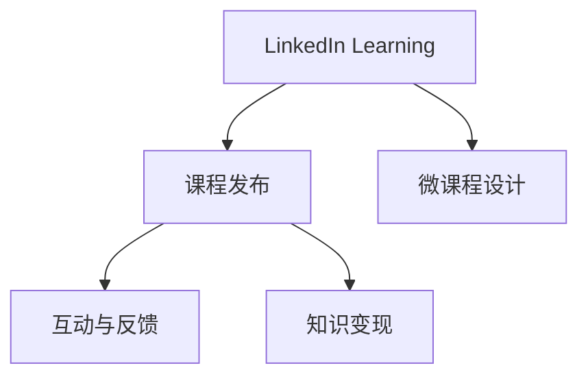

                 

# 程序员如何利用LinkedIn Learning发布课程

## 1. 背景介绍

在当今这个快速变化的数字时代，持续学习和技能提升成为了每个技术从业者的必经之路。随着技术的不断进步，传统培训方式已难以满足需求。而在线教育平台的崛起，尤其是LinkedIn Learning，为程序员提供了一种全新的学习和展示自我能力的途径。本文将深入探讨如何利用LinkedIn Learning发布自己的编程课程，从而在技术社区中建立起个人品牌，分享知识和经验，同时也能获得相应的职业发展机会。

## 2. 核心概念与联系

### 2.1 核心概念概述

为了更好地理解如何利用LinkedIn Learning发布课程，我们需要掌握几个关键概念：

- **LinkedIn Learning**：全球领先的在线学习平台，提供丰富的课程内容，涵盖技术、商业、创意等领域。
- **课程发布**：将个人的技术知识、项目经验或学习心得转化为课程内容，通过平台分享给全球的学习者。
- **微课程设计**：设计短小精悍的课程内容，每个视频不超过10分钟，便于快速学习。
- **互动与反馈**：通过平台的互动机制，如课程评论、学员问答等，与学习者进行互动，获取反馈，进一步提升课程质量。
- **知识变现**：通过课程销售、订阅费用、广告分成等形式，实现个人知识变现。

### 2.2 核心概念原理和架构的 Mermaid 流程图



这个流程图展示了LinkedIn Learning平台的核心概念及其之间的关系：

1. **LinkedIn Learning**：作为课程发布平台，提供课程内容展示和互动工具。
2. **课程发布**：将个人知识转化为课程内容，发布在平台上。
3. **微课程设计**：设计简短的课程视频，便于学习。
4. **互动与反馈**：通过评论、问答等互动机制，获取学员反馈。
5. **知识变现**：通过课程销售、广告分成等方式实现知识变现。

## 3. 核心算法原理 & 具体操作步骤

### 3.1 算法原理概述

利用LinkedIn Learning发布课程，主要涉及以下几个算法原理：

- **课程规划**：根据自身专业知识，规划课程大纲和内容。
- **视频录制**：录制简短的视频，每个视频不超过10分钟，包含知识点讲解和实践案例。
- **互动设计**：设计互动环节，如提问、讨论、学员作品展示等，提升学习体验。
- **知识变现**：根据课程销售量、订阅量等数据，计算收益。

### 3.2 算法步骤详解

以下是利用LinkedIn Learning发布课程的详细操作步骤：

**Step 1: 注册并创建账户**
- 访问LinkedIn Learning官网，注册新账户。
- 填写个人基本信息和专业背景。
- 选择适合的会员计划，通常包括基础版、专业版和高级版，会员级别越高，功能越丰富。

**Step 2: 创建课程大纲**
- 登录LinkedIn Learning平台，进入课程发布界面。
- 填写课程标题、描述、类别等信息。
- 规划课程大纲，定义每个视频的主要内容和学习目标。

**Step 3: 录制视频内容**
- 准备好所需的软件工具，如Camtasia、OBS Studio等。
- 根据课程大纲，录制简短的视频内容，每个视频不超过10分钟。
- 视频录制完成后，上传到LinkedIn Learning平台。

**Step 4: 设计互动环节**
- 在视频中插入互动问题或任务，引导学员参与讨论。
- 创建课程论坛，鼓励学员在论坛中分享学习心得和实践案例。
- 定期举行直播答疑，与学员互动，解答疑问。

**Step 5: 发布和推广课程**
- 发布课程，设定课程售价和销售策略。
- 通过LinkedIn等社交网络推广课程，吸引更多学员。
- 参与LinkedIn Learning平台的各类活动和挑战，提升课程曝光率。

**Step 6: 监控和优化课程**
- 实时监控课程销售数据、学员反馈等信息。
- 根据反馈数据，不断优化课程内容和互动设计。
- 定期更新课程内容，保持课程的新鲜度和吸引力。

### 3.3 算法优缺点

利用LinkedIn Learning发布课程有以下优点：

1. **高效学习**：课程视频简短，每个视频不超过10分钟，方便学员利用碎片时间学习。
2. **广泛传播**：LinkedIn Learning平台用户众多，课程能够触及全球各地的学习者。
3. **互动性强**：通过互动问题和论坛，学员能够积极参与讨论，提升学习效果。
4. **知识变现**：课程销售、订阅费用、广告分成等形式，能够实现个人知识变现。

同时，利用LinkedIn Learning发布课程也存在一些缺点：

1. **投入时间**：录制和设计课程内容需要大量时间，尤其是对于技术领域的复杂概念。
2. **质量要求高**：课程内容需要高质量，否则容易受到学员的负面评价。
3. **市场竞争激烈**：平台上的课程数量众多，想要脱颖而出需要独特的创意和设计。
4. **技术门槛高**：需要掌握视频录制、剪辑等技术，这对一些不熟悉技术操作的讲师来说是一大挑战。

### 3.4 算法应用领域

利用LinkedIn Learning发布课程不仅适用于技术领域的专家，也广泛应用于教育、商业、创意等多个领域。例如：

- **教育**：教师可以利用平台发布自己的教学视频，传授知识，同时获取教学反馈。
- **商业**：职场人士可以发布自己的职场技能课程，提升个人品牌，获得职业发展机会。
- **创意**：艺术家、设计师可以利用平台展示自己的作品，获得创作灵感，提升作品曝光率。
- **个人发展**：利用平台学习新技能，提升自我竞争力，同时也能分享自己的学习经验。

## 4. 数学模型和公式 & 详细讲解 & 举例说明

### 4.1 数学模型构建

假设一个课程包含$n$个视频，每个视频的观看次数为$w_i$，课程的平均观看次数为$\bar{w}$，课程的总观看次数为$W$。课程的总销售额为$S$，课程的总订阅量为$S_{\text{subs}}$。课程的互动量为$I$，包括论坛评论、直播互动等。

课程的利润模型可以表示为：

$$
P = S - C
$$

其中$C$为课程的制作和运营成本。

### 4.2 公式推导过程

根据上述模型，我们可以进一步推导课程的利润公式：

$$
P = (S_{\text{subs}} \times \text{订阅费用} + S_{\text{sales}} \times \text{销售费用} + I \times \text{互动收益}) - (C_{\text{制作}} + C_{\text{运营}})
$$

其中，$\text{订阅费用}$、$\text{销售费用}$、$\text{互动收益}$和$C_{\text{制作}}$、$C_{\text{运营}}$分别为不同的成本和收益项。

### 4.3 案例分析与讲解

以一个Python编程课程为例，分析课程的收益和成本：

- **收益**：课程销售量为1000份，每份售价为99美元，订阅量为500份，每份订阅费用为20美元，平台广告分成率为20%。课程互动量较高，平台给予额外奖励5美元。
- **成本**：视频录制费用为5000美元，课程制作费用为2000美元，平台运营费用为1000美元。

根据上述数据，计算课程利润：

$$
S = 1000 \times 99 + 500 \times 20 = 104500
$$
$$
S_{\text{subs}} = 500 \times 20 = 10000
$$
$$
I = 5 \times 100 = 500
$$
$$
P = (S_{\text{subs}} \times 20\% + S_{\text{sales}} + I) - (5000 + 2000 + 1000) = (10000 \times 20\% + 104500 + 500) - 8000 = 19500
$$

通过案例分析，我们可以看到利用LinkedIn Learning发布课程的收益和成本构成，理解其商业逻辑。

## 5. 项目实践：代码实例和详细解释说明

### 5.1 开发环境搭建

要利用LinkedIn Learning发布课程，需要以下开发环境：

- **录制设备**：高分辨率摄像头、麦克风、录音设备等。
- **视频编辑软件**：如Camtasia、OBS Studio等。
- **音频编辑软件**：如Audacity、Adobe Audition等。
- **社交网络平台**：LinkedIn、Facebook等。

### 5.2 源代码详细实现

以下是利用Python实现视频录制和编辑的示例代码：

```python
import cv2
import numpy as np

# 视频录制
cap = cv2.VideoCapture(0)
while True:
    ret, frame = cap.read()
    cv2.imshow('frame', frame)
    if cv2.waitKey(1) == ord('q'):
        break
cap.release()
cv2.destroyAllWindows()

# 视频编辑
cap = cv2.VideoCapture('input.mp4')
fourcc = cv2.VideoWriter_fourcc(*'mp4v')  # 指定视频编码格式
out = cv2.VideoWriter('output.mp4', fourcc, 30.0, (640, 480))

while cap.isOpened():
    ret, frame = cap.read()
    if not ret:
        break
    out.write(frame)
cap.release()
out.release()
cv2.destroyAllWindows()
```

### 5.3 代码解读与分析

这段代码实现了视频录制和简单的视频剪辑功能。通过OpenCV库，我们可以使用摄像头进行视频录制，并可以通过指定编码格式和帧率，将录制的视频保存为MP4格式。在实际应用中，还可以使用如Camtasia、OBS Studio等专业视频编辑软件进行更复杂的视频剪辑和效果处理。

## 6. 实际应用场景

### 6.1 在线教育

利用LinkedIn Learning发布课程，教师可以分享自己的教学经验和技术知识，提升教学效果。平台上的互动机制和学员反馈，也可以帮助教师了解学生需求，不断优化教学内容。

### 6.2 企业培训

企业可以利用LinkedIn Learning平台发布内部培训课程，提升员工的技能水平。同时，通过课程销售和订阅费用，降低培训成本，提升培训效率。

### 6.3 个人品牌建设

通过发布高质量的编程课程，程序员可以在技术社区中建立个人品牌，吸引更多关注和合作机会。课程销售和订阅费用，也可以带来可观的收入。

### 6.4 未来应用展望

未来，利用LinkedIn Learning发布课程将会更加普及，涵盖更多领域和技能。同时，随着技术的进步，课程的互动性和个性化也将不断提升，提供更加多样化的学习体验。

## 7. 工具和资源推荐

### 7.1 学习资源推荐

为了帮助程序员更好地利用LinkedIn Learning发布课程，以下是一些推荐的学习资源：

- **LinkedIn Learning官方指南**：LinkedIn Learning提供了详细的课程发布指南和FAQ，帮助讲师快速上手。
- **视频录制和编辑教程**：YouTube、Coursera等平台上有大量视频教程，涵盖视频录制、剪辑等技术。
- **编程课程范例**：GitHub等平台上有大量开源编程课程范例，可以参考和借鉴。

### 7.2 开发工具推荐

以下是一些推荐的开发工具，用于课程发布和互动设计：

- **Camtasia**：专业视频录制和编辑软件，适用于课程录制和剪辑。
- **OBS Studio**：开源视频录制工具，支持多摄像头、多屏幕录制。
- **Audacity**：免费音频编辑软件，适用于课程录制和配音。
- **Miro**：在线白板工具，适用于设计互动问题和讨论环节。

### 7.3 相关论文推荐

以下是几篇与LinkedIn Learning相关的研究论文，推荐阅读：

- **"Bridging the Learning Gap: A Study of Professional Development Programs for Adult Educators"**：探讨了在线教育平台的潜在影响和改进建议。
- **"Social Learning Networks: A Review"**：分析了社交网络在在线教育中的应用及其效果。
- **"The Impact of Interactive Learning on Student Performance: A Meta-Analysis"**：通过元分析方法，研究了互动学习对学生成绩的影响。

## 8. 总结：未来发展趋势与挑战

### 8.1 研究成果总结

本文详细探讨了利用LinkedIn Learning发布课程的原理和操作步骤，通过数学模型和案例分析，帮助读者更好地理解和实践。通过平台发布课程，程序员可以分享知识，获取反馈，提升个人品牌，同时也能实现知识变现。

### 8.2 未来发展趋势

未来，利用LinkedIn Learning发布课程将会更加普及，涵盖更多领域和技能。同时，随着技术的进步，课程的互动性和个性化也将不断提升，提供更加多样化的学习体验。

### 8.3 面临的挑战

利用LinkedIn Learning发布课程也面临着一些挑战：

1. **时间投入**：课程录制和设计需要大量时间，尤其是对于技术领域的复杂概念。
2. **质量要求高**：课程内容需要高质量，否则容易受到学员的负面评价。
3. **市场竞争激烈**：平台上的课程数量众多，想要脱颖而出需要独特的创意和设计。
4. **技术门槛高**：需要掌握视频录制、剪辑等技术，这对一些不熟悉技术操作的讲师来说是一大挑战。

### 8.4 研究展望

未来的研究需要在以下几个方面寻求新的突破：

1. **互动性提升**：通过增强互动环节，提升学习体验，如实时问答、互动游戏等。
2. **个性化推荐**：利用推荐算法，推荐适合学员的课程，提升学习效率。
3. **多语言支持**：支持多语言课程发布，覆盖更多国家和地区的学员。
4. **实时反馈**：实时监测学员学习进度和反馈，动态调整课程内容和难度。

## 9. 附录：常见问题与解答

**Q1：利用LinkedIn Learning发布课程需要哪些技能？**

A: 利用LinkedIn Learning发布课程需要掌握以下技能：
- **视频录制和编辑**：使用Camtasia、OBS Studio等工具进行视频录制和剪辑。
- **音频编辑**：使用Audacity、Adobe Audition等工具进行音频处理。
- **课程设计**：设计简短、精炼的课程内容，每个视频不超过10分钟。
- **互动设计**：设计互动问题和论坛，提升学习体验。
- **平台操作**：熟悉LinkedIn Learning平台的使用方法和功能。

**Q2：发布课程需要多少时间？**

A: 发布课程的时间取决于课程的复杂度和讲师的技术水平。通常情况下，录制一个简单的10分钟视频需要1-2小时，设计互动问题和论坛需要2-3小时，视频剪辑和音频处理需要1-2小时，发布和推广课程需要1-2小时。总体上，发布一个高质量的课程可能需要10-20小时。

**Q3：如何提升课程质量？**

A: 提升课程质量的关键在于：
- **专业性**：确保课程内容准确、实用，符合学员需求。
- **互动性**：设计有吸引力的互动环节，增强学习体验。
- **可视化**：使用图表、演示等手段，帮助学员更好地理解知识点。
- **案例分析**：结合实际案例，解释知识点。
- **学员反馈**：根据学员反馈不断优化课程内容和互动设计。

**Q4：如何推广课程？**

A: 推广课程的方法包括：
- **社交媒体**：利用LinkedIn、Facebook等社交网络平台进行推广。
- **社区活动**：参与LinkedIn Learning平台的活动和挑战，提升课程曝光率。
- **SEO优化**：优化课程标题、描述、标签等，提升课程在搜索引擎中的排名。
- **邮件营销**：向学员和社区成员发送课程推荐邮件，吸引更多人关注和订阅。

---

作者：禅与计算机程序设计艺术 / Zen and the Art of Computer Programming

