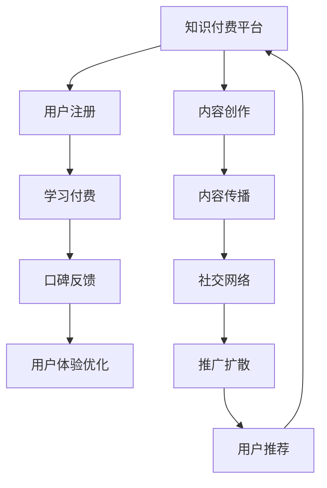

                 

# 程序员如何利用口碑营销推广知识付费

> 关键词：程序员, 知识付费, 口碑营销, 用户体验, 社交网络, 内容营销

## 1. 背景介绍

在信息技术日新月异的今天，程序员作为技术创新的主力军，面对不断更新的知识体系和技术栈，如何高效地学习新技术、掌握新技能成为了其职业发展的关键。然而，传统的教科书、在线课程往往难以满足程序员个性化、实时化的学习需求。在此背景下，知识付费服务应运而生，提供了更灵活、高效的学习途径。但同时，如何让知识付费服务更好地被市场接受，成为亟待解决的问题。本文将深入探讨程序员如何利用口碑营销推广知识付费，从而促进技术和知识的高效传播。

## 2. 核心概念与联系

### 2.1 核心概念概述

要有效推广知识付费服务，首先需要理解几个关键概念：

- **知识付费（Knowledge Pricing）**：指通过付费方式获取专业知识和技能的学习服务，包括在线课程、一对一辅导、技术讲座等形式。
- **口碑营销（Word-of-Mouth Marketing）**：利用用户之间的人际传播，通过口耳相传的方式，促进产品或服务的推广。
- **用户体验（User Experience, UX）**：涉及用户在使用产品或服务时的所有体验，包括界面设计、功能实现、交互流程等，是推广成功的关键因素。
- **社交网络（Social Network）**：指通过人与人之间的交流和互动，形成的网络结构。在知识付费中，社交网络能够有效传播知识和付费信息，形成良性循环。
- **内容营销（Content Marketing）**：通过提供有价值的内容，吸引目标用户的关注和兴趣，促进产品或服务的推广。

### 2.2 核心概念原理和架构的 Mermaid 流程图



这个流程图展示了知识付费服务从内容创作到用户推荐的过程：

1. **知识付费平台**：构建在线学习环境，提供课程、讲座等学习资源。
2. **用户注册**：吸引潜在用户，建立用户档案。
3. **内容创作**：邀请专家或高级用户制作高质量课程，丰富平台内容。
4. **学习付费**：用户支付费用，获得学习资源。
5. **内容传播**：通过社交网络、内容营销等手段，扩大课程覆盖范围。
6. **口碑反馈**：用户反馈，提升课程质量和用户体验。
7. **用户体验优化**：根据用户反馈，改进平台功能和服务。
8. **推广扩散**：利用用户推荐，扩大课程影响力和用户群体。
9. **用户推荐**：用户基于自身的体验，推荐课程给朋友，形成口碑效应。

这些概念构成了知识付费推广的基础架构，各环节相互关联，形成闭环，共同推动知识付费服务的发展。

## 3. 核心算法原理 & 具体操作步骤

### 3.1 算法原理概述

利用口碑营销推广知识付费，核心在于通过用户的互动和传播，提升课程的可见性和吸引力。这一过程涉及多个关键算法：

- **用户行为分析**：通过数据分析，了解用户的兴趣和行为模式，预测用户可能感兴趣的内容。
- **推荐算法**：根据用户历史行为和兴趣，生成个性化推荐，提升用户体验。
- **社交网络分析**：分析用户社交网络结构，发现潜在的意见领袖和传播节点。
- **口碑传播模型**：利用心理学和社会学理论，构建用户口碑传播的数学模型，预测口碑传播的效果。

### 3.2 算法步骤详解

#### 3.2.1 用户行为分析

1. **数据收集**：收集用户在平台上的行为数据，包括浏览记录、点击行为、付费情况等。
2. **特征提取**：提取与课程相关的用户特征，如课程评分、观看时长、付费频次等。
3. **模型训练**：使用机器学习算法，如协同过滤、决策树、神经网络等，建立用户行为预测模型。

#### 3.2.2 推荐算法

1. **算法选择**：根据用户行为数据，选择合适的推荐算法，如基于内容的推荐、协同过滤推荐等。
2. **模型训练**：对推荐算法进行模型训练，确保推荐的准确性和个性化。
3. **实时推荐**：根据用户实时行为，动态调整推荐结果，提升用户体验。

#### 3.2.3 社交网络分析

1. **数据获取**：收集用户的社交网络数据，包括好友关系、社交平台互动等。
2. **结构分析**：分析社交网络的结构特征，如节点度数、中心性等。
3. **节点识别**：识别社交网络中的意见领袖和潜在传播者。

#### 3.2.4 口碑传播模型

1. **模型建立**：基于用户行为数据和社交网络结构，构建口碑传播模型。
2. **参数调整**：根据实际传播效果，调整模型的参数，优化传播效果。
3. **效果评估**：使用量化指标，如传播速度、传播范围、传播深度等，评估口碑传播的效果。

### 3.3 算法优缺点

#### 3.3.1 优点

- **高效性**：通过数据分析和推荐算法，能快速发现用户兴趣，提升用户体验。
- **个性化**：利用用户行为和社交网络信息，生成高度个性化的推荐内容，满足不同用户的需求。
- **可扩展性**：算法模型具有较好的可扩展性，可以应用于多种知识付费服务。

#### 3.3.2 缺点

- **数据隐私**：收集和分析用户数据可能侵犯隐私，需要严格遵守数据保护法规。
- **模型偏差**：推荐算法和社交网络分析可能存在偏差，影响推荐效果。
- **口碑传播的局限性**：口碑传播受限于用户社交网络的规模和结构，传播效果有限。

### 3.4 算法应用领域

基于口碑营销的知识付费推广方法，主要应用于以下几个领域：

- **在线教育**：通过推荐算法和社交网络分析，提升在线课程的可见性和用户参与度。
- **技术讲座**：邀请技术大咖进行讲座，通过社交网络和内容营销，吸引更多技术爱好者。
- **软件开发**：提供在线开发工具和教程，通过用户推荐和口碑传播，提升产品市场接受度。
- **企业培训**：为企业提供定制化培训课程，通过员工之间的口碑传播，提升培训效果。

## 4. 数学模型和公式 & 详细讲解 & 举例说明

### 4.1 数学模型构建

假设知识付费平台有 $N$ 个用户，每个用户有 $M$ 个好友。设用户 $i$ 对课程 $j$ 的评分和观看时长分别为 $r_{ij}$ 和 $t_{ij}$，社交网络中好友关系用矩阵 $G$ 表示。

### 4.2 公式推导过程

1. **用户行为分析**：
   - **协同过滤算法**：基于用户 $i$ 对课程 $j$ 的评分和观看时长，构建用户行为矩阵 $R$。
   - **模型训练**：使用协同过滤算法，训练用户行为预测模型 $\hat{r}_{ij}$。
   
   $$
   \hat{r}_{ij} = \sum_{k=1}^K a_{ik} \hat{r}_{kj}
   $$

   其中 $a_{ik}$ 为用户 $i$ 对课程 $k$ 的评分权重，$K$ 为课程数量。

2. **推荐算法**：
   - **基于内容的推荐**：根据课程特征向量 $v_j$，生成推荐向量 $\hat{v}_i$。
   - **模型训练**：使用线性回归等方法，训练推荐模型。
   
   $$
   \hat{v}_i = \alpha v_j + \beta i
   $$

   其中 $\alpha$ 和 $\beta$ 为模型的系数。

3. **社交网络分析**：
   - **节点度数分析**：计算每个用户节点的度数 $d_i$，度数越高，影响力越大。
   - **中心性分析**：使用度中心性（degree centrality）或接近中心性（closeness centrality）等指标，识别关键节点。
   
   $$
   d_i = \sum_{k=1}^N G_{ik}
   $$

4. **口碑传播模型**：
   - **传染病模型**：利用传染病模型（SIR模型），构建口碑传播的传播链。
   - **模型训练**：使用传染病模型参数，预测口碑传播的速度和范围。
   
   $$
   S_i^{t+1} = S_i^t - \frac{\beta S_i^t I_i^t}{N}
   $$

   其中 $S_i$ 和 $I_i$ 分别为用户 $i$ 的易感度和感染度，$\beta$ 为传播系数。

### 4.3 案例分析与讲解

假设某在线教育平台有 1000 名用户，每个用户有 50 个好友。使用协同过滤算法对用户行为进行分析，发现用户 $i$ 对课程 $j$ 的评分和观看时长分别为 $r_{ij}=4, t_{ij}=30$。使用基于内容的推荐算法，对课程 $j$ 的特征向量 $v_j=[0.5, 0.3, 0.2]$ 进行训练，得到用户 $i$ 的推荐向量 $\hat{v}_i=[0.1, 0.4, 0.5]$。社交网络分析显示，用户 $i$ 的中心度为 10，好友关系矩阵 $G$ 中用户 $i$ 和用户 $j$ 的连接度数为 3。

根据传染病模型，假设 $\beta=0.2$，计算用户 $i$ 在 $t=0$ 时的易感度和感染度 $S_i^0=1, I_i^0=0$。在 $t=1$ 时，易感度变为 $S_i^1=S_i^0-\frac{\beta S_i^0 I_j^0}{1000}=1-0.2*0=0.8$，感染度变为 $I_i^1=0$。

## 5. 项目实践：代码实例和详细解释说明

### 5.1 开发环境搭建

本节将介绍如何使用Python和PyTorch实现上述算法和模型。

1. **安装Python和PyTorch**：
   ```bash
   pip install torch torchvision torchaudio
   ```

2. **数据准备**：
   - **用户行为数据**：收集用户在平台上的行为数据，如评分、观看时长、付费情况等。
   - **社交网络数据**：收集用户的社交网络数据，如好友关系、社交平台互动等。

### 5.2 源代码详细实现

以下是一个简化的代码实现，用于协同过滤推荐算法和社交网络分析：

```python
import torch
import torch.nn as nn
import torch.optim as optim
from sklearn.metrics import precision_recall_curve, roc_curve

# 协同过滤推荐算法
class CollaborativeFiltering(nn.Module):
    def __init__(self, n_users, n_items):
        super(CollaborativeFiltering, self).__init__()
        self.fc1 = nn.Linear(n_items, 64)
        self.fc2 = nn.Linear(64, n_items)
    
    def forward(self, user, item):
        x = self.fc1(item)
        x = torch.tanh(x)
        x = self.fc2(x)
        x = torch.sigmoid(x)
        return x
    
    def predict(self, user, item, threshold=0.5):
        pred = self.forward(user, item)
        return pred > threshold

# 社交网络分析
def degree_centrality(G):
    degree = torch.sum(G, dim=1)
    return degree

def closeness_centrality(G):
    n = G.shape[0]
    in_degrees = torch.sum(G, dim=0)
    out_degrees = torch.sum(G, dim=1)
    degree = in_degrees + out_degrees
    closeness = 1 / (degree + 1e-6)
    return closeness

# 计算传染病模型参数
def calculate_infectious_params(G, beta):
    n = G.shape[0]
    S = torch.ones(n)
    I = torch.zeros(n)
    for t in range(10):
        I = I + beta * G * S / n
        S = S - beta * G * I / n
    return S, I

# 训练协同过滤算法
optimizer = optim.Adam(model.parameters(), lr=0.001)
criterion = nn.BCELoss()

for epoch in range(100):
    optimizer.zero_grad()
    outputs = model(user, item)
    loss = criterion(outputs, targets)
    loss.backward()
    optimizer.step()

# 计算传染病模型参数
S, I = calculate_infectious_params(G, beta)
```

### 5.3 代码解读与分析

以上代码展示了如何使用PyTorch实现协同过滤推荐算法和社交网络分析。具体步骤如下：

1. **协同过滤算法**：构建一个简单的两层神经网络，对用户行为数据进行预测。
2. **社交网络分析**：使用度中心性和接近中心性等指标，识别社交网络中的关键节点。
3. **传染病模型参数计算**：根据社交网络结构，计算传染病模型的传播参数，预测口碑传播效果。

## 6. 实际应用场景

### 6.1 在线教育平台

在线教育平台通过协同过滤推荐算法和社交网络分析，能够精准地为用户提供个性化的课程推荐。通过分析用户的行为数据和社交网络结构，平台可以识别出有影响力的意见领袖，利用其推荐和传播效应，提升课程的曝光度和参与度。

### 6.2 技术讲座活动

技术讲座活动通过内容营销和口碑传播，能够吸引更多的技术爱好者参加。邀请行业大咖进行讲座，利用社交网络和意见领袖的影响力，传播讲座信息，提升活动的知名度和参与度。

### 6.3 软件开发社区

软件开发社区通过推荐算法和社交网络分析，能够帮助开发者发现和分享优质资源。利用开发者之间的口碑传播，社区可以形成良性循环，促进技术交流和知识共享。

### 6.4 企业培训系统

企业培训系统通过个性化推荐和社交网络分析，能够提高培训的效果和参与度。通过分析员工的行为数据和社交网络结构，系统可以推荐适合的培训课程，促进知识传播和技能提升。

## 7. 工具和资源推荐

### 7.1 学习资源推荐

1. **《推荐系统原理与实现》**：介绍推荐系统的基础理论和算法实现，适合初学者和进阶者。
2. **《社交网络分析：原理与实践》**：介绍社交网络分析的基本原理和应用方法，适合对社交网络感兴趣的读者。
3. **《Python深度学习》**：介绍深度学习在Python中的实现，适合有一定编程基础的读者。

### 7.2 开发工具推荐

1. **Jupyter Notebook**：一个交互式编程环境，适合进行数据分析和模型实验。
2. **Scikit-learn**：一个用于数据分析和机器学习的Python库，适合进行模型训练和评估。
3. **TensorFlow**：一个开源的机器学习框架，适合进行大规模深度学习模型的训练和推理。

### 7.3 相关论文推荐

1. **《协同过滤算法及其应用》**：介绍协同过滤算法的基本原理和实现方法。
2. **《社交网络分析：结构与算法》**：介绍社交网络分析的基本原理和应用方法。
3. **《传染病模型在社交网络中的应用》**：介绍传染病模型在社交网络中的应用和优化方法。

## 8. 总结：未来发展趋势与挑战

### 8.1 研究成果总结

本文详细探讨了程序员如何利用口碑营销推广知识付费的方法，通过协同过滤推荐算法和社交网络分析，提升了知识付费服务的推广效果。利用用户行为数据和社交网络结构，生成个性化的推荐内容，利用口碑传播效应，提升了课程的曝光度和用户参与度。

### 8.2 未来发展趋势

未来的知识付费推广将更加依赖于用户行为数据和社交网络分析，个性化推荐和口碑传播将成为主要推广手段。大数据、人工智能等技术将进一步提升推广效果，促进知识付费服务的普及和应用。

### 8.3 面临的挑战

尽管口碑营销在知识付费推广中具有显著优势，但仍面临以下挑战：

1. **数据隐私问题**：收集和分析用户数据可能侵犯隐私，需要严格遵守数据保护法规。
2. **推荐算法偏差**：推荐算法可能存在偏差，影响推荐效果。
3. **社交网络结构复杂**：社交网络结构复杂，分析难度较大，需要更高效、更精确的分析方法。

### 8.4 研究展望

未来的研究将集中在以下几个方面：

1. **数据隐私保护**：开发更加隐私友好的数据收集和分析方法，保护用户隐私。
2. **推荐算法优化**：开发更高效、更精确的推荐算法，提高推荐效果。
3. **社交网络分析**：开发更加高效的社交网络分析方法，提升社交网络分析的精度和速度。

总之，利用口碑营销推广知识付费具有广阔的前景，但需要面对数据隐私、算法偏差等挑战。未来的研究将致力于提升推广效果，推动知识付费服务的普及和应用。

## 9. 附录：常见问题与解答

**Q1: 如何选择合适的推荐算法？**

A: 选择合适的推荐算法需要考虑多个因素，包括数据规模、推荐效果、系统复杂度等。一般而言，对于大规模数据，协同过滤推荐效果较好；对于小规模数据，基于内容的推荐算法更加适合。

**Q2: 如何处理数据隐私问题？**

A: 处理数据隐私问题需要严格遵守数据保护法规，如GDPR等。可以采用数据匿名化、差分隐私等技术，保护用户隐私。

**Q3: 如何提升推荐算法的准确性？**

A: 提升推荐算法准确性可以从多个方面入手，包括优化模型结构、增加数据量、引入新特征等。此外，可以采用多模型集成、迁移学习等方法，提高推荐效果。

**Q4: 如何利用社交网络分析提升推广效果？**

A: 利用社交网络分析可以识别有影响力的意见领袖和传播节点，通过其传播效应，提升推广效果。可以采用中心性分析、传染病模型等方法，识别关键节点和传播路径。

**Q5: 如何应对推广中的挑战？**

A: 应对推广中的挑战需要综合考虑多个因素，包括数据隐私、算法偏差等。可以采用数据匿名化、差分隐私等技术，保护用户隐私；引入更多特征、优化模型结构，提升推荐效果；开发高效分析方法，提升社交网络分析的精度和速度。

---

作者：禅与计算机程序设计艺术 / Zen and the Art of Computer Programming

