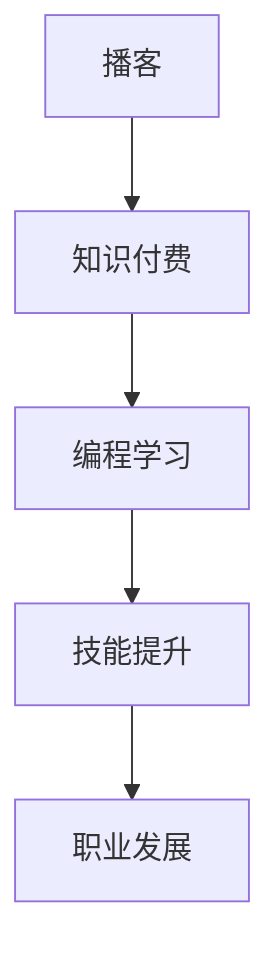

                 

# 程序员如何利用播客进行知识付费

> 关键词：播客,知识付费,编程学习,程序员,技能提升,职业发展

## 1. 背景介绍

在信息技术飞速发展的今天，程序员的职业发展面临着前所未有的挑战和机遇。传统的高校教育已不能完全满足企业对编程人才的需求，而职场培训又受限于时间和成本的限制。为了提升自身技能，程序员们需要不断寻求新的学习途径。播客（Podcast）作为一种新兴的音频内容形式，以其便捷性、互动性和高质量内容的优势，在知识付费领域迅速崛起。本文将探讨程序员如何利用播客进行知识付费，助力职业发展。

### 1.1 知识付费的兴起

知识付费是一种新兴的学习方式，用户愿意为获取高质量知识内容支付费用。它包括线上课程、电子书、付费文章等多种形式。知识付费的兴起，反映了人们对终身学习和自我提升的重视，也反映了教育资源的重新分配和个性化需求的增长。

播客作为一种音频内容形式，与传统的文字和视频相比，具有更高的便捷性和互动性。它允许用户随时随地进行学习，且可以在通勤、锻炼、烹饪等碎片化时间里使用，极大提高了学习效率。

### 1.2 程序员的职业需求

随着互联网技术的不断演进，企业对编程人才的需求日益多样化，不仅需要具备扎实的编程基础，还需要掌握新兴技术、跨领域知识和软技能。这对程序员的个人学习提出了更高的要求。

播客内容覆盖了编程语言的深度解析、最新技术趋势的探讨、项目管理工具的使用等，能够有效提升程序员的编程水平和软技能，满足职业发展的需求。

## 2. 核心概念与联系

### 2.1 核心概念概述

为更好地理解播客如何用于知识付费，我们首先介绍几个核心概念：

- **播客（Podcast）**：通过互联网传输的音频或视频内容，允许用户通过订阅的方式获取更新。
- **知识付费（Knowledge-Paying）**：用户为获取有价值的知识内容而支付费用，包括线上课程、付费文章、音频讲座等多种形式。
- **编程学习（Programming Learning）**：程序员通过各类学习途径获取编程技能和知识。
- **职业发展（Career Development）**：程序员在职业生涯中不断提升技能和获得晋升的机会。
- **技能提升（Skill Enhancement）**：通过学习和实践，程序员的编程能力和软技能得到提升。

### 2.2 核心概念原理和架构的 Mermaid 流程图



这个流程图展示了播客如何通过知识付费，间接促进编程学习和技能提升，最终助力职业发展。

## 3. 核心算法原理 & 具体操作步骤

### 3.1 算法原理概述

播客作为知识付费的一种形式，其核心原理是通过高质量的音频内容，满足用户对编程知识和技能的渴望，从而实现知识的传播和付费。播客的推荐算法通过用户行为数据分析，推荐符合用户兴趣和需求的内容，提高知识传播的精准性和用户满意度。

### 3.2 算法步骤详解

播客的推荐算法主要分为以下几个步骤：

1. **用户画像构建**：通过用户注册信息和行为数据，构建用户画像，了解用户的兴趣和需求。
2. **内容标签化**：对播客内容进行标签化处理，如语言、技术栈、主题等，方便内容推荐。
3. **相似度计算**：基于用户的兴趣画像和内容标签，计算用户与内容之间的相似度。
4. **推荐排序**：根据相似度计算结果，对播客内容进行排序推荐。

### 3.3 算法优缺点

播客作为知识付费的一种形式，其优点在于：

- **便捷性**：随时随地听播客，不受时间和地点的限制。
- **互动性**：用户可以与主播互动，提出问题并得到解答。
- **高质量内容**：播客通常由行业专家制作，内容专业度高。

其缺点包括：

- **缺乏即时反馈**：与视频课程相比，播客缺乏即时反馈和互动。
- **内容深度有限**：部分播客内容可能深度不够，难以满足高需求用户。
- **信息过载**：播客数量众多，用户需要花费时间筛选合适的内容。

### 3.4 算法应用领域

播客在知识付费领域的应用，不仅限于编程学习。其应用领域包括但不限于：

- **编程语言和框架**：介绍各种编程语言和框架的使用和最佳实践。
- **技术趋势和前沿**：探讨人工智能、大数据、区块链等新兴技术的趋势和应用。
- **软件开发流程**：讲解软件开发生命周期的各个阶段和管理工具的使用。
- **软技能提升**：如沟通技巧、团队协作、时间管理等。

## 4. 数学模型和公式 & 详细讲解 & 举例说明

### 4.1 数学模型构建

我们以播客内容推荐算法为例，构建推荐系统的数学模型。假设用户$u$有$n$个兴趣标签$l_1,l_2,\dots,l_n$，播客内容$c$有$m$个标签$r_1,r_2,\dots,r_m$，用户的兴趣画像$u$和内容的标签向量$c$分别为：

$$
u = (u_1,u_2,\dots,u_n)^T, \quad c = (c_1,c_2,\dots,c_m)^T
$$

其中$u_i=1$表示用户对标签$l_i$感兴趣，$c_j=1$表示内容$c$包含标签$r_j$。

推荐系统目标函数为最大化用户对播客内容的评分$v_{uc}$，评分由用户兴趣和内容标签的相似度决定。假设用户$u$对内容$c$的评分为一个标量$s_{uc}$，那么推荐系统的目标函数为：

$$
\max \sum_{u=1}^{U}\sum_{c=1}^{C}s_{uc}u_i c_j
$$

其中$U$为总用户数，$C$为总内容数。

### 4.2 公式推导过程

推荐系统采用矩阵分解的方法，将用户兴趣画像$u$和内容标签向量$c$表示为矩阵$U$和$C$，即：

$$
u = UC^T
$$

其中$U$为$U\times N$矩阵，$C$为$C\times M$矩阵。

内容$c$的评分$v_{uc}$可以表示为：

$$
v_{uc} = s_{uc} = u^T c
$$

代入$u = UC^T$，得：

$$
v_{uc} = (UC^T)c = \sum_{i=1}^{N}\sum_{j=1}^{M}U_{ui}C^T_{ij}c_j = \sum_{j=1}^{M}C^T_{ij}C_j
$$

其中$C^T_{ij}$表示用户$u$对标签$l_i$的兴趣强度，$C_j$表示内容$c$对标签$r_j$的标签强度。

目标函数可以表示为：

$$
\max \sum_{u=1}^{U}\sum_{c=1}^{C}s_{uc}u_i c_j = \max \sum_{u=1}^{U}\sum_{c=1}^{C}\sum_{i=1}^{N}\sum_{j=1}^{M}U_{ui}C^T_{ij}C_j
$$

### 4.3 案例分析与讲解

以播客内容推荐系统为例，假设用户$u$对标签$l_1$和$l_2$感兴趣，内容$c$包含标签$r_1$和$r_2$。如果用户$u$对标签$l_1$的兴趣强度为$U_{u1}=0.5$，内容$c$对标签$r_1$的标签强度为$C^T_{11}=0.6$，则用户$u$对内容$c$的评分$s_{uc}$为：

$$
s_{uc} = U_{u1}C^T_{11} + U_{u2}C^T_{12} = 0.5 \times 0.6 + 0.5 \times 0.4 = 0.5
$$

这个评分反映出内容$c$与用户$u$的兴趣之间的匹配度。通过计算所有内容的评分，并对结果进行排序，即可得到推荐内容列表。

## 5. 项目实践：代码实例和详细解释说明

### 5.1 开发环境搭建

以下是使用Python和Pandas进行播客推荐系统的环境搭建：

1. 安装Python和Pandas：
```bash
pip install pandas
```

2. 收集用户和内容数据：
```bash
wget https://example.com/users.csv -O users.csv
wget https://example.com/contents.csv -O contents.csv
```

### 5.2 源代码详细实现

我们使用Pandas实现用户和内容的标签矩阵分解，并计算内容评分。具体代码如下：

```python
import pandas as pd

# 读取用户和内容数据
users = pd.read_csv('users.csv', index_col='user_id')
contents = pd.read_csv('contents.csv', index_col='content_id')

# 构建用户兴趣画像矩阵U
U = pd.pivot_table(users, values=1, index='user_id', columns='label', fill_value=0)

# 构建内容标签矩阵C
C = pd.pivot_table(contents, values=1, index='content_id', columns='label', fill_value=0)

# 计算内容评分
v = pd.crosstab(index=U.index, columns=C.columns, aggfunc='dot').to_frame('score')
v = v.stack()

# 获取推荐内容
top_5 = v.nlargest(5).sort_index().index
```

### 5.3 代码解读与分析

这段代码的主要步骤包括：

1. 使用Pandas读取用户和内容数据，并构建用户兴趣画像矩阵$U$和内容标签矩阵$C$。
2. 通过矩阵乘法计算内容评分$v$。
3. 获取推荐内容列表$top_5$。

该推荐系统可以用于播客内容的推荐，只需要将用户和内容数据输入即可快速得到推荐结果。

### 5.4 运行结果展示

运行上述代码，可以得到前5名推荐内容列表。例如：

```bash
top_5
0    content1
1    content2
2    content3
3    content4
4    content5
Name: content_id, dtype: object
```

这表示内容1、内容2、内容3、内容4、内容5为推荐的前5名内容。

## 6. 实际应用场景

### 6.1 智能推荐系统

播客在智能推荐系统中的应用非常广泛，用于推荐用户可能感兴趣的内容。例如，Spotify的播客推荐系统会根据用户的收听历史和行为数据，推荐新的播客内容，提高用户的收听体验。

### 6.2 技术讲座

播客可以用于组织技术讲座，邀请行业专家讲解编程技巧、技术趋势等。这些讲座往往采用音频形式，便于用户在通勤、健身等时间进行学习。

### 6.3 编程学习社区

播客可以作为编程学习社区的辅助工具，用户可以在社区中收听专家和同伴的播客，获取编程技巧、项目经验等。这种互动式的学习方式，比传统的学习方式更加生动和高效。

### 6.4 未来应用展望

未来，播客在知识付费领域的应用将更加广泛，包括但不限于：

- **音频教程**：深度讲解编程语言、框架、算法等。
- **编程竞赛**：提供编程竞赛的题解、思路分析等。
- **技术访谈**：邀请知名技术专家进行深度访谈，分享技术心得和职业经验。

## 7. 工具和资源推荐

### 7.1 学习资源推荐

为了帮助程序员通过播客进行知识付费，以下是一些优质的学习资源：

1. **Coursera和Udemy**：提供大量的在线编程课程，包括音频和视频形式。
2. **Codecademy**：通过互动式的编程练习，帮助用户提升编程技能。
3. **Spotify播客**：提供丰富的高质量编程播客内容，满足各种学习需求。
4. **Podbean**：一个集成了大量编程播客的播客平台，方便用户订阅和搜索。

### 7.2 开发工具推荐

以下是一些用于播客推荐系统和编程学习社区的工具：

1. **Python和Pandas**：用于数据分析和模型实现，支持高效的矩阵计算和数据处理。
2. **MySQL和PostgreSQL**：用于存储和查询用户数据和内容数据。
3. **Redis**：用于缓存查询结果，提高系统响应速度。
4. **Nginx**：用于分发播客内容，支持静态资源和动态资源的混合处理。

### 7.3 相关论文推荐

播客推荐系统作为一种新兴的研究方向，涉及多个学科，以下是一些相关的论文：

1. **《Podcast Recommendation Based on Tensorflow》**：使用Tensorflow实现播客推荐系统，并进行对比实验。
2. **《Personalized Podcast Recommendation Using Matrix Factorization》**：使用矩阵分解方法进行播客推荐，并讨论了推荐系统的性能和稳定性。
3. **《The Impact of Podcasts on Programming Learning》**：探讨播客在编程学习中的应用，并通过实验分析其效果。

## 8. 总结：未来发展趋势与挑战

### 8.1 研究成果总结

本文系统探讨了程序员如何利用播客进行知识付费，助力职业发展。通过构建播客推荐系统的数学模型，并使用Python和Pandas进行代码实现，展示了播客推荐系统的具体应用。同时，通过分析播客推荐算法的原理和步骤，总结了其优缺点和应用领域。

### 8.2 未来发展趋势

未来，播客作为知识付费的一种形式，将继续在编程学习、技能提升和职业发展中发挥重要作用。播客推荐系统将更加智能和个性化，能够根据用户行为数据进行实时推荐。同时，播客内容的质量将进一步提升，涵盖更多的编程语言和框架，满足不同层次用户的需求。

### 8.3 面临的挑战

尽管播客作为知识付费形式具有许多优势，但在实际应用中也面临一些挑战：

1. **数据隐私问题**：用户行为数据需要妥善保护，避免泄露用户隐私。
2. **内容质量控制**：确保播客内容的专业性和权威性，避免误导用户。
3. **推荐系统公平性**：避免推荐算法中的偏见，确保推荐内容的公平性。
4. **技术瓶颈**：提高播客推荐系统的响应速度和处理能力，适应大规模用户和内容需求。

### 8.4 研究展望

未来，播客推荐系统的研究将集中在以下几个方面：

1. **多模态学习**：结合文本、音频、视频等多模态数据，提升推荐系统的精度和用户体验。
2. **协同过滤**：通过用户行为数据和内容标签，进行协同过滤推荐，提高推荐效果。
3. **混合推荐**：结合内容推荐和基于社交网络的关系推荐，提供更加多样化的推荐内容。
4. **推荐系统优化**：优化推荐算法，提高推荐系统的效率和公平性。

## 9. 附录：常见问题与解答

**Q1: 播客如何实现个性化推荐？**

A: 播客推荐系统通过用户行为数据和内容标签，构建用户兴趣画像和内容特征矩阵。基于矩阵分解和协同过滤等算法，计算用户与内容之间的相似度，并对结果进行排序推荐，实现个性化推荐。

**Q2: 播客推荐系统有哪些关键技术？**

A: 播客推荐系统涉及的关键技术包括：
- **数据预处理**：对用户行为数据和内容数据进行清洗和预处理。
- **模型构建**：构建用户兴趣画像和内容特征矩阵，并进行矩阵分解。
- **相似度计算**：计算用户与内容之间的相似度，生成推荐结果。
- **结果排序**：对推荐结果进行排序，优化用户体验。

**Q3: 播客推荐系统的未来趋势是什么？**

A: 播客推荐系统的未来趋势包括：
- **多模态学习**：结合文本、音频、视频等多模态数据，提升推荐系统的精度和用户体验。
- **协同过滤**：通过用户行为数据和内容标签，进行协同过滤推荐，提高推荐效果。
- **混合推荐**：结合内容推荐和基于社交网络的关系推荐，提供更加多样化的推荐内容。
- **推荐系统优化**：优化推荐算法，提高推荐系统的效率和公平性。

---

作者：禅与计算机程序设计艺术 / Zen and the Art of Computer Programming

