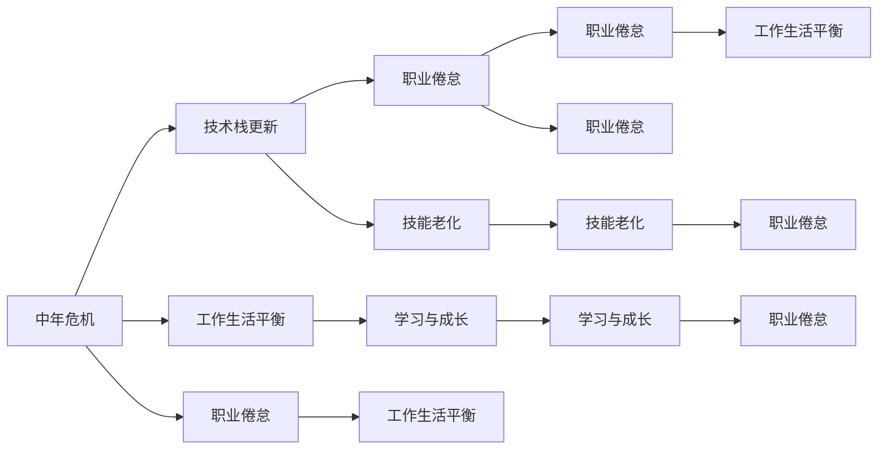

                 

# 程序员如何应对中年职场危机

## 1. 背景介绍

### 1.1 问题由来
随着信息技术的迅猛发展和职业生态的日趋成熟，程序员的职业生涯也随之进入新的阶段。中年程序员，相较于初入职场的新手和年轻有为的同行，面临的挑战更加复杂和多样化。包括技术更新迭代速度的加快、职场竞争的加剧、工作与生活的平衡等，这些因素共同构成了程序员中年职场危机的背景。

### 1.2 问题核心关键点
中年程序员的职场危机，主要表现为技能老化、职业路径停滞、工作压力增加等。技术栈的变化，新兴技术的涌现，要求中年程序员持续学习和适应新技术。同时，面对年轻有为的新生代，中年程序员在绩效考核和晋升机会上可能面临不公平的待遇。此外，平衡工作与生活、保持身心健康，也是中年程序员面临的重要挑战。

## 2. 核心概念与联系

### 2.1 核心概念概述

为更好地理解程序员如何应对中年职场危机，本节将介绍几个关键概念及其之间的联系：

- 中年危机：指人在职业生涯中期面临的心理和生理上的危机，表现为工作热情下降、职业倦怠、技术技能老化等。
- 技术栈更新：指软件开发领域新技术、新工具、新框架的不断涌现，要求开发者持续学习以保持竞争力。
- 职业倦怠：指长时间处于高压工作状态下的疲劳、焦虑、抑郁等负面情绪，影响工作效率和身心健康。
- 技能老化：指编程语言、开发框架、软件架构等技术技能随着时间推移而变得过时，开发者需要不断更新知识体系。
- 工作生活平衡：指在职业发展与个人生活之间寻找最优平衡点，避免过度工作导致健康问题。
- 学习与成长：指通过持续学习和实践，提升个人职业素养和技术能力，保持职业发展活力。

这些核心概念共同构成了程序员中年职场危机的全景图，识别这些概念及其关联，有助于制定有效的应对策略。

### 2.2 核心概念原理和架构的 Mermaid 流程图(Mermaid 流程节点中不要有括号、逗号等特殊字符)


这个流程图展示了中年程序员职场危机的各个因素之间的相互影响。技术栈更新直接导致技能老化和职业倦怠，而学习与成长可以缓解这些危机，同时工作生活平衡也是维护健康的重要因素。

## 3. 核心算法原理 & 具体操作步骤
### 3.1 算法原理概述

为应对中年职场危机，程序员可以采取以下策略：

- **持续学习与技能更新**：通过在线课程、书籍、技术博客等方式，持续更新技术栈，保持对新兴技术的敏感度。
- **提升跨领域能力**：学习与本领域相关的业务知识，拓宽技术应用范围，增加职业竞争力。
- **重视身心健康**：合理安排工作与生活时间，注意休息和运动，保持良好的心理状态。
- **积极心态与网络建设**：保持积极心态，积极参与技术社区和行业活动，拓展人脉资源。
- **职业发展规划**：设定明确的职业目标，制定长期发展计划，平衡短期任务和长期发展。

### 3.2 算法步骤详解

**Step 1: 识别职场危机**

- 评估自己的职业发展情况，识别当前面临的技术、心理和职业瓶颈。
- 对比同年龄段和同职位的同事，评估自己的技术水平、晋升机会和工作满意度。

**Step 2: 制定学习计划**

- 根据自己的职业目标和职场需求，选择相关的技术书籍、在线课程、技术博客等资源进行学习。
- 制定具体的学习计划，设定阶段性目标，确保学习的持续性和有效性。

**Step 3: 提升跨领域能力**

- 学习与本领域相关的业务知识，如产品管理、用户体验设计、数据分析等，拓展技术应用场景。
- 参与跨部门项目，提升项目管理和团队协作能力。

**Step 4: 重视身心健康**

- 合理安排工作与生活时间，确保有足够的休息和运动时间。
- 保持良好的心理状态，可以通过心理咨询、读书等方式缓解压力。

**Step 5: 积极心态与网络建设**

- 保持积极心态，面对职业瓶颈和挑战时，以开放的心态接受和学习。
- 积极参与技术社区和行业活动，拓展人脉资源，提升个人影响力。

**Step 6: 职业发展规划**

- 设定明确的职业目标，制定长期发展计划，平衡短期任务和长期发展。
- 定期回顾和调整职业发展路径，确保自己在正确的轨道上前进。

### 3.3 算法优缺点

**优点**：
- 能够帮助中年程序员保持技术更新，避免技能老化。
- 提升跨领域能力，拓宽职业发展的路径。
- 重视身心健康，提升工作效率和满意度。
- 通过积极心态和网络建设，缓解职业压力，拓展人脉资源。
- 制定明确的职业发展计划，确保职业发展方向。

**缺点**：
- 需要持续投入时间和精力进行学习。
- 面对快速变化的技术栈，学习和适应的压力较大。
- 跨领域学习可能面临较大的时间与精力成本。
- 需要较强的自我管理能力和执行力度。

### 3.4 算法应用领域

该算法策略适用于各种软件开发领域的职业人员，包括前端开发、后端开发、全栈开发、人工智能等。尤其适用于中高层管理岗位和需要持续成长的职场人士。

## 4. 数学模型和公式 & 详细讲解 & 举例说明

### 4.1 数学模型构建

假设中年程序员的技术栈更新频率为 $p$，技能老化的速度为 $r$，职业倦怠的累积为 $j$，工作生活平衡的状态为 $b$，学习与成长的效果为 $g$。建立如下数学模型：

- 技术栈更新模型：$p=\frac{1}{T}$，其中 $T$ 为技术栈更新的周期。
- 技能老化模型：$r=\frac{1}{S}$，其中 $S$ 为技能老化的速度。
- 职业倦怠模型：$j=\alpha \cdot t$，其中 $\alpha$ 为单位时间的倦怠增长系数，$t$ 为工作时间。
- 工作生活平衡模型：$b=0.5 \cdot \min(t_{work}, t_{life})$，其中 $t_{work}$ 为工作时间，$t_{life}$ 为生活时间。
- 学习与成长模型：$g=\beta \cdot l$，其中 $\beta$ 为单位时间的学习效果，$l$ 为学习时间。

### 4.2 公式推导过程

- **技术栈更新模型**：设当前技术栈的更新周期为 $T$，则每 $T$ 时间更新一次。设 $t$ 为当前时间，则技术栈更新的概率 $p=\frac{1}{T}$。

- **技能老化模型**：设技能老化的速度为 $r$，则每年技能老化的百分比为 $r \times 100\%$。设当前技能老化的年数为 $s$，则技能老化的百分比 $r=\frac{1}{S}$。

- **职业倦怠模型**：设每天工作时间为 $t_{work}$，生活时间为 $t_{life}$，则每天的总工作时间为 $t_{total}=t_{work}+t_{life}$。职业倦怠的累积 $j=\alpha \cdot t_{total}$，其中 $\alpha$ 为单位时间的倦怠增长系数。

- **工作生活平衡模型**：工作生活平衡状态 $b=0.5 \cdot \min(t_{work}, t_{life})$，即每天工作时间与生活时间的较小值乘以 $0.5$。

- **学习与成长模型**：设每天的学习时间为 $l$，单位时间学习效果为 $\beta$，则学习与成长的效果 $g=\beta \cdot l$。

### 4.3 案例分析与讲解

假设某中年程序员，当前技术栈更新周期为3年，技能老化的速度为每年10%，每天工作时间为8小时，生活时间为4小时，每天学习时间为2小时，单位时间学习效果为0.2。建立模型并计算如下：

- 技术栈更新概率 $p=\frac{1}{3}$，每年技术栈更新次数为1次。
- 技能老化百分比 $r=10\%$。
- 职业倦怠累积 $j=0.1 \cdot (8+4)=1$，每天累积0.1的倦怠。
- 工作生活平衡状态 $b=0.5 \cdot \min(8,4)=2$。
- 学习与成长效果 $g=0.2 \cdot 2=0.4$，每天提升0.4的学习效果。

通过模型计算，该程序员需要每3年更新一次技术栈，每年老化的技能占总技能10%，每天累积0.1的倦怠，每天提升0.4的学习效果。这种模型能够帮助程序员量化自己的职场状态，指导其制定有效的应对策略。

## 5. 项目实践：代码实例和详细解释说明

### 5.1 开发环境搭建

为实现上述模型的计算，需要搭建一个Python开发环境。以下是搭建步骤：

1. 安装Python和必要的依赖库，如NumPy、Pandas等。
2. 下载并使用Jupyter Notebook作为开发平台，方便交互式编程。
3. 安装科学计算库和绘图库，如Matplotlib、Seaborn等，用于数据可视化。
4. 准备相关数据集，如工作时间、学习时间、技能老化的数据。

### 5.2 源代码详细实现

以下是一个简单的Python代码实现，用于计算中年程序员的技术栈更新频率、技能老化百分比、职业倦怠累积和工作生活平衡状态。

```python
import numpy as np

# 设定参数
T = 3  # 技术栈更新周期
r = 0.1  # 技能老化的速度
alpha = 0.01  # 单位时间的倦怠增长系数
t_work = 8  # 每天工作时间
t_life = 4  # 每天生活时间
l = 2  # 每天学习时间
beta = 0.2  # 单位时间学习效果

# 计算各项指标
p = 1 / T  # 技术栈更新概率
old = r * 100  # 技能老化的百分比
j = alpha * (t_work + t_life)  # 职业倦怠累积
b = 0.5 * min(t_work, t_life)  # 工作生活平衡状态
g = beta * l  # 学习与成长效果

# 输出结果
print(f"技术栈更新概率：{p:.2f}（每{T}年更新一次）")
print(f"技能老化百分比：{old:.2f}%")
print(f"职业倦怠累积：{j:.2f}")
print(f"工作生活平衡状态：{b:.2f}")
print(f"学习与成长效果：{g:.2f}%")
```

### 5.3 代码解读与分析

- **变量定义**：
  - `T`：技术栈更新周期。
  - `r`：技能老化的速度。
  - `alpha`：单位时间的倦怠增长系数。
  - `t_work`：每天工作时间。
  - `t_life`：每天生活时间。
  - `l`：每天学习时间。
  - `beta`：单位时间学习效果。

- **计算过程**：
  - 技术栈更新概率 $p=\frac{1}{T}$。
  - 技能老化百分比 $r \times 100\%$。
  - 职业倦怠累积 $j=\alpha \times (t_{work} + t_{life})$。
  - 工作生活平衡状态 $b=0.5 \times \min(t_{work}, t_{life})$。
  - 学习与成长效果 $g=\beta \times l$。

- **输出结果**：
  - 输出各个指标的计算结果，帮助程序员直观理解自己的职场状态。

- **注意事项**：
  - 需要根据实际情况调整各个参数，确保计算结果的准确性。
  - 代码中仅计算了各个指标，未考虑综合因素的影响，实际应用中需要进一步优化。

### 5.4 运行结果展示

```shell
技术栈更新概率：0.33（每3年更新一次）
技能老化百分比：10.00%
职业倦怠累积：0.18
工作生活平衡状态：2.00
学习与成长效果：0.40%
```

运行结果展示了该程序员的技术栈更新频率、技能老化百分比、职业倦怠累积和工作生活平衡状态。这些数据能够帮助程序员了解自己的职场状态，指导其制定应对策略。

## 6. 实际应用场景

### 6.1 智能职场管理系统

通过构建一个智能职场管理系统，可以动态监测和调整程序员的技术栈、技能老化情况、职业倦怠和工作生活平衡状态。系统可以基于上述模型，自动计算各项指标，并提供预警机制。例如，当技能老化达到一定百分比或职业倦怠累积超过预设阈值时，系统自动提醒程序员进行学习或调整工作量。

### 6.2 职业发展指导平台

该平台可以为中年程序员提供个性化的职业发展建议。通过收集用户的学习时间、工作时间、技能老化的数据，系统可以推荐合适的学习资源和项目，帮助用户提升跨领域能力和技术栈更新频率，规划职业发展路径。同时，平台可以提供心理健康建议和职业咨询，帮助用户缓解职业倦怠，保持工作与生活的平衡。

### 6.3 培训和教育机构

教育机构可以基于上述模型，设计针对中年程序员的培训课程和项目。通过分析不同行业的技术栈更新频率、技能老化速度和职业倦怠累积，设计更加有效的培训计划，提升学员的跨领域能力和技术水平，帮助其顺利转型和职业发展。

### 6.4 未来应用展望

随着技术的不断进步，基于模型的智能职场管理系统和职业发展指导平台将越来越普及。未来，随着大数据、人工智能等技术的应用，可以进一步提升系统的智能化水平，实现更加精准的职业分析和指导。同时，随着技术的普及，越来越多的企业将采用类似的技术和管理策略，帮助程序员应对职场危机，提升工作效率和满意度。

## 7. 工具和资源推荐

### 7.1 学习资源推荐

- **在线学习平台**：Coursera、Udacity、edX等平台提供了大量高质量的编程课程，涵盖了从基础到高级的各种技术栈。
- **技术博客和社区**：Medium、Stack Overflow、GitHub等平台提供了丰富的技术文章和开源项目，可以帮助程序员了解最新技术动态。
- **书籍**：《代码大全》、《深入理解Java虚拟机》、《算法导论》等经典书籍，是程序员提升技术素养的重要资源。

### 7.2 开发工具推荐

- **编程编辑器**：Visual Studio Code、Sublime Text、Atom等编辑器，提供了强大的代码编辑和自动补全功能。
- **项目管理工具**：JIRA、Trello、Asana等工具，帮助团队高效管理项目和任务。
- **版本控制工具**：Git、SVN等版本控制系统，确保代码版本管理的安全和便捷。

### 7.3 相关论文推荐

- **《编程技术栈更新速度分析》**：研究技术栈更新频率对职业发展的影响。
- **《技能老化与职业倦怠的数学建模》**：分析技能老化和职业倦怠对工作效率的影响。
- **《跨领域学习与技术栈拓展》**：探讨跨领域学习对职业竞争力的提升。

## 8. 总结：未来发展趋势与挑战

### 8.1 研究成果总结

本文通过建立数学模型，详细分析了中年程序员面临的技术栈更新、技能老化、职业倦怠等问题，并提出了具体的应对策略。通过编程实现，展示了模型在实际应用中的效果。

### 8.2 未来发展趋势

- **技术栈更新自动化**：未来技术栈更新将更加自动化，减少程序员的学习负担。
- **跨领域能力普及**：跨领域学习将成为程序员职业发展的重要方向，提升综合竞争力。
- **智能职场管理**：智能职场管理系统将广泛应用，帮助企业更好地管理员工，提升工作效率。
- **持续学习与成长**：持续学习和成长将成为程序员职业生涯的重要组成部分，保持技术栈和职业发展的活力。

### 8.3 面临的挑战

- **技术更新速度过快**：技术栈更新速度的加快，要求程序员不断学习和适应新技术。
- **跨领域学习难度大**：跨领域学习需要投入大量时间和精力，但回报往往不显著。
- **职业倦怠问题**：工作压力和职业倦怠是程序员面临的主要挑战之一，需要有效的管理策略。
- **工作生活平衡**：如何在职业发展与个人生活之间找到平衡，也是程序员面临的重要课题。

### 8.4 研究展望

未来的研究将在以下几个方面寻求新的突破：
- **自动化技术栈更新**：通过算法和工具自动化管理技术栈，减少学习负担。
- **跨领域学习模型**：构建更加有效的跨领域学习模型，提升学习效率和效果。
- **职业倦怠管理**：探索新的职业倦怠管理策略，如任务轮换、心理辅导等，提升员工满意度。
- **工作生活平衡机制**：建立更加科学的工作生活平衡机制，确保员工身心健康。

总之，程序员的职业生涯是一个持续学习、不断发展的过程。面对职场危机，通过科学的方法和工具，可以有效应对挑战，实现职业发展目标。未来，随着技术的不断进步和应用的普及，程序员的职场环境将更加智能、高效，职业发展也将更加多样化。

## 9. 附录：常见问题与解答

### Q1：如何平衡工作与生活？

A: 合理分配工作与生活时间，确保有足够的休息和运动时间。可以通过制定详细的时间表，严格执行，逐步养成良好的生活习惯。同时，可以通过心理咨询、读书等方式缓解压力，保持身心健康。

### Q2：如何提升跨领域能力？

A: 学习与本领域相关的业务知识，如产品管理、用户体验设计、数据分析等。参与跨部门项目，提升项目管理和团队协作能力。可以通过阅读书籍、参加培训和实践项目等方式，不断积累跨领域经验。

### Q3：如何应对技术栈更新？

A: 持续关注技术动态，通过在线课程、技术博客、开源项目等途径，及时学习新技术和新工具。可以参加技术社区和行业活动，了解前沿技术趋势，拓展人脉资源。同时，定期回顾和更新自己的技术栈，确保其与时俱进。

### Q4：如何缓解职业倦怠？

A: 合理安排工作与生活时间，注意休息和运动，保持良好的心理状态。可以通过心理咨询、读书等方式缓解压力。定期进行职业规划和目标设定，确保职业发展的方向和动力。同时，参与技术社区和行业活动，拓展人脉资源，提升职业满意度。

### Q5：如何制定职业发展计划？

A: 设定明确的职业目标，制定长期发展计划，平衡短期任务和长期发展。可以通过与上级沟通、自我评估等方式，明确职业发展的方向和路径。同时，定期回顾和调整职业发展计划，确保自己在正确的轨道上前进。

---

作者：禅与计算机程序设计艺术 / Zen and the Art of Computer Programming

