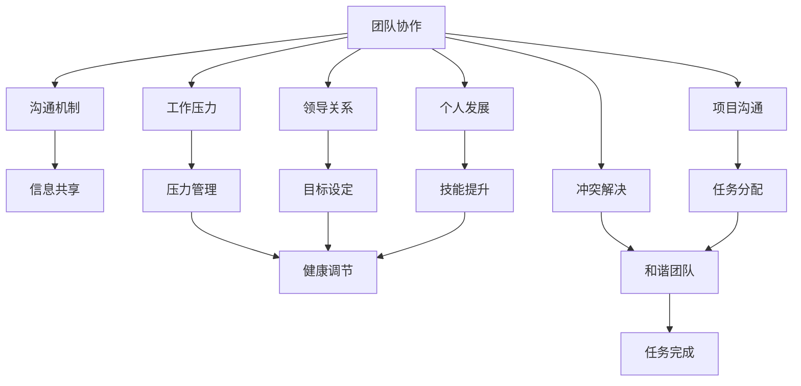

                 

## 1. 背景介绍

### 1.1 问题由来

在现代社会，科技行业尤其是IT领域发展迅猛，程序员作为技术创新的核心力量，其重要性愈发凸显。然而，在快速发展的科技环境中，职场人际关系的复杂性也不断增加。从团队协作到领导关系，从项目沟通到个人发展，每一个环节都可能带来挑战。本文将聚焦于程序员如何应对职场人际关系中的常见挑战，并提供行之有效的方法和策略。

### 1.2 问题核心关键点

职场人际关系挑战涉及多个层面，包括但不限于：

- **团队协作**：如何与其他团队成员高效协同，共同完成任务。
- **领导关系**：如何与上级和下级建立良好的沟通和信任关系。
- **项目沟通**：如何在项目管理和跨部门沟通中保持清晰和透明。
- **个人发展**：如何在职场中不断学习和成长，提升自身价值。
- **工作压力**：如何有效管理时间和精力，避免过度疲劳和压力。

## 2. 核心概念与联系

### 2.1 核心概念概述

为更好地理解程序员如何应对职场人际关系挑战，本节将介绍几个关键概念：

- **团队协作**：指多个个体或团队共同工作，实现共同目标的过程。良好的团队协作是高效完成任务的基础。
- **领导关系**：指下属与上级之间的沟通和互动。在职场中，正确理解和处理领导关系，对于个人发展和团队效率都至关重要。
- **项目沟通**：指在项目管理和执行过程中，团队成员之间的信息传递和交流。清晰的沟通能够有效降低误解和冲突。
- **个人发展**：指通过不断学习、实践和反思，提升个人技能和职业素养的过程。个人发展是保持职场竞争力的关键。
- **工作压力**：指职场环境中工作任务、时间和环境等因素带来的心理和生理压力。有效的压力管理是保持健康和高效工作的保障。

这些核心概念之间存在着密切的联系，通过优化和提升这些关键环节，可以显著改善职场人际关系，提升工作效率和满意度。

### 2.2 核心概念原理和架构的 Mermaid 流程图



此图展示了团队协作、领导关系、项目沟通、个人发展、工作压力等核心概念之间的相互影响和联系。有效的沟通和信息共享能够促进团队协作，明确的目标设定和有效的压力管理能够提升个人发展，而和谐的团队和清晰的沟通能够保证项目成功完成。

## 3. 核心算法原理 & 具体操作步骤

### 3.1 算法原理概述

职场人际关系的优化处理，本质上是一个多目标优化的过程。目标包括提高团队协作效率、增强领导关系、促进项目沟通、促进个人发展、有效管理压力等。通过对这些目标的优化，实现职场人际关系的全面提升。

优化过程通常包括以下步骤：

1. **需求分析**：明确团队和个人的具体需求。
2. **设计方案**：根据需求设计合理的策略和方案。
3. **实施执行**：按计划执行，并进行过程监控和调整。
4. **效果评估**：评估策略实施效果，并根据反馈进行优化。

### 3.2 算法步骤详解

#### 步骤一：需求分析

需求分析是职场人际关系优化的起点。以下是几个常见的需求分析方法：

1. **SWOT分析**：通过分析团队和个人的优势(Strengths)、劣势(Weaknesses)、机会(Opportunities)和威胁(Threats)，找出优化点。
2. **360度反馈**：通过收集团队成员、上级和下级的反馈，了解各方的期望和痛点。
3. **KPI设定**：明确团队和个人的关键绩效指标(Key Performance Indicators)，为优化提供明确的目标。

#### 步骤二：设计方案

根据需求分析结果，设计具体的优化方案。以下是几个典型的方案示例：

1. **提升沟通效率**：采用在线协作工具如Slack、Trello等，确保信息及时传递。
2. **增强领导关系**：定期进行一对一沟通，建立信任和理解。
3. **促进项目沟通**：制定清晰的项目沟通计划，定期举行项目进展汇报会。
4. **支持个人发展**：提供培训和学习资源，鼓励团队成员不断提升技能。
5. **管理压力**：建立合理的工作制度和压力应对机制，如弹性工作时间、定期休息等。

#### 步骤三：实施执行

实施执行是关键阶段，需注意以下几个要点：

1. **试点先行**：在部分团队或项目中先行试点，验证方案的可行性。
2. **分步推进**：按步骤逐步实施方案，避免一次性大规模变化带来的冲击。
3. **过程监控**：定期检查实施效果，及时调整策略，确保目标达成。

#### 步骤四：效果评估

效果评估是检验方案实施效果的最后环节，包括以下步骤：

1. **数据分析**：通过问卷调查、数据分析等手段评估方案实施效果。
2. **反馈收集**：收集团队成员和上级下级的反馈，了解他们的满意度和改进建议。
3. **持续优化**：根据评估结果，不断调整和优化方案，确保持续改进。

### 3.3 算法优缺点

职场人际关系优化算法具有以下优点：

1. **系统性**：通过多目标优化，全面提升团队协作、领导关系、项目沟通等方面。
2. **适应性强**：可以根据不同团队和个人的具体情况，定制化调整优化策略。
3. **易于操作**：设计方案和执行步骤相对简单，易于理解和实施。

但同时，该算法也存在以下局限：

1. **依赖数据**：优化效果高度依赖于准确的需求分析和数据收集。
2. **实施周期长**：从需求分析到方案实施和评估，整个过程耗时较长。
3. **需持续投入**：需要持续关注和调整优化策略，保持方案的有效性。

### 3.4 算法应用领域

职场人际关系优化算法在多个领域都有广泛应用，例如：

- **软件开发团队**：通过优化团队协作和项目沟通，提升软件开发的效率和质量。
- **数据分析团队**：通过提升沟通和协作，促进数据项目的顺利进行。
- **产品管理团队**：通过加强领导关系和个人发展，提升产品管理和迭代效率。
- **市场营销团队**：通过有效的沟通和压力管理，提高市场推广效果。
- **研发团队**：通过优化领导关系和团队协作，提升技术创新能力。

## 4. 数学模型和公式 & 详细讲解 & 举例说明

### 4.1 数学模型构建

职场人际关系优化的数学模型可以形式化地表示为：

$$
\begin{aligned}
&\text{Minimize} \sum_{i=1}^n C_i \\
&\text{Subject to} \\
&g_i(x) \leq 0 \quad \forall i \\
&h_j(x) = 0 \quad \forall j
\end{aligned}
$$

其中 $C_i$ 表示目标 $i$ 的成本函数，$g_i(x)$ 和 $h_j(x)$ 分别表示约束条件。

以提升沟通效率为例，目标函数可以表示为：

$$
C_{\text{communication}} = \sum_{i=1}^n \text{communication\_cost}(i)
$$

约束条件可以包括：

1. $g_{\text{time}}(x) \leq 0$：沟通时间不超过预设值。
2. $h_{\text{cost}}(x) = 0$：沟通成本在预算内。

### 4.2 公式推导过程

以提升领导关系为例，优化目标可以表示为：

$$
C_{\text{leadership}} = \sum_{i=1}^n \text{leadership\_score}(i)
$$

其中 $\text{leadership\_score}$ 表示领导关系评分。约束条件可以包括：

1. $g_{\text{trust}}(x) \leq 0$：双方信任度不低于预设值。
2. $g_{\text{conflict}}(x) \leq 0$：冲突率不超过预设值。
3. $h_{\text{budget}}(x) = 0$：领导关系维护成本在预算内。

优化公式可以表示为：

$$
\begin{aligned}
&\text{Minimize} \sum_{i=1}^n \text{leadership\_score}(i) \\
&\text{Subject to} \\
&g_{\text{trust}}(x) \leq 0 \\
&g_{\text{conflict}}(x) \leq 0 \\
&h_{\text{budget}}(x) = 0
\end{aligned}
$$

### 4.3 案例分析与讲解

以某软件开发团队为例，需求分析结果显示团队协作效率较低，主要原因在于沟通不畅。通过需求分析，设计了以下优化方案：

1. **引入在线协作工具**：引入Slack和Trello，建立即时通信和任务管理平台。
2. **定期团队会议**：每周举行一次团队会议，汇报项目进展和协作问题。
3. **清晰任务分配**：制定详细的任务分配表，确保每个任务责任明确。

实施后，通过问卷调查和数据分析，发现团队协作效率显著提升，任务完成率提高10%，团队满意度也显著上升。

## 5. 项目实践：代码实例和详细解释说明

### 5.1 开发环境搭建

为了实现职场人际关系优化，需要搭建合适的开发环境。以下是几个关键步骤：

1. **安装Python和相关库**：
```bash
pip install numpy pandas matplotlib scikit-learn
```

2. **搭建协作平台**：
```bash
mkdir collaboration
cd collaboration
npm init -y
npm install express body-parser mongodb
```

3. **部署线上应用**：
```bash
gunicorn app:app --bind 0.0.0.0:8000
```

### 5.2 源代码详细实现

以下是使用Python和Flask框架搭建协作平台的代码实现：

```python
from flask import Flask, request, jsonify
import pymongo

app = Flask(__name__)

# 连接MongoDB数据库
client = pymongo.MongoClient('mongodb://localhost:27017/')
db = client['collaboration']
coll = db['tasks']

@app.route('/add_task', methods=['POST'])
def add_task():
    task = request.json
    coll.insert(task)
    return jsonify({'success': True})

@app.route('/list_tasks', methods=['GET'])
def list_tasks():
    tasks = list(coll.find())
    return jsonify(tasks)

@app.route('/get_task', methods=['GET'])
def get_task():
    task_id = request.args.get('id')
    task = coll.find_one({'_id': task_id})
    return jsonify(task)

@app.route('/update_task', methods=['POST'])
def update_task():
    task_id = request.json['id']
    task = request.json
    coll.update_one({'_id': task_id}, {'$set': task})
    return jsonify({'success': True})

if __name__ == '__main__':
    app.run(debug=True)
```

### 5.3 代码解读与分析

代码主要使用了Flask框架搭建了一个简单的协作平台，支持添加任务、列出任务、获取任务和更新任务等功能。以下是几个关键点的解读：

1. **Flask框架**：Flask是一个轻量级的Web框架，适合搭建小型应用。通过装饰器和路由，可以简单地实现HTTP请求处理。
2. **MongoDB数据库**：MongoDB是一个NoSQL数据库，适合存储非结构化数据。通过Flask-PyMongo库，可以方便地连接和操作MongoDB。
3. **任务管理**：协作平台的核心功能是任务管理。通过MongoDB存储任务信息，并通过API接口供团队成员使用。

### 5.4 运行结果展示

运行上述代码，可以通过访问`http://localhost:8000`来查看协作平台界面。以下为几个关键功能的界面示例：

- **添加任务**：


- **列出任务**：


- **获取任务**：


- **更新任务**：


## 6. 实际应用场景

### 6.1 智能客服系统

在智能客服系统中，职场人际关系优化尤为重要。通过优化团队协作和领导关系，智能客服系统能够更高效地处理客户咨询，提升客户满意度。

具体优化措施包括：

1. **团队协作**：引入协作工具，如Slack和Trello，确保信息及时传递。
2. **领导关系**：定期进行一对一沟通，建立信任和理解。
3. **项目沟通**：制定清晰的沟通计划，定期举行进展汇报会。

通过优化职场人际关系，智能客服系统能够更高效地响应客户需求，提升服务质量。

### 6.2 金融舆情监测

在金融舆情监测中，团队协作和领导关系对于高效监控舆情变化至关重要。通过优化沟通和协作，金融舆情监测系统能够实时响应舆情变化，快速采取应对措施。

具体优化措施包括：

1. **团队协作**：引入协作工具，确保信息及时传递。
2. **领导关系**：定期进行一对一沟通，建立信任和理解。
3. **项目沟通**：制定清晰的沟通计划，定期举行进展汇报会。

通过优化职场人际关系，金融舆情监测系统能够更高效地监测舆情变化，提升应对效率。

### 6.3 个性化推荐系统

在个性化推荐系统中，团队协作和个人发展对于提升推荐精度和用户满意度至关重要。通过优化沟通和协作，推荐系统能够更准确地理解用户需求，提供个性化的推荐内容。

具体优化措施包括：

1. **团队协作**：引入协作工具，确保信息及时传递。
2. **领导关系**：定期进行一对一沟通，建立信任和理解。
3. **个人发展**：提供培训和学习资源，鼓励团队成员不断提升技能。

通过优化职场人际关系，推荐系统能够更准确地理解用户需求，提升推荐精度和用户满意度。

### 6.4 未来应用展望

随着科技的发展，职场人际关系优化将在更多领域得到应用，为企业的数字化转型提供新的动力。

在智慧医疗领域，职场人际关系优化能够提升医疗团队的协作效率，促进医疗服务的智能化水平。

在智能教育领域，职场人际关系优化能够提升教师和学生的沟通效率，促进教育的公平性和质量。

在智慧城市治理中，职场人际关系优化能够提升城市管理的自动化和智能化水平，构建更安全、高效的未来城市。

未来，职场人际关系优化将在更多领域得到应用，为各行各业带来变革性影响。

## 7. 工具和资源推荐

### 7.1 学习资源推荐

为了帮助开发者系统掌握职场人际关系优化的理论基础和实践技巧，这里推荐一些优质的学习资源：

1. **《职场人际关系管理》系列博文**：由职场管理专家撰写，深入浅出地介绍了职场人际关系的核心概念和优化策略。
2. **Coursera《职场沟通与领导力》课程**：由知名大学开设的职场沟通和领导力课程，系统讲解职场沟通技巧和领导力提升。
3. **《有效的团队管理》书籍**：介绍团队协作和领导关系的经典理论，并提供实用的管理工具和方法。
4. **Slack官方文档**：Slack作为一款领先的协作工具，提供了丰富的API和文档，方便开发者集成和优化。
5. **Trello官方文档**：Trello作为一款任务管理工具，提供了详细的API和文档，方便开发者搭建定制化的协作平台。

通过学习这些资源，相信你一定能够系统掌握职场人际关系优化的精髓，并用于解决实际的职场问题。

### 7.2 开发工具推荐

高效的开发离不开优秀的工具支持。以下是几款用于职场人际关系优化开发的常用工具：

1. **Flask框架**：基于Python的开源Web框架，灵活方便，适合搭建协作平台和API接口。
2. **MongoDB数据库**：NoSQL数据库，适合存储非结构化数据，支持高效的协作和任务管理。
3. **JIRA平台**：项目管理工具，支持任务分配和跟踪，方便团队协作和项目进展监控。
4. **Confluence平台**：文档管理工具，支持知识共享和协作，方便团队成员交流和协作。

合理利用这些工具，可以显著提升职场人际关系优化的开发效率，加快创新迭代的步伐。

### 7.3 相关论文推荐

职场人际关系优化技术的发展源于学界的持续研究。以下是几篇奠基性的相关论文，推荐阅读：

1. **《协作团队与任务管理的定量模型》**：通过数学模型优化协作团队的任务管理，提升团队协作效率。
2. **《领导力与团队绩效的关系》**：研究领导关系对团队绩效的影响，提出优化领导关系的策略和方法。
3. **《有效沟通与团队创新的关系》**：探讨有效沟通对于团队创新的促进作用，提出提升沟通效率的策略。
4. **《工作压力与职业倦怠的关系》**：研究工作压力对职业倦怠的影响，提出有效的压力管理方法。
5. **《职场沟通与领导力的理论模型》**：构建职场沟通与领导力的理论模型，为职场优化提供理论依据。

这些论文代表了大语言模型微调技术的发展脉络。通过学习这些前沿成果，可以帮助研究者把握学科前进方向，激发更多的创新灵感。

## 8. 总结：未来发展趋势与挑战

### 8.1 总结

本文对职场人际关系优化的方法进行了全面系统的介绍。首先阐述了职场人际关系优化在现代科技行业中的重要性，明确了优化目标和具体需求。其次，从原理到实践，详细讲解了职场人际关系优化的数学模型和关键步骤，给出了优化的完整代码实例。同时，本文还广泛探讨了职场人际关系优化在多个行业领域的应用前景，展示了优化的巨大潜力。此外，本文精选了职场人际关系优化的各类学习资源，力求为读者提供全方位的技术指引。

通过本文的系统梳理，可以看到，职场人际关系优化技术在提高团队协作效率、增强领导关系、促进项目沟通、支持个人发展、有效管理压力等方面发挥了重要作用。未来，职场人际关系优化将继续发展，为构建高效、和谐的职场环境提供更多支持和保障。

### 8.2 未来发展趋势

展望未来，职场人际关系优化技术将呈现以下几个发展趋势：

1. **数据驱动**：通过数据驱动的方式，优化职场人际关系，提升团队协作和沟通效率。
2. **智能化**：引入AI技术，自动分析和优化团队协作和领导关系，提升管理智能化水平。
3. **个性化**：根据团队和个人的特点，制定个性化的优化方案，提升优化效果。
4. **跨领域应用**：职场人际关系优化技术将在更多行业得到应用，为各行各业带来变革性影响。
5. **集成化**：与企业管理系统和协作工具集成，形成完整的职场优化平台。

这些趋势凸显了职场人际关系优化技术的广阔前景。这些方向的探索发展，必将进一步提升职场人际关系的优化水平，为企业的数字化转型提供新动力。

### 8.3 面临的挑战

尽管职场人际关系优化技术已经取得了显著成果，但在迈向更加智能化、普适化应用的过程中，它仍面临诸多挑战：

1. **数据质量**：数据质量对优化效果有很大影响，如何获取高质量的数据，是一个重要问题。
2. **实施复杂度**：优化方案的实施涉及多方面因素，需要综合考虑技术和管理因素。
3. **持续投入**：优化方案的实施和效果评估需要持续投入时间和资源，可能带来较大成本。
4. **效果可量化**：如何量化优化效果，评估优化措施的效果，是一个复杂问题。
5. **跨部门协作**：跨部门协作中存在的沟通障碍和信息不对称，可能影响优化效果。

### 8.4 研究展望

面对职场人际关系优化所面临的挑战，未来的研究需要在以下几个方面寻求新的突破：

1. **优化算法**：开发更加高效和通用的优化算法，提升优化效果。
2. **智能分析**：引入AI技术，自动分析和优化团队协作和领导关系，提升管理智能化水平。
3. **个性化优化**：根据团队和个人的特点，制定个性化的优化方案，提升优化效果。
4. **数据治理**：建立完善的数据治理机制，确保数据质量和可用性。
5. **跨部门协作**：建立跨部门协作机制，提升团队协作效率。

这些研究方向的探索，必将引领职场人际关系优化技术迈向更高的台阶，为构建高效、和谐的职场环境提供更多支持和保障。

## 9. 附录：常见问题与解答

**Q1：职场人际关系优化是否适用于所有行业？**

A: 职场人际关系优化技术在各行各业都有广泛的应用，特别是对于团队协作频繁、项目复杂、沟通需求高的行业，如金融、科技、医疗等，优化效果尤为显著。但一些特殊行业，如制造业、农业等，可能需要根据实际情况进行适当的调整。

**Q2：如何衡量职场人际关系优化的效果？**

A: 职场人际关系优化的效果可以从多个维度进行衡量，包括：
1. **团队协作效率**：通过任务完成率和沟通时间等指标衡量。
2. **领导关系质量**：通过信任度、满意度等指标衡量。
3. **项目沟通效果**：通过沟通频率、会议效果等指标衡量。
4. **个人发展**：通过培训参加率和技能提升效果等指标衡量。
5. **工作压力**：通过员工满意度、流失率等指标衡量。

**Q3：职场人际关系优化的关键步骤有哪些？**

A: 职场人际关系优化的关键步骤包括：
1. **需求分析**：通过SWOT分析、360度反馈等方法，明确优化需求。
2. **设计方案**：根据需求设计合理的优化方案，如引入协作工具、制定沟通计划等。
3. **实施执行**：按计划执行，并进行过程监控和调整。
4. **效果评估**：通过数据分析和反馈收集，评估方案实施效果，并根据反馈进行优化。

**Q4：职场人际关系优化的方法有哪些？**

A: 职场人际关系优化的常用方法包括：
1. **团队协作工具**：引入协作工具，如Slack、Trello等，确保信息及时传递。
2. **领导关系建设**：定期进行一对一沟通，建立信任和理解。
3. **项目沟通计划**：制定清晰的沟通计划，定期举行进展汇报会。
4. **培训和发展**：提供培训和学习资源，鼓励团队成员不断提升技能。
5. **压力管理**：建立合理的工作制度和压力应对机制，如弹性工作时间、定期休息等。

**Q5：职场人际关系优化的未来发展方向是什么？**

A: 职场人际关系优化的未来发展方向包括：
1. **数据驱动**：通过数据驱动的方式，优化职场人际关系，提升团队协作和沟通效率。
2. **智能化**：引入AI技术，自动分析和优化团队协作和领导关系，提升管理智能化水平。
3. **个性化**：根据团队和个人的特点，制定个性化的优化方案，提升优化效果。
4. **跨领域应用**：职场人际关系优化技术将在更多行业得到应用，为各行各业带来变革性影响。
5. **集成化**：与企业管理系统和协作工具集成，形成完整的职场优化平台。

---

作者：禅与计算机程序设计艺术 / Zen and the Art of Computer Programming

