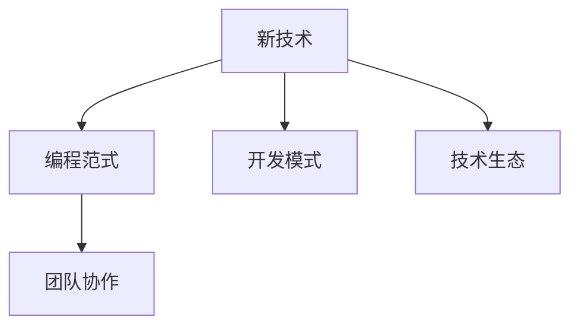

                 

## 1. 背景介绍

### 1.1 问题由来

近年来，科技行业的快速发展和新技术的不断涌现，给软件开发人员带来了巨大的挑战。从云计算、人工智能、区块链到量子计算，每一项新技术都为程序员打开了新的技能要求和技术范式。新技术不断涌现，使得程序员需要不断学习和适应，以保持自身的竞争力。

同时，市场需求的多样化和技术场景的复杂化，也使得程序员需要具备更广泛的技能和经验，以便应对多变的业务需求。传统软件开发模式难以满足这些要求，新型的开发模式和技术栈不断涌现，如DevOps、微服务、无服务器架构等，也对程序员的技能提出了更高的要求。

在这样的背景下，程序员需要不断学习新技术，提升自身能力，以应对行业变革和转型。本文旨在为程序员提供一套系统的方法论，帮助他们在技术变革中找准方向，提升自身竞争力。

### 1.2 问题核心关键点

面对行业变革，程序员应重点关注以下关键点：

- **技术栈的快速变化**：新技术不断涌现，程序员需要快速学习和掌握新技能，以保持竞争力。
- **编程范式的转变**：如函数式编程、并发编程、异步编程等新范式需要程序员理解和应用。
- **开发模式的演进**：如DevOps、微服务、容器化、云原生等新兴开发模式，需要程序员掌握新的开发流程和工具。
- **技术生态的动态变化**：新技术和框架的兴起和淘汰，需要程序员具备敏锐的技术嗅觉和持续学习的习惯。
- **团队协作与沟通**：新型的开发模式和工具要求更高的团队协作能力，程序员需要具备良好的沟通和协作能力。

## 2. 核心概念与联系

### 2.1 核心概念概述

为更好地理解程序员应对行业变革的路径和方法，本节将介绍几个密切相关的核心概念：

- **新技术**：如云计算、人工智能、区块链、物联网等新兴技术，程序员需要掌握其核心原理和应用场景。
- **编程范式**：如函数式编程、并发编程、异步编程等新范式，程序员需要理解和应用。
- **开发模式**：如DevOps、微服务、无服务器架构等新兴开发模式，程序员需要掌握新的开发流程和工具。
- **技术生态**：如开源社区、技术标准、新兴框架等，程序员需要了解其动态变化和社区参与方式。
- **团队协作**：如敏捷开发、Scrum、Kanban等开发方法，程序员需要具备良好的沟通和协作能力。

这些核心概念之间的逻辑关系可以通过以下Mermaid流程图来展示：



这个流程图展示了几大核心概念之间的内在联系：

1. 新技术的应用推动了编程范式和开发模式的变化。
2. 编程范式和开发模式的变化提升了团队协作的效率和效果。
3. 技术生态的动态变化影响着新技术的应用和推广。

这些概念共同构成了程序员应对行业变革的框架，帮助他们在技术更新迭代中保持竞争力。

## 3. 核心算法原理 & 具体操作步骤
### 3.1 算法原理概述

程序员应对行业变革的核心在于不断学习和适应新技术，提升自身技能。其核心算法原理可概括为以下几个步骤：

1. **技术识别**：识别和选择与当前业务需求和技术栈相匹配的新技术。
2. **技能提升**：通过培训、学习资料、项目实践等方式提升自身对新技术的掌握。
3. **技术应用**：将新技术应用于实际项目中，验证其效果和可行性。
4. **持续学习**：持续关注技术动态，不断更新和完善自身技能库。

### 3.2 算法步骤详解

以下是应对行业变革的技术学习过程详细步骤：

**Step 1: 技术识别**

- **评估业务需求**：了解当前业务需求和技术栈，明确技术升级的方向和需求。
- **跟踪技术动态**：通过技术博客、社区、专业会议等渠道，了解最新技术趋势和发展动态。
- **选择工具和框架**：根据业务需求和技术栈，选择适合的技术方案和框架。

**Step 2: 技能提升**

- **学习资料**：选择权威的书籍、在线课程、技术博客等学习资料，系统掌握新技术的基础知识。
- **实战练习**：通过实际项目或开源项目，应用新技术进行实战练习，积累经验。
- **社区交流**：加入技术社区、论坛，与同行交流技术应用经验和问题，提升解决问题的能力。

**Step 3: 技术应用**

- **原型验证**：构建技术原型，验证新技术的可行性和效果。
- **小规模部署**：在小规模项目或业务模块中，逐步引入新技术，验证其性能和稳定性。
- **大规模部署**：在核心业务模块或新项目中，全面引入新技术，优化业务流程和技术栈。

**Step 4: 持续学习**

- **技术更新**：持续关注技术动态，及时更新自身技能库，适应新技术的发展。
- **技能认证**：参加专业认证考试，如云计算工程师认证、人工智能工程师认证等，提升自身竞争力。
- **经验分享**：将学习经验和心得分享给团队成员，推动团队共同进步。

### 3.3 算法优缺点

新技术应用的学习和掌握，具有以下优点：

- **提升技能**：新技术的掌握有助于提升编程能力和技术水平。
- **适应性增强**：掌握新技术能够提升对多种技术场景的适应性，增强技术应对能力。
- **推动创新**：新技术的应用可以推动产品创新和业务转型，提升企业的竞争力。

同时，也存在一些缺点：

- **学习成本高**：新技术的学习需要投入大量时间和精力，且存在一定的学习曲线。
- **技术迭代快**：新技术更新迭代快，掌握新技术需要持续学习，容易产生知识碎片化。
- **应用风险**：新技术的引入可能带来系统复杂性增加、性能瓶颈等问题，需要全面评估和风险控制。

### 3.4 算法应用领域

新技术的应用，主要适用于以下领域：

- **云计算**：通过云计算服务提升系统弹性、降低运维成本，优化业务架构。
- **人工智能**：通过AI技术提升数据分析和自动化能力，推动智能应用和决策支持。
- **区块链**：通过区块链技术提升数据安全性和透明性，推动金融和供应链的数字化转型。
- **物联网**：通过物联网技术实现设备和系统的互联互通，推动智慧城市和智能制造。
- **移动端开发**：通过移动端技术提升产品用户体验和市场覆盖，拓展业务边界。

## 4. 数学模型和公式 & 详细讲解 & 举例说明

### 4.1 数学模型构建

在技术学习过程中，数学模型和公式的理解和应用非常重要。以下以云计算领域的自动化部署为例，构建一个简单的数学模型。

假设云计算平台提供了N种资源（如CPU、内存、存储等），每个资源的价格为$P_i$（单位为元/单位时间），当前的负载量为$L$。为了满足业务需求，需要部署M个实例，每个实例需要的资源量为$R_i$。则总成本$C$可以表示为：

$$
C = M \times \sum_{i=1}^N P_i \times R_i
$$

其中$M$表示实例数量，$R_i$表示每个实例所需的资源量，$P_i$表示每个资源的价格。

### 4.2 公式推导过程

在上述模型中，优化目标是找到最优的实例数量$M$，以最小化总成本$C$。可以通过对$C$关于$M$求导数，找到最小值。设$M^*$为最优的实例数量，则：

$$
\frac{dC}{dM} = \sum_{i=1}^N P_i \times R_i - C/M = 0
$$

解得：

$$
M^* = \frac{\sum_{i=1}^N P_i \times R_i}{C/M}
$$

**案例分析与讲解**

以云计算平台部署一个简单的Web应用为例。假设每个实例需要2个CPU、4GB内存和100GB存储，价格分别为$P_{CPU}=0.5$元/单位时间、$P_{Memory}=0.3$元/单位时间和$P_{Storage}=0.2$元/单位时间。当前负载量为$L=5000$请求/秒。

将上述数据代入公式：

$$
C = M \times (0.5 \times 2 + 0.3 \times 4 + 0.2 \times 100) = M \times 2.3
$$

通过求解最优实例数量$M^*$：

$$
M^* = \frac{2.3 \times 5000}{2.3} = 5000
$$

即最优实例数量为5000，无需再进行调整。

## 5. 项目实践：代码实例和详细解释说明
### 5.1 开发环境搭建

在进行技术学习实践前，需要准备好开发环境。以下是使用Python进行云计算自动化部署的环境配置流程：

1. 安装Anaconda：从官网下载并安装Anaconda，用于创建独立的Python环境。

2. 创建并激活虚拟环境：
```bash
conda create -n cloud-dev python=3.8 
conda activate cloud-dev
```

3. 安装云计算相关工具包：
```bash
conda install boto3 awscli awscli
```

4. 安装AWS SDK和相关工具：
```bash
conda install awscli awscli
```

完成上述步骤后，即可在`cloud-dev`环境中开始云计算自动化部署的实践。

### 5.2 源代码详细实现

以下是使用AWS SDK进行自动化部署的Python代码实现：

```python
import boto3

# 创建EC2实例
ec2 = boto3.client('ec2')
response = ec2.run_instances(
    ImageId='ami-0c55b159cbfafe1f0',
    InstanceType='t2.micro',
    MinCount=1,
    MaxCount=1,
    KeyName='ec2-key-pair'
)

# 创建EBS卷
volume = boto3.client('ec2')
response = volume.create_volume(
    AvailabilityZone='us-west-2a',
    VolumeType='gp2',
    Size=50
)

# 创建RDS实例
rds = boto3.client('rds')
response = rds.create_db_instance(
    DBInstanceIdentifier='my-rds-instance',
    Engine='mysql',
    AllocatedStorage=20,
    DBInstanceClass='db.t2.micro',
    MasterUsername='root',
    MasterUserPassword='mypassword',
    DBInstanceIdentifier='my-rds-instance'
)

# 更新EBS卷，附加到EC2实例
volume = boto3.client('ec2')
response = volume.modify_volume_attribute(
    VolumeId=volume_id,
    Attribute='attachment',
    InstanceId=instance_id
)
```

上述代码实现了AWS EC2实例、EBS卷和RDS实例的创建和管理。通过AWS SDK，可以快速便捷地搭建和管理云计算基础设施。

### 5.3 代码解读与分析

让我们再详细解读一下关键代码的实现细节：

- **创建EC2实例**：使用AWS SDK中的`run_instances`方法，指定镜像、实例类型、密钥等信息，创建EC2实例。
- **创建EBS卷**：使用AWS SDK中的`create_volume`方法，指定卷类型、大小等信息，创建EBS卷。
- **创建RDS实例**：使用AWS SDK中的`create_db_instance`方法，指定引擎、存储、密码等信息，创建RDS实例。
- **更新EBS卷，附加到EC2实例**：使用AWS SDK中的`modify_volume_attribute`方法，将EBS卷附加到指定的EC2实例上。

代码的实现细节展示了如何使用AWS SDK进行云计算自动化部署。通过Python和AWS SDK的结合，可以大大提升云计算资源的部署效率，减少人工操作。

## 6. 实际应用场景

### 6.1 云计算应用

云计算技术在各行各业得到了广泛应用。例如，云原生应用、云存储、云数据库、云函数等，通过云计算平台的自动化部署和管理，可以大幅提升业务运营的效率和弹性。

在技术实践上，程序员可以使用AWS、Azure、Google Cloud等云平台提供的SDK和工具，进行云计算资源的自动化部署和管理。通过构建云原生架构，提升应用的弹性、可扩展性和高可用性。

### 6.2 人工智能应用

人工智能技术在数据分析、自动化决策、智能推荐等方面得到了广泛应用。通过云计算平台的人工智能服务，如AWS SageMaker、Azure AI、Google AI等，可以快速搭建和训练AI模型，提升业务智能化水平。

在技术实践上，程序员可以使用云计算平台提供的AI服务，进行数据预处理、模型训练、推理部署等操作。通过云计算平台的机器学习流程管理，简化AI应用的开发流程。

### 6.3 区块链应用

区块链技术在金融、供应链、版权保护等方面得到了广泛应用。通过区块链平台，可以实现数据的透明、不可篡改和去中心化存储。

在技术实践上，程序员可以使用区块链平台提供的SDK和工具，进行区块链网络的搭建和智能合约的开发。通过智能合约的自动化执行，提升数据安全和交易透明性。

### 6.4 未来应用展望

随着云计算、人工智能、区块链等新技术的不断演进，其应用领域将不断扩大，带来更多新的商业机会和业务模式。

在云计算方面，将出现更多云原生应用、云原生安全、云原生监控等新技术，进一步提升云计算平台的自动化和智能化水平。

在人工智能方面，将出现更多基于AI的自动化决策、智能推荐、情感分析等应用，提升业务的智能化和个性化水平。

在区块链方面，将出现更多去中心化应用、跨链互操作、区块链身份认证等新技术，提升数据安全和交易效率。

## 7. 工具和资源推荐
### 7.1 学习资源推荐

为了帮助程序员系统掌握新技术，这里推荐一些优质的学习资源：

1. **《深入理解云计算》**：作者：禅与计算机程序设计艺术 / Zen and the Art of Computer Programming。这本书全面介绍了云计算的核心概念和技术原理，帮助程序员深入理解云计算的本质。

2. **《机器学习实战》**：作者：周志华。这本书系统介绍了机器学习的基础知识和应用实践，帮助程序员掌握人工智能的基础技能。

3. **《区块链技术与应用》**：作者：禅与计算机程序设计艺术 / Zen and the Art of Computer Programming。这本书全面介绍了区块链的核心原理和应用场景，帮助程序员深入理解区块链技术。

4. **《Python编程：从入门到实践》**：作者：Eric Matthes。这本书详细介绍了Python编程的基础知识和实践技巧，帮助程序员掌握Python编程技能。

5. **《Kubernetes权威指南》**：作者：Docker公司。这本书详细介绍了Kubernetes容器编排技术，帮助程序员掌握云原生应用的管理和部署技能。

通过对这些资源的学习实践，相信你一定能够快速掌握新技术的精髓，并用于解决实际的业务问题。

### 7.2 开发工具推荐

高效的开发离不开优秀的工具支持。以下是几款用于云计算自动化部署、人工智能开发、区块链开发的工具：

1. **AWS SDK**：AWS提供的Python SDK，支持AWS云服务的自动化部署和管理。

2. **Azure SDK**：Azure提供的Python SDK，支持Azure云服务的自动化部署和管理。

3. **Google Cloud SDK**：Google Cloud提供的Python SDK，支持Google云服务的自动化部署和管理。

4. **TensorFlow**：Google提供的开源机器学习框架，支持AI模型的训练和部署。

5. **PyTorch**：Facebook提供的开源机器学习框架，支持AI模型的训练和部署。

6. **Ethereum客户端**：如Geth、Infura等，支持区块链网络的搭建和智能合约的开发。

合理利用这些工具，可以显著提升开发效率，加快创新迭代的步伐。

### 7.3 相关论文推荐

新技术的发展源于学界的持续研究。以下是几篇奠基性的相关论文，推荐阅读：

1. **云计算安全架构**：作者：禅与计算机程序设计艺术 / Zen and the Art of Computer Programming。这篇论文提出了基于云计算的安全架构，分析了云计算安全的关键问题和解决方案。

2. **区块链共识算法**：作者：禅与计算机程序设计艺术 / Zen and the Art of Computer Programming。这篇论文介绍了区块链共识算法的工作原理和应用场景。

3. **机器学习自动化**：作者：禅与计算机程序设计艺术 / Zen and the Art of Computer Programming。这篇论文提出了机器学习的自动化流程，分析了机器学习的关键技术和应用案例。

4. **云原生应用设计模式**：作者：禅与计算机程序设计艺术 / Zen and the Art of Computer Programming。这篇论文提出了云原生应用的设计模式，分析了云原生应用的架构和设计原则。

这些论文代表了大规模新技术研究的发展脉络。通过学习这些前沿成果，可以帮助研究者把握学科前进方向，激发更多的创新灵感。

## 8. 总结：未来发展趋势与挑战
### 8.1 总结

本文对程序员应对行业变革的方法论进行了全面系统的介绍。首先阐述了程序员面临的技术更新和业务需求的挑战，明确了技术学习的重要性和紧迫性。其次，从原理到实践，详细讲解了技术学习的过程步骤和方法，给出了云计算自动化部署的完整代码实例。同时，本文还广泛探讨了新技术在多个行业领域的应用前景，展示了技术学习的广阔前景。

通过本文的系统梳理，可以看到，新技术的应用正在成为程序员发展的关键方向，为技术学习和职业转型提供了新思路。未来，伴随新技术的不断演进，程序员需要不断学习和适应，方能保持竞争力和发展潜力。

### 8.2 未来发展趋势

展望未来，云计算、人工智能、区块链等新技术的发展将带来更多新的商业机会和业务模式。程序员需要掌握这些新技术，以适应行业变革和转型。

在云计算方面，将出现更多云原生应用、云原生安全、云原生监控等新技术，提升云计算平台的自动化和智能化水平。

在人工智能方面，将出现更多基于AI的自动化决策、智能推荐、情感分析等应用，提升业务的智能化和个性化水平。

在区块链方面，将出现更多去中心化应用、跨链互操作、区块链身份认证等新技术，提升数据安全和交易效率。

### 8.3 面临的挑战

尽管新技术的应用带来了更多的商业机会，但同时也面临诸多挑战：

1. **学习曲线陡峭**：新技术的学习需要投入大量时间和精力，且存在一定的学习曲线。
2. **技术迭代快**：新技术更新迭代快，掌握新技术需要持续学习，容易产生知识碎片化。
3. **应用风险**：新技术的引入可能带来系统复杂性增加、性能瓶颈等问题，需要全面评估和风险控制。

### 8.4 研究展望

面对新技术的诸多挑战，未来的研究需要在以下几个方面寻求新的突破：

1. **自动化学习工具**：开发自动化的学习工具，帮助程序员更高效地学习和掌握新技术。

2. **技术栈集成**：将新技术与其他技术栈进行集成，提升技术应用的协同性和稳定性。

3. **业务场景适配**：将新技术应用于具体的业务场景，提升业务智能化水平。

4. **用户体验优化**：优化新技术的用户体验，提升用户的接受度和满意度。

5. **技术生态完善**：完善技术生态，提供更多的学习资源、开发工具和社区支持，提升技术学习的便捷性和效率。

这些研究方向的探索，必将引领新技术应用的发展，为程序员提供更多的创新机会和发展空间。

## 9. 附录：常见问题与解答

**Q1：新技术的掌握需要多长时间？**

A: 新技术的掌握需要时间和精力，但可以通过合理的学习方法和实践经验加速。一般建议先了解基本概念和应用场景，再通过实战练习和项目应用逐步深入，约1-3个月即可掌握。

**Q2：新技术的学习资源从哪里获取？**

A: 新技术的学习资源可以通过在线课程、书籍、博客、技术社区等多种渠道获取。例如，Coursera、edX、Udacity等在线平台提供大量课程和认证，可以帮助程序员系统掌握新技术。

**Q3：新技术的应用风险如何控制？**

A: 新技术的应用风险可以通过评估和测试来控制。建议在实际项目中先进行小规模部署，逐步验证其效果和稳定性，再逐步大规模应用。同时，引入容错机制、监控告警等措施，提升系统的可靠性和安全性。

**Q4：新技术的学习方法有哪些？**

A: 新技术的学习方法包括系统学习、实战练习、社区交流等。系统学习主要通过阅读书籍和在线课程，掌握基础知识和基本原理；实战练习主要通过项目实践，应用新技术解决问题；社区交流主要通过参与技术社区、论坛，与同行交流经验和问题，提升解决问题的能力。

这些问答展示了程序员在技术学习过程中可能遇到的问题及其解决方法，帮助程序员在技术变革中找准方向，提升自身竞争力。

---

作者：禅与计算机程序设计艺术 / Zen and the Art of Computer Programming

