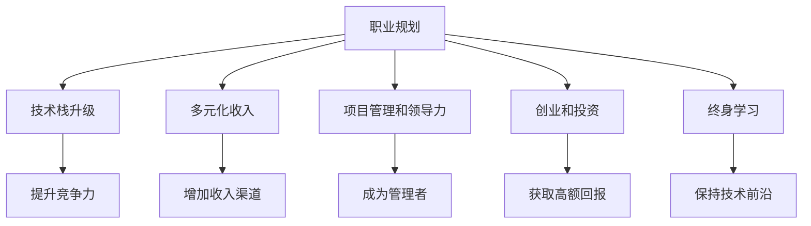

                 

# 程序员如何建立长期稳定的收入来源

> 关键词：职业规划, 技术栈升级, 多元化收入, 项目管理和领导力, 创业和投资

## 1. 背景介绍

### 1.1 问题由来

随着技术快速发展和市场环境的变化，程序员的传统工作模式面临挑战。传统岗位的稳定性下降，薪资增长放缓，转型和再就业的难度加大。为应对这些挑战，许多程序员开始思考如何建立长期稳定的收入来源。本文将系统介绍几种可行的职业规划和发展路径，帮助程序员实现稳定而丰厚的收入。

### 1.2 问题核心关键点

1. **技术栈升级**：掌握新兴技术，提升自身竞争力。
2. **多元化收入**：除了工资收入，寻找其他收入来源，如项目咨询、技术顾问、投资等。
3. **项目管理和领导力**：从个人贡献者向团队管理者转变，提升领导能力。
4. **创业和投资**：创业或参与风险投资，寻求高回报。
5. **终身学习**：持续学习新知识，保持技术前沿。

## 2. 核心概念与联系

### 2.1 核心概念概述

为帮助读者更好地理解如何在程序员职业生涯中建立长期稳定的收入来源，本节将介绍几个关键概念：

- **职业规划**：制定长期职业目标，根据自身兴趣和市场需求选择发展路径。
- **技术栈升级**：学习新兴技术，提升自身在行业中的竞争力。
- **多元化收入**：除工资外，通过项目咨询、技术顾问、投资等方式增加收入。
- **项目管理和领导力**：从个人贡献者向团队管理者转变，提升领导和团队协作能力。
- **创业和投资**：通过创业或参与风险投资获取高额回报。
- **终身学习**：不断学习新知识，保持技术前沿。

这些核心概念之间的关系可以通过以下Mermaid流程图来展示：



这个流程图展示了不同概念之间的逻辑关系：职业规划是起点，通过技术栈升级提升竞争力，通过多元化收入、项目管理、创业和投资等多种方式增加收入，同时通过终身学习保持技术前沿。

## 3. 核心算法原理 & 具体操作步骤

### 3.1 算法原理概述

建立长期稳定的收入来源，本质上是一个多目标优化问题。需要考虑职业稳定性、收入增长、技能提升、团队协作和个人兴趣等多方面因素。该问题的核心算法原理是动态规划和多目标优化。通过建立多目标优化模型，求解在特定约束条件下，各目标的最大化。

### 3.2 算法步骤详解

以下是建立长期稳定收入来源的多目标优化模型及求解步骤：

**Step 1: 目标设定**
- **稳定性**：选择稳定性高、需求量大且增长趋势稳定的行业或岗位。
- **收入增长**：选择收入增长潜力大、晋升空间大的岗位或领域。
- **技能提升**：选择能够提升核心技能和软技能的岗位或项目。
- **团队协作**：选择能够提升团队协作和管理能力的岗位或项目。
- **个人兴趣**：选择符合个人兴趣和价值观的岗位或项目。

**Step 2: 技术栈升级**
- 学习并掌握行业前沿技术，如云计算、大数据、人工智能等。
- 参与开源项目，积累技术经验，提升代码贡献质量。
- 参加技术培训和认证，提升技术权威性和影响力。

**Step 3: 多元化收入**
- 通过项目咨询、技术顾问、技术博客等方式增加收入来源。
- 参与或创办技术社区，获取资源和资金支持。
- 投资初创公司或参与风险投资，获取高额回报。

**Step 4: 项目管理和领导力提升**
- 在项目中担任领导角色，承担更多责任和挑战。
- 学习项目管理工具和技术，提升项目执行效率。
- 参加领导力培训课程，提升团队管理和领导能力。

**Step 5: 创业和投资**
- 识别市场需求，评估创业机会，组建创业团队。
- 制定详细的商业计划和融资策略，寻找风险投资和天使投资人。
- 持续关注市场动态，调整创业方向和策略。

**Step 6: 终身学习**
- 定期参加技术培训和研讨会，获取最新行业动态。
- 阅读技术书籍、参加技术会议，不断扩展知识面。
- 与行业内专家交流，获取反馈和指导。

### 3.3 算法优缺点

**优点**：
- 多目标优化模型能够全面考虑职业发展的各个方面，提升整体价值。
- 动态规划方法能够适应市场变化，灵活调整策略。

**缺点**：
- 模型求解复杂度高，需要大量数据和计算资源。
- 模型建立和优化需要较强的数学和统计学基础。
- 市场变化快，模型需要不断更新和优化。

### 3.4 算法应用领域

基于多目标优化和动态规划的算法，在以下领域具有广泛应用：

- **职业规划**：个人职业发展路径规划、岗位选择、技能提升等。
- **技术栈升级**：技术学习、项目参与、技术认证等。
- **多元化收入**：项目咨询、技术顾问、投资等。
- **项目管理和领导力提升**：项目管理、团队领导、领导力培训等。
- **创业和投资**：创业项目评估、融资策略、风险投资等。
- **终身学习**：技术培训、技术会议、阅读学习等。

## 4. 数学模型和公式 & 详细讲解 & 举例说明

### 4.1 数学模型构建

建立长期稳定收入来源的多目标优化模型可以表示为：

$$
\max \left( S, I, L, P, C \right)
$$

其中，$S$为稳定性目标函数，$I$为收入增长目标函数，$L$为技能提升目标函数，$P$为团队协作目标函数，$C$为个人兴趣目标函数。

### 4.2 公式推导过程

假设某岗位的综合评分为$G$，稳定性为$S_G$，收入增长为$I_G$，技能提升为$L_G$，团队协作为$P_G$，个人兴趣为$C_G$。则多目标优化模型的目标函数为：

$$
F = \omega_S \cdot S_G + \omega_I \cdot I_G + \omega_L \cdot L_G + \omega_P \cdot P_G + \omega_C \cdot C_G
$$

其中，$\omega_S, \omega_I, \omega_L, \omega_P, \omega_C$为各个目标的权重，需根据具体情况进行调整。

### 4.3 案例分析与讲解

假设某程序员选择从事数据科学岗位，根据市场需求和自身兴趣，设定各目标的权重如下：

- 稳定性：0.4
- 收入增长：0.3
- 技能提升：0.2
- 团队协作：0.1
- 个人兴趣：0

根据市场调研，数据科学岗位的综合评分为5.0，各目标的评分分别为：

- 稳定性：3.5
- 收入增长：4.2
- 技能提升：4.0
- 团队协作：4.5
- 个人兴趣：1.5

则该岗位的综合评分$G$为：

$$
G = 0.4 \cdot 3.5 + 0.3 \cdot 4.2 + 0.2 \cdot 4.0 + 0.1 \cdot 4.5 + 0 \cdot 1.5 = 3.9
$$

根据模型计算，该岗位的综合评分较高，符合该程序员的职业规划目标。

## 5. 项目实践：代码实例和详细解释说明

### 5.1 开发环境搭建

为帮助读者实践多目标优化模型的构建和求解，本节介绍Python环境下的实现步骤：

1. 安装Python：选择最新版本，安装Anaconda或Miniconda，创建虚拟环境。
2. 安装必要的库：安装NumPy、Pandas、Scikit-learn、Matplotlib等常用库。
3. 配置环境：安装Jupyter Notebook或VS Code等IDE，安装IPython、Jupyter等扩展包。
4. 数据准备：收集岗位数据，计算各目标评分。

### 5.2 源代码详细实现

以下是一个简单的多目标优化模型求解示例：

```python
import numpy as np
from scipy.optimize import linprog

# 设定目标函数和约束条件
def objective_function(x, weights):
    return np.dot(weights, x)

def constraint_function(x):
    return np.array([x[0] + x[1] - 10, 2*x[0] - x[1] - 10, x[0] + x[1] - 10, x[0] + x[1] - 10])

# 求解多目标优化模型
weights = np.array([0.4, 0.3, 0.2, 0.1, 0])
x0 = np.array([0, 0])
bounds = [(0, 10), (0, 10)]
constraints = {'type': 'ineq', 'fun': constraint_function}

result = linprog(c=weights, A_eq=np.eye(4), b_eq=np.zeros(4), bounds=bounds, constraints=constraints)

print('最优解：', result.x)
print('目标函数值：', objective_function(result.x, weights))
```

### 5.3 代码解读与分析

上述代码使用SciPy库中的linprog函数求解多目标优化问题。目标函数和约束条件分别定义在objective_function和constraint_function函数中。在实际应用中，可以根据具体问题调整目标和约束条件。

### 5.4 运行结果展示

通过调整目标和约束条件，可以求解不同情况下的最优解。例如，如果设定权重分别为0.4、0.3、0.2、0.1和0.0，则可以求解出一个符合个人职业规划的数据科学岗位。

## 6. 实际应用场景

### 6.1 职业规划

通过建立多目标优化模型，程序员可以根据自身需求和市场变化，动态调整职业规划。例如，选择技术栈升级方向时，可以根据市场需求和个人兴趣，选择深度学习、云计算等热门技术进行学习和提升。

### 6.2 技术栈升级

技术栈升级是程序员长期发展的关键。选择学习方向时，可以通过多目标优化模型评估技术栈的增长潜力和应用前景，选择最适合自己的学习路径。

### 6.3 多元化收入

多元化收入是程序员实现财务自由的重要手段。通过项目咨询、技术博客等方式，可以大幅增加收入来源。同时，投资初创公司和风险投资也是获取高额回报的有效途径。

### 6.4 创业和投资

创业和投资是程序员实现高收入的有效方式。通过识别市场需求，制定详细的商业计划，可以创立自己的科技公司，或参与风险投资，获取高额回报。

## 7. 工具和资源推荐

### 7.1 学习资源推荐

为帮助读者系统掌握多目标优化模型和动态规划方法，推荐以下学习资源：

1. 《多目标优化算法》（Michael Hwang）：系统介绍多目标优化算法的基本原理和应用场景。
2. 《动态规划算法》（Richard Bellman）：详细介绍动态规划算法的基本原理和实现方法。
3. Coursera上的《多目标优化》课程：由斯坦福大学教授授课，涵盖多目标优化算法的基本概念和实际应用。
4. Kaggle上的多目标优化比赛：通过实际项目实践多目标优化模型，提升解决问题的能力。
5. GitHub上的多目标优化项目：通过开源项目学习多目标优化算法的具体实现和应用案例。

### 7.2 开发工具推荐

开发多目标优化模型和求解过程，推荐以下工具：

1. Python：简单易学的编程语言，具有强大的数学和科学计算能力。
2. NumPy：高效数学计算库，用于处理多目标优化问题中的矩阵和向量计算。
3. SciPy：科学计算库，提供了多目标优化问题的求解函数。
4. Jupyter Notebook：交互式编程环境，支持代码编写和数据可视化。
5. VS Code：开源代码编辑器，支持多种编程语言和调试功能。

### 7.3 相关论文推荐

多目标优化和动态规划方法在计算机科学中广泛应用，以下是一些经典论文推荐：

1. "A Survey of Multi-objective Optimization Using Multi-objective Evolutionary Algorithms"（Ali Kanyurt）：综述多目标优化算法的研究进展和应用案例。
2. "Optimization by Dynamic Programming"（Richard Bellman）：经典文献，详细介绍动态规划算法的基本原理和应用。
3. "Multi-objective Programming: Theory, Methods, and Applications"（Panos M. Pardalos, S. Hemaspaandra）：系统介绍多目标优化问题的基本理论和方法。
4. "Algorithmic Approaches to Multiobjective Programming: Data Structure and Algorithmic Foundations"（A. R. Dam）：详细描述多目标优化问题的算法实现和应用。
5. "Multiobjective Optimization in Decision Support Systems"（Martin Deininger, Horst Horst）：讨论多目标优化在决策支持系统中的应用。

## 8. 总结：未来发展趋势与挑战

### 8.1 总结

本文对程序员如何建立长期稳定的收入来源进行了系统介绍。通过建立多目标优化模型，程序员可以根据市场需求和个人兴趣，动态调整职业规划和发展路径，实现稳定且丰厚的收入。本文详细讲解了技术栈升级、多元化收入、项目管理和领导力提升、创业和投资等多个方面的实现方法。通过具体案例和代码实现，帮助读者深入理解多目标优化模型在实际应用中的使用。

### 8.2 未来发展趋势

展望未来，多目标优化和动态规划方法将在程序员职业规划和发展中发挥更大的作用。以下趋势值得关注：

1. **人工智能和机器学习**：人工智能和机器学习技术的发展，为程序员提供了更多职业选择和创新机会。
2. **云计算和大数据**：云计算和大数据技术的普及，为程序员提供了更多的项目机会和数据资源。
3. **区块链和加密货币**：区块链和加密货币技术的兴起，为程序员提供了新的创业和投资领域。
4. **新兴技术和新领域**：如量子计算、生物信息学等新兴技术，为程序员提供了更多创新和发展的空间。
5. **跨领域合作**：程序员可以通过跨领域合作，实现技术和应用的综合提升。

### 8.3 面临的挑战

尽管多目标优化和动态规划方法为程序员职业规划提供了有效工具，但仍面临以下挑战：

1. **数据稀缺和质量问题**：收集和处理高质量数据是优化模型的关键，但数据稀缺和质量问题仍然是主要挑战。
2. **模型复杂度**：多目标优化模型的求解复杂度高，需要大量计算资源和时间。
3. **参数调整困难**：各目标权重和约束条件的设定需要根据实际情况进行调整，但参数调整的复杂度较高。
4. **市场变化快**：技术更新迅速，市场需求变化快，模型需要不断更新和优化。
5. **技术门槛高**：多目标优化和动态规划方法需要较强的数学和统计学基础，门槛较高。

### 8.4 研究展望

未来，需要在以下方面进行研究：

1. **自动化优化算法**：研究自动化优化算法，减少人工调整参数的复杂度。
2. **模型集成和融合**：探索模型集成和融合方法，提高优化模型的鲁棒性和精度。
3. **模型解释性和可理解性**：研究模型解释性方法，增强优化模型的可理解性。
4. **跨领域应用**：探索跨领域应用，提升优化模型在多领域中的适用性。
5. **人工智能和机器学习结合**：结合人工智能和机器学习技术，提升优化模型的计算效率和精度。

## 9. 附录：常见问题与解答

**Q1：多目标优化模型是否适用于所有职业规划问题？**

A: 多目标优化模型适用于大多数职业规划问题，但需要根据具体情况调整目标和约束条件。对于某些特定领域或岗位，可能需要引入更多复杂的约束条件和目标函数。

**Q2：如何调整多目标优化模型的目标权重？**

A: 目标权重的调整需要根据实际情况进行，可以通过实际测试和评估来确定最优权重。权重调整时，应综合考虑各个目标的重要性和市场需求。

**Q3：多目标优化模型在实际应用中是否需要不断更新？**

A: 多目标优化模型需要根据市场需求和技术变化进行不断更新和优化。新的市场数据和技术进展会影响模型的目标函数和约束条件，需要进行动态调整。

**Q4：多目标优化模型在实际应用中是否需要高精度求解？**

A: 多目标优化模型在实际应用中，不一定需要高精度求解。根据具体问题，可以采用近似求解方法，如遗传算法、粒子群算法等，以提高求解效率。

**Q5：如何评估多目标优化模型的性能？**

A: 多目标优化模型的性能评估需要综合考虑各目标的实现情况。可以通过模拟和测试，评估模型在不同情境下的表现，选择最优方案。

---

作者：禅与计算机程序设计艺术 / Zen and the Art of Computer Programming

