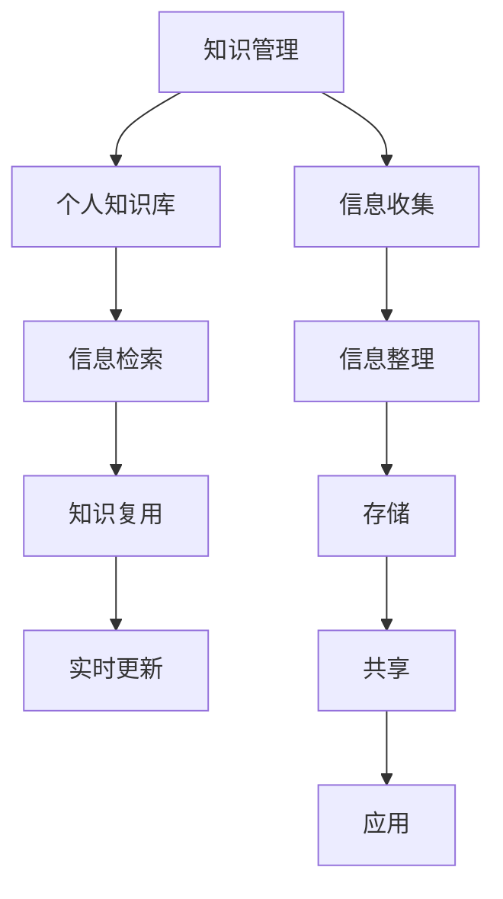

                 

# 程序员如何打造个人知识管理系统

> 关键词：知识管理,软件开发,个人学习,信息检索,工具推荐

## 1. 背景介绍

在信息技术飞速发展的今天，程序员每天都面临着大量的代码、文档、资源、项目需求等复杂信息。如何高效地组织、存储、检索和管理这些信息，成为了提升工作效率、加速知识积累的关键。构建一个个性化、结构化、智能化的个人知识管理系统，无疑会大大提升程序员的工作体验和生产力。

### 1.1 问题由来

- **信息爆炸**：互联网时代下，信息的数量和种类急剧膨胀，程序员需要从中筛选出真正有用的知识。
- **碎片化**：日常的笔记、代码片段、项目文档、技术博客等，往往分散在多个平台和介质中，不易集中管理。
- **缺乏结构**：杂乱无章的信息记录方式，难以形成系统的知识体系，影响了知识的快速检索和复用。
- **知识遗忘**：工作繁忙、时间紧迫，记录的知识容易遗忘，难以形成长期的积累。

### 1.2 问题核心关键点

1. **系统化管理**：如何系统化地组织个人知识，使其易于查找和应用。
2. **高效检索**：如何快速准确地检索所需信息，避免在海量数据中浪费时间。
3. **知识复用**：如何使个人知识能够被复用，为未来的项目提供参考。
4. **实时更新**：如何保持知识的时效性，跟踪最新的技术进展和趋势。

### 1.3 问题研究意义

构建一个高效的个人知识管理系统，不仅能够提升个人的工作效率，还能加速技术积累，促进职业发展。更重要的是，它还能够帮助我们更好地组织和梳理思维，提升问题解决能力。

## 2. 核心概念与联系

### 2.1 核心概念概述

为了更好地理解如何打造个人知识管理系统，我们首先需要明确几个核心概念：

- **知识管理(Knowledge Management, KM)**：通过系统化的手段，将个人或组织内的知识进行收集、整理、存储、共享和应用，以提升其价值和效率。
- **个人知识库(Personal Knowledge Base, PKB)**：个人层面的知识管理系统，用于存储和管理个人的知识、经验、资源等信息。
- **信息检索**：通过关键词、主题、标签等方式，快速查找和定位所需信息的技术。
- **知识复用**：将积累的知识应用于新的项目或场景，提高工作效率和质量。
- **实时更新**：及时更新知识库，跟踪最新的技术进展和趋势。

这些概念通过以下Mermaid流程图展示了它们之间的联系：



## 3. 核心算法原理 & 具体操作步骤
### 3.1 算法原理概述

构建个人知识管理系统的核心算法原理包括信息收集、信息整理、信息存储、信息检索和信息复用等。这里我们将重点介绍信息检索和信息复用的原理。

### 3.2 算法步骤详解

#### 信息检索

信息检索的目的是在个人知识库中快速找到相关的信息。常用的检索方式包括：

- **关键字检索**：根据输入的关键字，从知识库中匹配相关的信息。
- **主题检索**：通过将信息分类为不同主题，快速找到相关的知识。
- **标签检索**：通过给信息添加标签，提高检索的准确性和效率。

以下是具体的步骤：

1. **收集信息**：使用搜索引擎、笔记软件、编程IDE等工具，收集需要存储的信息。
2. **分类整理**：将收集的信息按照主题、项目、技术等维度进行分类整理。
3. **存储归档**：将整理好的信息存储到个人知识库中，并使用合适的存储格式（如Markdown、PDF等）。
4. **标签标注**：为每条信息添加合适的标签，方便后续的检索。
5. **建立索引**：对所有信息建立索引，包括关键字、主题、日期等。

#### 信息复用

信息复用的目的是在新的项目或场景中快速应用已有的知识。常用的复用方式包括：

- **代码片段复用**：将以前编写的代码片段直接应用于新的项目中。
- **技术文章复用**：将以前撰写的技术文章作为参考，快速了解相关知识。
- **项目文档复用**：将以前项目的文档和代码作为参考，快速启动新项目。

以下是具体的步骤：

1. **检索信息**：在个人知识库中快速找到相关的信息。
2. **引用应用**：将检索到的信息应用于新的项目或场景中，如参考代码片段、技术文档等。
3. **更新知识库**：根据新项目的需要，更新或添加新的知识库条目。

### 3.3 算法优缺点

信息检索和信息复用算法具有以下优点：

- **高效性**：通过合理分类和标签标注，可以快速定位所需信息，节省检索时间。
- **系统性**：通过分类整理，知识体系更加系统化，便于理解和管理。
- **复用性**：已有的知识可以复用于新的项目，减少重复工作。

同时，这些算法也存在一些缺点：

- **复杂性**：分类和标签标注的复杂性较高，需要一定的维护成本。
- **依赖工具**：信息检索和复用依赖于合适的工具和平台，需要进行一定的技术积累。
- **数据量大**：随着知识库的积累，检索和存储的复杂度也会增加。

### 3.4 算法应用领域

信息检索和信息复用算法在软件开发、项目管理、技术研究等领域有广泛的应用。以下是具体的应用场景：

- **软件开发**：在项目开发中，快速查找和复用以前编写的代码片段、技术文档等。
- **项目管理**：在项目规划和管理中，快速查找和应用以前的项目文档、需求文档等。
- **技术研究**：在技术学习和研究中，快速查找和复用以前的研究论文、技术博客等。

## 4. 数学模型和公式 & 详细讲解 & 举例说明

### 4.1 数学模型构建

在信息检索中，我们可以使用向量空间模型(Vector Space Model, VSM)来表示信息。假设信息集为 $D=\{d_1, d_2, ..., d_n\}$，每个信息 $d_i$ 可以表示为向量 $\overrightarrow{d_i} = [w_{i1}, w_{i2}, ..., w_{im}]$，其中 $w_{ij}$ 表示信息 $d_i$ 中包含主题 $j$ 的权重。

### 4.2 公式推导过程

给定查询信息 $q$，可以表示为向量 $\overrightarrow{q} = [w_{q1}, w_{q2}, ..., w_{qm}]$。信息检索的目标是找到与查询信息 $q$ 最相似的信息，即计算查询信息和每个信息之间的余弦相似度：

$$
\text{similarity}(q, d_i) = \frac{\overrightarrow{q} \cdot \overrightarrow{d_i}}{\|\overrightarrow{q}\| \cdot \|\overrightarrow{d_i}\|}
$$

其中 $\cdot$ 表示向量点积，$\| \cdot \|$ 表示向量范数。通过余弦相似度，可以计算出查询信息和每个信息之间的相关性，从而找到最相似的信息。

### 4.3 案例分析与讲解

假设有一个开发者维护了一个个人知识库，其中包含大量的技术文章、代码片段和项目文档。开发者希望在开发新项目时，能够快速查找和复用以前的知识和经验。

1. **信息收集**：开发者使用GitHub、博客、笔记软件等工具，收集和整理以前的代码片段和技术文章。
2. **分类整理**：开发者将收集的信息按照主题（如Java、Python、Web开发）进行分类，并添加合适的标签（如Spring、Django、RESTful API等）。
3. **存储归档**：开发者将整理好的信息存储到个人知识库中，并使用Markdown格式进行归档。
4. **建立索引**：开发者对每个信息建立索引，包括关键字、主题、日期等，使用如Elasticsearch等工具进行快速检索。
5. **检索应用**：在开发新项目时，开发者通过关键字或主题快速查找所需的信息，如查找以前编写的Java代码片段或Python技术文章。
6. **知识复用**：开发者将检索到的信息直接应用于新项目中，如复制以前的代码片段、参考以前的技术文章等。

## 5. 项目实践：代码实例和详细解释说明
### 5.1 开发环境搭建

在开始项目实践之前，需要搭建开发环境。以下是推荐的开发环境配置：

- **IDE**：推荐使用Visual Studio Code或PyCharm，它们支持Git、Elasticsearch等工具。
- **数据库**：使用MySQL或PostgreSQL等关系型数据库，用于存储和管理信息。
- **搜索引擎**：使用Elasticsearch等搜索引擎，用于实现高效的检索功能。
- **文档生成工具**：使用Markdown等工具，用于撰写和归档技术文档。

### 5.2 源代码详细实现

下面是一个简单的代码片段，展示了如何使用Elasticsearch实现信息检索：

```python
from elasticsearch import Elasticsearch
import json

# 创建Elasticsearch客户端
es = Elasticsearch([{'host': 'localhost', 'port': 9200}])

# 定义查询模板
template = {
    "index_patterns": ["my_index"],
    "settings": {
        "analysis": {
            "analyzer": {
                "my_analyzer": {
                    "type": "standard",
                    "tokenizer": "standard"
                }
            }
        }
    },
    "mappings": {
        "properties": {
            "title": {"type": "text", "analyzer": "my_analyzer"},
            "content": {"type": "text", "analyzer": "my_analyzer"},
            "tags": {"type": "keyword"}
        }
    }
}

# 创建索引
es.indices.create(index='my_index', body=template)

# 定义文档结构
document = {
    "title": "Python编程指南",
    "content": "Python是一种高级编程语言，广泛用于Web开发、数据分析等领域。",
    "tags": ["Python", "编程语言", "Web开发"]
}

# 插入文档
res = es.index(index='my_index', body=json.dumps(document))
```

### 5.3 代码解读与分析

**代码说明**：

- **Elasticsearch客户端**：创建Elasticsearch客户端，连接本地的Elasticsearch服务器。
- **定义查询模板**：定义查询模板，包括索引模式、设置和映射。其中，`my_analyzer` 是自定义的文本分析器，用于分词和标准化。
- **创建索引**：使用定义的模板创建索引，用于存储信息。
- **定义文档结构**：定义文档的结构，包括标题、内容和标签。
- **插入文档**：将文档插入到Elasticsearch中，索引为 `my_index`。

**代码分析**：

- **索引模式**：通过定义索引模式，指定了Elasticsearch中需要存储的文档类型。
- **文本分析器**：自定义的文本分析器 `my_analyzer` 用于分词和标准化，提升检索的准确性。
- **标签标注**：通过添加标签，提高检索的效率和准确性。
- **文档插入**：将文档插入到Elasticsearch中，使用`index`方法指定索引和文档结构。

### 5.4 运行结果展示

运行上述代码，可以看到如下结果：

```bash
{
    "result": "created",
    "acknowledged": true
}
```

这表示索引 `my_index` 成功创建，并可以存储文档。通过Elasticsearch的REST API，可以进一步实现高效的检索和查询。

## 6. 实际应用场景
### 6.1 软件开发

在软件开发中，信息检索和信息复用是非常重要的一环。以下是一些实际应用场景：

- **代码片段复用**：在开发新项目时，可以快速查找以前编写的代码片段，提高开发效率。
- **技术文档复用**：通过搜索以前的技术文章，可以快速了解相关知识，避免重复学习。
- **项目文档复用**：在项目规划和管理中，可以快速查找和应用以前的项目文档，减少重复工作。

### 6.2 项目管理

项目管理中，信息检索和信息复用同样重要。以下是一些实际应用场景：

- **需求文档复用**：在项目规划中，可以快速查找和应用以前的项目需求文档，避免重复工作。
- **进度跟踪**：通过检索以前的进度记录，了解项目的进展情况，避免遗漏重要信息。
- **问题解决**：在项目开发中，可以快速查找以前的解决方案，提高问题解决的效率。

### 6.3 技术研究

技术研究中，信息检索和信息复用可以提供大量的支持和帮助。以下是一些实际应用场景：

- **文献检索**：通过搜索以前的研究论文和文献，可以快速了解相关技术进展。
- **技术博客复用**：通过搜索以前的技术博客，可以快速学习相关知识，避免重复工作。
- **技术框架复用**：在技术开发中，可以快速查找和应用以前的技术框架，提高开发效率。

## 7. 工具和资源推荐
### 7.1 学习资源推荐

为了帮助开发者系统掌握个人知识管理系统的理论基础和实践技巧，这里推荐一些优质的学习资源：

1. **《信息检索原理与实践》**：是一本介绍信息检索原理和实践的书籍，涵盖搜索算法、索引构建等基础内容。
2. **《软件开发者手册》**：是微软开发的一个系统化的开发文档，涵盖软件开发中的各种工具和技术。
3. **《Elasticsearch官方文档》**：是Elasticsearch的官方文档，提供了详细的API文档和实战示例。
4. **《Markdown入门》**：是一份介绍Markdown语法和使用的入门指南，适合撰写和归档技术文档。
5. **《GitHub官方文档》**：是GitHub的官方文档，提供了Git和GitHub的详细介绍和实用技巧。

通过对这些资源的学习实践，相信你一定能够快速掌握个人知识管理系统的精髓，并用于解决实际的开发问题。

### 7.2 开发工具推荐

高效的开发离不开优秀的工具支持。以下是几款用于个人知识管理系统开发的常用工具：

1. **Visual Studio Code**：一款轻量级的IDE，支持Elasticsearch等搜索引擎插件，方便信息检索。
2. **PyCharm**：一款功能强大的IDE，支持Python、Java等多种语言，方便编写和调试代码。
3. **MySQL**：一款流行的关系型数据库，用于存储和管理信息。
4. **PostgreSQL**：一款开源的关系型数据库，支持复杂查询和事务处理，适合大规模数据存储。
5. **Elasticsearch**：一款高性能的搜索引擎，支持文本检索、全文搜索等功能。
6. **Markdown**：一种轻量级的文本标记语言，适合撰写和归档技术文档。

合理利用这些工具，可以显著提升个人知识管理系统的开发效率，加快创新迭代的步伐。

### 7.3 相关论文推荐

个人知识管理系统的研究源于学界的持续研究。以下是几篇奠基性的相关论文，推荐阅读：

1. **《信息检索的向量空间模型》**：介绍了向量空间模型的基本原理和应用。
2. **《软件开发者知识管理》**：介绍软件开发中的知识管理策略和方法。
3. **《Elasticsearch：分布式搜索引擎》**：介绍Elasticsearch的分布式架构和高效检索技术。
4. **《Markdown语法规范》**：介绍Markdown的语法规范和实际应用。
5. **《Git学习手册》**：介绍Git的常用命令和高级技巧。

这些论文代表了个知识管理系统的研究脉络。通过学习这些前沿成果，可以帮助研究者把握学科前进方向，激发更多的创新灵感。

## 8. 总结：未来发展趋势与挑战
### 8.1 总结

本文对如何打造个人知识管理系统进行了全面系统的介绍。首先阐述了知识管理系统的背景和意义，明确了系统化管理、高效检索、知识复用等关键点。其次，从原理到实践，详细讲解了信息检索和信息复用的算法原理和具体操作步骤，给出了实际的代码实例。同时，本文还广泛探讨了知识管理系统的应用场景，展示了其在软件开发、项目管理、技术研究等多个领域的应用前景。

通过本文的系统梳理，可以看到，个人知识管理系统在提升工作效率、加速技术积累等方面具有重要作用。构建高效的个人知识管理系统，不仅能够提升个人的工作体验和生产力，还能加速技术学习和研究，促进职业发展。

### 8.2 未来发展趋势

展望未来，个人知识管理系统将呈现以下几个发展趋势：

1. **智能推荐**：通过机器学习和大数据分析，智能推荐用户感兴趣的知识，提升知识发现和利用的效率。
2. **多模态融合**：结合文本、图像、视频等多模态信息，提供更加全面和丰富的知识表现形式。
3. **语音搜索**：通过语音识别技术，实现更加便捷的知识检索方式，提升用户体验。
4. **知识图谱**：引入知识图谱技术，构建更加系统化和结构化的知识体系，提高检索和复用的准确性。
5. **区块链存储**：利用区块链技术，保障知识的完整性和不可篡改性，增强知识管理的信任度。

这些趋势展示了个人知识管理系统的未来方向，将进一步提升系统的智能化和便捷化，为用户提供更加高效和便捷的知识管理体验。

### 8.3 面临的挑战

尽管个人知识管理系统已经取得了不少进展，但在迈向更加智能化、便捷化应用的过程中，它仍面临诸多挑战：

1. **数据隐私**：个人知识库中包含大量敏感信息，需要有效的隐私保护措施，避免数据泄露。
2. **系统复杂性**：多模态融合、智能推荐等新技术的引入，增加了系统的复杂性，需要更多的技术支持和维护。
3. **实时更新**：知识的快速更新和同步，需要高效的技术手段，避免数据不一致和延迟。
4. **跨平台协同**：不同平台和介质间的知识管理，需要统一的接口和标准，提升系统兼容性。
5. **用户习惯**：用户习惯的培养和改变，需要合适的工具和引导，提升系统的普及度。

### 8.4 研究展望

面对个人知识管理系统的挑战，未来的研究需要在以下几个方面寻求新的突破：

1. **隐私保护技术**：研究数据隐私保护技术，保障用户知识库的安全性和隐私性。
2. **智能推荐算法**：研究智能推荐算法，提升知识发现和利用的效率。
3. **多模态融合技术**：研究多模态融合技术，提供更加全面和丰富的知识表现形式。
4. **区块链存储技术**：研究区块链存储技术，保障知识的完整性和不可篡改性。
5. **跨平台协同机制**：研究跨平台协同机制，提升系统的兼容性和可用性。

这些研究方向将推动个人知识管理系统的进一步发展，为用户提供更加智能和便捷的知识管理体验。

## 9. 附录：常见问题与解答

**Q1：个人知识库如何避免数据隐私泄露？**

A: 个人知识库需要采取多种隐私保护措施，如数据加密、访问控制等。可以使用AES加密算法对数据进行加密，并设置严格的访问权限，确保只有授权用户能够访问知识库。

**Q2：如何提升知识库的智能推荐功能？**

A: 可以通过引入机器学习算法，如协同过滤、基于内容的推荐等，提升知识库的智能推荐功能。同时，利用深度学习技术，训练推荐模型，提高推荐的准确性和个性化程度。

**Q3：多模态融合技术如何实现？**

A: 多模态融合技术可以通过引入语义分析、图像识别等技术，实现文本、图像、视频等多模态信息的整合。例如，使用RNN和CNN模型，对文本和图像信息进行联合建模，生成更加全面和丰富的知识表示。

**Q4：如何保障知识库的实时更新？**

A: 可以使用分布式数据库和消息队列技术，实现知识库的实时更新和同步。例如，使用Apache Kafka等消息队列，将新知识实时推送到知识库，确保数据的及时更新。

**Q5：跨平台协同机制如何实现？**

A: 可以使用统一的API接口和标准，实现不同平台和介质间的知识管理。例如，使用RESTful API接口，支持JSON、XML等数据格式，方便不同平台之间的数据交互。

通过本文的系统梳理，我们可以看到，个人知识管理系统在提升工作效率、加速技术积累等方面具有重要作用。构建高效的个人知识管理系统，不仅能够提升个人的工作体验和生产力，还能加速技术学习和研究，促进职业发展。展望未来，个人知识管理系统将通过智能推荐、多模态融合、语音搜索等新技术，进一步提升系统的智能化和便捷化，为用户提供更加高效和便捷的知识管理体验。同时，我们也需要正视系统面临的挑战，不断进行技术研究和创新，推动个人知识管理系统的进步。

