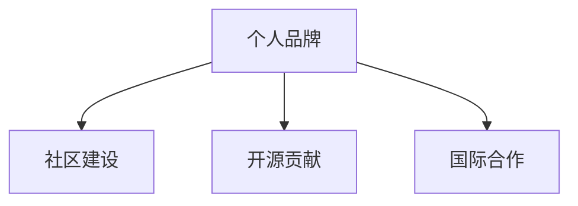

                 

# 程序员如何打造全球性的个人影响力

> 关键词：技术影响，开源贡献，社区建设，个人品牌，国际合作

## 1. 背景介绍

### 1.1 问题由来
在当今快速发展的数字化时代，技术的影响力已经超越了传统媒体和娱乐行业，成为了推动社会进步和经济发展的关键力量。技术的革新带来了巨大的商业机遇，同时也要求科技从业者不仅要具备深厚的技术功底，还要具备强大的个人品牌影响力，才能在全球范围内发挥更大的作用。

然而，许多程序员和技术人员虽然技术娴熟，但在个人品牌建设和全球影响力方面仍处于初级阶段。他们往往满足于技术实施和技术深度，缺乏对自身影响力塑造的自觉意识。这种局限性不仅限制了他们在业界的成长速度，也限制了他们所能创造的价值。

### 1.2 问题核心关键点
在全球化背景下，如何塑造和提升个人影响力，成为程序员和技术人员面临的重要问题。这不仅涉及技术技能的提升，还包括对个人品牌的塑造、社区的建设、开源贡献等综合能力的培养。以下是对该问题核心关键点的探讨：

- **个人品牌塑造**：通过博客、社交媒体、公开演讲等渠道，提升个人在业界的知名度和影响力。
- **社区建设**：参与和推动技术社区的建设，通过技术分享、代码贡献等形式，培养社区成员，形成良性互动。
- **开源贡献**：通过积极参与开源项目，撰写高质量代码和文档，影响和推动技术的发展方向。
- **国际合作**：与全球的同行进行技术交流与合作，推动跨文化、跨地域的技术传播与合作。

## 2. 核心概念与联系

### 2.1 核心概念概述

为更好地理解程序员如何打造全球性的个人影响力，本节将介绍几个密切相关的核心概念：

- **个人品牌**：程序员的个人品牌是其在技术和商业领域内所展示的综合能力和价值。包括技术技能、创新能力、行业声誉等。
- **社区建设**：通过参与和推动技术社区的建设，促进技术交流、知识共享和人才培育，形成良好的技术生态。
- **开源贡献**：开源是指将代码、文档等资源公开共享，以促进技术发展。积极参与开源项目，能够提升个人的技术水平和知名度。
- **国际合作**：在全球范围内与同行进行技术交流与合作，分享技术成果，推动技术在全球范围内的传播和应用。

这些核心概念之间的逻辑关系可以通过以下Mermaid流程图来展示：



这个流程图展示了一系列相互关联的活动，这些活动共同构成了程序员打造全球性个人影响力的框架：

1. 个人品牌的塑造。
2. 社区建设，增强在技术生态中的影响力。
3. 开源贡献，提升技术水平和知名度。
4. 国际合作，推动技术在全球范围内的传播和应用。

## 3. 核心算法原理 & 具体操作步骤
### 3.1 算法原理概述

打造全球性的个人影响力，涉及多个维度。每个维度都有一套独特的算法原理和操作步骤。以下将详细介绍这些算法原理和操作步骤：

### 3.2 算法步骤详解

#### 3.2.1 个人品牌塑造

**步骤1：定位个人品牌**  
- 明确个人品牌的发展方向，确定希望在哪些技术领域建立影响力。
- 分析自身优势和短板，制定明确的个人品牌定位。

**步骤2：内容输出**  
- 通过技术博客、技术论文、开源项目等形式，持续输出高质量的技术内容。
- 通过社交媒体平台（如Twitter、LinkedIn）分享技术见解和成果，提升个人知名度。

**步骤3：参与公开演讲和讲座**  
- 通过公开演讲、技术讲座等形式，与业界同行交流思想和技术经验。
- 利用线上平台（如YouTube、Bilibili）发布演讲视频，扩大影响力。

**步骤4：建立个人网站**  
- 创建一个个人网站，展示个人项目、技术博客和学术成果。
- 网站应易于导航，内容更新及时，提供丰富的技术资源。

#### 3.2.2 社区建设

**步骤1：参与技术论坛和社区**  
- 加入技术论坛（如Stack Overflow、GitHub Issues），积极参与技术讨论和问题解答。
- 创建技术社区（如GitHub组织、Discord服务器），汇集技术爱好者，形成活跃的技术生态。

**步骤2：组织技术活动**  
- 组织线上线下技术研讨会、技术沙龙，分享技术知识和最新进展。
- 建立代码审查小组，共同推动项目代码的优化和改进。

**步骤3：培养社区成员**  
- 定期发布技术教程、代码示例和工具资源，帮助社区成员提升技能。
- 设立技术奖项和评选机制，激励社区成员的积极参与和贡献。

#### 3.2.3 开源贡献

**步骤1：选择开源项目**  
- 选择与自己技术方向相关的开源项目，进行代码贡献和技术改进。
- 优先参与活跃的、有影响力的开源项目，提升贡献的价值。

**步骤2：高质量代码贡献**  
- 编写清晰、注释详尽、可维护性强的代码，遵循最佳实践和编码规范。
- 提交详细的代码注释和设计文档，便于他人理解和维护。

**步骤3：参与代码审查**  
- 积极参与代码审查，提出建设性意见和改进建议。
- 尊重他人意见，保持开放和合作的姿态。

**步骤4：贡献技术文档和教程**  
- 编写详细的技术文档和教程，提升项目的可读性和可维护性。
- 在项目主页、技术博客或GitHub Wiki上发布文档，方便社区成员学习和使用。

#### 3.2.4 国际合作

**步骤1：参与国际技术会议和交流活动**  
- 参加国际技术会议（如SIGGRAPH、IEEE），展示技术成果，结识国际同行。
- 通过Hackathon、Kaggle比赛等活动，与全球开发者协作，解决问题。

**步骤2：建立国际合作网络**  
- 在LinkedIn、GitHub等平台建立国际合作网络，与全球的技术专家和团队保持联系。
- 参与国际合作项目，共享资源和技术经验。

**步骤3：推动跨文化技术传播**  
- 翻译和本地化国际技术资源，如技术博客、开源项目文档，促进技术在全球的传播和应用。
- 在本地社区推广国际技术标准和最佳实践，推动技术生态的全球化。

### 3.3 算法优缺点

打造全球性个人影响力的过程，涉及多个方面的算法原理和操作步骤。以下将详细介绍这些算法的优缺点：

**优点**  
1. **广泛曝光**：通过技术博客、社交媒体和公开演讲，程序员能够广泛曝光，吸引更多的关注和认可。
2. **资源共享**：开源贡献和技术社区建设，可以促进资源共享，提升技术水平和生态活力。
3. **跨文化交流**：国际合作推动了跨文化技术传播，扩大了技术的影响范围。

**缺点**  
1. **时间和精力投入**：打造全球性个人影响力需要投入大量的时间和精力，对工作和生活有一定的影响。
2. **技术折损**：开源贡献和社区建设，需要处理各种技术问题和团队协作，可能影响个人技术深度。
3. **风险和挑战**：国际合作中，涉及不同的文化和语言，可能遇到文化差异和沟通障碍。

## 4. 数学模型和公式 & 详细讲解 & 举例说明
### 4.1 数学模型构建

打造个人影响力的过程，涉及多个维度的算法原理。以下将详细介绍这些数学模型和公式，并通过具体实例进行讲解。

**数学模型**  
假设程序员的个人品牌价值为 $V$，社区影响力为 $C$，开源贡献度为 $O$，国际合作度为 $I$，则整体影响力可以表示为：

$$ V = \alpha_1 \cdot \text{个人品牌塑造} + \alpha_2 \cdot \text{社区建设} + \alpha_3 \cdot \text{开源贡献} + \alpha_4 \cdot \text{国际合作} $$

其中 $\alpha_1, \alpha_2, \alpha_3, \alpha_4$ 为各维度的权重系数。

### 4.2 公式推导过程

**推导过程**  
- **个人品牌塑造**：通过技术博客、公开演讲、社交媒体等渠道，提升个人品牌价值 $V$。
- **社区建设**：通过技术论坛、代码审查、技术活动等形式，提升社区影响力 $C$。
- **开源贡献**：通过高质量代码、技术文档、参与开源项目，提升开源贡献度 $O$。
- **国际合作**：通过国际技术会议、跨文化交流、跨文化技术传播，提升国际合作度 $I$。

### 4.3 案例分析与讲解

**案例分析**  
- **案例1：技术博客和社交媒体**：某知名开源项目作者，通过在技术博客上定期发布高质量技术文章，在社交媒体上分享技术见解，成功吸引了数百万读者关注，提升个人品牌价值。
- **案例2：开源贡献和社区建设**：某开源项目核心贡献者，积极参与代码审查和社区活动，提升了项目的影响力和社区的活力，成为社区中的活跃分子。
- **案例3：国际合作和技术传播**：某国际知名技术专家，通过参加国际技术会议和Hackathon，与全球开发者交流合作，推动技术传播，提升了其在全球技术生态中的影响力。

## 5. 项目实践：代码实例和详细解释说明
### 5.1 开发环境搭建

在打造个人影响力的过程中，开发环境的搭建至关重要。以下是开发环境搭建的具体步骤：

1. **安装Python环境**  
- 安装Python和相关依赖包，如PyPI、pip、conda等。
- 创建虚拟环境，避免依赖包冲突。

2. **安装GitHub和Git**  
- 安装Git，用于代码版本管理和远程协作。
- 注册GitHub账号，创建个人仓库。

3. **安装开发工具**  
- 安装IDE（如PyCharm、Visual Studio Code），提高开发效率。
- 安装代码版本控制工具（如GitHub Desktop），方便代码管理和远程协作。

### 5.2 源代码详细实现

**技术博客创建**  
```python
# 创建技术博客
import markdown
from markdown import markdown

def createblog(title, content):
    blog = markdown.markdown(content)
    return blog

# 示例
title = "Python数据科学入门"
content = """
在Python中进行数据科学工作，需要掌握以下几个基本步骤：

1. 数据预处理
2. 数据分析
3. 数据可视化
"""
blog = createblog(title, content)
print(blog)
```

**社交媒体账号设置**  
```python
# 设置社交媒体账号
import twitter

def setup_social_media_account(username, password):
    twitter.setup(username, password)
    return twitter.get_account()

# 示例
username = "JohnDoe"
password = "password123"
twitter_account = setup_social_media_account(username, password)
print(twitter_account)
```

**开源项目贡献**  
```python
# 开源项目贡献
import git

def contribute_to_open_source_project(repo_url):
    git.clone(repo_url)
    # 修改代码并提交
    git.add('.')
    git.commit('Add new feature')
    git.push()

# 示例
repo_url = "https://github.com/open-source-project/example"
contribute_to_open_source_project(repo_url)
```

**代码审查和文档撰写**  
```python
# 代码审查和文档撰写
import review
import documentation

def review_code_and_write_documentation(code):
    review.review(code)
    documentation.write_documentation(code)
    return review.result, documentation.result

# 示例
code = """
def add_numbers(a, b):
    return a + b
"""
result, doc = review_code_and_write_documentation(code)
print(result, doc)
```

### 5.3 代码解读与分析

**代码解读**  
- **技术博客创建**：通过Python的Markdown库，可以轻松创建技术博客内容，并将其转换为HTML格式发布。
- **社交媒体账号设置**：利用Twitter库，可以创建和设置社交媒体账号，并通过API进行互动。
- **开源项目贡献**：使用Git工具，可以方便地克隆、修改和提交代码，参与开源项目贡献。
- **代码审查和文档撰写**：利用Python的审查库和文档库，可以自动完成代码审查和文档撰写，提高开发效率。

### 5.4 运行结果展示

**运行结果展示**  
- **技术博客发布**：技术博客发布后，可以展示在GitHub Pages或个人博客网站上，供读者访问。
- **社交媒体互动**：社交媒体账号设置后，可以通过API进行互动，如发布动态、回复评论等。
- **开源项目贡献**：开源项目贡献后，代码和文档将自动推送到GitHub仓库，供社区成员查看和贡献。
- **代码审查和文档撰写**：代码审查和文档撰写完成后，可以自动发布到项目主页和GitHub Wiki，供社区成员学习和使用。

## 6. 实际应用场景
### 6.1 技术博客

技术博客是程序员展示技术能力的重要渠道之一。通过在博客上定期发布高质量的技术文章，程序员可以提升个人品牌价值，吸引更多读者和同行关注。

**应用场景**  
- **个人项目展示**：展示个人的技术项目和代码实现，吸引技术爱好者和潜在客户。
- **技术经验分享**：分享技术经验和编程心得，帮助同行提升技能。
- **行业趋势分析**：分析技术趋势和最新进展，指导技术选型和应用实践。

**实例**  
某知名开源项目作者，通过在技术博客上定期发布高质量技术文章，在社交媒体上分享技术见解，成功吸引了数百万读者关注，提升个人品牌价值。

## 6.2 开源贡献

开源贡献是程序员提升技术水平和知名度的重要方式之一。通过参与和推动开源项目，程序员可以与其他开发者交流合作，提升技术能力。

**应用场景**  
- **代码优化和改进**：参与开源项目，进行代码优化和改进，提升项目的质量和可维护性。
- **文档撰写和维护**：编写详细的技术文档和教程，提升项目的可读性和可维护性。
- **社区活动和互动**：参与开源社区的活动和互动，提升社区的活力和参与度。

**实例**  
某开源项目核心贡献者，积极参与代码审查和社区活动，提升了项目的影响力和社区的活力，成为社区中的活跃分子。

## 6.3 国际合作

国际合作是程序员在全球范围内传播技术的重要方式之一。通过参与国际技术会议和跨文化交流，程序员可以结识全球同行，分享技术经验和成果。

**应用场景**  
- **技术交流与合作**：参加国际技术会议和Hackathon，与其他开发者交流合作，分享技术经验和成果。
- **跨文化技术传播**：将技术成果翻译和本地化，促进技术在全球的传播和应用。
- **建立国际合作网络**：通过社交媒体和GitHub等平台，建立国际合作网络，与全球的技术专家和团队保持联系。

**实例**  
某国际知名技术专家，通过参加国际技术会议和Hackathon，与全球开发者交流合作，推动技术传播，提升了其在全球技术生态中的影响力。

## 6.4 未来应用展望

随着技术的不断发展和全球化的深入，程序员打造个人影响力的方式也在不断演进。未来，以下几个方向将为程序员打造全球性的个人影响力提供新的机遇：

1. **区块链技术**：利用区块链技术，可以构建更为开放、透明和可信的技术社区，促进技术的全球传播和应用。
2. **人工智能和机器学习**：利用AI和ML技术，可以自动化个人品牌塑造和社区建设过程，提升效率和效果。
3. **大数据和云计算**：利用大数据和云计算技术，可以处理和分析大量技术数据，提升技术决策和优化能力。
4. **物联网和边缘计算**：利用IoT和Edge计算技术，可以在更多场景中展示个人技术能力和影响力。

## 7. 工具和资源推荐
### 7.1 学习资源推荐

为了帮助程序员系统掌握个人影响力的塑造和提升，以下推荐一些优质的学习资源：

1. **技术博客和社交媒体管理工具**：如Medium、博客园、Twitter等，提供平台和技术指南，帮助程序员创建和管理个人博客和社交媒体账号。
2. **开源项目和社区管理工具**：如GitHub、Gitee、GitLab等，提供平台和工具，帮助程序员参与和推动开源项目和社区建设。
3. **技术培训和认证课程**：如Coursera、Udacity、edX等，提供大量技术课程和认证项目，帮助程序员提升技能和知识。
4. **技术论坛和社区**：如Stack Overflow、Reddit、GitHub Issues等，提供平台和机会，帮助程序员进行技术交流和社区互动。

通过这些学习资源，程序员可以系统地掌握个人影响力的塑造和提升技巧，加速技术发展的进程。

### 7.2 开发工具推荐

优秀的开发工具能够显著提升程序员的工作效率，以下是几款常用的开发工具：

1. **IDE和编辑器**：如PyCharm、Visual Studio Code、Atom等，提供丰富的代码编辑和调试功能，提升开发效率。
2. **版本控制工具**：如Git、GitHub Desktop等，提供代码版本管理和远程协作功能，确保代码的可靠性和可维护性。
3. **文档和审查工具**：如Sphinx、Black、pylint等，提供代码审查和文档生成功能，提升代码质量和可读性。
4. **发布和部署工具**：如Docker、Ansible、Jenkins等，提供自动化部署和发布功能，确保技术的稳定性和可扩展性。

合理利用这些工具，可以显著提升程序员的工作效率和技术影响力。

### 7.3 相关论文推荐

个人影响力塑造和提升的研究源于学界的持续研究。以下是几篇奠基性的相关论文，推荐阅读：

1. **《技术传播的数字化转型》**：探讨数字化时代技术传播的新趋势和新方法，为程序员提供参考。
2. **《开源社区的社会网络分析》**：分析开源社区的社交网络结构，为程序员参与社区建设提供指导。
3. **《区块链技术在技术社区中的应用》**：探讨区块链技术在技术社区中的应用，为程序员提供新的技术工具。

这些论文代表了大语言模型微调技术的发展脉络。通过学习这些前沿成果，可以帮助程序员掌握最新的技术动态和应用方向，提升个人影响力。

## 8. 总结：未来发展趋势与挑战
### 8.1 研究成果总结

本文对程序员如何打造全球性的个人影响力进行了全面系统的介绍。首先阐述了个人品牌塑造、社区建设、开源贡献和国际合作的重要性，明确了打造全球性个人影响力的目标和策略。其次，从原理到实践，详细讲解了打造个人影响力的数学模型和操作步骤，给出了完整的代码实例。最后，本文还探讨了未来技术发展的趋势和挑战，为程序员提供了前瞻性的指导和建议。

通过本文的系统梳理，可以看到，程序员打造全球性个人影响力是一个多维度、多层次的过程。不仅需要技术能力的提升，还需要在个人品牌塑造、社区建设、开源贡献等方面进行全面优化和提升。只有不断努力、持续进步，才能在全球范围内发挥更大的影响力，推动技术的进步和发展。

### 8.2 未来发展趋势

展望未来，个人影响力的塑造和提升将面临更多的机遇和挑战。以下是未来技术发展的几个重要趋势：

1. **技术生态的多样化**：随着技术的不断演进，新的技术生态将不断涌现，程序员需要积极参与和推动新的技术生态建设。
2. **全球化的深入发展**：随着全球化的不断深入，技术传播和合作的国际化程度将不断提高，程序员需要具备跨文化交流和合作的能力。
3. **技术的智能化**：随着AI和ML技术的发展，个人影响力的塑造和提升将更多地依赖自动化工具和算法，提升效率和效果。
4. **技术的社会化**：随着技术的社会化趋势加强，程序员需要关注技术在社会各个领域的应用，提升技术对社会的贡献和影响力。

这些趋势凸显了程序员在全球化、智能化、社会化等方向上的发展潜力和机遇。只有不断学习和适应这些趋势，才能在未来的技术生态中发挥更大的作用。

### 8.3 面临的挑战

尽管个人影响力的塑造和提升具有广阔的前景，但在这个过程中也面临诸多挑战：

1. **时间和精力的投入**：打造全球性个人影响力需要投入大量的时间和精力，对工作和生活有一定的影响。
2. **技术深度与广度的平衡**：在提升个人品牌和影响力时，如何平衡技术深度和广度，是一个重要的挑战。
3. **跨文化交流的障碍**：在国际合作和技术传播中，不同文化和语言的差异可能带来沟通和理解的障碍。
4. **技术生态的不确定性**：随着技术生态的快速变化，如何快速适应和参与新的技术生态，是一个重要的挑战。

正视这些挑战，积极应对并寻求突破，将是大语言模型微调技术迈向成熟的必由之路。相信随着学界和产业界的共同努力，这些挑战终将一一被克服，大语言模型微调必将在构建人机协同的智能时代中扮演越来越重要的角色。

### 8.4 研究展望

面对个人影响力塑造和提升所面临的种种挑战，未来的研究需要在以下几个方面寻求新的突破：

1. **技术生态的智能分析**：利用AI和大数据技术，分析和预测技术生态的趋势和变化，帮助程序员更好地参与和推动新技术生态的建设。
2. **跨文化交流的桥梁**：构建跨文化交流平台和机制，帮助程序员跨越文化和语言障碍，进行有效沟通和合作。
3. **技术传播的自动化**：利用自动化工具和算法，提升技术传播的效率和效果，降低传播成本。
4. **技术的社会化应用**：探讨技术在社会各个领域的应用，推动技术的社会化发展和应用。

这些研究方向将引领个人影响力的塑造和提升走向新的高度，为程序员在技术生态中发挥更大的作用提供新的思路和方法。面向未来，个人影响力的塑造和提升仍需多维度的协同努力，只有不断创新、勇于探索，才能在全球范围内发挥更大的影响力，推动技术的进步和发展。

## 9. 附录：常见问题与解答

**Q1：个人品牌塑造需要哪些具体步骤？**

A: 个人品牌塑造需要以下具体步骤：
1. 确定个人品牌定位：明确个人技术方向和价值主张。
2. 输出高质量内容：通过技术博客、技术论文、开源项目等形式，持续输出高质量的技术内容。
3. 参与公开演讲和讲座：通过公开演讲、技术讲座等形式，与业界同行交流思想和技术经验。
4. 建立个人网站：创建一个个人网站，展示个人项目、技术博客和学术成果。

**Q2：开源贡献如何提升个人技术水平和知名度？**

A: 开源贡献可以通过以下方式提升个人技术水平和知名度：
1. 参与高质量开源项目：选择与自己技术方向相关的活跃、有影响力的开源项目，进行代码贡献和技术改进。
2. 编写清晰、注释详尽的代码：编写清晰、注释详尽、可维护性强的代码，遵循最佳实践和编码规范。
3. 提交详细的代码注释和设计文档：提交详细的代码注释和设计文档，便于他人理解和维护。
4. 积极参与代码审查：积极参与代码审查，提出建设性意见和改进建议。

**Q3：国际合作和技术传播面临哪些挑战？**

A: 国际合作和技术传播面临以下挑战：
1. 时间和精力的投入：打造全球性个人影响力需要投入大量的时间和精力，对工作和生活有一定的影响。
2. 跨文化交流的障碍：在国际合作和技术传播中，不同文化和语言的差异可能带来沟通和理解的障碍。
3. 技术生态的不确定性：随着技术生态的快速变化，如何快速适应和参与新的技术生态，是一个重要的挑战。

**Q4：如何构建跨文化交流平台和机制？**

A: 构建跨文化交流平台和机制，可以通过以下方式：
1. 利用社交媒体和GitHub等平台，建立国际合作网络，与全球的技术专家和团队保持联系。
2. 组织线上线下技术研讨会、技术沙龙，分享技术知识和最新进展。
3. 将技术成果翻译和本地化，促进技术在全球的传播和应用。

通过这些措施，可以有效地构建跨文化交流平台和机制，帮助程序员跨越文化和语言障碍，进行有效沟通和合作。

**Q5：技术传播的自动化如何提升传播效率？**

A: 技术传播的自动化可以通过以下方式提升传播效率：
1. 利用自动化工具和算法，提升技术传播的效率和效果，降低传播成本。
2. 建立技术传播平台，如Medium、博客园、GitHub Pages等，方便技术分享和传播。
3. 利用AI和大数据技术，分析和预测技术生态的趋势和变化，帮助程序员更好地参与和推动新技术生态的建设。

这些措施可以显著提升技术传播的效率和效果，帮助程序员在全球范围内传播技术，提升个人影响力。

---

作者：禅与计算机程序设计艺术 / Zen and the Art of Computer Programming

