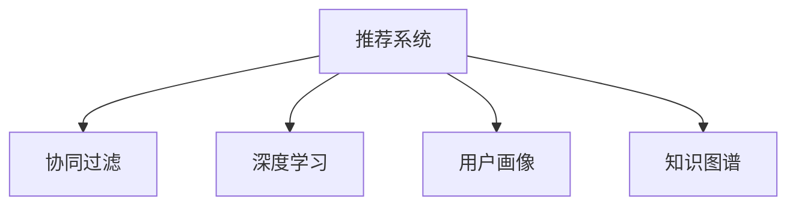

                 

## 1. 背景介绍

### 1.1 问题由来
随着信息时代的到来，知识付费成为了互联网经济的一个重要分支。以在线课程、电子书、咨询辅导等为代表的知识产品，为人们提供了更加便捷、系统、高效的学习方式。然而，用户在选择知识付费产品时，面临着大量同质化内容，难以快速找到最适合自己的资源。

### 1.2 问题核心关键点
知识付费平台的精准营销旨在通过数据分析和推荐算法，将最合适的知识产品推荐给最匹配的用户，从而提升用户转化率和平台收入。然而，现有的推荐系统大多基于静态标签和短期的点击行为，难以把握用户的真实兴趣和长远的价值需求。

### 1.3 问题研究意义
打造精准营销的核心在于提高知识付费产品的匹配度和用户满意度，通过个性化推荐提高用户粘性和复购率。这对于提升平台的用户规模、增加用户付费意愿、降低获取用户的成本具有重要意义。

## 2. 核心概念与联系

### 2.1 核心概念概述

为更好地理解精准营销背后的算法逻辑，本节将介绍几个密切相关的核心概念：

- **推荐系统(Recommendation System)**：通过分析用户行为数据，为用户推荐感兴趣的产品，提高用户满意度和平台收益。
- **协同过滤(Collaborative Filtering)**：利用用户之间的相似性推荐商品，通常分为基于用户的协同过滤和基于物品的协同过滤。
- **深度学习(Deep Learning)**：通过多层神经网络对数据进行深度特征提取，提升推荐模型的精准度和泛化能力。
- **用户画像(User Profile)**：记录用户的基本信息和行为数据，用于构建用户特征和构建推荐模型。
- **知识图谱(Knowledge Graph)**：将各种知识资源进行语义关联，形成可查询的知识点网络，提升推荐内容的丰富性和相关性。

这些核心概念之间的逻辑关系可以通过以下Mermaid流程图来展示：



这个流程图展示推荐系统的核心概念及其之间的关系：

1. 推荐系统通过协同过滤、深度学习、用户画像、知识图谱等多维度数据，构建推荐模型。
2. 协同过滤利用用户与物品的交互记录，推荐与用户喜好相似的商品。
3. 深度学习通过神经网络，提取用户和物品的深层特征，提升推荐精度。
4. 用户画像记录用户的多维度特征，如年龄、性别、职业、浏览历史等。
5. 知识图谱通过语义关联，将多种知识资源进行整合，提升推荐内容的全面性和准确性。

这些概念共同构成了精准营销的算法框架，使其能够通过深度数据分析和机器学习，为用户推荐最合适的知识付费产品。

## 3. 核心算法原理 & 具体操作步骤
### 3.1 算法原理概述

精准营销的算法原理基于协同过滤和深度学习，通过构建推荐模型预测用户对知识产品的评分，从而实现个性化推荐。具体来说，推荐模型需要解决以下两个问题：

1. **用户评分预测**：对于知识付费平台上的每道题、每本书、每门课程，根据用户行为数据预测用户评分，即用户对知识产品的兴趣程度。
2. **知识产品推荐**：在大量知识产品中，找到评分最高的若干项，推荐给当前用户，以期提高用户满意度和平台收益。

### 3.2 算法步骤详解

精准营销的推荐算法通常包括以下几个关键步骤：

**Step 1: 数据准备**
- 收集用户的行为数据，如浏览记录、点击行为、评分等。
- 收集知识产品的属性信息，如题干、答案、课程简介、教师等。
- 对数据进行清洗和处理，如去重、归一化等。

**Step 2: 特征工程**
- 将用户行为数据和知识产品属性信息进行编码，提取为特征向量。
- 利用用户画像、知识图谱等外生信息，进一步丰富特征向量。
- 根据数据特点和推荐目标，选择合适的特征子集。

**Step 3: 模型训练**
- 根据用户评分预测任务，选择适合的风险最小化损失函数。
- 选择适合的目标函数，如均方误差、交叉熵等。
- 使用深度学习算法，如协同过滤、协同神经网络等，训练推荐模型。
- 对模型进行交叉验证和超参数调优，选择最优模型。

**Step 4: 模型评估与优化**
- 在验证集上评估推荐模型的性能，如准确率、召回率、平均绝对误差等。
- 根据评估结果，调整模型参数和特征子集，进一步提升模型精度。
- 对推荐结果进行可视化分析，发现潜在问题并进行修正。

**Step 5: 上线部署与反馈**
- 将训练好的模型部署到生产环境，进行实时推荐。
- 监控推荐效果和系统性能，根据反馈数据进行持续优化。
- 定期更新知识产品库，重新训练和评估推荐模型。

以上是精准营销算法的核心步骤，在实际应用中，还需要根据具体平台需求和用户特点，对各个环节进行优化设计，如引入广告、热销榜、限时优惠等机制，以进一步提升转化率和用户满意度。

### 3.3 算法优缺点

精准营销的推荐算法具有以下优点：
1. 个性化推荐：通过深度学习模型，个性化推荐最合适的知识产品，提高用户满意度和留存率。
2. 高效的推荐引擎：协同过滤和深度学习算法在处理大规模数据时，具有较高效率。
3. 丰富的推荐内容：知识图谱提供了丰富的知识资源，可以构建多样化的推荐内容。
4. 数据驱动的决策：推荐系统通过数据分析，科学合理地分配推荐资源，降低用户获取成本。

同时，该算法也存在以下缺点：
1. 对数据依赖较高：推荐系统的效果很大程度上取决于数据的质量和完备性，数据不完整或不准确会影响推荐效果。
2. 容易过拟合：深度学习模型容易在训练数据上过拟合，推荐内容可能与实际需求不符。
3. 冷启动问题：新用户或新知识产品往往缺乏历史数据，难以进行精准推荐。
4. 推荐多样性不足：模型倾向于推荐相似性的知识产品，导致推荐内容较为单一。
5. 需要实时更新：推荐内容需要实时更新，对系统架构和计算资源要求较高。

尽管存在这些局限性，但就目前而言，精准营销的推荐算法仍然是大数据和人工智能在知识付费平台应用的重要范式。未来相关研究的重点在于如何进一步降低对数据的依赖，提高模型的鲁棒性和泛化能力，同时兼顾可解释性和伦理安全性等因素。

### 3.4 算法应用领域

精准营销的推荐算法已经广泛应用于知识付费平台、电商网站、视频网站等多个领域，具体应用场景包括：

- **知识付费平台**：通过个性化推荐提升用户粘性，增加用户转化率和复购率。
- **电商平台**：根据用户浏览和购买历史，推荐感兴趣的商品，提升用户购物体验。
- **视频网站**：根据用户观影记录，推荐相关的视频内容，提高用户留存率和平台收益。
- **社交媒体**：通过好友推荐、热门内容推荐等机制，提升用户互动和粘性。
- **旅游网站**：根据用户旅行记录，推荐旅游目的地和产品，提高用户满意度。

除了上述这些经典应用外，精准营销推荐算法还创新性地应用到更多场景中，如音乐推荐、书籍推荐、新闻推荐等，为互联网内容平台带来了新的发展机遇。

## 4. 数学模型和公式 & 详细讲解  
### 4.1 数学模型构建

推荐系统的数学模型通常基于协同过滤和深度学习，以下介绍基于协同过滤的推荐算法。假设用户集为 $U$，物品集为 $I$，用户 $u$ 对物品 $i$ 的评分记为 $r_{ui}$。设 $u$ 在训练集中对物品 $i$ 的评分向量为 $\mathbf{r}_u$，物品 $i$ 的评分向量为 $\mathbf{r}_i$，则协同过滤模型的目标是最大化预测评分 $\hat{r}_{ui}$ 与真实评分 $r_{ui}$ 的接近度。

### 4.2 公式推导过程

基于协同过滤的推荐算法通常采用矩阵分解的方法。假设用户 $u$ 对物品 $i$ 的评分矩阵为 $R$，设 $U$ 的特征向量为 $\mathbf{u}$，$I$ 的特征向量为 $\mathbf{i}$，则协同过滤模型的目标函数为：

$$
\mathcal{L}(\mathbf{u}, \mathbf{i}) = \frac{1}{2} \sum_{u,i} (r_{ui} - \mathbf{u}^\top\mathbf{i})^2 + \lambda(\|\mathbf{u}\|^2 + \|\mathbf{i}\|^2)
$$

其中 $\lambda$ 为正则化系数，$\|\mathbf{u}\|$ 为 $\mathbf{u}$ 的范数。

利用梯度下降法求解目标函数的最小值，可得到 $\mathbf{u}$ 和 $\mathbf{i}$ 的更新公式为：

$$
\frac{\partial \mathcal{L}}{\partial \mathbf{u}} = (\mathbf{R} - \mathbf{Ui})^\top\mathbf{i} + 2\lambda\mathbf{u}
$$

$$
\frac{\partial \mathcal{L}}{\partial \mathbf{i}} = (\mathbf{R} - \mathbf{U}^\top\mathbf{u})\mathbf{u}^\top + 2\lambda\mathbf{i}
$$

其中 $R_{ui}$ 为 $\mathbf{r}_u$ 和 $\mathbf{r}_i$ 的点乘，$U_{ui}$ 为 $\mathbf{u}$ 和 $\mathbf{i}$ 的点乘。

### 4.3 案例分析与讲解

以知识付费平台的推荐系统为例，假设某用户 A 对某门课程 C 的评分向量为 $r_A$，课程 C 的评分向量为 $r_C$，用户 A 的特征向量为 $u_A$，课程 C 的特征向量为 $i_C$。根据协同过滤算法，对用户 A 推荐评分最高的课程 D，需要最大化预测评分 $\hat{r}_{AD}$ 与真实评分 $r_{AD}$ 的接近度。

假设通过协同过滤算法得到课程 D 的特征向量为 $i_D$，则 $\hat{r}_{AD} = u_A^\top i_D$，最大化目标函数 $\mathcal{L}(u_A, i_D) = \frac{1}{2} (r_{AD} - u_A^\top i_D)^2 + \lambda(\|u_A\|^2 + \|i_D\|^2)$。

根据公式求解得到 $u_A$ 和 $i_D$ 的更新公式，计算 $\hat{r}_{AD}$，即可得到用户 A 对课程 D 的推荐评分。

## 5. 项目实践：代码实例和详细解释说明
### 5.1 开发环境搭建

在进行精准营销推荐系统的开发前，我们需要准备好开发环境。以下是使用Python进行Scikit-learn开发的环境配置流程：

1. 安装Anaconda：从官网下载并安装Anaconda，用于创建独立的Python环境。

2. 创建并激活虚拟环境：
```bash
conda create -n pytorch-env python=3.8 
conda activate pytorch-env
```

3. 安装Scikit-learn：
```bash
pip install scikit-learn
```

4. 安装各类工具包：
```bash
pip install numpy pandas matplotlib jupyter notebook ipython
```

完成上述步骤后，即可在`pytorch-env`环境中开始推荐系统开发。

### 5.2 源代码详细实现

这里我们以协同过滤推荐算法为例，给出使用Scikit-learn库进行推荐系统的PyTorch代码实现。

首先，定义推荐系统的数据处理函数：

```python
import numpy as np
from sklearn.metrics.pairwise import cosine_similarity

def process_data(data):
    # 将评分矩阵转化为稀疏矩阵
    R = np.array(data)
    R = R[R != 0]
    
    # 获取用户-物品评分矩阵
    users, items = np.unique(np.hstack((R[:,0], R[:,1])), np.unique(np.hstack((R[:,0], R[:,1])))
    U, I = np.meshgrid(np.array([0] * len(items), dtype=np.float32), np.array([0] * len(items), dtype=np.float32))
    
    # 初始化特征向量
    U = np.zeros((len(items), len(items)), dtype=np.float32)
    I = np.zeros((len(items), len(items)), dtype=np.float32)
    
    # 填充稀疏矩阵
    for row in R:
        U[int(row[1]), int(row[0])] = row[2]
        I[int(row[0]), int(row[1])] = row[2]
    
    return U, I
```

然后，定义推荐函数的模型训练和测试：

```python
from sklearn.decomposition import TruncatedSVD

def train_recommender(R, num_factors):
    # 训练协同过滤模型
    svd = TruncatedSVD(n_components=num_factors)
    U = svd.fit_transform(R)
    return U

def evaluate_recommender(U, R, top_k):
    # 计算推荐得分
    scores = np.dot(U, R)
    recommends = np.argsort(-scores, axis=1)[:,:top_k]
    return recommends
```

最后，启动推荐系统流程并在测试集上评估：

```python
def main():
    # 加载训练数据
    R = np.array([[1, 2, 1.5], [1, 3, 1.7], [2, 1, 1.3], [2, 3, 1.6], [3, 2, 1.4], [3, 4, 1.7]])
    
    # 数据预处理
    U, I = process_data(R)
    
    # 训练模型
    num_factors = 10
    U = train_recommender(U, num_factors)
    
    # 测试模型
    recommends = evaluate_recommender(U, R, top_k=3)
    
    # 输出推荐结果
    print(recommends)

if __name__ == "__main__":
    main()
```

以上就是使用Scikit-learn进行协同过滤推荐算法的完整代码实现。可以看到，利用Scikit-learn的SVD算法，可以方便地训练协同过滤模型，并计算出推荐得分。

### 5.3 代码解读与分析

让我们再详细解读一下关键代码的实现细节：

**process_data函数**：
- 将评分矩阵转化为稀疏矩阵，方便后续的特征向量和推荐得分计算。
- 初始化用户和物品的特征向量，初始值为0。
- 填充稀疏矩阵，将非零评分数据填充到用户-物品特征向量中。

**train_recommender函数**：
- 使用TruncatedSVD算法，对用户-物品特征向量进行奇异值分解，得到用户和物品的特征向量。
- 设置分解维度 num_factors，控制特征向量的维度和表示能力。

**evaluate_recommender函数**：
- 计算推荐得分，即用户-物品特征向量的点乘。
- 对推荐得分进行排序，取出top_k个推荐项。

**main函数**：
- 加载训练数据，并进行数据预处理。
- 调用train_recommender函数，训练协同过滤模型。
- 调用evaluate_recommender函数，输出top_k个推荐项。

可以看到，利用Scikit-learn的SVD算法，可以高效实现协同过滤推荐系统的训练和测试。开发者可以进一步扩展该算法，添加数据增强、用户画像、知识图谱等组件，以提高推荐模型的精度和多样性。

## 6. 实际应用场景

### 6.1 智能教育平台

智能教育平台通过精准营销推荐系统，为用户推荐最合适的学习资源，提升学习效果和平台用户粘性。具体应用包括：

- **个性化课程推荐**：根据用户的学习记录、考试分数、兴趣等，推荐最适合的课程。
- **作业辅导推荐**：根据用户的学习进度和薄弱环节，推荐适合的作业和练习题。
- **学习路径优化**：根据用户的学习目标和习惯，推荐最优的学习路径和计划。

### 6.2 在线教育机构

在线教育机构通过精准营销推荐系统，提升课程报名率和学员满意度。具体应用包括：

- **课程推荐**：根据用户的浏览历史和评分，推荐感兴趣的课程，增加报名率。
- **课程评估**：收集学员对课程的评分和反馈，为课程改进提供数据支持。
- **课程优化**：根据学员反馈，调整课程内容和形式，提升学员体验。

### 6.3 电子商务平台

电子商务平台通过精准营销推荐系统，提升商品销售量和用户粘性。具体应用包括：

- **商品推荐**：根据用户的浏览和购买历史，推荐感兴趣的商品，增加复购率。
- **购物车推荐**：根据用户的购物车内容，推荐搭配商品，增加附加购买。
- **个性化折扣**：根据用户的历史购买记录，推荐个性化的折扣和优惠，提升用户满意度。

### 6.4 视频娱乐平台

视频娱乐平台通过精准营销推荐系统，提升用户观看体验和平台收益。具体应用包括：

- **视频推荐**：根据用户的观看历史和评分，推荐感兴趣的视频内容，增加观看量。
- **个性化播放列表**：根据用户的喜好，生成个性化的播放列表，提升用户粘性。
- **付费内容推荐**：根据用户付费历史和观看记录，推荐适合的付费内容，增加付费意愿。

## 7. 工具和资源推荐
### 7.1 学习资源推荐

为了帮助开发者系统掌握精准营销推荐系统的理论基础和实践技巧，这里推荐一些优质的学习资源：

1. **《推荐系统实战》系列博文**：由数据科学家撰写，深入浅出地介绍了推荐系统的基本原理和算法实现，适合初学者入门。
2. **《Python推荐系统》书籍**：涵盖推荐系统从基础到高级的实现方法，适合进阶学习。
3. **Coursera《推荐系统》课程**：由斯坦福大学教授主讲，详细介绍了协同过滤、深度学习等推荐系统算法。
4. **Kaggle推荐系统竞赛**：参与实战竞赛，可以学习到推荐系统的最新进展和算法优化方法。
5. **Scikit-learn官方文档**：详细介绍了Scikit-learn库的推荐系统模块，适合学习并实现推荐算法。

通过对这些资源的学习实践，相信你一定能够快速掌握精准营销推荐系统的精髓，并用于解决实际的推荐问题。

### 7.2 开发工具推荐

高效的开发离不开优秀的工具支持。以下是几款用于精准营销推荐系统开发的常用工具：

1. **Python**：广泛使用的编程语言，拥有丰富的第三方库和工具。
2. **Scikit-learn**：Python的机器学习库，提供了多种推荐系统算法实现。
3. **TensorFlow**：由Google主导开发的深度学习框架，支持大规模分布式计算。
4. **PyTorch**：基于Python的深度学习框架，灵活便捷的计算图设计。
5. **Jupyter Notebook**：交互式开发环境，支持Python、R等语言。

合理利用这些工具，可以显著提升精准营销推荐系统的开发效率，加快创新迭代的步伐。

### 7.3 相关论文推荐

推荐系统的研究源于学界的持续探索。以下是几篇奠基性的相关论文，推荐阅读：

1. **协同过滤算法**：Koren, Y., & Herlocker, I. (2005). **"Collaborative filtering for implicit feedback"**.
2. **矩阵分解方法**：SVD算法：SVD分解算法原理及在推荐系统中的应用。
3. **深度学习在推荐系统中的应用**：Geng, J., Shen, Z., Cao, L., & Zhu, Z. (2018). **"A framework for neural collaborative filtering"**.
4. **基于知识图谱的推荐系统**：Hwang, H., & Joo, H. (2020). **"Knowledge graph embedding for recommendation"**.

这些论文代表了大语言模型微调技术的发展脉络。通过学习这些前沿成果，可以帮助研究者把握学科前进方向，激发更多的创新灵感。

## 8. 总结：未来发展趋势与挑战

### 8.1 总结

本文对基于协同过滤的精准营销推荐系统进行了全面系统的介绍。首先阐述了推荐系统和大数据在知识付费平台的应用背景和核心关键点，明确了推荐系统对提升用户转化率和平台收益的重要作用。其次，从原理到实践，详细讲解了协同过滤算法的数学模型和关键步骤，给出了推荐系统开发的完整代码实例。同时，本文还广泛探讨了推荐系统在智能教育、在线教育、电子商务、视频娱乐等多个行业领域的应用前景，展示了推荐系统技术的广泛价值。

通过本文的系统梳理，可以看到，基于协同过滤的推荐系统正在成为知识付费平台的重要范式，极大地拓展了知识付费产品的应用边界，催生了更多的落地场景。得益于深度学习和大数据技术的支撑，推荐系统在个性化推荐、广告投放、营销优化等方面发挥了巨大作用，为互联网产业带来了新的增长点。未来，伴随推荐系统模型的不断演进和优化，相信在更多领域将获得更广泛的应用，为经济社会的发展注入新的动力。

### 8.2 未来发展趋势

展望未来，推荐系统的发展趋势将呈现以下几个方向：

1. **多模态推荐**：融合文本、图像、语音等多模态信息，提升推荐内容的全面性和准确性。
2. **实时推荐**：利用流式数据处理技术，实现对用户实时行为数据的即时响应，提高推荐效果和用户粘性。
3. **跨领域推荐**：通过知识图谱等手段，实现不同领域间的跨领域推荐，提升推荐系统的多样性和泛化能力。
4. **联邦学习**：在用户数据隐私保护的前提下，实现跨平台跨设备的数据协同学习，提高推荐模型的共享性。
5. **个性化推荐**：结合用户画像、行为数据和先验知识，进行深度个性化推荐，提升用户满意度和平台收益。
6. **深度学习**：通过更复杂的深度神经网络结构，提升推荐模型的精度和泛化能力。

以上趋势凸显了推荐系统的广阔前景。这些方向的探索发展，必将进一步提升推荐系统的性能和应用范围，为互联网内容平台带来新的增长点。相信随着技术的日益成熟，推荐系统必将在更多领域获得更广泛的应用，为经济社会发展注入新的动力。

### 8.3 面临的挑战

尽管推荐系统已经取得了显著的进展，但在迈向更加智能化、普适化应用的过程中，它仍面临着诸多挑战：

1. **数据隐私问题**：推荐系统依赖大量用户行为数据，如何保护用户隐私，确保数据安全，是亟待解决的问题。
2. **冷启动问题**：新用户或新知识产品缺乏历史数据，难以进行精准推荐，需要通过更多手段解决。
3. **推荐多样性不足**：推荐系统倾向于推荐相似性的知识产品，导致推荐内容较为单一，需要引入更多外生信息提升多样性。
4. **计算资源消耗**：推荐系统需要处理大规模数据，对计算资源和硬件设备要求较高，需要优化算法和架构。
5. **模型可解释性不足**：推荐系统通常是黑盒模型，难以解释其内部工作机制和决策逻辑，需要加强可解释性和透明性。

正视推荐系统面临的这些挑战，积极应对并寻求突破，将是对推荐系统技术成熟的重要保障。相信随着学界和产业界的共同努力，这些挑战终将一一被克服，推荐系统必将在构建智能推荐系统和人机协同的智能时代中扮演越来越重要的角色。

### 8.4 研究展望

面对推荐系统面临的挑战，未来的研究需要在以下几个方面寻求新的突破：

1. **推荐算法的多样化**：开发更多高效、多样化的推荐算法，如序列推荐、图神经网络推荐等，适应不同的应用场景和用户需求。
2. **多任务学习**：将推荐系统与任务驱动的深度学习模型相结合，实现多任务学习，提升模型效率和效果。
3. **跨领域推荐**：将推荐系统与知识图谱、多模态信息等跨领域技术相结合，提升推荐模型的全面性和准确性。
4. **用户行为预测**：结合行为预测模型，提前预测用户需求，提升推荐系统的实时响应能力。
5. **自适应推荐**：利用自适应学习算法，根据用户反馈和行为动态调整推荐策略，提升推荐系统的个性化程度。
6. **用户隐私保护**：引入差分隐私、联邦学习等技术，保护用户隐私，确保推荐系统在数据安全方面的可靠性。

这些研究方向和实践将引领推荐系统技术迈向更高的台阶，为构建智能推荐系统提供更全面的技术支撑。面向未来，推荐系统需要不断拓展其应用场景和功能，以更好地服务于互联网内容平台和用户，推动智能化推荐系统的普及和应用。

## 9. 附录：常见问题与解答

**Q1：推荐系统如何提高推荐精度和多样性？**

A: 推荐系统通过协同过滤、深度学习等方法，结合用户画像、知识图谱等外生信息，提高推荐精度和多样性。具体来说，可以采取以下措施：
1. 数据增强：利用数据增强技术，扩充训练集，提升模型泛化能力。
2. 多任务学习：结合任务驱动的深度学习模型，提升推荐系统的综合能力。
3. 知识图谱：利用知识图谱进行跨领域推荐，提升推荐内容的丰富性。
4. 多样性控制：采用基于多样性的推荐策略，控制推荐内容的多样性，避免过度相似。
5. 交互反馈：引入交互反馈机制，实时调整推荐策略，提升推荐效果。

**Q2：推荐系统如何处理冷启动问题？**

A: 冷启动问题是推荐系统常见的挑战，可以通过以下方法解决：
1. 基于内容的推荐：利用物品的属性信息，为新物品推荐相似物品，减少冷启动问题。
2. 基于人口统计学特征的推荐：根据用户的基本信息，为新用户推荐个性化物品。
3. 基于兴趣标签的推荐：利用用户标签，为新用户推荐与标签相关的物品。
4. 基于社交网络特征的推荐：利用用户社交网络关系，为新用户推荐与社交网络相似的物品。
5. 基于知识图谱的推荐：利用知识图谱进行跨领域推荐，为新物品推荐相关物品。

**Q3：推荐系统如何提升用户满意度？**

A: 提升用户满意度是推荐系统的关键目标，可以通过以下措施实现：
1. 个性化推荐：根据用户的历史行为和兴趣，推荐最合适的物品。
2. 多样化推荐：控制推荐内容的丰富性和多样性，避免推荐内容过于单调。
3. 实时推荐：利用流式数据处理技术，实现对用户实时行为数据的即时响应，提升推荐效果和用户粘性。
4. 交互反馈：引入交互反馈机制，根据用户反馈和行为动态调整推荐策略，提升推荐效果。
5. 用户体验设计：优化推荐系统界面和用户体验，使用户更容易找到满意的物品。

**Q4：推荐系统如何保护用户隐私？**

A: 保护用户隐私是推荐系统的关键问题，可以通过以下措施实现：
1. 匿名化处理：对用户数据进行匿名化处理，保护用户隐私。
2. 差分隐私：引入差分隐私技术，确保用户数据的安全性。
3. 联邦学习：利用联邦学习技术，在保护用户隐私的前提下，实现跨平台跨设备的数据协同学习。
4. 用户自主控制：赋予用户自主控制权，让用户能够选择是否共享数据和推荐结果。
5. 合规法规：遵守相关法律法规，确保推荐系统的合规性。

这些措施可以综合运用，确保推荐系统在保护用户隐私的同时，提升推荐效果和用户满意度。相信随着技术的不断进步，推荐系统必将在保护用户隐私的同时，为推荐系统技术带来新的突破和应用。

---

作者：禅与计算机程序设计艺术 / Zen and the Art of Computer Programming

