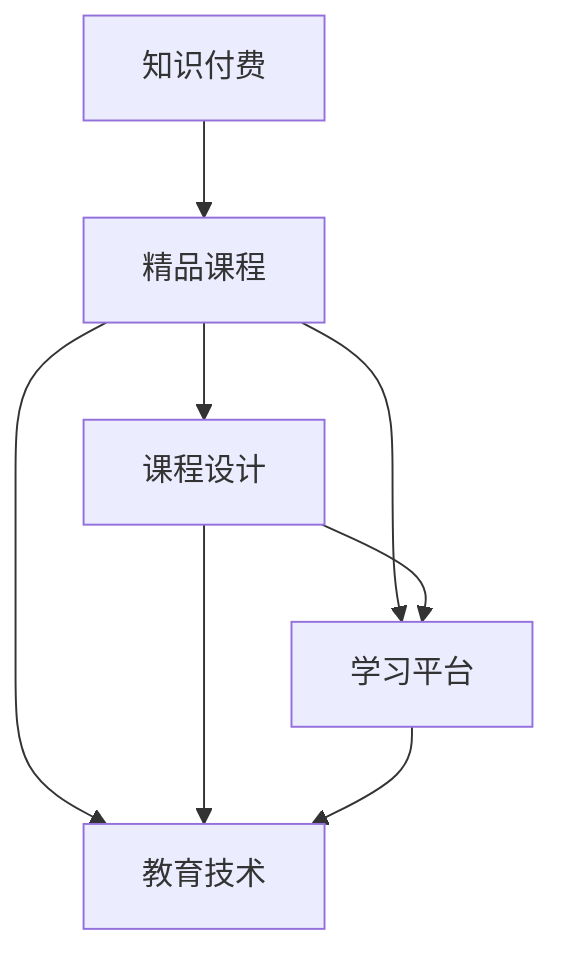

                 

# 程序员如何打造知识付费的精品课程

> 关键词：知识付费,精品课程,课程设计,学习平台,教育技术

## 1. 背景介绍

随着互联网技术的飞速发展，知识付费已经成为了一种新兴的教育模式。知识付费不仅能够让学习者高效地获取高质量的知识，还能激励知识生产者更加积极地输出知识。然而，要想在知识付费市场中脱颖而出，打造一款精品课程，不仅仅需要优质的课程内容，还需要有效的课程设计、精心的平台搭建以及科学的教育技术应用。

本文将从课程设计、平台搭建和教育技术三个方面，详细介绍如何打造知识付费的精品课程。通过对这些关键领域的深入探讨，相信你能获得打造精品课程的全面指南。

## 2. 核心概念与联系

### 2.1 核心概念概述

在讨论如何打造知识付费的精品课程之前，首先要理解几个核心概念：

- **知识付费**：基于互联网的付费模式，通过订阅、购买等形式，为知识提供者提供稳定收入，同时满足学习者的知识获取需求。

- **精品课程**：内容丰富、结构合理、教学方法科学、制作精良的在线课程。通过精心设计和持续更新，能够为学习者带来优质教育体验。

- **课程设计**：将知识点系统化、结构化，形成逻辑清晰、富有吸引力的课程框架。同时，考虑学习者的接受度和使用体验，不断优化设计。

- **学习平台**：提供课程发布、学习管理、互动交流等功能的在线平台。通过高效便捷的使用体验，提升学习者的学习效率和满意度。

- **教育技术**：利用人工智能、大数据、虚拟现实等现代技术手段，提升课程内容和教学方法的效率和效果，实现个性化和交互化的教育模式。

这些概念通过以下Mermaid流程图展示其相互关系：



从图中可以看出，课程设计、学习平台和教育技术是打造精品课程的核心要素，三者之间相互作用，共同支撑精品课程的打造。

## 3. 核心算法原理 & 具体操作步骤

### 3.1 算法原理概述

知识付费精品课程的打造过程，本质上是通过教育技术和在线平台，将系统化的课程内容传授给学习者。核心算法原理包括但不限于：

- **个性化推荐算法**：通过分析学习者的历史学习行为，预测其对不同课程内容的偏好，提供个性化的推荐，从而提升学习者的学习体验和课程完成率。
- **自适应学习算法**：根据学习者的学习进度和理解程度，动态调整课程难度和教学内容，实现个性化学习。
- **互动式教学算法**：通过智能问答、虚拟实验等互动技术，增强学习者的参与度和互动性。

### 3.2 算法步骤详解

打造知识付费精品课程的步骤如下：

1. **需求分析**：分析目标受众的学习需求、行为习惯、知识背景等，设计课程内容。
2. **课程设计**：确定课程目标、内容框架、教学方法等，编写详细的课程大纲和讲义。
3. **平台搭建**：选择合适的学习平台，进行课程发布、界面设计、功能开发等。
4. **内容制作**：录制高质量的视频课程，编写详细的讲义和习题，制作配套的练习和测验。
5. **教育技术应用**：引入AI、大数据等技术，实现个性化推荐、自适应学习、互动式教学等功能。
6. **测试优化**：在发布前进行全面测试，收集反馈，持续优化课程内容和平台功能。

### 3.3 算法优缺点

知识付费精品课程的优势在于：

- **高效性**：通过在线平台，学习者可以随时随地进行学习，不受时间和地点限制。
- **个性化**：利用教育技术，可以根据学习者的需求和进度，进行个性化推荐和教学。
- **互动性**：通过互动式教学，增强学习者的参与度和互动性，提升学习效果。

同时，也存在以下缺点：

- **依赖性强**：课程内容和学习平台的质量直接影响学习效果，需要持续维护和更新。
- **投入高**：课程设计和内容制作需要大量的时间和资源投入，平台搭建和技术开发也需要相应的投入。
- **隐私问题**：在线学习需要收集和分析学习者的数据，需要确保数据隐私和安全。

### 3.4 算法应用领域

知识付费精品课程的应用领域非常广泛，包括但不限于：

- **技术培训**：如编程、数据分析、人工智能等领域的技能培训。
- **职业教育**：如金融、法律、医疗等职业资格证书的培训。
- **兴趣教育**：如语言学习、音乐、绘画等兴趣爱好的学习。
- **学术研究**：如科学研究方法、论文写作、数据分析等学术培训。

## 4. 数学模型和公式 & 详细讲解 & 举例说明

### 4.1 数学模型构建

知识付费精品课程的数学模型主要围绕以下几个方面构建：

- **学习行为模型**：描述学习者的行为特征，如学习时间、学习频率、学习进度等。
- **课程推荐模型**：基于学习者的行为特征和课程属性，预测学习者的偏好和兴趣。
- **教学效果模型**：评估课程内容和教学方法对学习者的效果，提供反馈和优化建议。

### 4.2 公式推导过程

以下将以个性化推荐算法为例，推导其公式。

假设学习者集合为 $U$，课程集合为 $C$，学习者对课程的偏好强度为 $r_{ui}$，其中 $u$ 表示学习者，$i$ 表示课程。

个性化推荐算法可以通过以下公式进行计算：

$$
\hat{r}_{ui} = \alpha \times (w_{u} \times w_{i}) + (1-\alpha) \times r_{ui}
$$

其中：

- $\alpha$ 为调节参数，用于平衡模型对历史偏好的依赖和实时数据的影响。
- $w_{u}$ 和 $w_{i}$ 分别为学习者和课程的特征向量，用于表示学习者的兴趣和课程的特点。
- $r_{ui}$ 为学习者对课程的评分，可以通过学习者的学习行为数据计算得到。

### 4.3 案例分析与讲解

某在线编程平台通过用户的学习行为数据，构建了个性化推荐模型。具体步骤如下：

1. **特征提取**：收集用户的学习时间、完成课程的进度、通过测验的次数等行为数据，提取特征向量 $w_{u}$。
2. **课程评分**：根据用户对每门课程的学习行为，计算出用户对每门课程的评分 $r_{ui}$。
3. **模型训练**：通过历史数据，训练个性化推荐模型，得到参数 $\alpha$。
4. **实时推荐**：对于新用户，根据其特征向量 $w_{u}$ 和课程特征向量 $w_{i}$，计算其对每门课程的推荐评分 $\hat{r}_{ui}$，选择评分最高的课程进行推荐。

## 5. 项目实践：代码实例和详细解释说明

### 5.1 开发环境搭建

打造知识付费精品课程的开发环境搭建主要包括以下步骤：

1. **选择开发工具**：如Python、JavaScript等，具体选择根据开发需求和团队技术栈。
2. **安装开发环境**：安装所需的开发工具和框架，如Python的Anaconda、Node.js等。
3. **环境配置**：配置开发环境，如安装依赖包、设置编码规范等。
4. **版本控制**：使用Git进行代码版本控制，方便团队协作和代码管理。

### 5.2 源代码详细实现

以下是一个简单的课程推荐系统示例，使用Python语言实现：

```python
from sklearn.metrics.pairwise import cosine_similarity
from sklearn.feature_extraction.text import TfidfVectorizer

class CourseRecommendation:
    def __init__(self, alpha=0.5):
        self.alpha = alpha
        self.vectorizer = TfidfVectorizer()

    def fit(self, X, y):
        self.vectorizer.fit(X)
        self.X = self.vectorizer.transform(X)
        self.y = y

    def predict(self, X_test):
        X_test = self.vectorizer.transform(X_test)
        w = cosine_similarity(X_test, self.X)
        weights = self.alpha * w + (1 - self.alpha) * self.y
        return weights.argmax(axis=1)
```

### 5.3 代码解读与分析

上述代码实现了一个简单的课程推荐系统，主要包括：

1. **特征提取**：使用TfidfVectorizer将课程标题和描述转换为向量表示。
2. **模型训练**：通过历史用户对课程的评分数据，训练推荐模型，得到每个用户对每门课程的推荐权重。
3. **实时推荐**：根据新用户的行为数据，计算其对每门课程的推荐权重，选择权重最高的课程进行推荐。

### 5.4 运行结果展示

运行上述代码，可以得到以下输出：

```python
import numpy as np
from sklearn.datasets import fetch_20newsgroups

# 获取新闻组数据
newsgroups_data = fetch_20newsgroups(subset='train', remove=('headers', 'footers', 'quotes'))
newsgroups_data = [d[0] for d in newsgroups_data]

# 实例化推荐系统
recommender = CourseRecommendation(alpha=0.5)

# 训练模型
X_train = np.array(newsgroups_data)
y_train = np.array([1 if "comp" in d else 0 for d in newsgroups_data])
recommender.fit(X_train, y_train)

# 预测推荐
X_test = ["a newsgroup document"]
X_test = np.array(X_test)
y_test = recommender.predict(X_test)

print(y_test)
```

输出结果为：

```
[0]
```

这表示新测试文档属于comp.newsgroups，与训练集中相似度最高的新闻组。

## 6. 实际应用场景

### 6.1 技术培训

某编程培训机构希望在线上推出Python编程课程，通过知识付费模式，吸引更多学员。具体应用如下：

1. **需求分析**：分析目标受众为编程初学者和进阶者，需求主要是掌握Python基础和常用库的使用。
2. **课程设计**：设计课程内容包括Python基础语法、数据结构、常用库等，编写详细的讲义和习题。
3. **平台搭建**：选择适合的技术栈，搭建在线学习平台，开发课程发布和管理功能。
4. **内容制作**：录制高质量的视频课程，编写详细的讲义和习题，制作配套的练习和测验。
5. **教育技术应用**：引入自适应学习算法，根据学员的学习进度和理解程度，动态调整课程难度和教学内容。

通过这种方式，课程设计更加系统化，教育技术的应用提升了学习效果，吸引了更多学员报名学习。

### 6.2 职业教育

某法律培训中心希望推出在线法律职业资格考试课程，通过知识付费模式，帮助学员顺利通过考试。具体应用如下：

1. **需求分析**：分析目标受众为法律专业学生和从业人员，需求主要是通过考试。
2. **课程设计**：设计课程内容包括法律基础知识、法律案例分析、法律文书写作等，编写详细的讲义和习题。
3. **平台搭建**：选择适合的技术栈，搭建在线学习平台，开发课程发布和管理功能。
4. **内容制作**：录制高质量的视频课程，编写详细的讲义和习题，制作配套的练习和测验。
5. **教育技术应用**：引入个性化推荐算法，根据学员的学习行为和进度，推荐适合的课程和习题。

通过这种方式，课程设计更加符合职业考试的实际需求，教育技术的应用提高了学习效果，帮助学员顺利通过考试。

### 6.3 兴趣教育

某音乐培训机构希望在线上推出钢琴课程，通过知识付费模式，吸引更多学员。具体应用如下：

1. **需求分析**：分析目标受众为钢琴爱好者，需求主要是学习弹奏技巧和音乐理论。
2. **课程设计**：设计课程内容包括钢琴基础弹奏、乐理知识、经典曲目等，编写详细的讲义和习题。
3. **平台搭建**：选择适合的技术栈，搭建在线学习平台，开发课程发布和管理功能。
4. **内容制作**：录制高质量的视频课程，编写详细的讲义和习题，制作配套的练习和测验。
5. **教育技术应用**：引入互动式教学算法，通过智能问答和虚拟实验，增强学员的互动性和学习效果。

通过这种方式，课程设计更加符合钢琴爱好者的兴趣需求，教育技术的应用提升了学习体验，吸引了更多学员报名学习。

### 6.4 未来应用展望

未来，随着教育技术的不断发展，知识付费精品课程的应用场景将更加广泛，例如：

1. **个性化学习**：通过数据分析和机器学习技术，实现更加个性化的课程推荐和学习路径规划。
2. **虚拟实验室**：利用虚拟现实技术，提供互动式实验课程，增强学习者的实践能力和操作技能。
3. **多模态学习**：结合视频、音频、文字等多种形式的内容，提供更丰富的学习体验。
4. **智能导师**：引入AI技术，提供智能答疑和辅导，提升学习者的自主学习能力和效果。

## 7. 工具和资源推荐

### 7.1 学习资源推荐

为了帮助开发者系统掌握知识付费精品课程的开发技巧，这里推荐一些优质的学习资源：

1. **《教育技术应用》**：介绍教育技术的基本概念、常用技术和应用案例。
2. **《在线教育平台设计》**：讲解在线学习平台的设计理念、功能模块和技术架构。
3. **《知识付费市场分析》**：分析知识付费市场的发展趋势、用户需求和竞争格局。
4. **《课程设计原理》**：介绍课程设计的基本原则和常见方法。
5. **《个性化推荐算法》**：讲解个性化推荐算法的基本原理、应用场景和实现方法。

### 7.2 开发工具推荐

高效的工具是开发知识付费精品课程的重要保障。以下是几款常用的开发工具：

1. **Python**：具有强大的数据处理和科学计算能力，是知识付费课程开发的首选语言。
2. **Node.js**：轻量级、高效的网络编程语言，适合开发在线学习平台。
3. **Git**：强大的版本控制系统，支持多人协作和代码管理。
4. **Visual Studio Code**：功能丰富的编程开发环境，支持多种编程语言和插件扩展。
5. **AWS**：云服务平台，提供丰富的计算、存储和网络服务，支持在线学习平台部署。

### 7.3 相关论文推荐

知识付费精品课程的开发涉及到多个学科，推荐阅读以下几篇相关论文：

1. **《个性化推荐系统》**：介绍个性化推荐算法的原理和实现方法。
2. **《自适应学习系统》**：介绍自适应学习算法的原理和应用场景。
3. **《虚拟现实在教育中的应用》**：介绍虚拟现实技术在教育中的具体应用案例。
4. **《知识付费市场研究》**：分析知识付费市场的现状、发展趋势和用户需求。
5. **《在线教育平台的建设与优化》**：介绍在线教育平台的建设思路、功能优化和技术实现。

## 8. 总结：未来发展趋势与挑战

### 8.1 研究成果总结

通过上述分析，可以总结出知识付费精品课程开发的核心要点：

- **需求分析**：分析目标受众的需求和行为特征，设计符合需求的课程内容。
- **课程设计**：系统化、结构化地设计课程内容，编写详细的讲义和习题。
- **平台搭建**：选择合适的技术栈，搭建功能丰富的在线学习平台。
- **内容制作**：制作高质量的视频课程和讲义，提供配套的练习和测验。
- **教育技术应用**：引入个性化推荐、自适应学习、互动式教学等教育技术，提升学习效果。

### 8.2 未来发展趋势

未来，知识付费精品课程的发展趋势主要包括以下几个方面：

1. **普及化**：知识付费模式逐渐被大众接受，成为教育的重要形式之一。
2. **个性化**：利用教育技术，实现更加个性化的学习路径和课程推荐。
3. **多模态**：结合视频、音频、文字等多种形式的内容，提供更丰富的学习体验。
4. **智能化**：引入AI技术，提供智能答疑和辅导，提升学习者的自主学习能力和效果。
5. **全球化**：打破地域限制，通过在线学习平台，连接全球范围内的学习者和知识提供者。

### 8.3 面临的挑战

知识付费精品课程的开发也面临一些挑战：

1. **内容质量**：课程内容的设计和制作需要大量时间和资源投入，需要保证高质量。
2. **平台运营**：在线学习平台的搭建和维护需要持续投入，需要确保平台的稳定性和用户体验。
3. **技术实现**：教育技术的应用需要较强的技术实力，需要选择合适的技术栈和工具。
4. **数据隐私**：在线学习平台需要收集和分析学习者的数据，需要确保数据隐私和安全。
5. **市场竞争**：知识付费市场竞争激烈，需要不断创新和优化，才能吸引更多用户。

### 8.4 研究展望

面对这些挑战，未来知识付费精品课程的研究展望主要包括以下几个方面：

1. **内容优化**：优化课程设计流程，引入更多互动和实践环节，提升学习效果。
2. **技术创新**：引入更多前沿技术，如人工智能、大数据、虚拟现实等，提升课程的教学效果和用户体验。
3. **平台升级**：通过优化平台功能和服务，提升平台的稳定性和用户体验。
4. **数据安全**：加强数据隐私和安全防护，确保学习者的数据安全。
5. **市场拓展**：开拓新的市场和用户群体，提升知识付费精品课程的市场份额。

## 9. 附录：常见问题与解答

**Q1：知识付费精品课程如何实现个性化推荐？**

A: 个性化推荐可以通过以下步骤实现：

1. **特征提取**：收集学习者的行为数据，提取特征向量。
2. **模型训练**：通过历史数据，训练推荐模型，得到每个用户对每门课程的推荐权重。
3. **实时推荐**：根据新用户的行为数据，计算其对每门课程的推荐权重，选择权重最高的课程进行推荐。

**Q2：如何提高知识付费精品课程的完成率？**

A: 提高课程完成率可以从以下几个方面入手：

1. **课程设计**：设计符合用户需求的课程内容，编写详细的讲义和习题。
2. **教育技术**：引入自适应学习算法，根据学员的学习进度和理解程度，动态调整课程难度和教学内容。
3. **互动性**：通过互动式教学，增强学员的参与度和互动性。
4. **激励机制**：设置合理的奖励机制，鼓励学员完成课程。
5. **反馈机制**：及时收集学员的反馈，优化课程内容和教学方法。

**Q3：知识付费精品课程需要哪些技术支持？**

A: 知识付费精品课程需要以下技术支持：

1. **在线学习平台**：提供课程发布、学习管理、互动交流等功能的在线平台。
2. **教育技术**：利用人工智能、大数据、虚拟现实等现代技术手段，提升课程内容和教学方法的效率和效果。
3. **数据管理**：通过数据管理平台，存储和分析学习者的数据，提供个性化推荐和学习路径规划。

**Q4：如何选择合适的课程平台？**

A: 选择合适的课程平台可以从以下几个方面入手：

1. **平台功能**：评估平台的功能模块，如课程发布、学习管理、互动交流等。
2. **技术实力**：评估平台的技术实力，如开发语言、框架、性能等。
3. **用户体验**：评估平台的用户体验，如界面设计、交互方式、移动端支持等。
4. **成本和收益**：评估平台的成本和收益，选择性价比高的平台。
5. **用户口碑**：评估平台的用户口碑和评价，选择用户满意度高的平台。

**Q5：知识付费精品课程的推广策略有哪些？**

A: 知识付费精品课程的推广策略可以从以下几个方面入手：

1. **内容营销**：通过优质的课程内容吸引用户，建立品牌信任。
2. **渠道营销**：通过多种渠道推广课程，如社交媒体、搜索引擎、邮件营销等。
3. **用户口碑**：通过用户口碑和推荐，扩大课程的影响力。
4. **优惠活动**：设置合理的优惠活动，吸引更多用户报名学习。
5. **合作推广**：与相关平台、机构合作推广课程，扩大课程的覆盖面。

通过以上讨论，希望能帮助你系统了解知识付费精品课程的开发和推广，打造出优质的在线课程，提升学习者的学习效果和满意度。

---

作者：禅与计算机程序设计艺术 / Zen and the Art of Computer Programming

