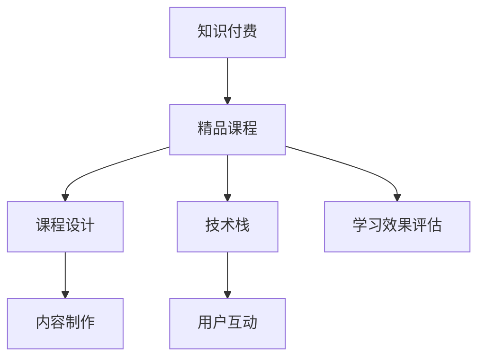

                 

# 程序员如何打造知识付费的精品课程

> 关键词：知识付费, 精品课程, 程序员, 课程设计, 内容制作, 用户互动, 技术栈, 开发实践, 教育技术, 学习效果评估

## 1. 背景介绍

### 1.1 问题由来
随着互联网和移动设备的普及，人们对于在线学习的需求日益增长。知识付费平台的兴起，为知识传播和获取提供了新的途径。在线课程、直播讲座、音频书籍等形式的知识产品，已经成为广大用户获取知识和技能的重要渠道。然而，尽管知识付费市场发展迅速，但高素质课程仍然稀缺，精品课程更是凤毛麟角。许多在线课程存在内容冗余、互动不足、技术不完善等问题，难以满足用户的实际学习需求。

因此，本文旨在探讨如何打造知识付费的精品课程。通过对知识付费市场现状的深入分析，总结了精品课程的特点和设计原则。同时，从课程设计、内容制作、技术实现和用户互动等方面，给出了具体的实施方案。希望本文能为程序员和其他内容创作者提供有价值的参考，助力他们打造高质量的知识付费产品。

### 1.2 问题核心关键点
如何打造知识付费的精品课程，成为业内广泛关注的焦点。关键在于：

- 如何制定科学的课程大纲，确保内容连贯、层次分明。
- 如何高效制作优质内容，保证知识的准确性和实用性。
- 如何结合最新技术栈，打造功能完善的在线课程平台。
- 如何通过良好的互动机制，提升用户学习体验和参与度。
- 如何设计科学的评价体系，评估学习效果和课程价值。

## 2. 核心概念与联系

### 2.1 核心概念概述

为更好地理解知识付费精品课程的打造过程，本节将介绍几个关键概念及其之间的关系。

- 知识付费：指用户为获取知识或技能而支付费用，以获得更深入、更系统的学习内容和服务。
- 精品课程：指内容严谨、结构合理、互动性强的在线课程，能够满足用户的学习需求，提供良好的学习体验。
- 课程设计：指根据教育学和心理学理论，制定科学合理的课程大纲，明确课程目标和教学策略。
- 内容制作：指将知识内容制作成课程视频、文本、习题等形式，保证知识的准确性和实用性。
- 技术栈：指课程开发过程中用到的技术框架和工具，包括前端、后端、数据库、云服务等多种技术。
- 用户互动：指课程平台与用户之间的交流与反馈机制，包括问答、讨论、评价等功能。
- 学习效果评估：指通过科学方法对用户学习效果进行量化评估，确保课程目标达成。

这些概念之间的逻辑关系可以通过以下Mermaid流程图来展示：



这个流程图展示了大语言模型的核心概念及其之间的关系：

1. 知识付费平台将精品课程作为知识服务提供给用户。
2. 课程设计是精品课程的核心，决定了课程的知识结构和教学策略。
3. 内容制作是课程设计的具体实现，保证知识内容的准确性和实用性。
4. 技术栈是课程开发的技术支撑，保证了课程的稳定性和可扩展性。
5. 用户互动是课程与用户沟通的桥梁，提升了用户的参与度和满意度。
6. 学习效果评估是课程质量的重要参考，帮助课程不断优化改进。

这些概念共同构成了精品课程的设计与实施框架，使其能够在知识付费平台上得到广泛认可和应用。通过理解这些核心概念，我们可以更好地把握精品课程的打造要素，从而提升课程的质量和用户满意度。

## 3. 核心算法原理 & 具体操作步骤

### 3.1 算法原理概述

精品课程的打造，是一个复杂的多目标优化过程。核心在于如何根据用户需求和学习目标，高效设计课程内容，优化教学方法，提升学习效果。本文将从课程设计、内容制作、技术实现和用户互动四个方面，阐述精品课程的打造原则和操作步骤。

### 3.2 算法步骤详解

#### 3.2.1 课程设计

课程设计是精品课程的核心环节，直接影响到课程的质量和用户的学习效果。课程设计主要包括以下几个步骤：

1. **需求分析**：通过问卷调查、用户访谈等方法，了解目标用户的学习需求和背景知识。根据分析结果，确定课程的教学目标和内容范围。

2. **内容规划**：根据教学目标，制定详细的课程大纲，明确每个单元的知识点和教学方法。大纲应包括课程结构、章节安排、任务描述等，确保课程的连贯性和系统性。

3. **教学策略**：结合认知心理学和学习理论，设计多样化的教学策略。如讲解、演示、实验、讨论等，确保用户能够深入理解知识点，掌握相关技能。

#### 3.2.2 内容制作

内容制作是精品课程的具体实现，要求制作高质量的课程内容，保证知识的准确性和实用性。内容制作主要包括以下几个步骤：

1. **资料搜集**：根据课程大纲，搜集相关的教学资料，如教材、文献、案例等。保证资料的权威性和可靠性。

2. **知识整理**：对搜集的资料进行整理和归纳，形成系统化的知识体系。可以采用思维导图、表格等形式，帮助用户快速理解知识点。

3. **制作课程**：将整理好的知识内容制作成课程视频、文本、幻灯片等形式。视频制作可以采用Camtasia、Adobe Premiere等工具，确保视频的流畅性和清晰度。文本制作可以采用Markdown格式，便于用户阅读和编辑。

#### 3.2.3 技术实现

技术实现是精品课程的技术支撑，要求开发功能完善的在线课程平台，支持课程的上线和互动。技术实现主要包括以下几个步骤：

1. **平台搭建**：选择合适的技术栈和开发框架，搭建在线课程平台。可以采用Django、Flask等Web框架，结合MySQL、MongoDB等数据库，开发课程管理系统。

2. **功能开发**：根据课程需求，开发课程相关的功能模块，如课程发布、视频播放、讨论区等。可以采用RESTful API设计，确保前后端数据的交互和共享。

3. **测试部署**：对开发好的功能模块进行测试和优化，确保平台稳定运行。可以采用单元测试、集成测试、压力测试等方法，提高系统的可靠性和性能。

#### 3.2.4 用户互动

用户互动是精品课程的重要环节，要求设计良好的互动机制，提升用户的参与度和满意度。用户互动主要包括以下几个步骤：

1. **平台设计**：根据用户需求，设计功能完善的课程平台，支持用户交流和反馈。可以采用评论区、讨论区、问答区等功能模块，提供用户互动的渠道。

2. **互动设计**：设计多样化的互动形式，如提问、讨论、投票等，增强用户的学习体验。可以通过API接口，实现互动数据的上报和分析，及时获取用户反馈。

3. **互动反馈**：根据用户反馈，不断优化互动机制，提升用户的参与度和满意度。可以采用问卷调查、用户评价等方法，收集用户的意见和建议。

#### 3.2.5 学习效果评估

学习效果评估是精品课程的重要参考，要求设计科学的评价体系，量化评估用户的学习效果。学习效果评估主要包括以下几个步骤：

1. **目标设定**：根据课程大纲，设定科学合理的评估目标和指标，如知识掌握度、技能掌握度、作业完成度等。

2. **评估方法**：采用多样化的评估方法，如测验、作业、项目等，全面评价用户的学习效果。可以通过在线测试平台，实现自动化的评估和反馈。

3. **结果分析**：根据评估结果，分析用户的学习效果和存在的问题，提供个性化的改进建议。可以采用数据分析工具，如Tableau、Power BI等，进行可视化分析和报告。

### 3.3 算法优缺点

精品课程的打造，需要综合考虑课程设计、内容制作、技术实现和用户互动等多个环节。以下是对其优缺点的分析：

**优点**：

1. 科学设计：通过需求分析、内容规划和教学策略设计，确保课程的科学性和系统性，满足用户的学习需求。

2. 内容优质：通过搜集、整理和制作高质量的课程内容，保证知识的准确性和实用性，提升用户的学习效果。

3. 功能完善：通过选择合适的技术栈和开发框架，搭建功能完善的在线课程平台，提供良好的学习体验。

4. 互动丰富：通过设计多样化的用户互动机制，增强用户参与度和满意度，提升课程的互动性。

5. 评估科学：通过科学的评估体系，量化评估用户学习效果，帮助课程不断优化改进。

**缺点**：

1. 制作成本高：精品课程的制作需要大量的时间、人力和资金投入，制作成本较高。

2. 技术门槛高：精品课程的开发和维护需要一定的技术基础，对开发者的技术要求较高。

3. 更新难度大：精品课程的内容和互动机制需要定期更新和优化，更新难度较大。

4. 平台复杂度高：精品课程的平台搭建和功能开发较为复杂，需要一定的技术储备。

尽管存在这些局限性，但精品课程的制作能够显著提升知识付费平台的内容质量，满足用户的实际学习需求，具有重要的现实意义。

### 3.4 算法应用领域

精品课程的制作，已经在多个领域得到了广泛应用，具体包括：

1. 计算机编程：通过在线课程平台，提供计算机编程基础、语言学习、项目实战等课程，帮助用户掌握编程技能。

2. 人工智能与大数据：通过在线课程平台，提供人工智能、机器学习、数据科学等课程，帮助用户了解最新技术趋势。

3. 企业管理与咨询：通过在线课程平台，提供管理知识、咨询技能、实战案例等课程，帮助用户提升企业管理水平。

4. 教育与心理学：通过在线课程平台，提供教育学、心理学、心理辅导等课程，帮助用户掌握教育与心理学的知识和技能。

5. 健康与健身：通过在线课程平台，提供健康知识、健身训练、营养膳食等课程，帮助用户提升健康和健身水平。

6. 艺术与设计：通过在线课程平台，提供艺术创作、设计技能、审美鉴赏等课程，帮助用户提升艺术修养和设计能力。

除此之外，精品课程的制作还涵盖了音乐、金融、法律等多个领域，为各行各业的用户提供了丰富的学习资源。

## 4. 数学模型和公式 & 详细讲解  
### 4.1 数学模型构建

本文将从课程设计、内容制作、技术实现和用户互动四个方面，构建精品课程的数学模型。

### 4.2 公式推导过程

#### 4.2.1 课程设计

课程设计涉及多个变量，包括用户需求、教学目标、内容范围等。可以构建以下数学模型：

$$
D = f(T, C, E, L, P)
$$

其中 $D$ 表示用户需求，$T$ 表示教学目标，$C$ 表示内容范围，$E$ 表示教学策略，$L$ 表示学习效果，$P$ 表示互动反馈。

根据课程设计的要求，上述公式可以进一步展开为：

$$
D = (U, I, A) = f(T, C, E, L, P)
$$

其中 $U$ 表示用户背景知识，$I$ 表示用户学习兴趣，$A$ 表示用户学习态度。

#### 4.2.2 内容制作

内容制作涉及多个变量，包括资料搜集、知识整理、课程制作等。可以构建以下数学模型：

$$
C = g(K, D, R, A, V)
$$

其中 $C$ 表示课程内容，$K$ 表示教学资料，$D$ 表示用户需求，$R$ 表示知识体系，$A$ 表示制作工艺，$V$ 表示呈现形式。

根据内容制作的要求，上述公式可以进一步展开为：

$$
C = (V, M, L, T, U)
$$

其中 $V$ 表示视频制作，$M$ 表示文本制作，$L$ 表示幻灯片制作，$T$ 表示思维导图制作，$U$ 表示图形化制作。

#### 4.2.3 技术实现

技术实现涉及多个变量，包括平台搭建、功能开发、测试部署等。可以构建以下数学模型：

$$
P = h(S, A, I, B, C)
$$

其中 $P$ 表示平台功能，$S$ 表示技术栈选择，$A$ 表示功能开发，$I$ 表示接口设计，$B$ 表示测试策略，$C$ 表示部署方案。

根据技术实现的要求，上述公式可以进一步展开为：

$$
P = (F, I, C, U, V)
$$

其中 $F$ 表示前端开发，$I$ 表示接口设计，$C$ 表示后端开发，$U$ 表示数据库设计，$V$ 表示云服务选择。

#### 4.2.4 用户互动

用户互动涉及多个变量，包括平台设计、互动设计、互动反馈等。可以构建以下数学模型：

$$
I = j(D, M, R, F, A)
$$

其中 $I$ 表示用户互动，$D$ 表示平台设计，$M$ 表示互动设计，$R$ 表示互动反馈，$F$ 表示功能模块，$A$ 表示互动数据分析。

根据用户互动的要求，上述公式可以进一步展开为：

$$
I = (C, F, A, B, V)
$$

其中 $C$ 表示评论区设计，$F$ 表示讨论区设计，$A$ 表示问答区设计，$B$ 表示投票区设计，$V$ 表示API接口设计。

#### 4.2.5 学习效果评估

学习效果评估涉及多个变量，包括目标设定、评估方法、结果分析等。可以构建以下数学模型：

$$
L = k(S, M, R, T, P)
$$

其中 $L$ 表示学习效果，$S$ 表示评估目标，$M$ 表示评估方法，$R$ 表示结果分析，$T$ 表示评估工具，$P$ 表示评估周期。

根据学习效果评估的要求，上述公式可以进一步展开为：

$$
L = (A, C, B, U, V)
$$

其中 $A$ 表示评估标准，$C$ 表示评估项目，$B$ 表示评估数据，$U$ 表示评估方法，$V$ 表示评估周期。

### 4.3 案例分析与讲解

#### 4.3.1 课程设计案例

以计算机编程课程为例，其需求分析如下：

1. **用户需求**：面向初学者，掌握Python编程语言。

2. **教学目标**：理解Python基础语法、数据结构、面向对象编程等。

3. **内容范围**：包括基础语法、数据结构、函数、模块、类等。

4. **教学策略**：采用视频讲解、代码示例、项目实战等多样化教学方法。

5. **学习效果**：掌握Python基础语法，能够编写简单程序。

6. **互动反馈**：通过评论区和讨论区，收集用户反馈。

#### 4.3.2 内容制作案例

以计算机编程课程为例，其内容制作过程如下：

1. **资料搜集**：搜集Python官方文档、经典教材、在线教程等资料。

2. **知识整理**：制作课程大纲和思维导图，整理知识点和逻辑关系。

3. **制作课程**：制作视频讲解、代码示例、项目实战等课程内容，并上传到在线平台。

#### 4.3.3 技术实现案例

以计算机编程课程为例，其技术实现过程如下：

1. **平台搭建**：选择Django框架和MySQL数据库，搭建课程管理系统。

2. **功能开发**：开发课程发布、视频播放、讨论区等功能模块，并集成到课程管理系统中。

3. **测试部署**：进行单元测试、集成测试、压力测试等，确保平台稳定运行。

#### 4.3.4 用户互动案例

以计算机编程课程为例，其用户互动过程如下：

1. **平台设计**：设计评论区和讨论区，提供用户交流渠道。

2. **互动设计**：设计问答区和投票区，增强用户互动性。

3. **互动反馈**：通过API接口，收集用户反馈，进行数据分析。

#### 4.3.5 学习效果评估案例

以计算机编程课程为例，其学习效果评估过程如下：

1. **目标设定**：设定掌握Python基础语法、能够编写简单程序等评估目标。

2. **评估方法**：通过在线测试平台，进行编程测验和项目实战评估。

3. **结果分析**：分析评估结果，提供个性化改进建议。

## 5. 项目实践：代码实例和详细解释说明

### 5.1 开发环境搭建

在进行课程制作和平台开发的实践中，需要构建开发环境。以下是Python开发环境搭建的步骤：

1. 安装Anaconda：从官网下载并安装Anaconda，用于创建独立的Python环境。

2. 创建并激活虚拟环境：
```bash
conda create -n pyenv python=3.8 
conda activate pyenv
```

3. 安装必要的库：
```bash
pip install numpy pandas matplotlib seaborn jupyter notebook ipython
```

4. 配置Django项目：
```bash
django-admin startproject myproject
cd myproject
```

5. 安装Django插件：
```bash
pip install django restframework django-model-utils django-crispy-forms django-axes-deny-duplicate-submissions
```

6. 安装Nginx：
```bash
sudo apt-get update
sudo apt-get install nginx
sudo systemctl start nginx
```

7. 配置Nginx：
```bash
sudo nano /etc/nginx/sites-available/myproject
```

8. 重启Nginx：
```bash
sudo systemctl restart nginx
```

### 5.2 源代码详细实现

#### 5.2.1 Django项目配置

```python
# settings.py
INSTALLED_APPS = [
    'django.contrib.admin',
    'django.contrib.auth',
    'django.contrib.contenttypes',
    'django.contrib.sessions',
    'django.contrib.messages',
    'django.contrib.staticfiles',
    'rest_framework',
    'myapp',
]

# urls.py
from django.contrib import admin
from django.urls import path, include

urlpatterns = [
    path('admin/', admin.site.urls),
    path('', include('myapp.urls')),
]

# models.py
from django.db import models

class Course(models.Model):
    title = models.CharField(max_length=100)
    description = models.TextField()
    video_url = models.URLField()
    content = models.TextField()

class Video(models.Model):
    course = models.ForeignKey(Course, on_delete=models.CASCADE)
    file_path = models.FileField(upload_to='videos/')

class Discussion(models.Model):
    course = models.ForeignKey(Course, on_delete=models.CASCADE)
    user = models.ForeignKey(User, on_delete=models.CASCADE)
    content = models.TextField()
```

#### 5.2.2 视频上传功能实现

```python
# views.py
from django.shortcuts import render
from django.core.files.storage import default_storage
from myapp.models import Course, Video

def upload_video(request):
    if request.method == 'POST':
        file = request.FILES['video']
        course_id = request.POST['course_id']
        course = Course.objects.get(id=course_id)
        video = Video(file_path=file.name, file=default_storage.open(file.name, 'wb+'), course=course)
        video.save()
    return render(request, 'upload.html')
```

#### 5.2.3 视频播放功能实现

```python
# views.py
from django.shortcuts import render
from django.views.decorators.cache import cache_page
from myapp.models import Video

@cache_page(60 * 5)
def play_video(request, video_id):
    video = Video.objects.get(id=video_id)
    return render(request, 'video.html', {'video': video})
```

#### 5.2.4 用户评论功能实现

```python
# views.py
from django.shortcuts import render
from myapp.models import Discussion

def add_comment(request, course_id):
    if request.method == 'POST':
        course = Course.objects.get(id=course_id)
        user = request.user
        content = request.POST['content']
        discussion = Discussion(course=course, user=user, content=content)
        discussion.save()
    return render(request, 'comments.html')
```

### 5.3 代码解读与分析

以下是代码实现的详细解读：

#### 5.3.1 Django项目配置

在Django项目配置中，我们首先定义了项目中安装的应用程序列表，包括Django内置的应用和自定义的应用。然后，在`urls.py`中配置了项目的路由，包括管理员页面和自定义的`myapp`应用的路由。

在`models.py`中，我们定义了课程、视频、讨论等模型，并设置了相应的字段类型和关系。

#### 5.3.2 视频上传功能实现

在`views.py`中，我们实现了视频上传功能。当用户提交表单时，我们获取上传的视频文件和课程ID，并查询对应的课程。然后，我们将视频文件保存到本地存储中，并创建`Video`模型实例，保存视频路径和课程关系。最后，我们将用户重定向到视频页面，以显示上传的视频。

#### 5.3.3 视频播放功能实现

在`views.py`中，我们实现了视频播放功能。首先，我们使用`@cache_page`装饰器缓存视频页面，减少重复渲染。然后，我们获取请求中的视频ID，并查询对应的`Video`模型实例。最后，我们将视频页面和视频信息传递给模板，供用户播放。

#### 5.3.4 用户评论功能实现

在`views.py`中，我们实现了用户评论功能。当用户提交表单时，我们获取课程ID、用户信息和评论内容，并查询对应的课程和用户。然后，我们创建`Discussion`模型实例，保存评论内容、课程和用户关系。最后，我们将用户重定向到课程页面，以显示评论。

### 5.4 运行结果展示

运行以上代码，我们可以搭建一个基本的在线课程平台，支持视频上传、视频播放和用户评论等功能。用户可以通过视频页面观看视频，通过评论页面发表评论，系统可以记录和分析用户的互动数据。

## 6. 实际应用场景

### 6.1 知识付费平台

精品课程在知识付费平台上的应用，能够满足用户对于高质量课程的需求，提升平台的市场竞争力。例如，Coursera、Udacity等在线教育平台，通过提供高质量的精品课程，吸引了大量用户注册和付费。这些平台通过丰富多样的课程内容，覆盖计算机科学、商业管理、人文社科等多个领域，满足不同用户的需求。

### 6.2 企业培训

精品课程在企业培训中的应用，能够帮助员工掌握新技能，提升业务水平。例如，微软、谷歌等大型企业，通过内部培训课程体系，帮助员工学习最新的技术和工具。这些课程通常由公司内部专家制作，内容丰富、质量高，能够提高员工的技能水平和工作效率。

### 6.3 个人学习

精品课程在个人学习中的应用，能够帮助用户自主学习新知识，提升自我能力。例如，Coursera、Udemy等在线教育平台，通过提供精品课程，满足了用户对于自主学习的需求。这些课程覆盖编程、语言学习、健康管理等多个领域，用户可以根据自己的兴趣和需求，选择相应的课程进行学习。

### 6.4 未来应用展望

随着技术的发展，精品课程的应用场景将更加广泛。未来的趋势包括：

1. 视频直播：通过视频直播课程，实现实时互动和答疑，提升用户的学习体验。

2. 个性化推荐：通过数据分析，为用户推荐个性化课程，提高学习效率。

3. AR/VR技术：通过AR/VR技术，提供沉浸式学习体验，增强用户的互动性。

4. 移动端应用：开发移动端应用，方便用户随时随地学习课程。

5. 微课和短视频：制作短小精悍的微课和短视频，满足用户碎片化学习的需求。

6. 跨平台学习：实现课程内容跨平台互通，提高学习资源的共享性和可用性。

这些趋势将进一步提升精品课程的互动性和用户体验，推动知识付费行业的持续发展。

## 7. 工具和资源推荐

### 7.1 学习资源推荐

为了帮助开发者系统掌握精品课程的制作过程，以下是几本推荐书籍：

1. 《Python网络编程》：深入浅出地介绍了Python网络编程的原理和实践，适合制作在线课程的前端开发。

2. 《Django Web开发实战》：详细介绍Django框架的用法，包括开发在线课程平台的后端开发。

3. 《MySQL必知必会》：深入介绍MySQL数据库的用法，适合课程管理系统的数据库设计。

4. 《React实战》：详细介绍React框架的用法，适合制作在线课程平台的移动端应用。

5. 《Web前端技术杂谈》：涵盖Web前端技术的各个方面，适合课程制作的前端开发。

### 7.2 开发工具推荐

为了高效制作精品课程，以下是一些推荐的开发工具：

1. PyCharm：集成了丰富的开发工具和插件，适合制作在线课程的前端和后端开发。

2. Adobe Premiere：强大的视频制作工具，适合制作课程视频和解说。

3. Camtasia：简单易用的视频制作工具，适合制作课程视频和解说。

4. GitHub：提供代码版本控制和项目管理功能，适合团队协作开发。

5. Docker：提供容器化环境，适合搭建和部署课程平台。

### 7.3 相关论文推荐

精品课程的制作涉及多个领域的技术和理论，以下是几篇推荐论文：

1. "Effective Online Learning" by Anh Doan, Scott R.811, Daniel A. Yarbrough, et al.：综述了在线学习的最新研究成果，为精品课程的制作提供了理论基础。

2. "A Study of Knowledge Acquisition and Retention Using Mobile Learning and Cloud-Based Learning Management Systems" by Chanchal Pan, Somruksa Naophong, et al.：研究了移动学习和云学习管理系统的应用，为精品课程的制作提供了实践经验。

3. "A Comprehensive Survey of Learning Management Systems: Trends, Applications and Challenges" by Venkata Chander Vishwanath et al.：综述了学习管理系统的发展和应用，为精品课程的制作提供了前沿思路。

4. "The Future of Online Learning" by Jon D. Meek et al.：探讨了在线学习的未来发展趋势，为精品课程的制作提供了方向指引。

这些论文代表了精品课程制作领域的最新研究成果，有助于开发者系统掌握精品课程的制作方法和应用思路。

## 8. 总结：未来发展趋势与挑战

### 8.1 研究成果总结

本文从课程设计、内容制作、技术实现和用户互动四个方面，详细探讨了精品课程的制作过程。通过系统分析精品课程的数学模型和实现细节，总结了精品课程的特点和设计原则。同时，通过代码实例和案例分析，展示了精品课程的制作过程和应用效果。

### 8.2 未来发展趋势

随着技术的不断进步，精品课程的制作也将迎来新的发展趋势。未来的趋势包括：

1. 视频直播：通过视频直播课程，实现实时互动和答疑，提升用户的学习体验。

2. 个性化推荐：通过数据分析，为用户推荐个性化课程，提高学习效率。

3. AR/VR技术：通过AR/VR技术，提供沉浸式学习体验，增强用户的互动性。

4. 移动端应用：开发移动端应用，方便用户随时随地学习课程。

5. 微课和短视频：制作短小精悍的微课和短视频，满足用户碎片化学习的需求。

6. 跨平台学习：实现课程内容跨平台互通，提高学习资源的共享性和可用性。

这些趋势将进一步提升精品课程的互动性和用户体验，推动知识付费行业的持续发展。

### 8.3 面临的挑战

尽管精品课程的制作具有一定的现实意义，但在实施过程中仍面临一些挑战：

1. 制作成本高：精品课程的制作需要大量的时间、人力和资金投入，制作成本较高。

2. 技术门槛高：精品课程的开发和维护需要一定的技术基础，对开发者的技术要求较高。

3. 更新难度大：精品课程的内容和互动机制需要定期更新和优化，更新难度较大。

4. 平台复杂度高：精品课程的平台搭建和功能开发较为复杂，需要一定的技术储备。

尽管存在这些挑战，但通过技术创新和管理优化，相信精品课程的制作将逐渐变得高效、低成本、易维护。

### 8.4 研究展望

未来的研究将主要集中在以下几个方向：

1. 自动化制作：研究自动化制作工具，降低精品课程的制作成本和时间投入。

2. 智能推荐：研究智能推荐算法，提高精品课程的个性化推荐效果。

3. 数据驱动：研究数据驱动的精品课程制作流程，提高课程质量和用户满意度。

4. 跨模态学习：研究跨模态学习技术，提升精品课程的互动性和学习效果。

5. 跨平台互通：研究跨平台学习系统，提高学习资源的共享性和可用性。

这些研究方向将进一步提升精品课程的制作水平和应用效果，推动知识付费行业的快速发展。

## 9. 附录：常见问题与解答

**Q1：精品课程如何保证内容的科学性和系统性？**

A: 精品课程的科学性和系统性，主要取决于课程设计。通过需求分析、内容规划和教学策略设计，确保课程的连贯性和系统性，满足用户的学习需求。

**Q2：精品课程如何提高学习效果？**

A: 精品课程的学习效果，主要取决于内容制作和学习策略设计。通过搜集、整理和制作高质量的课程内容，保证知识的准确性和实用性。同时，采用多样化的教学策略，如讲解、演示、实验、讨论等，确保用户能够深入理解知识点，掌握相关技能。

**Q3：精品课程如何实现功能完善的在线平台？**

A: 精品课程的在线平台，主要取决于技术实现。选择合适的技术栈和开发框架，搭建功能完善的在线课程平台。通过开发课程发布、视频播放、讨论区等功能模块，集成到课程管理系统中，并进行测试部署，确保平台稳定运行。

**Q4：精品课程如何增强用户互动？**

A: 精品课程的用户互动，主要取决于平台设计和互动设计。设计评论区和讨论区，提供用户交流渠道。设计问答区和投票区，增强用户互动性。通过API接口，收集用户反馈，进行数据分析，不断优化互动机制。

**Q5：精品课程如何进行科学评估？**

A: 精品课程的科学评估，主要取决于评估目标和评估方法。设定科学合理的评估目标，如知识掌握度、技能掌握度、作业完成度等。采用多样化的评估方法，如测验、作业、项目等，全面评价用户的学习效果。通过数据分析工具，如Tableau、Power BI等，进行可视化分析和报告，提供个性化的改进建议。

通过本文的系统梳理，可以看到，精品课程的制作是一个复杂的多目标优化过程，需要综合考虑课程设计、内容制作、技术实现和用户互动等多个环节。相信本文能为开发者提供有价值的参考，助力他们打造高质量的精品课程，满足用户的实际学习需求。

