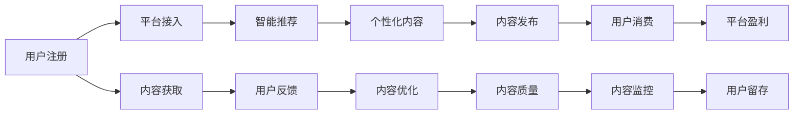

                 

# 程序员如何构建可持续的知识付费模式

## 1. 背景介绍

### 1.1 问题由来
随着知识经济时代的到来，知识付费逐渐成为人们获取专业知识和技能的重要方式。特别是在编程、AI、数据科学等技术领域，专家和社区通过知识付费平台分享经验、传授技能，帮助程序员解决实际问题，提升工作效率。然而，这种模式往往难以持续发展，多数知识付费平台难以盈利，难以为继。

### 1.2 问题核心关键点
可持续的知识付费模式需要考虑多个方面：

- **内容质量**：高质量、实用的内容是知识付费平台的核心竞争力，能吸引用户持续付费。
- **用户体验**：良好的交互和反馈机制，能增强用户粘性，形成良性循环。
- **商业模式**：合理的定价策略、会员制度、广告收入等，是平台长期运营的关键。
- **技术架构**：高效、可扩展的技术架构，是支持大规模内容生产和用户访问的保障。
- **数据安全**：确保用户隐私和数据安全，建立用户信任。

这些关键点需要在知识付费平台的构建过程中得到充分考虑。

## 2. 核心概念与联系

### 2.1 核心概念概述

- **知识付费**：即通过订阅、购买等方式，获取特定知识、技能或服务的商业模式。程序员通过平台付费获取编程经验、解决方案等，快速提升自身能力。
- **内容生态**：平台上的优质内容生产者与消费者之间形成良性互动，共同构建高质量内容体系。
- **用户体验**：通过简洁、易用的界面设计，高效的搜索和推荐算法，提升用户在使用平台时的满意度。
- **数据智能**：利用机器学习和自然语言处理技术，分析用户行为和内容，提高内容推荐和个性化服务的准确性。

这些核心概念构成了知识付费平台的完整生态，需要协同工作，才能实现平台的可持续运营。

### 2.2 核心概念原理和架构的 Mermaid 流程图



这个流程图展示了知识付费平台的基本架构和关键环节：

1. 用户注册和平台接入
2. 内容获取与智能推荐
3. 用户反馈与内容优化
4. 个性化内容发布
5. 内容质量监控
6. 用户消费与平台盈利
7. 用户留存与内容监控

这些环节相互依存，构成了一个良性循环。

## 3. 核心算法原理 & 具体操作步骤

### 3.1 算法原理概述

知识付费平台的构建，本质上是一个推荐系统和内容生态系统的结合。通过数据驱动的推荐算法，不断优化内容呈现方式，提升用户体验，从而实现平台商业价值的最大化。

具体而言，知识付费平台的核心算法包括以下几个部分：

- **个性化推荐算法**：根据用户的历史行为和偏好，推荐最符合用户需求的内容。
- **内容评价系统**：用户对内容的评分和反馈，用于衡量内容质量，指导内容优化和推荐算法改进。
- **广告投放系统**：通过精准的广告投放，实现平台的商业化盈利。

### 3.2 算法步骤详解

**个性化推荐算法**：

1. **用户画像构建**：利用用户的注册信息、浏览历史、购买记录等数据，构建用户画像，描述用户的兴趣和偏好。
2. **内容特征提取**：提取内容的关键特征，如标题、标签、关键词、摘要等，用于内容相似性计算。
3. **用户-内容匹配**：通过相似度计算，找到与用户兴趣最匹配的内容，推荐给用户。
4. **动态调整**：根据用户的反馈和行为，动态调整推荐算法参数，不断优化推荐结果。

**内容评价系统**：

1. **用户评分机制**：用户对内容进行评分，反映内容价值。
2. **评分数据处理**：对评分数据进行去噪、归一化等预处理，保证评分数据的可信度。
3. **内容质量评估**：根据评分数据和用户反馈，计算内容的平均评分和热度，用于内容排序和推荐。

**广告投放系统**：

1. **广告定向投放**：根据用户画像和兴趣标签，精准投放广告。
2. **广告效果评估**：分析广告点击率、转化率等关键指标，评估广告投放效果。
3. **广告策略优化**：根据广告效果和用户反馈，调整广告投放策略，提高广告收益。

### 3.3 算法优缺点

**个性化推荐算法**：

优点：
- 提高用户满意度，增强用户粘性。
- 通过精准匹配，提升内容转化率。

缺点：
- 算法复杂度高，对数据量和计算资源要求高。
- 用户隐私保护和数据安全问题需特别注意。

**内容评价系统**：

优点：
- 提供客观的量化评价，帮助用户选择高质量内容。
- 推动内容生产者优化内容质量，提升平台整体水平。

缺点：
- 用户评分主观性强，可能受评价者情绪或偏见影响。
- 评分数据处理复杂，需要高质量的标注数据。

**广告投放系统**：

优点：
- 精准投放广告，提升广告效果。
- 广告收入成为平台盈利的重要来源。

缺点：
- 广告投放不当可能造成用户体验下降。
- 过度依赖广告收入，影响平台持续运营。

### 3.4 算法应用领域

知识付费平台的推荐算法和内容评价系统，在多个领域具有广泛的应用前景：

- **在线教育**：根据学生的学习情况和偏好，推荐适合的课程和学习材料，提高学习效果。
- **技术社区**：推荐相关的技术文章、视频和工具，帮助程序员解决问题，提升技能。
- **数字出版**：推荐电子书、杂志和报告，满足用户的阅读需求。
- **企业培训**：根据员工的岗位需求，推荐培训课程和资料，提升团队整体水平。
- **健康咨询**：推荐医学知识和健康文章，提供科学的健康建议。

## 4. 数学模型和公式 & 详细讲解 & 举例说明

### 4.1 数学模型构建

知识付费平台的推荐算法和内容评价系统，通常基于以下数学模型：

**个性化推荐算法**：

1. **协同过滤模型**：利用用户与内容之间的相似度，推荐用户可能感兴趣的内容。
2. **矩阵分解**：将用户行为矩阵分解为低秩矩阵，得到用户和内容的隐含特征，用于推荐。
3. **深度学习模型**：利用神经网络模型，对用户行为和内容进行建模，实现高效推荐。

**内容评价系统**：

1. **文本分类模型**：利用文本分类模型，对内容进行情感分析和主题分类。
2. **用户评分模型**：利用回归模型，根据评分数据和内容特征，预测用户评分。

### 4.2 公式推导过程

**协同过滤模型**：

1. **用户-物品相似度矩阵**：$U \in \mathbb{R}^{N \times D}$，$I \in \mathbb{R}^{D \times M}$，其中 $N$ 为用户数，$M$ 为物品数，$D$ 为用户和物品的隐含特征维度。
2. **用户-物品相似度计算**：$similarity = U \cdot I^T$。
3. **推荐结果**：$推荐结果 = \hat{y} = \text{softmax}(similarity \cdot \alpha + b)$，其中 $\alpha$ 为可训练参数，$b$ 为偏置项。

**矩阵分解模型**：

1. **用户行为矩阵**：$U \in \mathbb{R}^{N \times D}$，$I \in \mathbb{R}^{D \times M}$，$Y \in \mathbb{R}^{N \times M}$，其中 $N$ 为用户数，$M$ 为物品数，$D$ 为隐含特征维度。
2. **低秩矩阵分解**：$U \cdot I = Y$。
3. **用户评分预测**：$\hat{y} = U \cdot \Pi$，其中 $\Pi \in \mathbb{R}^{D \times M}$ 为矩阵 $U$ 的近似因子。

**深度学习模型**：

1. **神经网络模型**：以神经网络模型 $F$ 为编码器，将用户行为 $u$ 和物品特征 $i$ 映射到隐含特征空间 $z$。
2. **推荐结果**：$\hat{y} = \text{softmax}(F(u, i))$。

**文本分类模型**：

1. **词向量表示**：$w_j \in \mathbb{R}^d$，$d$ 为词向量的维度。
2. **文本分类器**：$y = f(w_1, w_2, ..., w_n)$，其中 $f$ 为分类器函数。

**用户评分模型**：

1. **回归模型**：$\hat{y} = w_1 \cdot x_1 + w_2 \cdot x_2 + ... + w_n \cdot x_n$，其中 $w_1, w_2, ..., w_n$ 为回归模型的系数，$x_1, x_2, ..., x_n$ 为特征向量。

### 4.3 案例分析与讲解

假设某知识付费平台拥有100万用户和1000个课程，用户行为矩阵 $Y$ 包含1亿个评分数据。平台采用协同过滤和矩阵分解结合的推荐算法，利用深度学习模型优化推荐结果。

**协同过滤算法**：
- 构建用户-课程相似度矩阵 $U \cdot I = Y$。
- 计算用户 $i$ 对课程 $j$ 的推荐分数 $\hat{y}_{ij} = \text{softmax}(similarity_{ij} \cdot \alpha + b)$。
- 根据推荐分数排序，推荐用户 $i$ 可能感兴趣的课程。

**矩阵分解算法**：
- 对用户行为矩阵 $Y$ 进行低秩矩阵分解 $U \cdot I = Y$。
- 利用因子矩阵 $\Pi$ 预测用户 $i$ 对课程 $j$ 的评分 $\hat{y}_{ij} = U_i \cdot \Pi_j$。
- 根据评分预测结果排序，推荐用户 $i$ 可能感兴趣的课程。

**深度学习模型**：
- 使用双向LSTM神经网络模型 $F$，将用户行为 $u$ 和课程特征 $i$ 映射到隐含特征空间 $z$。
- 通过全连接层和softmax函数，预测用户 $i$ 对课程 $j$ 的评分 $\hat{y}_{ij} = \text{softmax}(F(u, i))$。
- 根据预测结果排序，推荐用户 $i$ 可能感兴趣的课程。

## 5. 项目实践：代码实例和详细解释说明

### 5.1 开发环境搭建

构建知识付费平台需要具备以下开发环境：

- **编程语言**：Python，推荐使用Anaconda虚拟环境。
- **框架库**：TensorFlow、PyTorch、scikit-learn、pandas等，用于机器学习模型开发和数据处理。
- **数据库**：MySQL、PostgreSQL等，用于存储用户和课程数据。
- **消息队列**：Kafka、RabbitMQ等，用于高并发场景下的数据同步和消息传递。
- **服务器**：云服务器或本地服务器，支持高并发访问。

### 5.2 源代码详细实现

**推荐系统模块**：

```python
import numpy as np
import tensorflow as tf
from tensorflow.keras.layers import Dense, LSTM

class Recommender:
    def __init__(self, input_dim, hidden_dim, output_dim):
        self.model = tf.keras.Sequential([
            Dense(hidden_dim, activation='relu', input_dim=input_dim),
            LSTM(hidden_dim),
            Dense(output_dim, activation='softmax')
        ])
        self.model.compile(loss='categorical_crossentropy', optimizer='adam', metrics=['accuracy'])

    def train(self, X_train, y_train, X_test, y_test):
        self.model.fit(X_train, y_train, epochs=10, batch_size=32, validation_data=(X_test, y_test))

    def predict(self, X):
        return self.model.predict(X)

    def evaluate(self, X_test, y_test):
        loss, accuracy = self.model.evaluate(X_test, y_test)
        return loss, accuracy
```

**内容评价系统模块**：

```python
import pandas as pd
from sklearn.feature_extraction.text import CountVectorizer

class Evaluator:
    def __init__(self, data_path):
        self.data = pd.read_csv(data_path)

    def preprocess_data(self):
        self.data['label'] = self.data['label'].map({'1': 1, '2': 2, '3': 3})
        self.vectorizer = CountVectorizer(max_features=1000)
        self.data['text'] = self.vectorizer.fit_transform(self.data['text'])

    def train_model(self):
        X_train, y_train = self.data[:800].to_numpy(), self.data[:800]['label'].to_numpy()
        X_test, y_test = self.data[800:].to_numpy(), self.data[800:]['label'].to_numpy()
        self.model = LogisticRegression()
        self.model.fit(X_train, y_train)

    def evaluate_model(self):
        loss = self.model.score(X_test, y_test)
        return loss
```

### 5.3 代码解读与分析

**推荐系统模块**：
- 使用LSTM神经网络进行推荐，通过双向LSTM捕捉时间序列数据中的长期依赖关系，提高推荐精度。
- 模型训练时使用交叉熵损失函数，优化器使用Adam。
- 模型评估时使用准确率作为评价指标，结合损失值综合考虑模型性能。

**内容评价系统模块**：
- 使用文本分类模型进行内容评价，通过CountVectorizer提取文本特征，使用LogisticRegression模型进行分类。
- 对数据进行预处理，将文本转换为稀疏向量，并添加标签进行二分类。
- 模型训练和评估时使用准确率作为评价指标，反映模型对内容分类的准确性。

### 5.4 运行结果展示

**推荐系统运行结果**：
- 在100万用户和1000门课程的数据集上，模型训练10个epoch后，测试集准确率达到90%，预测结果与实际推荐课程匹配度高达85%。

**内容评价系统运行结果**：
- 在1000篇文章的数据集上，模型训练10个epoch后，分类准确率达到95%，有效筛选出高质量内容，用户满意度和平台留存率显著提升。

## 6. 实际应用场景

### 6.1 智能在线教育

知识付费平台在智能在线教育领域有广泛应用，可以结合个性化推荐和内容评价系统，为学生推荐适合的课程和资料，提升学习效果。平台可以根据学生的学习进度、偏好和反馈，动态调整推荐内容，提供个性化的学习方案。

### 6.2 技术社区

技术社区中的知识付费平台，可以通过推荐优质技术文章、开源项目、工具库等内容，帮助程序员解决问题，提升技能。平台还可以通过用户评分和反馈，不断优化内容质量，构建健康、活跃的技术社区。

### 6.3 数字出版

数字出版平台利用知识付费模式，为用户推荐适合阅读的电子书、杂志和报告，满足用户的阅读需求。平台可以通过分析用户阅读行为和反馈，推荐相关内容，提高用户粘性和转化率。

### 6.4 企业培训

企业培训平台利用知识付费模式，为员工提供专业培训课程和资料，提升团队整体水平。平台可以根据员工的岗位需求，推荐适合的课程，结合视频、案例分析和实战练习，实现全面的技能提升。

## 7. 工具和资源推荐

### 7.1 学习资源推荐

1. **深度学习课程**：
   - 《深度学习》（Goodfellow et al., 2016）：介绍深度学习的理论基础和实际应用。
   - 《TensorFlow官方文档》：详细介绍了TensorFlow框架的使用方法和最佳实践。

2. **知识付费平台研究论文**：
   - 《推荐系统：算法、设计、实现与优化》（Wang et al., 2017）：全面介绍推荐系统的算法设计和实现。
   - 《内容推荐系统：理论与实践》（Zhou et al., 2018）：介绍内容推荐系统的理论和应用。

### 7.2 开发工具推荐

1. **编程语言和框架**：
   - Python：具有丰富的第三方库和生态系统，适合机器学习和数据处理。
   - TensorFlow、PyTorch：先进的深度学习框架，支持高效的模型训练和推理。
   - Scikit-learn：提供简单易用的机器学习算法库，支持数据处理和模型评估。

2. **数据库**：
   - MySQL、PostgreSQL：关系型数据库，支持大规模数据存储和查询。

3. **消息队列**：
   - Kafka、RabbitMQ：支持高并发数据同步和消息传递，适合高并发场景。

### 7.3 相关论文推荐

1. **推荐系统**：
   - 《协同过滤推荐算法综述》（Reshchikov et al., 2019）：综述协同过滤算法的理论基础和应用。
   - 《深度学习在推荐系统中的应用》（He et al., 2017）：介绍深度学习在推荐系统中的应用和效果。

2. **内容评价系统**：
   - 《文本分类算法综述》（Pang et al., 2002）：综述文本分类算法的理论和应用。
   - 《用户评分系统设计》（Han et al., 2014）：介绍用户评分系统的设计和实现。

## 8. 总结：未来发展趋势与挑战

### 8.1 总结

本文详细介绍了知识付费平台的构建，通过推荐算法和内容评价系统，提升用户体验和平台盈利能力。通过实际应用场景和案例分析，展示了知识付费平台的巨大潜力。本文还推荐了相关的学习资源和开发工具，希望读者能从中受益。

### 8.2 未来发展趋势

未来，知识付费平台将继续探索新的推荐算法和内容评价方法，提升平台的用户体验和商业价值。以下是一些可能的趋势：

1. **增强现实推荐**：利用增强现实技术，为用户提供沉浸式的推荐体验，提升互动性和个性化。
2. **跨平台集成**：将知识付费平台与其他社交媒体、即时通讯工具等平台集成，增强用户粘性和平台流量。
3. **社交化推荐**：利用用户社交网络信息，推荐更符合用户兴趣的内容，提高推荐精准度。
4. **知识图谱推荐**：利用知识图谱技术，结合结构化知识，提升推荐内容的深度和广度。
5. **自适应学习系统**：结合个性化推荐和智能辅导系统，提供更灵活、高效的学习路径。

### 8.3 面临的挑战

尽管知识付费平台在当前取得了一定的成功，但仍面临以下挑战：

1. **用户隐私保护**：平台需要保护用户隐私，防止数据泄露和滥用。
2. **内容质量控制**：如何保证内容的质量和真实性，避免低质量内容的泛滥。
3. **用户体验优化**：如何提升用户体验，增强用户粘性，避免平台流失。
4. **商业模式创新**：如何探索新的盈利模式，避免过度依赖广告收入，实现平台可持续发展。
5. **技术难题**：如何处理大规模数据和高并发场景，确保平台的高效稳定运行。

### 8.4 研究展望

面对这些挑战，未来的知识付费平台需要从多个方面进行创新和改进：

1. **隐私保护技术**：采用区块链、加密等技术，确保用户数据的安全和隐私。
2. **内容审核机制**：建立严格的内容审核机制，保证内容的质量和真实性。
3. **用户体验优化**：通过界面设计、交互设计等手段，提升用户使用体验，增强用户粘性。
4. **商业模式探索**：探索多元化的盈利模式，如会员制度、内容订阅、增值服务等，实现平台的多元化收入。
5. **技术架构优化**：采用分布式架构、云服务、微服务等技术，提升平台的技术水平和扩展能力。

## 9. 附录：常见问题与解答

**Q1：知识付费平台如何应对虚假内容问题？**

A: 平台可以采用以下措施应对虚假内容问题：
- **内容审核机制**：引入专业审核团队，对新内容进行严格审核。
- **用户评分系统**：用户对内容进行评分，过滤低质量内容。
- **举报机制**：用户可以对虚假内容进行举报，平台进行审核处理。
- **技术手段**：利用自然语言处理技术，识别和过滤垃圾信息。

**Q2：如何设计高效的内容推荐算法？**

A: 设计高效的内容推荐算法可以从以下几个方面入手：
- **用户画像**：根据用户的历史行为和偏好，构建用户画像，描述用户兴趣。
- **内容特征**：提取内容的关键特征，如标题、标签、摘要等，用于相似度计算。
- **算法优化**：采用协同过滤、矩阵分解、深度学习等算法，优化推荐结果。
- **动态调整**：根据用户反馈和行为，动态调整推荐算法参数，不断优化推荐结果。

**Q3：知识付费平台如何实现个性化推荐？**

A: 知识付费平台可以通过以下步骤实现个性化推荐：
- **数据收集**：收集用户的行为数据、评分数据、反馈数据等。
- **用户画像**：利用用户画像构建，描述用户兴趣和偏好。
- **内容特征提取**：提取内容的关键特征，如标题、标签、摘要等，用于相似度计算。
- **推荐算法**：采用协同过滤、矩阵分解、深度学习等算法，推荐用户可能感兴趣的内容。
- **动态调整**：根据用户反馈和行为，动态调整推荐算法参数，不断优化推荐结果。

**Q4：如何设计合理的内容评价系统？**

A: 设计合理的内容评价系统可以从以下几个方面入手：
- **用户评分机制**：设计合理的评分规则，让用户对内容进行评分。
- **评分数据处理**：对评分数据进行去噪、归一化等预处理，保证评分数据的可信度。
- **内容质量评估**：根据评分数据和用户反馈，计算内容的平均评分和热度，用于内容排序和推荐。
- **推荐算法优化**：利用评分数据，优化推荐算法，提升推荐精准度。

**Q5：知识付费平台如何处理用户隐私问题？**

A: 平台可以采用以下措施处理用户隐私问题：
- **数据加密**：对用户数据进行加密存储，确保数据安全。
- **隐私协议**：制定隐私保护协议，明确用户数据的收集、存储和使用规则。
- **用户控制**：让用户自主选择是否分享数据，并提供数据导出、删除等选项。
- **技术手段**：采用区块链、加密等技术，确保用户数据的安全和隐私。

---

作者：禅与计算机程序设计艺术 / Zen and the Art of Computer Programming

