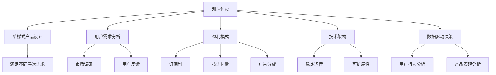

                 

# 程序员如何设计阶梯式知识付费产品

> 关键词：知识付费, 阶梯式产品设计, 用户需求分析, 盈利模式, 技术架构, 数据驱动决策

## 1. 背景介绍

### 1.1 问题由来

随着互联网和移动互联网的发展，知识付费成为了一个热门领域。无论是知识分享平台，还是特定领域的教育机构，都在尝试通过知识付费来获取收益。然而，如何设计一个有效的知识付费产品，吸引用户，提升转化率，并实现盈利，是许多从业者面临的挑战。

### 1.2 问题核心关键点

知识付费产品的设计，本质上是基于用户需求和心理的商业模式设计。其核心关键点包括：
- 用户需求的分析：准确识别用户需求，确保产品功能与用户预期相符。
- 产品结构的规划：通过阶梯式产品设计，满足不同用户的需求层次。
- 盈利模式的确定：找到合适的盈利方式，确保平台的可持续性。
- 技术架构的实现：搭建高效、稳定、安全的技术架构，支撑业务的快速扩展。
- 数据驱动的决策：通过数据分析，持续优化产品，提升用户体验和满意度。

## 2. 核心概念与联系

### 2.1 核心概念概述

为更好地理解如何设计阶梯式知识付费产品，本节将介绍几个密切相关的核心概念：

- 知识付费：通过互联网平台提供知识内容，以收费方式向用户提供服务，实现知识变现。
- 阶梯式产品设计：根据用户不同层次的需求，设计多层次的产品功能和服务，满足用户的多样化需求。
- 用户需求分析：通过市场调研和用户反馈，分析用户需求，指导产品的设计与迭代。
- 盈利模式：选择合理的盈利方式，如订阅制、按需付费、广告分成等，确保平台收益。
- 技术架构：构建稳定、可扩展的技术架构，支撑产品的稳定运行和业务的快速扩展。
- 数据驱动决策：利用数据分析工具，对用户行为、产品表现等进行量化分析，指导产品优化和商业决策。

这些核心概念之间的逻辑关系可以通过以下Mermaid流程图来展示：



这个流程图展示了这个系统的核心概念及其之间的关系：

1. 知识付费是整个系统的基础。
2. 阶梯式产品设计根据用户不同层次的需求，提供多层次的产品功能。
3. 用户需求分析通过市场调研和用户反馈，指导产品设计。
4. 盈利模式确定合适的盈利方式，确保平台的可持续性。
5. 技术架构构建高效、稳定、安全的技术架构，支撑业务扩展。
6. 数据驱动决策利用数据分析，优化产品，提升用户满意度。

这些概念共同构成了知识付费产品的设计框架，帮助设计出既满足用户需求，又具有竞争力的产品。

## 3. 核心算法原理 & 具体操作步骤

### 3.1 算法原理概述

知识付费产品的设计，本质上是一个多目标优化问题。其核心思想是：根据用户需求，设计多个层次的产品功能，通过阶梯式定价和优惠策略，满足不同层次的用户需求，同时实现平台的盈利。

形式化地，假设知识付费平台提供 $n$ 种知识产品，用户需求层次分别为 $k$ 层，平台的目标是最大化收益 $R$，同时满足用户需求层次 $D$：

$$
\max_{x} R(x) = \sum_{i=1}^n p_i \cdot x_i \cdot \lambda_i
$$

其中 $p_i$ 为第 $i$ 种产品的单价，$x_i$ 为第 $i$ 种产品的销售量，$\lambda_i$ 为第 $i$ 种产品的市场份额。

用户需求层次 $D$ 可以通过用户调研和反馈得到。平台的目标是通过定价策略和优惠策略，最大化收益 $R$，同时满足用户不同层次的需求。

### 3.2 算法步骤详解

基于知识付费产品设计的多目标优化问题，其核心算法步骤包括以下几个关键环节：

**Step 1: 用户需求分析**

- 市场调研：通过问卷调查、用户访谈、竞品分析等方式，收集用户需求信息。
- 数据建模：利用数据分析工具，构建用户需求模型，识别不同层次的需求。
- 反馈机制：建立用户反馈渠道，持续收集用户反馈，更新需求模型。

**Step 2: 产品结构规划**

- 功能设计：根据用户需求模型，设计多层次的产品功能，如基础学习、进阶培训、专家指导等。
- 阶梯定价：根据用户需求层次，设计阶梯式定价策略，如基础套餐、进阶套餐、专家套餐等。
- 优惠策略：设计多样化的优惠策略，如限时折扣、推荐奖励、免费试用等，吸引用户订阅。

**Step 3: 盈利模式选择**

- 订阅制：用户支付固定费用，享受指定期限内的所有产品和服务。
- 按需付费：用户按需购买产品，支付相应费用。
- 广告分成：平台通过展示广告，获取一定比例的广告分成。
- 会员制：用户成为会员，享受会员专属优惠。

**Step 4: 技术架构搭建**

- 后端架构：设计高效的后端架构，支撑用户管理、产品发布、订单处理等功能。
- 前端架构：设计用户友好的前端界面，提供便捷的产品浏览、订阅、支付等操作。
- 数据架构：设计高效的数据存储和处理架构，支撑数据分析和用户行为跟踪。

**Step 5: 数据驱动决策**

- 用户行为分析：利用数据分析工具，监测用户行为，识别用户流失原因。
- 产品表现分析：评估产品表现，识别用户喜欢的内容类型和价格策略。
- 策略优化：根据分析结果，优化定价策略、推荐算法等，提升用户体验和满意度。

以上是知识付费产品设计的核心算法步骤，通过系统化的方法论，帮助设计出符合用户需求的产品，实现平台的盈利目标。

### 3.3 算法优缺点

基于知识付费产品设计的多目标优化算法，具有以下优点：
1. 系统化设计：通过多目标优化算法，系统化地设计产品功能和定价策略，确保产品满足用户需求。
2. 用户层次明确：通过用户需求分析，明确不同层次用户的需求，设计相应的产品功能。
3. 灵活定价：通过阶梯式定价策略，灵活应对不同层次用户的需求，提升用户转化率。
4. 数据驱动决策：通过数据分析，持续优化产品，提升用户满意度和平台收益。

同时，该算法也存在一定的局限性：
1. 成本高昂：用户需求分析、市场调研等环节成本较高，需要持续投入资源。
2. 复杂度高：多目标优化问题复杂，需要较强的数据分析和决策能力。
3. 策略调整难度大：一旦产品设计完成，调整策略需要耗费大量时间和成本。
4. 数据依赖性强：数据质量对算法效果有较大影响，数据不完整或不准确会影响分析结果。

尽管存在这些局限性，但就目前而言，基于多目标优化的知识付费产品设计方法仍是最主流范式。未来相关研究的重点在于如何进一步降低成本，提高算法效率，同时兼顾用户需求和平台收益。

### 3.4 算法应用领域

知识付费产品设计的算法原理和操作步骤，在多个领域都有广泛的应用：

- 在线教育：根据学生不同的学习层次，设计多层次的教育产品，满足不同学生的需求。
- 专业培训：根据学员的不同职业背景，设计针对性的培训课程，提高学员的职业技能。
- 企业内训：根据员工不同的岗位需求，设计多层次的内训课程，提升员工的专业能力。
- 技术支持：根据用户的技术水平，设计不同级别的技术支持服务，提供个性化的技术支持。

除了上述这些经典应用外，知识付费产品设计的算法还适用于更多场景中，如心理咨询、艺术培训、运动指导等，为各类知识服务提供系统的解决方案。

## 4. 数学模型和公式 & 详细讲解 & 举例说明

### 4.1 数学模型构建

知识付费产品设计的多目标优化问题，可以构建如下数学模型：

假设平台提供 $n$ 种知识产品，用户需求层次分别为 $k$ 层，平台的目标是最大化收益 $R$，同时满足用户需求层次 $D$。

定义：
- $p_i$ 为第 $i$ 种产品的单价。
- $x_i$ 为第 $i$ 种产品的销售量。
- $\lambda_i$ 为第 $i$ 种产品的市场份额。

则收益函数 $R(x)$ 可以表示为：

$$
R(x) = \sum_{i=1}^n p_i \cdot x_i \cdot \lambda_i
$$

其中 $\lambda_i$ 可以通过用户调研和反馈得到。

### 4.2 公式推导过程

为了最大化收益 $R(x)$，需要求解以下最优化问题：

$$
\max_{x} R(x) = \sum_{i=1}^n p_i \cdot x_i \cdot \lambda_i
$$

在实际应用中，通常使用多目标优化算法，如Pareto最优算法、遗传算法等，寻找最优的定价策略和销售量。

以Pareto最优算法为例，求解步骤包括：

1. 构建目标函数向量：
$$
f(x) = [R(x), C(x)]
$$

其中 $C(x)$ 为成本函数，表示平台的运营成本。

2. 生成初始解集：通过随机生成一些解，如 $x_0$、$x_1$、$x_2$ 等。

3. 迭代求解：通过迭代优化算法，如Pareto优化算法，从初始解集中逐步优化解集，直到找到最优解。

具体步骤如下：

1. 对于当前解集中的每个解 $x_i$，计算其对收益 $R(x)$ 和成本 $C(x)$ 的影响。
2. 对于每个解 $x_i$，找到与其Pareto优势的另一个解 $x_j$，计算两者之间的距离。
3. 根据距离大小，选择最优的解，更新解集。
4. 重复步骤1-3，直到解集收敛或达到预设迭代次数。

### 4.3 案例分析与讲解

以在线教育平台为例，分析知识付费产品设计的算法步骤。

1. 用户需求分析：通过问卷调查，发现用户需求层次分为基础、进阶、专家三个层次。
2. 产品结构规划：根据需求层次，设计基础课程、进阶课程、专家课程。
3. 阶梯定价：基础课程价格为500元/年，进阶课程价格为1000元/年，专家课程价格为2000元/年。
4. 优惠策略：引入推荐奖励，老用户推荐新用户订阅，获得50元优惠券。
5. 技术架构搭建：搭建基于Spring Boot的后端架构，提供RESTful API，支撑用户管理、订单处理等功能。
6. 数据驱动决策：利用Google Analytics监测用户行为，优化推荐算法，提升用户满意度。

通过以上案例，可以看到知识付费产品设计的多目标优化算法，如何帮助平台设计出符合用户需求的产品，实现盈利目标。

## 5. 项目实践：代码实例和详细解释说明

### 5.1 开发环境搭建

在进行知识付费产品开发前，我们需要准备好开发环境。以下是使用Python进行Flask开发的环境配置流程：

1. 安装Anaconda：从官网下载并安装Anaconda，用于创建独立的Python环境。

2. 创建并激活虚拟环境：
```bash
conda create -n flask-env python=3.8 
conda activate flask-env
```

3. 安装Flask：根据Flask版本，从官网获取对应的安装命令。例如：
```bash
pip install Flask
```

4. 安装Flask扩展库：
```bash
pip install Flask-RESTful Flask-SQLAlchemy Flask-WTF
```

5. 安装数据库：
```bash
pip install mysql-connector-python
```

完成上述步骤后，即可在`flask-env`环境中开始开发。

### 5.2 源代码详细实现

这里我们以在线教育平台为例，给出使用Flask框架开发知识付费产品的PyTorch代码实现。

首先，定义SQL数据库模型：

```python
from flask_sqlalchemy import SQLAlchemy
from flask_marshmallow import Marshmallow

db = SQLAlchemy(app)
ma = Marshmallow(app)

class User(db.Model):
    id = db.Column(db.Integer, primary_key=True)
    name = db.Column(db.String(100), nullable=False)
    email = db.Column(db.String(120), unique=True, nullable=False)

class Course(db.Model):
    id = db.Column(db.Integer, primary_key=True)
    name = db.Column(db.String(100), nullable=False)
    price = db.Column(db.Float, nullable=False)
    category = db.Column(db.String(50), nullable=False)

class UserCourse(db.Model):
    id = db.Column(db.Integer, primary_key=True)
    user_id = db.Column(db.Integer, db.ForeignKey('user.id'))
    course_id = db.Column(db.Integer, db.ForeignKey('course.id'))
    start_date = db.Column(db.DateTime, nullable=False)
    end_date = db.Column(db.DateTime, nullable=False)
```

然后，定义API接口：

```python
from flask import Flask, request, jsonify
from flask_restful import Resource, Api
from marshmallow import Schema, fields

app = Flask(__name__)
api = Api(app)

class CourseSchema(ma.Schema):
    id = fields.Integer()
    name = fields.String(required=True)
    price = fields.Float(required=True)
    category = fields.String(required=True)

course_schema = CourseSchema()
courses_schema = CourseSchema(many=True)

@app.route('/courses', methods=['GET'])
def get_courses():
    courses = Course.query.all()
    result = courses_schema.dump(courses)
    return jsonify(result)

@app.route('/courses/<int:id>', methods=['GET'])
def get_course(id):
    course = Course.query.get(id)
    return jsonify(course_schema.dump(course))

@app.route('/courses', methods=['POST'])
def create_course():
    course = CourseSchema.load(request.json)
    db.session.add(course)
    db.session.commit()
    return jsonify(course_schema.dump(course))

@app.route('/courses/<int:id>', methods=['PUT'])
def update_course(id):
    course = Course.query.get(id)
    course_schema.load(request.json, instance=course, partial=True)
    db.session.commit()
    return jsonify(course_schema.dump(course))

@app.route('/courses/<int:id>', methods=['DELETE'])
def delete_course(id):
    course = Course.query.get(id)
    db.session.delete(course)
    db.session.commit()
    return jsonify(course_schema.dump(course))
```

最后，启动Flask应用：

```python
if __name__ == '__main__':
    app.run(debug=True)
```

### 5.3 代码解读与分析

这里我们详细解读一下关键代码的实现细节：

**SQL数据库模型**：
- `User` 和 `Course` 类分别表示用户和课程。通过数据库表定义，保存用户和课程的基本信息。
- `UserCourse` 类表示用户与课程的订阅关系，记录订阅开始和结束日期。

**API接口**：
- `CourseSchema` 和 `courses_schema` 用于序列化课程数据，支持JSON格式的输出。
- `get_courses`、`get_course`、`create_course`、`update_course`、`delete_course` 分别处理课程的列表查询、详情查询、创建、更新和删除操作。

**Flask应用**：
- `Flask` 框架用于搭建Web应用。
- `Flask-RESTful` 扩展库用于构建RESTful API，方便处理HTTP请求。
- `Flask-SQLAlchemy` 扩展库用于集成SQL数据库，支持CRUD操作。
- `Flask-WTF` 扩展库用于处理表单数据，方便用户提交课程信息。

**代码解读与分析**：
- 代码中的`@app.route` 装饰器定义了API接口的路径和HTTP方法。
- 使用 `request` 对象获取HTTP请求中的JSON数据，通过 `CourseSchema` 进行序列化和反序列化，支持JSON格式的输入和输出。
- 使用 `db.session` 进行数据库操作，支持CRUD等常见操作。
- 使用 `jsonify` 函数将Python对象转换为JSON格式，方便HTTP响应。

可以看到，通过Flask框架搭建的在线教育平台API，实现了用户管理和课程管理的核心功能。开发者可以通过简单的代码修改，实现更多的业务逻辑。

## 6. 实际应用场景

### 6.1 智能客服系统

基于知识付费产品的设计思路，可以构建智能客服系统。传统客服往往需要配备大量人力，高峰期响应缓慢，且一致性和专业性难以保证。而使用知识付费产品设计的智能客服系统，可以通过订阅付费获取优质的客服服务，提升服务质量。

具体而言，可以设计不同的客服套餐，如基础客服、进阶客服、专家客服等，满足不同用户的需求。用户可以通过订阅付费，获得定期的客服服务。同时，平台可以通过数据分析，优化客服流程，提升用户体验。

### 6.2 金融理财服务

金融理财服务需要用户具备一定的金融知识和投资经验，才能进行有效的理财。平台可以通过知识付费产品，提供不同层次的理财课程，帮助用户提升理财能力。

平台可以根据用户的不同层次需求，设计基础理财、进阶理财、专家理财等课程。用户可以通过订阅付费，获得不同层次的理财知识和投资策略。同时，平台可以结合市场动态，提供实时的理财建议和投资建议，帮助用户实现财富增值。

### 6.3 健康管理平台

健康管理平台需要提供专业的健康知识和健康管理工具，帮助用户实现健康目标。平台可以通过知识付费产品，提供不同层次的健康管理课程，满足用户的多样化需求。

平台可以根据用户的不同层次需求，设计基础健康管理、进阶健康管理、专家健康管理等课程。用户可以通过订阅付费，获得不同层次的健康知识和健康管理工具。同时，平台可以结合用户的数据分析，提供个性化的健康建议和健康计划，帮助用户实现健康目标。

### 6.4 未来应用展望

随着知识付费产品设计的算法和技术的不断进步，未来的应用场景将更加广泛：

1. 智能学习系统：根据用户的学习水平，设计不同层次的学习课程，提供个性化的学习路径和反馈。
2. 智能咨询平台：结合知识付费和AI技术，提供多样化的咨询服务，如法律咨询、心理咨询、医疗咨询等。
3. 智能招聘平台：根据求职者的专业背景和职业目标，提供不同层次的职业培训课程，提升求职者的职业技能。
4. 智能教育平台：结合知识付费和AI技术，提供多样化的教育课程，如编程教育、音乐教育、艺术教育等。

这些应用场景将进一步拓展知识付费产品设计的算法和技术，为各行各业带来全新的数字化转型升级。

## 7. 工具和资源推荐

### 7.1 学习资源推荐

为了帮助开发者系统掌握知识付费产品的设计理论基础和实践技巧，这里推荐一些优质的学习资源：

1. 《Web开发实战教程》系列博文：由Web开发专家撰写，深入浅出地介绍了Web开发的各种技术栈和最佳实践。

2. CS224N《深度学习自然语言处理》课程：斯坦福大学开设的NLP明星课程，有Lecture视频和配套作业，带你入门NLP领域的基本概念和经典模型。

3. 《深度学习入门》书籍：斯坦福大学深度学习课程讲义，系统介绍了深度学习的基础理论和算法，适合入门学习。

4. Kaggle：世界顶级的机器学习和数据科学竞赛平台，提供大量的数据集和竞赛项目，帮助你锻炼数据处理和模型训练技能。

5. Coursera：世界顶级的在线教育平台，提供各类优质的课程，包括机器学习、深度学习、数据科学等。

通过对这些资源的学习实践，相信你一定能够快速掌握知识付费产品设计的精髓，并用于解决实际的NLP问题。

### 7.2 开发工具推荐

高效的开发离不开优秀的工具支持。以下是几款用于知识付费产品开发的常用工具：

1. Flask：基于Python的轻量级Web框架，适合快速迭代开发。

2. Django：全功能的Web框架，适合大型应用开发，提供了丰富的功能扩展。

3. SQLAlchemy：Python的SQL工具包，支持ORM、数据库迁移等功能，方便数据库操作。

4. MySQL：高可靠性的关系型数据库，适合存储结构化数据，支持高并发读写。

5. Redis：高性能的内存数据库，适合缓存和数据持久化，支持多种数据结构。

6. Elasticsearch：高性能的搜索和分析引擎，适合存储和检索非结构化数据，支持复杂查询和聚合。

合理利用这些工具，可以显著提升知识付费产品开发的效率，加快创新迭代的步伐。

### 7.3 相关论文推荐

知识付费产品设计的相关技术源于学界的持续研究。以下是几篇奠基性的相关论文，推荐阅读：

1. "Multi-Objective Optimization in Knowledge Graphs"（知识图谱的多目标优化）：提出了多目标优化算法在知识图谱中的应用，解决了知识图谱中的多目标优化问题。

2. "A Survey on Multi-Objective Optimization"（多目标优化综述）：综述了多目标优化的各种算法和应用，为知识付费产品设计提供了理论基础。

3. "An Empirical Study on Multi-Objective Optimization in Knowledge Graphs"（知识图谱多目标优化实验）：通过实验分析了多目标优化算法在知识图谱中的应用效果，为知识付费产品设计提供了实验数据。

4. "Adaptive Multi-Objective Optimization in Knowledge Graphs"（知识图谱自适应多目标优化）：提出了一种自适应的多目标优化算法，在知识图谱中取得了较好的效果。

5. "A Multi-Objective Optimization Framework for Recommendation Systems"（推荐系统的多目标优化框架）：提出了多目标优化框架在推荐系统中的应用，解决了推荐系统中的多目标优化问题。

这些论文代表了大模型微调技术的最新进展，通过学习这些前沿成果，可以帮助研究者把握学科前进方向，激发更多的创新灵感。

## 8. 总结：未来发展趋势与挑战

### 8.1 总结

本文对知识付费产品的设计进行了全面系统的介绍。首先阐述了知识付费产品的背景和意义，明确了产品设计的多目标优化目标。其次，从原理到实践，详细讲解了多目标优化的算法步骤，给出了知识付费产品开发的完整代码实例。同时，本文还广泛探讨了知识付费产品设计在多个领域的应用前景，展示了产品的广泛应用潜力。此外，本文精选了知识付费产品的各类学习资源，力求为开发者提供全方位的技术指引。

通过本文的系统梳理，可以看到，知识付费产品设计的多目标优化方法，是实现用户需求与平台收益双赢的重要手段。其算法步骤和设计原则，可以帮助设计出满足用户需求、实现盈利的知识付费产品。

### 8.2 未来发展趋势

展望未来，知识付费产品设计的多目标优化技术将呈现以下几个发展趋势：

1. 数据驱动决策：利用大数据和人工智能技术，持续优化产品设计，提升用户体验和满意度。

2. 个性化推荐：通过用户行为数据分析，提供个性化推荐，提升用户粘性和转化率。

3. 多目标优化：结合不同的盈利目标，如用户收益、平台收益等，实现多目标优化，提升整体效益。

4. 实时计算：利用流计算和大数据技术，实现实时数据处理，提升产品反应速度。

5. 平台融合：将知识付费产品与其他服务平台融合，提供一站式的知识服务，提升用户价值。

这些趋势将进一步提升知识付费产品的智能化水平，带来更好的用户体验和平台收益。

### 8.3 面临的挑战

尽管知识付费产品设计的多目标优化技术已经取得了瞩目成就，但在迈向更加智能化、普适化应用的过程中，它仍面临着诸多挑战：

1. 数据质量问题：数据的准确性和完整性直接影响多目标优化算法的精度，数据质量不高的场景需要进行数据清洗和预处理。

2. 模型复杂性：多目标优化算法通常较为复杂，实现过程中需要深入理解算法原理，同时需要进行大量的实验和调参。

3. 平台成本问题：知识付费产品设计的算法和技术需要持续投入资源，平台需要平衡成本与收益。

4. 用户行为预测：如何准确预测用户行为，设计合理的产品策略，是一个长期且复杂的问题。

5. 系统稳定性：随着用户和业务量的增长，系统需要具备高可靠性和高稳定性，这对技术架构和运维能力提出了更高的要求。

尽管存在这些挑战，但通过不断探索和优化，知识付费产品设计的算法和架构将逐步成熟，为各行各业带来更加智能和高效的服务。

### 8.4 研究展望

面对知识付费产品设计面临的挑战，未来的研究需要在以下几个方面寻求新的突破：

1. 大数据与AI的融合：将大数据分析和人工智能技术深度融合，提升数据驱动决策的准确性和实时性。

2. 实时计算技术：结合流计算和分布式计算技术，实现实时数据处理和实时决策，提升产品反应速度。

3. 多目标优化算法：研究更加高效的多目标优化算法，在保证算法精度的同时，降低算法复杂度和计算成本。

4. 平台融合策略：将知识付费产品与其他服务平台融合，提供一站式的知识服务，提升用户价值。

5. 用户行为预测模型：研究更加准确的预测模型，提升用户行为预测的准确性，优化产品策略。

这些研究方向将引领知识付费产品设计的算法和架构进入新的发展阶段，为知识付费产品设计带来更多的创新和突破。

## 9. 附录：常见问题与解答

**Q1：知识付费产品如何确保用户需求满足？**

A: 知识付费产品通过用户调研和反馈，了解用户需求。通过构建多层次的产品功能和定价策略，满足不同层次的用户需求。同时，通过数据分析，持续优化产品，提升用户满意度和平台收益。

**Q2：知识付费产品如何确保平台收益？**

A: 知识付费产品通过订阅制、按需付费、广告分成等盈利模式，确保平台收益。通过多目标优化算法，设计合理的定价策略和销售量，提升用户转化率和平台收益。

**Q3：知识付费产品如何确保用户体验？**

A: 知识付费产品通过数据驱动决策，持续优化产品设计，提升用户体验。通过个性化推荐和用户行为分析，提供更加精准和个性化的服务，提升用户粘性和满意度。

**Q4：知识付费产品如何确保系统稳定性？**

A: 知识付费产品通过构建高效的技术架构，提升系统稳定性和可靠性。通过实时监控和异常告警，及时发现和解决问题，确保系统运行稳定。

**Q5：知识付费产品如何确保数据安全？**

A: 知识付费产品通过加密存储和传输数据，保障用户隐私和数据安全。通过访问控制和权限管理，限制数据访问权限，防止数据泄露和滥用。

通过以上附录问题的解答，可以看到知识付费产品设计的算法和架构，如何通过系统化的方法论，设计出符合用户需求的产品，实现平台收益和用户满意度。

---

作者：禅与计算机程序设计艺术 / Zen and the Art of Computer Programming

