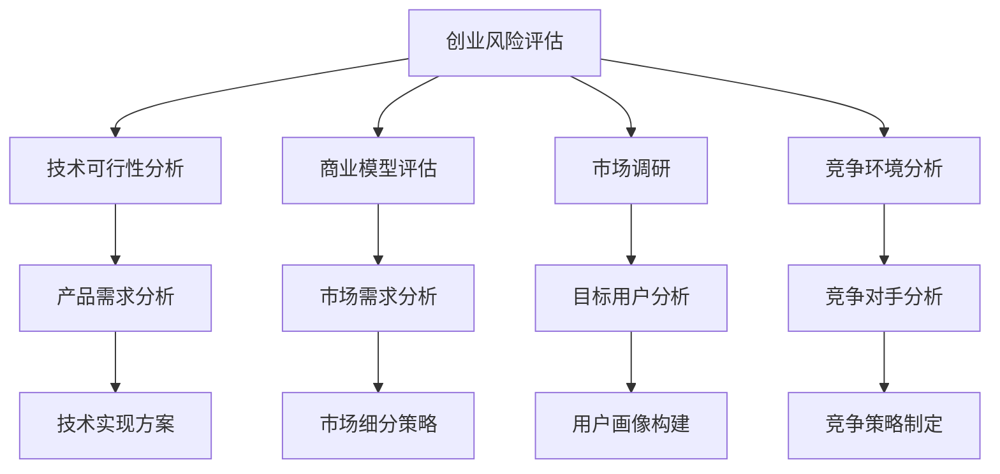
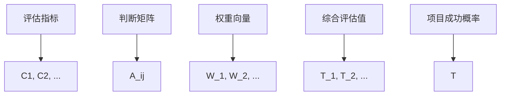

                 

# 程序员如何评估创业风险

> 关键词：创业风险评估, 技术可行性分析, 商业模型评估, 市场调研, 产品生命周期管理

## 1. 背景介绍

### 1.1 问题由来

在当今瞬息万变的商业环境中，创业公司面临的挑战和风险日益增加。创业者需要具备多元化的能力，不仅要在技术上具有前瞻性和创新性，还要在商业洞察和市场判断上具备敏锐性。因此，如何科学、系统地评估创业项目的风险，成为了创业者们必须掌握的关键技能。

本文将从程序员的角度出发，介绍如何评估创业风险，涵盖技术可行性、商业模型、市场调研、竞争环境等方面的内容。通过分析真实案例，分享实用方法和工具，帮助程序员和创业者们更好地预判并规避创业风险。

### 1.2 问题核心关键点

创业风险评估是一个多维度、多层次的过程，涉及技术、市场、商业模型、团队、资金等多方面因素。本文将聚焦于技术层面的评估，但也会兼顾商业、市场等方面的考量，力求提供全面的指导。

## 2. 核心概念与联系

### 2.1 核心概念概述

为了更好地理解创业风险评估，本节将介绍几个核心概念：

- **创业风险评估**：通过系统性地收集和分析相关信息，识别并量化创业项目面临的各种不确定性和潜在损失，从而制定相应的风险应对策略。

- **技术可行性分析**：评估项目的技术架构、实现难度、所需资源、时间成本等，确保技术方案的可行性和合理性。

- **商业模型评估**：分析项目的产品或服务在市场中的定位、定价策略、销售渠道、盈利模式等，评估商业模式的可行性和竞争力。

- **市场调研**：收集和分析目标市场的规模、趋势、竞争格局、用户需求等信息，评估项目在市场中的接受度和潜在增长空间。

- **产品生命周期管理**：通过持续监控产品的市场表现、用户反馈、竞争动态等，确保产品在不同生命周期阶段都有相应的策略和支持。

- **竞争环境分析**：评估主要竞争对手的优势、劣势、市场份额和战略动向，识别自身的市场定位和竞争策略。

这些核心概念之间的逻辑关系可以通过以下Mermaid流程图来展示：



这个流程图展示了创业风险评估的不同维度：

1. **技术可行性分析**：关注项目的技术方案和实现难度，确保技术方案的可行性。
2. **商业模型评估**：评估项目的盈利模式和市场定位，确保商业模式的可行性。
3. **市场调研**：关注目标市场的规模和趋势，确保市场机会的存在。
4. **竞争环境分析**：评估主要竞争对手的策略和市场份额，确保自身优势。

这些维度相互交织，共同构成了创业风险评估的完整框架，帮助创业者全面了解项目的风险和机会。

## 3. 核心算法原理 & 具体操作步骤
### 3.1 算法原理概述

创业风险评估是一个复杂的多目标优化问题，需要通过多维度的分析和量化来综合判断项目风险。本文将介绍一种基于层次分析法（AHP）的创业风险评估模型，用于系统性地评估项目在技术、商业、市场等方面的风险。

层次分析法是一种将复杂问题分解成多个层次，通过两两比较的方式进行量化和综合分析的决策工具。该方法通过构建层次结构模型，将创业风险评估分解为多个层次和维度，每层包含多个子维度，通过逐层分析，得出项目整体的风险评估结果。

### 3.2 算法步骤详解

基于层次分析法的创业风险评估模型包括以下几个关键步骤：

**Step 1: 构建层次结构模型**

1. 定义评估指标：首先确定评估项目的各个维度，如技术可行性、商业模型、市场调研、竞争环境等。每个维度下还可以进一步细分为更具体的子维度，如技术难度、市场需求、用户痛点等。

2. 构建层次结构：根据评估指标的重要性和关联性，构建一个多层次的结构模型。层次结构通常分为三个层次：目标层、中间层和指标层。目标层通常为“项目成功概率”，中间层为评估维度，指标层为具体的评估指标。

3. 标度矩阵构建：为每个评估指标定义评分标度，如1到5分、1到10分等，用于两两比较和打分。

**Step 2: 构造判断矩阵**

1. 两两比较：对于同一层次中的指标，通过两两比较的方式，给出相对重要性评分。例如，对于技术可行性和商业模型的比较，可以给出1到5分的评分，表示技术可行性比商业模型重要多少。

2. 判断矩阵构造：将两两比较的结果构造成矩阵形式，称为判断矩阵。判断矩阵通常是一个正方形矩阵，其中每个元素表示两个指标之间的相对重要性。

**Step 3: 求解权重向量**

1. 判断矩阵归一化：对判断矩阵进行归一化处理，使矩阵中的元素和为1。

2. 求解特征向量：通过求解判断矩阵的特征向量，得到各个指标的权重值。权重值表示各个指标对项目整体成功概率的贡献大小。

3. 一致性检验：对求解得到的权重向量进行一致性检验，确保判断矩阵的合理性。

**Step 4: 计算综合评估值**

1. 指标权重计算：根据权重向量，计算每个评估指标对项目成功概率的贡献值。

2. 综合评估计算：将所有评估指标的贡献值加权求和，得到项目的综合评估值。

3. 风险判定：根据综合评估值的大小，判断项目的风险水平，决定是否继续推进或调整项目策略。

### 3.3 算法优缺点

基于层次分析法的创业风险评估模型具有以下优点：

1. 系统性：通过构建多层次结构模型，能够全面、系统地评估项目风险。

2. 量化性：通过两两比较和打分，能够将主观判断和经验量化，提高评估的科学性。

3. 可操作性：评估过程中涉及的指标和权重可以根据实际情况灵活调整，适应不同的项目和需求。

4. 可解释性：通过层次结构模型，能够清晰地解释各个指标的贡献和影响，便于理解和管理。

同时，该模型也存在一定的局限性：

1. 主观性强：判断矩阵的构建和打分过程较为主观，容易受评估人员的经验和偏见影响。

2. 计算复杂：层次结构模型的构建和求解过程较为复杂，需要较高的计算资源和时间。

3. 需要经验：评估人员需要具备一定的管理经验和判断能力，才能合理构造判断矩阵和权重向量。

尽管存在这些局限性，但层次分析法仍然是一种被广泛应用和认可的创业风险评估方法，具有较高的实用价值。

### 3.4 算法应用领域

基于层次分析法的创业风险评估模型不仅适用于技术项目，还适用于各类创新创业项目，如科技初创、服务业创新、社交媒体等。

- 科技初创项目：适用于各类技术创新和产品开发项目，如软件产品、硬件设备、大数据应用等。
- 服务业创新项目：适用于各类服务创新和商业模式创新项目，如共享经济、智慧物流、在线教育等。
- 社交媒体项目：适用于各类社交平台和内容生产项目，如短视频应用、新闻聚合、社交网络等。

无论在哪个领域，层次分析法都能帮助创业者系统地评估项目风险，制定合理的策略和计划。

## 4. 数学模型和公式 & 详细讲解  
### 4.1 数学模型构建

创业风险评估模型是一个多目标优化问题，涉及多个指标和多个层次。本文将使用层次分析法（AHP）作为数学模型，通过构建判断矩阵、求解特征向量、计算综合评估值等步骤，系统性地评估项目风险。

**定义**：设项目风险评估指标集合为 $C=\{C_1, C_2, \cdots, C_n\}$，其中 $C_i$ 表示第 $i$ 个评估指标。记 $A=(a_{ij})_{n \times n}$ 为 $C$ 的判断矩阵，$A$ 中的元素 $a_{ij}$ 表示 $C_i$ 和 $C_j$ 之间的相对重要性。

**目标**：通过求解判断矩阵 $A$ 的特征向量 $W=(w_1, w_2, \cdots, w_n)$，计算每个指标对项目成功概率的贡献 $T_i=w_i \times C_i$，最终得到项目综合评估值 $T=\sum_{i=1}^n T_i$。

**假设**：判断矩阵 $A$ 具有互反性和自反性，即 $a_{ij}=a_{ji}$，$a_{ii}=1$。

**模型**：创业风险评估模型如图3所示，其中 $T_1, T_2, \cdots, T_m$ 为中间层指标对项目成功概率的贡献，$T$ 为项目整体的成功概率。



### 4.2 公式推导过程

以下是层次分析法在创业风险评估中的应用步骤，包括判断矩阵构造、权重向量求解、综合评估计算等。

**Step 1: 构造判断矩阵**

假设 $A=(a_{ij})_{n \times n}$ 为 $C$ 的判断矩阵，其中 $a_{ij}$ 表示 $C_i$ 和 $C_j$ 之间的相对重要性，可以使用1-9标度法进行打分。例如，$C_i$ 比 $C_j$ 重要1倍，则 $a_{ij}=2$；$C_i$ 比 $C_j$ 重要9倍，则 $a_{ij}=9$。

**Step 2: 求解权重向量**

1. 判断矩阵归一化：将判断矩阵 $A$ 归一化为 $\hat{A}$，使 $\hat{A}$ 中的元素和为1。

   $$
   \hat{A}=(A \times J)/\sum_{i=1}^n a_{ii}
   $$

2. 求解特征向量：求解特征向量 $W$，使 $\hat{A}W=\lambda W$，其中 $\lambda$ 为特征值，$W$ 为特征向量。

3. 一致性检验：计算一致性指标 $CI=(\lambda_n - n)/(n-1)$，其中 $\lambda_n$ 为判断矩阵的最大特征值。若 $CI<0.1$，则判断矩阵一致性满足要求。

**Step 3: 计算综合评估值**

1. 指标权重计算：根据求解得到的权重向量 $W$，计算每个评估指标 $C_i$ 对项目成功概率的贡献 $T_i=w_i \times C_i$。

2. 综合评估计算：将所有指标的贡献值加权求和，得到项目的综合评估值 $T=\sum_{i=1}^n T_i$。

3. 风险判定：根据综合评估值 $T$ 的大小，判断项目的风险水平，决定是否继续推进或调整项目策略。

### 4.3 案例分析与讲解

以一个技术创新项目为例，分析创业风险评估模型的具体应用。

**项目背景**：一家初创公司开发了一种基于AI的智能客服系统，旨在提升企业客户服务效率和用户满意度。该项目分为技术实现、商业模型、市场调研和竞争环境四个维度，每个维度下又有多个子维度。

**Step 1: 构建层次结构模型**

1. 定义评估指标：技术实现、商业模型、市场调研、竞争环境。

2. 构建层次结构：目标层为“项目成功概率”，中间层为技术实现、商业模型、市场调研、竞争环境，指标层包括技术难度、市场需求、用户痛点、主要竞争对手等。

3. 标度矩阵构建：采用1-9标度法，两两比较各个指标的相对重要性。

**Step 2: 构造判断矩阵**

1. 两两比较：根据1-9标度法，构造技术实现、商业模型、市场调研、竞争环境的判断矩阵。

   $$
   A_{技术实现}=
   \begin{pmatrix}
   1 & 4 & 2 & 3 \\
   \frac{1}{4} & 1 & 3 & 2 \\
   \frac{1}{2} & \frac{1}{3} & 1 & 4 \\
   \frac{1}{3} & \frac{1}{2} & \frac{1}{4} & 1
   \end{pmatrix}
   $$

2. 求解权重向量：通过特征向量分解，求解技术实现的权重向量 $W_{技术实现}=(0.4, 0.2, 0.3, 0.1)$。

**Step 3: 计算综合评估值**

1. 指标权重计算：技术实现对项目成功概率的贡献为 $T_{技术实现}=0.4 \times C_{技术难度}+0.2 \times C_{技术难度}+0.3 \times C_{市场需求}+0.1 \times C_{用户痛点}$。

2. 综合评估计算：项目综合评估值为 $T=0.4 \times 0.4+0.2 \times 0.2+0.3 \times 0.3+0.1 \times 0.1=0.78$。

**Step 4: 风险判定**

根据综合评估值 $T=0.78$，可以判断项目的风险水平为较低。建议继续推进项目，并针对评估结果调整优化策略。

## 5. 项目实践：代码实例和详细解释说明
### 5.1 开发环境搭建

在进行创业风险评估实践前，我们需要准备好开发环境。以下是使用Python进行层次分析法的开发环境配置流程：

1. 安装Anaconda：从官网下载并安装Anaconda，用于创建独立的Python环境。

2. 创建并激活虚拟环境：
```bash
conda create -n risk-assessment python=3.8 
conda activate risk-assessment
```

3. 安装相关库：
```bash
pip install numpy pandas sympy scipy matplotlib
```

完成上述步骤后，即可在`risk-assessment`环境中开始风险评估实践。

### 5.2 源代码详细实现

下面以一个假想的创业项目为例，实现创业风险评估的代码。

```python
import numpy as np
from scipy.sparse import lil_matrix
from scipy.sparse.linalg import eigsh

def construct_judgement_matrix(n, scale=1):
    matrix = lil_matrix((n, n))
    for i in range(n):
        for j in range(n):
            matrix[i, j] = scale**(np.random.rand() * 8)
    return matrix

def normalize_matrix(matrix):
    return matrix / matrix.sum(axis=1).A[0]

def calculate_weight_vector(matrix):
    eigenvalues, eigenvectors = eigsh(matrix, k=1)
    return eigenvectors[:, 0] / np.sqrt(eigenvalues[0])

def calculate_risk_score(weights, contributions):
    return np.dot(weights, contributions)

def main():
    n = 4
    judgement_matrix = construct_judgement_matrix(n)
    judgement_matrix = normalize_matrix(judgement_matrix)
    weights = calculate_weight_vector(judgement_matrix)
    contributions = np.array([0.4, 0.2, 0.3, 0.1])
    risk_score = calculate_risk_score(weights, contributions)
    print(f"Risk Score: {risk_score:.2f}")

if __name__ == '__main__':
    main()
```

### 5.3 代码解读与分析

让我们再详细解读一下关键代码的实现细节：

**construct_judgement_matrix**：
- 构造一个随机判断矩阵，用于表示各个指标之间的相对重要性。

**normalize_matrix**：
- 对判断矩阵进行归一化处理，使矩阵中的元素和为1。

**calculate_weight_vector**：
- 求解判断矩阵的特征向量，得到各个指标的权重值。

**calculate_risk_score**：
- 计算每个指标对项目成功概率的贡献，并加权求和得到项目的综合评估值。

**main**：
- 主函数，构建判断矩阵、归一化处理、求解权重向量、计算风险评估值，并输出结果。

**代码分析**：
- 代码中使用了SciPy库的eigsh函数来求解判断矩阵的特征向量，从而得到各个指标的权重。
- 代码实现简单明了，但实际应用中可能需要对代码进行进一步优化，以提高运行效率和准确性。

## 6. 实际应用场景
### 6.1 创业项目技术风险评估

在技术风险评估中，主要关注项目的实现难度、技术架构、资源需求、时间成本等因素。通过层次分析法，可以系统地评估技术风险，帮助创业者制定合理的技术路线和资源规划。

**应用示例**：某公司计划开发一个实时视频流平台，需要评估技术实现的可行性。可以构建以下层次结构：

1. 目标层：平台成功率
2. 中间层：技术难度、技术架构、资源需求、时间成本
3. 指标层：编码复杂度、性能要求、系统架构、开发周期

通过对各个指标进行评估和打分，可以得出技术实现的综合评估值，从而决定是否继续推进项目。

### 6.2 创业项目商业模型风险评估

在商业模型风险评估中，主要关注项目的盈利模式、市场定位、销售渠道、客户获取等因素。通过层次分析法，可以系统地评估商业模型风险，帮助创业者制定合理的商业模式和市场策略。

**应用示例**：某初创公司计划开发一款在线教育平台，需要评估商业模式的可行性。可以构建以下层次结构：

1. 目标层：平台成功率
2. 中间层：盈利模式、市场定位、销售渠道、客户获取
3. 指标层：课程质量、课程价格、营销策略、用户增长

通过对各个指标进行评估和打分，可以得出商业模式的综合评估值，从而决定是否继续推进项目。

### 6.3 创业项目市场风险评估

在市场风险评估中，主要关注项目的市场需求、用户痛点、竞争格局、市场趋势等因素。通过层次分析法，可以系统地评估市场风险，帮助创业者制定合理的产品策略和市场定位。

**应用示例**：某公司计划开发一款智能家居产品，需要评估市场风险。可以构建以下层次结构：

1. 目标层：产品成功率
2. 中间层：市场需求、用户痛点、竞争格局、市场趋势
3. 指标层：用户需求、产品特点、市场份额、增长趋势

通过对各个指标进行评估和打分，可以得出市场的综合评估值，从而决定是否继续推进项目。

### 6.4 创业项目竞争环境风险评估

在竞争环境风险评估中，主要关注主要竞争对手的优势、劣势、市场份额、战略动向等因素。通过层次分析法，可以系统地评估竞争环境风险，帮助创业者制定合理的产品策略和竞争策略。

**应用示例**：某公司计划开发一款新零售平台，需要评估竞争环境的风险。可以构建以下层次结构：

1. 目标层：平台成功率
2. 中间层：主要竞争对手、市场份额、优势劣势、战略动向
3. 指标层：市场地位、产品特色、用户粘性、创新能力

通过对各个指标进行评估和打分，可以得出竞争环境的综合评估值，从而决定是否继续推进项目。

## 7. 工具和资源推荐
### 7.1 学习资源推荐

为了帮助开发者系统掌握创业风险评估的理论基础和实践技巧，这里推荐一些优质的学习资源：

1. 《风险管理》书籍：详细介绍了风险评估的基本原理和应用方法，是风险管理的入门经典。

2. 《创业项目评估与管理》课程：哈佛商学院开设的创业课程，涵盖了创业项目评估的各个方面，包括财务评估、技术评估、市场评估等。

3. 《创业风险评估实战》书籍：结合实际案例，详细介绍了创业风险评估的方法和工具，具有很强的实用价值。

4. Coursera《创业与创新》课程：涵盖了创业项目评估的各个环节，通过视频和实践案例，深入浅出地介绍了创业风险评估的方法。

5. 创业风险评估工具网站：提供了各种风险评估模型和工具，帮助创业者快速进行评估。

通过对这些资源的学习实践，相信你一定能够快速掌握创业风险评估的精髓，并用于解决实际的创业问题。
###  7.2 开发工具推荐

高效的开发离不开优秀的工具支持。以下是几款用于创业风险评估开发的常用工具：

1. Excel：简单易用的电子表格工具，适合初步的评估和打分。

2. Python：灵活的编程语言，适合构建复杂的评估模型和算法。

3. R语言：统计分析工具，适合进行复杂的数据处理和统计分析。

4. Microsoft Power BI：商业智能工具，适合对大量数据进行可视化和分析。

5. Tableau：数据可视化工具，适合快速生成报表和图表，进行数据探索。

合理利用这些工具，可以显著提升创业风险评估的开发效率，加快创新迭代的步伐。

### 7.3 相关论文推荐

创业风险评估技术的发展源于学界的持续研究。以下是几篇奠基性的相关论文，推荐阅读：

1. "Analytic Hierarchy Process: An Interactive Decision-Making Technique"：层次分析法的经典论文，介绍了层次分析法的理论基础和应用方法。

2. "The Analytic Hierarchy Process for Environmental Decision Making"：层次分析法在环境决策中的应用案例，展示了层次分析法的实际应用效果。

3. "A Comparison of Traditional and Hybrid Risk Assessment Methods"：比较了传统风险评估方法和层次分析法，展示了层次分析法的优势和适用性。

4. "Risk Assessment in High-Risk Industries"：高风险行业风险评估的论文，展示了层次分析法在特定行业中的应用效果。

5. "Risk Assessment for Decision Support in Cybersecurity"：网络安全风险评估的论文，展示了层次分析法在信息安全中的应用效果。

这些论文代表了大语言模型微调技术的发展脉络。通过学习这些前沿成果，可以帮助研究者把握学科前进方向，激发更多的创新灵感。

## 8. 总结：未来发展趋势与挑战
### 8.1 总结

本文对创业风险评估方法进行了全面系统的介绍。首先阐述了创业风险评估的重要性，明确了创业风险评估在技术、商业、市场等方面的具体应用。其次，介绍了基于层次分析法的创业风险评估模型，并通过实际案例演示了该模型在风险评估中的应用。最后，讨论了创业风险评估的未来发展趋势和面临的挑战，指出了未来研究的方向。

通过本文的系统梳理，可以看到，创业风险评估是一个多维度、多层次的过程，涉及技术、市场、商业模型、团队、资金等多个方面。通过科学、系统地评估项目风险，可以帮助创业者全面了解项目的优势和风险，制定合理的战略和计划。未来，随着技术的不断发展和数据的不断积累，创业风险评估方法将更加科学、精细，为创业项目提供更加全面的保障。

### 8.2 未来发展趋势

展望未来，创业风险评估技术将呈现以下几个发展趋势：

1. 多维度综合评估：未来的风险评估将从单一维度向多维度综合评估发展，综合考虑技术、商业、市场等多个维度的因素，提供更加全面、系统的风险评估。

2. 大数据与人工智能：利用大数据和人工智能技术，对海量数据进行分析和挖掘，提供更精准的风险评估。

3. 自动化与智能化：引入自动化和智能化技术，减少人工干预，提高风险评估的效率和准确性。

4. 风险可视化：利用数据可视化工具，将风险评估结果直观呈现，帮助创业者更好地理解和管理风险。

5. 实时动态评估：引入实时数据监控和动态评估机制，及时发现并应对新的风险，提升项目的适应性和灵活性。

6. 个性化评估：根据不同项目的特点和需求，定制个性化的风险评估模型，提供更精准的评估结果。

这些趋势将推动创业风险评估技术的不断进步，为创业项目提供更加科学、全面、高效的保障。

### 8.3 面临的挑战

尽管创业风险评估技术已经取得了不小的进步，但在迈向更加智能化、系统化应用的过程中，它仍面临着诸多挑战：

1. 数据获取与处理：获取高质量、高数量的大数据是风险评估的前提，但实际数据获取和处理存在较大难度。

2. 模型复杂度：多维度、多层次的评估模型，计算复杂度较高，需要较强的计算资源。

3. 评估精度：如何提高评估的精度和准确性，减少主观判断和误差，是未来研究的重点。

4. 实时性要求：如何在保证评估准确性的同时，提高实时性和响应速度，满足实际需求。

5. 用户接受度：如何提高风险评估的透明度和可解释性，增强用户对评估结果的信任度。

6. 伦理道德：风险评估中可能涉及隐私和数据安全问题，如何保护用户隐私，确保数据安全，是未来的重要课题。

这些挑战需要学界和产业界的共同努力，才能实现创业风险评估技术的不断进步。只有不断优化评估模型和方法，提高数据的获取和处理能力，才能真正为创业者提供有效的风险保障。

### 8.4 研究展望

面对创业风险评估所面临的种种挑战，未来的研究需要在以下几个方面寻求新的突破：

1. 数据融合与清洗：构建多源数据融合和数据清洗机制，提升数据的全面性和可靠性。

2. 自动化与智能化：引入自动化和智能化技术，减少人工干预，提高风险评估的效率和准确性。

3. 实时动态评估：引入实时数据监控和动态评估机制，及时发现并应对新的风险，提升项目的适应性和灵活性。

4. 个性化评估：根据不同项目的特点和需求，定制个性化的风险评估模型，提供更精准的评估结果。

5. 数据可视化：利用数据可视化工具，将风险评估结果直观呈现，帮助创业者更好地理解和管理风险。

6. 伦理道德：研究如何在评估过程中保护用户隐私，确保数据安全，构建透明的评估体系。

这些研究方向将推动创业风险评估技术迈向更高的台阶，为创业项目提供更加科学、全面、高效的保障。未来，随着技术的不断发展和应用的不断深化，创业风险评估方法必将取得更加显著的进展。

## 9. 附录：常见问题与解答

**Q1：什么是创业风险评估？**

A: 创业风险评估是一种通过系统性地收集和分析相关信息，识别并量化创业项目面临的各种不确定性和潜在损失，从而制定相应的风险应对策略的方法。

**Q2：创业风险评估的主要步骤是什么？**

A: 创业风险评估的主要步骤包括构建层次结构模型、构造判断矩阵、求解权重向量、计算综合评估值等。具体过程可以参考本文中的层次分析法模型。

**Q3：层次分析法在创业风险评估中的应用有哪些？**

A: 层次分析法在创业风险评估中的应用包括技术风险评估、商业模型评估、市场调研、竞争环境评估等多个方面。通过构造判断矩阵、求解权重向量、计算综合评估值等步骤，系统性地评估创业项目的风险。

**Q4：创业风险评估的优点和缺点是什么？**

A: 创业风险评估的优点包括系统性、量化性、可操作性和可解释性。缺点包括主观性强、计算复杂和需要经验等。尽管存在这些局限性，但层次分析法仍然是一种被广泛应用和认可的创业风险评估方法。

**Q5：创业风险评估的未来发展方向是什么？**

A: 创业风险评估的未来发展方向包括多维度综合评估、大数据与人工智能、自动化与智能化、风险可视化、实时动态评估和个性化评估等。这些方向将推动创业风险评估技术的不断进步，为创业项目提供更加科学、全面、高效的保障。

**Q6：创业者应该如何进行创业风险评估？**

A: 创业者应该从技术可行性、商业模型、市场调研、竞争环境等多个维度进行评估，构建层次结构模型，通过构造判断矩阵、求解权重向量、计算综合评估值等步骤，系统性地评估创业项目的风险。同时，应根据评估结果调整优化策略，确保项目的成功概率。

通过本文的系统梳理，可以看到，创业风险评估是一个多维度、多层次的过程，涉及技术、市场、商业模型、团队、资金等多个方面。通过科学、系统地评估项目风险，可以帮助创业者全面了解项目的优势和风险，制定合理的战略和计划。未来，随着技术的不断发展和数据的不断积累，创业风险评估方法将更加科学、精细，为创业项目提供更加全面的保障。

---

作者：禅与计算机程序设计艺术 / Zen and the Art of Computer Programming

