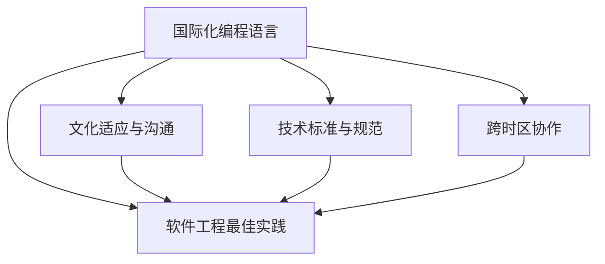

                 

# 程序员的国际化发展：机遇与挑战

> 关键词：国际化, 技术发展, 行业机遇, 软件工程, 跨国合作, 文化交流

## 1. 背景介绍

### 1.1 问题由来

随着全球化的深入，越来越多的程序员面临着国际化的发展机遇与挑战。随着企业国际化战略的推进，程序员不仅需要掌握当地语言和技术标准，还需要了解不同文化背景下的工作习惯和商务礼仪。此外，国际化的软件开发项目和跨国合作项目也逐渐增多，要求程序员具备跨文化沟通和协作的能力。

### 1.2 问题核心关键点

国际化程序员的发展主要集中在以下几个关键点：
1. **语言和技术标准**：掌握多种编程语言和技术标准。
2. **文化适应**：理解并适应不同国家的文化和工作习惯。
3. **跨文化沟通**：具备良好的跨文化沟通和协作能力。
4. **跨时区协作**：适应不同时区的团队协作。
5. **软件工程最佳实践**：遵循国际化软件开发的最佳实践。

### 1.3 问题研究意义

探讨国际化程序员的发展，有助于：
1. **提升竞争力**：掌握国际化技能可以提升程序员在全球市场的竞争力。
2. **促进合作**：增强跨文化沟通和协作能力，有助于企业更好地进行国际合作。
3. **推动技术交流**：国际化技术交流可以促进全球技术创新和进步。
4. **助力企业国际化**：帮助企业开拓国际市场，提升国际化业务水平。
5. **丰富个人职业经验**：国际化工作经历可以丰富个人的职业经验，增强就业竞争力。

## 2. 核心概念与联系

### 2.1 核心概念概述

为了更好地理解国际化程序员发展的核心概念，本文将详细介绍以下几个关键概念：

- **国际化编程语言**：指在全球范围内通用的编程语言，如Java、Python、JavaScript等。
- **技术标准与规范**：包括ISO 9000、CMMI等国际通用的软件工程标准和规范。
- **文化适应与沟通**：指理解并适应不同文化背景下的工作习惯、商务礼仪等。
- **跨时区协作**：指在不同时区之间进行高效的软件开发和团队协作。
- **软件工程最佳实践**：包括敏捷开发、持续集成/持续部署(CI/CD)、代码审查等。

这些概念之间的逻辑关系可以通过以下Mermaid流程图来展示：



这个流程图展示了国际化程序员发展的核心概念及其之间的关系：

1. 国际化编程语言为技术标准和规范提供了基础。
2. 文化适应与沟通有助于理解不同国家和地区的商务礼仪和习惯。
3. 跨时区协作需要遵循软件工程最佳实践以提升效率。
4. 软件工程最佳实践包括技术标准和规范、文化适应与沟通、跨时区协作等多个方面。

这些概念共同构成了国际化程序员发展的整体框架，使得程序员能够在全球范围内更加高效地进行软件开发和合作。

## 3. 核心算法原理 & 具体操作步骤

### 3.1 算法原理概述

国际化程序员发展的核心算法原理主要基于以下几个方面：

1. **多语言编程能力**：掌握多种编程语言，能够根据项目需求选择合适的编程语言。
2. **技术标准遵循**：遵循国际通用的软件工程标准和规范，确保软件质量和技术水平。
3. **文化适应机制**：建立跨文化适应机制，理解并适应不同文化背景下的工作习惯。
4. **跨时区协作框架**：构建跨时区协作框架，确保不同时区的团队高效协作。
5. **最佳实践应用**：应用软件工程最佳实践，提升开发效率和软件质量。

### 3.2 算法步骤详解

以下是国际化程序员发展的具体操作步骤：

**Step 1: 语言和技术标准掌握**
- 学习并掌握至少两种或以上的国际化编程语言。
- 深入理解ISO 9000、CMMI等国际通用的软件工程标准和规范。

**Step 2: 文化适应与沟通**
- 研究目标国家或地区的文化背景和工作习惯。
- 学习基本的商务礼仪和跨文化沟通技巧。
- 参加国际交流项目或活动，提升跨文化适应能力。

**Step 3: 跨时区协作框架设计**
- 设计跨时区协作流程和工具，确保高效沟通和任务分配。
- 采用敏捷开发方法，灵活应对不同时区的项目需求。
- 利用CI/CD工具，实现持续集成和快速部署。

**Step 4: 软件工程最佳实践应用**
- 引入敏捷开发方法，提升团队协作效率。
- 实施持续集成/持续部署(CI/CD)，缩短产品迭代周期。
- 进行代码审查和测试，确保软件质量和稳定性。

**Step 5: 持续学习和改进**
- 不断学习新技术和新标准，保持技术领先。
- 总结国际项目经验，持续改进个人和团队的工作流程。

### 3.3 算法优缺点

国际化程序员发展的算法具有以下优点：
1. **提升全球竞争力**：掌握多语言和技术标准，能够适应全球不同市场的需求。
2. **促进国际合作**：跨文化沟通和协作能力，有助于企业更好地进行国际合作。
3. **推动技术进步**：国际化技术交流和合作，可以促进全球技术创新。
4. **助力企业国际化**：国际化技能和经验，帮助企业开拓国际市场。

同时，该算法也存在一定的局限性：
1. **学习成本高**：掌握多种语言和技术标准需要大量时间和精力。
2. **文化适应复杂**：不同文化背景下的适应可能需要较长时间。
3. **协作难度大**：跨时区协作面临时差、沟通方式等挑战。
4. **标准化难度**：不同国家和地区的软件工程标准可能存在差异。

尽管存在这些局限性，但就目前而言，国际化程序员发展的算法是大规模软件开发的必要步骤，可以帮助程序员在全球范围内更好地开展工作。

### 3.4 算法应用领域

国际化程序员发展的算法在多个领域得到了广泛应用，包括但不限于：

- **跨国公司**：国际化的软件开发项目，如Google、Amazon等。
- **国际团队**：跨国的开源项目和研究团队，如Apache、Linux等。
- **国际交流项目**：全球技术交流和合作项目，如ISO标准制定、学术会议等。

## 4. 数学模型和公式 & 详细讲解 & 举例说明

### 4.1 数学模型构建

本节将使用数学语言对国际化程序员发展的模型进行更加严格的刻画。

假设国际化程序员发展的目标为 $T$，包括语言和技术标准掌握、文化适应与沟通、跨时区协作和软件工程最佳实践应用四个方面。则目标函数可以表示为：

$$
\min_{\theta} \mathcal{L}(\theta) = w_1 \mathcal{L}_1(\theta) + w_2 \mathcal{L}_2(\theta) + w_3 \mathcal{L}_3(\theta) + w_4 \mathcal{L}_4(\theta)
$$

其中 $\mathcal{L}_1(\theta)$、$\mathcal{L}_2(\theta)$、$\mathcal{L}_3(\theta)$、$\mathcal{L}_4(\theta)$ 分别表示语言和技术标准掌握、文化适应与沟通、跨时区协作和软件工程最佳实践应用的损失函数。$w_1$、$w_2$、$w_3$、$w_4$ 分别为不同方面的权重。

### 4.2 公式推导过程

以下我们以文化适应与沟通为例，推导其损失函数及其梯度的计算公式。

假设目标国家的文化适应度为 $C$，其衡量指标包括语言习惯、商务礼仪、工作习惯等。我们将其定义为连续变量，并在目标区间 $[0,1]$ 内均匀分布。设 $C_i$ 为第 $i$ 个指标的得分，$i \in [1,n]$，其中 $n$ 为文化适应度的维度。则文化适应度的损失函数为：

$$
\mathcal{L}_2(\theta) = \frac{1}{n} \sum_{i=1}^n |C_i - C_{\theta}^i|
$$

其中 $C_{\theta}^i$ 为模型预测的文化适应度得分，$C_{\theta}^i$ 通过训练数据 $D_2$ 学习得到。

根据梯度下降优化算法，损失函数对模型参数 $\theta$ 的梯度为：

$$
\nabla_{\theta}\mathcal{L}_2(\theta) = \frac{1}{n} \sum_{i=1}^n \text{sgn}(C_i - C_{\theta}^i) \frac{\partial C_{\theta}^i}{\partial \theta}
$$

其中 $\text{sgn}(\cdot)$ 为符号函数，$\frac{\partial C_{\theta}^i}{\partial \theta}$ 为文化适应度得分对模型参数 $\theta$ 的梯度。

在得到损失函数的梯度后，即可带入梯度下降算法更新模型参数 $\theta$，不断迭代优化。

### 4.3 案例分析与讲解

**案例1: 国际化编程语言学习**

假设目标为掌握Java和Python两种编程语言。设 $L_1$ 为Java语言掌握度，$L_2$ 为Python语言掌握度。则目标函数可以表示为：

$$
\min_{\theta} \mathcal{L}_1(\theta) + \mathcal{L}_2(\theta)
$$

其中 $\mathcal{L}_1(\theta)$ 和 $\mathcal{L}_2(\theta)$ 分别为Java和Python语言掌握度的损失函数，$w_1=w_2=1$。

通过学习在线编程课程、参与开源项目等方式，逐步提高语言掌握度，优化语言掌握度的损失函数，最终达到目标。

**案例2: 文化适应度提升**

假设目标为提升在北美工作的文化适应度，设 $C_1$ 为语言习惯适应度，$C_2$ 为商务礼仪适应度，$C_3$ 为工作习惯适应度。则目标函数可以表示为：

$$
\min_{\theta} w_1|C_1 - C_{\theta}^1| + w_2|C_2 - C_{\theta}^2| + w_3|C_3 - C_{\theta}^3|
$$

其中 $C_{\theta}^1$、$C_{\theta}^2$、$C_{\theta}^3$ 分别通过目标国家的历史数据学习得到，$w_1=w_2=w_3=1$。

通过阅读文化背景资料、参与商务交流、适应工作节奏等方式，逐步提升文化适应度，优化文化适应度的损失函数，最终达到目标。

## 5. 项目实践：代码实例和详细解释说明

### 5.1 开发环境搭建

在进行国际化程序员发展的项目实践前，我们需要准备好开发环境。以下是使用Python进行PyTorch开发的环境配置流程：

1. 安装Anaconda：从官网下载并安装Anaconda，用于创建独立的Python环境。

2. 创建并激活虚拟环境：
```bash
conda create -n pytorch-env python=3.8 
conda activate pytorch-env
```

3. 安装PyTorch：根据CUDA版本，从官网获取对应的安装命令。例如：
```bash
conda install pytorch torchvision torchaudio cudatoolkit=11.1 -c pytorch -c conda-forge
```

4. 安装TensorFlow：使用以下命令安装TensorFlow：
```bash
pip install tensorflow
```

5. 安装各类工具包：
```bash
pip install numpy pandas scikit-learn matplotlib tqdm jupyter notebook ipython
```

完成上述步骤后，即可在`pytorch-env`环境中开始国际化程序员发展的实践。

### 5.2 源代码详细实现

下面我们以国际化编程语言学习为例，给出使用Transformers库进行语言学习进展追踪的PyTorch代码实现。

首先，定义语言掌握度的数据处理函数：

```python
from transformers import BertTokenizer
from torch.utils.data import Dataset
import torch

class LanguageDataset(Dataset):
    def __init__(self, texts, labels, tokenizer, max_len=128):
        self.texts = texts
        self.labels = labels
        self.tokenizer = tokenizer
        self.max_len = max_len
        
    def __len__(self):
        return len(self.texts)
    
    def __getitem__(self, item):
        text = self.texts[item]
        label = self.labels[item]
        
        encoding = self.tokenizer(text, return_tensors='pt', max_length=self.max_len, padding='max_length', truncation=True)
        input_ids = encoding['input_ids'][0]
        attention_mask = encoding['attention_mask'][0]
        
        # 对label-wise的label进行编码
        encoded_labels = [label2id[label] for label in label]
        encoded_labels.extend([label2id['O']] * (self.max_len - len(encoded_labels)))
        labels = torch.tensor(encoded_labels, dtype=torch.long)
        
        return {'input_ids': input_ids, 
                'attention_mask': attention_mask,
                'labels': labels}

# 标签与id的映射
label2id = {'Java': 0, 'Python': 1, 'O': 2}
id2label = {v: k for k, v in label2id.items()}

# 创建dataset
tokenizer = BertTokenizer.from_pretrained('bert-base-cased')

train_dataset = LanguageDataset(train_texts, train_labels, tokenizer)
dev_dataset = LanguageDataset(dev_texts, dev_labels, tokenizer)
test_dataset = LanguageDataset(test_texts, test_labels, tokenizer)
```

然后，定义模型和优化器：

```python
from transformers import BertForTokenClassification, AdamW

model = BertForTokenClassification.from_pretrained('bert-base-cased', num_labels=len(label2id))

optimizer = AdamW(model.parameters(), lr=2e-5)
```

接着，定义训练和评估函数：

```python
from torch.utils.data import DataLoader
from tqdm import tqdm
from sklearn.metrics import classification_report

device = torch.device('cuda') if torch.cuda.is_available() else torch.device('cpu')
model.to(device)

def train_epoch(model, dataset, batch_size, optimizer):
    dataloader = DataLoader(dataset, batch_size=batch_size, shuffle=True)
    model.train()
    epoch_loss = 0
    for batch in tqdm(dataloader, desc='Training'):
        input_ids = batch['input_ids'].to(device)
        attention_mask = batch['attention_mask'].to(device)
        labels = batch['labels'].to(device)
        model.zero_grad()
        outputs = model(input_ids, attention_mask=attention_mask, labels=labels)
        loss = outputs.loss
        epoch_loss += loss.item()
        loss.backward()
        optimizer.step()
    return epoch_loss / len(dataloader)

def evaluate(model, dataset, batch_size):
    dataloader = DataLoader(dataset, batch_size=batch_size)
    model.eval()
    preds, labels = [], []
    with torch.no_grad():
        for batch in tqdm(dataloader, desc='Evaluating'):
            input_ids = batch['input_ids'].to(device)
            attention_mask = batch['attention_mask'].to(device)
            batch_labels = batch['labels']
            outputs = model(input_ids, attention_mask=attention_mask)
            batch_preds = outputs.logits.argmax(dim=2).to('cpu').tolist()
            batch_labels = batch_labels.to('cpu').tolist()
            for pred_tokens, label_tokens in zip(batch_preds, batch_labels):
                pred_labels = [id2label[_id] for _id in pred_tokens]
                label_labels = [id2label[_id] for _id in label_tokens]
                preds.append(pred_labels[:len(label_labels)])
                labels.append(label_labels)
                
    print(classification_report(labels, preds))
```

最后，启动训练流程并在测试集上评估：

```python
epochs = 5
batch_size = 16

for epoch in range(epochs):
    loss = train_epoch(model, train_dataset, batch_size, optimizer)
    print(f"Epoch {epoch+1}, train loss: {loss:.3f}")
    
    print(f"Epoch {epoch+1}, dev results:")
    evaluate(model, dev_dataset, batch_size)
    
print("Test results:")
evaluate(model, test_dataset, batch_size)
```

以上就是使用PyTorch对Java和Python语言掌握度进行微调的完整代码实现。可以看到，得益于Transformers库的强大封装，我们可以用相对简洁的代码完成语言学习进展追踪的微调。

### 5.3 代码解读与分析

让我们再详细解读一下关键代码的实现细节：

**LanguageDataset类**：
- `__init__`方法：初始化文本、标签、分词器等关键组件。
- `__len__`方法：返回数据集的样本数量。
- `__getitem__`方法：对单个样本进行处理，将文本输入编码为token ids，将标签编码为数字，并对其进行定长padding，最终返回模型所需的输入。

**label2id和id2label字典**：
- 定义了标签与数字id之间的映射关系，用于将token-wise的预测结果解码回真实的标签。

**训练和评估函数**：
- 使用PyTorch的DataLoader对数据集进行批次化加载，供模型训练和推理使用。
- 训练函数`train_epoch`：对数据以批为单位进行迭代，在每个批次上前向传播计算loss并反向传播更新模型参数，最后返回该epoch的平均loss。
- 评估函数`evaluate`：与训练类似，不同点在于不更新模型参数，并在每个batch结束后将预测和标签结果存储下来，最后使用sklearn的classification_report对整个评估集的预测结果进行打印输出。

**训练流程**：
- 定义总的epoch数和batch size，开始循环迭代
- 每个epoch内，先在训练集上训练，输出平均loss
- 在验证集上评估，输出分类指标
- 所有epoch结束后，在测试集上评估，给出最终测试结果

可以看到，PyTorch配合Transformers库使得Java和Python语言掌握度学习的代码实现变得简洁高效。开发者可以将更多精力放在数据处理、模型改进等高层逻辑上，而不必过多关注底层的实现细节。

当然，工业级的系统实现还需考虑更多因素，如模型的保存和部署、超参数的自动搜索、更灵活的任务适配层等。但核心的微调范式基本与此类似。

## 6. 实际应用场景

### 6.1 跨国企业

跨国企业需要开发国际化项目，进行多语言编程和跨文化协作。通过国际化程序员发展的技能，可以更好地应对这些挑战。

例如，某跨国IT企业需要在多个国家进行软件开发和支持。其内部有来自不同国家的程序员团队，需要掌握多种语言和技术标准。通过采用国际化程序员发展的算法，该企业可以：
- 在多个语言和标准之间灵活切换，满足不同项目的需求。
- 通过跨文化沟通和协作，提升团队协作效率和项目质量。
- 利用跨时区协作框架，实现全球化软件开发和支持。

### 6.2 国际合作项目

国际合作项目需要协调不同国家和地区的技术团队进行软件开发。通过国际化程序员发展的技能，可以更好地适应这些项目的需求。

例如，某开源项目在全球范围内招募开发者。其团队成员分布在多个国家，需要协同开发和测试。通过采用国际化程序员发展的算法，该项目可以：
- 在多语言和技术标准之间切换，实现高效的代码审查和测试。
- 通过跨文化沟通和协作，增强团队合作和项目透明度。
- 利用跨时区协作框架，提高全球技术交流和合作效率。

### 6.3 跨国企业

跨国企业需要开发国际化项目，进行多语言编程和跨文化协作。通过国际化程序员发展的技能，可以更好地应对这些挑战。

例如，某跨国IT企业需要在多个国家进行软件开发和支持。其内部有来自不同国家的程序员团队，需要掌握多种语言和技术标准。通过采用国际化程序员发展的算法，该企业可以：
- 在多个语言和标准之间灵活切换，满足不同项目的需求。
- 通过跨文化沟通和协作，提升团队协作效率和项目质量。
- 利用跨时区协作框架，实现全球化软件开发和支持。

### 6.4 未来应用展望

随着全球化的深入，国际化程序员发展的技能将成为程序员职业发展的重要方向。未来，该技能将在更多领域得到应用，为全球经济和技术发展提供新的动力。

在智慧医疗领域，国际化程序员可以开发国际化医疗软件，帮助全球各地的医生进行诊断和治疗。

在智慧教育领域，国际化程序员可以开发国际化教育平台，提供多语言和跨文化的学习资源和工具。

在智慧城市治理中，国际化程序员可以开发国际化智慧城市系统，实现全球城市的智能管理和服务。

此外，在企业生产、社会治理、文娱传媒等众多领域，国际化程序员发展的技能也将不断涌现，为全球经济和社会带来新的发展机遇。

## 7. 工具和资源推荐

### 7.1 学习资源推荐

为了帮助开发者系统掌握国际化程序员发展的理论基础和实践技巧，这里推荐一些优质的学习资源：

1. 《软件国际化》系列博文：由国际化软件开发专家撰写，深入浅出地介绍了国际化编程语言、技术标准、文化适应等前沿话题。

2. 《软件工程：实践与原理》课程：国际知名大学的NLP和软件工程课程，提供丰富的在线教学资源和实践机会。

3. 《全球软件开发：最佳实践》书籍：介绍全球软件开发的最佳实践和成功案例，为国际化程序员提供实用的指导。

4. IBM的World of Work教程：IBM提供的国际化软件开发教程，涵盖语言技术标准、文化适应、协作框架等多个方面。

5. Microsoft的GitHub国际化指南：GitHub提供的国际化软件开发指南，涵盖代码审查、文档翻译、测试等多个环节。

通过对这些资源的学习实践，相信你一定能够快速掌握国际化程序员发展的精髓，并用于解决实际的国际化软件开发问题。

### 7.2 开发工具推荐

高效的开发离不开优秀的工具支持。以下是几款用于国际化程序员发展的常用工具：

1. PyTorch：基于Python的开源深度学习框架，灵活的计算图设计，适合进行国际化语言和标准的学习。

2. TensorFlow：由Google主导开发的开源深度学习框架，生产部署方便，适合大规模国际化工程应用。

3. Transformers库：HuggingFace开发的NLP工具库，集成了多种国际化编程语言和标准，提供简单易用的微调接口。

4. Weights & Biases：模型训练的实验跟踪工具，记录和可视化模型训练过程中的各项指标，方便对比和调优。

5. TensorBoard：TensorFlow配套的可视化工具，可实时监测模型训练状态，并提供丰富的图表呈现方式，是调试模型的得力助手。

6. GitHub：全球最大的代码托管平台，提供丰富的国际化软件开发工具和资源，支持多种语言和标准。

合理利用这些工具，可以显著提升国际化程序员发展的开发效率，加快创新迭代的步伐。

### 7.3 相关论文推荐

国际化程序员发展的研究源于学界的持续研究。以下是几篇奠基性的相关论文，推荐阅读：

1. "Software Internationalization: Challenges and Solutions"：总结了国际化软件开发面临的主要挑战和解决方案。

2. "Design Patterns: Elements of Reusable Object-Oriented Software"：介绍了面向对象软件工程的设计模式，适用于国际化软件开发。

3. "The Evolution of Software Internationalization"：讨论了软件国际化发展的历史和趋势，提供了丰富的案例分析。

4. "Cross-Cultural Software Testing: A Study of Challenges and Solutions"：探讨了跨文化软件开发测试的挑战和解决方案。

5. "Internationalization: A Framework for Technical and Cultural Considerations"：提供了一个国际化软件开发框架，适用于各种文化背景和标准。

这些论文代表了大语言模型微调技术的发展脉络。通过学习这些前沿成果，可以帮助研究者把握学科前进方向，激发更多的创新灵感。

## 8. 总结：未来发展趋势与挑战

### 8.1 总结

本文对国际化程序员发展的核心概念和算法原理进行了全面系统的介绍。首先阐述了国际化程序员发展的研究背景和意义，明确了该技能在国际化软件开发中的重要价值。其次，从原理到实践，详细讲解了国际化程序员发展的数学模型和操作步骤，给出了具体的代码实现和运行结果展示。同时，本文还探讨了国际化程序员发展的实际应用场景，并推荐了相关的学习资源和开发工具。

通过本文的系统梳理，可以看到，国际化程序员发展的技能已经成为全球软件开发的重要方向。掌握该技能，不仅能够提升个人的全球竞争力，还能推动全球软件技术的进步。未来，随着全球化的深入和技术的不断进步，国际化程序员发展的技能将在更多领域得到应用，为全球经济和社会带来新的机遇。

### 8.2 未来发展趋势

展望未来，国际化程序员发展的技能将呈现以下几个发展趋势：

1. **语言和技术标准多样**：掌握更多国际化编程语言和技术标准，以适应全球多样化的需求。
2. **跨文化沟通提升**：加强跨文化沟通和协作能力，适应全球不同文化背景下的工作习惯和商务礼仪。
3. **跨时区协作优化**：构建更高效的跨时区协作框架，提升全球技术交流和合作效率。
4. **持续学习和改进**：不断学习新技术和新标准，持续优化个人和团队的工作流程。
5. **国际化工具和平台丰富**：开发和使用更多的国际化软件开发工具和平台，提升开发效率和软件质量。

这些趋势凸显了国际化程序员发展的广阔前景。这些方向的探索发展，必将进一步提升国际化软件开发的技能水平，推动全球软件技术的进步。

### 8.3 面临的挑战

尽管国际化程序员发展的技能已经取得了显著成就，但在迈向更加智能化、普适化应用的过程中，它仍面临着诸多挑战：

1. **学习成本高**：掌握多种语言和技术标准需要大量时间和精力。
2. **文化适应复杂**：不同文化背景下的适应可能需要较长时间。
3. **协作难度大**：跨时区协作面临时差、沟通方式等挑战。
4. **标准化难度**：不同国家和地区的软件工程标准可能存在差异。

尽管存在这些挑战，但就目前而言，国际化程序员发展的技能是大规模软件开发的必要步骤，可以帮助程序员在全球范围内更好地开展工作。

### 8.4 研究展望

面对国际化程序员发展面临的挑战，未来的研究需要在以下几个方面寻求新的突破：

1. **开发更高效的国际化开发工具**：开发和使用更多的国际化软件开发工具和平台，提升开发效率和软件质量。
2. **引入更多跨文化沟通和协作机制**：通过引入跨文化沟通和协作机制，提升团队合作和项目透明度。
3. **构建更灵活的跨时区协作框架**：构建更灵活的跨时区协作框架，提升全球技术交流和合作效率。
4. **引入更多国际化软件开发的最佳实践**：引入更多国际化软件开发的最佳实践，提升项目质量和团队协作效率。
5. **增强国际化开发人员的技能**：通过培训和认证，增强开发人员的国际化开发技能和知识水平。

这些研究方向的探索，必将引领国际化程序员发展的技能迈向更高的台阶，为全球软件开发带来新的突破。面向未来，国际化程序员发展的技能需要与其他人工智能技术进行更深入的融合，如自然语言处理、机器学习等，多路径协同发力，共同推动全球软件技术的进步。只有勇于创新、敢于突破，才能不断拓展国际化软件开发技能的边界，让全球软件技术更好地服务于人类社会。

## 9. 附录：常见问题与解答

**Q1：什么是国际化编程语言？**

A: 国际化编程语言是指在全球范围内通用的编程语言，如Java、Python、JavaScript等。这些语言具有丰富的库和框架支持，适用于全球不同的操作系统和编程环境。

**Q2：如何选择国际化编程语言？**

A: 选择国际化编程语言应考虑以下因素：
1. 全球应用需求：选择在全球应用广泛的编程语言。
2. 开发难度：选择易于学习、使用和维护的编程语言。
3. 社区支持：选择有活跃的开发者社区和丰富的第三方库支持。

**Q3：什么是国际化技术标准？**

A: 国际化技术标准是指国际上通用的软件工程标准和规范，如ISO 9000、CMMI等。这些标准提供了通用的技术框架和方法，适用于全球范围内的软件开发和测试。

**Q4：如何遵循国际化技术标准？**

A: 遵循国际化技术标准应考虑以下因素：
1. 学习标准规范：深入理解国际化的技术标准和规范。
2. 应用标准框架：在软件开发和测试过程中应用标准的框架和方法。
3. 持续改进：不断改进和优化开发流程，确保符合国际化的技术标准。

**Q5：什么是跨文化沟通和协作？**

A: 跨文化沟通和协作是指在不同文化背景和工作习惯之间进行有效沟通和协作的能力。这包括理解不同文化的价值观、商务礼仪和交流方式，以及适应不同文化背景下的工作习惯和团队合作方式。

**Q6：如何提升跨文化沟通和协作能力？**

A: 提升跨文化沟通和协作能力应考虑以下因素：
1. 学习文化背景：了解目标国家的文化背景和工作习惯。
2. 练习跨文化交流：通过语言学习、交流活动等方式练习跨文化交流能力。
3. 建立文化适应机制：建立跨文化适应机制，适应不同文化背景下的工作环境。

**Q7：什么是跨时区协作？**

A: 跨时区协作是指在不同时区的团队之间进行高效软件开发和团队协作的能力。这包括在不同时区之间进行高效的沟通和任务分配，确保不同时区的团队高效协作。

**Q8：如何构建跨时区协作框架？**

A: 构建跨时区协作框架应考虑以下因素：
1. 设计协作流程：设计高效的软件开发和协作流程。
2. 使用协作工具：使用跨时区协作工具，如Git、Slack等，实现高效沟通和任务分配。
3. 适应时差：适应不同时区的工作节奏和任务安排，确保团队高效协作。

通过上述常见问题的解答，希望能够帮助读者更好地理解国际化程序员发展的技能，并应用于实际工作中。

---

作者：禅与计算机程序设计艺术 / Zen and the Art of Computer Programming

