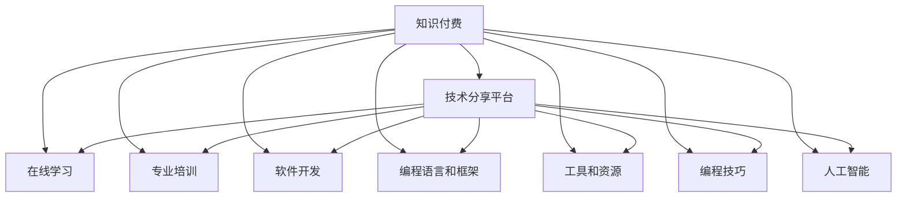

                 

# 程序员的知识付费产品线规划

> 关键词：知识付费, 技术分享, 社区平台, 在线学习, 专业培训, 软件开发, 编程语言, 框架, 工具, 编程技巧, 人工智能

## 1. 背景介绍

在互联网高速发展的今天，知识付费正在成为一种全新的生活方式。程序员作为知识密集型行业的主力军，自然也在这个潮流中占据了重要的位置。然而，传统的书籍、博客等知识传播形式，由于其传播方式单一、更新速度慢、互动性差等缺点，逐渐无法满足广大程序员的需求。因此，开发一套全面的、有深度的知识付费产品线，对于程序员的职业成长和IT行业的持续发展具有重要意义。

### 1.1 问题由来

在知识付费的浪潮中，程序员面临的最大挑战在于如何更好地组织和传播知识，以满足自身职业发展需求，同时帮助其他程序员提高技能水平。现有的知识分享平台、技术博客等形式，虽然积累了丰富的资源，但缺乏系统性和专业性，无法适应当下快节奏的学习需求。因此，构建一套面向程序员的知识付费产品线，不仅有助于自身职业成长，也能为整个IT行业带来新的活力。

### 1.2 问题核心关键点

构建面向程序员的知识付费产品线，核心关键点包括：
- **内容质量保证**：确保内容的专业性和实用性，吸引更多的目标用户。
- **用户互动性**：提供有效的互动功能，增强学习体验。
- **内容多样化**：覆盖广泛的编程语言、框架和工具，满足不同层次的程序员需求。
- **平台可扩展性**：支持灵活的扩展和迭代，适应未来的技术发展。
- **商业化策略**：制定合理的盈利模式，实现可持续发展。

## 2. 核心概念与联系

### 2.1 核心概念概述

构建知识付费产品线，涉及多个核心概念：

- **知识付费**：通过提供高质量、专业化的技术知识和经验分享，向用户收取费用的商业模式。
- **技术分享平台**：一个以技术分享和交流为核心的社区平台，支持用户发布和阅读技术文章。
- **在线学习**：提供在线课程、视频讲座、编程实战等多样化学习资源。
- **专业培训**：提供针对特定技能或岗位的集中式培训课程。
- **软件开发**：涵盖软件开发全流程，包括需求分析、架构设计、编码实现、测试部署等。
- **编程语言和框架**：提供主流编程语言和流行框架的学习资源。
- **工具和资源**：介绍和推荐常用开发工具、调试技巧和项目管理工具。
- **编程技巧**：包括代码优化、性能调优、代码风格等实用技巧。
- **人工智能**：引入AI相关的知识，提升程序员的技术广度和深度。

这些概念之间通过知识共享、用户互动、技术传承等环节形成紧密联系，共同构成了面向程序员的知识付费产品线。

### 2.2 核心概念原理和架构的 Mermaid 流程图



## 3. 核心算法原理 & 具体操作步骤

### 3.1 算法原理概述

面向程序员的知识付费产品线，主要通过以下算法原理实现：

- **内容质量控制**：使用机器学习和自然语言处理技术，自动筛选和推荐高质量内容，确保用户学习体验。
- **用户行为分析**：利用数据分析技术，分析用户行为，生成个性化推荐，提升用户粘性。
- **智能搜索与推荐**：基于自然语言处理技术，实现智能搜索和内容推荐。
- **互动与反馈机制**：引入论坛、评论、问答等互动机制，增强用户参与感和反馈效率。
- **知识图谱构建**：通过知识图谱技术，建立内容之间的关联关系，提高知识传播效率。
- **内容管理系统**：使用分布式系统架构，实现内容的快速发布和更新，保障内容时效性。

### 3.2 算法步骤详解

#### 3.2.1 内容质量控制

1. **内容审核**：通过人工和自动相结合的方式，审核内容的质量和相关性，剔除低质量内容。
2. **用户评价**：引入用户评价机制，通过评分、点赞等方式筛选高质量内容。
3. **自动筛选**：利用自然语言处理技术，分析内容关键词、引用文献等，自动筛选优质内容。

#### 3.2.2 用户行为分析

1. **用户画像**：通过分析用户历史行为，生成用户画像，包括兴趣偏好、学习进度等。
2. **行为预测**：使用机器学习模型，预测用户可能感兴趣的内容，提高推荐准确率。
3. **行为分析**：定期分析用户行为数据，识别出热门内容和趋势，优化内容策略。

#### 3.2.3 智能搜索与推荐

1. **搜索引擎**：基于倒排索引等技术，实现高效的内容搜索。
2. **推荐算法**：使用协同过滤、基于内容的推荐算法等，生成个性化推荐内容。
3. **智能搜索**：通过自然语言理解技术，实现智能查询，提高搜索效率。

#### 3.2.4 互动与反馈机制

1. **论坛**：搭建在线论坛，支持用户发布技术问题，寻求帮助。
2. **评论与点赞**：支持用户对内容进行评论和点赞，增加互动性。
3. **问答社区**：建立专家答疑机制，实时解决用户疑问。

#### 3.2.5 知识图谱构建

1. **图谱构建**：通过实体抽取、关系推理等技术，构建内容知识图谱。
2. **图谱查询**：支持用户通过自然语言查询，获取相关知识。
3. **图谱扩展**：定期更新图谱，保持知识的时效性和完整性。

#### 3.2.6 内容管理系统

1. **发布系统**：支持用户快速发布技术文章和视频。
2. **版本控制**：使用Git等版本控制系统，保障内容的迭代和更新。
3. **分发系统**：使用CDN等技术，加速内容分发，保障内容时效性。

### 3.3 算法优缺点

#### 3.3.1 优点

1. **内容多样化**：覆盖广泛的编程语言、框架和工具，满足不同层次的程序员需求。
2. **互动性高**：通过论坛、评论、问答等互动机制，增强用户参与感。
3. **学习效率高**：基于机器学习和自然语言处理技术，自动筛选和推荐高质量内容。
4. **内容时效性高**：通过分布式内容管理系统，保障内容快速发布和更新。

#### 3.3.2 缺点

1. **内容质量控制难度大**：自动化审核和筛选技术仍需改进，部分内容仍需人工审核。
2. **用户行为分析难度大**：用户行为数据复杂多样，分析模型需要不断优化。
3. **智能搜索和推荐算法复杂**：涉及多技术领域的结合，开发和维护难度较大。
4. **互动机制的维护成本高**：大量高质量互动内容需要专业团队维护，成本较高。

## 4. 数学模型和公式 & 详细讲解 & 举例说明

### 4.1 数学模型构建

面向程序员的知识付费产品线，主要涉及以下数学模型：

- **内容质量控制**：使用文本分类算法，对内容进行分类和质量评估。
- **用户行为分析**：使用协同过滤、用户行为模型等，分析用户兴趣和行为。
- **智能搜索与推荐**：使用信息检索、推荐算法等，实现智能搜索和内容推荐。
- **知识图谱构建**：使用图神经网络等技术，构建内容知识图谱。

### 4.2 公式推导过程

#### 4.2.1 内容质量控制

1. **文本分类模型**：
   - 假设内容集为 $D$，其中 $d_i$ 为第 $i$ 篇文章。
   - 使用 Bag-of-Words 模型表示文章内容，设 $w$ 为文章中每个词。
   - 设 $W$ 为文章词向量，通过词向量计算文章质量分数 $Q$：
   $$
   Q = \sum_{w \in W} q_w
   $$
   其中 $q_w$ 为词 $w$ 的质量评分，可以通过预设阈值和机器学习模型训练得到。

#### 4.2.2 用户行为分析

1. **协同过滤模型**：
   - 假设用户集为 $U$，其中 $u_j$ 为第 $j$ 个用户。
   - 设 $I_j$ 为用户 $u_j$ 阅读的篇目集合。
   - 通过协同过滤模型，计算用户 $u_j$ 对篇目 $d_i$ 的兴趣评分 $S_{ij}$：
   $$
   S_{ij} = \frac{\sum_{k \in I_j} A_{ik}Q_k}{\sqrt{\sum_{k \in I_j} Q_k^2}+\epsilon}
   $$
   其中 $A_{ik}$ 为相似度矩阵，可以通过余弦相似度计算得到。$\epsilon$ 为避免分母为零的常数项。

#### 4.2.3 智能搜索与推荐

1. **信息检索模型**：
   - 假设查询语句为 $q$，目标文章集为 $D$。
   - 使用向量空间模型，将查询语句和文章向量映射到向量空间，计算相似度 $Sim(q, d_i)$：
   $$
   Sim(q, d_i) = \frac{\vec{q} \cdot \vec{d_i}}{\|\vec{q}\| \cdot \|\vec{d_i}\|}
   $$
   其中 $\vec{q}$ 为查询向量，$\vec{d_i}$ 为目标文章向量。

#### 4.2.4 知识图谱构建

1. **知识图谱构建模型**：
   - 假设知识图谱为 $G$，其中 $n$ 为节点数，$m$ 为边数。
   - 使用图神经网络，对文章进行实体抽取，构建知识图谱：
   $$
   G = G' + \alpha(G') + \beta(\Delta G')
   $$
   其中 $G'$ 为原始知识图谱，$\alpha$ 和 $\beta$ 为调节因子，$\Delta G'$ 为图谱更新操作，可以通过关系推理等技术实现。

### 4.3 案例分析与讲解

#### 4.3.1 内容质量控制

假设有一篇关于 "Python 高级编程技巧" 的文章，内容质量评分为 0.8，该文章包含以下关键词："Python"、"高级编程技巧"、"模块化编程"。
- 使用文本分类模型，将文章分类为 "技术文章"。
- 使用词向量模型，计算文章质量分数：$Q = q_{Python} + q_{高级编程技巧} + q_{模块化编程}$。

#### 4.3.2 用户行为分析

假设用户 $u_1$ 阅读过文章 $d_1$、$d_2$、$d_3$，且兴趣评分为 0.6、0.7、0.8。
- 使用协同过滤模型，计算用户 $u_1$ 对文章 $d_4$ 的兴趣评分：
  $$
  S_{14} = \frac{A_{14}Q_1 + A_{24}Q_2 + A_{34}Q_3}{\sqrt{Q_1^2 + Q_2^2 + Q_3^2}+\epsilon}
  $$

#### 4.3.3 智能搜索与推荐

假设用户查询 "Java 性能优化"，使用信息检索模型，在知识图谱中搜索相关文章。
- 通过向量空间模型，计算查询与文章 $d_1$、$d_2$、$d_3$ 的相似度：
  $$
  Sim(q, d_1) = \frac{\vec{q} \cdot \vec{d_1}}{\|\vec{q}\| \cdot \|\vec{d_1}\|}
  $$

#### 4.3.4 知识图谱构建

假设知识图谱中有节点 $n_1$、$n_2$ 和 $n_3$，表示 "Python"、"Java"、"C++" 三个编程语言。
- 通过知识图谱构建模型，构建图谱中的关系边：
  $$
  G' = (n_1, n_2, n_3) + (\alpha, \beta, \gamma)
  $$

## 5. 项目实践：代码实例和详细解释说明

### 5.1 开发环境搭建

以下是使用 Python 和 Django 框架搭建知识付费产品线的开发环境：

1. 安装 Python 3.x：
   ```bash
   sudo apt-get install python3 python3-pip
   ```

2. 安装 Django：
   ```bash
   pip install django
   ```

3. 创建 Django 项目：
   ```bash
   django-admin startproject knowledge-payment
   cd knowledge-payment
   ```

4. 创建 Django 应用：
   ```bash
   python manage.py startapp content_management
   ```

5. 安装相关库：
   ```bash
   pip install django-modeltranslation django-crispy-forms nltk scipy gensim
   ```

6. 配置数据库：
   在 `settings.py` 中配置数据库连接。

完成上述步骤后，即可在开发环境中启动 Django 项目，开始知识付费产品线的开发。

### 5.2 源代码详细实现

以下是一个简单的代码实例，展示了如何在 Django 应用中实现文章发布和阅读功能：

#### 5.2.1 文章模型

```python
from django.db import models

class Article(models.Model):
    title = models.CharField(max_length=255)
    content = models.TextField()
    category = models.CharField(max_length=255)
    date_published = models.DateTimeField(auto_now_add=True)

    def __str__(self):
        return self.title
```

#### 5.2.2 文章发布功能

```python
from django.shortcuts import render, redirect
from django.http import HttpResponse
from .models import Article

def publish_article(request):
    if request.method == 'POST':
        title = request.POST['title']
        content = request.POST['content']
        category = request.POST['category']
        article = Article(title=title, content=content, category=category)
        article.save()
        return redirect('article_list')
    else:
        return render(request, 'publish_article.html')
```

#### 5.2.3 文章阅读功能

```python
from django.shortcuts import get_object_or_404
from .models import Article

def article_detail(request, article_id):
    article = get_object_or_404(Article, id=article_id)
    return render(request, 'article_detail.html', {'article': article})
```

### 5.3 代码解读与分析

#### 5.3.1 文章模型

- `Article` 模型包含四个字段：`title`、`content`、`category` 和 `date_published`。
- `title` 为文章标题，`content` 为文章内容，`category` 为文章分类，`date_published` 为文章发布时间。

#### 5.3.2 文章发布功能

- `publish_article` 函数用于发布文章。
- 如果请求方法为 POST，则获取表单数据，创建新的 `Article` 对象并保存。
- 保存成功后，重定向到文章列表页面。

#### 5.3.3 文章阅读功能

- `article_detail` 函数用于展示单篇文章。
- 通过 `get_object_or_404` 函数获取指定 ID 的文章对象。
- 将文章对象传递给模板，并渲染 `article_detail.html` 页面。

### 5.4 运行结果展示

- 启动 Django 开发服务器：
  ```bash
  python manage.py runserver
  ```

- 访问 `http://localhost:8000/publish_article` 页面，填写文章信息后提交。

- 访问 `http://localhost:8000/1` 页面，展示发布的文章内容。

## 6. 实际应用场景

### 6.1 智能推荐系统

面向程序员的知识付费产品线，可以通过智能推荐系统，提升用户的粘性和体验。系统通过分析用户行为，生成个性化推荐内容，使用户能够更快地找到有价值的信息。例如，用户经常阅读关于 "Python" 的文章，系统可以推荐更多相关领域的文章，如 "Python 框架 Flask"、"Python 数据科学" 等。

### 6.2 在线学习平台

产品线可以与在线学习平台结合，提供丰富的编程语言和框架学习资源。用户可以通过视频讲座、在线课程等方式，系统性地学习编程技能。例如，用户可以在产品线中查找 "Python 高级编程技巧" 的课程，通过观看视频教程和阅读配套文章，提升编程能力。

### 6.3 专业培训课程

产品线可以引入专业培训课程，提供集中式的技能培训。例如，用户可以报名参加 "Java 面试技巧" 的课程，系统化地学习面试题和解题思路，提升面试成功率。

### 6.4 开发者社区

产品线可以建立开发者社区，支持用户发布技术问题，寻求帮助。社区中可以通过专家答疑机制，实时解决用户疑问。例如，用户可以在社区中发布 "Java 并发编程问题"，邀请专家进行解答。

## 7. 工具和资源推荐

### 7.1 学习资源推荐

为了帮助开发者系统掌握知识付费产品线的开发技术，以下是一些优质的学习资源：

1. **《Django 官方文档》**：Django 官方文档提供了详细的开发指南和示例代码，是掌握 Django 框架的必备资料。
2. **《Python Web 开发实战》**：一本全面介绍 Python Web 开发的书籍，涵盖 Django、Flask 等多种框架。
3. **《机器学习实战》**：介绍机器学习技术在推荐系统中的应用，适合学习智能推荐算法。
4. **《自然语言处理入门》**：一本全面介绍自然语言处理技术的书籍，适合学习文本分类、信息检索等技术。
5. **《Python 编程技巧》**：一本详细介绍 Python 编程技巧的书籍，适合提升编程能力。

### 7.2 开发工具推荐

开发知识付费产品线，需要选择合适的开发工具，以下是一些常用的开发工具：

1. **PyCharm**：一款强大的 Python 开发工具，提供丰富的功能和代码补全功能。
2. **Visual Studio Code**：一款轻量级且功能强大的代码编辑器，支持多种编程语言和框架。
3. **Git**：版本控制系统，适合多人协作开发，提供分支管理和合并功能。
4. **Docker**：容器化技术，支持分布式部署和管理，适合开发和部署 Web 应用。
5. **Jenkins**：自动化构建和部署工具，适合持续集成和持续部署。

### 7.3 相关论文推荐

面向程序员的知识付费产品线，涉及多方面的技术，以下是一些相关的论文：

1. **《知识图谱构建技术》**：介绍知识图谱的构建方法和应用场景，适合学习图神经网络等技术。
2. **《协同过滤算法》**：介绍协同过滤算法的原理和应用，适合学习用户行为分析。
3. **《信息检索技术》**：介绍信息检索技术的原理和应用，适合学习智能搜索和推荐。
4. **《自然语言处理技术》**：介绍自然语言处理技术的原理和应用，适合学习文本分类、信息检索等技术。
5. **《分布式系统技术》**：介绍分布式系统的原理和应用，适合学习内容管理和系统扩展。

## 8. 总结：未来发展趋势与挑战

### 8.1 总结

本文对面向程序员的知识付费产品线进行了全面系统的介绍，涵盖了产品设计、技术实现、实际应用等多个方面。通过系统梳理，可以看到，面向程序员的知识付费产品线不仅能够满足程序员的学习需求，还能提升其职业成长，对IT行业的持续发展具有重要意义。

### 8.2 未来发展趋势

面向程序员的知识付费产品线，未来将呈现以下发展趋势：

1. **内容多样化**：随着新技术的不断涌现，产品线将不断引入新的编程语言、框架和工具，满足不同层次的程序员需求。
2. **技术创新**：通过引入新的技术如 AI、知识图谱等，提升产品线的智能化和知识传播效率。
3. **商业化拓展**：通过与在线学习平台、专业培训等结合，拓展产品线的商业化渠道，实现可持续发展。
4. **用户体验优化**：通过数据分析和智能推荐等技术，提升用户的学习体验和粘性。
5. **社区建设**：通过建立开发者社区，提升用户互动性和参与感，构建活跃的学习生态。

### 8.3 面临的挑战

面向程序员的知识付费产品线，在发展过程中也面临着诸多挑战：

1. **内容质量控制**：如何确保高质量内容的生产和筛选，是产品线面临的最大挑战。
2. **用户行为分析**：用户行为数据复杂多样，需要不断优化分析模型，提高推荐准确率。
3. **智能搜索和推荐**：涉及多技术领域的结合，开发和维护难度较大。
4. **社区建设**：建立高质量的开发者社区需要专业团队维护，成本较高。

### 8.4 研究展望

面向程序员的知识付费产品线，未来的研究需要在以下几个方面寻求新的突破：

1. **自动化内容审核**：开发自动化内容审核技术，提升内容质量控制效率。
2. **动态推荐模型**：引入深度学习模型，动态调整推荐策略，提升推荐效果。
3. **多模态搜索**：引入多模态搜索技术，支持语音、图片等多样化查询方式。
4. **知识图谱扩展**：定期更新知识图谱，保持知识的时效性和完整性。
5. **社区智能运营**：引入智能运营技术，提高社区管理效率，增强用户互动性。

通过不断创新和优化，面向程序员的知识付费产品线必将在未来的发展中取得更大的突破，为程序员的职业成长和IT行业的持续发展提供更强大的支持。

## 9. 附录：常见问题与解答

### 9.1 常见问题

1. **知识付费产品线是否适用于所有程序员？**
   A: 面向程序员的知识付费产品线覆盖广泛的编程语言、框架和工具，能够满足不同层次的程序员需求。但对于专业性较强的领域，如特定领域编程语言或高阶算法，产品线可能需要引入特定领域的专家资源。

2. **如何确保内容的质量和相关性？**
   A: 通过自动化内容审核和用户评价机制，结合人工审核，确保高质量内容的生产和筛选。同时，引入内容标签和分类机制，提升内容的准确性和相关性。

3. **如何提升用户的互动性和粘性？**
   A: 建立开发者社区，引入论坛、评论、问答等互动机制，增强用户参与感和反馈效率。同时，通过智能推荐和个性化内容推送，提升用户的学习体验和粘性。

4. **如何优化智能搜索和推荐算法？**
   A: 引入深度学习模型，动态调整推荐策略，提升推荐效果。同时，引入多模态搜索技术，支持语音、图片等多样化查询方式，提升搜索效率和准确性。

5. **如何降低社区建设的维护成本？**
   A: 引入智能运营技术，提高社区管理效率，减少人工干预。同时，通过算法优化和用户自管理机制，减少社区运营成本。

通过不断优化和改进，面向程序员的知识付费产品线必将在未来的发展中取得更大的突破，为程序员的职业成长和IT行业的持续发展提供更强大的支持。

