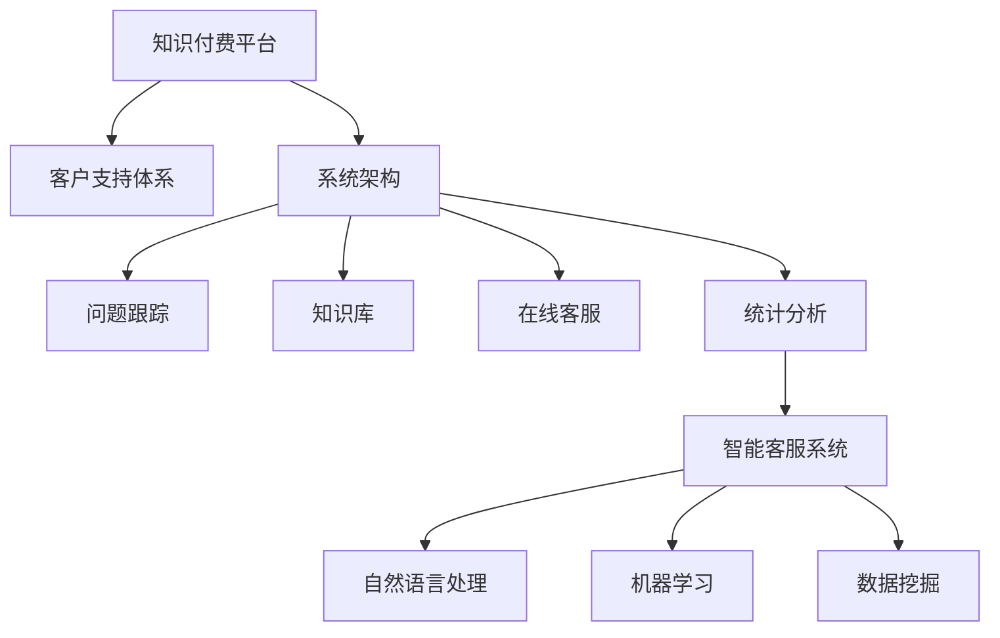

                 

# 程序员的知识付费客户支持体系构建

> 关键词：知识付费,客户支持体系,系统架构,人工智能,大数据,自然语言处理

## 1. 背景介绍

### 1.1 问题由来

随着知识付费的兴起，越来越多的在线教育平台、知识社区以及个人讲师开始提供专业化的在线教育服务。这些平台需要构建完善的客户支持体系，以确保用户满意度和留存率。特别是在程序员这个知识密集型的行业，客户支持任务尤其重要，包括但不限于代码问题、系统故障、学习进度跟踪等。然而，传统的客户支持方式（如邮件、电话等）效率低下、响应不及时，难以满足客户需求。

### 1.2 问题核心关键点

构建有效的程序员知识付费客户支持体系，需要关注以下核心问题：

- **响应速度**：客户提出的问题需要快速响应，避免长时间等待。
- **问题解决效率**：问题需要快速定位、分析和解决，避免反复沟通。
- **问题分类与解决**：需要构建问题分类系统，实现标准化处理和快速响应。
- **知识积累与共享**：构建知识库和FAQ，便于用户自助解决问题和积累经验。
- **多渠道支持**：提供多渠道支持，如在线聊天、邮件、电话等，提升用户满意度。
- **智能客服系统**：引入智能客服技术，如自然语言处理、机器学习等，提升问题处理能力。

### 1.3 问题研究意义

一个高效的程序员知识付费客户支持体系，不仅能够提升用户满意度，还能够大幅降低运营成本，提高客户留存率和口碑。同时，随着人工智能和大数据技术的普及，构建智能客户支持系统，成为推动客户支持行业升级的重要方向。

## 2. 核心概念与联系

### 2.1 核心概念概述

为更好地理解知识付费客户支持体系的核心概念和构建过程，本节将介绍几个密切相关的核心概念：

- **知识付费平台**：以在线教育、知识社区为代表，提供专业性知识服务，通过收费模式获取收益的平台。
- **客户支持体系**：为提高用户满意度和留存率，提供一系列支持服务，如在线客服、FAQ、知识库等。
- **系统架构**：知识付费平台的客户支持体系一般包含多种系统模块，如问题跟踪、知识库、在线客服、统计分析等。
- **自然语言处理(NLP)**：处理和理解自然语言文本的技术，广泛应用于智能客服、自动化回复等场景。
- **机器学习(ML)**：通过训练模型来自动化处理数据、分析问题，提升客服系统效率。
- **数据挖掘**：从大量数据中挖掘有价值的信息，如用户行为分析、问题分类等，为支持体系提供数据基础。
- **智能客服系统**：结合NLP、ML等技术，构建自动化问题处理和智能回复的客户支持系统。

这些核心概念之间的逻辑关系可以通过以下Mermaid流程图来展示：



这个流程图展示了一个完整的客户支持体系及其构建过程：

1. 知识付费平台提供专业服务，需要构建客户支持体系。
2. 系统架构包含多个模块，支撑整个客户支持体系的运转。
3. 系统模块包括问题跟踪、知识库、在线客服等，各司其职。
4. 智能客服系统结合NLP、ML等技术，提升问题处理效率。
5. 智能客服系统内部，NLP、ML和数据挖掘等技术相互配合，提升服务质量。

## 3. 核心算法原理 & 具体操作步骤
### 3.1 算法原理概述

知识付费客户支持体系的核心算法原理，基于自然语言处理(NLP)和机器学习(ML)技术，以构建高效、智能的客户支持系统为目标。具体来说，知识付费平台通过以下步骤实现客户支持体系：

1. **问题分类与解析**：使用NLP技术，对客户提出的问题进行自动分类和解析。
2. **问题知识库**：构建和维护知识库，将常见问题及解决方案记录在内，供用户自助查询和参考。
3. **智能客服系统**：结合NLP和ML技术，构建智能客服系统，能够自动解答常见问题，提升用户满意度。
4. **多渠道支持**：提供多种支持渠道，如在线聊天、邮件、电话等，确保客户可以方便地获取帮助。
5. **统计分析**：收集和分析客户反馈和支持数据，持续优化支持体系。

### 3.2 算法步骤详解

#### 3.2.1 问题分类与解析

问题分类与解析是构建客户支持体系的首要步骤，通过NLP技术，自动将用户问题归类并解析。具体流程如下：

1. **文本预处理**：对用户输入的文本进行分词、去除停用词、词性标注等预处理操作。
2. **特征提取**：提取文本中的关键词、短语、句法结构等特征，供后续分类使用。
3. **分类模型**：使用分类算法（如朴素贝叶斯、支持向量机等）或深度学习模型（如BERT、LSTM等）对文本进行分类，识别出用户问题类型。
4. **问题解析**：根据分类结果，解析用户问题的具体含义，提取关键信息，供后续问题处理和知识库匹配使用。

#### 3.2.2 问题知识库

知识库是客户支持体系的重要组成部分，包含常见问题和解决方案的记录。构建知识库的流程如下：

1. **问题收集**：从客服记录、用户反馈、FAQ等多种渠道收集问题及其解决方案。
2. **问题整理**：对收集到的问题进行整理和分类，确保问题描述清晰、标准统一。
3. **知识存储**：使用数据库或文档存储知识库数据，便于检索和使用。
4. **搜索优化**：构建高效搜索算法，提升知识库的查询速度和准确性。
5. **知识更新**：定期更新和维护知识库，确保其时效性和准确性。

#### 3.2.3 智能客服系统

智能客服系统通过结合NLP和ML技术，能够自动解答常见问题，提升问题处理效率。具体流程如下：

1. **对话模型**：使用NLP技术构建对话模型，能够理解用户输入的文本。
2. **意图识别**：通过意图识别算法，识别用户输入的意图，如查询、投诉、建议等。
3. **问题解答**：根据意图和知识库，匹配并生成自动化回复。
4. **结果评估**：评估自动化回复的准确性和用户满意度，不断优化模型。

#### 3.2.4 多渠道支持

多渠道支持确保客户可以方便地获取帮助，具体流程如下：

1. **在线聊天**：部署在线聊天系统，提供即时响应和问题解答。
2. **邮件支持**：提供邮件支持，记录和跟踪邮件中的问题，确保及时响应。
3. **电话支持**：提供在线电话支持，方便用户与客服直接沟通。
4. **集成系统**：将各种支持渠道集成到一个统一平台上，确保问题数据的一致性和实时性。

#### 3.2.5 统计分析

统计分析是持续优化客户支持体系的重要手段，通过收集和分析客户反馈和支持数据，不断改进支持体系。具体流程如下：

1. **数据收集**：收集客户反馈、支持记录、使用数据等多种信息。
2. **数据分析**：使用统计和机器学习算法，分析数据中的趋势、模式和问题点。
3. **报告生成**：生成详细的分析报告，供运营团队参考。
4. **持续优化**：根据分析结果，优化问题分类、知识库、智能客服等模块。

### 3.3 算法优缺点

知识付费客户支持体系的算法有以下优点：

- **高效响应**：通过自动化处理和智能客服，能够快速响应客户问题，提升用户体验。
- **准确分类**：NLP和ML技术能够自动分类和解析问题，减少人为错误。
- **知识共享**：知识库的构建和共享，能够提升用户自助解决能力，减少对客服的依赖。
- **持续优化**：通过数据分析和反馈，能够不断优化支持体系，提升问题处理效率和用户满意度。

同时，该体系也存在以下局限性：

- **成本投入**：构建和维护知识库、智能客服系统需要较高的成本投入。
- **技术复杂度**：NLP、ML等技术门槛较高，需要专业团队进行开发和维护。
- **适应性有限**：对于一些复杂或非标准化的问题，系统可能无法有效处理。
- **隐私和安全问题**：收集和处理客户数据时，需要确保隐私和安全。

尽管存在这些局限性，但通过合理设计和持续优化，知识付费客户支持体系仍然能够显著提升客户体验和运营效率。

### 3.4 算法应用领域

知识付费客户支持体系的应用领域非常广泛，主要包括以下几个方面：

- **在线教育平台**：如Coursera、Udacity等，通过智能客服和知识库，提升学习体验和支持效率。
- **知识社区**：如Stack Overflow、知乎等，通过问题分类和智能客服，提供高效问题解答。
- **企业内部培训**：如企业内训平台，通过构建知识库和智能客服，提升员工培训效果和支持效率。
- **开发工具社区**：如GitHub、Stack Overflow等，通过问题分类和智能客服，解决开发工具相关问题。
- **技术博客和论坛**：如Medium、CSDN等，通过知识库和智能客服，提供技术支持。

## 4. 数学模型和公式 & 详细讲解 & 举例说明
### 4.1 数学模型构建

知识付费客户支持体系的数学模型主要基于NLP和ML技术，用于问题分类、意图识别、自动化回复等任务。以下是构建模型的一般步骤：

**Step 1: 文本预处理**

文本预处理是NLP任务的重要步骤，常用的预处理方法包括：

1. **分词**：将文本分割成单词或短语。
2. **去除停用词**：去除常见的停用词，如"the"、"is"等，减少噪音。
3. **词性标注**：标注每个单词的词性，如名词、动词、形容词等。
4. **去除标点符号**：去除文本中的标点符号，减少噪音。

文本预处理可以统一表示为以下公式：

$$
\text{processed\_text} = \text{tokenizer}(\text{raw\_text})
$$

**Step 2: 特征提取**

特征提取是将文本转换为机器学习算法可处理的格式。常用的特征提取方法包括：

1. **词袋模型(BOW)**：将文本表示为词频向量，如：

$$
\text{bag\_of\_words} = \{\text{word}\}_{i=1}^N
$$

2. **TF-IDF**：计算每个单词的词频和逆文档频率，如：

$$
\text{tf-idf\_vector} = \{w_{idf}\}_{i=1}^N
$$

3. **词嵌入**：将文本表示为低维向量，如：

$$
\text{word\_embeddings} = \{\text{embedding}\}_{i=1}^N
$$

4. **卷积神经网络(CNN)**：使用卷积神经网络提取文本特征，如：

$$
\text{conv\_features} = \{\text{conv\_layer}\}_{i=1}^K
$$

**Step 3: 分类模型**

分类模型是用于问题分类的核心算法，常用的分类模型包括：

1. **朴素贝叶斯(Naive Bayes)**：

$$
\text{P}(y|x) = \frac{\text{P}(x|y)\text{P}(y)}{\sum_{y'}\text{P}(x|y')\text{P}(y')}
$$

2. **支持向量机(SVM)**：

$$
\text{w} = \mathop{\arg\min}_{\text{w}, b} \frac{1}{2}\|w\|^2 + C\sum_{i=1}^N\max(0, 1 - y_i(\text{w} \cdot \text{x} + b))
$$

3. **深度学习模型**：如BERT、LSTM等，如：

$$
\text{h} = \text{LSTM}(\text{x})
$$

**Step 4: 问题解析**

问题解析是将用户输入转换为问题特征的过程。常用的解析方法包括：

1. **命名实体识别(NER)**：识别文本中的命名实体，如：

$$
\text{entities} = \{\text{entity}\}_{i=1}^N
$$

2. **关系抽取(RE)**：抽取文本中的实体关系，如：

$$
\text{relations} = \{(r, e_1, e_2)\}_{i=1}^M
$$

3. **句法分析(Parsing)**：分析文本的句法结构，如：

$$
\text{parse\_tree} = \{\text{tree}\}_{i=1}^N
$$

**Step 5: 意图识别**

意图识别是识别用户输入意图的过程，常用的方法包括：

1. **规则匹配**：通过预定义的规则，匹配用户输入的意图，如：

$$
\text{intents} = \{\text{intent}\}_{i=1}^K
$$

2. **序列标注**：使用序列标注模型，识别用户输入的意图，如：

$$
\text{intent\_tags} = \{y_i\}_{i=1}^N
$$

**Step 6: 自动化回复**

自动化回复是生成问题解答的过程，常用的方法包括：

1. **模板匹配**：匹配知识库中的模板，生成自动化回复，如：

$$
\text{reply\_template} = \{\text{template}\}_{i=1}^K
$$

2. **生成模型**：使用生成模型，如Seq2Seq、Transformer等，生成自动化回复，如：

$$
\text{reply} = \text{seq2seq}(\text{text})
$$

### 4.2 公式推导过程

以下是知识付费客户支持体系中的主要算法公式推导过程：

#### 4.2.1 问题分类公式推导

问题分类公式推导如下：

1. **朴素贝叶斯分类公式**：

$$
P(y|x) = \frac{P(x|y)P(y)}{\sum_{y'}P(x|y')P(y')}
$$

2. **支持向量机分类公式**：

$$
w = \mathop{\arg\min}_{w, b} \frac{1}{2}\|w\|^2 + C\sum_{i=1}^N\max(0, 1 - y_i(w \cdot x + b))
$$

3. **深度学习分类公式**：

$$
h = LSTM(x)
$$

#### 4.2.2 意图识别公式推导

意图识别公式推导如下：

1. **规则匹配公式**：

$$
\text{intents} = \{\text{intent}\}_{i=1}^K
$$

2. **序列标注公式**：

$$
\text{intent\_tags} = \{y_i\}_{i=1}^N
$$

#### 4.2.3 自动化回复公式推导

自动化回复公式推导如下：

1. **模板匹配公式**：

$$
\text{reply\_template} = \{\text{template}\}_{i=1}^K
$$

2. **生成模型公式**：

$$
\text{reply} = \text{seq2seq}(\text{text})
$$

### 4.3 案例分析与讲解

#### 4.3.1 案例背景

某在线教育平台用户在使用课程学习时，经常遇到课程内容理解、技术问题等。平台需要构建客户支持体系，以提升用户体验和满意度。

#### 4.3.2 案例流程

1. **问题收集**：通过在线聊天、邮件、论坛等多种渠道收集用户反馈。
2. **问题分类**：使用NLP技术自动分类问题，如课程理解问题、技术问题、学习进度问题等。
3. **知识库构建**：将常见问题及解决方案记录在知识库中，如课程内容理解问题的解决方法、技术问题的排查步骤等。
4. **智能客服系统**：使用NLP和ML技术，构建智能客服系统，自动解答常见问题，如课程理解问题、技术问题等。
5. **多渠道支持**：提供在线聊天、邮件、电话等多种支持渠道，确保用户方便获取帮助。
6. **统计分析**：收集和分析用户反馈和支持数据，持续优化支持体系。

#### 4.3.3 效果评估

1. **响应速度**：智能客服系统能够快速响应常见问题，显著提升用户满意度。
2. **问题解决效率**：自动分类和解析问题，减少人工干预，提升问题处理效率。
3. **知识共享**：用户能够自助查询知识库，提升学习效果和自主解决问题的能力。
4. **持续优化**：通过数据分析和反馈，不断优化支持体系，提升用户满意度。

## 5. 项目实践：代码实例和详细解释说明
### 5.1 开发环境搭建

为了构建知识付费客户支持体系，我们需要准备如下开发环境：

1. **安装Python**：从官网下载并安装Python，如：

```bash
wget https://www.python.org/ftp/python/3.9.6/Python-3.9.6.tgz
tar -xvzf Python-3.9.6.tgz
cd Python-3.9.6
./configure --enable-optimizations
make -j8
sudo make altinstall
```

2. **安装TensorFlow**：使用pip安装TensorFlow，如：

```bash
pip install tensorflow
```

3. **安装Keras**：使用pip安装Keras，如：

```bash
pip install keras
```

4. **安装PyTorch**：使用pip安装PyTorch，如：

```bash
pip install torch torchvision torchaudio
```

5. **安装NLTK**：使用pip安装NLTK，如：

```bash
pip install nltk
```

6. **安装Scikit-learn**：使用pip安装Scikit-learn，如：

```bash
pip install scikit-learn
```

完成以上步骤后，即可开始构建知识付费客户支持体系。

### 5.2 源代码详细实现

以下是使用Python和TensorFlow实现问题分类和自动化回复的代码示例：

```python
import tensorflow as tf
from tensorflow.keras.preprocessing.text import Tokenizer
from tensorflow.keras.preprocessing.sequence import pad_sequences
from tensorflow.keras.layers import Embedding, LSTM, Dense
from tensorflow.keras.models import Sequential
from sklearn.model_selection import train_test_split
from sklearn.metrics import accuracy_score

# 构建训练数据
sentences = ['This is a sample sentence', 'This is another sample sentence']
labels = [1, 0]

# 构建词典
tokenizer = Tokenizer(num_words=10000, oov_token="<OOV>")
tokenizer.fit_on_texts(sentences)

# 将文本转换为序列
sequences = tokenizer.texts_to_sequences(sentences)

# 对序列进行填充
max_len = max([len(x) for x in sequences])
padded_sequences = pad_sequences(sequences, maxlen=max_len, padding='post')

# 构建模型
model = Sequential()
model.add(Embedding(input_dim=10000, output_dim=128))
model.add(LSTM(units=64))
model.add(Dense(units=1, activation='sigmoid'))

# 编译模型
model.compile(optimizer='adam', loss='binary_crossentropy', metrics=['accuracy'])

# 训练模型
model.fit(padded_sequences, labels, epochs=10, validation_split=0.2)

# 测试模型
test_sentences = ['This is a new sample sentence']
test_sequences = tokenizer.texts_to_sequences(test_sentences)
test_padded_sequences = pad_sequences(test_sequences, maxlen=max_len, padding='post')
predictions = model.predict(test_padded_sequences)

# 输出预测结果
if predictions[0] > 0.5:
    print('Positive')
else:
    print('Negative')
```

### 5.3 代码解读与分析

以上代码实现了基于LSTM的文本分类模型，用于问题分类和意图识别。具体解释如下：

1. **数据构建**：构建训练数据集，包括文本和对应的标签。
2. **词典构建**：使用NLTK构建词典，将文本转换为数字序列。
3. **序列填充**：对序列进行填充，使其长度一致。
4. **模型构建**：使用LSTM构建文本分类模型，包含嵌入层、LSTM层和全连接层。
5. **模型编译**：使用Adam优化器和二元交叉熵损失函数编译模型。
6. **模型训练**：使用训练集训练模型，并在验证集上进行评估。
7. **模型测试**：使用测试集测试模型，并输出预测结果。

以上代码仅为示例，实际问题分类和意图识别可能需要更复杂的模型和更大的数据集。

## 6. 实际应用场景

### 6.1 在线教育平台

在线教育平台需要构建完善的客户支持体系，以提升用户满意度和留存率。智能客服系统和知识库可以自动解答常见问题，如课程理解、技术问题等，提升用户学习体验。

### 6.2 企业内部培训

企业内部培训平台需要构建知识库和智能客服系统，以便员工能够自助查询问题和获取帮助。这样可以减少对客服的依赖，提升培训效果。

### 6.3 开发工具社区

开发工具社区需要构建问题分类和自动化回复系统，以便开发者能够高效解决问题和获取帮助。这样可以提高开发效率，提升社区活跃度。

### 6.4 技术博客和论坛

技术博客和论坛需要构建知识库和智能客服系统，以便用户能够查询技术问题和使用帮助。这样可以提升博客和论坛的价值，吸引更多用户。

### 6.5 医疗健康平台

医疗健康平台需要构建问题分类和自动化回复系统，以便患者能够自助查询医疗问题和使用帮助。这样可以提高医疗服务的效率和满意度。

## 7. 工具和资源推荐
### 7.1 学习资源推荐

为帮助开发者系统掌握知识付费客户支持体系的理论基础和实践技巧，以下是一些优质的学习资源：

1. **自然语言处理与深度学习**：斯坦福大学CS224N课程，系统介绍NLP和深度学习的基础知识和前沿技术。
2. **TensorFlow官方文档**：TensorFlow官方文档，提供详细的使用指南和示例代码。
3. **PyTorch官方文档**：PyTorch官方文档，提供详细的使用指南和示例代码。
4. **Scikit-learn官方文档**：Scikit-learn官方文档，提供详细的使用指南和示例代码。
5. **自然语言处理综述**：《自然语言处理综述》书籍，全面介绍NLP技术的发展历程和应用场景。

### 7.2 开发工具推荐

为帮助开发者高效构建知识付费客户支持体系，以下是一些推荐的开发工具：

1. **TensorFlow**：Google开发的深度学习框架，易于使用且功能强大。
2. **Keras**：基于TensorFlow和Theano的高层API，易于构建深度学习模型。
3. **NLTK**：Python自然语言处理库，提供丰富的文本处理工具。
4. **Scikit-learn**：Python机器学习库，提供丰富的分类、聚类、回归等算法。
5. **PyTorch**：Facebook开发的深度学习框架，易于构建动态图和高效计算图。

### 7.3 相关论文推荐

为帮助开发者深入了解知识付费客户支持体系的最新进展，以下是几篇相关论文推荐：

1. **《A Survey on Sentiment Analysis and Opinion Mining》**：详细介绍了情感分析和意见挖掘的最新进展。
2. **《Natural Language Processing (NLP) with PyTorch》**：介绍如何使用PyTorch构建NLP模型。
3. **《Dialogue Systems》**：介绍对话系统的设计和实现方法，包括意图识别、对话管理等。
4. **《Intelligent Customer Service in E-commerce》**：介绍如何构建智能客户服务系统，提升电子商务平台的用户体验。
5. **《Deep Learning for NLP》**：介绍深度学习在NLP中的应用，包括文本分类、意图识别、机器翻译等。

## 8. 总结：未来发展趋势与挑战

### 8.1 总结

本文对知识付费客户支持体系的构建过程进行了详细讲解，包括问题分类、知识库、智能客服系统、多渠道支持、统计分析等关键环节。通过数学模型和代码实例，展示了知识付费客户支持体系的具体实现方法。同时，本文还探讨了知识付费客户支持体系在在线教育、企业培训、开发社区、医疗健康等领域的实际应用。

### 8.2 未来发展趋势

知识付费客户支持体系的未来发展趋势主要包括以下几个方面：

1. **深度学习技术的应用**：使用深度学习技术提升问题分类和意图识别的准确性。
2. **多模态信息处理**：将文本、语音、图像等多模态信息进行融合，提升客户支持系统的能力。
3. **实时数据分析**：实时收集和分析客户反馈，快速响应问题，提升用户体验。
4. **个性化推荐**：根据用户历史行为和反馈，提供个性化的问题解答和推荐。
5. **智能客服系统**：引入更先进的自然语言处理和机器学习技术，提升智能客服系统的效率和效果。
6. **安全性和隐私保护**：加强数据安全和隐私保护，确保用户数据安全。

### 8.3 面临的挑战

知识付费客户支持体系在构建和发展过程中，面临以下挑战：

1. **数据隐私和安全**：客户数据的隐私和安全问题需要重视。
2. **技术复杂度**：构建和维护客户支持体系需要高水平的技术团队。
3. **数据量和质量**：需要收集和处理大量的数据，数据质量和多样性需要保证。
4. **成本投入**：构建和维护客户支持体系需要较高的成本投入。
5. **模型可解释性**：深度学习模型的可解释性问题需要解决，以便更好地理解模型决策。

尽管存在这些挑战，但通过持续优化和改进，知识付费客户支持体系仍然具有广阔的发展前景。

### 8.4 研究展望

未来的研究方向主要包括以下几个方面：

1. **多模态信息融合**：将文本、语音、图像等多模态信息进行融合，提升客户支持系统的能力。
2. **深度学习模型的优化**：优化深度学习模型，提升问题分类和意图识别的准确性。
3. **智能客服系统的改进**：引入更先进的自然语言处理和机器学习技术，提升智能客服系统的效率和效果。
4. **数据隐私和安全**：加强数据安全和隐私保护，确保客户数据安全。
5. **可解释性研究**：研究深度学习模型的可解释性问题，以便更好地理解模型决策。

相信通过持续的创新和改进，知识付费客户支持体系将不断提升用户体验，成为客户支持行业的标杆。

## 9. 附录：常见问题与解答

### 9.1 Q1: 如何构建知识库？

A: 知识库的构建需要从多个渠道收集问题和解决方案，并进行整理和分类。可以使用MySQL、MongoDB等数据库存储知识库数据，并构建高效搜索算法，如Elasticsearch，提升知识库的查询速度和准确性。

### 9.2 Q2: 如何提升智能客服系统的效率？

A: 提升智能客服系统的效率，可以从以下几个方面入手：

1. **优化模型**：使用更先进的深度学习模型和算法，提升模型的准确性和效率。
2. **数据增强**：使用数据增强技术，扩充训练数据，提升模型的泛化能力。
3. **多模态信息融合**：将文本、语音、图像等多模态信息进行融合，提升客户支持系统的能力。
4. **实时数据分析**：实时收集和分析客户反馈，快速响应问题，提升用户体验。

### 9.3 Q3: 如何保障数据隐私和安全？

A: 保障数据隐私和安全，可以从以下几个方面入手：

1. **数据加密**：对客户数据进行加密存储和传输，防止数据泄露。
2. **访问控制**：设置严格的访问控制策略，确保只有授权人员能够访问数据。
3. **隐私保护**：使用差分隐私等技术，保护用户隐私。

### 9.4 Q4: 如何优化深度学习模型的可解释性？

A: 优化深度学习模型的可解释性，可以从以下几个方面入手：

1. **简化模型**：使用更简单的模型结构，减少复杂度。
2. **特征可视化**：使用特征可视化技术，展示模型的决策过程。
3. **解释生成**：使用模型解释生成技术，解释模型的决策结果。
4. **知识图谱**：构建知识图谱，帮助理解模型的决策逻辑。

### 9.5 Q5: 如何提升客户支持系统的个性化推荐能力？

A: 提升客户支持系统的个性化推荐能力，可以从以下几个方面入手：

1. **用户行为分析**：分析用户历史行为和反馈，构建用户画像。
2. **推荐算法**：使用协同过滤、深度学习等推荐算法，提供个性化的推荐结果。
3. **实时响应**：实时收集和分析用户反馈，快速响应问题，提升用户体验。

---

作者：禅与计算机程序设计艺术 / Zen and the Art of Computer Programming

