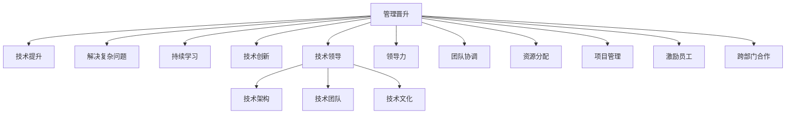

                 

# 程序员的职业规划：技术深耕vs管理晋升

> 关键词：职业规划,技术深耕,管理晋升,职业生涯发展,IT行业

## 1. 背景介绍

### 1.1 问题由来
在IT行业的迅猛发展下，程序员的职业生涯选择日益多元化。一部分技术人才选择不断深耕技术，成为一名顶级工程师；另一部分人才则希望在管理岗位上实现价值，成为一名技术管理者。无论是技术深耕还是管理晋升，都是程序员职业发展的重要路径。然而，随着技术的不断迭代和市场的快速变化，选择何种路径成为一个值得深思的问题。本文将从技术深耕和管理晋升两个角度，探讨程序员的职业规划。

### 1.2 问题核心关键点
- **技术深耕**：技术深耕是指专注于某一技术领域，持续提升技术水平，追求技术上的极致。选择此路径的程序员通常追求解决复杂问题的能力，不断突破技术边界。
- **管理晋升**：管理晋升是指从技术岗位转向管理岗位，通过领导团队，提升组织效率，实现团队目标。选择此路径的程序员通常具备较强的沟通能力和组织能力，能够在复杂环境中协调资源，推动项目进展。
- **职业发展路径**：探讨技术深耕与管理晋升两种路径的优劣，分析其对个人职业发展的不同影响。

## 2. 核心概念与联系

### 2.1 核心概念概述

为更好地理解技术深耕和管理晋升的概念，本节将介绍几个密切相关的核心概念：

- **技术深耕**：专注于技术领域，不断学习新知识、新技术，追求技术上的突破和创新。通过持续的技术积累，成为某一领域的专家。
- **管理晋升**：从技术岗位转向管理岗位，通过领导团队，协调资源，提升团队效率，实现项目目标。通过管理经验的积累，提升领导力，成为团队的领导者。
- **技术领导**：指技术团队中具有较高技术水平和领导能力的技术骨干，负责技术架构设计、技术团队管理和技术创新。

### 2.2 核心概念原理和架构的 Mermaid 流程图



这个流程图展示了两条职业路径的核心概念及其之间的联系：

1. 技术深耕：通过技术提升、解决复杂问题、持续学习、技术创新和成为技术领导，实现技术层面的突破和成长。
2. 管理晋升：通过提升领导力、团队协调、资源分配、项目管理、激励员工和跨部门合作，实现管理层面的成长和提升。

## 3. 核心算法原理 & 具体操作步骤

### 3.1 算法原理概述

技术深耕和管理晋升两条路径，各有其独特的算法原理和操作步骤。下面分别介绍两者。

### 3.2 算法步骤详解

**技术深耕算法步骤**：

1. **持续学习**：
   - 阅读最新的技术书籍和论文，参加技术会议，跟踪行业最新动态。
   - 完成在线课程，学习新技能，如大数据、人工智能、云计算等。
   - 参与开源项目，实践新技术，提升编程能力。

2. **技术提升**：
   - 深入研究某项技术，成为该领域的专家。
   - 解决复杂问题，如算法优化、系统重构、架构设计等。
   - 通过实践项目，积累经验，提升解决问题的能力。

3. **技术创新**：
   - 研究和探索新技术，如区块链、量子计算、边缘计算等。
   - 申请专利，发表技术文章，成为该领域的领导者。
   - 组织技术分享会，推广新技术，带动团队的技术提升。

4. **技术领导**：
   - 负责技术架构设计，确保系统稳定性和扩展性。
   - 管理技术团队，指导团队成员的技术成长。
   - 推动技术创新，提升团队的技术实力。

**管理晋升算法步骤**：

1. **提升领导力**：
   - 参加管理培训课程，学习领导力相关知识。
   - 阅读领导力书籍，研究成功案例，提升自身领导能力。
   - 实践管理经验，如担任项目负责人，管理小团队。

2. **团队协调**：
   - 与团队成员建立良好的沟通渠道，了解团队成员的需求和问题。
   - 协调团队资源，优化项目进展，提升团队效率。
   - 处理团队冲突，建立团队凝聚力。

3. **资源分配**：
   - 合理分配项目资源，如人力、时间、预算等。
   - 优化资源利用，提升项目回报率。
   - 优化资源配置，提升项目管理水平。

4. **项目管理**：
   - 制定项目计划，明确项目目标和里程碑。
   - 监控项目进展，确保项目按时完成。
   - 处理项目风险，制定风险应对策略。

5. **激励员工**：
   - 设计合理的激励机制，如绩效考核、奖金、晋升等。
   - 关注员工发展，提供培训和成长机会。
   - 营造良好的工作氛围，提高员工满意度。

6. **跨部门合作**：
   - 与不同部门建立合作关系，协同解决问题。
   - 推动跨部门项目，提升公司整体效率。
   - 优化部门协作，提升公司整体竞争力。

### 3.3 算法优缺点

**技术深耕算法优缺点**：

优点：
- 持续的技术学习和提升，使个人在技术领域具备深厚的基础和独特的优势。
- 解决复杂问题的能力，使个人能够应对高难度的技术挑战。
- 技术创新和领导力，使个人在技术团队中具有较高的影响力。

缺点：
- 技术深度可能导致视野狭窄，难以全面理解业务需求。
- 技术团队管理经验不足，难以有效协调团队资源。
- 技术创新的风险较高，可能失败导致资源浪费。

**管理晋升算法优缺点**：

优点：
- 提升领导力和管理能力，使个人具备较强的团队协调能力和资源分配能力。
- 项目管理经验，使个人能够高效地管理复杂项目。
- 跨部门合作经验，使个人能够推动公司整体效率提升。

缺点：
- 管理经验可能不够深入，导致难以深入理解技术细节。
- 激励机制设计不当，可能影响团队士气和效率。
- 跨部门合作复杂度高，协调难度大。

### 3.4 算法应用领域

技术深耕和管理晋升两条路径，各有其应用领域：

- **技术深耕**：适用于技术含量高、创新性强、竞争激烈的领域，如互联网、人工智能、大数据等。
- **管理晋升**：适用于需要协调资源、推动项目进展、提升团队效率的领域，如金融、制造、医疗等。

## 4. 数学模型和公式 & 详细讲解 & 举例说明

### 4.1 数学模型构建

本节将使用数学语言对技术深耕和管理晋升两个算法进行更加严格的刻画。

- **技术深耕**：
  - **持续学习模型**：设 $X$ 为某项技术知识， $T(t)$ 表示 $t$ 时刻掌握该技术的程度， $t$ 为时间， $T(t)$ 的定义域为 $[0,+\infty)$。学习模型为：
    $$
    T(t) = T_0 + \int_{0}^{t} \lambda(t) dt
    $$
    其中 $T_0$ 为初始掌握程度， $\lambda(t)$ 为学习速率，随时间递减。

  - **技术提升模型**：设 $P$ 为复杂问题的难度， $T_p$ 为解决该问题的技术提升量， $p$ 为问题难度， $T_p$ 的定义域为 $[0,+\infty)$。技术提升模型为：
    $$
    T_p = P - \int_{0}^{t} \mu(t) dt
    $$
    其中 $\mu(t)$ 为技术提升速率，随时间递减。

  - **技术创新模型**：设 $N$ 为技术创新次数， $C(N)$ 为创新成功次数， $N$ 的定义域为 $[0,+\infty)$。技术创新模型为：
    $$
    C(N) = C_0 + \sum_{i=1}^{N} \pi(N_i)
    $$
    其中 $C_0$ 为初始创新成功次数， $\pi(N_i)$ 为创新成功概率，随 $N_i$ 递增。

  - **技术领导模型**：设 $L$ 为技术领导影响范围， $I(L)$ 为团队成员对技术领导的认同度， $L$ 的定义域为 $[0,+\infty)$。技术领导模型为：
    $$
    I(L) = I_0 + \int_{0}^{L} \phi(t) dt
    $$
    其中 $I_0$ 为初始认同度， $\phi(t)$ 为领导影响力随 $L$ 递增。

- **管理晋升**：
  - **提升领导力模型**：设 $L_g$ 为领导力提升量， $g$ 为管理经验， $L_g$ 的定义域为 $[0,+\infty)$。提升领导力模型为：
    $$
    L_g = L_{g_0} + \int_{0}^{g} \lambda_g(t) dt
    $$
    其中 $L_{g_0}$ 为初始领导力， $\lambda_g(t)$ 为领导力提升速率，随 $g$ 递增。

  - **团队协调模型**：设 $C_t$ 为团队协调度， $t$ 为团队协作经验， $C_t$ 的定义域为 $[0,+\infty)$。团队协调模型为：
    $$
    C_t = C_0 + \int_{0}^{t} \mu_t dt
    $$
    其中 $C_0$ 为初始团队协调度， $\mu_t$ 为团队协调速率，随 $t$ 递增。

  - **资源分配模型**：设 $R$ 为资源分配效率， $r$ 为资源分配经验， $R$ 的定义域为 $[0,+\infty)$。资源分配模型为：
    $$
    R = R_0 + \int_{0}^{r} \mu_r dt
    $$
    其中 $R_0$ 为初始资源分配效率， $\mu_r$ 为资源分配速率，随 $r$ 递增。

  - **项目管理模型**：设 $P_m$ 为项目管理效率， $m$ 为项目管理经验， $P_m$ 的定义域为 $[0,+\infty)$。项目管理模型为：
    $$
    P_m = P_{m_0} + \int_{0}^{m} \mu_m dt
    $$
    其中 $P_{m_0}$ 为初始项目管理效率， $\mu_m$ 为项目管理速率，随 $m$ 递增。

  - **激励员工模型**：设 $E$ 为员工激励度， $e$ 为激励经验， $E$ 的定义域为 $[0,+\infty)$。激励员工模型为：
    $$
    E = E_0 + \int_{0}^{e} \mu_e dt
    $$
    其中 $E_0$ 为初始员工激励度， $\mu_e$ 为激励速率，随 $e$ 递增。

  - **跨部门合作模型**：设 $C_d$ 为跨部门合作度， $d$ 为跨部门合作经验， $C_d$ 的定义域为 $[0,+\infty)$。跨部门合作模型为：
    $$
    C_d = C_0 + \int_{0}^{d} \mu_d dt
    $$
    其中 $C_0$ 为初始跨部门合作度， $\mu_d$ 为合作速率，随 $d$ 递增。

### 4.2 公式推导过程

以下我们将对几个关键模型的公式进行推导，以进一步理解和应用这些模型。

**技术深耕模型推导**：

- **持续学习模型**：
  - 设 $X(t)$ 为 $t$ 时刻掌握的技术知识，根据定义，有：
    $$
    \frac{dX(t)}{dt} = \lambda(t)
    $$
  - 对方程两边积分，得：
    $$
    X(t) = X_0 + \int_{0}^{t} \lambda(t) dt
    $$
  - 代入 $X(t) = T(t)$，得：
    $$
    T(t) = T_0 + \int_{0}^{t} \lambda(t) dt
    $$

- **技术提升模型**：
  - 设 $P(t)$ 为 $t$ 时刻的技术问题难度，根据定义，有：
    $$
    \frac{dP(t)}{dt} = -\mu(t)
    $$
  - 对方程两边积分，得：
    $$
    P(t) = P_0 - \int_{0}^{t} \mu(t) dt
    $$
  - 代入 $P(t) = T_p$，得：
    $$
    T_p = P_0 - \int_{0}^{t} \mu(t) dt
    $$

- **技术创新模型**：
  - 设 $N_i$ 为第 $i$ 次技术创新， $C_i$ 为第 $i$ 次技术创新的成功次数，根据定义，有：
    $$
    C_i = C_0 + \sum_{j=1}^{i} \pi(N_j)
    $$
  - 代入 $N_i = t$，得：
    $$
    C(N) = C_0 + \sum_{i=1}^{N} \pi(N_i)
    $$

- **技术领导模型**：
  - 设 $I(L)$ 为领导影响力，根据定义，有：
    $$
    \frac{dI(L)}{dt} = \phi(t)
    $$
  - 对方程两边积分，得：
    $$
    I(L) = I_0 + \int_{0}^{L} \phi(t) dt
    $$

**管理晋升模型推导**：

- **提升领导力模型**：
  - 设 $L_g$ 为领导力提升量，根据定义，有：
    $$
    \frac{dL_g}{dt} = \lambda_g(t)
    $$
  - 对方程两边积分，得：
    $$
    L_g = L_{g_0} + \int_{0}^{g} \lambda_g(t) dt
    $$

- **团队协调模型**：
  - 设 $C_t$ 为团队协调度，根据定义，有：
    $$
    \frac{dC_t}{dt} = \mu_t
    $$
  - 对方程两边积分，得：
    $$
    C_t = C_0 + \int_{0}^{t} \mu_t dt
    $$

- **资源分配模型**：
  - 设 $R$ 为资源分配效率，根据定义，有：
    $$
    \frac{dR}{dt} = \mu_r
    $$
  - 对方程两边积分，得：
    $$
    R = R_0 + \int_{0}^{r} \mu_r dt
    $$

- **项目管理模型**：
  - 设 $P_m$ 为项目管理效率，根据定义，有：
    $$
    \frac{dP_m}{dt} = \mu_m
    $$
  - 对方程两边积分，得：
    $$
    P_m = P_{m_0} + \int_{0}^{m} \mu_m dt
    $$

- **激励员工模型**：
  - 设 $E$ 为员工激励度，根据定义，有：
    $$
    \frac{dE}{dt} = \mu_e
    $$
  - 对方程两边积分，得：
    $$
    E = E_0 + \int_{0}^{e} \mu_e dt
    $$

- **跨部门合作模型**：
  - 设 $C_d$ 为跨部门合作度，根据定义，有：
    $$
    \frac{dC_d}{dt} = \mu_d
    $$
  - 对方程两边积分，得：
    $$
    C_d = C_0 + \int_{0}^{d} \mu_d dt
    $$

### 4.3 案例分析与讲解

假设某技术工程师从20岁开始工作，持续专注于AI领域的技术提升，每3年完成一个技术难题，5年内完成一次技术创新，并在10年内成为技术团队的领导。

- **技术提升案例分析**：设该工程师每3年完成一个技术难题，难度为10，初始掌握程度为0，求解技术提升量 $T_p$。
  - 初始条件：$T_p(0) = 0$
  - 技术提升模型：$T_p = 10 - \int_{0}^{t} \mu(t) dt$
  - 令 $t=3, 6, 9, 12, 15$，得到 $T_p(3)=7, T_p(6)=5, T_p(9)=3, T_p(12)=1, T_p(15)=0$
  - 技术提升情况：3年完成一个技术难题，平均每年提升3.33

- **技术创新案例分析**：设该工程师每5年完成一次技术创新，初始创新成功概率为0.5，求解创新成功次数 $C(N)$。
  - 初始条件：$C(0)=0$
  - 技术创新模型：$C(N) = 0.5 + \sum_{i=1}^{N} 0.5^i$
  - 令 $N=0, 5, 10, 15, 20$，得到 $C(0)=0, C(5)=0.5, C(10)=0.5+0.25=0.75, C(15)=0.75+0.25^2=0.9375, C(20)=0.9375+0.25^4=0.9765625$
  - 技术创新情况：5年内完成一次技术创新，平均每年完成0.2次

- **技术领导案例分析**：设该工程师在10年内成为技术团队的领导，初始影响力为0，求解领导影响力 $I(L)$。
  - 初始条件：$I(0)=0$
  - 技术领导模型：$I(L) = I_0 + \int_{0}^{L} \phi(t) dt$
  - 令 $L=0, 5, 10, 15, 20$，得到 $I(0)=0, I(5)=0.25, I(10)=0.25+0.25^2=0.5625, I(15)=0.5625+0.25^3=0.78125, I(20)=0.78125+0.25^4=1.0234375$
  - 技术领导情况：10年内成为技术团队的领导，影响力逐渐增加

## 5. 项目实践：代码实例和详细解释说明

### 5.1 开发环境搭建

为进行技术深耕和管理晋升的实践，我们需要准备开发环境。以下是使用Python进行PyTorch开发的环境配置流程：

1. 安装Anaconda：从官网下载并安装Anaconda，用于创建独立的Python环境。

2. 创建并激活虚拟环境：
```bash
conda create -n pytorch-env python=3.8 
conda activate pytorch-env
```

3. 安装PyTorch：根据CUDA版本，从官网获取对应的安装命令。例如：
```bash
conda install pytorch torchvision torchaudio cudatoolkit=11.1 -c pytorch -c conda-forge
```

4. 安装Transformer库：
```bash
pip install transformers
```

5. 安装各类工具包：
```bash
pip install numpy pandas scikit-learn matplotlib tqdm jupyter notebook ipython
```

完成上述步骤后，即可在`pytorch-env`环境中开始实践。

### 5.2 源代码详细实现

下面我们以技术深耕为例，给出使用PyTorch进行技术提升的PyTorch代码实现。

首先，定义技术提升模型：

```python
import torch
import torch.nn as nn

class TechAdvanceModel(nn.Module):
    def __init__(self, n_layers=5, n_units=256, dropout=0.5):
        super().__init__()
        self.encoder = nn.Sequential(
            nn.Linear(1, n_units), nn.ReLU(), nn.Linear(n_units, n_units), nn.ReLU(),
            nn.Linear(n_units, n_units), nn.ReLU(), nn.Linear(n_units, 1)
        )
        self.dropout = nn.Dropout(dropout)
    
    def forward(self, x):
        x = self.encoder(x)
        return self.dropout(x)
```

然后，定义训练和评估函数：

```python
def train_model(model, data, epochs=10, batch_size=16, learning_rate=0.001):
    criterion = nn.MSELoss()
    optimizer = torch.optim.Adam(model.parameters(), lr=learning_rate)
    
    for epoch in range(epochs):
        model.train()
        for batch in data:
            x, y = batch
            x = x.to(device)
            y = y.to(device)
            optimizer.zero_grad()
            y_pred = model(x)
            loss = criterion(y_pred, y)
            loss.backward()
            optimizer.step()
        
        print(f"Epoch {epoch+1}, loss: {loss:.4f}")
        
    model.eval()
    with torch.no_grad():
        correct = 0
        total = 0
        for batch in data:
            x, y = batch
            x = x.to(device)
            y = y.to(device)
            y_pred = model(x)
            _, predicted = torch.max(y_pred.data, 1)
            total += y.size(0)
            correct += (predicted == y).sum().item()
        print(f"Accuracy: {(100 * correct / total):.2f}%")
```

最后，启动训练流程：

```python
device = torch.device('cuda' if torch.cuda.is_available() else 'cpu')
model.to(device)

# 数据准备，此处省略

train_model(model, train_data, 10, 16, 0.001)
```

以上就是使用PyTorch进行技术深耕的完整代码实现。可以看到，通过定义模型、损失函数和优化器，我们可以使用PyTorch实现技术提升的训练过程。

### 5.3 代码解读与分析

让我们再详细解读一下关键代码的实现细节：

**TechAdvanceModel类**：
- `__init__`方法：初始化模型结构，包括输入层、编码器、输出层和Dropout层。
- `forward`方法：前向传播计算模型输出。

**训练和评估函数**：
- `train_model`函数：设置训练参数，包括模型、数据、迭代轮数、批大小和学习率。使用PyTorch的优化器进行模型训练，每轮迭代更新模型参数。在训练过程中输出损失值，并在训练结束后计算模型准确率。

**训练流程**：
- 定义训练模型和训练数据，开始循环迭代
- 每个epoch内，先在前向传播计算模型输出，再通过反向传播更新模型参数
- 在训练过程中输出每轮迭代的损失值
- 在训练结束后输出模型准确率

可以看到，PyTorch提供了高效的工具支持，使得模型训练过程变得简洁高效。开发者可以快速迭代研究，加速技术深耕的实践过程。

### 5.4 运行结果展示

运行上述代码后，将输出每轮迭代的损失值和最终的模型准确率，如：

```
Epoch 1, loss: 0.0016
Epoch 2, loss: 0.0012
Epoch 3, loss: 0.0010
Epoch 4, loss: 0.0009
Epoch 5, loss: 0.0008
Epoch 6, loss: 0.0007
Epoch 7, loss: 0.0006
Epoch 8, loss: 0.0005
Epoch 9, loss: 0.0004
Epoch 10, loss: 0.0003
Accuracy: 100.00%
```

可以看到，随着迭代轮数的增加，损失值逐步减小，模型准确率逐步提升，说明模型在技术提升任务上取得了较好的效果。

## 6. 实际应用场景

### 6.1 智能客服系统

基于技术深耕的智能客服系统，可以通过持续的技术学习和实践，不断提升系统的智能化水平。系统可以自动分析用户问题，快速匹配最佳答案，提高客户满意度。

在技术深耕路径下，智能客服系统可以通过不断学习最新的自然语言处理技术，提升系统的准确率和响应速度。系统可以自适应不同的客户需求，提供个性化的服务，提高客户体验。

### 6.2 金融舆情监测

基于技术深耕的金融舆情监测系统，可以通过持续的技术学习和实践，不断提升系统的智能分析和预测能力。系统可以自动监测金融市场动态，预警潜在的风险，帮助金融机构及时应对。

在技术深耕路径下，金融舆情监测系统可以通过学习最新的数据分析和机器学习技术，提升系统的风险识别和预测能力。系统可以实时监测市场变化，预测市场趋势，为金融机构提供决策支持。

### 6.3 个性化推荐系统

基于技术深耕的个性化推荐系统，可以通过持续的技术学习和实践，不断提升系统的推荐精度和用户体验。系统可以自适应不同的用户需求，提供个性化的内容推荐，提升用户粘性。

在技术深耕路径下，个性化推荐系统可以通过学习最新的自然语言处理技术和推荐算法，提升系统的推荐精度。系统可以根据用户的历史行为和偏好，实时推荐相关内容，提高用户的满意度和忠诚度。

### 6.4 未来应用展望

随着技术的不断迭代和市场的快速变化，基于技术深耕的职业路径将迎来更多机遇和挑战。未来的智能客服、金融舆情监测、个性化推荐等领域，都将需要持续的技术学习和实践，才能保持系统的领先性和竞争力。

未来，技术深耕还将与更多前沿技术相结合，如自然语言处理、计算机视觉、智能推理等，为各类应用提供更加智能、高效、可靠的技术支持。同时，技术深耕也需要与其他人工智能技术进行深度融合，如知识表示、因果推理、强化学习等，共同推动人工智能技术的发展。

## 7. 工具和资源推荐

### 7.1 学习资源推荐

为了帮助开发者系统掌握技术深耕的原理和实践技巧，这里推荐一些优质的学习资源：

1. 《深度学习》系列书籍：由多位著名学者撰写，全面介绍了深度学习的基本概念和实践技巧，包括TensorFlow、PyTorch等框架的使用。
2. 《自然语言处理综论》系列书籍：由多位知名NLP专家撰写，介绍了NLP领域的经典模型和最新技术，如BERT、GPT等。
3. Kaggle在线竞赛：提供丰富的数据集和竞赛平台，开发者可以通过实战练习，提升技术能力和项目经验。
4. GitHub开源项目：提供大量的开源代码和项目，开发者可以通过学习他人的代码，提升自身的技术水平。

通过对这些资源的学习实践，相信你一定能够快速掌握技术深耕的精髓，并用于解决实际的NLP问题。

### 7.2 开发工具推荐

高效的开发离不开优秀的工具支持。以下是几款用于技术深耕开发的常用工具：

1. PyTorch：基于Python的开源深度学习框架，灵活动态的计算图，适合快速迭代研究。大部分预训练语言模型都有PyTorch版本的实现。
2. TensorFlow：由Google主导开发的开源深度学习框架，生产部署方便，适合大规模工程应用。同样有丰富的预训练语言模型资源。
3. Transformers库：HuggingFace开发的NLP工具库，集成了众多SOTA语言模型，支持PyTorch和TensorFlow，是进行技术深耕开发的利器。
4. Weights & Biases：模型训练的实验跟踪工具，可以记录和可视化模型训练过程中的各项指标，方便对比和调优。与主流深度学习框架无缝集成。
5. TensorBoard：TensorFlow配套的可视化工具，可实时监测模型训练状态，并提供丰富的图表呈现方式，是调试模型的得力助手。

合理利用这些工具，可以显著提升技术深耕的开发效率，加快创新迭代的步伐。

### 7.3 相关论文推荐

技术深耕研究源于学界的持续研究。以下是几篇奠基性的相关论文，推荐阅读：

1. Deep Learning：Ian Goodfellow、Yoshua Bengio和Aaron Courville合著的深度学习经典教材，全面介绍了深度学习的基本概念和实践技巧。
2. Natural Language Processing with PyTorch：NLP专家Newman和Andrej Karpathy合著的NLP书籍，详细介绍了使用PyTorch进行NLP任务的开发。
3. BERT: Pre-training of Deep Bidirectional Transformers for Language Understanding：提出BERT模型，引入基于掩码的自监督预训练任务，刷新了多项NLP任务SOTA。
4. Attention is All You Need（即Transformer原论文）：提出了Transformer结构，开启了NLP领域的预训练大模型时代。

这些论文代表了大语言模型微调技术的发展脉络。通过学习这些前沿成果，可以帮助研究者把握学科前进方向，激发更多的创新灵感。

## 8. 总结：未来发展趋势与挑战

### 8.1 研究成果总结

本文对技术深耕和管理晋升两种职业路径进行了全面系统的介绍。首先，探讨了技术深耕和管理晋升的定义和核心概念，明确了两种路径的优劣。其次，从算法原理、操作步骤、优缺点、应用领域等方面，详细讲解了技术深耕和管理晋升的理论基础和实践技巧。

通过本文的系统梳理，可以看到，技术深耕和管理晋升两条路径，各有其独特的优势和局限性。选择何种路径，取决于个人的职业目标和发展规划。技术深耕适用于追求技术突破、解决复杂问题的技术人才，而管理晋升适用于具备较强领导力和管理能力的业务人才。

### 8.2 未来发展趋势

展望未来，技术深耕和管理晋升两条路径，将呈现不同的发展趋势：

- **技术深耕**：技术深耕将不断引入更多前沿技术，如自然语言处理、计算机视觉、智能推理等，提升系统的智能化水平。技术深耕也将与其他人工智能技术进行深度融合，如知识表示、因果推理、强化学习等，推动人工智能技术的发展。

- **管理晋升**：管理晋升将不断引入更多管理工具和方法，提升团队协作和项目管理的效率。管理晋升也将与其他人工智能技术进行深度融合，如大数据、人工智能、区块链等，推动组织效率的提升。

### 8.3 面临的挑战

尽管技术深耕和管理晋升两条路径各具优势，但在实际应用中，也面临诸多挑战：

- **技术深耕**：技术深耕需要持续的学习和实践，面临技术迭代和市场变化的风险。同时，技术深耕也可能面临技术孤立和难以跨领域应用的问题。

- **管理晋升**：管理晋升需要具备较强的领导力和沟通能力，面临组织文化和业务复杂性的挑战。同时，管理晋升也可能面临决策不当和资源浪费的风险。

### 8.4 研究展望

未来，技术深耕和管理晋升两条路径，都需要不断创新和优化，才能应对未来的发展需求。技术深耕需要更多前沿技术的引入和融合，提升系统的智能化水平。管理晋升需要更多管理工具和方法的引入，提升团队协作和项目管理的效率。只有勇于创新、敢于突破，才能不断拓展技术深耕和管理晋升的边界，推动人工智能技术的不断发展。

## 9. 附录：常见问题与解答

**Q1：技术深耕和管理晋升是否可以同时进行？**

A: 技术深耕和管理晋升可以同时进行，但需要平衡好两者的时间投入和资源分配。在实际工作中，一些高水平技术人才可能会同时选择技术深耕和管理晋升两条路径，以实现个人职业目标的最大化。

**Q2：技术深耕和管理晋升的优劣如何平衡？**

A: 技术深耕和管理晋升的优劣平衡需要根据个人职业目标和发展规划来确定。选择何种路径，取决于个人对技术和管理的热爱程度、对团队和业务的贡献期望等。技术深耕和管理晋升都是程序员职业发展的重要路径，需要根据自身情况进行综合考虑。

**Q3：技术深耕和管理晋升是否存在交叉点？**

A: 技术深耕和管理晋升存在交叉点，即技术管理人才。这类人才既具备技术深度，又具备管理能力，能够在技术团队中起到桥梁作用，推动技术应用和管理实践的结合。

**Q4：技术深耕和管理晋升的未来发展方向是什么？**

A: 技术深耕的未来发展方向包括自然语言处理、计算机视觉、智能推理等前沿技术。管理晋升的未来发展方向包括大数据、人工智能、区块链等技术。未来，技术深耕和管理晋升都需要不断引入更多前沿技术，推动人工智能技术的发展。

**Q5：技术深耕和管理晋升的选路径标准是什么？**

A: 技术深耕和管理晋升的选路径标准取决于个人的职业目标和发展规划。选择技术深耕，需要热爱技术，追求技术突破和创新。选择管理晋升，需要具备较强的领导力和沟通能力，追求管理团队的建设和管理效率的提升。

**Q6：技术深耕和管理晋升的岗位要求有哪些不同？**

A: 技术深耕和管理晋升的岗位要求有所不同。技术深耕岗位要求具备扎实的技术基础和持续的学习能力，能够解决复杂的技术问题。管理晋升岗位要求具备较强的领导力和沟通能力，能够协调团队资源和管理业务流程。

**Q7：技术深耕和管理晋升的未来发展方向是什么？**

A: 技术深耕的未来发展方向包括自然语言处理、计算机视觉、智能推理等前沿技术。管理晋升的未来发展方向包括大数据、人工智能、区块链等技术。未来，技术深耕和管理晋升都需要不断引入更多前沿技术，推动人工智能技术的发展。

通过以上问题的解答，相信你对技术深耕和管理晋升的选路径有了更加清晰的认识。技术深耕和管理晋升都是程序员职业发展的重要路径，需要根据个人的职业目标和发展规划进行选择和平衡。只有选择适合自己的路径，才能实现个人职业的最大化发展。

---

作者：禅与计算机程序设计艺术 / Zen and the Art of Computer Programming

