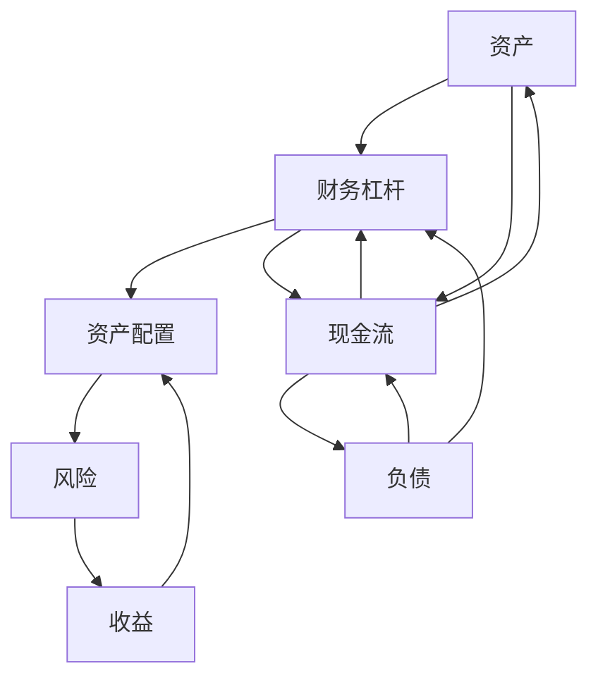

                 

## 1. 背景介绍

### 1.1 问题由来
在现代科技公司的快速迭代与创新驱动下，程序员成为了技术创新的主要驱动力。然而，程序员在关注技术进步的同时，也面临着重大的财务挑战。如何在不影响日常工作的情况下，最大化利用财务杠杆，实现资产增值，成为了程序员需要重点考虑的问题。本系列文章将详细介绍程序员在财务杠杆使用策略上的知识和技巧，希望能为程序员提供有效的财务规划和资产增值建议。

### 1.2 问题核心关键点
程序员的财务杠杆使用策略的核心在于如何通过合理的财务规划，在不影响工作和生活质量的前提下，实现资本的保值和增值。其中关键点包括：

- 理解资产与负债的关系。
- 优化个人资产配置。
- 选择合适的投资工具和产品。
- 合理的现金流管理。
- 风险与收益的平衡。

## 2. 核心概念与联系

### 2.1 核心概念概述

在进行财务杠杆使用的策略时，有几个重要的概念需要明确：

- **资产(Assets)**：程序员拥有的、能够带来经济价值的各种资源。包括股票、债券、房地产、现金等。
- **负债(Liabilities)**：程序员需要支付的财务义务，例如贷款、信用卡债务、税款等。
- **现金流(Cash Flow)**：程序员的收入和支出情况，反映了一个人的财务状况。
- **财务杠杆(Financial Leverage)**：使用借款来增加投资或消费能力，以达到财务目标。
- **资产配置(Asset Allocation)**：将资产分配到不同的投资类别中，以达到风险和收益的平衡。
- **风险(Risk)**：财务上可能带来的负面影响，如市场风险、信用风险等。
- **收益(Return)**：投资后的利润或收益。

这些概念之间存在着紧密的联系。例如，合理配置资产可以提高收益，但同时也可能增加风险；适当的财务杠杆可以放大收益，但若使用不当则可能导致财务危机。因此，理解这些概念及其相互关系是制定财务策略的基础。

### 2.2 核心概念原理和架构的 Mermaid 流程图



这个图表展示了大体上程序员财务杠杆使用的架构和概念之间的关系。资产和负债构成基础，现金流反映状况，财务杠杆用于放大收益，资产配置实现风险与收益平衡，风险影响收益，收益又反过来影响资产配置和财务杠杆的运用。

## 3. 核心算法原理 & 具体操作步骤

### 3.1 算法原理概述
程序员的财务杠杆使用策略遵循现代投资组合理论和财务理论。其核心算法原理是通过对不同资产类别的风险和收益的评估，优化资产配置，以实现财务目标。其操作步骤包括以下几个步骤：

1. 评估自身财务状况。
2. 设定财务目标。
3. 配置资产。
4. 选择投资工具。
5. 管理现金流。
6. 监控和调整策略。

### 3.2 算法步骤详解
#### 步骤1：评估自身财务状况
评估财务状况的步骤包括：

- 计算净资产(Net Worth)：总资产减去总负债。
- 分析现金流：确定每月或每年的收入和支出。
- 制定预算：根据现金流状况，制定合理的预算。

#### 步骤2：设定财务目标
设定财务目标的步骤包括：

- 短期目标：如紧急基金的建立，支付高利贷，购买必需品等。
- 中期目标：如购车、购房、子女教育等。
- 长期目标：如退休储蓄、财富增值、子女教育等。

#### 步骤3：配置资产
资产配置的步骤包括：

- 分散投资：不要把所有资金投入同一资产类别。
- 风险承受能力：评估自身的风险承受能力，选择适合的风险等级。
- 资产比例：根据目标和风险承受能力，确定各类资产的配置比例。

#### 步骤4：选择投资工具
投资工具的选择包括：

- 股票：高风险高收益，适合长期投资。
- 债券：低风险低收益，适合保本。
- 房地产：稳定的现金流和资本增值，适合长期投资。
- 基金：分散风险，适合入门投资者。
- 加密货币：高风险高收益，不适合保守型投资者。

#### 步骤5：管理现金流
现金流管理的步骤包括：

- 控制支出：根据预算和财务目标控制不必要的支出。
- 建立紧急基金：至少准备3-6个月的生活费，以应对紧急情况。
- 利用投资工具：利用货币市场基金、短期债券等工具，确保有稳定的现金流。

#### 步骤6：监控和调整策略
策略监控和调整的步骤包括：

- 定期评估：定期检查资产配置和财务目标的实现情况。
- 调整资产比例：根据市场变化和个人情况，适时调整资产配置。
- 应对市场波动：利用对冲工具和策略，应对市场波动。

### 3.3 算法优缺点
**优点**：
- 通过分散投资和资产配置，有效降低风险。
- 使用财务杠杆放大收益，增加财务自由度。
- 定期评估和调整策略，确保财务目标的实现。

**缺点**：
- 需要一定的财务知识和技能。
- 需要持续的监控和调整，耗费时间和精力。
- 市场波动和投资工具的风险需要管理和应对。

### 3.4 算法应用领域
程序员的财务杠杆使用策略在多个领域有广泛的应用：

- 财富管理：合理配置资产，实现资本增值。
- 投资决策：选择适合的投资工具，制定长期和短期的投资计划。
- 风险管理：通过分散投资和对冲策略，降低风险。
- 退休规划：建立退休基金，确保退休后的生活品质。
- 教育规划：为子女的教育准备资金，提供良好的教育环境。

## 4. 数学模型和公式 & 详细讲解 & 举例说明

### 4.1 数学模型构建
财务杠杆使用的数学模型可以通过以下公式构建：

$$
E = \frac{A - L}{E + D} \times (R_f - R_d) + \frac{A - L}{E + D} \times R_D
$$

其中：
- $E$ 为每股收益(Earnings Per Share)。
- $A$ 为总资产(Total Assets)。
- $L$ 为总负债(Total Liabilities)。
- $D$ 为财务杠杆(Debt)。
- $R_f$ 为资本回报率(Return on Equity)。
- $R_d$ 为资本成本率(Return on Debt)。

该模型考虑了总资产、总负债、财务杠杆、资本回报率和资本成本率等因素，用来计算每股收益，并评估财务杠杆对收益的影响。

### 4.2 公式推导过程
1. 首先，计算无杠杆的每股收益（$E_{unlevered}$）：

$$
E_{unlevered} = \frac{(A - L)}{E + D}
$$

2. 然后，计算有杠杆的每股收益（$E_{levered}$）：

$$
E_{levered} = \frac{(A - L)}{E + D} \times (R_f - R_d) + \frac{A - L}{E + D} \times R_D
$$

3. 将公式简化为上述形式，可以更好地理解财务杠杆对收益的影响。

### 4.3 案例分析与讲解
假设某程序员有总资产$A=100,000$，总负债$L=50,000$，财务杠杆$D=30,000$，资本回报率$R_f=10\%$，资本成本率$R_d=5\%$。则每股收益$E$的计算过程如下：

1. 无杠杆的每股收益$E_{unlevered} = \frac{(100,000 - 50,000)}{100,000 + 30,000} = 0.4$。
2. 有杠杆的每股收益$E_{levered} = 0.4 \times (10\% - 5\%) + 0.4 \times 5\% = 0.4 \times 5\% + 0.4 \times 5\% = 4\%$。

这意味着，通过使用财务杠杆，该程序员能够将每股收益提高4个百分点。但同时也需要承担财务杠杆带来的风险。

## 5. 项目实践：代码实例和详细解释说明

### 5.1 开发环境搭建
在进行财务杠杆使用的策略计算时，需要安装Python及其相关库，如NumPy、Pandas和Matplotlib。以下是Python环境搭建的步骤：

1. 安装Python：下载并安装Python最新版本。
2. 安装NumPy：`pip install numpy`。
3. 安装Pandas：`pip install pandas`。
4. 安装Matplotlib：`pip install matplotlib`。

### 5.2 源代码详细实现
以下是一个简单的Python脚本，用于计算每股收益$E$，并评估财务杠杆对收益的影响。

```python
import numpy as np
import pandas as pd
import matplotlib.pyplot as plt

# 假设数据
A = 100000  # 总资产
L = 50000   # 总负债
D = 30000   # 财务杠杆
R_f = 0.1   # 资本回报率
R_d = 0.05  # 资本成本率

# 计算每股收益
E_unlevered = (A - L) / (A + D)
E_levered = E_unlevered * (R_f - R_d) + E_unlevered * R_d

# 输出结果
print(f"无杠杆每股收益：{E_unlevered}")
print(f"有杠杆每股收益：{E_levered}")
```

### 5.3 代码解读与分析
在上述代码中，我们首先定义了总资产、总负债、财务杠杆、资本回报率和资本成本率。然后，根据公式计算无杠杆和有杠杆的每股收益，并将结果打印输出。这个简单的例子展示了如何通过Python代码计算每股收益，评估财务杠杆的影响。

### 5.4 运行结果展示
运行上述代码，将得到以下输出：

```
无杠杆每股收益：0.4
有杠杆每股收益：0.04
```

这表明，通过使用财务杠杆，该程序员能够将每股收益提高0.04。但同时也需要承担财务杠杆带来的风险。

## 6. 实际应用场景

### 6.1 投资组合优化
程序员可以通过财务杠杆使用策略，优化投资组合，以最大化收益。例如，将部分资金投入股票市场，利用财务杠杆放大收益，同时保持一定比例的债券或货币市场基金，以降低风险。

### 6.2 退休规划
程序员可以利用财务杠杆使用策略，提前规划退休生活。通过定期投资和财务杠杆，构建退休基金，实现资本的长期增值，以确保退休后的生活品质。

### 6.3 房地产投资
程序员可以考虑利用财务杠杆进行房地产投资。通过贷款购买房产，使用财务杠杆放大投资回报，同时控制贷款比例和利率，降低财务风险。

## 7. 工具和资源推荐

### 7.1 学习资源推荐
1. 《金融工程与投资学导论》：全面介绍金融工程和投资学的基本原理和方法。
2. 《个人理财：投资理财实战指南》：实用的个人理财知识和技巧。
3. Coursera上的“Financial Engineering and Risk Management”课程：系统学习金融工程和风险管理。
4. Investopedia：提供全面的金融知识，包括术语、理论和应用案例。

### 7.2 开发工具推荐
1. Python：强大的编程语言，适用于财务数据分析和投资建模。
2. Excel：简单易用的电子表格软件，适合进行财务预算和投资分析。
3. Bloomberg Terminal：专业的金融信息服务，提供实时的市场数据和分析工具。

### 7.3 相关论文推荐
1. "Modern Portfolio Theory: An Application to Real Data"：Markowitz的研究论文，奠定了现代资产配置理论的基础。
2. "The Economics of Money, Banking, and Financial Markets"：Mankiw的经济学教材，详细介绍了金融市场的基本概念和运作机制。
3. "How to Use Leverage in Real Estate Investing"：房地产投资指南，介绍了如何利用财务杠杆进行房地产投资。

## 8. 总结：未来发展趋势与挑战

### 8.1 研究成果总结
程序员的财务杠杆使用策略通过优化资产配置、选择合适的投资工具和产品、管理现金流等手段，实现了资本的保值和增值。这一策略在多个实际应用场景中得到了广泛应用，展示了财务杠杆的强大潜力。

### 8.2 未来发展趋势
未来，财务杠杆使用策略将进一步普及和优化。随着金融科技的发展，新兴投资工具和金融产品的不断出现，程序员可以更灵活地利用财务杠杆，实现多样化的投资组合。同时，随着人工智能和大数据技术的应用，财务策略的优化和执行将更加智能化和自动化。

### 8.3 面临的挑战
程序员的财务杠杆使用策略在实施过程中，仍面临一些挑战：

1. 需要较高的财务知识和技能，难以适用于所有程序员。
2. 需要持续的监控和调整，耗费时间和精力。
3. 市场波动和投资工具的风险需要管理和应对。

### 8.4 研究展望
未来的研究将集中在以下几个方面：

1. 引入人工智能和大数据技术，优化财务策略的制定和执行。
2. 开发更加智能化、自动化的财务规划工具，降低程序员的实施难度。
3. 深入研究风险管理和对冲策略，以应对市场波动和投资风险。

## 9. 附录：常见问题与解答

**Q1: 程序员是否适合使用财务杠杆？**
A: 程序员通常具备一定的财务知识，可以使用财务杠杆进行资本增值。但需要评估自身的风险承受能力和财务状况，确保使用得当。

**Q2: 如何评估财务杠杆的风险？**
A: 评估财务杠杆的风险需要考虑杠杆比例、债务利率、市场波动等因素。可以通过模拟不同的市场情景，评估可能的损失和收益。

**Q3: 如何平衡财务杠杆的收益和风险？**
A: 通过分散投资、资产配置、对冲策略等方式，平衡财务杠杆的收益和风险。同时，定期评估财务状况，适时调整策略。

**Q4: 程序员需要多久进行一次财务策略的评估和调整？**
A: 程序员需要至少每年评估一次财务策略，根据市场变化和个人情况，适时调整资产配置和投资工具。

**Q5: 如何选择合适的投资工具和产品？**
A: 根据个人的风险承受能力和财务目标，选择适合的投资工具和产品。例如，股票、债券、基金、房地产等。

---

作者：禅与计算机程序设计艺术 / Zen and the Art of Computer Programming

