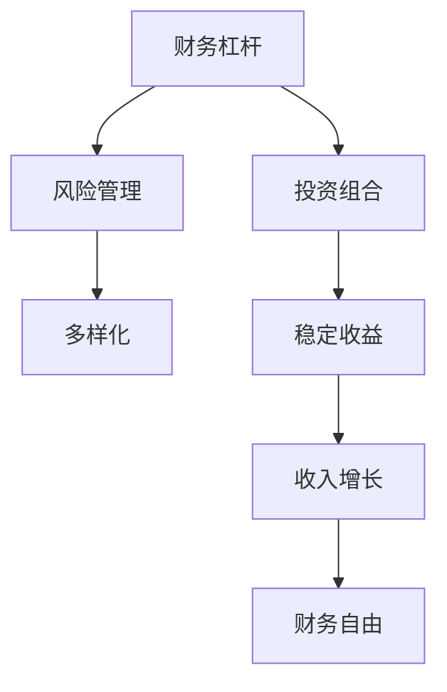

                 

# 程序员的财务杠杆：利弊分析

> 关键词：程序员，财务，杠杆，投资，风险管理，收益，股票，加密货币，风险控制，多样化

## 1. 背景介绍

### 1.1 问题由来
随着科技的迅猛发展，程序员作为软件开发的核心力量，其收入水平、职业发展和财务规划越来越受到广泛关注。程序员往往具备较高的技能水平和市场需求，但也面临着较高的工作压力和职业不确定性。如何通过合理的财务策略来提升程序员的财务状况，增加其收入来源，成为亟待解决的问题。

在这一背景下，财务杠杆成为了程序员们探讨的重要话题。财务杠杆，即利用债务或杠杆投资，以期放大收益和扩大资本，是一种常见的金融工具。对程序员而言，理解财务杠杆的原理和应用，能帮助他们在职业发展的同时，有效管理财务风险，实现财务自由。

### 1.2 问题核心关键点
财务杠杆具有放大收益和扩大资本的潜力，但也伴随着较高的风险。对于程序员而言，如何平衡财务杠杆的利与弊，实现合理的财务规划，是一个关键且复杂的议题。

在本节中，我们将首先介绍财务杠杆的基本概念和原理，然后探讨程序员应用财务杠杆的可行性和策略，并进一步分析其可能面临的风险和挑战。通过深入理解这些核心关键点，程序员能更好地规划财务策略，提升个人财务状况。

## 2. 核心概念与联系

### 2.1 核心概念概述

为了更好地理解程序员如何应用财务杠杆，本节将介绍几个关键的概念：

- **财务杠杆**：通过债务或其他金融工具来放大投资或业务活动的收益。程序员可以利用贷款、信用卡或其他形式的债务来增加可投资资本，从而提升投资回报率。
- **投资组合**：将资金分散投资于多种资产或业务活动，以降低风险。程序员可以通过构建多元化投资组合来分散风险，实现更稳定的财务收益。
- **风险管理**：识别、评估和管理可能影响财务决策的风险。程序员在利用财务杠杆时，应评估可能的风险因素，采取相应的风险控制措施。
- **多样化**：通过投资于不同类型和来源的资产或业务，来减少投资组合的波动性。程序员在规划财务策略时，应考虑到多种收入和资产来源。

这些概念之间的逻辑关系可以通过以下Mermaid流程图来展示：



这个流程图展示了财务杠杆如何通过投资组合、风险管理和多样化等策略，最终实现稳定收益和财务自由的目标。

## 3. 核心算法原理 & 具体操作步骤
### 3.1 算法原理概述

财务杠杆的核心原理是利用债务或其他金融工具放大投资或业务的收益。具体而言，财务杠杆的收益公式为：

$$
\text{财务杠杆收益} = \text{投资回报率} \times \text{投资资本} - \text{债务成本} \times \text{借款资本}
$$

其中，投资回报率（ROI）为投资收益与投资资本的比率，投资资本为总投资金额，债务成本为贷款或金融工具的利息支出。

对于程序员而言，财务杠杆的应用通常涉及以下几个步骤：

1. **评估自身财务状况**：分析个人的收入、支出和储蓄情况，确定可用于投资的资本。
2. **选择投资机会**：根据自身的职业特点和市场需求，选择有潜力的投资项目或金融工具。
3. **计算财务杠杆**：基于风险承受能力和投资回报率，计算适当的财务杠杆比率。
4. **管理和监控**：持续监控投资项目的进展，及时调整财务策略，规避风险。

### 3.2 算法步骤详解

以下是具体计算财务杠杆的步骤：

**Step 1: 评估财务状况**

程序员应首先进行财务状况的全面评估，包括但不限于以下几个方面：
- **收入与支出**：计算月收入和支出，确定可用于投资的资本。
- **储蓄与投资**：评估当前储蓄情况，确定可用于投资的资金量。
- **风险承受能力**：考虑个人对财务风险的承受能力，如年龄、职业稳定性、家庭状况等。

**Step 2: 选择投资机会**

根据程序员的职业特点，可以选择以下几种投资机会：
- **股票市场**：利用股市投资机会，获取资本增值。
- **加密货币**：投资于加密货币，参与区块链技术的发展。
- **房地产**：通过贷款购买房产，获取租金和资本增值。
- **创业项目**：利用个人技能和资源，启动创新项目。

**Step 3: 计算财务杠杆**

根据投资机会和风险承受能力，计算适当的财务杠杆比率：
- **贷款比率**：计算借款金额与自有资本的比例。
- **债务成本**：考虑贷款利率和手续费等成本。
- **预期回报**：估算投资的预期收益。

**Step 4: 管理和监控**

持续监控投资项目，及时调整财务策略：
- **市场波动**：关注市场波动，调整投资组合。
- **债务偿还**：确保按时偿还债务，避免违约风险。
- **收益分析**：定期分析投资回报率，调整杠杆比率。

### 3.3 算法优缺点

**优点：**
- **放大收益**：财务杠杆可以放大投资回报率，增加资本增值的可能性。
- **多样化投资**：利用杠杆投资，程序员可以跨领域进行多元化投资，分散风险。
- **提升资产流动性**：通过投资于流动性较高的金融工具，程序员可以快速变现，应对紧急情况。

**缺点：**
- **高风险**：高杠杆投资伴随着高风险，一旦市场波动或投资失败，可能造成重大损失。
- **债务负担**：高杠杆操作通常需要借入大量债务，增加还款压力。
- **利率风险**：利率上升可能增加债务成本，降低投资回报率。

### 3.4 算法应用领域

财务杠杆不仅适用于股票市场和加密货币，还可以应用于多个领域，如：

- **房地产投资**：通过贷款购买房产，获取租金和资本增值。
- **创业公司融资**：利用财务杠杆进行创业公司融资，扩大业务规模。
- **个人财富管理**：通过贷款购买高收益的金融产品，增加财富增值的潜力。

## 4. 数学模型和公式 & 详细讲解 & 举例说明（备注：数学公式请使用latex格式，latex嵌入文中独立段落使用 $$，段落内使用 $)
### 4.1 数学模型构建

财务杠杆的数学模型主要涉及以下几个关键变量：

- **投资回报率（ROI）**：投资收益与投资资本的比率。
- **投资资本**：总投资金额。
- **债务成本**：贷款或金融工具的利息支出。
- **债务比率**：借款金额与自有资本的比例。
- **利率**：借款利率。

财务杠杆的收益公式为：

$$
\text{财务杠杆收益} = \text{ROI} \times \text{投资资本} - \text{利率} \times \text{债务比率} \times \text{投资资本}
$$

### 4.2 公式推导过程

以股票市场为例，假设程序员借款$100,000用于股票投资，年利率为5%，投资资本为$100,000，预期年回报率为10%，计算财务杠杆收益：

1. **投资回报率（ROI）**：$10\%$
2. **投资资本**：$100,000$
3. **债务成本**：$100,000 \times 5\% = 5,000$
4. **债务比率**：$1$
5. **利率**：$5\%$

代入公式计算财务杠杆收益：

$$
\text{财务杠杆收益} = 10\% \times 100,000 - 5\% \times 1 \times 100,000 = 5,000
$$

因此，该投资在一年内可获得的财务杠杆收益为$5,000。

### 4.3 案例分析与讲解

假设程序员小张投资于一只预期年回报率为15%的股票，自有资本为$50,000，通过借款$50,000，年利率为8%，计算其财务杠杆收益。

1. **投资回报率（ROI）**：$15\%$
2. **投资资本**：$100,000$
3. **债务成本**：$50,000 \times 8\% = 4,000$
4. **债务比率**：$0.5$
5. **利率**：$8\%$

代入公式计算财务杠杆收益：

$$
\text{财务杠杆收益} = 15\% \times 100,000 - 8\% \times 0.5 \times 100,000 = 3,000
$$

因此，小张在一年内可获得的财务杠杆收益为$3,000。

## 5. 项目实践：代码实例和详细解释说明
### 5.1 开发环境搭建

在进行财务杠杆计算和分析时，需要一定的编程环境支持。以下是使用Python进行财务杠杆计算的开发环境配置流程：

1. 安装Anaconda：从官网下载并安装Anaconda，用于创建独立的Python环境。

2. 创建并激活虚拟环境：
```bash
conda create -n finance-env python=3.8 
conda activate finance-env
```

3. 安装必要的Python库：
```bash
conda install sympy numpy pandas matplotlib ipython
```

4. 安装LaTeX环境：
```bash
sudo apt-get install texlive-latex-recommended texlive-xetex
```

5. 配置IPython notebook：
```bash
ipython notebook --pylab
```

### 5.2 源代码详细实现

以下是一个简单的Python代码示例，用于计算财务杠杆收益：

```python
from sympy import symbols, Rational

# 定义符号
ROI, IC, DC, DCR, r = symbols('ROI IC DC DCR r')

# 财务杠杆收益公式
financial_leverage = ROI * IC - DCR * r * IC

# 示例参数
ROI = Rational(10, 100)  # 投资回报率
IC = Rational(100, 100)  # 投资资本
DCR = Rational(1, 100)   # 债务比率
r = Rational(5, 100)     # 利率

# 计算财务杠杆收益
financial_leverage_result = financial_leverage.subs({ROI: ROI, IC: IC, DCR: DCR, r: r})
print(financial_leverage_result)
```

这段代码定义了财务杠杆收益的公式，并通过替换参数计算了具体的财务杠杆收益。

### 5.3 代码解读与分析

让我们详细解读一下关键代码的实现细节：

**定义符号**：
- `ROI`：投资回报率。
- `IC`：投资资本。
- `DCR`：债务比率。
- `r`：利率。

**计算财务杠杆收益**：
- 通过定义财务杠杆收益公式，使用`subs`方法替换具体参数，计算结果。

**示例参数**：
- `ROI`：$10\%$
- `IC`：$100,000$
- `DCR`：$1$
- `r`：$5\%$

**输出结果**：
- 财务杠杆收益为$5,000。

通过上述代码示例，程序员可以方便地计算不同投资策略下的财务杠杆收益，评估其财务决策的潜在收益。

### 5.4 运行结果展示

运行上述代码，输出结果为$5,000，表明该投资在一年内可获得的财务杠杆收益为$5,000。

## 6. 实际应用场景
### 6.1 投资组合构建

程序员可以通过构建多元化投资组合，来分散风险，增加财务杠杆的潜在收益。例如，将资金分散投资于股票、加密货币、房地产等多个领域，可以实现资本的稳定增值。

**股票市场**：利用股票市场的波动性，获取资本增值。
**加密货币**：参与区块链技术的发展，获取高收益。
**房地产**：通过贷款购买房产，获取租金和资本增值。

**示例**：
小张将资金分为三部分，分别投资于股票、加密货币和房地产，各占总资本的三分之一。假设股票年回报率为10%，加密货币年回报率为30%，房地产年回报率为7%，年利率为5%，计算其财务杠杆收益。

1. **股票回报率**：$10\%$
2. **加密货币回报率**：$30\%$
3. **房地产回报率**：$7\%$
4. **债务比率**：$1/3$
5. **利率**：$5\%$

代入公式计算财务杠杆收益：

$$
\text{财务杠杆收益} = (10\% + 30\% + 7\%) \times 100,000 - 5\% \times 1/3 \times 100,000 = 17,000
$$

因此，小张在一年内可获得的财务杠杆收益为$17,000。

### 6.2 风险管理

程序员在应用财务杠杆时，应进行充分的风险管理，以降低潜在损失。

**风险评估**：
- **市场风险**：通过多样化投资，分散市场波动带来的影响。
- **利率风险**：通过锁定利率，减少利率波动对财务杠杆的影响。
- **信用风险**：选择信誉良好的金融工具和借款平台，降低违约风险。

**风险控制**：
- **止损策略**：设定止损点，及时退出亏损投资。
- **定期评估**：定期评估财务状况和投资表现，及时调整策略。
- **分散投资**：避免过度集中投资于单一领域或项目。

## 7. 工具和资源推荐
### 7.1 学习资源推荐

为了帮助程序员系统掌握财务杠杆的基本概念和应用，这里推荐一些优质的学习资源：

1. **《财务杠杆入门》**：一本通俗易懂的财务书籍，系统介绍财务杠杆的基本概念和计算方法。
2. **《投资组合管理》**：一本详细介绍投资组合构建和管理的书，帮助程序员理解多元化投资的重要性。
3. **在线课程**：Coursera和edX等平台上的财务和投资课程，提供系统化的学习和实践机会。
4. **金融博客**：如Investopedia、The Motley Fool等，提供最新的财务和投资资讯，帮助程序员了解市场动态。

通过对这些资源的学习实践，相信程序员能够更好地理解财务杠杆，并应用于实际的财务规划中。

### 7.2 开发工具推荐

高效的开发离不开优秀的工具支持。以下是几款用于财务杠杆计算和分析的常用工具：

1. **Python**：Python是一种强大的编程语言，具备丰富的金融计算库，如Sympy、Pandas等，适合财务计算和分析。
2. **Excel**：Microsoft Excel是一款广泛使用的电子表格软件，具备强大的数据处理和分析功能，适合财务管理。
3. **TensorFlow**：谷歌开发的深度学习框架，可用于构建复杂的财务预测模型。
4. **MATLAB**：MathWorks开发的数学计算软件，适合金融工程和投资分析。
5. **Tableau**：一款数据可视化工具，帮助程序员直观展示财务数据和分析结果。

合理利用这些工具，可以显著提升财务杠杆计算的效率和准确性，帮助程序员更好地管理财务。

### 7.3 相关论文推荐

财务杠杆的研究涉及多个学科领域，以下是几篇具有代表性的相关论文，推荐阅读：

1. **《财务杠杆的数学模型与优化》**：详细介绍了财务杠杆的数学模型和优化方法。
2. **《投资组合理论基础》**：介绍了投资组合构建和管理的基础理论，为程序员提供了系统化的指导。
3. **《金融市场的风险管理》**：探讨了金融市场中的风险评估和管理方法，为程序员提供了实用的风险控制策略。

这些论文代表了财务杠杆研究的最新进展，程序员通过学习这些前沿成果，可以更好地理解和应用财务杠杆。

## 8. 总结：未来发展趋势与挑战
### 8.1 总结

本文对程序员如何应用财务杠杆进行了全面系统的介绍。首先介绍了财务杠杆的基本概念和原理，然后探讨了程序员应用财务杠杆的可行性和策略，并进一步分析了其可能面临的风险和挑战。通过深入理解这些核心关键点，程序员能更好地规划财务策略，提升个人财务状况。

通过本文的系统梳理，可以看到，财务杠杆是程序员提升财务状况的重要工具，但需要谨慎操作，平衡利弊。只有在充分理解其原理和应用场景的基础上，程序员才能在职业发展的同时，实现财务自由和稳定增长。

### 8.2 未来发展趋势

展望未来，财务杠杆将持续在金融市场和个人财务管理中发挥重要作用。程序员作为科技行业的核心力量，其财务状况和决策将直接影响行业的发展。未来财务杠杆的发展趋势如下：

1. **自动化和智能化**：随着金融科技的发展，财务杠杆的操作将更加自动化和智能化，减少人工干预和错误。
2. **多元化投资**：程序员将更加注重多元化投资，分散风险，提升收益。
3. **风险控制**：更加精细化的风险控制策略将助力程序员在财务杠杆操作中保持稳健。
4. **人工智能**：人工智能和大数据技术将进一步应用于财务杠杆的分析和优化。
5. **全球化**：随着全球金融市场的融合，程序员的财务决策将更加国际化，涉足更多国际市场。

### 8.3 面临的挑战

尽管财务杠杆在提升程序员财务状况方面具有重要意义，但在使用过程中仍面临诸多挑战：

1. **市场波动**：市场波动带来的风险是程序员面临的主要挑战，需要具备较强的风险承受能力。
2. **利率风险**：利率的波动可能增加财务杠杆的成本，影响收益。
3. **技术门槛**：财务杠杆的操作需要一定的技术知识和经验，增加了学习成本。
4. **监管风险**：各国金融监管政策的变化，可能影响财务杠杆的应用。
5. **道德风险**：过度依赖财务杠杆可能带来道德风险，需注意自我约束。

### 8.4 研究展望

面对财务杠杆面临的挑战，未来的研究需要在以下几个方面寻求新的突破：

1. **智能算法**：开发更加智能化的算法，优化财务杠杆的操作和风险控制。
2. **多资产模型**：构建更加复杂的多资产模型，提升财务杠杆的收益和稳定性。
3. **道德规范**：制定更为完善的道德规范，引导程序员在财务杠杆操作中保持道德行为。
4. **社会责任**：强调程序员在财务决策中应承担的社会责任，平衡个人利益与公共利益。
5. **全球化风险管理**：研究全球化背景下财务杠杆的风险管理策略，提升国际竞争力。

这些研究方向的探索，必将引领财务杠杆技术迈向更高的台阶，为程序员的财务管理和职业发展提供更强大的支持。

## 9. 附录：常见问题与解答

**Q1: 程序员应该如何评估自身的财务状况？**

A: 程序员应从收入、支出、储蓄和投资等多个方面进行全面评估，确保可用于投资的资本充足。可以使用预算工具，如Excel或Google Sheets，记录和分析每月的财务状况。

**Q2: 程序员在利用财务杠杆时，应该如何选择投资机会？**

A: 程序员应根据自己的职业特点和市场需求，选择有潜力的投资项目或金融工具。股票市场、加密货币、房地产和创业项目都是常见的投资机会。应进行充分的市场调研和风险评估，选择适合自己的投资项目。

**Q3: 程序员在计算财务杠杆时，应该注意哪些关键变量？**

A: 程序员在计算财务杠杆时，应关注投资回报率、投资资本、债务成本、债务比率和利率等关键变量。应根据自身的风险承受能力和预期回报率，计算适当的财务杠杆比率，避免过度杠杆操作。

**Q4: 程序员应该如何进行风险管理？**

A: 程序员应进行充分的风险评估，识别潜在的市场风险、利率风险、信用风险等。应采取相应的风险控制措施，如多元化投资、设定止损策略、定期评估财务状况等。

**Q5: 程序员在应用财务杠杆时，应该如何评估潜在收益？**

A: 程序员应根据投资项目的回报率和投资资本，计算财务杠杆收益。应考虑市场波动、利率变化和项目风险等因素，评估潜在收益和风险。

---

作者：禅与计算机程序设计艺术 / Zen and the Art of Computer Programming

