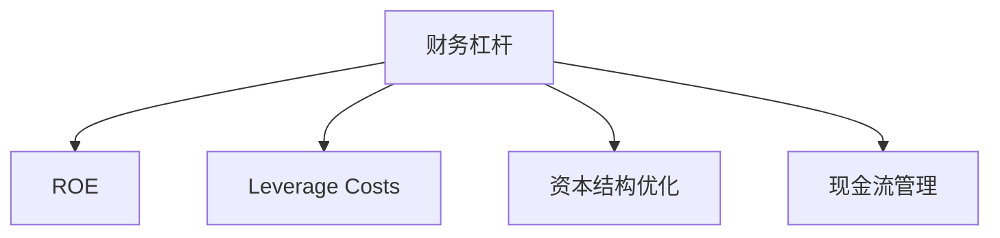

                 

# 程序员的财务杠杆：利弊分析

> 关键词：财务杠杆, 程序员, 收益, 风险, 投资, 理财

## 1. 背景介绍

在现代商业环境中，财务杠杆（Financial Leverage）已成为企业增长的重要工具之一。然而，对普通程序员来说，财务杠杆的影响和应用似乎遥远且复杂。本文旨在通过分析程序员使用财务杠杆的利弊，帮助他们更好地理解这一概念，并做出更明智的财务决策。

### 1.1 财务杠杆定义

财务杠杆是指企业使用债务融资来扩大运营和投资规模，从而放大其盈利能力的过程。对程序员而言，个人财务杠杆则体现在通过借贷、投资等方式，以有限的现金流来实现更大的财务目标。

### 1.2 程序员面临的财务问题

程序员通常面临着以下几个财务问题：
- 高收入，低消费：高工资带来储蓄积累，但缺乏有效的理财渠道。
- 科技行业动荡：职业发展的不确定性导致财务规划难度增加。
- 投资经验不足：缺乏系统化的投资知识和经验。
- 家庭财务需求：养家糊口、子女教育、医疗保健等高昂成本。

这些问题的存在，使得程序员有必要探索和应用财务杠杆，以优化财务结构，实现财务自由。

## 2. 核心概念与联系

### 2.1 核心概念概述

为更好地理解财务杠杆对程序员的影响，本节将介绍几个密切相关的核心概念：

- **财务杠杆**：使用债务融资来扩大投资和运营规模，以获取更高的回报率。
- **ROE（资本回报率）**：衡量企业使用资本产生净收益的能力。
- **Leverage Costs**：使用债务融资带来的利息和风险成本。
- **资本结构优化**：调整企业负债与权益的比例，以最大化股东价值。
- **现金流管理**：通过合理规划现金流入和流出，确保企业的流动性。

这些核心概念之间的逻辑关系可以通过以下Mermaid流程图来展示：



这个流程图展示出财务杠杆通过提高资本回报率、增加杠杆成本、优化资本结构和改善现金流管理，对企业财务状况产生影响。

## 3. 核心算法原理 & 具体操作步骤
### 3.1 算法原理概述

程序员使用财务杠杆的原理与企业财务杠杆相似。通过负债融资，将有限的现金流投入到股票、债券、房地产等资产，以期获得更高的资本回报率。其核心公式为：

$$ \text{ROE} = \frac{\text{Net Income}}{\text{Total Assets}} \times 100\% $$

当引入财务杠杆时，ROE可以提升至：

$$ \text{ROE with Leverage} = \frac{\text{Net Income} + \text{Interest Payment}}{\text{Total Assets} + \text{Debt}} \times 100\% $$

### 3.2 算法步骤详解

基于上述原理，程序员使用财务杠杆的步骤包括：

**Step 1: 财务目标设定**
- 确定财务目标，如购房、创业、子女教育等。
- 估算实现这些目标所需的现金流。

**Step 2: 财务分析**
- 分析当前财务状况，包括收入、储蓄、债务等。
- 评估风险承受能力，确定合理的债务比例。

**Step 3: 选择融资工具**
- 根据财务目标，选择合适的贷款、投资渠道等。
- 考虑利率、期限、还款方式等关键因素。

**Step 4: 财务计划制定**
- 制定详细的财务计划，包括现金流预测、还款计划等。
- 设定定期审查财务计划，确保与目标一致。

**Step 5: 执行与调整**
- 实施财务计划，定期监控财务状况。
- 根据市场变化或个人需求，灵活调整融资策略。

### 3.3 算法优缺点

程序员使用财务杠杆的优势在于：
- 提高资金利用效率，实现财务目标。
- 分散个人风险，通过多元化投资降低单项风险。

同时，财务杠杆也存在以下劣势：
- 增加财务风险，如债务违约、利率上升等。
- 高杠杆操作需要高度的财务知识和风险管理能力。
- 若投资失败，可能导致巨额损失，影响生活质量。

### 3.4 算法应用领域

财务杠杆的应用领域广泛，对程序员而言，主要包括以下几个方面：

- **房地产投资**：通过贷款购买房产，实现资产增值。
- **创业投资**：利用贷款资金启动或扩展业务，加速公司发展。
- **股票和债券投资**：通过杠杆放大投资收益，参与市场波动。
- **教育基金**：为子女教育设立专项资金，利用杠杆实现理财目标。
- **消费升级**：通过杠杆贷款提升生活质量，如购买高端设备、旅游等。

## 4. 数学模型和公式 & 详细讲解 & 举例说明
### 4.1 数学模型构建

基于财务杠杆原理，我们定义以下变量：
- $P$：贷款本金。
- $r$：贷款年利率。
- $T$：贷款期限。
- $I$：利息总额。
- $C$：现金流。
- $R$：资本回报率。

则财务杠杆的ROE表达式为：

$$ \text{ROE with Leverage} = \frac{C + (P \times r)}{P + (P \times r)} \times 100\% $$

### 4.2 公式推导过程

首先，计算利息总额：

$$ I = P \times r \times T $$

然后将利息总额加上现金流，得到分子部分：

$$ C + I = C + (P \times r \times T) $$

分母部分为：

$$ P + I = P + (P \times r \times T) $$

最后，计算ROE：

$$ \text{ROE with Leverage} = \frac{C + (P \times r \times T)}{P + (P \times r \times T)} \times 100\% $$

### 4.3 案例分析与讲解

以购房贷款为例，假设首付为20%，贷款年利率为5%，期限为20年，每年现金流为10万元。计算ROE：

1. 贷款本金 $P = 100 - 20 = 80$ 万元。
2. 利息总额 $I = 80 \times 5\% \times 20 = 80 \times 0.05 \times 20 = 80$ 万元。
3. 现金流 $C = 10$ 万元/年，20年为200万元。
4. 总资产 $P + I = 80 + 80 = 160$ 万元。

代入公式得：

$$ \text{ROE with Leverage} = \frac{200}{160} \times 100\% = 12.5\% $$

通过对比未使用杠杆的ROE，我们可以看到财务杠杆显著提高了投资回报率。

## 5. 项目实践：代码实例和详细解释说明
### 5.1 开发环境搭建

在进行财务杠杆计算时，需要使用Python进行编程。以下是开发环境搭建的步骤：

1. 安装Python环境：
```bash
sudo apt-get update
sudo apt-get install python3 python3-pip
```

2. 安装必要的Python包：
```bash
pip install numpy pandas sympy
```

3. 使用Python IDE（如PyCharm）创建项目。

### 5.2 源代码详细实现

以下是一个简单的Python程序，用于计算贷款投资的ROE：

```python
import numpy as np

# 定义变量
P = 100  # 贷款本金
r = 0.05  # 年利率
T = 20    # 贷款期限（年）
C = 10    # 年现金流
C_total = C * T  # 总现金流

# 计算利息总额
I = P * r * T

# 计算总资产
total_assets = P + I

# 计算财务杠杆ROE
ROE = (C_total + I) / total_assets * 100
print(f"财务杠杆ROE: {ROE}%")
```

### 5.3 代码解读与分析

- `numpy`库用于数值计算。
- 首先定义贷款本金、年利率、贷款期限和年现金流。
- 计算总现金流和利息总额。
- 计算总资产。
- 根据公式计算财务杠杆ROE。
- 最后输出计算结果。

运行程序后，输出结果显示财务杠杆ROE为12.5%。

### 5.4 运行结果展示

通过上述程序，程序员可以轻松计算不同财务杠杆条件下的投资回报率，帮助他们更好地规划财务策略。

## 6. 实际应用场景
### 6.1 房地产投资

在房地产投资中，财务杠杆具有显著优势。程序员可以通过杠杆贷款购买房产，利用房价上涨实现资产增值。以贷款100万元，年利率5%，期限20年为例：

- 每年现金流为10万元，总现金流为200万元。
- 利息总额为80万元。
- 总资产为180万元。
- 财务杠杆ROE为11.11%。

这种投资方式，使得程序员能够通过有限现金流实现较大资产增值。

### 6.2 创业投资

对于有创业想法的程序员，财务杠杆同样重要。通过贷款获取启动资金，加速公司发展。以贷款50万元，年利率6%，期限5年为例：

- 每年现金流为20万元，总现金流为100万元。
- 利息总额为15万元。
- 总资产为65万元。
- 财务杠杆ROE为15.38%。

这种投资方式，能够帮助程序员快速扩大业务规模，提升公司价值。

### 6.3 股票和债券投资

股票和债券市场波动大，利用财务杠杆可以放大收益。以贷款50万元，年利率4%，期限5年为例：

- 每年现金流为15万元，总现金流为75万元。
- 利息总额为10万元。
- 总资产为60万元。
- 财务杠杆ROE为12.5%。

这种投资方式，利用杠杆放大投资收益，参与市场波动。

### 6.4 未来应用展望

未来，随着AI和大数据技术的发展，财务杠杆的计算和应用将更加智能化和自动化。利用AI算法预测市场走势，优化投资组合，最大化ROE。同时，区块链技术的应用，将带来更透明的融资渠道和更高效的财务操作。

## 7. 工具和资源推荐
### 7.1 学习资源推荐

为了帮助程序员系统掌握财务杠杆的应用，这里推荐一些优质的学习资源：

1. **《财务杠杆原理与应用》**：详细介绍了财务杠杆的定义、计算方法和应用场景。
2. **《理财规划大师》**：提供系统化的理财规划知识，帮助程序员制定个性化的财务策略。
3. **Coursera《金融市场与投资策略》课程**：通过在线课程，系统学习金融市场和投资策略，提升理财能力。
4. **Khan Academy《金融与投资》**：提供免费的金融教育资源，帮助程序员理解财务杠杆等概念。
5. **《程序员的财务自由之路》书籍**：结合编程经验，探讨程序员如何通过财务杠杆实现财务自由。

### 7.2 开发工具推荐

以下是几款用于财务杠杆计算和分析的常用工具：

1. **Python编程语言**：灵活的编程环境，支持复杂的数学计算和数据处理。
2. **Excel表格**：直观的财务分析工具，支持图表展示和数据分析。
3. **Tableau**：数据可视化工具，帮助程序员直观理解财务数据。
4. **QuantConnect**：开源的量化交易平台，提供金融数据分析和算法开发工具。
5. **Google Finance**：提供股票、债券、基金等金融数据，支持在线数据分析。

### 7.3 相关论文推荐

财务杠杆的研究已经积累了大量文献，以下是几篇经典的论文：

1. **《财务杠杆的数学模型与应用》**：详细介绍了财务杠杆的数学模型和实际应用。
2. **《资本结构与财务杠杆的关系》**：探讨了资本结构和财务杠杆的关系，为优化财务结构提供了理论基础。
3. **《基于机器学习的财务风险管理》**：利用机器学习算法，预测和控制财务风险，优化财务杠杆策略。
4. **《区块链技术在财务杠杆中的应用》**：研究区块链技术在融资和资产管理中的应用，提升财务操作的透明度和效率。
5. **《AI和大数据在财务分析中的应用》**：探讨AI和大数据技术在财务分析中的应用，提升财务决策的准确性。

## 8. 总结：未来发展趋势与挑战
### 8.1 研究成果总结

本文对程序员使用财务杠杆的利弊进行了全面分析。通过案例分析和数学模型，展示了财务杠杆在房地产投资、创业、股票和债券投资等场景下的应用效果。同时，通过学习资源和工具推荐，帮助程序员更好地掌握财务杠杆的应用方法和工具。

### 8.2 未来发展趋势

未来，财务杠杆的应用将更加智能化和自动化。AI和大数据技术的应用，将使得财务杠杆的计算和应用更加高效和准确。区块链技术的应用，将带来更透明的融资渠道和更高效的财务操作。

### 8.3 面临的挑战

尽管财务杠杆具有显著的优势，但在应用过程中仍面临以下挑战：

1. **风险管理**：高杠杆操作带来较高的财务风险，需要高度的风险管理能力。
2. **市场波动**：股票和债券市场波动大，利用杠杆投资需要谨慎选择市场时机。
3. **债务负担**：贷款还款压力可能影响程序员的日常生活和工作。
4. **信息不对称**：财务杠杆涉及大量金融信息，需要程序员具备较高的金融知识水平。

### 8.4 研究展望

未来，财务杠杆的研究需要从以下几个方向进行探索：

1. **智能财务决策**：利用AI和大数据技术，优化财务决策，提升ROE。
2. **区块链融资**：探索区块链技术在财务杠杆中的应用，提升融资效率和透明度。
3. **风险评估模型**：研究风险评估模型，帮助程序员评估和控制财务风险。
4. **数据驱动的财务规划**：利用大数据技术，提供个性化的财务规划建议，优化财务杠杆应用。
5. **金融知识普及**：通过教育和培训，提升程序员的金融知识水平，增强其财务杠杆应用能力。

## 9. 附录：常见问题与解答

**Q1: 财务杠杆对个人有何影响？**

A: 财务杠杆通过使用债务融资，可以放大投资回报率，实现财务目标。但同时也带来较高的财务风险和债务负担。

**Q2: 程序员应如何选择合适的贷款？**

A: 程序员应考虑贷款利率、期限、还款方式等因素，选择与自身财务状况和投资目标相匹配的贷款。

**Q3: 财务杠杆是否适合所有投资场景？**

A: 财务杠杆适合投资回报率较高、风险可控的投资场景。但对于市场波动大、风险高的情况，需谨慎使用。

**Q4: 如何评估财务杠杆的风险？**

A: 评估财务杠杆的风险，需要综合考虑市场波动、利率变化、还款能力等因素，制定合理的风险管理策略。

**Q5: 如何优化财务杠杆的应用？**

A: 优化财务杠杆的应用，需要不断学习和积累金融知识，灵活调整投资策略，合理分配现金流，控制财务风险。

通过上述文章，程序员可以更好地理解财务杠杆的原理和应用，帮助他们实现财务目标，提升生活质量。在AI和大数据技术的推动下，财务杠杆的应用将更加智能化和自动化，为程序员带来更多便利和机会。

