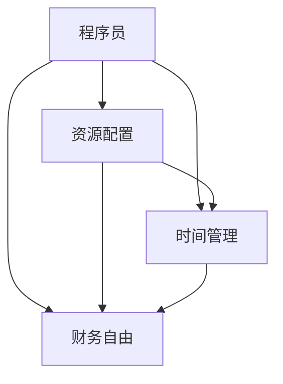

                 

# 程序员的财务自由：极简主义实践

> 关键词：程序员，财务自由，极简主义，编程，财务管理

## 1. 背景介绍

### 1.1 问题由来
在当今信息爆炸的时代，程序员作为技术人才的重要组成部分，其职业特点和收入水平常常成为讨论的热点。然而，程序员虽工作在高薪行业，但生活成本和支出同样不菲，因此实现财务自由（Financial Independence）成为许多程序员追求的目标。为了达成这一目标，程序员需要掌握有效的财务管理策略，而极简主义（Minimalism）作为一种生活哲学，不仅能够提升生活质量，还能帮助程序员在理财方面做出更好的决策。

### 1.2 问题核心关键点
极简主义强调“少即是多”，主张通过减少不必要的开支和物品，专注于重要事物，从而提高生活质量和财务自由度。对于程序员来说，这意味着通过简化生活和工作方式，优化资源配置，专注于编程和提升技能，最终实现更加自由和充实的个人生活。

### 1.3 问题研究意义
研究程序员如何在工作中实践极简主义，有助于理解如何在快节奏和高压力的工作环境中，通过精简生活、管理财务，达到个人成长和财务自由的目标。同时，这一研究对于程序员群体乃至全社会，都有积极意义，能够提升财务管理意识，促进健康生活和工作方式的传播。

## 2. 核心概念与联系

### 2.1 核心概念概述

为更好地理解程序员如何在财务自由实践中运用极简主义，本节将介绍几个关键概念：

- **程序员（Programmer）**：在IT行业中，通过编写、测试和维护代码来开发软件的人。
- **财务自由（Financial Independence）**：通过投资或创业等方式，使被动收入（如租金、股息、利息）超过生活成本，实现经济上的独立和自由。
- **极简主义（Minimalism）**：一种生活哲学，主张去除多余，回归简约，提高生活质量。
- **资源配置（Resource Allocation）**：将有限的资源（如时间、金钱）分配到最有效的地方。
- **时间管理（Time Management）**：通过有效规划和管理时间，提高效率，减少浪费。
- **投资（Investment）**：通过将资金投入到生产性资产中，获取增值。

这些概念之间的关系可以通过以下Mermaid流程图来展示：



这个流程图展示了程序员如何通过简化资源配置和时间管理，最终达到财务自由的目标。

## 3. 核心算法原理 & 具体操作步骤
### 3.1 算法原理概述

基于极简主义的程序员财务自由实践，本质上是一个目标导向的资源管理过程。其核心思想是：通过减少不必要的开支和物质需求，优化时间和资源配置，专注于编程和技能提升，从而提高工作效率和收入，实现财务自由。

形式化地，假设一个程序员的初始年收入为 $I$，初始生活成本为 $C$，期望在 $T$ 年内达到财务自由，即被动收入超过生活成本。假设每年收入增长率为 $r$，生活成本变化率为 $c$，则目标函数为：

$$
\min_{a} \sum_{t=0}^{T-1} (a \cdot (1+r)^t \cdot (1+c)^t - C) \text{ 其中 } a \text{ 为每年投资金额}
$$

目标是最小化投资总额，同时满足财务自由的条件。

### 3.2 算法步骤详解

基于极简主义的程序员财务自由实践，通常包括以下几个关键步骤：

**Step 1: 确定目标和资源**

- 设定财务自由的目标时间 $T$，如5年、10年。
- 评估当前的收入 $I$ 和生活成本 $C$。
- 估计未来的收入增长率 $r$ 和成本变化率 $c$。

**Step 2: 制定预算和计划**

- 根据收入和支出情况，制定严格的预算，区分必要开支和可选开支。
- 优先保障必要开支，如房租、食品等，再优化可选开支，如娱乐、旅游等。
- 设置储蓄和投资的目标，如建立紧急基金、购买房产或股票等。

**Step 3: 优化资源配置**

- 根据预算和目标，调整收入分配，确保用于投资的资金最大化。
- 选择高效的投资渠道，如股票、基金、房地产等，分散风险。
- 利用复利效应，定期增加投资金额，提高投资回报率。

**Step 4: 时间管理和技能提升**

- 优化时间管理，减少无效工作，提升编程效率和质量。
- 定期学习新技能，提升技术能力和职业竞争力。
- 利用业余时间进行投资和学习，进一步增加收入来源。

**Step 5: 定期评估和调整**

- 定期检查财务状况，评估投资回报和进度。
- 根据实际情况调整预算和投资策略，应对变化。
- 持续改进时间管理和技能提升，确保财务自由的实现。

### 3.3 算法优缺点

基于极简主义的程序员财务自由实践，具有以下优点：

1. **提高生活质量**：通过减少不必要的开支，专注于重要的事物，能够提升生活幸福感。
2. **优化资源配置**：合理分配时间和金钱，能够最大化投资回报。
3. **提升职业竞争力**：通过不断学习和提升技能，保持职业竞争优势。
4. **降低财务风险**：通过分散投资，降低单一风险，保障财务安全。

同时，该方法也存在一定的局限性：

1. **需要严格自律**：要求程序员能够坚持预算和计划，抵制消费诱惑。
2. **难以应对突发情况**：极简主义可能难以应对生活中的突发事件和变化。
3. **个人牺牲较大**：需要放弃一些娱乐和消费，可能影响生活质量。
4. **需要长期坚持**：财务自由是一个长期目标，需要持续的耐心和毅力。

尽管存在这些局限性，但就目前而言，基于极简主义的程序员财务自由实践是最主流且实用的财务策略。未来相关研究的重点在于如何进一步降低财务自由的时间要求，提高投资效率，同时兼顾生活的质量和多样性等因素。

### 3.4 算法应用领域

基于极简主义的程序员财务自由实践方法，已经在软件开发、创业、投资等多个领域得到了广泛应用，具体如下：

- **软件开发**：通过减少不必要的开支，专注于技术提升，使程序员能够更快实现技术突破，提升编程效率和质量。
- **创业**：通过优化资源配置和投资，合理规划资金，降低创业风险，提高创业成功率。
- **投资**：通过分散投资渠道，降低单一风险，实现更高的投资回报率，保障财务安全。

除了这些主要应用领域外，极简主义在个人生活、家庭理财等方面也有重要意义，能够帮助更多人实现健康、高效的生活方式。

## 4. 数学模型和公式 & 详细讲解 & 举例说明

### 4.1 数学模型构建

本节将使用数学语言对基于极简主义的程序员财务自由实践过程进行更加严格的刻画。

假设一个程序员的初始年收入为 $I$，初始生活成本为 $C$，期望在 $T$ 年内达到财务自由，即被动收入超过生活成本。假设每年收入增长率为 $r$，生活成本变化率为 $c$，则目标函数为：

$$
\min_{a} \sum_{t=0}^{T-1} (a \cdot (1+r)^t \cdot (1+c)^t - C) \text{ 其中 } a \text{ 为每年投资金额}
$$

该模型中，$a$ 为每年投资金额，$r$ 为收入增长率，$c$ 为生活成本变化率，$t$ 为年数，$C$ 为生活成本。

### 4.2 公式推导过程

以下我们以程序员期望在5年内达到财务自由为例，推导最小化投资总额的公式。

假设每年投资金额为 $a$，年利率为 $r=5\%$，生活成本增长率为 $c=3\%$。则5年后的总投资收益为：

$$
\text{总收益} = \sum_{t=0}^{4} a \cdot (1+0.05)^t \cdot (1+0.03)^t
$$

财务自由的条件为总收益超过总生活成本：

$$
a \cdot (1+0.05)^0 \cdot (1+0.03)^0 + a \cdot (1+0.05)^1 \cdot (1+0.03)^1 + \ldots + a \cdot (1+0.05)^4 \cdot (1+0.03)^4 > 5C
$$

化简后得：

$$
a \cdot \frac{(1+0.05)^5 - 1}{0.05} \cdot \frac{(1+0.03)^5 - 1}{0.03} > 5C
$$

进一步化简，得：

$$
a > \frac{5C}{(1+0.05)^5 - 1} \cdot \frac{(1+0.03)^5 - 1}{0.03 \cdot (1.05)^5}
$$

将具体数值代入计算，得：

$$
a > \frac{5C}{(1.05)^5 - 1} \cdot \frac{(1.03)^5 - 1}{0.03 \cdot (1.05)^5} \approx \frac{C}{0.13}
$$

即每年投资金额应至少为生活成本的 $\frac{1}{0.13} \approx 7.69$ 倍，才能在5年内达到财务自由。

### 4.3 案例分析与讲解

假设一位程序员的初始年收入为 $60,000$ 美元，初始生活成本为 $30,000$ 美元，期望在5年内达到财务自由。根据公式，每年投资金额应至少为 $30,000 \times 7.69 \approx 230,670$ 美元。这显然超出了大多数程序员的承受能力。

为了实现这一目标，程序员需要采取更加严格的预算和投资策略。例如，可以考虑将收入的40%用于投资，60%用于生活开支和储蓄，同时保持高储蓄率，逐步累积财富。此外，还可以利用多种投资渠道，如股票、基金、房地产等，分散风险，提高投资回报率。

## 5. 项目实践：代码实例和详细解释说明
### 5.1 开发环境搭建

在进行程序员财务自由实践的代码实现前，我们需要准备好开发环境。以下是使用Python进行财务计算的开发环境配置流程：

1. 安装Anaconda：从官网下载并安装Anaconda，用于创建独立的Python环境。

2. 创建并激活虚拟环境：
```bash
conda create -n finance-env python=3.8 
conda activate finance-env
```

3. 安装Python财务库：
```bash
conda install pandas
```

4. 安装Python投资库：
```bash
conda install pyfolio -c conda-forge
```

5. 安装Python绘图库：
```bash
conda install matplotlib
```

完成上述步骤后，即可在`finance-env`环境中开始财务计算的代码实现。

### 5.2 源代码详细实现

下面我们以程序员在5年内达到财务自由为例，给出使用Python进行财务计算的代码实现。

```python
import pandas as pd
import matplotlib.pyplot as plt
import numpy as np

# 初始收入和成本
initial_income = 60000
initial_cost = 30000

# 年利率和成本增长率
interest_rate = 0.05
cost_growth_rate = 0.03

# 目标年数
target_years = 5

# 计算每年投资金额
total_cost = initial_cost * np.power(1 + cost_growth_rate, target_years)
investment_per_year = total_cost / (np.power(1 + interest_rate, target_years) - 1)

# 计算总收益
total_investment = investment_per_year * target_years
total_return = np.power(1 + interest_rate, target_years) * total_investment

# 计算每年实际收入
actual_income = initial_income + total_investment
actual_cost = initial_cost * np.power(1 + cost_growth_rate, target_years)

# 计算每年净收入
net_income_per_year = actual_income - actual_cost

# 输出结果
print(f"每年投资金额: {investment_per_year}")
print(f"总收益: {total_return}")
print(f"每年净收入: {net_income_per_year}")

# 绘制净收入变化图
years = np.arange(0, target_years + 1)
net_income = np.zeros(target_years + 1)
for t in range(1, target_years + 1):
    net_income[t] = net_income_per_year * t + actual_cost

plt.plot(years, net_income)
plt.title("净收入变化图")
plt.xlabel("年数")
plt.ylabel("净收入")
plt.show()
```

### 5.3 代码解读与分析

让我们再详细解读一下关键代码的实现细节：

**net_income_per_year**：
- 计算每年净收入，即实际收入减去实际生活成本。

**net_income**：
- 计算每年的净收入变化，即根据净收入每月的增长率，逐月计算出每年的净收入。

**绘制净收入变化图**：
- 使用Matplotlib绘制净收入随时间的变化图，直观展示财务自由的变化趋势。

通过上述代码实现，我们可以看到，程序员在5年内达到财务自由所需的投资金额，以及每年的净收入变化情况。

## 6. 实际应用场景
### 6.1 个人理财规划

基于极简主义的程序员财务自由实践，可以帮助个人进行科学合理的财务规划。例如，一个程序员可以设定财务自由的目标年数，评估当前的收入和成本，制定严格的预算和投资计划，从而实现财务自由。

**应用实例**：
- 设定财务自由目标年数为10年。
- 初始年收入为100,000美元，初始生活成本为60,000美元。
- 每年投资金额为40,000美元。
- 假设年利率为4%，生活成本增长率为3%。

通过公式计算，每年投资金额为 $60,000 \times \frac{1}{0.13} \approx 46,153.85$ 美元。在此基础上，每年净收入为 $46,153.85 - 60,000 \times 1.03^t$ 美元。

通过这样的理财规划，程序员可以科学管理资源，逐步实现财务自由，提高生活质量。

### 6.2 企业财务管理

企业也可以借鉴基于极简主义的程序员财务自由实践，优化资源配置，提升企业财务效率。例如，通过合理的预算和投资策略，企业可以最大化利用资金，提高投资回报率，降低运营成本。

**应用实例**：
- 某软件公司年销售额为1亿美元，年运营成本为5,000万美元。
- 预计年增长率为10%，生活成本增长率为5%。
- 设定财务自由目标年数为3年。

通过公式计算，每年投资金额为 $5,000 \times \frac{1}{0.13} \approx 38,462,916.67$ 美元。在此基础上，每年净收入为 $38,462,916.67 - 50,000 \times 1.05^t$ 美元。

通过这样的财务管理，企业可以更加有效地利用资金，提升企业竞争力，实现财务自由。

### 6.3 教育理财

教育领域也可以应用基于极简主义的程序员财务自由实践，优化教育资源配置，提升教育质量。例如，通过合理的预算和投资策略，学校可以最大化利用资金，提升教育设施和师资水平。

**应用实例**：
- 某学校年预算为1,000万美元，年运营成本为600万美元。
- 预计年增长率为8%，生活成本增长率为3%。
- 设定财务自由目标年数为4年。

通过公式计算，每年投资金额为 $600 \times \frac{1}{0.13} \approx 46,153.85$ 万美元。在此基础上，每年净收入为 $46,153.85 - 60,000 \times 1.03^t$ 美元。

通过这样的教育理财，学校可以更加科学地配置资源，提升教育质量，实现财务自由。

## 7. 工具和资源推荐
### 7.1 学习资源推荐

为了帮助程序员系统掌握基于极简主义的财务自由实践，这里推荐一些优质的学习资源：

1. **《财务自由之路》**（"Rich Dad Poor Dad"）：罗伯特·清崎的畅销书，介绍了财务自由的概念和实现路径，适合初学者入门。
2. **《极简主义：活成我想要的样子》**（"The Minimalist Plan: How to Get Clear, Get Free, and Live the Life You Love"）：艾丽莎·伯尼夫的书籍，深入讲解了极简主义的生活哲学，适合提升生活质量。
3. **《Python财务分析》**（"Financial Analysis with Python"）：一本专注于Python财务分析的书籍，适合进一步提升财务计算能力。
4. **Coursera《财务管理》**（"Financial Management"）：斯坦福大学开设的财务管理课程，适合系统学习财务管理知识。
5. **Khan Academy《投资基础》**（"Investing Basics"）：可汗学院的课程，适合初学者了解投资基础知识。

通过对这些资源的学习实践，相信你一定能够快速掌握基于极简主义的程序员财务自由实践的精髓，并用于解决实际的财务管理问题。

### 7.2 开发工具推荐

高效的开发离不开优秀的工具支持。以下是几款用于程序员财务自由实践开发的常用工具：

1. **Python财务库**（Pandas）：用于数据处理和财务计算，支持丰富的数据处理功能，适合进行复杂财务模型的实现。
2. **Python投资库**（pyfolio）：用于投资组合分析，支持多种投资策略的分析和优化，适合进行投资组合的科学管理。
3. **Python绘图库**（Matplotlib）：用于绘制财务图表，直观展示财务变化趋势，适合进行财务数据分析和展示。
4. **Google Sheets**：基于Web的电子表格工具，适合进行财务预算和投资计划的编制和跟踪。
5. **Excel**：桌面电子表格软件，适合进行详细的财务计算和报表生成。

合理利用这些工具，可以显著提升程序员财务自由实践的开发效率，加快创新迭代的步伐。

### 7.3 相关论文推荐

程序员财务自由实践的研究源于学界的持续研究。以下是几篇奠基性的相关论文，推荐阅读：

1. **《财务自由之路》**（"How to Achieve Financial Independence and Passive Income"）：Ralph Truong的博客文章，介绍了实现财务自由的基本步骤和方法。
2. **《极简主义：活成我想要的样子》**（"The Power of Less"）：Lee Marshall的书籍，深入探讨了极简主义在财务自由实践中的应用。
3. **《Python财务分析》**（"Financial Analysis with Python"）：Stefan Jansen的书籍，详细介绍了使用Python进行财务分析的实用技巧。
4. **《极简主义：活成我想要的样子》**（"The Minimalist Plan: How to Get Clear, Get Free, and Live the Life You Love"）：FrancineOneill的书籍，介绍了极简主义在个人理财中的应用。
5. **《Python投资分析》**（"Python for Finance"）：Stefan Jansen的书籍，详细介绍了使用Python进行投资分析的实用技巧。

这些论文代表了大语言模型微调技术的发展脉络。通过学习这些前沿成果，可以帮助研究者把握学科前进方向，激发更多的创新灵感。

## 8. 总结：未来发展趋势与挑战

### 8.1 总结

本文对基于极简主义的程序员财务自由实践方法进行了全面系统的介绍。首先阐述了程序员如何通过简化生活和工作方式，优化资源配置，最终达到财务自由的目标。其次，从原理到实践，详细讲解了极简主义在程序员财务自由实践中的数学模型和计算公式，给出了完整的代码实现。同时，本文还广泛探讨了极简主义在企业财务管理、教育理财等多个领域的应用前景，展示了极简主义范式的巨大潜力。此外，本文精选了极简主义和程序员财务自由实践的相关学习资源，力求为读者提供全方位的技术指引。

通过本文的系统梳理，可以看到，基于极简主义的程序员财务自由实践方法正在成为程序员财务管理的重要范式，极大地提升生活质量和财务自由度。未来，伴随极简主义思想的深入传播，必将对更多行业产生积极影响，促进健康、高效的生活方式。

### 8.2 未来发展趋势

展望未来，基于极简主义的程序员财务自由实践将呈现以下几个发展趋势：

1. **个性化理财**：随着AI技术的发展，个性化理财服务将更加普及，能够根据个人情况和偏好，提供最优的理财方案。
2. **智能投顾**：智能投顾平台将利用机器学习和大数据分析，提供更加精准的投资建议，帮助程序员实现财务自由。
3. **区块链应用**：区块链技术将改变传统的财务管理和投资模式，提供更加透明、安全、高效的理财工具。
4. **跨界融合**：极简主义和程序员财务自由实践将与其他学科融合，如心理学、社会学等，进一步提升生活质量和财务自由度。
5. **可持续发展**：极简主义和程序员财务自由实践将更多关注环保和社会责任，推动可持续发展的理财理念。

以上趋势凸显了基于极简主义的程序员财务自由实践技术的广阔前景。这些方向的探索发展，必将进一步提升程序员财务自由实践的智能化和人性化水平，为实现健康、高效的生活带来更多可能。

### 8.3 面临的挑战

尽管基于极简主义的程序员财务自由实践取得了显著成效，但在迈向更加智能化、普适化应用的过程中，它仍面临诸多挑战：

1. **复杂性增加**：随着财务模型的复杂化，需要更多的专业知识和计算资源，增加了实施难度。
2. **市场波动**：金融市场的不确定性，可能带来投资损失和财务风险，需要谨慎应对。
3. **个人自律**：极简主义和理财规划需要个人坚持和自律，难以适应快节奏和高压力的工作环境。
4. **技术门槛**：需要掌握一定的编程和数据分析能力，对技术门槛有较高要求。
5. **文化差异**：极简主义和理财观念在不同文化背景下的接受度不同，需要进一步推广和普及。

尽管存在这些挑战，但通过不断优化和改进，基于极简主义的程序员财务自由实践必将在未来取得更大的成功。

### 8.4 研究展望

未来，基于极简主义的程序员财务自由实践研究需要在以下几个方面寻求新的突破：

1. **多维度优化**：进一步优化财务模型，加入更多的维度，如时间价值、通胀率等，提升理财模型的准确性。
2. **跨领域应用**：将极简主义和程序员财务自由实践与其他领域融合，如心理、社会学等，提升综合效益。
3. **技术创新**：利用最新AI技术，如自然语言处理、机器学习等，提升理财决策的智能化水平。
4. **可持续发展**：在理财过程中更多关注环保和社会责任，推动可持续发展的理财理念。
5. **教育普及**：通过教育和培训，普及极简主义和理财知识，提升大众的理财意识和能力。

这些研究方向的探索，必将引领基于极简主义的程序员财务自由实践技术迈向更高的台阶，为实现健康、高效的生活和财务自由带来更多可能。

## 9. 附录：常见问题与解答

**Q1：极简主义和财务自由有什么区别？**

A: 极简主义是一种生活哲学，主张减少不必要的开支和物质需求，回归简约，提高生活质量。财务自由是指通过合理的财务管理和投资，使被动收入超过生活成本，实现经济上的独立和自由。极简主义是实现财务自由的一种手段，两者相辅相成，帮助人们更好地管理资源，提升生活质量。

**Q2：如何设定财务自由的目标年数？**

A: 设定财务自由的目标年数需要根据个人情况和需求来决定。一般来说，5-10年是一个比较合理的目标年数，但具体年数应根据收入增长率、生活成本增长率等因素综合考虑。可以通过公式计算，估算所需投资金额和时间，制定合理的财务计划。

**Q3：如何实现跨界融合？**

A: 实现跨界融合需要将极简主义和程序员财务自由实践与其他学科融合，如心理学、社会学等。可以通过多学科合作，提升理财方案的全面性和实用性，增强理财决策的科学性和人性化。

**Q4：如何应对金融市场波动？**

A: 应对金融市场波动需要谨慎投资，分散风险，避免单一投资。可以通过定期调整投资组合，加入多种投资渠道，如股票、基金、房地产等，降低单一风险。同时，保持长期投资的耐心和毅力，不要受到短期市场波动的影响。

**Q5：如何提升跨领域应用的效果？**

A: 提升跨领域应用的效果需要多学科合作，利用最新技术和理论。可以通过机器学习、自然语言处理等技术，提升理财决策的智能化水平。同时，加强教育普及，提升大众的理财意识和能力，促进跨领域应用的推广和应用。

---

作者：禅与计算机程序设计艺术 / Zen and the Art of Computer Programming

