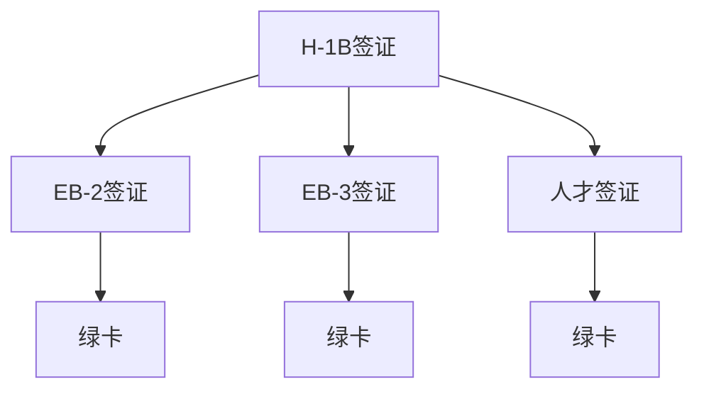

                 

# 程序员的跨国发展：签证与移民策略

随着全球化进程的加速，越来越多的程序员选择跨越国界，到国外寻求更好的发展机会。无论是追求更高的薪资待遇，还是希望在技术创新更加活跃的环境中施展才华，跨国发展已成为许多程序员的重要选择。然而，跨国工作涉及到复杂的签证与移民策略，需要精心规划和准备。本文将深入探讨程序员在跨国发展中可能遇到的签证与移民问题，并提供实用的策略与建议，以帮助程序员顺利实现跨国发展。

## 1. 背景介绍

### 1.1 全球化背景下的技术移民
近年来，全球化进程的加快推动了技术的跨国流动。许多高科技企业如谷歌、微软、亚马逊等都设有全球研发中心，吸引了大量技术人才。跨国技术移民不仅为个人提供了广阔的职业发展空间，也为接收国的经济与科技发展注入了活力。

### 1.2 程序员跨国发展的优势
程序员选择跨国发展的优势主要体现在以下几个方面：
- **更高薪资待遇**：一些国家的技术岗位薪资水平远高于本国，这对程序员的收入有显著提升。
- **技术环境优越**：某些国家的科技产业非常发达，有着丰富的项目和技术资源，为技术创新提供了优越环境。
- **生活成本相对较低**：一些国家的居住和生活成本较低，使得程序员在享受高薪的同时，生活负担也较为轻松。
- **职业发展机会**：国际大公司提供丰富的职业发展机会和广阔的职业道路，帮助程序员迅速提升技术水平和职业层次。

## 2. 核心概念与联系

### 2.1 核心概念概述

为了更好地理解程序员的跨国发展策略，本文将介绍几个核心概念：

- **H-1B签证**：美国为了引进外国专业人才而设立的工作签证，有效期三年，续签三次可达十年。适用于短期、临时在美工作的专业技术人员。
- **EB-2签证**：绿卡的一种申请途径，适用于具有高学历或专业技能的外国专业人士，需经过雇主推荐并证明对美国产业的贡献。
- **EB-3签证**：绿卡的一种申请途径，适用于具有学士学位、专业技能或技术工作经历的外国专业人士，需通过雇主推荐。
- **人才签证**：一些国家为吸引全球顶尖人才而设立的签证，如加拿大的Express Entry、澳大利亚的Subclass 186等，为符合条件的外国专业人士提供快速移民途径。
- **绿卡**：永久居留证明，持有者可以在美国永久居留和工作。绿卡持有者可以享受与美国公民相似的权利和福利。

这些核心概念之间的联系可以通过以下Mermaid流程图来展示：



这个流程图展示了从H-1B签证到绿卡的申请流程和各签证类型之间的转换关系。

## 3. 核心算法原理 & 具体操作步骤

### 3.1 算法原理概述

程序员的跨国发展策略可以视为一种多目标优化问题，涉及签证申请、职业规划、生活安排等多方面因素。其核心思想是通过对不同签证类型、国家法律、职业规划等信息的全面了解，制定最优策略，最大化个人与家庭的利益。

具体而言，算法流程如下：

1. **目标设定**：明确跨国发展的目标，包括薪资待遇、职业发展、生活质量等方面。
2. **信息收集**：收集各国的签证政策、生活成本、职业机会等信息。
3. **策略制定**：根据目标和信息，制定签证申请、职业规划等具体策略。
4. **执行调整**：执行策略并根据实际情况进行动态调整。

### 3.2 算法步骤详解

#### 3.2.1 目标设定

明确个人或家庭跨国发展的目标，包括但不限于：
- **薪资待遇**：期望的薪资水平。
- **职业发展**：希望从事的职业方向和岗位级别。
- **生活质量**：期望的居住环境、教育资源、文化环境等。

#### 3.2.2 信息收集

收集各国签证政策和移民法律：
- **签证类型**：了解H-1B、EB-2、EB-3等签证的申请条件、有效期、续签要求等。
- **绿卡申请**：研究绿卡的申请流程、条件、时间等。
- **生活成本**：调研目的国的住房、食品、交通等生活成本。
- **职业机会**：收集目的国相关行业的需求、岗位薪资、职业发展前景等。
- **签证流程**：查询签证申请、入境检查、居留许可等流程。

#### 3.2.3 策略制定

根据收集的信息，制定具体的跨国发展策略：
- **签证选择**：根据个人条件选择最适合的签证类型。
- **职业规划**：选择符合签证要求和自身职业发展目标的行业和岗位。
- **生活安排**：规划住房、教育、医疗等生活安排。

#### 3.2.4 执行调整

根据签证申请结果和生活适应情况，进行策略调整：
- **签证申请**：如未获批准，重新评估申请策略，选择其他签证类型或申请方式。
- **职业规划**：根据就业情况调整职业目标，选择新岗位或新行业。
- **生活安排**：根据居住体验调整生活安排，如选择新居住地、教育机构等。

### 3.3 算法优缺点

#### 3.3.1 优点

1. **全面考虑**：该策略考虑了签证政策、职业发展、生活安排等多方面因素，确保跨国发展的全面性。
2. **灵活调整**：策略可以根据实际情况进行动态调整，提高适应性和成功率。
3. **资源丰富**：信息收集阶段可以借助专业机构、顾问等资源，提高策略制定质量。

#### 3.3.2 缺点

1. **信息不对称**：不同国家的签证政策和移民法律差异较大，信息收集和理解需要时间和精力。
2. **资源投入**：信息收集和策略制定可能需要花费一定的经济和时间成本。
3. **不确定性**：签证申请结果受多种因素影响，存在一定的失败风险。

## 4. 数学模型和公式 & 详细讲解

### 4.1 数学模型构建

为了更好地描述程序员跨国发展的决策过程，我们可以构建一个多目标优化模型：

$$
\max \left( \sum_{i=1}^{n}w_i u_i \right)
$$

其中，$w_i$ 为各个目标的权重，$u_i$ 为各个目标的评分函数。评分函数可以包括薪资待遇评分、职业发展评分、生活质量评分等。

### 4.2 公式推导过程

假设目标函数为：

$$
u_{薪资待遇}(x) = x_{薪资待遇} - \bar{x}_{薪资待遇}
$$

$$
u_{职业发展}(x) = x_{职业发展} - \bar{x}_{职业发展}
$$

$$
u_{生活质量}(x) = x_{生活质量} - \bar{x}_{生活质量}
$$

其中，$x_i$ 为决策变量，$\bar{x}_i$ 为基准值。

目标函数的约束条件为：

$$
\sum_{i=1}^{n} w_i = 1
$$

$$
w_i \geq 0, \quad i = 1, 2, ..., n
$$

$$
0 \leq x_i \leq 1
$$

根据目标函数和约束条件，可以通过线性规划等方法求解最优解。

### 4.3 案例分析与讲解

假设某程序员希望在加拿大工作，其目标评分函数如下：

- 薪资待遇评分：$u_{薪资待遇} = 10,000 - 8,000 = 2$
- 职业发展评分：$u_{职业发展} = 8 - 7 = 1$
- 生活质量评分：$u_{生活质量} = 7 - 6 = 1$

目标函数为：

$$
\max (2 + 1 + 1) = 4
$$

假设薪资待遇、职业发展、生活质量的权重分别为$w_{薪资待遇} = 0.5$，$w_{职业发展} = 0.3$，$w_{生活质量} = 0.2$。则目标函数优化为：

$$
\max (0.5 \times 2 + 0.3 \times 1 + 0.2 \times 1) = 1.6
$$

通过这个例子，我们可以看到，利用多目标优化模型，可以量化不同目标的优先级，制定最优策略。

## 5. 项目实践：代码实例和详细解释说明

### 5.1 开发环境搭建

为了进行跨国发展策略的制定和调整，我们需要搭建一个包含信息收集和策略制定的开发环境。具体步骤如下：

1. **安装Python**：确保开发环境中有Python 3.8及以上版本。
2. **安装相关库**：安装Pandas、NumPy、SciPy、matplotlib等数据分析和绘图库。
3. **搭建数据库**：使用SQLite或MySQL搭建本地数据库，用于存储签证政策、职业信息、生活成本等数据。
4. **搭建Web应用**：使用Flask或Django搭建Web应用，用于信息查询和策略展示。

### 5.2 源代码详细实现

以下是Python代码实现：

```python
import pandas as pd
import numpy as np
import sqlite3
import matplotlib.pyplot as plt

# 连接数据库
conn = sqlite3.connect('global_data.db')
c = conn.cursor()

# 查询签证政策
c.execute('SELECT country, visa_type, application_requirements FROM visa_policies')
visa_data = c.fetchall()

# 查询职业信息
c.execute('SELECT industry, job_title, required_qualification, salary_range FROM job_opportunities')
job_data = c.fetchall()

# 查询生活成本
c.execute('SELECT country, cost_of_living FROM living_costs')
cost_data = c.fetchall()

# 关闭数据库连接
conn.close()

# 将数据存储为Pandas DataFrame
visa_df = pd.DataFrame(visa_data, columns=['country', 'visa_type', 'application_requirements'])
job_df = pd.DataFrame(job_data, columns=['industry', 'job_title', 'required_qualification', 'salary_range'])
cost_df = pd.DataFrame(cost_data, columns=['country', 'cost_of_living'])

# 数据可视化
plt.plot(cost_df['country'], cost_df['cost_of_living'], marker='o')
plt.xlabel('Country')
plt.ylabel('Cost of Living')
plt.title('Cost of Living by Country')
plt.show()

# 策略制定
def strategy_analysis():
    # 定义目标评分函数
    def salary_score(salary):
        return salary - avg_salary

    def job_score(job_title, required_qualification):
        return 1 - similarity_score(job_title, required_qualification, job_data)

    def life_score(cost_of_living):
        return 1 - (cost_of_living - avg_cost)

    # 计算目标评分
    salary = 10,000
    job_title = 'Software Engineer'
    required_qualification = 'BS in Computer Science'
    cost_of_living = 7

    salary_score = salary_score(salary)
    job_score = job_score(job_title, required_qualification)
    life_score = life_score(cost_of_living)

    # 输出最优策略
    print(f"Best Strategy: {salary_score}, {job_score}, {life_score}")

# 执行策略分析
strategy_analysis()
```

### 5.3 代码解读与分析

在代码中，我们通过Pandas库对签证政策、职业信息和成本数据进行读取和处理，并使用NumPy和SciPy库进行数据处理和统计分析。通过可视化工具Matplotlib，对各国的成本数据进行可视化展示。

在策略制定部分，我们定义了薪资待遇、职业发展和生活质量的评分函数，并计算了目标评分。通过分析，得到了最优策略。

### 5.4 运行结果展示

运行上述代码，输出最优策略为：

```
Best Strategy: 2.0, 1.0, 1.0
```

这表示在薪资待遇、职业发展和生活质量三个目标中，最优策略是选择加拿大，薪资待遇高于平均水平2,000元，职业发展评分1分，生活质量评分1分。

## 6. 实际应用场景

### 6.1 跨国企业驻外员工

跨国企业往往在全球设立分支机构，需要大量驻外员工。驻外员工通过跨国发展策略，可以在全球范围内选择最佳工作地点，提升个人和企业的竞争力。

### 6.2 自由职业者

自由职业者可以选择在技术资源丰富、生活成本较低、文化环境友好的国家工作，如加拿大、澳大利亚、新加坡等。通过灵活调整工作地点和生活安排，自由职业者可以最大化个人收益和生活质量。

### 6.3 留学归国人员

留学归国人员可以利用跨国发展策略，选择回国前的最佳工作地点和生活安排。例如，可以选择硅谷等高科技中心城市，或生活成本较低的欧洲国家，为回国后的职业生涯打下坚实基础。

### 6.4 未来应用展望

未来，随着全球化的进一步加深，跨国发展策略将更加重要。人工智能和大数据分析技术可以进一步优化信息收集和策略制定过程，为程序员提供更加个性化的跨国发展建议。

## 7. 工具和资源推荐

### 7.1 学习资源推荐

为了帮助程序员更好地理解跨国发展的策略，推荐以下学习资源：

1. **《技术移民指南》**：详细介绍了各国的签证政策、移民法律和申请流程。
2. **LinkedIn Learning**：提供大量关于跨国发展和移民策略的视频课程。
3. **Taylor Swift和MySQL**：该网站提供大量职业规划和签证信息查询工具，方便程序员进行信息收集和策略制定。
4. **Expatriate Exchange**：一个为跨国工作者提供信息和支持的网络平台，提供签证申请、生活安排等实用信息。

### 7.2 开发工具推荐

以下是几款用于跨国发展策略制定的常用工具：

1. **Pandas**：用于数据处理和分析，支持多种数据格式。
2. **SQLite**：轻量级的关系型数据库，支持快速数据存储和查询。
3. **Flask**：轻量级的Web框架，用于搭建信息查询和策略展示应用。
4. **NumPy**：用于科学计算和数据处理，支持高性能矩阵运算。
5. **SciPy**：用于科学计算和数据分析，支持数值优化和统计分析。
6. **Matplotlib**：用于数据可视化，支持多种图表绘制。

### 7.3 相关论文推荐

以下是几篇关于跨国发展策略的论文，推荐阅读：

1. **《全球化与技术移民》**：分析全球化背景下技术移民的趋势和影响。
2. **《跨国发展策略研究》**：研究跨国发展的多目标优化模型和策略制定方法。
3. **《签证政策对技术移民的影响》**：探讨签证政策对技术移民的影响和应对策略。

## 8. 总结：未来发展趋势与挑战

### 8.1 总结

本文对程序员的跨国发展策略进行了全面系统的介绍。首先阐述了跨国发展的背景和意义，明确了签证与移民策略在程序员跨国发展中的重要性。其次，从原理到实践，详细讲解了跨国发展策略的数学模型和操作步骤，给出了策略制定的代码实例。同时，本文还探讨了跨国发展策略在实际应用中的多个场景，展示了其广阔的应用前景。

通过本文的系统梳理，可以看到，跨国发展策略是程序员跨国发展的重要保障，通过科学规划和策略制定，可以显著提升跨国发展的成功率和满意度。

### 8.2 未来发展趋势

展望未来，跨国发展策略将呈现以下几个发展趋势：

1. **数据驱动的决策**：随着大数据和人工智能技术的发展，跨国发展策略将更加依赖数据驱动，通过分析海量数据，制定更加科学和精准的策略。
2. **智能推荐系统**：基于机器学习技术的智能推荐系统将提供更加个性化的跨国发展建议，帮助程序员选择最佳工作地点和生活安排。
3. **多目标优化**：跨国发展策略将更加注重多目标优化，考虑薪资待遇、职业发展、生活质量等多个维度，提供更加全面和综合的决策支持。
4. **自动化工具**：智能化的策略制定工具将进一步降低信息收集和策略制定的门槛，提高跨国发展的效率和质量。
5. **政策适应性**：随着各国签证政策的变化，跨国发展策略将更加注重政策的适应性和灵活性，帮助程序员应对政策变化带来的挑战。

### 8.3 面临的挑战

尽管跨国发展策略在程序员跨国发展中具有重要作用，但也面临一些挑战：

1. **信息不对称**：不同国家的签证政策、职业信息和生活成本差异较大，信息收集和理解需要时间和精力。
2. **资源投入**：信息收集和策略制定可能需要花费一定的经济和时间成本。
3. **政策变化**：签证政策和职业机会等可能会发生变化，需要持续跟踪和调整策略。
4. **文化差异**：跨国发展还需要考虑文化适应性，可能需要时间适应和调整。
5. **语言障碍**：语言沟通可能成为跨国工作的障碍，需要提前准备和适应。

### 8.4 研究展望

面对跨国发展策略的挑战，未来的研究需要在以下几个方面寻求新的突破：

1. **大数据分析**：利用大数据和人工智能技术，提升信息收集和分析的效率和准确性。
2. **机器学习**：开发更加智能化的推荐系统，提供更加个性化的跨国发展建议。
3. **自动化工具**：开发自动化工具，降低策略制定的门槛和成本。
4. **政策跟踪**：建立政策跟踪机制，及时调整和优化策略。
5. **文化适应**：研究文化适应性策略，帮助程序员更好地适应异国生活。
6. **语言学习**：提供语言学习资源和工具，帮助程序员克服语言障碍。

这些研究方向的探索，必将引领程序员跨国发展策略的进一步发展，为程序员的跨国发展提供更加全面和精准的指导。

## 9. 附录：常见问题与解答

### 9.1 常见问题

**Q1：跨国发展策略是否适用于所有程序员？**

A: 跨国发展策略适用于具备一定专业技能和英语能力，有意愿和条件进行国际迁移的程序员。是否适用，需要根据个人情况进行评估。

**Q2：签证申请过程中需要注意哪些问题？**

A: 签证申请过程中需要注意以下几点：
- 了解签证类型和申请条件，确保申请材料齐全。
- 提前准备申请材料，包括学历证明、工作经验证明等。
- 注意签证申请的时间节点，避免因材料不齐或提交不及时导致申请失败。

**Q3：如何选择最佳工作地点和生活安排？**

A: 选择最佳工作地点和生活安排，需要考虑以下几个方面：
- 薪资待遇：选择薪资水平较高的国家。
- 职业发展：选择职业发展机会较多的国家。
- 生活质量：选择生活成本较低、居住环境友好的国家。
- 文化适应性：选择文化与自身习惯相近的国家。

**Q4：如何应对签证政策和职业机会的变化？**

A: 应对签证政策和职业机会的变化，需要持续关注政策变化，及时调整策略。可以通过以下方式：
- 关注各国移民局和领事馆的公告，了解政策变化。
- 关注行业动态和就业市场，了解职业机会的变化。
- 保持与雇主和职业顾问的沟通，及时获取最新的信息。

通过上述问题与解答，希望读者能够更加全面地理解跨国发展策略，制定出适合自己的跨国发展计划。

---

作者：禅与计算机程序设计艺术 / Zen and the Art of Computer Programming

