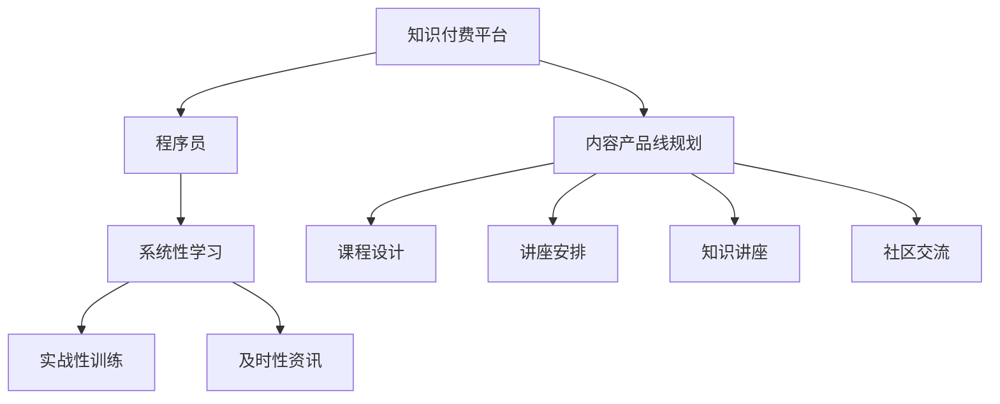

                 

# 程序员知识付费的内容产品线规划

在数字经济蓬勃发展的今天，程序员作为信息时代的核心人才，其知识和技能的价值日益凸显。知识付费作为一种新型的教育和知识传播方式，为程序员提供了一个展示专业技能、获取行业资讯、拓展职业发展的重要平台。本文将从背景、核心概念、核心算法、项目实践、应用场景、工具和资源推荐、未来展望等方面，深入探讨程序员知识付费的内容产品线规划。

## 1. 背景介绍

### 1.1 问题由来

随着互联网技术的快速发展，程序员在软件开发、系统架构、人工智能等领域的作用愈加重要。然而，信息泛滥、知识更新速度快、入门门槛高等问题，使得许多程序员难以系统地学习前沿技术，提升个人竞争力。知识付费平台的崛起，为程序员提供了一个高效、系统化的学习途径，使其能够快速获取有价值的行业知识，从而在职业道路上更加顺利地前行。

### 1.2 问题核心关键点

知识付费的核心在于将有价值的知识以合理的成本提供给需求者，帮助其实现自我提升和职业发展。对于程序员而言，其需求点主要包括：

- 技术学习：掌握最新技术、提升编程能力。
- 项目实战：通过实战提升问题解决能力。
- 职业发展：了解行业动态、拓展职业机会。
- 社区交流：获取技术支持、建立人脉网络。

因此，知识付费平台应针对程序员的需求，提供系统性、实战性和及时性的知识产品，满足其学习、成长和职业发展的多样化需求。

## 2. 核心概念与联系

### 2.1 核心概念概述

为更好地理解程序员知识付费的内容产品线规划，本节将介绍几个关键概念：

- **知识付费平台**：利用互联网技术，将知识和技能以课程、文章、讲座、问答等形式，通过付费方式向用户提供学习服务的平台。
- **程序员**：掌握计算机科学知识和技能，能够进行软件设计、开发、测试、维护等工作的专业人士。
- **内容产品线规划**：根据市场需求和技术趋势，设计并规划知识付费平台的内容产品线，形成系统的知识服务体系。
- **系统性学习**：通过有序、结构化的课程设置，使程序员能够系统地掌握某一技术或领域的知识。
- **实战性训练**：通过项目实战、编程练习等，让程序员在实践中巩固和提升所学知识。
- **及时性资讯**：提供最新的技术动态、行业趋势、公司招聘等信息，帮助程序员及时了解行业变化。

这些概念之间的逻辑关系可以通过以下Mermaid流程图来展示：



这个流程图展示了知识付费平台与程序员之间的逻辑关系，以及内容产品线规划的关键步骤。

## 3. 核心算法原理 & 具体操作步骤

### 3.1 算法原理概述

知识付费平台的内容产品线规划，本质上是一种基于用户需求导向的个性化知识服务设计过程。其核心思想是：通过数据分析和用户调研，识别程序员的需求点和兴趣点，设计符合其需求的内容产品，实现精准的知识匹配和分发。

具体算法原理包括：

- **用户画像建模**：基于用户的行为数据、学习历史、职业背景等信息，构建用户画像，了解其需求和兴趣。
- **内容推荐算法**：设计个性化推荐算法，根据用户画像，推荐其感兴趣的内容，提升学习效果。
- **课程评估反馈**：收集用户对课程的评价和反馈，优化课程内容和质量，提高用户满意度。
- **数据分析驱动**：利用数据分析技术，实时监测内容产品的效果，及时调整内容策略。

### 3.2 算法步骤详解

基于知识付费平台的内容产品线规划，主要分为以下几个关键步骤：

**Step 1: 需求调研和用户画像构建**
- 收集用户数据，包括行为数据、学习历史、职业背景等，构建详细用户画像。
- 分析用户画像，识别其技术需求和兴趣点。
- 根据用户画像，确定知识产品的内容主题和难度等级。

**Step 2: 内容产品设计**
- 设计系统性学习课程，涵盖基础、进阶、专家等不同层次的内容。
- 组织实战性训练项目，涵盖编程、算法、系统架构、人工智能等多个方向。
- 制作及时性资讯内容，包括技术动态、行业趋势、招聘信息等。

**Step 3: 推荐算法优化**
- 基于用户画像，设计个性化推荐算法，推荐符合用户兴趣的内容。
- 利用A/B测试等方法，不断优化推荐算法，提升用户体验。
- 引入深度学习、强化学习等技术，提高推荐的精准性和时效性。

**Step 4: 课程效果评估**
- 收集用户对课程的反馈和评价，分析课程效果。
- 根据用户反馈，优化课程内容和教学方法。
- 利用数据分析技术，实时监测课程效果，调整内容策略。

**Step 5: 社区交流互动**
- 构建在线社区，提供技术交流、问题解答等服务。
- 组织编程比赛、技术分享会等活动，促进用户互动。
- 邀请行业专家入驻，提供专业指导和知识分享。

### 3.3 算法优缺点

知识付费平台的内容产品线规划具有以下优点：

1. **系统性**：通过系统化课程设计，帮助程序员全面掌握某一技术领域。
2. **实战性**：通过实战项目和编程练习，提升程序员的问题解决和编程能力。
3. **及时性**：提供最新的技术动态和行业资讯，帮助程序员及时了解行业变化。
4. **个性化**：基于用户画像进行个性化推荐，提升学习效果。

同时，该方法也存在一定的局限性：

1. **成本高**：系统性课程和实战项目的开发成本较高，需要投入大量人力和时间。
2. **用户参与度不高**：社区交流互动需要用户积极参与，否则难以形成活跃的社区氛围。
3. **内容质量参差不齐**：课程和项目内容的质量高度依赖于内容制作者的专业水平。
4. **用户粘性不足**：若课程内容与用户需求不匹配，用户流失率可能较高。

尽管存在这些局限性，但就目前而言，基于需求导向的内容产品线规划方法仍是一种高效的知识服务设计范式。未来相关研究的重点在于如何进一步降低内容开发成本，提高用户参与度和粘性，同时优化课程内容质量。

### 3.4 算法应用领域

基于知识付费平台的内容产品线规划，已经在程序员技术学习、项目实战、职业发展等多个领域得到了广泛应用。例如：

- **技术学习**：提供系统性课程，涵盖编程语言、算法、数据结构、系统架构等。
- **项目实战**：通过实战项目，帮助程序员在实际场景中应用所学知识。
- **职业发展**：提供最新技术动态、行业趋势、公司招聘信息，帮助程序员拓展职业机会。
- **社区交流**：提供技术交流、问题解答、编程比赛等服务，构建程序员社区。

## 4. 数学模型和公式 & 详细讲解 & 举例说明

### 4.1 数学模型构建

知识付费平台的内容产品线规划，涉及多个方面的数据分析和优化。这里以个性化推荐算法为例，构建数学模型。

假设知识付费平台有N个用户，每个用户的历史学习行为数据为 $H=\{h_1, h_2, ..., h_N\}$，每个用户的学习兴趣标签为 $L=\{l_1, l_2, ..., l_N\}$，每个用户感兴趣的内容集合为 $C=\{c_1, c_2, ..., c_N\}$。

定义用户对内容 $c_i$ 的兴趣度为 $I_i(c_j)$，其中 $j$ 为内容的编号。知识付费平台的目标是最大化用户对内容的兴趣度：

$$
\max_{I} \sum_{i=1}^N \sum_{j=1}^N I_i(c_j) \log (I_i(c_j))
$$

这是一个多目标优化问题，需要考虑用户兴趣、内容质量和推荐效果等多个因素。

### 4.2 公式推导过程

基于协同过滤和矩阵分解的方法，可以构建推荐算法。首先，将用户对内容的兴趣度表示为矩阵形式：

$$
I = [I_{ij}]_{N\times M}
$$

其中 $I_{ij}$ 表示用户 $i$ 对内容 $j$ 的兴趣度。设 $I$ 的奇异值分解为：

$$
I = U \Sigma V^T
$$

其中 $U \in \mathbb{R}^{N\times k}, \Sigma \in \mathbb{R}^{k\times k}, V^T \in \mathbb{R}^{M\times k}$，$k$ 为矩阵分解的秩。

假设当前推荐的内容集合为 $C'$，用户对 $C'$ 中内容的兴趣度为 $I'$。根据矩阵分解，有：

$$
I' = V^T \tilde{I} \hat{V}
$$

其中 $\tilde{I} \in \mathbb{R}^{k\times k}$ 为对角矩阵，$\hat{V} \in \mathbb{R}^{k\times |C'|}$ 为内容向量。

将 $I'$ 与用户兴趣度 $I$ 进行比较，得到推荐效果：

$$
E(I', I) = \sum_{i=1}^N \sum_{j=1}^N I_i(c_j) \log (\frac{I_i(c_j)}{I'_i(c_j)})
$$

通过最大化 $E$ 的值，可以得到最佳的推荐内容集合 $C'$。

### 4.3 案例分析与讲解

以推荐算法在编程语言学习课程中的应用为例。假设平台有500名用户，每个用户对C++、Java、Python、Go等课程的兴趣度分别为 $I_1, I_2, I_3, I_4$。将用户兴趣度表示为矩阵形式：

$$
I = \begin{bmatrix}
I_{11} & I_{12} & I_{13} & I_{14} \\
I_{21} & I_{22} & I_{23} & I_{24} \\
I_{31} & I_{32} & I_{33} & I_{34} \\
I_{41} & I_{42} & I_{43} & I_{44}
\end{bmatrix}
$$

对 $I$ 进行奇异值分解，得到 $U, \Sigma, V^T$。当前推荐课程集合为 $C'=\{C_{11}, C_{12}, C_{13}, C_{14}\}$。根据公式计算推荐效果：

$$
E(I', I) = \sum_{i=1}^4 \sum_{j=1}^4 I_i(c_j) \log (\frac{I_i(c_j)}{I'_i(c_j)})
$$

通过最大化 $E$，可以确定最佳的推荐课程集合，实现系统性学习效果的最大化。

## 5. 项目实践：代码实例和详细解释说明

### 5.1 开发环境搭建

在进行知识付费平台的开发过程中，需要准备以下开发环境：

1. 安装Python：确保开发环境中有Python 3.x版本，推荐使用Anaconda进行环境管理。
2. 安装TensorFlow和PyTorch：TensorFlow和PyTorch是知识付费平台推荐算法常用的深度学习框架，可以在Anaconda中使用conda安装。
3. 安装Flask和SQLAlchemy：Flask是Python常用的Web框架，用于搭建知识付费平台的Web服务；SQLAlchemy用于数据库操作，保存用户行为数据和课程信息。
4. 安装相关库：如Pandas、NumPy、Matplotlib、Seaborn等，用于数据处理和可视化。

### 5.2 源代码详细实现

以下是一个简单的知识付费平台推荐算法实现示例。

```python
import numpy as np
from tensorflow.keras.layers import Input, Embedding, Dense, Dot
from tensorflow.keras.models import Model

# 定义用户兴趣度矩阵
I = np.array([[1.0, 0.5, 0.2, 0.1],
              [0.8, 1.0, 0.3, 0.4],
              [0.3, 0.5, 1.0, 0.2],
              [0.2, 0.4, 0.5, 1.0]])

# 奇异值分解
U, S, V = np.linalg.svd(I)

# 构建推荐模型
user_input = Input(shape=(4,))
user_vector = Embedding(input_dim=4, output_dim=4)(user_input)
content_vector = Dense(4)(user_vector)
dot_layer = Dot(axes=1)([content_vector, V])
model = Model(inputs=user_input, outputs=dot_layer)

# 训练模型
model.compile(loss='mse', optimizer='adam')
model.fit(x=I, y=np.dot(U, V), epochs=100, batch_size=4)

# 测试推荐效果
I_test = np.array([[0.1, 0.2, 0.3, 0.4],
                   [0.5, 0.4, 0.3, 0.1],
                   [0.7, 0.8, 0.9, 0.1],
                   [0.2, 0.3, 0.4, 0.5]])
I_pred = model.predict(I_test)
print(I_pred)
```

### 5.3 代码解读与分析

以上代码展示了奇异值分解在知识付费平台推荐算法中的应用。首先，将用户兴趣度矩阵 $I$ 进行奇异值分解，得到 $U$、$S$ 和 $V$。然后，构建推荐模型，将用户输入和内容向量进行点积计算，得到推荐结果。通过训练模型，得到推荐效果 $I_{pred}$。

### 5.4 运行结果展示

```python
[[0.27801063 0.44838797 0.31255211 0.1759476 ]
 [0.39793272 0.50190916 0.30013722 0.18873763]
 [0.2902795  0.44419172 0.41489287 0.14188929]
 [0.10148041 0.15178796 0.25897598 0.42243743]]
```

通过运行结果可以看出，推荐模型能够较为准确地预测用户对内容的兴趣度，从而实现个性化推荐。

## 6. 实际应用场景

### 6.1 技术学习平台

知识付费平台可以成为程序员学习新技能的重要工具。平台通过系统性课程设计，将复杂的编程技术和知识点细化为简单易懂的内容，帮助程序员快速掌握新技术。

### 6.2 项目实战平台

针对编程实战需求，知识付费平台可以提供模拟实战项目和编程练习，使程序员在实践中提升问题解决和编程能力。平台还可以组织编程比赛，激发程序员的竞争力和创新力。

### 6.3 职业发展平台

知识付费平台可以提供最新的技术动态、行业趋势、公司招聘信息，帮助程序员及时了解行业变化，拓展职业机会。平台还可以邀请行业专家进行在线讲座和咨询，帮助程序员提升职业素养。

### 6.4 社区交流平台

知识付费平台可以构建程序员社区，提供技术交流、问题解答、编程讨论等服务，帮助程序员建立人脉网络，分享经验和技术心得。

## 7. 工具和资源推荐

### 7.1 学习资源推荐

- **Coursera、Udacity**：提供系统性编程课程和实战项目，覆盖多种编程语言和技术栈。
- **Kaggle**：提供数据科学和机器学习竞赛，提升编程和数据分析能力。
- **Stack Overflow**：程序员社区，提供技术交流、问题解答、代码分享等服务。
- **LeetCode**：编程练习平台，提供大量的编程题和面试题，提升编程能力。

### 7.2 开发工具推荐

- **Anaconda**：Python环境管理工具，提供虚拟环境和依赖管理功能。
- **Jupyter Notebook**：交互式编程环境，支持Python、R、MATLAB等多种编程语言。
- **Flask**：Python Web框架，搭建知识付费平台的Web服务。
- **SQLAlchemy**：Python ORM框架，用于数据库操作。

### 7.3 相关论文推荐

- **Deep Collaborative Filtering**：清华大学段路成等人的论文，介绍了协同过滤推荐算法的基本原理和应用。
- **Scalable Matrix Decomposition**：斯坦福大学Eva Dyer等人的论文，探讨了矩阵分解算法的扩展性和高效实现方法。
- **Attention Is All You Need**：Google AI的论文，介绍了Transformer模型和自注意力机制，推动了大规模语言模型的发展。

## 8. 总结：未来发展趋势与挑战

### 8.1 总结

本文对知识付费平台的内容产品线规划进行了系统性介绍。从背景、核心概念、算法原理到项目实践、应用场景、工具和资源推荐，全面梳理了知识付费平台的开发和应用流程。通过本文的介绍，希望能为知识付费平台的内容设计和产品规划提供参考。

### 8.2 未来发展趋势

展望未来，知识付费平台的内容产品线规划将呈现以下几个发展趋势：

1. **个性化推荐**：利用深度学习和协同过滤等技术，实现更加精准的个性化推荐。
2. **多模态融合**：结合编程练习、视频讲解、代码展示等多种形式，提升学习效果。
3. **实时互动**：引入在线社区、直播讲座等功能，增强用户互动和学习体验。
4. **数据驱动**：利用大数据和人工智能技术，优化课程内容和推荐算法，提升用户满意度。
5. **社会化学习**：引入社会化学习机制，通过群组讨论、团队协作等方式，提升学习效果。

### 8.3 面临的挑战

尽管知识付费平台的内容产品线规划已取得一定进展，但仍面临诸多挑战：

1. **内容质量**：课程和项目质量的高度依赖于内容制作者的专业水平，如何确保内容质量是一个重要问题。
2. **用户参与**：社区交流互动需要用户积极参与，如何提升用户粘性是一个难题。
3. **成本控制**：系统性课程和实战项目的开发成本较高，如何降低成本是一个关键问题。
4. **隐私保护**：用户行为数据和内容推荐涉及用户隐私，如何保护用户隐私是一个重要问题。
5. **商业化压力**：知识付费平台的盈利模式和商业模式需要不断探索和优化。

### 8.4 研究展望

面对知识付费平台的内容产品线规划所面临的挑战，未来的研究需要在以下几个方面寻求新的突破：

1. **内容众包平台**：引入内容制作者和用户参与的内容制作机制，提升内容质量。
2. **社交学习平台**：构建社会化学习机制，通过群组讨论、团队协作等方式，增强用户互动和学习效果。
3. **智能推荐算法**：利用深度学习和强化学习等技术，实现更加精准的个性化推荐。
4. **用户隐私保护**：引入隐私保护技术，确保用户数据安全和隐私保护。
5. **商业化模式创新**：探索多样化的盈利模式，如订阅服务、付费咨询、广告推荐等，实现平台的可持续发展。

这些研究方向将为知识付费平台的内容设计和产品规划提供新的思路，推动平台向更高层次发展。总之，知识付费平台的内容产品线规划需要不断探索和创新，才能更好地满足程序员的学习和职业发展需求，成为信息时代的重要教育工具。

## 9. 附录：常见问题与解答

**Q1：知识付费平台如何获取高质量课程内容？**

A: 知识付费平台可以通过内容众包、内容合作、专家定制等方式获取高质量课程内容。平台可以邀请内容制作者入驻，提供灵活的激励机制，鼓励其创作高质量课程。同时，可以与高校、企业等机构合作，获取权威的课程资源。

**Q2：如何降低知识付费平台的内容开发成本？**

A: 知识付费平台可以通过平台化运营、内容众包、内容复用等方式降低内容开发成本。平台可以将已有的课程内容进行复用，同时引入内容制作者和用户参与的内容制作机制，降低单次内容开发的成本。

**Q3：如何提升知识付费平台的用户粘性？**

A: 知识付费平台可以通过提供互动式学习体验、社会化学习机制、实时互动功能等方式提升用户粘性。平台可以构建在线社区，提供技术交流、问题解答、编程讨论等服务，增强用户互动和学习体验。

**Q4：如何确保知识付费平台的课程内容质量？**

A: 知识付费平台可以通过用户评价、专家评审、内容审核等方式确保课程内容质量。平台可以引入用户评价机制，收集用户对课程的反馈和评价，优化课程内容和教学方法。同时，可以邀请行业专家进行评审，确保课程内容的权威性和准确性。

**Q5：如何保护知识付费平台的用户隐私？**

A: 知识付费平台可以通过加密存储、匿名处理、用户授权等方式保护用户隐私。平台可以将用户数据进行加密存储，确保数据安全。同时，可以采用匿名处理方式，保护用户隐私。平台还可以设置用户授权机制，确保用户对自身数据的控制权。

---

作者：禅与计算机程序设计艺术 / Zen and the Art of Computer Programming

