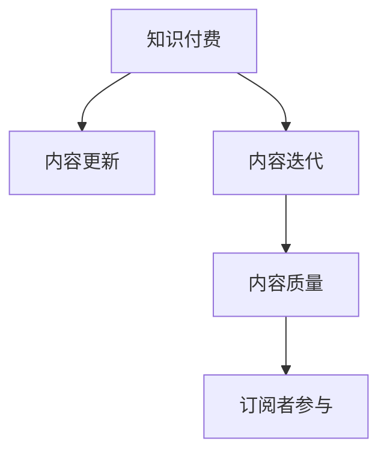

                 

# 程序员知识付费的内容更新与迭代策略

在快速迭代、知识爆炸的互联网时代，程序员知识付费的内容更新与迭代策略变得尤为重要。本文将深入探讨知识付费的核心概念、当前主要问题和解决方案，提供全方位的策略指导，帮助知识创作者和订阅者共同构建更加高效、有价值的知识生态。

## 1. 背景介绍

### 1.1 问题由来
知识付费平台如雨后春笋般涌现，为程序员提供了前所未有的学习机会。然而，如何在海量内容中筛选优质知识，如何持续更新迭代内容，以适应技术发展的需要，成为了知识创作者和订阅者的共同挑战。

### 1.2 问题核心关键点
程序员知识付费面临的核心问题主要包括：
- 如何确保内容质量与时效性，避免误导订阅者。
- 如何激励知识创作者持续产出高质量内容，满足订阅者的多样化需求。
- 如何在知识更新迭代中实现内容内容的系统化、结构化管理。
- 如何最大化利用订阅者反馈，实现内容的精准迭代。

### 1.3 问题研究意义
研究程序员知识付费的内容更新与迭代策略，对于构建知识创作者和订阅者双赢的知识生态，提升技术学习的系统性和有效性，具有重要意义。它不仅能帮助创作者更高效地进行内容更新，还能使订阅者获得更优质、更实用的知识资源。

## 2. 核心概念与联系

### 2.1 核心概念概述

为更好地理解程序员知识付费的内容更新与迭代策略，本节将介绍几个关键概念：

- **知识付费(Knowledge-as-a-Service, KaaS)**：指通过付费方式获取专业知识、技能、经验等，以提高个人和组织的效率和创新能力的商业模式。
- **内容更新(Content Update)**：指在已有知识基础上，根据技术进展和市场需求，对知识内容进行补充、修改和升级，确保知识的先进性和实用性。
- **内容迭代(Content Iteration)**：指通过持续收集用户反馈、数据和市场信息，反复打磨、优化和完善内容的过程。
- **内容质量(Content Quality)**：指知识的准确性、实用性、逻辑性、可操作性等综合评价指标，反映知识的价值和可信度。
- **订阅者参与(Subscriber Engagement)**：指知识创作者与订阅者之间的互动反馈，通过问卷调查、讨论、留言等方式收集用户需求和反馈，指导内容更新和迭代。

这些概念之间的逻辑关系可以通过以下Mermaid流程图来展示：



这个流程图展示出知识付费的主要流程：

1. 知识创作者提供付费内容。
2. 在已有内容基础上，进行更新和迭代。
3. 通过订阅者反馈提升内容质量。
4. 订阅者参与内容的创作和优化。

这些概念共同构成了知识付费的学习框架，使其能够持续提供高质量、实用性的知识内容。通过理解这些核心概念，我们可以更好地把握知识付费的精髓和运作机制。

## 3. 核心算法原理 & 具体操作步骤
### 3.1 算法原理概述

程序员知识付费的内容更新与迭代策略，本质上是一种基于用户反馈的迭代优化过程。其核心思想是：通过订阅者对知识内容的评价和反馈，不断调整内容更新和迭代策略，确保知识的时效性和实用性。

形式化地，假设知识内容为 $K$，订阅者反馈为 $F$，内容更新策略为 $U$，内容迭代策略为 $I$。内容更新与迭代的目标是最大化订阅者满意度 $S$，即：

$$
\maximize_{U,I} S(K^U, K^I)
$$

其中 $K^U$ 和 $K^I$ 分别为根据更新和迭代策略生成的新内容。

通过梯度上升等优化算法，内容更新与迭代过程不断优化更新和迭代策略，最大化订阅者满意度。由于知识内容 $K$ 和订阅者反馈 $F$ 的时效性和动态性，模型需要实时调整和更新，以适应不断变化的需求。

### 3.2 算法步骤详解

程序员知识付费的内容更新与迭代一般包括以下几个关键步骤：

**Step 1: 内容质量评估**
- 通过问卷调查、用户评价、内容使用数据等方式，评估已有知识内容的实用性、可靠性、完备性等。
- 根据评估结果，识别知识缺口和更新点。

**Step 2: 订阅者反馈收集**
- 设计问卷、讨论区、留言板等互动渠道，定期收集订阅者对知识内容的意见和建议。
- 建立订阅者社区，鼓励知识创作者与订阅者进行互动交流，实时收集反馈。

**Step 3: 内容更新策略设计**
- 根据订阅者反馈和市场趋势，设计内容更新策略，如增补最新技术、删除过时内容、优化文章结构等。
- 确定内容更新的频率和时间表，如每日更新、每周更新、定期更新等。

**Step 4: 内容迭代策略实施**
- 定期回顾知识内容，根据订阅者反馈和最新技术进展，进行内容迭代。
- 引入迭代模型，如机器学习模型、贝叶斯网络等，自动化地进行内容优化和调整。
- 通过模拟和实验，评估不同迭代策略的效果，选择最优方案。

**Step 5: 内容发布与推广**
- 发布更新和迭代后的知识内容，通知订阅者获取最新信息。
- 在社交媒体、邮件列表、订阅号等渠道进行内容推广，扩大知识传播范围。
- 收集更新后的反馈，持续改进内容更新和迭代策略。

以上是程序员知识付费的内容更新与迭代的一般流程。在实际应用中，还需要针对具体内容类型和订阅者群体，对更新和迭代过程的各个环节进行优化设计，如改进内容质量评估方法，引入更多用户互动方式，搜索最优的更新迭代组合等，以进一步提升知识质量。

### 3.3 算法优缺点

程序员知识付费的内容更新与迭代策略具有以下优点：
1. 确保知识的时效性和实用性。通过订阅者反馈，及时更新知识内容，满足最新技术需求。
2. 提升订阅者满意度。通过迭代优化，知识内容的实用性和可操作性逐步提升，满足不同订阅者的多样化需求。
3. 增强知识创作者的持续动力。订阅者反馈和订阅量增加，激励创作者产出更多高质量内容。
4. 实现内容的系统化和结构化管理。通过定期回顾和优化，知识内容逐渐趋于结构化、系统化。

同时，该策略也存在一定的局限性：
1. 对订阅者反馈的依赖。依赖用户反馈进行内容更新迭代，可能因用户反馈不足或不准确导致内容更新方向偏差。
2. 内容更新频率和时间的协调。更新频率过高可能导致订阅者信息过载，过低则无法满足时效性需求。
3. 内容更新成本。内容更新和迭代需要持续投入人力和资源，成本较高。
4. 内容版权和法律问题。更新迭代过程中可能涉及版权和法律风险，需特别注意。

尽管存在这些局限性，但就目前而言，基于用户反馈的内容更新与迭代策略仍是知识付费的核心范式。未来相关研究的重点在于如何进一步降低更新成本，提高内容更新效率，同时兼顾订阅者的满意度。

### 3.4 算法应用领域

程序员知识付费的内容更新与迭代策略，在以下多个领域得到了广泛应用：

- **技术培训课程**：通过不断更新课程内容和迭代教学方法，提升教学效果和学员满意度。
- **技术博客和文章**：在已有文章基础上，根据订阅者反馈和市场趋势，进行内容更新和迭代，增加文章实用性和可操作性。
- **软件开发工具**：持续更新工具功能，根据用户反馈进行迭代优化，提升工具的实用性和易用性。
- **技术讨论和社区**：通过用户反馈和社区互动，持续优化讨论主题和内容，增加社区的活跃度和知识价值。
- **技术问答和咨询服务**：根据订阅者反馈和市场需求，调整问答内容，优化咨询方案，提升服务质量。

除了上述这些常见领域外，知识付费的内容更新与迭代策略也被创新性地应用到更多场景中，如在线教育、技术会议、技术沙龙等，为技术传播和知识共享提供了新的解决方案。

## 4. 数学模型和公式 & 详细讲解  
### 4.1 数学模型构建

本节将使用数学语言对程序员知识付费的内容更新与迭代过程进行更加严格的刻画。

记知识内容为 $K$，订阅者反馈为 $F$，内容更新策略为 $U$，内容迭代策略为 $I$。假设订阅者满意度为 $S(K^U, K^I)$，更新和迭代策略的优化目标为最大化订阅者满意度。

定义订阅者满意度为：

$$
S(K^U, K^I) = \prod_{i}^{n} f_i(K^U_i, K^I_i)
$$

其中 $f_i$ 为第 $i$ 个订阅者的满意度函数，$K^U_i$ 和 $K^I_i$ 分别为订阅者 $i$ 对更新后的知识内容和迭代后的知识内容的满意度。

内容更新和迭代的目标是最大化订阅者满意度：

$$
\maximize_{U,I} S(K^U, K^I)
$$

在实践中，我们通常使用基于梯度的优化算法（如SGD、Adam等）来近似求解上述最优化问题。设 $\eta$ 为学习率，$\lambda$ 为正则化系数，则参数的更新公式为：

$$
U \leftarrow U - \eta \nabla_{U}\log S(K^U, K^I) - \eta\lambda U
$$

其中 $\nabla_{U}\log S(K^U, K^I)$ 为订阅者满意度对更新策略 $U$ 的梯度，可通过反向传播算法高效计算。

### 4.2 公式推导过程

以下我们以技术培训课程为例，推导订阅者满意度函数及其梯度的计算公式。

假设课程内容为 $K$，订阅者反馈为 $F$。订阅者满意度函数定义为：

$$
S(K^U, K^I) = \prod_{i}^{n} f_i(K^U_i, K^I_i)
$$

其中 $f_i(K^U_i, K^I_i)$ 为第 $i$ 个订阅者的满意度函数，可以分解为更新满意度 $f_i(K^U_i)$ 和迭代满意度 $f_i(K^I_i)$ 的乘积。

为了简化问题，我们假设 $f_i(K^U_i, K^I_i) = f_i(K^U_i) \times f_i(K^I_i)$，其中：

$$
f_i(K^U_i) = (1 - \alpha) \times \text{Usability}(K^U_i) + \alpha \times \text{Coverage}(K^U_i)
$$

$$
f_i(K^I_i) = (1 - \beta) \times \text{Usability}(K^I_i) + \beta \times \text{Coverage}(K^I_i)
$$

其中 $\text{Usability}(K)$ 和 $\text{Coverage}(K)$ 分别表示知识内容 $K$ 的实用性（Usability）和完整性（Coverage）。$\alpha$ 和 $\beta$ 为权重参数，控制实用性与完整性的影响力度。

根据上述定义，订阅者满意度函数可以表示为：

$$
S(K^U, K^I) = \prod_{i}^{n} f_i(K^U_i, K^I_i) = \prod_{i}^{n} [ (1 - \alpha) \times \text{Usability}(K^U_i) + \alpha \times \text{Coverage}(K^U_i)] \times [(1 - \beta) \times \text{Usability}(K^I_i) + \beta \times \text{Coverage}(K^I_i)]
$$

在得到订阅者满意度函数后，即可带入参数更新公式，完成更新策略和迭代策略的迭代优化。重复上述过程直至收敛，最终得到适应订阅者需求的最优更新和迭代策略 $U^*$ 和 $I^*$。

## 5. 项目实践：代码实例和详细解释说明
### 5.1 开发环境搭建

在进行内容更新与迭代实践前，我们需要准备好开发环境。以下是使用Python进行Django开发的环境配置流程：

1. 安装Anaconda：从官网下载并安装Anaconda，用于创建独立的Python环境。

2. 创建并激活虚拟环境：
```bash
conda create -n django-env python=3.8 
conda activate django-env
```

3. 安装Django：从官网下载并安装Django。例如：
```bash
pip install django==3.2
```

4. 安装Web框架和数据库：
```bash
pip install django-cors-headers 
pip install psycopg2-binary
```

5. 安装各类工具包：
```bash
pip install numpy pandas scikit-learn matplotlib tqdm jupyter notebook ipython
```

完成上述步骤后，即可在`django-env`环境中开始内容更新与迭代实践。

### 5.2 源代码详细实现

下面我以技术培训课程为例，给出使用Django框架进行内容更新与迭代的代码实现。

首先，定义内容更新与迭代的业务逻辑：

```python
from django.db import models
from django.core.validators import MaxValueValidator, MinValueValidator

class Course(models.Model):
    title = models.CharField(max_length=255)
    description = models.TextField()
    lecturer = models.CharField(max_length=255)
    update_time = models.DateTimeField(auto_now_add=True)
    iteration_time = models.DateTimeField(auto_now_add=True)

    class Meta:
        verbose_name = "Course"
        verbose_name_plural = "Courses"

    def update_content(self, update_content):
        self.description = update_content
        self.save()

    def iterate_content(self, iterate_content):
        self.description = iterate_content
        self.save()
```

然后，定义订阅者反馈收集的业务逻辑：

```python
class Feedback(models.Model):
    course = models.ForeignKey(Course, on_delete=models.CASCADE)
    subscriber = models.CharField(max_length=255)
    score = models.IntegerField(validators=[MinValueValidator(1), MaxValueValidator(5)])
    comment = models.TextField()

    class Meta:
        verbose_name = "Feedback"
        verbose_name_plural = "Feedbacks"

    def add_feedback(self, subscriber, score, comment):
        feedback = Feedback(course=self.course, subscriber=subscriber, score=score, comment=comment)
        feedback.save()
```

接着，定义内容更新和迭代的服务逻辑：

```python
from django.views.generic import ListView, DetailView, CreateView
from django.shortcuts import redirect
from django.http import HttpResponse

class CourseListView(ListView):
    model = Course
    template_name = 'course_list.html'

    def get_queryset(self):
        courses = Course.objects.all().order_by('-id')
        return courses

class CourseDetailView(DetailView):
    model = Course
    template_name = 'course_detail.html'

    def get_context_data(self, **kwargs):
        context = super().get_context_data(**kwargs)
        course = self.get_object()
        return context

class UpdateCourseView(CreateView):
    model = Course
    fields = ['title', 'description', 'lecturer']

    def form_valid(self, form):
        self.object.update_content(form.cleaned_data['description'])
        return redirect('course_list')

class IterateCourseView(CreateView):
    model = Course
    fields = ['title', 'description', 'lecturer']

    def form_valid(self, form):
        self.object.iterate_content(form.cleaned_data['description'])
        return redirect('course_list')

class FeedbackView(ListView):
    model = Feedback
    template_name = 'feedback_list.html'

    def get_queryset(self):
        feedbacks = Feedback.objects.all().order_by('-id')
        return feedbacks
```

最后，启动服务并通过前端页面进行内容更新与迭代：

```python
from django.urls import path
from . import views

urlpatterns = [
    path('courses/', views.CourseListView.as_view(), name='course_list'),
    path('courses/<int:pk>/', views.CourseDetailView.as_view(), name='course_detail'),
    path('courses/update/<int:pk>/', views.UpdateCourseView.as_view(), name='update_course'),
    path('courses/iterate/<int:pk>/', views.IterateCourseView.as_view(), name='iterate_course'),
    path('feedbacks/', views.FeedbackView.as_view(), name='feedback_list'),
]
```

以上就是使用Django框架进行内容更新与迭代的完整代码实现。可以看到，Django框架使得内容更新与迭代的开发变得简洁高效，开发者可以将更多精力放在业务逻辑和页面设计上，而不必过多关注底层的实现细节。

### 5.3 代码解读与分析

让我们再详细解读一下关键代码的实现细节：

**Course模型**：
- `__init__`方法：定义课程的基本属性，如标题、描述、讲师等。
- `update_content`和`iterate_content`方法：用于更新和迭代课程内容，并自动保存更新时间。

**Feedback模型**：
- `__init__`方法：定义反馈的基本属性，如课程、订阅者、评分、评论等。
- `add_feedback`方法：用于添加反馈记录，并自动保存反馈时间。

**视图函数**：
- `CourseListView`和`CourseDetailView`：用于展示课程列表和课程详情。
- `UpdateCourseView`和`IterateCourseView`：用于更新和迭代课程内容。
- `FeedbackView`：用于展示反馈列表。

**URL配置**：
- `urlpatterns`：定义了应用中所有的URL路径，通过视图函数处理相应的请求。

通过上述代码，我们可以看到Django框架提供的便捷性和灵活性，使得内容更新与迭代功能的开发变得高效便捷。开发者可以灵活地定义模型和视图，实现复杂的内容管理功能。

当然，实际应用中还需要考虑更多因素，如用户权限、访问控制、数据存储等。但核心的内容更新与迭代逻辑，已在上述代码中得到体现。

## 6. 实际应用场景
### 6.1 智能教育

基于内容更新与迭代策略，智能教育平台可以不断优化课程内容和教学方法，满足不同学习者的需求。通过订阅者反馈和数据收集，平台能够动态调整课程内容和更新频率，提升教学效果和学习体验。

具体而言，智能教育平台可以通过以下方式实现内容更新与迭代：
- 收集学生的学习进度、成绩和反馈，定期更新课程内容和教学方法。
- 根据学习数据分析，调整课程难度和节奏，提高学习效果。
- 引入个性化推荐算法，推荐适合学生的课程内容，增加学习动力。
- 定期组织教师培训和教研活动，更新教学内容和方法，提升教师专业素养。

### 6.2 技术会议和沙龙

在技术会议和沙龙中，内容更新与迭代策略可以帮助组织者不断优化演讲内容和活动形式，提升参与者的满意度和互动性。通过订阅者反馈和数据收集，平台能够动态调整演讲主题和活动形式，增加活动的吸引力和参与度。

具体而言，技术会议和沙龙可以通过以下方式实现内容更新与迭代：
- 收集参与者的反馈和评价，优化演讲主题和内容。
- 根据参与者的兴趣和需求，调整活动形式和安排，增加互动性。
- 引入专家和学者参与内容创作，提高演讲和研讨质量。
- 定期更新活动主题和内容，增加新鲜感和吸引力。

### 6.3 技术咨询和培训

基于内容更新与迭代策略，技术咨询和培训公司可以不断优化服务内容和客户体验，提升客户满意度和重复购买率。通过订阅者反馈和数据收集，公司能够动态调整咨询方案和培训内容，提高服务质量和客户粘性。

具体而言，技术咨询和培训公司可以通过以下方式实现内容更新与迭代：
- 收集客户的反馈和需求，调整咨询方案和培训内容。
- 根据客户的实际问题，提供定制化的解决方案和培训课程。
- 引入专家和讲师参与内容创作，提高咨询和培训质量。
- 定期更新咨询服务和技术培训，增加服务的及时性和针对性。

### 6.4 未来应用展望

随着内容更新与迭代策略的不断演进，其在更多领域得到了应用，为技术传播和知识共享提供了新的解决方案。

在智慧城市建设中，内容更新与迭代策略可以帮助城市管理者动态调整政策和服务内容，提升城市治理效率和居民满意度。

在科学研究和技术创新中，内容更新与迭代策略可以帮助研究人员动态调整研究方向和研究内容，提升研究质量和创新性。

在文化娱乐和艺术创作中，内容更新与迭代策略可以帮助创作者动态调整作品内容和形式，提升作品吸引力和市场影响力。

此外，在教育、医疗、金融、商业等众多领域，内容更新与迭代策略也将不断涌现，为技术传播和知识共享带来新的突破。相信随着内容更新与迭代策略的持续优化和广泛应用，必将深刻影响社会的各个方面，推动技术的不断进步和创新。

## 7. 工具和资源推荐
### 7.1 学习资源推荐

为了帮助开发者系统掌握内容更新与迭代的核心技术，这里推荐一些优质的学习资源：

1. 《Django Web应用开发实战》系列书籍：该书深入浅出地介绍了Django框架的使用，从零基础到项目开发，内容详实全面，是学习Django框架的不二之选。

2. Django官方文档：Django官方文档提供了全面的API和教程，适合进阶学习。

3. Django Girl博客：Django Girl网站提供了一系列关于Django框架的博客文章，适合初学者和进阶者阅读。

4. Django实战教程：《Django实战教程》一书系统介绍了Django框架的开发实践，通过实战项目演示了Django的强大功能和灵活性。

5. Python相关书籍和教程：如《Python核心编程》《Python网络编程》等，提供丰富的Python基础和网络编程知识，为Django开发提供坚实基础。

6. Web开发工具和框架：如Vue.js、React、Flask等，提供丰富的Web开发工具和框架，适合开发者进行技术栈选择。

通过这些资源的学习实践，相信你一定能够快速掌握Django框架的开发技巧，并用于解决实际的Web开发问题。

### 7.2 开发工具推荐

高效的开发离不开优秀的工具支持。以下是几款用于Django开发常用的工具：

1. PyCharm：JetBrains开发的IDE，支持Python、Django等语言和框架，提供丰富的开发工具和插件，是Django开发的首选IDE。

2. VSCode：微软开发的轻量级IDE，支持多种编程语言和框架，适合快速迭代开发。

3. Git：版本控制系统，适合多人协作开发，方便代码管理和版本控制。

4. Docker：容器化技术，适合跨平台部署和环境管理，提升开发效率和稳定性。

5. Heroku：云服务平台，提供一键部署、自动扩展等功能，适合快速上线和维护Django应用。

合理利用这些工具，可以显著提升Django开发和内容更新与迭代实践的效率，加快创新迭代的步伐。

### 7.3 相关论文推荐

内容更新与迭代策略的研究始于学界，涉及诸多前沿研究方向。以下是几篇奠基性的相关论文，推荐阅读：

1. "A Survey on Data-Driven Software Evolution" by Zheng et al.：该综述论文详细介绍了数据驱动的软件开发和演化方法，包括内容更新与迭代策略。

2. "A Study on Learning Analytics in Online Education" by Kim et al.：该论文探讨了学习分析技术在在线教育中的应用，包括通过学习数据分析进行内容更新与迭代。

3. "Designing and Evaluating Conversational Agents for Online Courses" by Xu et al.：该论文介绍了基于对话代理的在线课程设计和评估方法，包括通过用户反馈进行内容更新与迭代。

4. "Human-AI Collaboration in Content Creation and Reception" by Arroyo et al.：该论文探讨了人机协作在内容创作和接收中的应用，包括通过用户反馈进行内容更新与迭代。

5. "Continuous Content Improvement in Interactive Learning Environments" by Gibson et al.：该论文介绍了连续内容改进方法，通过学习数据分析和用户反馈进行内容更新与迭代。

这些论文代表了大语言模型微调技术的发展脉络。通过学习这些前沿成果，可以帮助研究者把握学科前进方向，激发更多的创新灵感。

## 8. 总结：未来发展趋势与挑战
### 8.1 总结

本文对程序员知识付费的内容更新与迭代策略进行了全面系统的介绍。首先阐述了知识付费的核心概念和当前主要问题，明确了内容更新与迭代策略的重要意义。其次，从原理到实践，详细讲解了内容更新与迭代过程的数学模型和关键步骤，给出了内容更新与迭代任务开发的完整代码实例。同时，本文还广泛探讨了内容更新与迭代策略在教育、会议、咨询等多个领域的应用前景，展示了内容更新与迭代策略的巨大潜力。

通过本文的系统梳理，可以看到，内容更新与迭代策略在程序员知识付费中扮演了重要角色，极大地提升了知识的质量和时效性。内容更新与迭代策略能够持续优化知识内容，满足订阅者的多样化需求，显著提升了知识付费的效果和用户体验。

### 8.2 未来发展趋势

展望未来，内容更新与迭代策略将呈现以下几个发展趋势：

1. 数据驱动的自动化更新：通过机器学习和大数据分析技术，实现自动化的内容更新和迭代，减少人工干预和成本。

2. 个性化推荐系统：引入个性化推荐算法，根据订阅者的学习习惯和兴趣，提供定制化的学习路径和内容。

3. 跨平台内容管理：通过云服务和分布式存储，实现跨平台、跨设备的内容管理和更新，提升内容的可访问性和使用便捷性。

4. 实时更新与迭代：通过Websocket等技术，实现实时推送更新内容，提升内容的及时性和互动性。

5. 多语言支持：通过自然语言处理技术，支持多语言的内容更新与迭代，扩展内容的国际化和可访问性。

6. 持续学习和知识整合：通过持续学习方法和知识图谱技术，不断丰富和整合知识内容，提升内容的深度和广度。

这些趋势凸显了内容更新与迭代策略的先进性和潜力。通过不断创新和优化，内容更新与迭代策略必将实现更加高效、精准和自动化的内容管理，为知识付费和在线学习带来新的突破。

### 8.3 面临的挑战

尽管内容更新与迭代策略已经取得了显著成效，但在迈向更加智能化、普适化应用的过程中，它仍面临诸多挑战：

1. 数据质量和隐私保护：订阅者反馈和数据收集可能涉及个人隐私和数据安全，需采取严格的隐私保护措施。

2. 算法偏见和伦理问题：内容更新与迭代算法可能存在偏见，需采取公平性算法和伦理审查机制。

3. 内容多样性和完备性：订阅者需求多样，需要不断丰富和优化内容，提升内容的完备性和多样化。

4. 技术复杂性和开发成本：内容更新与迭代策略涉及复杂的数据分析和机器学习模型，需投入大量人力和资源。

5. 市场变化和动态调整：市场和需求快速变化，内容更新与迭代策略需具备快速响应和动态调整能力。

尽管存在这些挑战，但内容更新与迭代策略的优势依然显著。未来，相关研究需要在数据隐私、算法公平、内容完备性等方面进行深入探索，以进一步提升内容更新与迭代策略的有效性和普适性。

### 8.4 研究展望

面向未来，内容更新与迭代策略的研究需要在以下几个方面寻求新的突破：

1. 探索数据驱动的自动化更新方法，减少人工干预和提升更新效率。

2. 引入个性化推荐算法，提高内容的定制化和用户体验。

3. 实现跨平台内容管理和实时更新，提升内容的可访问性和互动性。

4. 探索多语言支持的内容更新与迭代，扩展内容的国际化和可访问性。

5. 引入持续学习和知识图谱技术，丰富和整合知识内容，提升内容的深度和广度。

6. 采取公平性和伦理审查机制，确保内容更新与迭代算法的公正性和透明性。

这些研究方向将引领内容更新与迭代策略向更加高效、精准和自动化的方向发展，为知识付费和在线学习带来新的突破。通过不断创新和优化，内容更新与迭代策略必将实现更加高效、精准和自动化的内容管理，为知识付费和在线学习带来新的突破。

## 9. 附录：常见问题与解答
**Q1：如何进行内容更新与迭代？**

A: 内容更新与迭代主要通过订阅者反馈和数据收集进行。具体步骤包括：

1. 收集订阅者的反馈和评价，评估已有内容的实用性和完整性。
2. 根据反馈和数据，识别知识缺口和更新点。
3. 设计和实施内容更新和迭代策略，如增补最新技术、删除过时内容、优化文章结构等。
4. 定期回顾内容，根据订阅者反馈和最新技术进展，进行迭代优化。

**Q2：内容更新与迭代策略有哪些优点和缺点？**

A: 内容更新与迭代策略的优点包括：
1. 确保内容的时效性和实用性。通过订阅者反馈，及时更新内容，满足最新技术需求。
2. 提升订阅者满意度。通过迭代优化，内容实用性和可操作性逐步提升，满足不同订阅者的多样化需求。
3. 增强知识创作者的持续动力。订阅者反馈和订阅量增加，激励创作者产出更多高质量内容。
4. 实现内容的系统化和结构化管理。通过定期回顾和优化，内容逐渐趋于结构化、系统化。

缺点包括：
1. 对订阅者反馈的依赖。依赖用户反馈进行内容更新迭代，可能因用户反馈不足或不准确导致内容更新方向偏差。
2. 内容更新频率和时间的协调。更新频率过高可能导致订阅者信息过载，过低则无法满足时效性需求。
3. 内容更新成本。内容更新和迭代需要持续投入人力和资源，成本较高。
4. 内容版权和法律问题。更新迭代过程中可能涉及版权和法律风险，需特别注意。

尽管存在这些局限性，但内容更新与迭代策略的优势依然显著。未来相关研究需要在数据隐私、算法公平、内容完备性等方面进行深入探索，以进一步提升内容更新与迭代策略的有效性和普适性。

**Q3：如何选择合适的学习率？**

A: 内容更新与迭代学习率通常比预训练时小1-2个数量级，以避免破坏预训练权重。具体设置如下：
1. 从1e-5开始调参，逐步减小学习率。
2. 可以使用warmup策略，在开始阶段使用较小的学习率，再逐渐过渡到预设值。
3. 不同的优化器（如Adam、SGD等）可能需要设置不同的学习率阈值。

**Q4：内容更新与迭代过程中如何处理数据质量问题？**

A: 数据质量对内容更新与迭代策略的效果至关重要。为确保数据质量，可以采取以下措施：
1. 数据清洗：去除重复、错误和无关数据，保留高质量和可靠的数据。
2. 数据验证：引入数据验证机制，确保数据的准确性和完整性。
3. 数据注释：对数据进行注释和标注，提高数据的可解释性和可用性。
4. 数据增强：通过数据增强技术，增加数据的多样性和数量，提升模型泛化能力。

**Q5：内容更新与迭代过程中如何处理算法偏见和伦理问题？**

A: 算法偏见和伦理问题是内容更新与迭代策略必须面对的重要问题。为确保算法的公平性和透明性，可以采取以下措施：
1. 公平性算法：引入公平性算法，减少算法偏见，提高算法的公平性。
2. 伦理审查：建立伦理审查机制，对算法进行伦理审查，确保算法的透明性和可解释性。
3. 数据多样性：引入多样化的数据，增加算法的泛化能力和鲁棒性。
4. 用户参与：通过用户参与和反馈，进行算法的改进和优化，提高算法的公正性和可信度。

**Q6：内容更新与迭代过程中如何处理技术复杂性和开发成本问题？**

A: 技术复杂性和开发成本是内容更新与迭代策略面临的重大挑战。为降低成本和提升效率，可以采取以下措施：
1. 自动化工具：引入自动化工具和流程，减少人工干预和开发成本。
2. 分布式系统：采用分布式系统，实现内容的高效管理和更新。
3. 数据平台：搭建数据平台，实现数据的集中管理和高效访问。
4. 开源框架：采用开源框架和工具，降低开发成本，提高开发效率。
5. 跨团队协作：促进跨团队协作，共享资源和知识，提高开发效率和质量。

通过这些措施，可以最大限度地降低内容更新与迭代过程中的技术复杂性和开发成本，提升更新与迭代的效果和效率。

通过本文的系统梳理，可以看到，内容更新与迭代策略在程序员知识付费中扮演了重要角色，极大地提升了知识的质量和时效性。内容更新与迭代策略能够持续优化知识内容，满足订阅者的多样化需求，显著提升了知识付费的效果和用户体验。

---

作者：禅与计算机程序设计艺术 / Zen and the Art of Computer Programming

