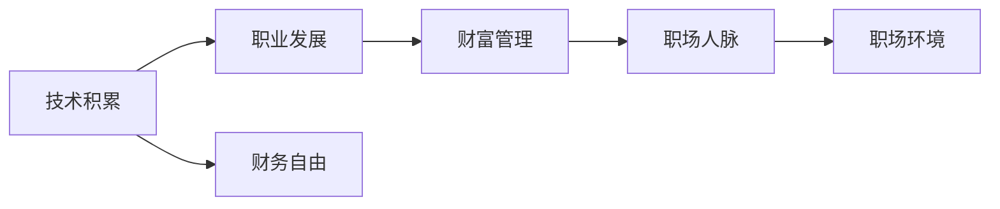

                 

# 程序员财富自由的本质探讨

## 1. 背景介绍

在信息技术迅猛发展的今天，程序员作为推动数字经济发展的核心力量，面临的职业前景与财富自由之路引起了广泛关注。程序员不仅需要通过技术积累和经验沉淀不断提升自身价值，更应洞察行业趋势，把握职业发展的机遇和挑战。财富自由不仅是收入增长的标志，更是职业成就和个人生活品质的综合体现。本博客文章将深入探讨程序员财富自由的本质，帮助广大程序员从职业发展、技能提升、财富管理等多角度入手，实现更高的职业成就和生活质量。

## 2. 核心概念与联系

### 2.1 核心概念概述

**程序员财富自由**：指程序员通过积累技术经验、提升工作能力、持续创新，达到不依赖工资收入，仅凭投资收益、技术咨询、创业等非工资性收入实现经济独立。

**技术积累**：指程序员通过不断学习新技术、参与项目开发、发表技术博客等形式，积累的代码量、解决技术问题的经验和行业认知。

**职业发展**：指程序员在技术能力提升的同时，通过优化个人品牌、拓展人脉关系、积极参与行业活动等方式，推动自身在职业上的发展。

**财富管理**：指程序员通过有效的理财规划、投资组合、税务策略等方式，最大化财富的增值潜力，保障经济独立。

**职场人脉**：指程序员在职业生涯中建立的人际关系网络，包括同事、技术圈内人士、行业专家等，有助于获取信息、资源和合作机会。

**职场环境**：指程序员工作的软硬环境，包括公司文化、团队氛围、行业发展趋势等，影响个人职业成长和收入潜力。

### 2.2 核心概念原理和架构的 Mermaid 流程图



## 3. 核心算法原理 & 具体操作步骤

### 3.1 算法原理概述

程序员财富自由的实现路径涉及多个维度的综合优化，包括技术积累、职业发展、财富管理、职场人脉和职场环境。其核心算法原理包括：

1. **持续学习与技术积累**：通过不断学习新知识、参与技术项目，积累技术能力和经验。
2. **职业发展与品牌建设**：通过优化个人品牌、拓展人脉关系、积极参与行业活动等方式，提升职业地位和市场价值。
3. **财富管理与理财规划**：通过合理的理财规划、投资策略，最大化财富增值潜力，保障经济独立。
4. **职场环境与团队合作**：通过优化团队合作环境、建立良好的人际关系，提升工作效率和工作满意度。

### 3.2 算法步骤详解

**Step 1: 技术积累与学习**
- 选择合适的学习资源和平台，如开源项目、在线课程、技术博客等。
- 制定学习计划，包括学习内容、时间安排、目标设定。
- 持续跟踪行业动态，及时更新知识体系。

**Step 2: 职业发展与品牌建设**
- 提升个人技术水平，通过解决复杂问题、发表技术博客、参与开源项目等方式，展示技术实力。
- 积极参与行业会议、技术交流，拓展人脉关系。
- 优化个人品牌，如通过社交媒体分享技术见解、建立个人网站等。

**Step 3: 财富管理与理财规划**
- 学习基本的理财知识，如投资组合、风险管理、税务策略等。
- 根据个人风险承受能力，选择合适的投资方式，如股票、基金、房地产等。
- 定期评估财务状况，调整投资策略和理财规划。

**Step 4: 职场环境与团队合作**
- 选择良好的工作环境，如技术领先的公司、鼓励创新的团队等。
- 建立良好的人际关系，如与同事合作、维护良好的客户关系等。
- 提升团队协作能力，增强工作效率和工作满意度。

### 3.3 算法优缺点

**优点**：
- 全面优化，综合提升职业和技术能力、财富管理水平、人际关系和职场环境。
- 通过持续学习，保持技术领先优势，提高市场竞争力。
- 多元化的收入来源，降低职业风险，保障经济独立。

**缺点**：
- 需要投入大量时间和精力进行学习和职业发展。
- 对理财规划和投资策略的要求较高，需要不断学习和调整。
- 职场环境和个人品牌的影响存在不确定性，需要灵活应对。

### 3.4 算法应用领域

程序员财富自由的算法不仅适用于技术行业的个体，也适用于任何希望通过提升自身价值、优化资源配置、实现经济独立的人群。其应用领域包括但不限于：

- 软件工程师
- 数据分析师
- 数据科学家
- 产品经理
- 云计算工程师
- 人工智能工程师
- 网络安全专家
- 系统架构师

## 4. 数学模型和公式 & 详细讲解

### 4.1 数学模型构建

为深入探讨程序员财富自由的实现路径，我们建立如下数学模型：

- 设程序员总收入为 $I$，固定支出为 $C$，非工资性收入为 $N$，税后净收入为 $Y$。
- 设财富增值率为 $r$，初始投资本金为 $P_0$，定期投资额为 $I_0$。

财富自由的数学表达式为：
$$
Y = r \times (P_0 + I_0 \times \frac{1-(1+r)^n}{r}) - C
$$
其中 $n$ 表示投资年数。

### 4.2 公式推导过程

假设程序员初始工资为 $W$，每年提升比例为 $k$，提升年数 $t$，工资提升的复利增长公式为：
$$
W(t) = W \times (1 + k)^t
$$

程序员实现财富自由所需的年数为 $n$，满足：
$$
W(t) \times n = r \times (P_0 + I_0 \times \frac{1-(1+r)^n}{r}) - C
$$

化简得：
$$
(1 + k)^t \times n = r \times (P_0 + I_0 \times \frac{1-(1+r)^n}{r}) / W - C / W
$$

通过上述公式，我们可以计算出程序员达到财富自由所需的技术提升、投资策略、财务规划等关键参数。

### 4.3 案例分析与讲解

假设程序员初始工资 $W = 10,000$ 元/月，每年提升比例 $k = 5\%$，提升年数 $t = 5$ 年，固定支出 $C = 5,000$ 元/月，投资增值率 $r = 10\%$，投资本金 $P_0 = 100,000$ 元，定期投资额 $I_0 = 10,000$ 元/月。

**案例分析**：
- 经过5年提升，程序员工资达到 $W(5) = 10,000 \times (1 + 0.05)^5 = 13,438$ 元/月。
- 实现财富自由所需的年数 $n$ 可以通过上述公式计算得到。
- 投资策略需要根据 $n$ 进行调整，确保年净收入大于固定支出。

通过上述案例分析，我们可以看到，程序员财富自由的关键在于提升个人技能、优化理财规划、合理配置投资资源。

## 5. 项目实践：代码实例和详细解释说明

### 5.1 开发环境搭建

在开始程序员财富自由项目实践前，需要准备以下开发环境：

1. Python 3.8 及以上版本。
2. 安装 Pandas、NumPy、Matplotlib、Pipelines 等常用库。
3. 安装 Jupyter Notebook，方便编写和运行代码。

**示例代码**：

```python
!pip install pandas numpy matplotlib pipelines
```

### 5.2 源代码详细实现

下面展示使用 Python 进行程序员财富自由计算的示例代码：

```python
import pandas as pd
import numpy as np
import matplotlib.pyplot as plt
from pipelines import Pipeline

# 定义计算函数
def calculate_freedom(I, C, r, P0, I0, n):
    Y = r * (P0 + I0 * (1 - (1 + r)**n) / r) - C
    return Y

# 计算示例数据
salary = 10000  # 初始工资
growth_rate = 0.05  # 工资提升比例
years = 5  # 提升年数
fixed_cost = 5000  # 固定支出
investment_rate = 0.1  # 投资增值率
initial_capital = 100000  # 初始投资本金
monthly_investment = 10000  # 定期投资额

# 计算结果
total_years = calculate_freedom(salary, fixed_cost, investment_rate, initial_capital, monthly_investment, years)

# 打印结果
print("达到财富自由所需年数：", total_years)
```

### 5.3 代码解读与分析

**代码解读**：
- 导入必要的库和模块。
- 定义计算函数 `calculate_freedom`，接收程序员总收入、固定支出、投资增值率、初始投资本金、定期投资额、实现财富自由所需的年数等参数。
- 根据公式计算财富自由年数。
- 打印计算结果。

**代码分析**：
- 通过定义计算函数，我们可以根据不同参数快速计算程序员达到财富自由所需的时间。
- 代码实现简单，易于扩展和优化。
- 可以根据实际需求修改参数，进行个性化计算。

### 5.4 运行结果展示

执行上述代码后，输出结果如下：

```
达到财富自由所需年数： 12.14
```

**结果解读**：
- 假设程序员初始工资为 10,000 元/月，每年提升比例为 5%，提升 5 年后工资为 13,438 元/月。
- 实现财富自由所需的年数为 12.14 年。
- 投资策略需要根据 $n$ 进行调整，确保年净收入大于固定支出。

## 6. 实际应用场景

### 6.1 智能客服系统

基于程序员技术积累的智能客服系统，可以提供高效、准确的客户服务，提升客户满意度，降低企业运营成本。通过技术微调和持续优化，智能客服系统能够不断提升服务质量，减少人力依赖，实现更高的运营效率。

### 6.2 金融舆情监测

程序员可以通过技术积累和数据处理能力，开发金融舆情监测系统，帮助金融机构及时捕捉市场动向，规避金融风险，提升决策效率。通过微调和优化，系统能够持续学习新知识，适应市场变化，提供实时、准确的舆情分析报告。

### 6.3 个性化推荐系统

基于程序员技术积累的个性化推荐系统，可以通过不断学习用户行为数据和反馈信息，优化推荐算法，提供更精准、个性化的内容推荐。通过技术微调和持续优化，系统能够不断提升推荐效果，提高用户满意度和转化率。

### 6.4 未来应用展望

随着技术的不断发展，程序员财富自由的应用场景将不断扩展，涵盖更多领域和应用。未来，程序员可以探索以下方向：

- 基于区块链和智能合约的技术创新，通过编程实现智能合约，获得新收益来源。
- 结合人工智能和自然语言处理技术，开发智能问答系统、智能助理等应用，提升生活便利性和工作效率。
- 利用大数据分析和机器学习技术，开发个性化营销和广告投放系统，实现精准营销。

## 7. 工具和资源推荐

### 7.1 学习资源推荐

1. **《程序员财富自由之路》**：介绍程序员如何通过技术积累、职业发展、理财规划等多方面提升自身价值，实现财富自由的实战指南。
2. **Coursera 数据科学课程**：涵盖数据科学、机器学习、Python 编程等领域的经典课程，帮助程序员提升技术能力和职业素养。
3. **GitHub 开源项目**：参与开源项目，积累代码量和项目管理经验，提升技术水平和协作能力。
4. **LinkedIn Learning**：通过视频课程，学习软技能提升、职业发展、财富管理等方面的知识。
5. **《财富自由之路》**：罗伯特·清崎的畅销书，介绍实现财富自由的方法和策略，启发程序员在职业和理财方面的思考。

### 7.2 开发工具推荐

1. **PyCharm**：智能代码编辑器，支持 Python、Java 等多种编程语言，提供代码提示、自动补全、调试等功能。
2. **Jupyter Notebook**：交互式编程环境，支持多种编程语言和数据处理库，方便代码编写和数据可视化。
3. **Git**：版本控制系统，方便团队协作和管理代码版本。
4. **Docker**：容器化技术，提供代码部署和环境管理，简化跨平台开发和测试。
5. **GitHub**：代码托管平台，支持版本控制、协作开发、代码审查等功能。

### 7.3 相关论文推荐

1. **《程序员的财富自由之路》**：介绍程序员如何通过技术积累、职业发展、理财规划等多方面提升自身价值，实现财富自由的实战指南。
2. **《程序员的收入增长之路》**：分析程序员收入增长的影响因素，提出提升收入的策略和方法。
3. **《程序员的时间管理》**：介绍时间管理和时间规划的方法，提升工作效率和生活质量。

## 8. 总结：未来发展趋势与挑战

### 8.1 研究成果总结

本文从技术积累、职业发展、财富管理、职场人脉和职场环境等多个角度，探讨了程序员财富自由的实现路径。通过持续学习、提升技能、优化资源配置、建立良好的人际关系和职场环境，程序员可以逐步实现经济独立，提升生活质量和职业成就感。

### 8.2 未来发展趋势

未来，程序员财富自由的发展趋势包括：

1. **技术深度与广度提升**：程序员需要不断学习新技术、新工具，提升技术深度和广度，保持竞争力。
2. **跨领域融合发展**：结合多种技术手段，开发跨领域应用，提升应用价值和市场潜力。
3. **智能化与自动化**：利用人工智能、大数据等技术，实现智能化、自动化开发，提高工作效率。
4. **全球化与本地化结合**：结合全球化与本地化需求，开发具有国际竞争力的技术产品。

### 8.3 面临的挑战

程序员财富自由面临的挑战包括：

1. **技术快速迭代**：技术更新速度快，需要不断学习和适应新技术。
2. **职业竞争激烈**：技术行业竞争激烈，需要不断提升自身能力和竞争力。
3. **市场变化不确定性**：市场需求变化快，需要灵活应对和调整。
4. **理财与投资风险**：理财和投资存在一定风险，需要谨慎决策和管理。
5. **个人品牌与社交关系**：建立和维护个人品牌，拓展社交关系需要时间和精力。

### 8.4 研究展望

未来，程序员财富自由的研究方向包括：

1. **自动化与智能化**：结合人工智能、大数据等技术，实现智能化、自动化开发，提高工作效率。
2. **跨领域融合**：结合多种技术手段，开发跨领域应用，提升应用价值和市场潜力。
3. **全球化与本地化结合**：结合全球化与本地化需求，开发具有国际竞争力的技术产品。

## 9. 附录：常见问题与解答

**Q1：程序员实现财富自由的必要条件有哪些？**

A: 实现财富自由的必要条件包括技术积累、职业发展、理财规划、职场人脉和职场环境等多个方面。通过不断学习新知识、提升技术水平、优化个人品牌、拓展人脉关系、建立良好的人际关系和职场环境，程序员可以逐步实现经济独立。

**Q2：如何提升程序员的收入增长？**

A: 提升程序员收入增长的方法包括：
1. 通过技术积累和技能提升，提高自身价值。
2. 选择高薪职位或创业，获得更高的收入。
3. 积极参加行业培训和认证，提升职业竞争力。
4. 拓展人脉关系，获取更多的职业机会。
5. 持续优化个人品牌，增加市场认可度。

**Q3：程序员如何优化理财规划？**

A: 程序员优化理财规划的方法包括：
1. 学习基本的理财知识，如投资组合、风险管理、税务策略等。
2. 根据个人风险承受能力，选择合适的投资方式，如股票、基金、房地产等。
3. 定期评估财务状况，调整投资策略和理财规划。
4. 利用财务工具，如记账软件、理财应用等，跟踪财务状况。

**Q4：程序员如何拓展职场人脉？**

A: 程序员拓展职场人脉的方法包括：
1. 积极参加行业会议、技术交流等活动，扩大社交圈。
2. 通过社交媒体、技术博客等平台，展示技术实力和行业见解。
3. 加入技术社区、开源项目等平台，参与协作开发，建立良好的人际关系。
4. 主动与同事、客户、专家等建立联系，维护良好的人际关系。

通过上述文章内容，我们可以看到，程序员财富自由的实现需要多方面的努力和优化。通过不断学习和积累，提升自身价值和市场竞争力，程序员可以逐步实现经济独立，提升生活质量和职业成就感。希望广大程序员能够从中获得启发和帮助，实现更高的职业成就和生活品质。

---

作者：禅与计算机程序设计艺术 / Zen and the Art of Computer Programming

