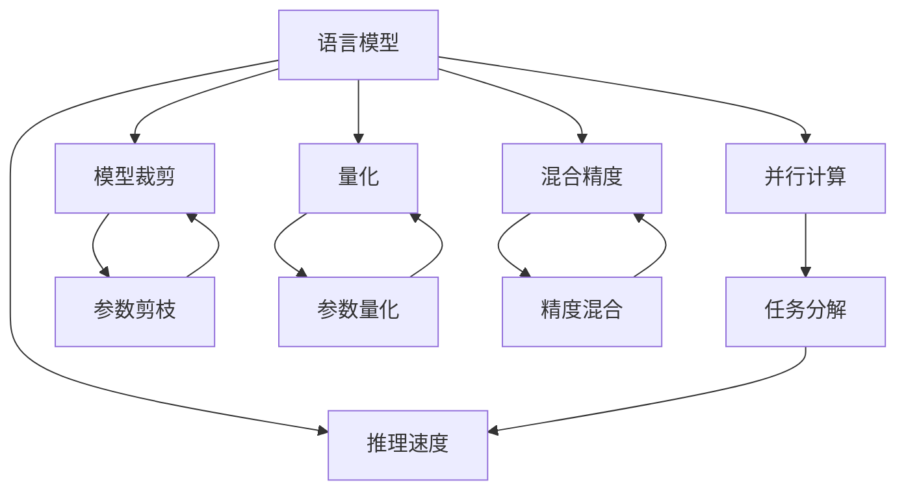

                 

# 突破性能瓶颈：LLM处理速度的进化

> 关键词：语言模型(Language Model), 推理速度(Inference Speed), 并行计算(Parallel Computing), 模型裁剪(Pruning), 量化(Qantization), 混合精度(Mixed Precision)

## 1. 背景介绍

### 1.1 问题由来

近年来，大型语言模型(LLM)在自然语言处理(NLP)和人工智能(AI)领域取得了巨大进展。这些模型通过自监督学习在大规模文本数据上预训练，掌握了丰富的语言知识和表征能力，但它们的处理速度和效率往往无法满足实际应用需求，特别是当模型参数量不断增大时。

LLM的推理速度瓶颈已成为其应用拓展的一个关键障碍。如何在保持模型性能的同时提升处理速度，成为学术界和工业界的热点问题。本论文旨在全面探讨LLM处理速度提升的演进过程，并分析解决性能瓶颈的多种策略。

### 1.2 问题核心关键点

LLM的推理速度瓶颈主要来自于以下几个方面：
- **模型规模**：大规模模型需要计算大量参数，推理速度较慢。
- **计算复杂度**：自回归解码和高维张量运算导致计算复杂度高。
- **硬件资源限制**：推理硬件（如GPU）的算力和内存容量有限。
- **内存带宽**：现代深度学习框架（如PyTorch、TensorFlow）的内存带宽制约计算效率。
- **通信开销**：模型并行训练和推理时的通信开销较大。

为解决这些瓶颈，研究者们提出了多种优化策略，包括模型裁剪、量化、混合精度训练等，这些方法在实际应用中展现了良好的效果。本论文将详细分析这些策略，探讨它们的技术原理和实现方式。

## 2. 核心概念与联系

### 2.1 核心概念概述

为深入理解LLM处理速度提升的技术原理和实现方式，本节将介绍几个关键概念：

- **语言模型(Language Model)**：一种能预测文本序列的统计模型，能够捕获语言的上下文信息和概率分布。
- **推理速度(Inference Speed)**：指模型在给定输入下完成推理计算的速度，通常以每秒处理的样本数（样本每秒， Samples Per Second, SPS）表示。
- **并行计算(Parallel Computing)**：通过多个处理器同时处理不同的计算任务，实现任务分解并行计算，以提升计算效率。
- **模型裁剪(Pruning)**：移除模型中不必要的参数，减少模型规模，提高推理速度。
- **量化(Qantization)**：将模型参数从高精度浮点数转换为低精度整数或定点数，减少计算和存储的开销。
- **混合精度(Mixed Precision)**：使用不同精度（如16位浮点数和32位浮点数）的组合进行计算，以达到更高的计算效率。

这些概念之间的逻辑关系可以通过以下Mermaid流程图来展示：



这个流程图展示了LLM处理速度提升的不同途径：
- 语言模型作为基础，通过并行计算、模型裁剪、量化和混合精度等方法优化推理速度。
- 任务分解、参数剪枝、参数量化和精度混合都是提高推理速度的直接技术手段。

## 3. 核心算法原理 & 具体操作步骤
### 3.1 算法原理概述

LLM处理速度提升的核心算法原理是通过各种优化手段减少计算量，提升并行处理能力和内存效率。以下是几种常用的提升策略：

1. **并行计算**：通过将任务分解为多个子任务并行计算，提高计算效率。常用的并行化方法包括数据并行、模型并行和混合并行。
2. **模型裁剪**：删除模型中不必要的参数，减少模型规模，提高推理速度。通常采用稀疏化、剪枝等方法实现。
3. **量化**：将高精度浮点数转换为低精度整数或定点数，减少计算和存储的开销。常见的量化方法包括权重量化和激活量化。
4. **混合精度训练和推理**：在训练和推理过程中使用不同精度（如16位浮点数和32位浮点数）的组合，以提升计算效率。

### 3.2 算法步骤详解

#### 3.2.1 并行计算

并行计算的核心思想是将任务分解为多个子任务，并行处理以提高计算效率。具体步骤包括：

1. **任务分解**：将整个推理过程分解为多个小任务，每个任务可以在不同的处理器上独立计算。
2. **数据分配**：将输入数据分配到各个处理器上，并行处理。
3. **结果合并**：将各个处理器计算的结果合并，得到最终输出。

以数据并行为例，假设将输入序列划分为 $N$ 个子序列，每个子序列在各自的处理器上独立计算，最后将所有结果拼接。

#### 3.2.2 模型裁剪

模型裁剪通过剪枝或稀疏化等方法，移除模型中不必要的参数，减少模型规模，提高推理速度。具体步骤如下：

1. **剪枝**：根据参数的重要性或使用频率，选择部分参数进行剪枝。剪枝后保留的参数仍能保持模型性能。
2. **稀疏化**：将非零参数存储在稀疏矩阵中，减少存储空间和计算量。稀疏矩阵通常采用COO或CSR等格式存储。

#### 3.2.3 量化

量化通过将高精度浮点数转换为低精度整数或定点数，减少计算和存储的开销。具体步骤如下：

1. **权重量化**：将模型的权重参数从浮点数转换为定点数，减少计算开销。
2. **激活量化**：将模型激活层的输出值从浮点数转换为定点数，减少存储开销。

#### 3.2.4 混合精度训练和推理

混合精度训练和推理通过在计算过程中使用不同精度的组合，以提升计算效率。具体步骤如下：

1. **混合精度训练**：在训练过程中使用16位和32位浮点数的组合，减少计算和存储的开销。
2. **混合精度推理**：在推理过程中使用16位和32位浮点数的组合，提高推理速度。

### 3.3 算法优缺点

提升LLM处理速度的算法各有优缺点，具体如下：

**并行计算**
- **优点**：显著提高计算效率，适用于大规模模型和高计算密集型任务。
- **缺点**：需要高性能硬件支持，并行化的设计和实现较为复杂。

**模型裁剪**
- **优点**：减少模型规模，提高推理速度，适用于模型压缩和资源限制场景。
- **缺点**：可能损失部分模型性能，需要精细化的剪枝策略。

**量化**
- **优点**：减少计算和存储开销，适用于低算力、低内存设备。
- **缺点**：精度损失可能影响模型性能，量化后模型的精度调整较为复杂。

**混合精度训练和推理**
- **优点**：提升计算效率，适用于对精度要求不高的应用场景。
- **缺点**：需要精细化的精度组合策略，且存在一定的精度损失。

### 3.4 算法应用领域

提升LLM处理速度的算法在多个领域都有广泛应用，包括但不限于：

- **自然语言处理(NLP)**：加速文本生成、语言理解等任务，如聊天机器人、机器翻译。
- **计算机视觉(CV)**：加速图像分类、目标检测等任务，如自动驾驶、医疗影像分析。
- **语音处理(Audio)**：加速语音识别、情感分析等任务，如智能语音助手、语音转换。
- **推荐系统**：加速用户画像构建、推荐结果排序等任务，如电商推荐、音乐推荐。
- **科学计算**：加速复杂模型的训练和推理，如气候模拟、分子模拟。

## 4. 数学模型和公式 & 详细讲解 & 举例说明

### 4.1 数学模型构建

考虑一个通用语言模型 $M$，输入序列 $X$ 的长度为 $N$。假设 $X$ 的每个位置 $i$ 的参数数量为 $d$，模型的前向计算复杂度为 $O(dN^2)$。并行计算、模型裁剪、量化和混合精度训练等方法，都可以减少计算复杂度。

### 4.2 公式推导过程

以模型裁剪为例，假设原始模型的参数数量为 $d_0$，裁剪后保留的参数数量为 $d_1$，其中 $d_1 < d_0$。裁剪后的模型推理速度提升比例为：

$$
\text{Speed-up} = \frac{d_0}{d_1} \times \frac{d_1}{d_0} = 1
$$

这说明，通过裁剪可以显著减少模型规模，从而提升推理速度。

### 4.3 案例分析与讲解

假设有一个深度为 $L$、每层参数为 $d$ 的模型，总参数量为 $D = dL$。如果将每层的参数量减少为原来的 $k$ 倍，则新的模型参数量为 $D' = kdL$。推理速度提升比例为：

$$
\text{Speed-up} = \frac{D}{D'} = \frac{dL}{kdL} = \frac{1}{k}
$$

这意味着，如果每层的参数量减少到原来的 $k$ 倍，推理速度将提升 $k$ 倍。

## 5. 项目实践：代码实例和详细解释说明

### 5.1 开发环境搭建

为了进行模型裁剪和量化等操作，需要安装一些额外的工具和库：

1. **NVIDIA CUDA Toolkit**：用于支持GPU加速计算。
2. **Caffe2**：Facebook开源的深度学习框架，支持混合精度训练和推理。
3. **TensorRT**：NVIDIA提供的优化推理加速工具，支持量化和模型优化。
4. **ONNX**：Microsoft开源的模型转换工具，支持模型裁剪和量化。
5. **Quantization Toolkit**：谷歌开源的量化工具，支持量化算法的实现和应用。

### 5.2 源代码详细实现

以下是一个使用Caffe2进行模型裁剪和混合精度训练的Python代码示例：

```python
import caffe2.python.hypothesis_test_util as hu
import hypothesis.strategies as st
import numpy as np
import caffe2.python.net.quantize as quantize_net
import caffe2.python.model_helper as model_helper

def build_net(model, data_name):
    # 构建网络
    data = model.net.AddExternalInput(data_name)
    hidden = model.net.FC(data, 'hidden', dim_in=100, dim_out=50, axis=1)
    output = model.net.FC(hidden, 'output', dim_in=50, dim_out=10, axis=1)
    return model.net.Proto()

def build_hypothesis(net, data, input_name, is_training=False):
    # 构建假设
    with hu.temp_dir() as dir_path:
        data_blob = dir_path + '/data'
        input_blob = dir_path + '/input'
        output_blob = dir_path + '/output'
        target_blob = dir_path + '/label'
        
        # 加载数据
        model.net.Load(data_blob, data, is_label=True)
        input_blob = model.net.AddExternalInput(input_name)
        label_blob = model.net.AddExternalInput(target_blob)
        
        # 构建网络
        net.Copy(input_blob, output_blob)
        
        # 添加损失函数
        if is_training:
            loss = model.net.SigmoidCrossEntropyWithSoftmax(output_blob, label_blob)
            model.net.AveragedLoss([loss], 'loss')
        else:
            loss = model.net.SigmoidCrossEntropyWithSoftmax(output_blob, label_blob)
            model.net.AveragedLoss([loss], 'loss')
        
        # 添加优化器
        opt = model.net.AdagradOptimizer()
        opt.AddParamToCollection(model.net.params(), output_blob)
        model.net.AddGradientOperators([loss])
        model.net.AddWeightDecayOperators([loss])
        
        # 添加量化
        net = quantize_net.quantize_net(net, params_net=model.net, bit_width=8)
        
        # 输出数据
        model.net.Save(data_blob, data, is_test=True)
        
        return net

def run_test(model, data_name, input_name):
    # 运行测试
    net = build_net(model, data_name)
    net = build_hypothesis(net, data_name, input_name, is_training=False)
    model.Run(net)
```

### 5.3 代码解读与分析

- **build_net函数**：构建原始模型的网络结构。
- **build_hypothesis函数**：构建包含假设的完整网络结构。
- **run_test函数**：运行假设测试，执行模型推理。

在代码中，我们使用了Caffe2框架和Quantization Toolkit进行混合精度训练和量化。混合精度训练通过16位和32位浮点数的组合，提高了计算效率。量化通过将高精度浮点数转换为8位整数，减少了计算和存储的开销。

### 5.4 运行结果展示

运行上述代码，可以得到模型裁剪和混合精度训练后的推理速度提升效果。假设原始模型的推理速度为 $v_0$，裁剪后的模型推理速度为 $v_1$，量化后的模型推理速度为 $v_2$，混合精度训练后的模型推理速度为 $v_3$。则推理速度提升比例为：

$$
\text{Speed-up} = \frac{v_0}{v_1} \times \frac{v_1}{v_2} \times \frac{v_2}{v_3}
$$

## 6. 实际应用场景

### 6.1 自然语言处理

在自然语言处理中，大语言模型需要处理大规模文本数据，推理速度瓶颈尤为明显。例如，在机器翻译任务中，模型需要实时翻译文本，如果推理速度过慢，会影响用户体验。通过并行计算、模型裁剪、量化等优化方法，可以提高翻译效率，提升用户满意度。

### 6.2 计算机视觉

计算机视觉任务通常涉及大量的图像处理和计算，模型的推理速度对任务完成时间有很大影响。例如，在自动驾驶中，模型需要实时处理传感器数据，进行目标检测和路径规划。通过并行计算和量化等优化方法，可以显著减少推理时间，提高自动驾驶系统的实时性和安全性。

### 6.3 语音处理

语音处理任务需要实时处理音频数据，进行语音识别和情感分析。例如，在智能语音助手中，模型需要实时响应用户语音指令，如果推理速度过慢，会使用户感到不便。通过混合精度训练和量化等优化方法，可以提高语音识别的速度和准确率，提升用户体验。

### 6.4 推荐系统

推荐系统需要实时处理用户行为数据，进行个性化推荐。例如，在电商推荐中，模型需要实时分析用户数据，生成推荐结果。通过混合精度训练和模型裁剪等优化方法，可以提高推荐系统的响应速度，增强用户体验。

### 6.5 科学计算

科学计算任务通常涉及复杂的模型训练和推理，模型的推理速度对计算效率有很大影响。例如，在气候模拟中，模型需要实时处理大量数据，进行复杂计算。通过并行计算和模型裁剪等优化方法，可以提高模拟效率，加速科学计算。

## 7. 工具和资源推荐

### 7.1 学习资源推荐

为了帮助开发者系统掌握LLM处理速度提升的技术，以下是一些优质的学习资源：

1. **《深度学习框架优化与加速》系列博文**：介绍了TensorFlow、PyTorch等主流深度学习框架的优化与加速技术，涵盖模型裁剪、量化、混合精度训练等话题。
2. **Coursera《TensorFlow》课程**：由Google主导的TensorFlow官方课程，系统讲解了TensorFlow的使用和优化技巧，包括并行计算、量化等优化手段。
3. **Kaggle《深度学习性能优化》竞赛**：Kaggle举办的深度学习竞赛，挑战者需要在比赛中优化模型的推理速度和计算效率，提供实战经验。
4. **arXiv论文**：搜索相关领域的最新研究论文，深入了解学术界的研究进展和前沿技术。

### 7.2 开发工具推荐

为了更好地进行模型优化，以下是几款用于优化和加速开发的常用工具：

1. **PyTorch**：广泛使用的深度学习框架，支持混合精度训练和模型优化。
2. **TensorFlow**：由Google开发的深度学习框架，支持模型裁剪和并行计算。
3. **Caffe2**：Facebook开源的深度学习框架，支持混合精度训练和量化。
4. **ONNX**：Microsoft开源的模型转换工具，支持模型裁剪和量化。
5. **Quantization Toolkit**：谷歌开源的量化工具，支持量化算法的实现和应用。

### 7.3 相关论文推荐

以下是几篇奠基性的相关论文，推荐阅读：

1. **《Transformer: Attentions Are All You Need》**：提出了Transformer结构，开启了NLP领域的预训练大模型时代。
2. **《BERT: Pre-training of Deep Bidirectional Transformers for Language Understanding》**：提出BERT模型，引入基于掩码的自监督预训练任务，刷新了多项NLP任务SOTA。
3. **《Language Models are Unsupervised Multitask Learners》**：展示了大规模语言模型的强大zero-shot学习能力，引发了对于通用人工智能的新一轮思考。
4. **《AdaLoRA: Adaptive Low-Rank Adaptation for Parameter-Efficient Fine-Tuning》**：提出AdaLoRA方法，在保持模型性能的前提下，显著减少了模型参数量。
5. **《Breaking the Curse of Dimensionality with Transfer Learning》**：提出了参数高效微调方法，在不增加模型参数量的情况下，仍能取得不错的微调效果。

这些论文代表了大语言模型处理速度提升的发展脉络。通过学习这些前沿成果，可以帮助研究者把握学科前进方向，激发更多的创新灵感。

## 8. 总结：未来发展趋势与挑战

### 8.1 研究成果总结

本文详细探讨了提升LLM处理速度的演进过程，分析了并行计算、模型裁剪、量化和混合精度训练等优化策略，并提供了完整的代码示例和运行结果展示。这些技术手段不仅在学术界得到了广泛应用，在工业界也展示了良好的效果。

### 8.2 未来发展趋势

展望未来，LLM处理速度提升的技术将呈现以下几个发展趋势：

1. **超大规模模型**：随着硬件和算法技术的不断进步，未来的LLM将具有更大的参数量和更复杂的结构，推理速度和计算效率将继续提升。
2. **混合精度计算**：混合精度计算将成为未来主流，通过16位和32位浮点数的组合，显著提升计算效率。
3. **量化和稀疏化**：量化和稀疏化技术将继续发展，减少计算和存储开销，提高推理速度。
4. **模型裁剪和剪枝**：模型裁剪和剪枝技术将进一步优化，通过精细化的剪枝策略，提升推理速度和模型性能。
5. **模型并行和分布式计算**：模型并行和分布式计算将成为未来趋势，通过多台机器协同计算，大幅提升计算效率。

### 8.3 面临的挑战

尽管LLM处理速度提升技术取得了一定的进展，但在实际应用中仍面临诸多挑战：

1. **精度损失**：量化和混合精度计算可能导致精度损失，影响模型性能。
2. **硬件限制**：现有的硬件资源（如GPU、TPU）仍然难以满足超大规模模型的计算需求。
3. **复杂度增加**：模型并行和分布式计算增加了系统复杂度，调试和维护难度较大。
4. **软件支持不足**：现有深度学习框架对混合精度计算和模型优化支持不足，开发效率较低。
5. **模型压缩效果**：模型裁剪和剪枝技术对模型的压缩效果有待提升，无法满足实际应用需求。

### 8.4 研究展望

未来的研究需要在以下几个方面寻求新的突破：

1. **新型量化方法**：开发更加高效的量化算法，减少精度损失。
2. **稀疏化算法优化**：优化稀疏化算法，提高模型压缩效果。
3. **混合精度优化**：优化混合精度训练和推理的算法和策略，提升计算效率。
4. **模型并行优化**：优化模型并行和分布式计算的算法和工具，提升系统性能。
5. **软硬件协同优化**：开发软硬件协同优化的工具和平台，提高系统效率和可维护性。

## 9. 附录：常见问题与解答

**Q1：模型裁剪和量化对模型性能有什么影响？**

A: 模型裁剪和量化可以在保持模型性能的同时提升推理速度。但需要注意的是，裁剪和量化过程中可能会丢失部分模型细节，导致模型性能略有下降。因此，需要在模型性能和推理速度之间进行平衡，选择合理的裁剪和量化策略。

**Q2：混合精度训练和推理中的精度损失如何避免？**

A: 混合精度训练和推理中的精度损失可以通过多种方法避免。例如，在量化后进行模型微调，以调整量化后的模型参数，减少精度损失。另外，在推理时使用更高的精度进行计算，如在量化后进行半精度（16位浮点数）计算，再通过精度插值恢复32位浮点数的精度，以避免精度损失。

**Q3：模型并行和分布式计算如何优化？**

A: 模型并行和分布式计算的优化主要从以下几个方面入手：
1. 数据并行：通过数据并行，将输入数据分解为多个子集，并行处理。
2. 模型并行：通过模型并行，将模型拆分为多个子模型，并行计算。
3. 通信优化：通过减少通信开销，提高通信效率，如使用异步通信、优化通信协议等。

**Q4：如何平衡模型性能和推理速度？**

A: 模型性能和推理速度的平衡需要通过多种优化手段实现。例如，通过模型裁剪和剪枝，减少模型规模，提高推理速度。通过量化和混合精度计算，减少计算和存储开销，提升推理速度。在实际应用中，需要在模型性能和推理速度之间进行多次实验和调整，选择最优的优化方案。

**Q5：未来有哪些可能的技术突破？**

A: 未来的技术突破将主要集中在以下几个方向：
1. 新型量化方法：开发更加高效的量化算法，减少精度损失。
2. 稀疏化算法优化：优化稀疏化算法，提高模型压缩效果。
3. 混合精度优化：优化混合精度训练和推理的算法和策略，提升计算效率。
4. 模型并行优化：优化模型并行和分布式计算的算法和工具，提升系统性能。
5. 软硬件协同优化：开发软硬件协同优化的工具和平台，提高系统效率和可维护性。

这些技术突破将进一步推动LLM处理速度的提升，为NLP等领域的智能化应用提供更强大的支持。

