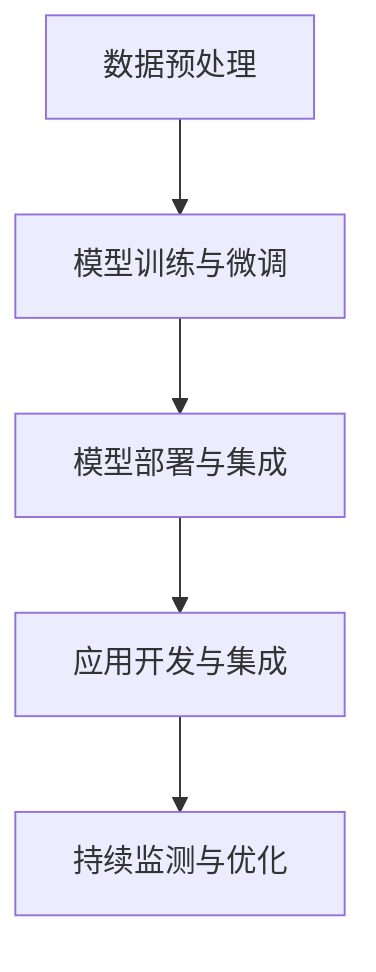

                 

# 端到端AI开发：从概念到实现

> 关键词：端到端AI,全栈开发,模型部署,AI工具链,应用开发,数据预处理

## 1. 背景介绍

### 1.1 问题由来

近年来，人工智能(AI)技术在各行各业得到了广泛应用，产生了巨大的社会经济效益。AI应用的背后，是一个庞大的技术生态系统，包括数据收集、模型训练、模型微调、模型部署、应用开发等多个环节。然而，由于技术环节众多，分工复杂，许多企业和开发者面临AI项目落地困难、效率低下、效果不佳等问题。

为应对这些挑战，越来越多的企业和开发者开始关注“端到端AI开发”（End-to-End AI Development）的概念，力求构建从数据预处理、模型训练、模型微调、模型部署、应用开发到上线维护的全流程、一体化的AI开发模式，以降低成本、提升效率、优化效果。

### 1.2 问题核心关键点

端到端AI开发的核心在于打破AI开发流程中的信息孤岛，形成完整的开发闭环，通过协同优化各个环节，最终提升AI应用的整体性能和落地效果。关键点包括：

1. **数据预处理**：从数据收集、数据清洗、特征工程到数据增强，实现高质量数据输入，为模型训练提供可靠基础。
2. **模型训练与微调**：选择合适的模型架构、超参数、优化算法等，通过大量计算资源训练出高性能模型，并进行任务特定的微调。
3. **模型部署与集成**：将训练好的模型部署到目标硬件平台，实现实时推理、应用集成和动态更新。
4. **应用开发与集成**：基于模型输出构建具体业务应用，开发前端界面、后端服务、数据存储等系统组件，形成完整应用流程。
5. **持续监测与优化**：对应用进行实时监控和反馈，根据用户反馈和新数据持续优化模型和应用。

实现端到端AI开发，需要整合多种技术和工具，涵盖从数据科学到软件工程的各个方面。本文将围绕这些关键点，系统阐述端到端AI开发的概念、技术和实践方法。

## 2. 核心概念与联系

### 2.1 核心概念概述

为更好地理解端到端AI开发，本节将介绍几个核心概念及其相互联系：

- **端到端AI开发**：从数据预处理、模型训练、模型微调、模型部署、应用开发到持续监测的完整开发流程。
- **全栈开发**：涵盖数据科学、机器学习、软件工程等多个技术栈，实现从模型训练到应用落地的全过程。
- **模型部署与集成**：将训练好的模型部署到目标平台，集成到实际业务应用中，实现实时推理。
- **AI工具链**：用于支持端到端AI开发的一整套工具和技术栈，包括数据处理工具、模型训练框架、模型优化工具、应用开发工具等。
- **应用开发与集成**：基于模型输出构建实际应用，开发前端、后端、数据存储等功能模块，形成完整业务流程。
- **持续监测与优化**：对模型和应用进行实时监控和反馈，根据新数据和新需求持续优化模型和应用。

这些核心概念之间的逻辑关系可以通过以下Mermaid流程图来展示：



这个流程图展示了从数据预处理到持续监测的全流程，每一个环节都是端到端AI开发的关键组成部分。

## 3. 核心算法原理 & 具体操作步骤

### 3.1 算法原理概述

端到端AI开发涉及多种算法和技术，主要包括数据预处理、模型训练、模型微调、模型部署与集成、应用开发与集成等。本文将从算法原理的角度，简要介绍这些关键技术。

### 3.2 算法步骤详解

#### 3.2.1 数据预处理

数据预处理是端到端AI开发的第一步，包括数据收集、数据清洗、特征工程、数据增强等。

- **数据收集**：从不同渠道收集所需数据，如在线表单、社交媒体、传感器数据等。
- **数据清洗**：去除数据中的噪声、异常值和重复数据，确保数据质量。
- **特征工程**：根据模型需求提取和构造特征，实现数据降维、归一化等。
- **数据增强**：通过数据扩充、扩增等技术，增加数据多样性，防止模型过拟合。

#### 3.2.2 模型训练与微调

模型训练与微调是端到端AI开发的核心环节，通过选择合适的模型架构、超参数、优化算法等，训练出高性能模型，并进行任务特定的微调。

- **模型选择**：根据任务类型和数据特性，选择合适的模型架构，如线性回归、卷积神经网络(CNN)、循环神经网络(RNN)等。
- **超参数优化**：通过网格搜索、随机搜索、贝叶斯优化等方法，寻找最优超参数组合。
- **优化算法**：选择合适的优化算法，如梯度下降法、Adam、RMSprop等，加速模型收敛。
- **模型微调**：在预训练模型的基础上，使用任务特定的数据进行微调，优化模型在特定任务上的性能。

#### 3.2.3 模型部署与集成

模型部署与集成是将训练好的模型部署到目标平台，集成到实际业务应用中，实现实时推理。

- **模型导出**：将训练好的模型导出为可部署的格式，如TensorFlow SavedModel、ONNX等。
- **模型优化**：通过量化、剪枝、模型压缩等技术，优化模型大小和推理速度。
- **部署平台选择**：根据应用场景选择合适的部署平台，如云端、边缘计算设备、移动设备等。
- **模型集成**：将模型集成到实际业务应用中，通过API接口、SDK等方式实现实时推理。

#### 3.2.4 应用开发与集成

应用开发与集成基于模型输出构建实际应用，开发前端界面、后端服务、数据存储等功能模块，形成完整业务流程。

- **前端开发**：开发用户交互界面，实现用户输入、数据展示等功能。
- **后端开发**：开发API接口、业务逻辑等，实现数据处理、模型调用等功能。
- **数据存储**：选择合适的数据库或存储系统，存储和管理应用数据。
- **应用集成**：将前端、后端、数据存储等功能模块集成，形成完整的业务应用。

#### 3.2.5 持续监测与优化

持续监测与优化是对模型和应用进行实时监控和反馈，根据新数据和新需求持续优化模型和应用。

- **性能监控**：实时监控模型推理性能，如响应时间、准确率、召回率等。
- **用户反馈**：收集用户反馈，分析模型输出和用户体验。
- **模型更新**：根据新数据和新需求，持续更新和优化模型，保持模型性能。
- **应用优化**：根据用户反馈和模型输出，持续优化应用，提升用户体验。

### 3.3 算法优缺点

#### 3.3.1 优点

1. **全流程优化**：端到端AI开发能够对各个环节进行协同优化，提升整体性能。
2. **资源利用高效**：通过全栈开发和工具链支持，能够高效利用计算资源和开发资源。
3. **敏捷开发**：从数据预处理到模型部署，各个环节能够实现快速迭代和反馈，提升开发效率。
4. **适用性广**：端到端AI开发能够覆盖从数据科学到软件工程的各个方面，适用于各种AI应用场景。

#### 3.3.2 缺点

1. **技术难度高**：涉及多个技术栈，对开发者技术水平要求较高。
2. **成本高**：需要投入大量计算资源和开发资源，特别是在模型训练和部署环节。
3. **复杂度高**：涉及多个环节，协同开发和优化难度较大。

尽管存在这些缺点，但端到端AI开发仍是大规模AI应用的重要开发模式，能够显著提升AI应用的整体性能和落地效果。

### 3.4 算法应用领域

端到端AI开发广泛应用于各种AI应用场景，包括但不限于：

- **金融风控**：通过模型训练与微调，实现风险评估、欺诈检测等应用。
- **医疗诊断**：通过模型训练与微调，实现疾病诊断、治疗方案推荐等应用。
- **智能推荐**：通过模型训练与微调，实现个性化推荐、广告投放等应用。
- **自动驾驶**：通过模型训练与微调，实现环境感知、决策推理等应用。
- **语音识别**：通过模型训练与微调，实现语音转文本、语音交互等应用。
- **图像识别**：通过模型训练与微调，实现物体识别、场景理解等应用。
- **自然语言处理(NLP)**：通过模型训练与微调，实现文本分类、机器翻译、情感分析等应用。

## 4. 数学模型和公式 & 详细讲解 & 举例说明

### 4.1 数学模型构建

#### 4.1.1 线性回归模型

线性回归模型是端到端AI开发中最基本的模型之一，用于处理线性关系的数据。其数学模型为：

$$
y = \beta_0 + \beta_1 x_1 + \beta_2 x_2 + \cdots + \beta_n x_n + \epsilon
$$

其中，$y$ 为因变量，$x_1, x_2, \cdots, x_n$ 为自变量，$\beta_0, \beta_1, \beta_2, \cdots, \beta_n$ 为回归系数，$\epsilon$ 为随机误差项。

#### 4.1.2 卷积神经网络(CNN)

卷积神经网络是用于处理图像和视频数据的经典模型，其核心思想是通过卷积和池化操作，提取图像中的特征。其数学模型为：

$$
f(x) = \sigma(W * x + b)
$$

其中，$f(x)$ 为卷积神经网络的输出，$W$ 为卷积核，$x$ 为输入图像，$\sigma$ 为激活函数，$b$ 为偏置项。

#### 4.1.3 循环神经网络(RNN)

循环神经网络是用于处理序列数据的经典模型，通过时间步的循环连接，捕捉序列中的时序信息。其数学模型为：

$$
h_t = \sigma(W * [h_{t-1}, x_t] + b)
$$

其中，$h_t$ 为时间步$t$的隐藏状态，$W$ 为权重矩阵，$h_{t-1}$ 为时间步$t-1$的隐藏状态，$x_t$ 为时间步$t$的输入，$\sigma$ 为激活函数，$b$ 为偏置项。

### 4.2 公式推导过程

#### 4.2.1 线性回归模型的梯度下降法

线性回归模型的目标是最小化均方误差损失函数：

$$
J(\theta) = \frac{1}{2m} \sum_{i=1}^m (y_i - \hat{y}_i)^2
$$

其中，$m$ 为样本数量，$y_i$ 为真实标签，$\hat{y}_i$ 为模型预测值，$\theta$ 为模型参数。

梯度下降法通过迭代更新参数，最小化损失函数：

$$
\theta = \theta - \eta \frac{\partial J(\theta)}{\partial \theta}
$$

其中，$\eta$ 为学习率。

#### 4.2.2 卷积神经网络的前向传播和反向传播

卷积神经网络的前向传播过程为：

$$
h_1 = W_1 * x + b_1
$$

$$
h_2 = \sigma(h_1)
$$

$$
\cdots
$$

$$
h_L = \sigma(h_{L-1})
$$

其中，$h_1, h_2, \cdots, h_L$ 为不同时间步的隐藏状态，$W_1, \cdots, W_L$ 为卷积核，$x$ 为输入图像，$\sigma$ 为激活函数，$b_1, \cdots, b_L$ 为偏置项。

卷积神经网络的反向传播过程为：

$$
\frac{\partial L}{\partial W_{L}} = \delta_{L-1}
$$

$$
\frac{\partial L}{\partial b_{L}} = 1
$$

$$
\frac{\partial L}{\partial W_{L-1}} = \delta_{L-1} * h_{L-2}
$$

$$
\frac{\partial L}{\partial b_{L-1}} = \delta_{L-1}
$$

$$
\cdots
$$

$$
\frac{\partial L}{\partial W_{1}} = \delta_{1} * h_0
$$

$$
\frac{\partial L}{\partial b_{1}} = \delta_{1}
$$

其中，$L$ 为目标输出，$\delta_{L-1}, \delta_{L-2}, \cdots, \delta_{1}$ 为激活函数的导数，$W_1, \cdots, W_L$ 为卷积核，$x$ 为输入图像，$\sigma$ 为激活函数，$b_1, \cdots, b_L$ 为偏置项。

#### 4.2.3 循环神经网络的反向传播

循环神经网络的反向传播过程为：

$$
\frac{\partial L}{\partial h_t} = \frac{\partial L}{\partial z_t}
$$

$$
\frac{\partial L}{\partial z_t} = \frac{\partial L}{\partial h_{t+1}} * \frac{\partial \sigma(h_t)}{\partial z_t} + \frac{\partial L}{\partial h_{t-1}} * \frac{\partial \sigma(h_{t-1})}{\partial z_t}
$$

其中，$L$ 为目标输出，$h_t$ 为时间步$t$的隐藏状态，$z_t$ 为输入，$\sigma$ 为激活函数，$\frac{\partial \sigma(h_t)}{\partial z_t}$ 为激活函数的导数。

### 4.3 案例分析与讲解

#### 4.3.1 线性回归案例

某电商平台希望通过用户购买行为预测其未来购买意愿。假设数据集包含用户的历史购买记录和年龄信息，其中$y$为购买意愿，$x_1$为年龄，$x_2$为购买金额。使用线性回归模型进行预测。

1. 数据预处理：收集用户购买记录和年龄信息，进行数据清洗和特征工程。
2. 模型训练：使用梯度下降法训练线性回归模型，优化超参数。
3. 模型微调：根据目标任务，调整模型输出层，进行微调。
4. 模型部署：将训练好的模型导出为TensorFlow SavedModel格式，部署到云端服务器。
5. 应用开发：开发前端页面，收集用户数据，调用模型API进行预测。
6. 持续监测：实时监测模型性能，根据用户反馈进行模型更新。

#### 4.3.2 卷积神经网络案例

某医疗机构希望通过CT扫描图像诊断癌症。假设数据集包含CT图像和癌症标签。使用卷积神经网络进行图像分类。

1. 数据预处理：收集CT扫描图像和癌症标签，进行数据清洗和增强。
2. 模型训练：使用随机搜索优化超参数，训练卷积神经网络。
3. 模型微调：根据目标任务，调整模型输出层，进行微调。
4. 模型部署：将训练好的模型导出为ONNX格式，部署到边缘计算设备。
5. 应用开发：开发API接口，供医生调用模型进行诊断。
6. 持续监测：实时监测模型性能，根据医生反馈进行模型更新。

## 5. 项目实践：代码实例和详细解释说明

### 5.1 开发环境搭建

#### 5.1.1 数据预处理

使用Python的Pandas库进行数据预处理。

```python
import pandas as pd

# 读取数据
df = pd.read_csv('data.csv')

# 数据清洗
df.dropna(inplace=True)

# 特征工程
df['features'] = df[['age', 'purchase_amount']].mean()

# 数据增强
df = pd.concat([df, df.dropna()], ignore_index=True)

# 保存数据
df.to_csv('processed_data.csv', index=False)
```

#### 5.1.2 模型训练与微调

使用Python的TensorFlow库进行模型训练与微调。

```python
import tensorflow as tf

# 加载数据
df = pd.read_csv('processed_data.csv')

# 数据预处理
features = df['features']
labels = df['purchase_willingness']

# 划分训练集和验证集
train_size = int(0.8 * len(features))
train_features, train_labels = features[:train_size], labels[:train_size]
valid_features, valid_labels = features[train_size:], labels[train_size:]

# 构建模型
model = tf.keras.models.Sequential([
    tf.keras.layers.Dense(64, activation='relu', input_shape=(2,)),
    tf.keras.layers.Dense(1, activation='sigmoid')
])

# 编译模型
model.compile(optimizer=tf.keras.optimizers.Adam(0.001), loss='binary_crossentropy', metrics=['accuracy'])

# 训练模型
model.fit(train_features, train_labels, epochs=100, batch_size=32, validation_data=(valid_features, valid_labels))

# 微调模型
model.add(tf.keras.layers.Dense(2, activation='relu'))
model.compile(optimizer=tf.keras.optimizers.Adam(0.001), loss='binary_crossentropy', metrics=['accuracy'])
model.fit(train_features, train_labels, epochs=100, batch_size=32, validation_data=(valid_features, valid_labels))
```

#### 5.1.3 模型部署与集成

使用Python的Flask库进行模型部署与集成。

```python
from flask import Flask, request

app = Flask(__name__)

@app.route('/predict', methods=['POST'])
def predict():
    data = request.get_json()
    features = data['features']
    result = model.predict(features)
    return {'result': result[0]}

if __name__ == '__main__':
    app.run(host='0.0.0.0', port=5000)
```

#### 5.1.4 应用开发与集成

使用JavaScript和React进行前端开发，使用Flask进行后端开发。

```javascript
import React, { useState } from 'react';

function App() {
  const [features, setFeatures] = useState({ age: '', purchase_amount: '' });

  const handleSubmit = (event) => {
    event.preventDefault();
    fetch('/predict', {
      method: 'POST',
      headers: {
        'Content-Type': 'application/json'
      },
      body: JSON.stringify(features)
    })
    .then(response => response.json())
    .then(data => console.log(data))
  }

  return (
    <div>
      <form onSubmit={handleSubmit}>
        <label>
          Age:
          <input type="number" value={features.age} onChange={(event) => setFeatures({ ...features, age: event.target.value })} />
        </label>
        <br />
        <label>
          Purchase Amount:
          <input type="number" value={features.purchase_amount} onChange={(event) => setFeatures({ ...features, purchase_amount: event.target.value })} />
        </label>
        <br />
        <button type="submit">Predict</button>
      </form>
    </div>
  );
}

export default App;
```

#### 5.1.5 持续监测与优化

使用Python的TensorBoard库进行持续监测与优化。

```python
import tensorflow as tf
from tensorflow.keras.callbacks import TensorBoard

# 构建模型
model = tf.keras.models.Sequential([
    tf.keras.layers.Dense(64, activation='relu', input_shape=(2,)),
    tf.keras.layers.Dense(1, activation='sigmoid')
])

# 编译模型
model.compile(optimizer=tf.keras.optimizers.Adam(0.001), loss='binary_crossentropy', metrics=['accuracy'])

# 训练模型
model.fit(train_features, train_labels, epochs=100, batch_size=32, validation_data=(valid_features, valid_labels), callbacks=[TensorBoard(log_dir='logs')])
```

## 6. 实际应用场景

### 6.1 智能客服系统

某电商平台的客服中心希望通过智能客服系统提升客户体验和解决问题效率。使用端到端AI开发，构建基于BERT模型的智能客服系统。

1. 数据预处理：收集客户与客服的对话记录，进行清洗和特征工程。
2. 模型训练与微调：使用BERT模型进行对话生成，根据对话数据进行微调。
3. 模型部署与集成：将训练好的模型部署到云端服务器，集成到客服系统中。
4. 应用开发与集成：开发前端页面，与客服系统对接，实现自动回复和转人工服务。
5. 持续监测与优化：实时监测智能客服系统的性能，根据用户反馈进行模型更新和优化。

### 6.2 金融风控系统

某银行希望通过AI技术提升风控能力，降低不良贷款率。使用端到端AI开发，构建基于RNN和CNN的金融风控系统。

1. 数据预处理：收集贷款申请数据，进行数据清洗和特征工程。
2. 模型训练与微调：使用RNN和CNN模型进行信用评分，根据贷款数据进行微调。
3. 模型部署与集成：将训练好的模型部署到银行内部系统，集成到风控流程中。
4. 应用开发与集成：开发后端服务，实现风险评估、欺诈检测等功能。
5. 持续监测与优化：实时监测风控系统的性能，根据银行反馈进行模型更新和优化。

## 7. 工具和资源推荐

### 7.1 学习资源推荐

为帮助开发者系统掌握端到端AI开发的知识，这里推荐一些优质的学习资源：

1. 《动手学深度学习》：深度学习领域的经典教材，涵盖了数据预处理、模型训练、模型微调等核心内容。
2. Coursera《机器学习》课程：斯坦福大学开设的机器学习课程，提供从数据预处理到模型调优的全过程讲解。
3. TensorFlow官方文档：TensorFlow的详细文档，提供了丰富的示例代码和教程，适合初学者和高级开发者。
4. PyTorch官方文档：PyTorch的详细文档，提供了丰富的示例代码和教程，适合初学者和高级开发者。
5. Scikit-learn官方文档：Scikit-learn的详细文档，提供了丰富的机器学习算法和工具，适合数据分析和机器学习开发。

### 7.2 开发工具推荐

高效的开发离不开优秀的工具支持。以下是几款用于端到端AI开发常用的工具：

1. Jupyter Notebook：用于数据预处理和模型训练的轻量级IDE。
2. TensorFlow：开源深度学习框架，提供丰富的API和工具。
3. PyTorch：开源深度学习框架，灵活性和易用性高。
4. Scikit-learn：开源机器学习库，提供了丰富的机器学习算法和工具。
5. Flask：开源Web框架，用于模型部署和API接口开发。
6. TensorBoard：TensorFlow的可视化工具，用于模型训练和性能监测。

### 7.3 相关论文推荐

端到端AI开发技术在近几年得到了快速发展，以下是几篇奠基性的相关论文，推荐阅读：

1. 《TensorFlow: A System for Large-Scale Machine Learning》：TensorFlow的介绍性论文，介绍了TensorFlow的设计思想和应用场景。
2. 《PyTorch: An Imperative Style, Easy-to-Use Deep Learning Library》：PyTorch的介绍性论文，介绍了PyTorch的设计思想和应用场景。
3. 《End-to-End Learning for Speech and Language Processing》：Google的端到端AI开发论文，介绍了端到端AI开发的技术和应用。
4. 《Deep Learning for Natural Language Processing》：Yoshua Bengio的NLP综述论文，介绍了深度学习在NLP中的应用。
5. 《Model Distillation》：Microsoft的模型蒸馏论文，介绍了模型蒸馏技术在端到端AI开发中的应用。

## 8. 总结：未来发展趋势与挑战

### 8.1 研究成果总结

端到端AI开发技术在近几年取得了显著进展，广泛应用于各种AI应用场景，显著提升了AI应用的整体性能和落地效果。其主要成果包括：

1. 数据预处理技术：提出了一系列数据清洗、特征工程、数据增强等技术，确保了数据的高质量输入。
2. 模型训练与微调技术：开发了多种深度学习模型和优化算法，通过大量计算资源训练出高性能模型，并进行任务特定的微调。
3. 模型部署与集成技术：提出了多种模型部署与集成的技术，将训练好的模型部署到目标平台，集成到实际业务应用中。
4. 应用开发与集成技术：开发了多种前端、后端、数据存储等技术，基于模型输出构建实际应用，实现完整的业务流程。
5. 持续监测与优化技术：提出了多种模型和应用性能监测与优化技术，实时监测模型和应用的性能，根据新数据和新需求持续优化。

### 8.2 未来发展趋势

展望未来，端到端AI开发技术将呈现以下几个发展趋势：

1. 自动化程度提高：自动化数据预处理、模型训练、模型微调等环节，提高开发效率。
2. 模型架构更灵活：开发更加灵活的模型架构，适应各种任务需求。
3. 模型资源更高效：开发更加高效的模型优化技术，提升模型性能和资源利用率。
4. 模型部署更便捷：开发更加便捷的模型部署技术，实现快速迭代和更新。
5. 应用集成更紧密：开发更加紧密的应用集成技术，实现无缝对接和高效协作。
6. 持续优化更智能：开发更加智能的持续优化技术，实现更高效的反馈循环和自我改进。

### 8.3 面临的挑战

尽管端到端AI开发技术取得了显著进展，但在落地应用过程中仍面临以下挑战：

1. 技术难度高：涉及多个技术栈，对开发者技术水平要求较高。
2. 成本高：需要投入大量计算资源和开发资源，特别是在模型训练和部署环节。
3. 复杂度高：涉及多个环节，协同开发和优化难度较大。
4. 数据质量问题：数据预处理环节容易出现数据质量问题，影响模型性能。
5. 模型性能问题：模型训练和微调过程中容易出现过拟合等问题，影响模型性能。
6. 应用效果问题：应用开发和集成过程中容易出现性能瓶颈，影响应用效果。

### 8.4 研究展望

未来的研究需要在以下几个方面寻求新的突破：

1. 自动化技术：开发更加自动化的端到端AI开发工具，提高开发效率和降低开发门槛。
2. 模型架构优化：开发更加灵活和高效的模型架构，适应更多任务需求。
3. 模型优化技术：开发更加高效和低成本的模型优化技术，提升模型性能和资源利用率。
4. 持续优化技术：开发更加智能和高效的持续优化技术，实现更高效的反馈循环和自我改进。
5. 可解释性和可控性：开发更加可解释和可控的端到端AI开发技术，确保模型的透明性和可控性。

总之，端到端AI开发技术具有广阔的应用前景和巨大的发展潜力，需要从数据、模型、工具、应用等多个方面进行全面优化和提升，以实现更高质量的AI应用。未来，端到端AI开发技术将在更多领域得到应用，为社会经济的发展带来新的动力和机遇。

