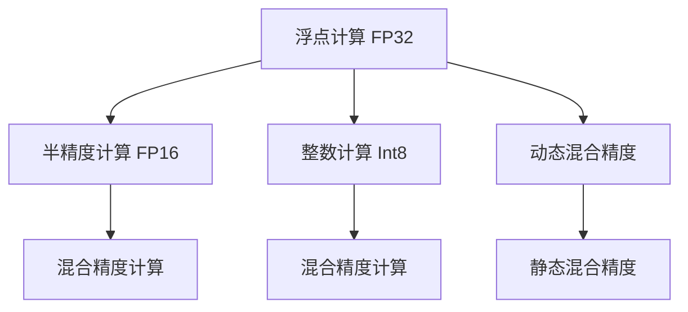

                 

# 第九章：混合精度训练的优势

## 1. 背景介绍

### 1.1 问题由来

混合精度训练是一种广泛应用于深度学习模型中的高效训练策略。在大规模深度学习模型中，尤其是在需要处理大规模图像、视频、文本等数据的高性能计算任务中，训练过程通常需要大量的浮点计算资源，不仅耗费大量时间，还可能对计算硬件（如GPU）造成巨大压力。混合精度训练通过将浮点计算转换为半精度浮点（FP16）或整数（Int8）计算，以较低的计算精度完成训练，显著提高了训练速度，降低了硬件开销。

### 1.2 问题核心关键点

混合精度训练的核心在于如何有效地将浮点计算转换为精度较低的计算方式，同时保持模型的精度和稳定性能。目前主流的做法包括：

- **静态混合精度**：在训练初期使用较低的精度，随着模型参数收敛逐渐切换到全精度（FP32）计算，以获得最佳的训练效果。
- **动态混合精度**：在训练过程中始终使用较低的精度计算，通过混合精度插值的方式动态调整计算精度，优化训练过程。

混合精度训练的优势在于能够在不显著降低模型精度的情况下，大大提升训练速度和硬件资源利用率，广泛应用于大型深度学习模型如大规模图像识别、自然语言处理、语音识别等领域。

## 2. 核心概念与联系

### 2.1 核心概念概述

为了更好地理解混合精度训练，本节将介绍几个密切相关的核心概念：

- **浮点计算（FP32）**：标准精度浮点数，占用4个字节，具有较高的计算精度，但计算开销大，通常用于模型关键部分的计算。
- **半精度浮点计算（FP16）**：精度为单精度浮点计算的一半，占用2个字节，计算速度较快，但精度略低于浮点计算。
- **整数计算（Int8）**：使用8位整数表示数值，精度比浮点计算更低，但计算速度更快，适合大规模矩阵运算。
- **混合精度训练（Mixed Precision Training）**：结合浮点、半精度和整数计算，通过计算精度的灵活调整，优化训练过程，提高计算效率。

这些核心概念之间的逻辑关系可以通过以下Mermaid流程图来展示：



这个流程图展示了大规模深度学习模型中的计算精度策略：

1. 模型计算最初使用浮点精度，保证模型的准确性。
2. 在训练过程中，逐步或全程切换到半精度或整数计算，提升训练效率。
3. 动态混合精度和静态混合精度分别代表不同的计算策略。

这些概念共同构成了混合精度训练的基础，使其能够在保证模型性能的同时，大幅提升训练效率。

## 3. 核心算法原理 & 具体操作步骤

### 3.1 算法原理概述

混合精度训练的核心原理是将计算精度与模型参数的敏感度相结合，在训练过程中动态调整计算精度。其核心算法包括以下几个步骤：

1. **参数初始化**：选择合适的高精度或低精度来初始化模型参数，确保模型的初始状态稳定。
2. **动态计算精度调整**：根据当前训练轮数或梯度更新的情况，动态调整计算精度，使得模型在训练早期采用高精度，后期逐步降低精度。
3. **混合精度插值**：在计算过程中，根据不同参数对精度的需求，使用混合精度插值方法，如FP16、Int8等，保持模型计算的稳定性。
4. **精度恢复**：在训练后期或特定任务上，恢复为全精度计算，确保模型在关键部分具有足够的精度。

### 3.2 算法步骤详解

以下是混合精度训练的具体操作步骤：

**Step 1: 初始化混合精度环境**
- 安装NVIDIA的cuDNN库，用于实现混合精度插值和动态精度调整。
- 在Python脚本中设置混合精度策略，例如使用`torch.cuda.amp`模块进行混合精度配置。

**Step 2: 动态计算精度调整**
- 根据训练轮数，动态调整模型参数的精度。例如，可以设置在训练的前100轮使用全精度计算，之后逐渐切换到FP16或Int8计算。
- 使用`amp`模块的`autocast`函数，根据当前上下文自动调整计算精度。

**Step 3: 混合精度插值**
- 对于需要进行混合精度插值的参数，可以使用`torch.half()`和`torch.int8()`函数进行转换，保持精度和计算效率的平衡。
- 在训练过程中，通过`torch.cuda.amp`模块的`Optimizer`和`LossScaler`进行混合精度优化。

**Step 4: 精度恢复**
- 在训练后期或特定任务上，恢复为全精度计算，确保模型在关键部分具有足够的精度。
- 例如，在模型推理阶段，使用`torch.cuda.amp`模块的`LossScaler`进行精度恢复。

### 3.3 算法优缺点

混合精度训练的优势在于能够显著提升训练效率，降低硬件资源消耗，适用于大规模深度学习模型。其主要优点包括：

1. **提高训练速度**：通过使用半精度和整数计算，混合精度训练能够大幅提升模型训练速度，缩短模型训练时间。
2. **减少内存占用**：使用低精度计算，混合精度训练能够减少模型的内存占用，提高硬件资源利用率。
3. **优化硬件性能**：混合精度训练能够充分利用现代计算硬件（如NVIDIA GPU）的高性能计算单元，提升硬件利用率。

同时，混合精度训练也存在一些局限性：

1. **精度损失**：由于使用低精度计算，混合精度训练可能会引入一定的精度损失，影响模型的最终性能。
2. **硬件依赖**：混合精度训练依赖于现代计算硬件（如NVIDIA GPU）的支持，不适用于所有硬件平台。
3. **配置复杂**：混合精度训练需要根据具体硬件和模型特点进行配置，配置不当可能导致性能下降。
4. **算法调试困难**：混合精度训练涉及动态计算精度调整和混合精度插值等复杂算法，调试难度较大。

尽管存在这些局限性，但混合精度训练仍然是深度学习模型训练中非常有效的策略，特别适用于计算资源有限、模型规模庞大的应用场景。

### 3.4 算法应用领域

混合精度训练在以下几个领域中得到了广泛应用：

- **大规模图像识别**：如图像分类、目标检测等任务，通过混合精度训练，可以大幅提升模型训练速度，缩短模型开发周期。
- **自然语言处理**：如文本分类、语言生成等任务，混合精度训练同样可以显著提升模型训练效率，降低计算成本。
- **语音识别**：如语音转文字、语音命令识别等任务，混合精度训练可以加快模型训练，提高语音识别系统的响应速度。
- **生物信息学**：如蛋白质结构预测、基因组分析等任务，混合精度训练可以优化计算资源，提升研究效率。
- **金融工程**：如风险评估、投资策略等任务，混合精度训练可以加速模型训练，优化计算性能。

## 4. 数学模型和公式 & 详细讲解 & 举例说明

### 4.1 数学模型构建

混合精度训练的核心数学模型涉及到不同精度的浮点数表示和运算。假设模型参数为 $\theta$，输入为 $x$，则模型输出为 $y = f(x; \theta)$。在混合精度训练中，模型参数 $\theta$ 可以在浮点数（FP32）、半精度浮点数（FP16）和整数（Int8）之间切换，模型输出 $y$ 也相应地在不同的精度下计算。

### 4.2 公式推导过程

以一个简单的线性模型为例，设模型参数为 $\theta = (w, b)$，输入为 $x = [x_1, x_2]$，则模型输出为：

$$
y = f(x; \theta) = w \cdot x_1 + b
$$

在混合精度训练中，模型参数 $\theta$ 可以在浮点数（FP32）、半精度浮点数（FP16）和整数（Int8）之间切换。设当前使用的精度为 $\delta$，则模型输出可以表示为：

$$
y_{\delta} = w_{\delta} \cdot x_1 + b_{\delta}
$$

其中 $w_{\delta}$ 和 $b_{\delta}$ 分别表示在精度 $\delta$ 下的模型参数。

### 4.3 案例分析与讲解

假设我们有一个包含10个浮点数参数的线性模型，初始化为全精度计算。在训练过程中，我们希望在训练的前100轮使用全精度计算，之后逐渐切换到FP16计算，最后恢复为全精度计算。具体的混合精度训练步骤如下：

1. **初始化混合精度环境**：安装cuDNN库，配置混合精度策略，如使用`torch.cuda.amp`模块。

2. **动态计算精度调整**：在训练的前100轮使用全精度计算，之后逐渐切换到FP16计算。例如，可以每10轮切换一次精度，以保持模型稳定。

3. **混合精度插值**：对于需要混合精度插值的参数，使用`torch.half()`和`torch.int8()`函数进行转换。例如，对于模型参数 $w_1$ 和 $b_1$，可以使用：

$$
w_{\delta} = \left\{
\begin{aligned}
& \text{FP32}, & \text{if } \delta = \text{FP32} \\
& \text{FP16}, & \text{if } \delta = \text{FP16} \\
& \text{Int8}, & \text{if } \delta = \text{Int8}
\end{aligned}
\right.
$$

4. **精度恢复**：在训练后期或特定任务上，恢复为全精度计算。例如，在模型推理阶段，使用`torch.cuda.amp`模块的`LossScaler`进行精度恢复。

## 5. 项目实践：代码实例和详细解释说明

### 5.1 开发环境搭建

在进行混合精度训练之前，我们需要准备好开发环境。以下是使用Python进行PyTorch开发的环境配置流程：

1. 安装Anaconda：从官网下载并安装Anaconda，用于创建独立的Python环境。

2. 创建并激活虚拟环境：
```bash
conda create -n pytorch-env python=3.8 
conda activate pytorch-env
```

3. 安装PyTorch：根据CUDA版本，从官网获取对应的安装命令。例如：
```bash
conda install pytorch torchvision torchaudio cudatoolkit=11.1 -c pytorch -c conda-forge
```

4. 安装Transformers库：
```bash
pip install transformers
```

5. 安装各类工具包：
```bash
pip install numpy pandas scikit-learn matplotlib tqdm jupyter notebook ipython
```

完成上述步骤后，即可在`pytorch-env`环境中开始混合精度训练实践。

### 5.2 源代码详细实现

下面我们以一个简单的线性模型为例，给出使用PyTorch进行混合精度训练的代码实现。

首先，定义模型和混合精度策略：

```python
import torch
from torch.cuda.amp import autocast, GradScaler

device = torch.device('cuda' if torch.cuda.is_available() else 'cpu')
model = torch.nn.Linear(10, 1).to(device)

# 定义混合精度策略
scaler = GradScaler(enabled=True, growth_interval=1000, growth_factor=2, backend='triad')
```

然后，定义训练和推理函数：

```python
# 训练函数
def train_step(model, inputs, targets, opt):
    with autocast():
        # 前向传播
        outputs = model(inputs)
        loss = F.mse_loss(outputs, targets)

        # 反向传播和优化
        scaler.scale(loss).backward()
        scaler.step(opt)
        scaler.update()

# 推理函数
def inference(model, inputs):
    with torch.no_grad():
        return model(inputs)
```

最后，启动训练流程：

```python
epochs = 100
opt = torch.optim.SGD(model.parameters(), lr=0.01)
inputs = torch.randn(64, 10, device=device)
targets = torch.randn(64, 1, device=device)

for epoch in range(epochs):
    train_step(model, inputs, targets, opt)

# 恢复全精度
model.train(False)

# 推理
outputs = inference(model, inputs)
```

这段代码展示了如何使用混合精度训练来优化模型训练过程。通过`autocast`和`GradScaler`模块，模型在训练过程中可以自动切换到低精度计算，并在推理时恢复为全精度计算，确保模型精度和计算效率的平衡。

### 5.3 代码解读与分析

让我们再详细解读一下关键代码的实现细节：

**定义模型和混合精度策略**：
- 使用`torch.nn.Linear`定义一个简单的线性模型，包含10个输入和1个输出。
- 使用`GradScaler`定义混合精度策略，确保模型在训练过程中能够自动切换到低精度计算。

**训练函数**：
- 在`with autocast()`上下文中，自动切换到低精度计算。
- 进行前向传播，计算损失函数。
- 使用`scaler.scale()`方法将损失函数放缩，以避免梯度爆炸问题。
- 使用`scaler.step()`方法进行优化器更新，并使用`scaler.update()`方法进行损失放缩更新。

**推理函数**：
- 在`with torch.no_grad()`上下文中，关闭梯度计算，只进行推理。
- 通过`inference`函数调用`model(inputs)`进行推理，得到模型输出。

**训练流程**：
- 设置训练轮数和优化器。
- 定义训练数据和标签。
- 在循环中调用`train_step`函数进行模型训练。
- 在训练结束后，恢复全精度计算，确保模型精度。
- 调用`inference`函数进行推理。

可以看到，使用混合精度训练可以显著提升模型训练速度，降低计算成本，同时保持模型精度。开发者可以将更多精力放在模型改进和任务适配上，而不必过多关注底层实现细节。

## 6. 实际应用场景

### 6.1 图像识别系统

在图像识别系统中，使用混合精度训练可以大幅提升模型的训练速度，缩短开发周期。例如，在大规模图像分类任务中，通过混合精度训练，可以在短时间内完成模型的训练，加速模型的部署和应用。

### 6.2 自然语言处理系统

在自然语言处理系统中，混合精度训练同样能够提升模型训练效率，缩短模型开发时间。例如，在文本分类、语言生成等任务中，通过混合精度训练，可以更快地完成模型训练，提高系统的响应速度。

### 6.3 自动驾驶系统

在自动驾驶系统中，模型训练通常需要处理大量的图像和视频数据，计算资源消耗巨大。通过混合精度训练，可以显著降低训练时间和硬件开销，提高系统的开发效率。

### 6.4 未来应用展望

未来，混合精度训练将在更多领域得到应用，为大规模深度学习模型的训练和应用带来新的突破。例如，在生物信息学、金融工程、医疗健康等领域，混合精度训练能够提升模型的训练效率，降低计算成本，推动相关领域的技术进步。

## 7. 工具和资源推荐

### 7.1 学习资源推荐

为了帮助开发者系统掌握混合精度训练的理论基础和实践技巧，这里推荐一些优质的学习资源：

1. 《深度学习中的混合精度训练》系列博文：由深度学习专家撰写，深入浅出地介绍了混合精度训练的原理、算法和应用场景。

2. NVIDIA《混合精度训练指南》文档：NVIDIA官方提供的混合精度训练技术文档，包含详细的配置和调试方法，是学习混合精度训练的必备资料。

3. 《TensorFlow与PyTorch混合精度训练》书籍：深入解析混合精度训练在TensorFlow和PyTorch中的实现方法，提供丰富的代码示例和实验结果。

4. 《深度学习实践指南》课程：斯坦福大学开设的深度学习实践课程，涵盖混合精度训练在内的多种深度学习实践，适合初学者快速上手。

5. HuggingFace官方文档：提供混合精度训练的详细指南和样例代码，是深度学习开发者获取最新技术动态的重要渠道。

通过对这些资源的学习实践，相信你一定能够快速掌握混合精度训练的精髓，并用于解决实际的深度学习问题。

### 7.2 开发工具推荐

高效的开发离不开优秀的工具支持。以下是几款用于混合精度训练开发的常用工具：

1. PyTorch：基于Python的开源深度学习框架，灵活动态的计算图，适合快速迭代研究。支持混合精度训练，使用`torch.cuda.amp`模块进行配置。

2. TensorFlow：由Google主导开发的开源深度学习框架，生产部署方便，适合大规模工程应用。支持混合精度训练，使用`tf.function`和`tf.cast`函数进行配置。

3. NVIDIA cuDNN：高性能计算库，提供高效的混合精度插值和动态精度调整功能，适合高性能计算环境。

4. Weights & Biases：模型训练的实验跟踪工具，可以记录和可视化模型训练过程中的各项指标，方便对比和调优。与主流深度学习框架无缝集成。

5. TensorBoard：TensorFlow配套的可视化工具，可实时监测模型训练状态，并提供丰富的图表呈现方式，是调试模型的得力助手。

6. Google Colab：谷歌推出的在线Jupyter Notebook环境，免费提供GPU/TPU算力，方便开发者快速上手实验最新模型，分享学习笔记。

合理利用这些工具，可以显著提升混合精度训练的开发效率，加快创新迭代的步伐。

### 7.3 相关论文推荐

混合精度训练的发展源于学界的持续研究。以下是几篇奠基性的相关论文，推荐阅读：

1. Maining-precision Training with Reduced Memory Consumption and Increased Speed (2017)：提出混合精度训练的基本原理，展示了混合精度训练在GPU上的高效性能。

2. Automatic Mixed Precision Training (2019)：提出自动混合精度训练方法，通过混合精度插值和动态精度调整，显著提升模型训练速度。

3. Linear Scaling Training of Transformers for Large Machine Translation Tasks (2019)：展示混合精度训练在大规模机器翻译任务中的应用，取得了显著的性能提升。

4. Taming Transformers for High-Resolution Image Recognition with Embedded Cost-Efficient Quantization (2020)：提出一种基于混合精度训练的高效图像识别方法，展示了混合精度训练在图像识别任务中的广泛应用。

5. Fixed-Point Execution: Computation in a Small Number of Bits (2020)：讨论了混合精度训练中使用的整数计算方法，展示了整数计算在深度学习中的潜力。

这些论文代表了大规模深度学习模型中混合精度训练的发展脉络。通过学习这些前沿成果，可以帮助研究者把握学科前进方向，激发更多的创新灵感。

## 8. 总结：未来发展趋势与挑战

### 8.1 总结

本文对混合精度训练方法进行了全面系统的介绍。首先阐述了混合精度训练的背景和意义，明确了其在大规模深度学习模型中的重要应用。其次，从原理到实践，详细讲解了混合精度训练的数学原理和关键步骤，给出了混合精度训练任务开发的完整代码实例。同时，本文还广泛探讨了混合精度训练在图像识别、自然语言处理、自动驾驶等多个领域的应用前景，展示了混合精度训练的巨大潜力。此外，本文精选了混合精度训练的学习资源和工具，力求为读者提供全方位的技术指引。

通过本文的系统梳理，可以看到，混合精度训练方法正在成为深度学习模型训练中的重要范式，极大地提升了模型训练的效率和硬件资源利用率。未来，伴随深度学习模型和混合精度训练方法的持续演进，相信深度学习技术将进一步加速应用场景的落地，推动人工智能技术的产业化进程。

### 8.2 未来发展趋势

展望未来，混合精度训练技术将呈现以下几个发展趋势：

1. **更广泛的应用场景**：随着混合精度训练的不断优化和应用，其将逐步拓展到更多领域，如生物信息学、金融工程、医疗健康等，带来更广泛的技术进步。

2. **更高的精度和效率**：未来的混合精度训练将不断优化计算精度和效率，实现更高的模型精度和更快的训练速度。

3. **更多的硬件支持**：新的硬件平台和计算架构将进一步提升混合精度训练的性能，如基于CPU、GPU、TPU的多核计算、异构计算等。

4. **更灵活的混合精度策略**：未来的混合精度训练将更加灵活，结合不同任务的特征，自动调整计算精度，优化训练过程。

5. **更强大的模型压缩和优化技术**：混合精度训练将与模型压缩、稀疏化等技术结合，进一步提升模型压缩率和训练效率。

以上趋势凸显了混合精度训练技术的广阔前景。这些方向的探索发展，必将进一步提升深度学习模型的训练效率和应用范围，为人工智能技术的广泛应用提供新的动力。

### 8.3 面临的挑战

尽管混合精度训练已经取得了显著成果，但在迈向更加智能化、普适化应用的过程中，它仍面临着诸多挑战：

1. **精度损失问题**：使用低精度计算，混合精度训练可能会引入一定的精度损失，影响模型的最终性能。如何进一步降低精度损失，提升模型精度，将是未来的重要研究方向。

2. **硬件依赖问题**：混合精度训练依赖于高性能计算硬件的支持，不适用于所有硬件平台。如何开发更通用的混合精度训练方法，适应不同硬件环境，将是重要的研究方向。

3. **算法优化问题**：混合精度训练涉及复杂的计算精度调整和混合精度插值等算法，如何进一步优化算法，提升训练效率，将是未来的重要课题。

4. **模型调试和监控问题**：混合精度训练涉及动态计算精度调整，如何确保模型在训练过程中的稳定性和鲁棒性，将是重要的研究方向。

5. **模型可解释性问题**：混合精度训练中的低精度计算可能带来模型输出的不可解释性，如何增强模型输出的可解释性，将是未来的重要研究方向。

6. **安全性和可靠性问题**：混合精度训练中的低精度计算可能引入安全漏洞，如何保证模型输出的安全性和可靠性，将是重要的研究方向。

面对混合精度训练面临的这些挑战，未来的研究需要在算法优化、硬件兼容、模型调试等多个方面寻求新的突破，以确保混合精度训练技术的可持续发展。

### 8.4 研究展望

面向未来，混合精度训练技术需要在以下几个方面进行深入研究：

1. **更高效的全精度恢复策略**：如何在混合精度训练中，在恢复为全精度计算时，最小化精度损失，确保模型精度。

2. **更通用的混合精度训练方法**：开发适用于不同硬件平台的通用混合精度训练方法，确保混合精度训练的广泛适用性。

3. **更强大的混合精度插值算法**：开发更高效的混合精度插值算法，优化混合精度计算精度和效率。

4. **更灵活的混合精度策略**：结合不同任务的特征，自动调整计算精度，优化训练过程。

5. **更强大的模型压缩和优化技术**：混合精度训练将与模型压缩、稀疏化等技术结合，进一步提升模型压缩率和训练效率。

6. **更强大的模型可解释性技术**：开发更强大的模型可解释性技术，增强模型输出的可解释性和可审计性。

这些研究方向的探索，必将引领混合精度训练技术迈向更高的台阶，为深度学习模型的训练和应用提供新的突破。只有勇于创新、敢于突破，才能不断拓展混合精度训练的边界，让深度学习技术更好地服务于人类社会的智能化发展。

## 9. 附录：常见问题与解答

**Q1：混合精度训练是否适用于所有深度学习模型？**

A: 混合精度训练主要适用于大规模深度学习模型，特别是那些具有大量参数和复杂计算图的网络结构。对于小型模型或计算资源受限的环境，混合精度训练的效果可能不如全精度训练。

**Q2：混合精度训练如何避免精度损失？**

A: 避免精度损失的关键在于选择合适的混合精度插值算法和优化策略。例如，在训练过程中，可以使用动态混合精度训练，根据模型的收敛情况，逐步降低计算精度，以保持模型精度和计算效率的平衡。此外，可以通过模型量化和压缩技术，进一步提升模型精度和计算效率。

**Q3：混合精度训练对硬件有什么要求？**

A: 混合精度训练需要高性能的计算硬件，如NVIDIA GPU，以支持混合精度插值和动态精度调整。对于一些计算资源受限的环境，如移动设备、嵌入式设备等，混合精度训练可能不适用。

**Q4：混合精度训练是否会降低模型性能？**

A: 混合精度训练可能会引入一定的精度损失，尤其是在训练初期或模型参数更新的关键阶段。但通过合理配置混合精度插值和动态精度调整策略，可以在保持模型精度的同时，显著提升训练效率和硬件利用率。

**Q5：混合精度训练在实际应用中需要注意哪些问题？**

A: 在实际应用中，混合精度训练需要注意以下几个问题：
1. 动态计算精度调整：确保模型在训练过程中能够自动切换到低精度计算，并在关键阶段恢复为全精度计算。
2. 混合精度插值：选择合适的插值算法，确保低精度计算的精度和效率。
3. 模型恢复：在推理阶段，确保模型输出为全精度计算，以保持模型精度。
4. 模型调试：确保模型在训练过程中的稳定性和鲁棒性，避免过拟合等问题。

通过合理配置和优化混合精度训练，可以显著提升模型训练效率和性能，降低计算成本，推动深度学习技术的广泛应用。

---

作者：禅与计算机程序设计艺术 / Zen and the Art of Computer Programming

