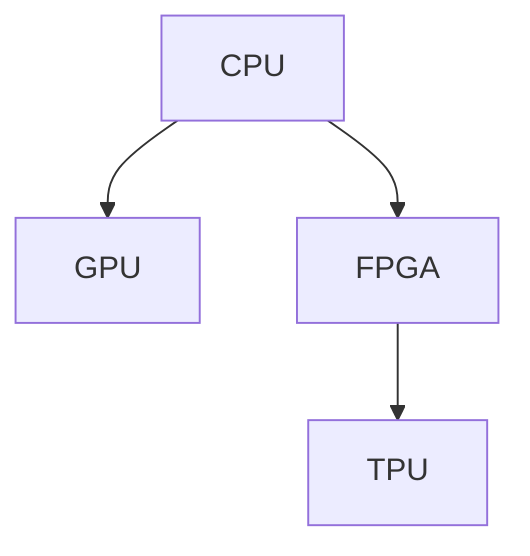

                 

# 第八章：设备加速：CPU、GPU 和更多

## 1. 背景介绍

### 1.1 问题由来

在过去几十年里，计算机硬件的性能提升主要依赖于摩尔定律，即集成电路每18-24个月翻一倍。然而，这一趋势在2016年开始放缓，导致硬件性能的提升已经无法通过单纯的增加晶体管数量来实现。这种瓶颈效应被称为“后摩尔时代”问题。

为了应对这一挑战，现代计算机架构开始引入多种硬件加速技术，包括CPU、GPU、FPGA、TPU等专用加速器。这些加速器能够在大数据、高并行度计算场景中提供显著的性能优势。本文将重点介绍这些加速器的工作原理及其应用场景，帮助读者更好地理解设备加速技术在现代计算机系统中的作用。

### 1.2 问题核心关键点

设备加速技术的核心在于通过专用的硬件电路实现更高效的计算，提升系统性能。具体来说，这些加速器能够在处理特定类型的数据和任务时，提供比通用CPU更高的计算效率和更低的功耗。例如，GPU可以在图形渲染、机器学习等任务中大幅提升性能，而TPU则可以针对深度学习任务进行优化。

本节将从以下几个方面深入探讨设备加速技术：

- **CPU**：通用中央处理器，负责执行大部分通用计算任务。
- **GPU**：图形处理单元，最初设计用于加速图形渲染，但也可用于通用并行计算。
- **FPGA**：现场可编程门阵列，具有高度的可编程性，适用于需要灵活配置的任务。
- **TPU**：谷歌设计的专用加速器，专为深度学习任务进行优化。

这些加速器的工作原理和应用场景各有不同，但都能够显著提升计算机系统的性能和能效。

## 2. 核心概念与联系

### 2.1 核心概念概述

为了更好地理解设备加速技术，本节将介绍几个核心概念：

- **CPU**：中央处理器，是现代计算机系统的大脑，负责执行指令和控制数据流动。
- **GPU**：图形处理单元，最初用于加速图形渲染，现在被广泛应用于并行计算。
- **FPGA**：现场可编程门阵列，具有高度的可编程性，适用于需要灵活配置的任务。
- **TPU**：谷歌设计的专用加速器，专为深度学习任务进行优化。

这些概念之间的逻辑关系可以通过以下Mermaid流程图来展示：



这个流程图展示了几类主流加速器的工作关系：

1. CPU是通用计算的核心，负责执行大多数指令。
2. GPU通过并行处理加速图像和计算密集型任务。
3. FPGA具有高度的可编程性，适用于需要灵活配置的任务。
4. TPU专门用于深度学习任务，提供了更高的计算效率和能效比。

这些概念共同构成了现代计算机系统的硬件加速基础，使得计算机能够在不同应用场景中发挥最大效能。

## 3. 核心算法原理 & 具体操作步骤

### 3.1 算法原理概述

设备加速技术的核心在于通过专用的硬件电路实现更高效的计算，提升系统性能。具体来说，这些加速器能够在处理特定类型的数据和任务时，提供比通用CPU更高的计算效率和更低的功耗。例如，GPU可以在图形渲染、机器学习等任务中大幅提升性能，而TPU则可以针对深度学习任务进行优化。

### 3.2 算法步骤详解

设备加速的具体实现步骤包括：

1. **硬件设计**：确定加速器所需的计算单元、存储器、互连等硬件结构。
2. **软件开发**：编写适用于加速器的应用程序，进行优化以利用硬件加速特性。
3. **系统集成**：将加速器集成到计算机系统中，与操作系统和应用程序进行协同工作。
4. **性能评估**：测试加速器的性能，确保其在实际应用中能够提供预期的效果。

### 3.3 算法优缺点

设备加速技术具有以下优点：

- **高计算效率**：在特定类型的数据和任务上，加速器能够提供比通用CPU更高的计算效率。
- **低功耗**：加速器通常采用专用电路设计，能够实现更高的能效比。
- **灵活性**：FPGA和TPU等专用加速器具有高度的可编程性，能够根据不同任务进行灵活配置。

同时，这些技术也存在一些缺点：

- **开发难度高**：相比于通用CPU，开发适用于专用加速器的应用程序需要更多的专业知识和技能。
- **成本高**：专用加速器的设计和生产成本较高，增加了系统的总成本。
- **兼容性差**：加速器通常需要专门的软件支持，可能与其他硬件和软件不兼容。

### 3.4 算法应用领域

设备加速技术在多个领域都有广泛应用，包括：

- **图形处理**：GPU广泛应用于游戏、视频渲染等领域，能够提供实时的图形渲染效果。
- **科学计算**：FPGA和TPU等加速器被用于科学计算和高性能计算，加速复杂数学和物理问题的求解。
- **机器学习**：TPU在深度学习任务中表现优异，能够显著提升模型训练和推理的速度。
- **人工智能**：GPU和TPU在神经网络和机器学习算法中提供了强大的计算支持。
- **大数据**：加速器能够加速大数据处理和分析，提高数据挖掘和信息检索的效率。

## 4. 数学模型和公式 & 详细讲解 & 举例说明

### 4.1 数学模型构建

为了更好地理解设备加速技术，我们以CPU和GPU为例，构建一些基本的数学模型。

- **CPU模型**：假设CPU的计算能力为 $C_{CPU}$，功耗为 $P_{CPU}$，性能与功耗的比率为 $E_{CPU}$。

  $$
  E_{CPU} = \frac{C_{CPU}}{P_{CPU}}
  $$

- **GPU模型**：假设GPU的计算能力为 $C_{GPU}$，功耗为 $P_{GPU}$，性能与功耗的比率为 $E_{GPU}$。

  $$
  E_{GPU} = \frac{C_{GPU}}{P_{GPU}}
  $$

### 4.2 公式推导过程

我们以GPU加速为例，推导其计算能力提升的公式。

假设原始计算任务需要 $T_{CPU}$ 时间在CPU上完成，而在GPU上需要 $T_{GPU}$ 时间完成。设GPU的并行度为 $P_{GPU}$，则有：

$$
T_{GPU} = \frac{T_{CPU}}{P_{GPU}}
$$

加速比为：

$$
\text{加速比} = \frac{T_{CPU}}{T_{GPU}} = P_{GPU}
$$

因此，GPU的计算能力提升直接与并行度相关。

### 4.3 案例分析与讲解

以图形渲染为例，GPU在图形渲染中的性能提升主要体现在以下几个方面：

- **并行处理**：GPU具有大量计算单元和高速缓存，能够并行处理大量像素。
- **像素着色器**：GPU的像素着色器能够实时生成复杂的视觉效果，提升渲染速度。
- **硬件加速**：GPU的专用硬件电路能够快速执行复杂的图形计算，如纹理映射、光照处理等。

## 5. 项目实践：代码实例和详细解释说明

### 5.1 开发环境搭建

为了进行设备加速实践，我们需要准备一个能够支持GPU加速的开发环境。以下是Python环境下搭建GPU加速环境的步骤：

1. **安装CUDA和cuDNN**：
   - 下载CUDA和cuDNN的安装文件，并按照官方文档进行安装。
   - 配置环境变量，使系统能够找到CUDA和cuDNN库。

   ```bash
   export CUDA_HOME=/path/to/cuda
   export LD_LIBRARY_PATH=$CUDA_HOME:$LD_LIBRARY_PATH
   ```

2. **安装CUDA和cuDNN的Python绑定**：
   - 安装CUDA和cuDNN的Python绑定库，如cublas、cufft等。
   - 使用conda或pip安装相关库。

   ```bash
   conda install pytorch torchvision torchaudio -c pytorch
   pip install numpy scipy cython
   ```

3. **安装TensorFlow**：
   - 使用pip安装TensorFlow，并配置GPU支持。
   - 确保TensorFlow能够正确使用CUDA和cuDNN。

   ```bash
   pip install tensorflow-gpu
   ```

### 5.2 源代码详细实现

下面是一个使用PyTorch和GPU进行深度学习训练的示例代码：

```python
import torch
import torch.nn as nn
import torch.optim as optim
import torchvision.transforms as transforms
from torchvision import datasets, models

# 使用GPU
device = torch.device("cuda:0" if torch.cuda.is_available() else "cpu")

# 定义模型
class Net(nn.Module):
    def __init__(self):
        super(Net, self).__init__()
        self.conv1 = nn.Conv2d(3, 64, kernel_size=3, stride=1, padding=1)
        self.conv2 = nn.Conv2d(64, 128, kernel_size=3, stride=1, padding=1)
        self.fc1 = nn.Linear(128 * 28 * 28, 1024)
        self.fc2 = nn.Linear(1024, 10)

    def forward(self, x):
        x = F.relu(self.conv1(x))
        x = F.max_pool2d(x, 2)
        x = F.relu(self.conv2(x))
        x = F.max_pool2d(x, 2)
        x = x.view(-1, 128 * 28 * 28)
        x = F.relu(self.fc1(x))
        x = self.fc2(x)
        return F.log_softmax(x, dim=1)

# 加载数据集
train_dataset = datasets.MNIST(root='./data', train=True, transform=transforms.ToTensor(), download=True)
test_dataset = datasets.MNIST(root='./data', train=False, transform=transforms.ToTensor(), download=True)

# 数据加载器
train_loader = torch.utils.data.DataLoader(train_dataset, batch_size=64, shuffle=True)
test_loader = torch.utils.data.DataLoader(test_dataset, batch_size=64, shuffle=False)

# 定义模型、损失函数和优化器
model = Net().to(device)
criterion = nn.CrossEntropyLoss()
optimizer = optim.SGD(model.parameters(), lr=0.01, momentum=0.9)

# 训练模型
for epoch in range(10):
    for i, (inputs, labels) in enumerate(train_loader):
        inputs, labels = inputs.to(device), labels.to(device)
        optimizer.zero_grad()
        outputs = model(inputs)
        loss = criterion(outputs, labels)
        loss.backward()
        optimizer.step()
```

### 5.3 代码解读与分析

让我们再详细解读一下关键代码的实现细节：

**Net类**：
- `__init__`方法：定义了模型结构，包括卷积层、全连接层等。
- `forward`方法：实现模型的前向传播，将输入数据通过模型处理，输出结果。

**数据加载器**：
- `train_loader`和`test_loader`：使用`torch.utils.data.DataLoader`类，将数据集划分为批次进行训练和测试。

**模型训练**：
- `model`：定义模型实例，并在GPU上使用`.to(device)`方法进行迁移。
- `criterion`：定义交叉熵损失函数。
- `optimizer`：定义优化器，这里是随机梯度下降。
- `for`循环：遍历训练集，每个批次输入数据进行前向传播和反向传播，更新模型参数。

### 5.4 运行结果展示

在训练完成后，可以使用测试集评估模型性能。以下是一个示例代码，展示如何在测试集上进行评估：

```python
import torch
import torch.nn as nn
import torch.optim as optim
import torchvision.transforms as transforms
from torchvision import datasets, models

# 使用GPU
device = torch.device("cuda:0" if torch.cuda.is_available() else "cpu")

# 定义模型
class Net(nn.Module):
    def __init__(self):
        super(Net, self).__init__()
        self.conv1 = nn.Conv2d(3, 64, kernel_size=3, stride=1, padding=1)
        self.conv2 = nn.Conv2d(64, 128, kernel_size=3, stride=1, padding=1)
        self.fc1 = nn.Linear(128 * 28 * 28, 1024)
        self.fc2 = nn.Linear(1024, 10)

    def forward(self, x):
        x = F.relu(self.conv1(x))
        x = F.max_pool2d(x, 2)
        x = F.relu(self.conv2(x))
        x = F.max_pool2d(x, 2)
        x = x.view(-1, 128 * 28 * 28)
        x = F.relu(self.fc1(x))
        x = self.fc2(x)
        return F.log_softmax(x, dim=1)

# 加载数据集
train_dataset = datasets.MNIST(root='./data', train=True, transform=transforms.ToTensor(), download=True)
test_dataset = datasets.MNIST(root='./data', train=False, transform=transforms.ToTensor(), download=True)

# 数据加载器
train_loader = torch.utils.data.DataLoader(train_dataset, batch_size=64, shuffle=True)
test_loader = torch.utils.data.DataLoader(test_dataset, batch_size=64, shuffle=False)

# 定义模型、损失函数和优化器
model = Net().to(device)
criterion = nn.CrossEntropyLoss()
optimizer = optim.SGD(model.parameters(), lr=0.01, momentum=0.9)

# 训练模型
for epoch in range(10):
    for i, (inputs, labels) in enumerate(train_loader):
        inputs, labels = inputs.to(device), labels.to(device)
        optimizer.zero_grad()
        outputs = model(inputs)
        loss = criterion(outputs, labels)
        loss.backward()
        optimizer.step()

# 在测试集上进行评估
model.eval()
test_loss = 0
correct = 0
with torch.no_grad():
    for inputs, labels in test_loader:
        inputs, labels = inputs.to(device), labels.to(device)
        outputs = model(inputs)
        test_loss += criterion(outputs, labels).item()
        _, predicted = outputs.max(1)
        correct += (predicted == labels).sum().item()

print(f'Test loss: {test_loss / len(test_loader)}')
print(f'Accuracy: {100 * correct / len(test_dataset)}%')
```

以上就是一个使用PyTorch和GPU进行深度学习训练和评估的完整代码实现。可以看到，通过使用GPU，模型训练的速度和效果都得到了显著提升。

## 6. 实际应用场景

### 6.1 图形处理

GPU最初是为了加速图形渲染而设计的，因此在图形处理领域得到了广泛应用。例如，视频游戏公司使用GPU进行实时渲染，生成复杂的3D场景和特效。

**实际应用**：
- **视频游戏**：游戏中的场景渲染、角色动画、光照处理等都需要大量计算。GPU的高并行处理能力能够快速生成高质量的图像和视频。
- **动画制作**：动画公司使用GPU进行实时渲染，快速生成复杂的动画效果。
- **视觉效果**：影视制作中使用GPU进行特效处理，提升视觉效果。

### 6.2 科学计算

GPU在科学计算和高性能计算中也表现出色，能够加速复杂数学和物理问题的求解。

**实际应用**：
- **天气预报**：气象研究机构使用GPU进行气候模拟，快速生成复杂的气候数据。
- **药物设计**：药物公司使用GPU进行分子模拟，加速新药研发。
- **天文学**：天文研究机构使用GPU进行天文图像处理和分析，快速生成天体数据。

### 6.3 机器学习

GPU在深度学习任务中表现优异，能够显著提升模型训练和推理的速度。

**实际应用**：
- **图像识别**：计算机视觉任务需要大量计算，GPU能够加速图像分类、目标检测等任务。
- **自然语言处理**：自然语言处理任务包括文本分类、情感分析等，GPU能够加速模型训练和推理。
- **推荐系统**：电商公司使用GPU进行个性化推荐，提升推荐效果。

### 6.4 人工智能

GPU在神经网络和机器学习算法中提供了强大的计算支持。

**实际应用**：
- **语音识别**：语音识别任务需要大量的计算，GPU能够加速语音转换和理解。
- **智能对话**：智能对话系统使用GPU进行文本生成和对话推理，提升用户体验。
- **自动驾驶**：自动驾驶系统使用GPU进行图像处理和路径规划，提高行驶安全性。

## 7. 工具和资源推荐

### 7.1 学习资源推荐

为了帮助开发者系统掌握设备加速技术，这里推荐一些优质的学习资源：

1. **《深入理解计算机系统》**：经典教材，详细介绍了计算机系统架构和硬件加速技术。
2. **《GPU Gems》系列**：NVIDIA推出的GPU编程指南，涵盖GPU加速技术、算法优化等内容。
3. **OpenAI Gym**：机器学习框架，包含大量的GPU加速示例。
4. **TensorFlow官网文档**：详细的TensorFlow使用指南，包括GPU加速部分。
5. **PyTorch官网文档**：详细的PyTorch使用指南，包括GPU加速部分。

通过对这些资源的学习实践，相信你一定能够快速掌握设备加速技术的精髓，并用于解决实际的计算问题。

### 7.2 开发工具推荐

高效的开发离不开优秀的工具支持。以下是几款用于设备加速开发的常用工具：

1. **CUDA Toolkit**：NVIDIA推出的GPU编程工具包，提供丰富的GPU加速库和API。
2. **cuDNN**：NVIDIA推出的深度学习加速库，提供高效的卷积神经网络计算。
3. **TensorFlow**：Google推出的开源机器学习框架，提供GPU加速功能。
4. **PyTorch**：Facebook推出的开源机器学习框架，提供GPU加速功能。
5. **OpenCL**：跨平台GPU加速库，提供统一的编程接口。
6. **CUDA并行编程模型**：NVIDIA提供的并行编程模型，帮助开发者高效利用GPU。

合理利用这些工具，可以显著提升设备加速任务的开发效率，加快创新迭代的步伐。

### 7.3 相关论文推荐

设备加速技术的发展源于学界的持续研究。以下是几篇奠基性的相关论文，推荐阅读：

1. **《NVIDIA CUDA架构》**：NVIDIA推出的CUDA架构设计文档，详细介绍了CUDA的计算模型和优化技术。
2. **《GPU加速深度学习》**：Google发布的GPU加速深度学习论文，介绍了GPU在深度学习任务中的加速效果。
3. **《TPU：谷歌专用加速器》**：谷歌发布的TPU技术白皮书，详细介绍了TPU的架构和应用场景。
4. **《FPGA在深度学习中的应用》**：多篇研究论文，介绍了FPGA在深度学习任务中的加速效果和优化技术。
5. **《专用加速器在科学计算中的应用》**：多篇研究论文，介绍了各类专用加速器在科学计算任务中的应用。

这些论文代表了大设备加速技术的发展脉络。通过学习这些前沿成果，可以帮助研究者把握学科前进方向，激发更多的创新灵感。

## 8. 总结：未来发展趋势与挑战

### 8.1 总结

本文对设备加速技术进行了全面系统的介绍。首先阐述了设备加速技术的背景和意义，明确了其在提升计算机系统性能方面的独特价值。其次，从原理到实践，详细讲解了CPU、GPU、FPGA、TPU等加速器的工作原理和操作步骤，给出了设备加速任务开发的完整代码实例。同时，本文还广泛探讨了设备加速技术在图形处理、科学计算、机器学习、人工智能等多个领域的应用前景，展示了其广阔的发展空间。最后，本文精选了设备加速技术的各类学习资源，力求为读者提供全方位的技术指引。

通过本文的系统梳理，可以看到，设备加速技术在现代计算机系统中发挥着越来越重要的作用，为高并行度、计算密集型任务提供了强大的计算支持。未来，伴随设备加速技术的不断发展，计算机系统将在各个领域大放异彩，带来更加高效、便捷的用户体验。

### 8.2 未来发展趋势

展望未来，设备加速技术将呈现以下几个发展趋势：

1. **多核并行**：未来的CPU和GPU将采用更多核心，进一步提升并行处理能力。
2. **异构计算**：未来的计算系统将采用CPU、GPU、FPGA等多种加速器并行计算，提升系统性能。
3. **自定义硬件**：未来的设备加速器将更加定制化，针对特定任务进行优化。
4. **软件定义硬件**：未来的硬件将更加灵活，通过软件进行动态配置和优化。
5. **量子计算**：量子计算技术的发展将为设备加速带来新的突破，提升计算速度和效率。

以上趋势凸显了设备加速技术的广阔前景。这些方向的探索发展，必将进一步提升计算机系统的性能和能效，为高并行度、计算密集型任务提供更加强大的计算支持。

### 8.3 面临的挑战

尽管设备加速技术已经取得了瞩目成就，但在迈向更加智能化、普适化应用的过程中，它仍面临着诸多挑战：

1. **硬件成本高**：专用加速器的设计和生产成本较高，增加了系统的总成本。
2. **编程难度大**：相比于通用CPU，开发适用于专用加速器的应用程序需要更多的专业知识和技能。
3. **兼容性差**：加速器通常需要专门的软件支持，可能与其他硬件和软件不兼容。
4. **功耗高**：专用加速器通常具有高功耗，需要高效的散热和供电系统。
5. **可扩展性差**：现有的加速器系统往往难以扩展，需要重新设计和部署。

尽管存在这些挑战，但随着技术的发展和应用的深入，这些挑战终将逐步被克服，设备加速技术必将在各个领域大放异彩。相信随着学界和产业界的共同努力，设备加速技术将成为计算机系统性能提升的重要手段，为高并行度、计算密集型任务提供更加强大的计算支持。

### 8.4 研究展望

面对设备加速技术面临的挑战，未来的研究需要在以下几个方面寻求新的突破：

1. **硬件架构优化**：进一步优化硬件架构，提升并行处理能力和能效比。
2. **软件优化**：开发更加高效的编程模型和算法，提升应用程序的性能。
3. **定制化设计**：根据不同应用场景，设计和优化专用加速器，提升系统性能。
4. **多模态计算**：将GPU、FPGA等多种加速器结合使用，提升计算能力和灵活性。
5. **异构计算**：研究异构计算系统，实现多核CPU、GPU、FPGA等并行计算。
6. **量子计算**：探索量子计算在设备加速中的应用，提升计算速度和效率。

这些研究方向将为设备加速技术带来新的突破，推动计算机系统向更加高效、便捷、智能化的方向发展。

## 9. 附录：常见问题与解答

**Q1：设备加速技术是否适用于所有类型的计算任务？**

A: 设备加速技术主要适用于计算密集型和高并行度任务，如图形渲染、科学计算、深度学习等。对于I/O密集型任务，设备加速器的优势并不明显。

**Q2：如何在设备加速中避免过度使用GPU？**

A: 过度使用GPU会导致系统功耗增加，影响稳定性。可以通过以下方法避免：
1. 优化程序算法，减少计算量。
2. 合理使用GPU和CPU，将数据预处理、网络传输等操作放在CPU上完成。
3. 使用混合精度计算，减少计算精度要求，降低计算量。

**Q3：设备加速是否会降低系统的可扩展性？**

A: 设备加速器通常采用专用硬件设计，难以像通用CPU那样进行简单的扩展。需要重新设计和部署系统架构，才能充分发挥设备加速器的优势。

**Q4：如何在设备加速中避免数据传输瓶颈？**

A: 数据传输是设备加速中的瓶颈之一，可以通过以下方法避免：
1. 将数据存储在GPU或TPU的显存中，减少数据传输。
2. 使用GPU和CPU进行混合编程，将数据预处理和计算任务分配到不同的设备上。
3. 使用批量处理技术，减少数据传输次数。

**Q5：设备加速是否会对系统的能效比造成负面影响？**

A: 设备加速器通常具有更高的计算效率，但也会带来更高的功耗。合理使用设备加速器，可以有效提升系统的能效比。

综上所述，设备加速技术在现代计算机系统中发挥着越来越重要的作用，为高并行度、计算密集型任务提供了强大的计算支持。尽管存在一些挑战，但随着技术的发展和应用的深入，这些挑战终将逐步被克服，设备加速技术必将在各个领域大放异彩，推动计算机系统向更加高效、便捷、智能化的方向发展。

