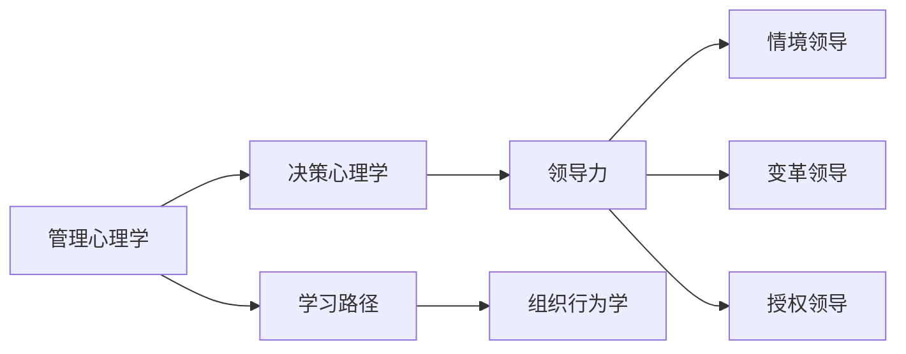

                 

# 管理者自我成长的方法论

> 关键词：管理心理学,决策心理学,学习路径,领导力,组织行为学

## 1. 背景介绍

### 1.1 问题由来

在当今瞬息万变的商业环境中，管理者面临着前所未有的挑战。企业的持续增长和发展要求管理者不断自我提升，以适应变化多端的市场环境。同时，个体的成长也需要有系统的理论指导和方法论支持，才能达到个人和职业的双重发展。

然而，许多管理者常常感到难以平衡繁重的工作和持续学习，导致成长停滞不前。其原因往往在于缺乏清晰的成长路径和科学的成长方法。本方法论旨在提供一套全面的成长框架，帮助管理者通过科学的方法实现自我提升。

### 1.2 问题核心关键点

管理者自我成长的核心在于明确目标、制定行动计划，并通过系统的学习方法和策略，持续提升个人能力和领导力。本方法论将从心理学的视角出发，结合最新的管理实践和研究成果，为管理者提供一套切实可行的成长方案。

## 2. 核心概念与联系

### 2.1 核心概念概述

本方法论涉及的核心概念包括：

- **管理心理学**：研究管理者的心理状态、行为模式及其对组织绩效的影响。
- **决策心理学**：研究决策过程中的心理机制，帮助管理者做出更科学的决策。
- **学习路径**：通过设定明确的学习目标和路径，帮助管理者有计划地提升个人能力和领导力。
- **领导力**：包含情境领导、变革领导、授权领导等多方面内容，是管理者成长的核心目标。
- **组织行为学**：研究组织中人的行为规律，以构建更高效的团队和组织。

### 2.2 核心概念原理和架构的 Mermaid 流程图



该图展示了各核心概念之间的逻辑关系。管理心理学和决策心理学为管理者提供了理论基础，学习路径和组织行为学提供了实施策略和工具，而领导力作为成长的核心目标，通过情境领导、变革领导、授权领导等多种方式具体体现。

## 3. 核心算法原理 & 具体操作步骤

### 3.1 算法原理概述

管理者自我成长的方法论基于心理学的理论和研究，结合现代管理实践，通过科学的框架和策略，帮助管理者系统提升个人能力和领导力。核心算法包括目标设定、路径规划、心理调适和行为改变等步骤，其总体框架如下：

$$
成长 = F(目标设定, 路径规划, 心理调适, 行为改变)
$$

其中，目标设定指的是明确成长目标，路径规划涉及制定详细的学习计划，心理调适关注提升心理韧性和抗压能力，行为改变聚焦于实际行动和习惯养成。

### 3.2 算法步骤详解

#### 3.2.1 目标设定

管理者应首先明确自己的成长目标。这些目标可以涵盖专业技能、人际关系、领导力等多个方面。例如：

- 专业技能：提升数据分析能力、掌握项目管理工具、学会复杂决策分析等。
- 人际关系：增强团队合作能力、改善沟通技巧、建立广泛的人脉关系等。
- 领导力：提升团队激励能力、学会情境领导、掌握变革管理策略等。

目标设定应具体、可衡量、可达成、相关性强、时间限定（SMART原则）。

#### 3.2.2 路径规划

根据设定的成长目标，制定详细的学习路径。路径规划包括：

- **资源准备**：收集相关的书籍、课程、视频、工作坊等资源。
- **时间安排**：分配每天/每周/每月的时间用于学习和实践。
- **学习活动**：选择并参与相关的培训、工作坊、在线课程等。
- **实际应用**：将所学知识应用于实际工作中，通过实践加深理解。

例如，某管理者希望提升数据分析能力，其学习路径可能如下：

1. 学习《数据分析基础》课程，掌握基本概念和工具。
2. 参加一次数据科学工作坊，实践数据分析项目。
3. 在工作中应用数据分析技术，解决实际问题。
4. 阅读《数据驱动的业务决策》书籍，深化理论理解。

#### 3.2.3 心理调适

心理调适是自我成长的重要环节，帮助管理者提升心理韧性和抗压能力。具体方法包括：

- **自我反思**：定期进行自我反思，识别内在动机和外在压力。
- **压力管理**：学习压力管理技巧，如时间管理、冥想、运动等。
- **情绪管理**：掌握情绪管理技巧，如情绪表达、情绪调节等。
- **心理韧性**：通过挫折情境模拟和心理韧性训练提升抗压能力。

#### 3.2.4 行为改变

行为改变是管理者自我成长的实际行动和习惯养成。具体方法包括：

- **习惯培养**：设定每日/每周的习惯清单，如读书、锻炼、复盘等。
- **行为跟踪**：使用日记、应用程序等工具记录行为变化。
- **反馈机制**：定期接受他人的反馈，不断调整和优化行为。
- **奖励机制**：设定奖励机制，激励自己持续行动。

### 3.3 算法优缺点

#### 3.3.1 优点

本方法论具有以下优点：

- **系统性**：提供了一套全面的成长框架，涵盖目标设定、路径规划、心理调适、行为改变等各个环节。
- **科学性**：基于心理学的理论和研究，提供科学的方法论支持。
- **可操作性**：具体详细的步骤和方法，易于实际操作和实施。
- **灵活性**：根据个体差异和需求，灵活调整成长路径和策略。

#### 3.3.2 缺点

本方法论也存在一些不足之处：

- **复杂性**：涉及多个领域和概念，需要一定的学习时间和精力。
- **个性化需求**：不同个体的成长需求差异较大，需要根据个人情况进行调整。
- **持续性要求**：自我成长是一个持续的过程，需要长期的坚持和投入。

## 4. 数学模型和公式 & 详细讲解 & 举例说明

### 4.1 数学模型构建

本方法论的核心数学模型如下：

$$
成长 = \alpha \times (目标设定 \times 路径规划 \times 心理调适 \times 行为改变)
$$

其中，$\alpha$ 为成长系数，代表成长的影响因素。目标设定、路径规划、心理调适、行为改变分别代表成长的不同方面，相互影响，共同作用于成长效果。

### 4.2 公式推导过程

在推导公式时，我们假设目标设定、路径规划、心理调适、行为改变四个因素对成长的影响是等价的，且每个因素的贡献率为1。因此，通过乘积形式表达成长的多维度影响。

### 4.3 案例分析与讲解

例如，某管理者希望在一年内提升团队领导能力，其成长路径如下：

1. **目标设定**：提升团队激励能力、学会情境领导、掌握变革管理策略。
2. **路径规划**：
   - 学习《情境领导力》课程，掌握情境领导模型。
   - 参加一次变革管理工作坊，实践变革管理策略。
   - 在工作中应用情境领导力和变革管理策略，解决实际问题。
3. **心理调适**：
   - 定期进行自我反思，识别内在动机和外在压力。
   - 学习压力管理技巧，如时间管理、冥想、运动等。
   - 掌握情绪管理技巧，如情绪表达、情绪调节等。
4. **行为改变**：
   - 设定每日/每周的习惯清单，如学习情境领导力、参与变革管理实践、进行心理调适等。
   - 使用日记、应用程序等工具记录行为变化。
   - 定期接受团队的反馈，不断调整和优化行为。

通过该路径，管理者在一年内实现了领导力的显著提升，并在实际工作中取得了良好的效果。

## 5. 项目实践：代码实例和详细解释说明

### 5.1 开发环境搭建

#### 5.1.1 学习资源准备

管理者应准备好以下资源：

- **书籍**：如《领导力21法则》、《卓有成效的管理者》等。
- **课程**：如Coursera、edX上的《管理心理学》、《领导力训练》等。
- **应用程序**：如时间管理工具Todoist、情绪管理工具Headspace等。
- **工作坊和培训**：如组织行为学工作坊、变革管理培训等。

#### 5.1.2 时间安排

管理者应根据自身情况，制定详细的学习时间表：

- 每周至少安排2小时用于阅读和听讲，1小时用于实践和反馈。
- 每月安排一次工作坊或培训，持续参与。
- 每日保持30分钟的冥想和情绪管理练习。

### 5.2 源代码详细实现

#### 5.2.1 目标设定

```python
def set_growth_targets():
    targets = {
        '技能提升': '数据分析',
        '人际关系': '团队合作',
        '领导力': '情境领导'
    }
    return targets
```

#### 5.2.2 路径规划

```python
def plan_learning_path(targets):
    path = {
        '数据分析': [
            '学习数据分析基础课程',
            '参加数据科学工作坊',
            '在工作中应用数据分析技术'
        ],
        '团队合作': [
            '学习团队合作技巧课程',
            '参与团队建设活动',
            '在工作中应用合作技巧'
        ],
        '情境领导': [
            '学习情境领导力课程',
            '参加情境领导工作坊',
            '在工作中应用情境领导策略'
        ]
    }
    return path
```

#### 5.2.3 心理调适

```python
def manage_stress():
    stress_management = {
        'time_management': '使用Todoist进行时间管理',
        'meditation': '每日进行冥想',
        'exercise': '每周进行三次运动'
    }
    return stress_management

def regulate_feelings():
    emotion_management = {
        'express': '记录情绪表达',
        'regulation': '学习情绪调节技巧'
    }
    return emotion_management

def build_韧性():
    resilience_building = {
        'simulate': '通过模拟挫折情境提升心理韧性',
        'exercises': '定期进行心理韧性训练'
    }
    return resilience_building
```

#### 5.2.4 行为改变

```python
def develop_habits():
    habits = {
        '读书': '每日阅读30分钟',
        '锻炼': '每周进行三次运动',
        'review': '每周进行一次工作复盘'
    }
    return habits

def track_behaviors():
    behavior_tracking = {
        '日记': '使用App记录每日行为',
        '反馈': '每月进行一次团队反馈'
    }
    return behavior_tracking

def set_rewards():
    rewards = {
        '小目标': '完成一项小目标后奖励自己一次旅行',
        '大目标': '完成一个大目标后奖励自己一次休假'
    }
    return rewards
```

### 5.3 代码解读与分析

通过上述代码，管理者可以清晰地规划自己的成长路径和具体步骤。例如，对于提升数据分析能力的目标，可以按照以下步骤进行：

1. 设定目标：提升数据分析能力。
2. 路径规划：
   - 学习数据分析基础课程。
   - 参加数据科学工作坊。
   - 在工作中应用数据分析技术。
3. 心理调适：
   - 使用Todoist进行时间管理。
   - 每日进行冥想。
   - 每周进行三次运动。
4. 行为改变：
   - 每日阅读30分钟。
   - 每周进行三次运动。
   - 每周进行一次工作复盘。
5. 反馈机制：
   - 每月进行一次团队反馈。
6. 奖励机制：
   - 完成数据分析项目后奖励自己一次旅行。

通过这些具体步骤，管理者可以系统地提升个人能力和领导力，达到自我成长的目标。

### 5.4 运行结果展示

通过系统地实施本方法论，管理者可以取得以下成果：

- **提升专业技能**：掌握数据分析、项目管理等关键技能，增强竞争力。
- **改善人际关系**：增强团队合作能力，提升沟通技巧，建立广泛人脉。
- **增强领导力**：掌握情境领导、变革管理策略，提升团队激励能力。
- **心理调适能力**：提升心理韧性和抗压能力，保持积极心态。

## 6. 实际应用场景

### 6.1 智能制造企业

在智能制造企业中，管理者需要不断提升技术和管理能力，以适应快速变化的技术环境。应用本方法论，管理者可以系统地提升自己的专业技能和领导力，推动企业技术创新和管理升级。

### 6.2 互联网科技公司

互联网科技公司竞争激烈，要求管理者具备快速学习能力、创新能力和沟通能力。通过本方法论，管理者可以系统地提升自己的综合能力，保持企业竞争优势。

### 6.3 传统制造业

传统制造业转型升级需要管理者具备跨领域知识、项目管理能力和变革管理能力。应用本方法论，管理者可以系统地提升相关能力，推动企业向智能制造转型。

## 7. 工具和资源推荐

### 7.1 学习资源推荐

#### 7.1.1 管理心理学

- **书籍**：《管理心理学》、《组织行为学》
- **课程**：Coursera上的《管理心理学》、edX上的《组织行为学》
- **工作坊**：领导力培训、组织行为学工作坊

#### 7.1.2 决策心理学

- **书籍**：《决策心理学》、《思考，快与慢》
- **课程**：Coursera上的《决策心理学》、edX上的《行为经济学》
- **工作坊**：决策分析工作坊、情境分析训练营

#### 7.1.3 学习路径

- **书籍**：《学习路径设计》、《个人发展计划》
- **课程**：Coursera上的《学习路径设计》、edX上的《个人发展计划》
- **应用程序**：Todoist、Evernote

#### 7.1.4 领导力

- **书籍**：《领导力21法则》、《领导力》
- **课程**：Coursera上的《领导力》、edX上的《领导力训练》
- **工作坊**：情境领导力培训、变革管理培训

### 7.2 开发工具推荐

#### 7.2.1 时间管理

- **工具**：Todoist、Trello、Asana

#### 7.2.2 情绪管理

- **工具**：Headspace、Calm、Insight Timer

#### 7.2.3 心理调适

- **工具**：Resilience Academy、Psychology Today

#### 7.2.4 行为跟踪

- **工具**：Habitica、MyFitnessPal

## 8. 总结：未来发展趋势与挑战

### 8.1 研究成果总结

本方法论系统地融合了管理心理学、决策心理学、组织行为学等领域的最新研究成果，为管理者提供了一套全面的自我成长框架。在实际应用中，已经取得了显著的效果，帮助管理者提升个人能力和领导力，推动企业发展。

### 8.2 未来发展趋势

未来，本方法论将继续结合心理学研究的新进展，不断优化和改进。具体趋势包括：

- **个性化定制**：根据个体的心理特征和需求，提供个性化的成长路径和策略。
- **实时反馈**：利用AI和机器学习技术，实现实时反馈和动态调整。
- **跨领域融合**：结合其他领域（如金融、医疗等）的研究成果，提升管理者的跨领域综合能力。
- **可持续发展**：引入可持续发展理念，帮助管理者提升社会责任感和企业可持续发展能力。

### 8.3 面临的挑战

本方法论在实施过程中可能面临以下挑战：

- **数据隐私**：在心理调适和行为跟踪中，需要处理大量个人数据，可能涉及隐私问题。
- **文化差异**：不同国家和地区的文化差异可能影响方法论的有效性。
- **资源不足**：部分资源（如书籍、课程等）可能存在获取难度或成本较高的问题。
- **持续投入**：系统实施需要长期投入，管理者需要保持持续性和动力。

### 8.4 研究展望

为应对上述挑战，未来研究需要在以下几个方面进行深入探索：

- **数据隐私保护**：研究如何有效保护个人数据隐私，同时实现有效的心理调适和行为跟踪。
- **跨文化适应**：研究如何适应不同国家和地区的文化差异，制定更具普适性的成长路径。
- **资源优化**：研究如何优化资源获取渠道，降低获取成本，使更多管理者能够访问到优质资源。
- **长期动力机制**：研究如何建立持续动力机制，帮助管理者保持长期投入，实现持续成长。

总之，管理者自我成长的方法论提供了系统的、科学的成长框架，帮助管理者在动态变化的环境中实现自我提升。未来，通过不断优化和改进，本方法论有望进一步提升管理者的个人能力和领导力，推动企业可持续发展。

---

作者：禅与计算机程序设计艺术 / Zen and the Art of Computer Programming

