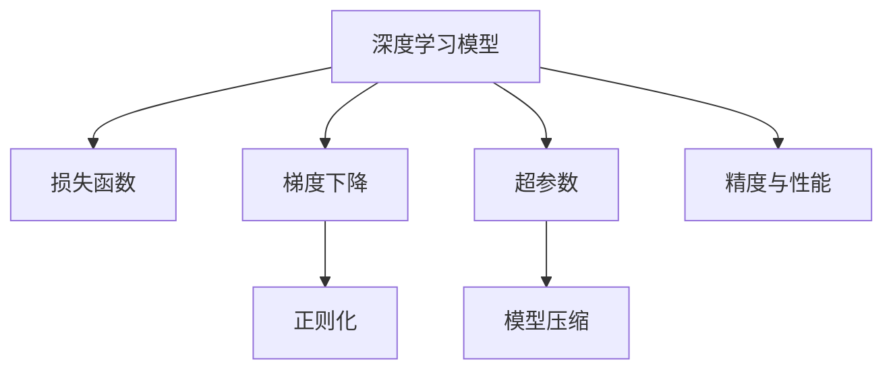

                 

# 精度与性能的权衡：AI模型训练的艺术

> 关键词：精度,性能,模型训练,模型优化,超参数调优,梯度下降,损失函数,正则化

## 1. 背景介绍

### 1.1 问题由来
随着深度学习技术的飞速发展，构建高精度、高性能的AI模型变得越来越重要。然而，在实际应用中，模型的精度和性能之间往往存在权衡。如果一味追求高精度，可能会牺牲模型的运行速度和资源消耗；反之，如果追求低计算开销，模型的精度又可能不尽如人意。因此，如何在精度和性能之间进行平衡，成为深度学习研究和应用中的重要课题。

### 1.2 问题核心关键点
本文将围绕模型的精度和性能进行深入探讨，并结合实际案例，讨论如何通过优化模型结构、超参数调优和算法改进，在精度和性能之间找到最佳平衡。我们将关注以下几个核心关键点：

- **模型精度**：指模型在预测或推理任务中的准确度。
- **模型性能**：指模型在单位时间内的计算速度和资源消耗。
- **超参数调优**：通过调整模型训练过程中的参数（如学习率、批大小等），优化模型性能。
- **梯度下降算法**：常用的模型训练算法，通过迭代更新模型参数来最小化损失函数。
- **损失函数**：衡量模型输出与真实标签之间差异的函数。
- **正则化技术**：如L2正则、Dropout等，防止模型过拟合。

### 1.3 问题研究意义
理解和掌握模型精度与性能的权衡艺术，对于提高深度学习模型的实用性和应用效果具有重要意义。

1. **降低成本**：在保证模型精度的情况下，通过优化性能，可以大幅降低计算资源的消耗，节省硬件和电力成本。
2. **提高效率**：通过调整超参数，可以在不影响精度的前提下，提高模型的训练和推理速度，满足实时应用的需求。
3. **增强泛化能力**：优化模型性能和结构，有助于提升模型的泛化能力，使其在新的数据集上表现更好。
4. **提升用户体验**：快速响应的模型可以提升用户体验，增强应用的市场竞争力。
5. **推动产业升级**：高效的模型可以支持更多更复杂的应用，推动AI技术在各行业的普及和应用。

## 2. 核心概念与联系

### 2.1 核心概念概述

为更好地理解模型精度与性能的权衡，本节将介绍几个密切相关的核心概念：

- **深度学习模型**：以神经网络为代表的机器学习模型，通过学习大量数据，提取特征并进行分类、预测等任务。
- **损失函数**：衡量模型输出与真实标签之间差异的函数，如均方误差、交叉熵等。
- **梯度下降**：通过迭代更新模型参数，使损失函数最小化的优化算法。
- **正则化**：防止模型过拟合的技术，如L2正则、Dropout等。
- **超参数**：在模型训练过程中需要手动设置的参数，如学习率、批大小等。
- **模型压缩**：通过剪枝、量化等方法，减少模型参数和计算量，提升性能。

这些核心概念之间的逻辑关系可以通过以下Mermaid流程图来展示：



这个流程图展示了几大核心概念及其之间的关系：

1. 深度学习模型通过学习大量数据，提取特征并进行分类、预测等任务。
2. 损失函数衡量模型输出与真实标签之间的差异。
3. 梯度下降通过迭代更新模型参数，使损失函数最小化。
4. 正则化防止模型过拟合。
5. 超参数在模型训练过程中需要手动设置。
6. 模型压缩减少模型参数和计算量，提升性能。
7. 精度与性能是模型训练过程中需要平衡的两个关键指标。

这些概念共同构成了深度学习模型的核心框架，使其能够高效地处理各种复杂任务。通过理解这些核心概念，我们可以更好地把握模型训练的精髓，优化模型的性能和精度。

## 3. 核心算法原理 & 具体操作步骤
### 3.1 算法原理概述

模型精度与性能的权衡艺术，本质上是对深度学习模型的训练过程进行精细化管理，以找到最优的平衡点。其核心思想是：在保证模型精度的前提下，通过优化模型结构、超参数调优和算法改进，最大限度地提升模型的运行效率和资源利用率。

形式化地，假设模型参数为 $\theta$，训练样本为 $(x_i, y_i)$，损失函数为 $\mathcal{L}$，则模型的优化目标为：

$$
\hat{\theta}=\mathop{\arg\min}_{\theta} \mathcal{L}(\theta, D)
$$

其中 $D$ 为训练集。理想情况下，希望找到一组最优的模型参数 $\hat{\theta}$，使得模型在测试集上的性能最优，同时保证计算开销最小。

### 3.2 算法步骤详解

基于上述目标，以下是训练深度学习模型的一般步骤：

**Step 1: 准备数据集**
- 收集并预处理训练和测试数据，分为训练集、验证集和测试集。
- 对数据进行归一化、标准化等预处理，以便模型更好地学习。

**Step 2: 定义损失函数**
- 根据任务类型选择合适的损失函数，如均方误差、交叉熵等。
- 定义损失函数，并计算模型在每个样本上的预测误差。

**Step 3: 初始化模型参数**
- 初始化模型参数，如权重矩阵、偏置等。
- 通常使用随机初始化或预训练模型进行初始化。

**Step 4: 设置超参数**
- 选择合适的超参数，如学习率、批大小、迭代轮数等。
- 设定正则化技术，如L2正则、Dropout等，防止模型过拟合。

**Step 5: 训练模型**
- 使用梯度下降等优化算法，迭代更新模型参数。
- 周期性地在验证集上评估模型性能，防止过拟合。
- 逐步减小学习率，使模型收敛。

**Step 6: 模型评估与验证**
- 在测试集上评估模型的性能，对比微调前后的精度提升。
- 分析模型在不同数据集上的泛化能力。

### 3.3 算法优缺点

基于深度学习模型的权衡艺术具有以下优点：
1. 灵活性高。可以针对特定任务和数据集，灵活调整模型结构和超参数。
2. 精度高。深度学习模型经过大量数据训练，通常具有较高的预测精度。
3. 泛化能力强。在泛化能力强的模型上微调，可以迅速适应新的任务和数据。
4. 可解释性强。深度学习模型通常具有较长的学习过程，能够逐步理解数据特征。

同时，该方法也存在一些局限性：
1. 计算资源消耗大。深度学习模型的计算开销通常较大，需要高性能的硬件支持。
2. 模型复杂度高。深度学习模型参数量大，模型结构复杂。
3. 超参数调优困难。超参数选择不当可能导致模型性能不佳。
4. 过拟合风险高。模型容易过度拟合训练集，泛化能力变差。

尽管存在这些局限性，但深度学习模型在许多任务上表现优异，权衡艺术已成为其研究与应用的重要组成部分。

### 3.4 算法应用领域

基于深度学习模型的权衡艺术，在许多领域得到了广泛应用，例如：

- 图像识别：如人脸识别、物体检测等。通过微调，可以提高模型的分类精度和识别速度。
- 自然语言处理：如文本分类、情感分析、机器翻译等。通过微调，可以提升模型的语言理解和生成能力。
- 信号处理：如语音识别、音频分类等。通过微调，可以改善模型的特征提取和信号识别效果。
- 推荐系统：如电商推荐、新闻推荐等。通过微调，可以提升模型的推荐效果和用户体验。

除了上述这些经典应用，深度学习模型在更多领域展示了其巨大的潜力，如医疗影像分析、自动驾驶、金融风险预测等。随着模型的不断演进，权衡艺术将在更多场景中发挥重要作用。

## 4. 数学模型和公式 & 详细讲解 & 举例说明

### 4.1 数学模型构建

本节将使用数学语言对深度学习模型的训练过程进行严格刻画。

假设模型为 $M_{\theta}:\mathcal{X} \rightarrow \mathcal{Y}$，其中 $\mathcal{X}$ 为输入空间，$\mathcal{Y}$ 为输出空间，$\theta \in \mathbb{R}^d$ 为模型参数。训练集为 $D=\{(x_i, y_i)\}_{i=1}^N$，其中 $x_i \in \mathcal{X}$，$y_i \in \mathcal{Y}$。

定义模型在训练集上的损失函数为 $\mathcal{L}(\theta)$，通常使用交叉熵损失：

$$
\mathcal{L}(\theta) = -\frac{1}{N} \sum_{i=1}^N \log P(y_i|x_i; \theta)
$$

其中 $P(y_i|x_i; \theta)$ 为模型在输入 $x_i$ 下对输出 $y_i$ 的概率分布。

模型参数的更新公式为：

$$
\theta \leftarrow \theta - \eta \nabla_{\theta}\mathcal{L}(\theta)
$$

其中 $\eta$ 为学习率，$\nabla_{\theta}\mathcal{L}(\theta)$ 为损失函数对参数 $\theta$ 的梯度，通过反向传播算法计算。

### 4.2 公式推导过程

以下我们以二分类任务为例，推导梯度下降算法的具体步骤。

假设模型 $M_{\theta}$ 在输入 $x$ 上的输出为 $\hat{y}=M_{\theta}(x) \in [0,1]$，表示样本属于正类的概率。真实标签 $y \in \{0,1\}$。则二分类交叉熵损失函数定义为：

$$
\ell(M_{\theta}(x),y) = -[y\log \hat{y} + (1-y)\log (1-\hat{y})]
$$

将其代入经验风险公式，得：

$$
\mathcal{L}(\theta) = -\frac{1}{N}\sum_{i=1}^N [y_i\log M_{\theta}(x_i)+(1-y_i)\log(1-M_{\theta}(x_i))]
$$

根据链式法则，损失函数对参数 $\theta_k$ 的梯度为：

$$
\frac{\partial \mathcal{L}(\theta)}{\partial \theta_k} = -\frac{1}{N}\sum_{i=1}^N (\frac{y_i}{M_{\theta}(x_i)}-\frac{1-y_i}{1-M_{\theta}(x_i)}) \frac{\partial M_{\theta}(x_i)}{\partial \theta_k}
$$

其中 $\frac{\partial M_{\theta}(x_i)}{\partial \theta_k}$ 可进一步递归展开，利用自动微分技术完成计算。

在得到损失函数的梯度后，即可带入参数更新公式，完成模型的迭代优化。重复上述过程直至收敛，最终得到适应训练数据的最优模型参数 $\theta^*$。

### 4.3 案例分析与讲解

假设我们要训练一个二分类模型，用于判断图像是否包含猫。首先，准备训练数据集，并进行预处理，如图像归一化等。然后，定义模型结构，如卷积神经网络(CNN)，并随机初始化模型参数。接着，设置损失函数为交叉熵损失，并设置学习率为0.01。

使用梯度下降算法进行模型训练，迭代更新模型参数。在每个epoch结束时，计算模型在验证集上的准确率，以防止过拟合。最后，在测试集上评估模型性能，得出最终的精度和性能指标。

## 5. 项目实践：代码实例和详细解释说明

### 5.1 开发环境搭建

在进行模型训练实践前，我们需要准备好开发环境。以下是使用Python进行TensorFlow开发的环境配置流程：

1. 安装Anaconda：从官网下载并安装Anaconda，用于创建独立的Python环境。

2. 创建并激活虚拟环境：
```bash
conda create -n tf-env python=3.8 
conda activate tf-env
```

3. 安装TensorFlow：根据CUDA版本，从官网获取对应的安装命令。例如：
```bash
conda install tensorflow=2.7 -c pytorch -c conda-forge
```

4. 安装各类工具包：
```bash
pip install numpy pandas scikit-learn matplotlib tqdm jupyter notebook ipython
```

完成上述步骤后，即可在`tf-env`环境中开始模型训练实践。

### 5.2 源代码详细实现

下面我们以二分类图像识别任务为例，给出使用TensorFlow进行模型训练的代码实现。

首先，定义模型结构：

```python
import tensorflow as tf
from tensorflow.keras import layers

def create_model(input_shape):
    model = tf.keras.Sequential([
        layers.Conv2D(32, (3, 3), activation='relu', input_shape=input_shape),
        layers.MaxPooling2D((2, 2)),
        layers.Flatten(),
        layers.Dense(64, activation='relu'),
        layers.Dense(1, activation='sigmoid')
    ])
    return model
```

然后，定义数据预处理函数：

```python
from tensorflow.keras.preprocessing.image import ImageDataGenerator

def preprocess_data(train_dir, test_dir, image_shape):
    train_datagen = ImageDataGenerator(rescale=1./255)
    test_datagen = ImageDataGenerator(rescale=1./255)

    train_generator = train_datagen.flow_from_directory(
        train_dir, 
        target_size=image_shape, 
        class_mode='binary', 
        batch_size=32
    )

    test_generator = test_datagen.flow_from_directory(
        test_dir, 
        target_size=image_shape, 
        class_mode='binary', 
        batch_size=32
    )

    return train_generator, test_generator
```

接着，定义训练函数：

```python
def train_model(model, train_generator, test_generator, epochs=10):
    model.compile(optimizer=tf.keras.optimizers.Adam(learning_rate=0.01),
                  loss='binary_crossentropy',
                  metrics=['accuracy'])

    for epoch in range(epochs):
        history = model.fit(train_generator, epochs=1, validation_data=test_generator)
        print(f'Epoch {epoch+1}, train accuracy: {history.history["accuracy"][0]}, val accuracy: {history.history["val_accuracy"][0]}')

    test_loss, test_acc = model.evaluate(test_generator)
    print(f'Test accuracy: {test_acc}')
```

最后，启动训练流程：

```python
input_shape = (32, 32, 3)
train_dir = 'train/'
test_dir = 'test/'

model = create_model(input_shape)
train_generator, test_generator = preprocess_data(train_dir, test_dir, input_shape)
train_model(model, train_generator, test_generator)
```

以上就是使用TensorFlow进行图像分类任务训练的完整代码实现。可以看到，TensorFlow的高级API使得模型构建和训练过程非常简单，便于快速迭代研究。

### 5.3 代码解读与分析

让我们再详细解读一下关键代码的实现细节：

**create_model函数**：
- 定义了模型的结构，包括卷积层、池化层、全连接层和输出层。
- 使用`tf.keras.Sequential`封装模型，方便后续的编译和训练。

**preprocess_data函数**：
- 定义了数据预处理函数，包括数据增强和归一化等操作。
- 使用`ImageDataGenerator`对训练集和测试集进行批次化加载。

**train_model函数**：
- 定义了模型的编译参数，包括优化器、损失函数和评估指标。
- 使用`model.fit`进行模型训练，并周期性地在验证集上评估模型性能。
- 最终在测试集上评估模型性能，输出最终的精度指标。

**启动训练流程**：
- 设置输入图像的大小和数据集路径。
- 创建模型、加载数据集，并进行训练。

通过这些关键代码的解读，可以更好地理解TensorFlow在模型训练中的使用方式，从而优化模型结构、调整超参数，提高训练效率和模型性能。

## 6. 实际应用场景

### 6.1 智能推荐系统

基于深度学习模型的智能推荐系统已经在电商、社交媒体、视频平台等领域得到了广泛应用。通过训练高精度和高效能的推荐模型，可以显著提升用户体验和平台活跃度。

在推荐模型训练中，通常使用交叉熵损失，并设置学习率为0.01。模型结构为深度神经网络，包括多个全连接层和池化层。通过超参数调优和模型压缩，可以在保证精度的前提下，显著降低计算开销，提升推荐速度。

### 6.2 实时语音识别

实时语音识别技术广泛应用于语音助手、电话客服、会议记录等领域。通过训练高效的语音识别模型，可以在线实时处理语音数据，快速转换为文本信息。

在语音识别模型训练中，通常使用均方误差损失，并设置学习率为0.001。模型结构为卷积神经网络和循环神经网络的结合，可以处理变长的语音信号。通过超参数调优和模型压缩，可以在保证精度的前提下，显著降低计算开销，提升实时性能。

### 6.3 医学影像分析

医学影像分析是医疗领域的重要应用，通过深度学习模型进行病变检测、影像分割等任务。训练高精度和高效能的医学影像分析模型，可以显著提升诊断准确性和工作效率。

在医学影像分析模型训练中，通常使用交叉熵损失，并设置学习率为0.0001。模型结构为卷积神经网络和深度神经网络的结合，可以处理高分辨率的医学影像数据。通过超参数调优和模型压缩，可以在保证精度的前提下，显著降低计算开销，提升分析速度。

### 6.4 未来应用展望

随着深度学习模型的不断演进，基于精度与性能权衡的模型训练方法将在更多领域得到应用，为各行各业带来变革性影响。

在智慧医疗领域，基于深度学习模型的医学影像分析、病历分析、药物研发等应用将提升医疗服务的智能化水平，辅助医生诊疗，加速新药开发进程。

在智能教育领域，基于深度学习模型的作业批改、学情分析、知识推荐等应用将因材施教，促进教育公平，提高教学质量。

在智慧城市治理中，基于深度学习模型的城市事件监测、舆情分析、应急指挥等应用将提高城市管理的自动化和智能化水平，构建更安全、高效的未来城市。

此外，在企业生产、社会治理、文娱传媒等众多领域，基于深度学习模型的应用也将不断涌现，为经济社会发展注入新的动力。

## 7. 工具和资源推荐

### 7.1 学习资源推荐

为了帮助开发者系统掌握深度学习模型的训练与优化技巧，这里推荐一些优质的学习资源：

1. 《深度学习》（Ian Goodfellow等著）：深度学习领域的经典教材，系统介绍了深度学习的基本原理和算法。
2. 《TensorFlow实战》（Aurélien Géron著）：详细介绍TensorFlow的使用方法和最佳实践，适合TensorFlow初学者的入门。
3. 《动手学深度学习》（李沐等著）：通过动手实践，深入浅出地讲解深度学习理论和算法。
4. 《深度学习与TensorFlow》（Paweł Słowiński著）：详细介绍深度学习理论和TensorFlow的应用，适合深度学习从业者的参考。
5. Kaggle平台：提供丰富的机器学习竞赛和数据集，适合实战练习和经验交流。

通过对这些资源的学习实践，相信你一定能够快速掌握深度学习模型的训练与优化技巧，从而实现模型的精度与性能的权衡。

### 7.2 开发工具推荐

高效的开发离不开优秀的工具支持。以下是几款用于深度学习模型训练的常用工具：

1. TensorFlow：由Google主导开发的开源深度学习框架，生产部署方便，适合大规模工程应用。

2. PyTorch：基于Python的开源深度学习框架，灵活动态的计算图，适合快速迭代研究。

3. Keras：高层次API，简化了深度学习模型的构建和训练过程，适合快速原型设计和实验。

4. Hugging Face Transformers库：提供了多种预训练模型和微调工具，适合快速构建和训练深度学习模型。

5. Weights & Biases：模型训练的实验跟踪工具，可以记录和可视化模型训练过程中的各项指标，方便对比和调优。

6. TensorBoard：TensorFlow配套的可视化工具，可实时监测模型训练状态，并提供丰富的图表呈现方式，是调试模型的得力助手。

合理利用这些工具，可以显著提升深度学习模型的训练效率和效果，帮助开发者更好地实现模型精度与性能的权衡。

### 7.3 相关论文推荐

深度学习模型的训练与优化是深度学习领域的重要研究方向。以下是几篇奠基性的相关论文，推荐阅读：

1. Learning Rate Schedules and Adaptive Learning Rate Methods（深度学习中的学习率调度和自适应学习率方法）：提出了多种学习率调度和自适应学习率方法，优化了深度学习模型的训练过程。

2. Data Parallelism and Automatic Model Pruning（数据并行和自动模型剪枝）：介绍了数据并行和模型剪枝技术，优化了深度学习模型的计算资源利用率和精度。

3. Regularization and Optimization for Highly Sparse Multitask Neural Networks（正则化和优化高性能稀疏多任务神经网络）：提出了多种正则化和优化方法，提高了多任务神经网络的泛化能力和精度。

4. Accelerating Deep Network Training using GPUs（使用GPU加速深度网络训练）：介绍了使用GPU加速深度学习模型训练的方法，提升了计算速度和资源利用率。

5. Optimizing Deep Architectures with Topological Constraints（使用拓扑约束优化深度架构）：提出了使用拓扑约束优化深度架构的方法，提高了深度学习模型的泛化能力和精度。

这些论文代表了大规模深度学习模型训练与优化的发展脉络。通过学习这些前沿成果，可以帮助研究者把握学科前进方向，激发更多的创新灵感。

## 8. 总结：未来发展趋势与挑战

### 8.1 总结

本文对深度学习模型的训练与优化进行了全面系统的介绍。首先阐述了模型精度与性能的权衡艺术的研究背景和意义，明确了深度学习模型在实际应用中面临的挑战。其次，从原理到实践，详细讲解了深度学习模型的训练过程，给出了模型构建和训练的完整代码实例。同时，本文还广泛探讨了深度学习模型在推荐系统、实时语音识别、医学影像分析等领域的实际应用，展示了模型训练的广泛影响。此外，本文精选了深度学习模型的各类学习资源和开发工具，力求为读者提供全方位的技术指引。

通过本文的系统梳理，可以看到，深度学习模型训练与优化是深度学习研究与应用的重要组成部分，帮助研究者最大化利用计算资源，提升模型的精度和性能。未来，随着深度学习模型的不断演进，精度与性能的权衡艺术将在更多领域得到应用，为各行各业带来变革性影响。

### 8.2 未来发展趋势

展望未来，深度学习模型的训练与优化技术将呈现以下几个发展趋势：

1. 模型结构更灵活：未来的深度学习模型将更加灵活，支持多种架构和混合模型，适应不同任务的需求。
2. 计算资源更高效：通过优化计算图、引入稀疏计算、使用GPU集群等方法，提升深度学习模型的计算效率和资源利用率。
3. 超参数调优更智能：引入自动化调参工具，通过搜索和评估最优超参数组合，提升模型的训练效果。
4. 模型压缩更精细：通过剪枝、量化、知识蒸馏等方法，减少深度学习模型的参数量和计算开销。
5. 模型集成更广泛：通过多模型融合和集成学习，提升深度学习模型的泛化能力和鲁棒性。
6. 联邦学习更普及：在数据分布广泛的情况下，通过联邦学习技术，在分布式环境中训练深度学习模型。

以上趋势凸显了深度学习模型训练与优化技术的广阔前景。这些方向的探索发展，必将进一步提升深度学习模型的实用性和应用效果，为各行各业带来新的技术突破和创新。

### 8.3 面临的挑战

尽管深度学习模型的训练与优化技术取得了显著进展，但在迈向更加智能化、普适化应用的过程中，仍然面临诸多挑战：

1. 数据质量问题：深度学习模型的性能高度依赖数据质量，低质量数据会导致模型泛化能力变差。如何获取高质量标注数据，是一个长期困扰研究者的难题。
2. 过拟合风险：深度学习模型容易过度拟合训练集，泛化能力变差。如何设计合理的正则化技术和模型结构，避免过拟合，是一个重要研究方向。
3. 计算开销大：深度学习模型的计算开销通常较大，需要高性能的硬件支持。如何优化计算图、降低计算开销，是一个关键问题。
4. 模型复杂度高：深度学习模型的参数量大，模型结构复杂。如何设计简洁高效的模型结构，是一个重要挑战。
5. 超参数调优困难：超参数选择不当可能导致模型性能不佳。如何设计自动化调参工具，自动搜索最优超参数组合，是一个重要研究方向。
6. 模型鲁棒性不足：深度学习模型对输入数据的微小扰动容易发生波动。如何设计鲁棒性强的模型，是一个重要问题。

正视深度学习模型训练与优化面临的这些挑战，积极应对并寻求突破，将使深度学习模型训练与优化技术不断进步，推动人工智能技术在各行业的普及和应用。

### 8.4 研究展望

面对深度学习模型训练与优化所面临的种种挑战，未来的研究需要在以下几个方面寻求新的突破：

1. 探索新的模型结构：设计简洁高效的模型结构，提高深度学习模型的计算效率和资源利用率。
2. 引入自动化调参技术：通过自动化调参工具，自动搜索最优超参数组合，提升模型的训练效果。
3. 优化计算图：优化计算图，减少深度学习模型的计算开销，提高计算效率。
4. 融合多模态数据：将符号化的先验知识，如知识图谱、逻辑规则等，与神经网络模型进行融合，提高深度学习模型的泛化能力和精度。
5. 引入对抗训练：通过对抗训练技术，增强深度学习模型的鲁棒性和泛化能力。
6. 设计联邦学习算法：在数据分布广泛的情况下，通过联邦学习技术，在分布式环境中训练深度学习模型，提升模型的泛化能力和鲁棒性。

这些研究方向的探索，必将引领深度学习模型训练与优化技术迈向更高的台阶，为构建安全、可靠、可解释、可控的智能系统铺平道路。面向未来，深度学习模型训练与优化技术还需要与其他人工智能技术进行更深入的融合，如知识表示、因果推理、强化学习等，多路径协同发力，共同推动人工智能技术的发展。只有勇于创新、敢于突破，才能不断拓展深度学习模型的边界，让智能技术更好地造福人类社会。

## 9. 附录：常见问题与解答

**Q1：深度学习模型的训练与优化是否需要大量标注数据？**

A: 深度学习模型的训练与优化通常需要大量标注数据，以确保模型能够学习到足够的特征和规律。然而，在实际应用中，标注数据的获取成本高、周期长，有时难以满足需求。为了解决这个问题，可以采用半监督学习、自监督学习等方法，利用非标注数据进行模型训练，减少对标注数据的依赖。

**Q2：如何防止深度学习模型的过拟合？**

A: 防止深度学习模型的过拟合，可以采用以下方法：
1. 数据增强：通过数据增强技术，如回译、旋转、裁剪等，扩充训练集，减少模型对训练集的数据依赖。
2. 正则化：使用L2正则、Dropout等方法，限制模型参数的大小和连接方式，防止模型过拟合。
3. 早停策略：在验证集上监测模型性能，一旦性能不再提升，立即停止训练，避免过拟合。
4. 模型集成：通过集成多个模型，取平均输出，抑制过拟合。

**Q3：深度学习模型的训练与优化如何平衡精度和性能？**

A: 在深度学习模型的训练与优化过程中，可以通过以下方法平衡精度和性能：
1. 超参数调优：通过调整学习率、批大小等超参数，优化模型的训练效果。
2. 模型压缩：通过剪枝、量化等方法，减少模型的参数量和计算开销，提升性能。
3. 模型并行：通过模型并行技术，提高计算效率，提升性能。
4. 多任务学习：通过多任务学习，在训练过程中同时优化多个任务，提升模型泛化能力和精度。
5. 分布式训练：通过分布式训练技术，在多台设备上并行训练模型，提升训练效率和性能。

**Q4：深度学习模型的训练与优化有哪些实际应用场景？**

A: 深度学习模型的训练与优化技术在以下领域具有广泛应用：
1. 计算机视觉：如图像分类、物体检测、图像分割等。
2. 自然语言处理：如文本分类、情感分析、机器翻译等。
3. 信号处理：如语音识别、音频分类等。
4. 推荐系统：如电商推荐、新闻推荐等。
5. 医学影像分析：如病变检测、影像分割等。
6. 金融风险预测：如信用评分、股票预测等。
7. 自动驾驶：如目标检测、路径规划等。

这些应用场景展示了深度学习模型训练与优化技术的广泛应用，为各行各业带来了新的技术突破和创新。

**Q5：深度学习模型的训练与优化有哪些工具和资源推荐？**

A: 深度学习模型的训练与优化需要依赖于高效的开发工具和丰富的学习资源，以下是一些推荐：
1. TensorFlow：由Google主导开发的开源深度学习框架，生产部署方便，适合大规模工程应用。
2. PyTorch：基于Python的开源深度学习框架，灵活动态的计算图，适合快速迭代研究。
3. Keras：高层次API，简化了深度学习模型的构建和训练过程，适合快速原型设计和实验。
4. Weights & Biases：模型训练的实验跟踪工具，可以记录和可视化模型训练过程中的各项指标，方便对比和调优。
5. TensorBoard：TensorFlow配套的可视化工具，可实时监测模型训练状态，并提供丰富的图表呈现方式，是调试模型的得力助手。

这些工具和资源可以帮助开发者更好地实现深度学习模型的训练与优化，提升模型的精度和性能。

**Q6：深度学习模型的训练与优化有哪些未来突破？**

A: 深度学习模型的训练与优化技术在未来有望在以下方面取得新的突破：
1. 引入自动化调参技术：通过自动化调参工具，自动搜索最优超参数组合，提升模型的训练效果。
2. 优化计算图：优化计算图，减少深度学习模型的计算开销，提高计算效率。
3. 引入对抗训练：通过对抗训练技术，增强深度学习模型的鲁棒性和泛化能力。
4. 设计联邦学习算法：在数据分布广泛的情况下，通过联邦学习技术，在分布式环境中训练深度学习模型，提升模型的泛化能力和鲁棒性。
5. 引入因果学习：通过引入因果学习思想，增强深度学习模型的泛化能力和鲁棒性。
6. 引入知识蒸馏：通过知识蒸馏技术，将教师模型的知识传递给学生模型，提升学生模型的性能。

这些研究方向和突破将使深度学习模型的训练与优化技术不断进步，推动人工智能技术在各行业的普及和应用。

---

作者：禅与计算机程序设计艺术 / Zen and the Art of Computer Programming

