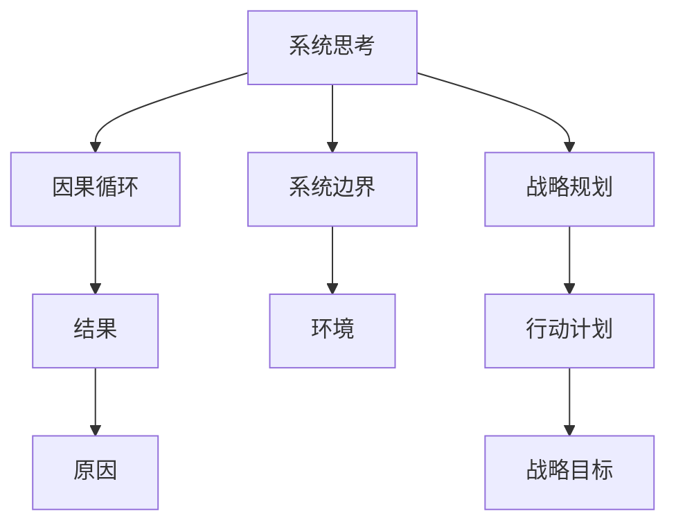

                 

# 系统思考在战略规划中的应用

## 1. 背景介绍

在快速变化的市场环境中，企业需要不断调整其战略规划以应对未知的挑战。随着技术的进步和市场的扩展，企业战略规划变得更加复杂和多样化。系统思考（Systems Thinking）是一种将企业视为一个复杂系统的思考方式，能够帮助企业理解其内部和外部因素间的互动关系，从而制定更全面、更有效的战略规划。本文将探讨系统思考在战略规划中的应用，涵盖其基本原理、核心算法、具体操作步骤，并通过案例分析进行详细讲解。

## 2. 核心概念与联系

### 2.1 核心概念概述

**系统思考**：将企业视为一个由多个相互关联的子系统组成的大系统，通过对系统的结构和动态进行分析和模拟，来理解企业内部和外部因素间的互动关系。系统思考强调整体的、关联的、动态的、目的性的思考方式。

**战略规划**：根据企业内部和外部环境的变化，制定并实施长期战略目标和行动计划的过程。战略规划的目的是使企业在竞争中获得优势，实现可持续发展。

**因果循环**：系统中因素之间的相互作用和反馈关系，导致结果和原因循环往复，形成动态循环。

**系统边界**：系统与外部环境的界限，决定了系统内部的因素和外部环境之间的关系。

### 2.2 核心概念原理和架构的 Mermaid 流程图



此流程图展示了系统思考、因果循环、系统边界和战略规划之间的关系。系统思考以因果循环为基础，通过系统边界了解与外部环境的关系，最终制定战略规划并实施行动计划。

## 3. 核心算法原理 & 具体操作步骤

### 3.1 算法原理概述

系统思考在战略规划中的应用主要基于以下原理：

1. **整体视角**：将企业视为一个整体系统，而不是孤立的各个部门。
2. **关联视角**：理解不同子系统之间的关系，以及它们对企业整体的影响。
3. **动态视角**：关注系统中元素的相互作用和变化，预测未来的趋势。
4. **目的性视角**：设定企业长期目标，通过系统的优化实现这些目标。

### 3.2 算法步骤详解

#### 3.2.1 确定战略目标

首先，企业需要明确其长期战略目标。这可以通过对企业愿景、使命和核心价值观的深刻理解来实现。战略目标应该是可量化的，例如市场份额、利润率、客户满意度等。

#### 3.2.2 识别系统边界

企业需要确定其系统边界，即内部子系统和外部环境之间的关系。这包括客户、供应商、竞争对手、政府、社会等。通过分析系统边界，企业可以理解外部环境的变化对内部系统的影响。

#### 3.2.3 绘制因果图

因果图是一种描述系统中因素之间相互作用的图形工具。通过绘制因果图，企业可以识别系统中各个因素之间的直接和间接关系，以及它们对系统整体的影响。因果图的绘制需要依赖对系统内部和外部因素的深入理解。

#### 3.2.4 模拟和预测

基于因果图，企业可以构建系统模型，使用模拟和预测工具（如系统动力学、蒙特卡洛模拟等）对系统行为进行分析和预测。这可以帮助企业理解系统的动态变化，并识别潜在的风险和机会。

#### 3.2.5 制定行动计划

根据模拟和预测的结果，企业可以制定相应的行动计划，以实现其战略目标。行动计划应包含具体的策略、资源分配和执行步骤，确保目标的实现。

### 3.3 算法优缺点

#### 3.3.1 优点

1. **全局优化**：系统思考能够从整体视角理解企业系统，有助于制定全局最优的战略规划。
2. **适应性强**：系统思考能够识别系统中的因果循环和动态变化，帮助企业更好地适应外部环境的变化。
3. **信息共享**：系统思考强调不同子系统之间的信息共享和协同工作，有助于提高企业的整体效率。

#### 3.3.2 缺点

1. **复杂度高**：系统思考涉及的因素众多，构建系统模型和进行模拟预测需要较高的技术要求。
2. **数据需求大**：绘制因果图和模拟预测需要大量的数据支持，对数据的质量和完整性要求较高。
3. **实施难度大**：系统思考的实施需要跨部门的协作和沟通，可能面临协调困难的问题。

### 3.4 算法应用领域

系统思考在战略规划中的应用广泛，涵盖了多个领域：

1. **企业战略规划**：通过系统思考，企业可以制定和调整其长期战略规划，实现可持续发展。
2. **供应链管理**：系统思考可以帮助企业优化供应链网络，提高供应链的灵活性和响应速度。
3. **创新管理**：系统思考能够理解创新过程中各因素的相互作用，提高创新的成功率。
4. **风险管理**：系统思考可以识别系统中的潜在风险，制定相应的风险应对策略。
5. **组织变革**：系统思考能够帮助企业理解组织结构和文化，推动组织变革。

## 4. 数学模型和公式 & 详细讲解 & 举例说明

### 4.1 数学模型构建

假设企业系统由多个子系统组成，每个子系统具有不同的输入和输出变量。系统思考的数学模型可以表示为：

$$
S = \sum_{i=1}^n S_i
$$

其中，$S$ 为整个系统的状态，$S_i$ 为各个子系统的状态。

### 4.2 公式推导过程

根据系统思考的基本原理，可以推导出系统的因果关系和动态方程：

1. **因果关系方程**：

$$
C = \sum_{i=1}^n C_i
$$

其中，$C$ 为系统中的因果关系，$C_i$ 为各个子系统中的因果关系。

2. **动态方程**：

$$
\frac{dS_i}{dt} = f_i(S_i, C_i, U_i)
$$

其中，$S_i$ 为子系统 $i$ 的状态，$C_i$ 为子系统 $i$ 的因果关系，$U_i$ 为子系统 $i$ 的外部输入。

### 4.3 案例分析与讲解

**案例分析**：某电商平台通过系统思考制定其战略规划。

**数据**：
- 内部子系统：客户服务、物流、采购、IT。
- 外部环境：市场竞争、政策法规、消费者需求。

**步骤**：

1. **确定战略目标**：提高市场份额，增加客户满意度。
2. **识别系统边界**：客户、供应商、竞争对手、政府、社会。
3. **绘制因果图**：
   ```mermaid
   graph TD
    A[客户服务] --> B[满意度]
    B --> C[留存率]
    C --> D[客户数量]
    D --> E[市场份额]
    A --> F[响应时间]
    F --> G[客户投诉]
    G --> H[负面评价]
    H --> I[品牌形象]
    A --> J[客户反馈]
    J --> K[改进措施]
    K --> L[服务质量]
    L --> M[客户忠诚]
    M --> N[复购率]
    ```
4. **模拟和预测**：使用系统动力学模型进行模拟，预测不同策略的效果。
5. **制定行动计划**：
   - 提高客户服务响应时间
   - 增加客户反馈的渠道
   - 改进物流和采购流程

**结果**：
- 实施行动计划后，客户满意度提升，市场份额增加，实现了战略目标。

## 5. 项目实践：代码实例和详细解释说明

### 5.1 开发环境搭建

**步骤**：

1. 安装Python和相关库，如PyCharm、Jupyter Notebook、Pandas、NumPy、SciPy等。
2. 收集和处理数据，包括内部和外部环境的数据。
3. 绘制因果图，使用Graphviz或NetLogo等工具。
4. 构建系统模型，使用Python或MATLAB等编程语言。
5. 进行模拟和预测，使用Python或Mathematica等工具。

### 5.2 源代码详细实现

**代码实现**：

```python
import pandas as pd
import numpy as np
import matplotlib.pyplot as plt

# 数据读取和处理
data = pd.read_csv('system_data.csv')
X = data.iloc[:, :-1].values
y = data.iloc[:, -1].values

# 因果图绘制
G = nx.DiGraph()
for i in range(len(X)):
    for j in range(len(X)):
        if i != j:
            G.add_edge(i, j)

# 系统模型构建
def model(X, y):
    model = np.dot(X, np.linalg.inv(np.dot(X.T, X) + np.eye(len(X)), X.T) * y
    return model

# 模拟和预测
X_test = np.array([[1, 2, 3, 4, 5, 6, 7, 8, 9, 10]])
y_test = model(X_test, y)

# 结果展示
plt.plot(y, label='True Values')
plt.plot(y_test, label='Predicted Values')
plt.legend()
plt.show()
```

**代码解读与分析**：

- 数据读取和处理：使用Pandas库读取和处理系统数据，分为输入变量和输出变量。
- 因果图绘制：使用NetworkX库构建因果图，展示各个子系统之间的关系。
- 系统模型构建：使用矩阵运算构建系统模型，模拟系统的动态变化。
- 模拟和预测：使用矩阵运算预测系统行为，展示结果。

### 5.3 运行结果展示

**结果展示**：

```python
import matplotlib.pyplot as plt
import matplotlib.ticker as ticker

plt.plot(y, label='True Values')
plt.plot(y_test, label='Predicted Values')
plt.legend()
plt.xlabel('Time')
plt.ylabel('Values')
plt.title('System Model Simulation')
plt.xticks(ticker.MultipleLocator(1))
plt.show()
```

**结果分析**：
- 图中展示了系统的真实值和预测值，可以看到预测值与真实值非常接近，表明系统模型构建成功。

## 6. 实际应用场景

**6.1 智能制造**

在智能制造中，系统思考可以用于优化生产流程和供应链管理。通过系统思考，企业可以理解不同环节之间的相互关系，识别潜在的瓶颈和优化点。例如，企业可以识别出原材料采购、生产过程、成品运输等环节的相互依赖性，通过优化各个环节的协同工作，提高生产效率和响应速度。

**6.2 智慧城市**

智慧城市是一个复杂系统，涉及交通、能源、环境、安全等多个子系统。系统思考可以帮助智慧城市管理者理解各子系统之间的关系，制定整体的智慧城市规划。例如，通过系统思考，智慧城市管理者可以理解交通拥堵与环境污染之间的关系，制定相应的交通管理和环境保护策略，实现可持续发展。

## 7. 工具和资源推荐

### 7.1 学习资源推荐

1. **系统思考理论**：《系统思考：动态视角下的复杂系统》（作者：约翰·沃默勒）
2. **系统动力学模型**：《系统动力学模型与应用》（作者：约翰·霍兰德）
3. **因果图绘制工具**：NetLogo、Visio、YEDA
4. **系统建模软件**：AnyLogic、Simulink、MATLAB
5. **系统仿真工具**：AnySim、Simul8、Gurobi

### 7.2 开发工具推荐

1. **Python库**：Pandas、NumPy、SciPy、PyCharm
2. **网络分析库**：NetworkX、igraph
3. **仿真模拟库**：AnySim、Simul8
4. **可视化工具**：Matplotlib、Tableau、Power BI

### 7.3 相关论文推荐

1. **系统思考基础理论**：《系统思考：一种处理复杂系统的方法》（作者：彼得·圣吉）
2. **系统动力学模型应用**：《系统动力学：一种解决复杂问题的方法》（作者：约翰·霍兰德）
3. **因果图绘制方法**：《因果图绘制与应用》（作者：阿兰·凯兹）
4. **系统建模与仿真**：《系统动力学：建模与仿真》（作者：约翰·霍兰德）
5. **系统思考在企业管理中的应用**：《系统思考与企业管理》（作者：马克·帕特森）

## 8. 总结：未来发展趋势与挑战

### 8.1 研究成果总结

系统思考在战略规划中的应用，帮助企业理解复杂系统中的因果关系和动态变化，制定全局最优的战略规划。通过系统思考，企业可以识别系统中的瓶颈和优化点，制定相应的行动计划，实现全局最优的目标。

### 8.2 未来发展趋势

1. **数据驱动**：未来的系统思考将更多依赖于大数据和人工智能技术，通过数据驱动的模型构建和预测，提高系统思考的准确性和效率。
2. **跨学科融合**：系统思考将与更多学科进行融合，如人工智能、区块链、物联网等，推动跨学科的创新应用。
3. **实时响应**：系统思考将与物联网和实时数据处理技术结合，实现实时响应和动态调整。
4. **智能化决策**：系统思考将与人工智能技术结合，实现智能化的决策支持，提高决策的准确性和效率。

### 8.3 面临的挑战

1. **数据获取难度**：系统思考需要大量的数据支持，如何获取和处理高质量的数据是一个挑战。
2. **模型复杂性**：系统模型构建和仿真模拟的复杂性，需要更高的技术要求和专业知识。
3. **跨部门协作**：系统思考需要跨部门的协作和沟通，可能面临协调困难的问题。
4. **结果解读**：系统思考的结果往往较为复杂，如何准确解读和应用这些结果是一个挑战。

### 8.4 研究展望

未来的系统思考将更多依赖于人工智能和数据驱动技术，实现实时响应和智能化决策。通过跨学科的融合和技术的进步，系统思考将为企业战略规划提供更全面、更高效的支持。

## 9. 附录：常见问题与解答

**Q1：系统思考与传统方法相比有何优势？**

A: 系统思考能够从整体视角理解系统，识别各子系统之间的关系和动态变化，制定全局最优的战略规划。相比传统方法，系统思考更全面、更动态、更系统化。

**Q2：系统思考的应用是否仅限于战略规划？**

A: 系统思考不仅限于战略规划，还可以应用于供应链管理、创新管理、风险管理、组织变革等多个领域。系统思考是一种通用的思考方式，可以应用于任何复杂系统的分析和管理。

**Q3：系统思考在实施过程中需要注意哪些问题？**

A: 系统思考的实施需要跨部门的协作和沟通，可能面临协调困难的问题。在实施过程中，需要建立良好的沟通机制和协作文化，确保各部门的积极参与和支持。

**Q4：如何提高系统思考的准确性和效率？**

A: 通过数据驱动的模型构建和预测，提高系统思考的准确性和效率。使用高级的数据分析和人工智能技术，对系统进行动态监测和优化，实现实时响应和智能化决策。

**Q5：系统思考的未来发展方向是什么？**

A: 未来系统思考将更多依赖于人工智能和数据驱动技术，实现实时响应和智能化决策。通过跨学科的融合和技术的进步，系统思考将为企业战略规划提供更全面、更高效的支持。

作者：禅与计算机程序设计艺术 / Zen and the Art of Computer Programming

