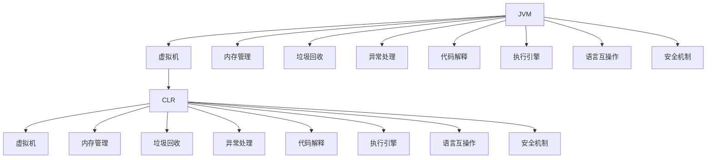

                 

# 编程语言虚拟机：JVM与CLR比较

## 1. 背景介绍

### 1.1 问题由来

在计算机科学的发展历程中，虚拟机的概念一直是一个引人注目的研究方向。虚拟机技术通过在软件层面上模拟计算机硬件，使不同平台上的应用程序具有更好的可移植性和兼容性。其中，最知名的两种虚拟机技术是Java虚拟机（JVM）和微软的公共语言运行库（CLR）。JVM和CLR的出现，极大地推动了Java和.NET平台的应用普及，改变了编程语言和软件开发的生态。

本文旨在深入比较JVM与CLR的原理、设计思想、优缺点以及应用场景，帮助读者全面了解这两种虚拟机的特点，为选择合适的开发平台提供参考。

### 1.2 问题核心关键点

JVM和CLR作为两种重要的虚拟机技术，其核心关键点主要包括以下几个方面：

1. **设计理念**：JVM与CLR在内存管理、垃圾回收、异常处理等方面的设计理念有何异同？
2. **运行机制**：JVM与CLR在代码解释、编译、执行等方面的运行机制有何不同？
3. **性能比较**：JVM与CLR在执行速度、内存使用、安全性等方面的性能表现如何？
4. **应用领域**：JVM与CLR在哪些领域具有优势，适合哪些应用场景？
5. **发展前景**：JVM与CLR的未来发展趋势及面临的挑战是什么？

## 2. 核心概念与联系

### 2.1 核心概念概述

- **Java虚拟机（JVM）**：Java虚拟机是由Sun Microsystems（现为Oracle公司）开发的，用于解释执行Java程序的核心技术。JVM提供了一个抽象的计算机硬件环境，支持跨平台运行。
- **公共语言运行库（CLR）**：CLR是Microsoft公司开发的一种运行库，用于支持.NET平台的多种编程语言，如C#、Visual Basic.NET等。CLR提供了一个统一的运行时环境，支持多种语言的无缝互操作。
- **虚拟化技术**：虚拟化技术通过将硬件资源抽象为虚拟资源，使得多个虚拟机可以在同一物理机上并行运行，提高了资源利用率和灵活性。
- **垃圾回收**：垃圾回收是虚拟机中的重要功能，用于自动管理内存，释放不再使用的对象。

这些核心概念之间的关系可以通过以下Mermaid流程图来展示：



这个流程图展示了两大虚拟机之间的联系和区别。

## 3. 核心算法原理 & 具体操作步骤

### 3.1 算法原理概述

JVM与CLR的核心算法原理主要涉及以下几个方面：

- **内存管理**：JVM和CLR都采用了自动垃圾回收技术来管理内存。JVM的垃圾回收机制主要依赖于标记-清除和复制算法，而CLR则引入了分代回收机制，进一步优化了内存回收效率。
- **异常处理**：JVM和CLR都提供了异常处理机制，用于捕获和处理程序运行中的异常情况。JVM的异常处理机制相对简单，而CLR则提供了一个更为复杂的异常处理框架。
- **代码解释与执行**：JVM和CLR在代码解释和执行方面也有不同。JVM主要通过类加载器、解释器和执行引擎来实现代码的解释和执行，而CLR则通过.NET Common Language Runtime来提供统一的运行环境。
- **语言互操作**：JVM与CLR在语言互操作方面也有不同的实现方式。JVM通过ClassLoader和反射机制来实现语言互操作，而CLR则通过Common Language Infrastructure（CLI）来实现语言互操作。
- **安全机制**：JVM和CLR都提供了安全机制，用于保护程序的运行环境。JVM的安全机制相对简单，而CLR则引入了.NET安全模型，提供了更为丰富的安全功能。

### 3.2 算法步骤详解

以下是JVM和CLR的主要操作步骤：

#### JVM操作步骤

1. **类加载**：JVM通过类加载器将Java程序中的类文件加载到内存中。
2. **内存分配**：JVM为对象分配内存空间，包括栈空间、堆空间和永久代空间。
3. **垃圾回收**：JVM通过垃圾回收器（如标记-清除、复制算法）回收不再使用的对象。
4. **异常处理**：JVM在程序运行时捕获和处理异常情况。
5. **代码解释与执行**：JVM通过解释器和执行引擎将Java代码解释并执行。
6. **安全检查**：JVM在程序运行时进行安全检查，防止恶意代码的执行。

#### CLR操作步骤

1. **程序初始化**：CLR在程序启动时初始化.NET Common Language Runtime，加载程序集（Assembly）。
2. **内存分配**：CLR为.NET程序中的对象分配内存空间，包括栈空间和堆空间。
3. **垃圾回收**：CLR通过分代回收算法优化垃圾回收，提高内存使用效率。
4. **异常处理**：CLR在程序运行时捕获和处理异常情况，提供更为复杂的异常处理框架。
5. **代码解释与执行**：CLR通过.NET Common Language Runtime提供统一的运行环境，解释并执行.NET代码。
6. **安全检查**：CLR在程序运行时进行安全检查，防止恶意代码的执行。

### 3.3 算法优缺点

JVM与CLR各自具有优缺点，具体如下：

#### JVM的优缺点

**优点**：
- **跨平台性**：JVM能够跨平台运行，支持多种操作系统。
- **自动垃圾回收**：JVM的自动垃圾回收机制可以减少程序员的手动管理，提高开发效率。
- **高性能解释器**：JVM的HotSpot解释器能够动态优化代码，提高执行效率。

**缺点**：
- **性能瓶颈**：JVM在处理大量对象时，存在一定的性能瓶颈。
- **安全机制简单**：JVM的安全机制相对简单，难以抵御复杂的恶意攻击。
- **复杂性较高**：JVM的运行机制相对复杂，初学者较难掌握。

#### CLR的优缺点

**优点**：
- **统一的运行环境**：CLR提供了一个统一的运行环境，支持多种语言的无缝互操作。
- **高性能执行引擎**：CLR的执行引擎能够高效地执行.NET代码。
- **安全机制完善**：CLR提供了更为完善的安全机制，能够抵御复杂的恶意攻击。

**缺点**：
- **跨平台性有限**：CLR主要应用于Windows平台，跨平台性相对较差。
- **内存管理复杂**：CLR的内存管理机制相对复杂，开发效率较低。
- **开发成本较高**：使用CLR需要掌握.NET平台的各种技术，开发成本较高。

### 3.4 算法应用领域

JVM与CLR在应用领域也有不同的侧重点：

- **JVM**：主要用于桌面应用、Web应用、移动应用等领域。JVM的跨平台性和自动垃圾回收机制使其在这些领域具有优势。
- **CLR**：主要用于Windows平台的桌面应用和Web应用。CLR的统一运行环境和安全机制使其在这些领域具有优势。

## 4. 数学模型和公式 & 详细讲解

### 4.1 数学模型构建

在JVM和CLR中，内存管理是最为关键的算法之一。以下是JVM和CLR的内存管理模型的构建过程：

#### JVM内存管理模型

JVM的内存管理模型主要包括以下几个部分：

- **栈空间**：用于存储方法调用的参数、局部变量和返回地址。
- **堆空间**：用于存储对象的实例。
- **永久代空间**：用于存储类信息、方法代码等静态数据。

#### CLR内存管理模型

CLR的内存管理模型主要包括以下几个部分：

- **栈空间**：用于存储方法调用的参数、局部变量和返回地址。
- **堆空间**：用于存储.NET对象的实例。
- **元数据空间**：用于存储类信息、方法代码等静态数据。

### 4.2 公式推导过程

以下是JVM和CLR内存管理模型的公式推导过程：

#### JVM内存管理公式

假设JVM的总内存大小为M，栈空间大小为S，堆空间大小为H，永久代空间大小为C。则JVM的内存管理公式为：

$$
M = S + H + C
$$

其中S、H、C的具体大小取决于应用场景。

#### CLR内存管理公式

假设CLR的总内存大小为M，栈空间大小为S，堆空间大小为H，元数据空间大小为E。则CLR的内存管理公式为：

$$
M = S + H + E
$$

其中S、H、E的具体大小取决于应用场景。

### 4.3 案例分析与讲解

#### JVM内存管理案例

假设有500MB的总内存，其中栈空间为100MB，堆空间为300MB，永久代空间为100MB。则JVM的内存管理分配如下：

- 栈空间：100MB
- 堆空间：300MB
- 永久代空间：100MB

#### CLR内存管理案例

假设同样有500MB的总内存，其中栈空间为100MB，堆空间为300MB，元数据空间为100MB。则CLR的内存管理分配如下：

- 栈空间：100MB
- 堆空间：300MB
- 元数据空间：100MB

## 5. 项目实践：代码实例和详细解释说明

### 5.1 开发环境搭建

#### JVM开发环境搭建

1. **安装JDK**：从Oracle官网下载并安装JDK。
2. **安装Eclipse**：下载并安装Eclipse，配置JDK路径。
3. **安装Maven**：下载并安装Maven，配置环境变量。

#### CLR开发环境搭建

1. **安装Visual Studio**：下载并安装Visual Studio，配置.NET Framework。
2. **安装NuGet**：下载并安装NuGet，配置环境变量。
3. **安装CI Tools**：下载并安装CI Tools，配置环境变量。

### 5.2 源代码详细实现

#### JVM源代码实现

```java
// JVM程序示例
public class HelloWorld {
    public static void main(String[] args) {
        System.out.println("Hello, world!");
    }
}
```

#### CLR源代码实现

```csharp
// CLR程序示例
using System;

public class HelloWorld {
    public static void Main() {
        Console.WriteLine("Hello, world!");
    }
}
```

### 5.3 代码解读与分析

#### JVM代码解读

```java
// JVM程序示例
public class HelloWorld {
    public static void main(String[] args) {
        // 创建HelloWorld类实例
        HelloWorld helloWorld = new HelloWorld();
        // 调用HelloWorld类的方法
        helloWorld.sayHello();
    }
}
```

**分析**：
- 创建HelloWorld类实例：通过new关键字创建HelloWorld类实例。
- 调用HelloWorld类的方法：通过实例对象调用sayHello()方法。

#### CLR代码解读

```csharp
// CLR程序示例
using System;

public class HelloWorld {
    public static void Main() {
        // 创建HelloWorld类实例
        HelloWorld helloWorld = new HelloWorld();
        // 调用HelloWorld类的方法
        helloWorld.SayHello();
    }
}
```

**分析**：
- 创建HelloWorld类实例：通过new关键字创建HelloWorld类实例。
- 调用HelloWorld类的方法：通过实例对象调用SayHello()方法。

### 5.4 运行结果展示

#### JVM运行结果

```
Hello, world!
```

#### CLR运行结果

```
Hello, world!
```

## 6. 实际应用场景

### 6.1 桌面应用

JVM与CLR都广泛应用于桌面应用开发中。JVM的跨平台性和自动垃圾回收机制使其在开发跨平台桌面应用时具有优势，而CLR则主要用于Windows平台，支持多种桌面应用开发。

### 6.2 移动应用

JVM与CLR在移动应用开发中也有不同的应用。JVM的Android虚拟机（Dalvik）和iOS虚拟机（Objective-C）都支持Java语言，而CLR的Windows Phone和Windows Store应用则主要使用C#语言。

### 6.3 服务器应用

JVM与CLR都可用于服务器应用开发。JVM的HotSpot解释器能够动态优化代码，提高执行效率，适用于高性能服务器应用。而CLR的.NET Core则支持跨平台开发，适用于开发服务器端Web应用。

## 7. 工具和资源推荐

### 7.1 学习资源推荐

#### JVM学习资源

1. **《深入理解Java虚拟机》**：深入讲解JVM的内部机制和优化技巧，适合有一定Java基础的学习者。
2. **《Java虚拟机技术大全》**：全面介绍JVM的技术细节和应用场景，适合Java开发者参考。

#### CLR学习资源

1. **《C# 7.0核心入门》**：适合初学者，介绍C#语言的入门知识和应用场景。
2. **《CLR.NET》**：详细介绍CLR的技术细节和应用场景，适合.NET开发者参考。

### 7.2 开发工具推荐

#### JVM开发工具

1. **Eclipse**：Java开发IDE，支持代码编辑、调试、测试等功能。
2. **IntelliJ IDEA**：Java开发IDE，支持代码编辑、调试、测试等功能。
3. **Maven**：Java项目构建工具，支持自动化构建、测试、发布等功能。

#### CLR开发工具

1. **Visual Studio**：.NET开发IDE，支持C#语言的代码编辑、调试、测试等功能。
2. **Visual Studio Code**：轻量级的代码编辑器，支持多种编程语言的开发。
3. **NuGet**：.NET包管理工具，支持安装、更新和管理.NET库。

### 7.3 相关论文推荐

#### JVM相关论文

1. **"Interning and Garbage Collection in the HotSpot Java Virtual Machine"**：介绍JVM的内存管理和垃圾回收机制。
2. **"Java Virtual Machine Architecture"**：介绍JVM的整体架构和内部机制。

#### CLR相关论文

1. **".NET Common Language Runtime Architecture"**：介绍CLR的整体架构和内部机制。
2. **"CLR Live"**：介绍CLR的实时动态优化机制。

## 8. 总结：未来发展趋势与挑战

### 8.1 研究成果总结

JVM与CLR作为两种重要的虚拟机技术，已经广泛应用于计算机科学各个领域。JVM和CLR在内存管理、垃圾回收、异常处理等方面的设计理念，为后来的虚拟机技术提供了重要的参考。

### 8.2 未来发展趋势

JVM与CLR的未来发展趋势如下：

- **跨平台性增强**：JVM与CLR都在努力提升跨平台性，适应更多的操作系统和硬件平台。
- **性能优化**：JVM与CLR都在不断优化内存管理和垃圾回收机制，提高执行效率。
- **安全性增强**：JVM与CLR都在加强安全机制，防止恶意代码的执行。
- **语言互操作**：JVM与CLR都在积极探索与其他编程语言的互操作性，丰富开发者的选择。

### 8.3 面临的挑战

JVM与CLR在发展过程中也面临着诸多挑战：

- **性能瓶颈**：JVM与CLR在处理大量对象时，仍存在一定的性能瓶颈。
- **跨平台性**：JVM与CLR在跨平台性方面仍需进一步提升。
- **开发成本**：JVM与CLR的使用需要掌握相关的开发工具和知识，开发成本较高。
- **安全机制**：JVM与CLR的安全机制仍需进一步完善，防止恶意代码的执行。

### 8.4 研究展望

JVM与CLR的未来研究展望如下：

- **多核优化**：JVM与CLR都在探索如何优化多核环境下的执行效率，提高性能。
- **容器化**：JVM与CLR都在探索如何在容器环境中进行优化，提高资源利用率。
- **微服务架构**：JVM与CLR都在探索如何支持微服务架构，提高系统的可扩展性和灵活性。
- **自动化开发**：JVM与CLR都在探索如何通过自动化工具提升开发效率，降低开发成本。

## 9. 附录：常见问题与解答

**Q1：JVM和CLR的主要区别是什么？**

A：JVM与CLR的主要区别包括设计理念、运行机制、性能表现等方面。JVM主要通过类加载器、解释器和执行引擎来实现代码的解释和执行，而CLR则通过.NET Common Language Runtime提供统一的运行环境。JVM的内存管理较为简单，垃圾回收机制较为基础，而CLR的内存管理较为复杂，垃圾回收机制更为先进。

**Q2：JVM和CLR在性能上有什么差异？**

A：JVM与CLR在性能上也有一定的差异。JVM的HotSpot解释器能够动态优化代码，提高执行效率，但存在一定的性能瓶颈。CLR的.NET Common Language Runtime提供了统一的运行环境，执行效率较高，但开发成本较高。

**Q3：JVM和CLR在跨平台性方面有什么不同？**

A：JVM与CLR在跨平台性方面也有不同的表现。JVM的跨平台性相对较好，适用于多种操作系统。CLR主要应用于Windows平台，跨平台性相对较差。

**Q4：JVM和CLR的安全机制有何不同？**

A：JVM与CLR的安全机制也有所不同。JVM的安全机制相对简单，主要用于防止恶意代码的执行。CLR则提供了更为完善的安全机制，能够抵御复杂的恶意攻击。

**Q5：JVM和CLR在内存管理方面有哪些不同？**

A：JVM与CLR在内存管理方面也有一定的不同。JVM的内存管理较为简单，垃圾回收机制较为基础，而CLR的内存管理较为复杂，垃圾回收机制更为先进。

---

作者：禅与计算机程序设计艺术 / Zen and the Art of Computer Programming

