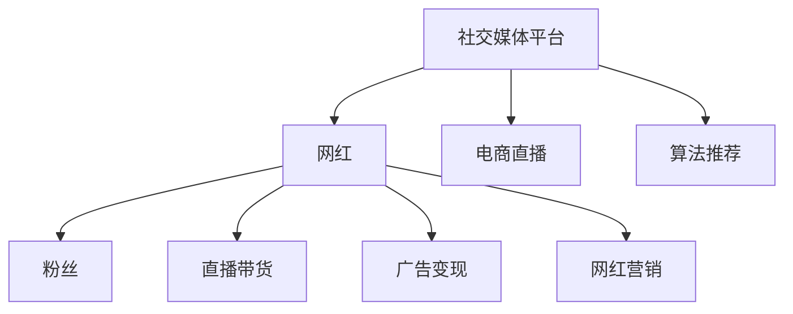

                 

# 网红经济：注意力变现的典型案例

> 关键词：网红经济,注意力变现,社交媒体,电商直播,算法推荐

## 1. 背景介绍

随着互联网技术的飞速发展和用户对内容消费需求的日益增长，“网红经济”（Influencer Economy）逐渐成为数字经济中的重要一环。网红，即网络红人，指的是那些通过网络平台传播内容和影响力，吸引大量粉丝并带来经济效益的个人或团体。他们通过视频、直播、博客等多种形式，与粉丝进行互动，推荐商品，提供专业建议，甚至参与产品设计等，形成了独特的社交经济形态。

在网红经济中，网红的关注度（即注意力）是决定其商业价值的关键因素。因此，如何高效地变现注意力，成为网红经济的核心问题。从社交媒体平台到电商直播再到算法推荐，这些技术手段的应用使得网红经济得以蓬勃发展。本文将深入探讨这些技术在注意力变现中的应用，分析其原理与操作，并展望其未来发展趋势与面临的挑战。

## 2. 核心概念与联系

### 2.1 核心概念概述

为了更好地理解注意力变现的机制，本节将介绍几个核心概念：

- **社交媒体平台**：提供网红与粉丝互动的线上平台，如微博、抖音、小红书等，这些平台为网红提供了发布内容、变现广告、直播带货的渠道。
- **电商直播**：网红通过直播平台向粉丝销售商品，通过展示产品、实时互动等方式，增加粉丝购买力。
- **算法推荐**：利用机器学习技术，分析用户行为和偏好，向用户推荐相关商品或内容，提升用户满意度和转化率。
- **注意力经济**：通过吸引、维护和利用用户的注意力来创造经济价值，如网红通过粉丝关注度获取流量，进而变现。
- **网红营销**：网红利用其影响力和粉丝基础，推广品牌、商品或服务，形成独特的营销模式。

这些概念之间的关系可以通过以下Mermaid流程图来展示：



该流程图展示了注意力变现的流程：

1. 网红在社交媒体平台上发布内容，吸引粉丝关注。
2. 网红通过直播带货、广告变现和网红营销等方式，将粉丝的注意力变现。
3. 社交媒体平台通过电商直播和算法推荐等手段，为网红提供变现工具。

## 3. 核心算法原理 & 具体操作步骤

### 3.1 算法原理概述

注意力变现的核心在于通过算法推荐技术，精准匹配用户需求与网红内容，最大化用户与网红的互动频次和购买转化率。其基本原理如下：

- **用户画像构建**：通过分析用户的历史行为数据，如浏览记录、购买历史、兴趣标签等，构建详细的用户画像。
- **内容推荐算法**：利用机器学习算法（如协同过滤、矩阵分解等），对用户画像与网红内容进行匹配，推荐最相关的网红及其内容。
- **效果评估与迭代**：通过A/B测试等手段，评估推荐效果，持续优化推荐模型，提升点击率、转化率和用户满意度。

### 3.2 算法步骤详解

以下将详细介绍基于机器学习算法推荐网红内容的详细步骤：

1. **数据收集**：从社交媒体平台、电商平台和用户反馈等渠道，收集用户行为数据、商品信息、网红内容等。

2. **数据预处理**：对收集到的数据进行清洗、归一化、特征工程等处理，提取有用特征。

3. **用户画像构建**：使用用户行为数据（如浏览记录、购买历史、点赞评论等），构建用户画像。具体方法包括协同过滤、矩阵分解、深度学习等。

4. **内容表示**：将网红内容（如文章、视频、直播等）转换为向量表示，用于模型匹配。

5. **推荐模型训练**：基于用户画像和内容表示，训练推荐模型。常见算法包括矩阵分解、深度学习等。

6. **实时推荐**：根据实时用户行为，利用训练好的推荐模型，计算并推荐最相关的网红及其内容。

7. **效果评估与迭代**：通过点击率、转化率等指标，评估推荐效果，反馈到模型训练环节，优化模型性能。

### 3.3 算法优缺点

基于机器学习算法推荐网红内容的方案具有以下优点：

- **个性化推荐**：通过分析用户行为和内容特征，提供个性化的网红和商品推荐，提升用户满意度。
- **流量转化**：利用网红的影响力和粉丝基础，提高用户购买转化率，增加电商平台收益。
- **动态调整**：通过实时数据反馈，持续优化推荐模型，适应市场变化。

同时，该方案也存在一些缺点：

- **冷启动问题**：新用户或未涉及过的内容难以得到精准推荐。
- **数据隐私问题**：用户行为数据的使用需要考虑隐私保护，避免滥用。
- **模型复杂度**：高复杂度的推荐模型需要更多计算资源和专业知识。
- **算法依赖**：推荐效果高度依赖推荐算法的质量，算法选择不当可能导致效果欠佳。

### 3.4 算法应用领域

基于机器学习推荐算法的注意力变现技术，广泛应用于社交媒体、电商平台、视频平台等。以下是一些典型应用场景：

- **社交媒体平台**：如抖音、小红书等，通过推荐系统匹配用户与网红内容，提升用户互动率。
- **电商平台**：如淘宝、京东等，利用网红直播带货和算法推荐，提升销量和转化率。
- **视频平台**：如YouTube、Bilibili等，推荐系统帮助用户发现网红内容，增加平台粘性。
- **游戏平台**：如Steam、TapTap等，通过网红推荐游戏，吸引用户下载和消费。

## 4. 数学模型和公式 & 详细讲解 & 举例说明

### 4.1 数学模型构建

假设社交媒体平台上有 $N$ 个用户 $U$ 和 $M$ 个网红 $R$，每个用户 $u$ 对网红 $r$ 的关注度表示为 $x_{u,r}$，其中 $x_{u,r} \in [0,1]$，表示用户 $u$ 对网红 $r$ 的关注度。通过用户行为数据和网红内容数据，构建以下数学模型：

$$
\hat{x}_{u,r} = f(x_{u,r},c_{u,r},h_{u,r})
$$

其中：

- $x_{u,r}$：用户 $u$ 对网红 $r$ 的原始关注度。
- $c_{u,r}$：用户 $u$ 对网红 $r$ 的内容评分。
- $h_{u,r}$：用户 $u$ 对网红 $r$ 的综合印象。
- $f$：一个映射函数，将用户行为、内容评分和印象综合为关注度。

### 4.2 公式推导过程

以协同过滤算法为例，假设有 $N$ 个用户和 $M$ 个物品，用户-物品评分矩阵为 $X$，物品-物品评分矩阵为 $Y$。协同过滤算法的目标是预测用户对未评分物品的评分。

1. **数据标准化**：将用户评分数据进行标准化，防止极端值对模型影响。

2. **构建用户相似度矩阵**：通过余弦相似度计算用户间的相似度。

3. **构建物品相似度矩阵**：通过余弦相似度计算物品间的相似度。

4. **预测用户评分**：利用用户相似度和物品相似度，计算用户对未评分物品的评分。

公式推导如下：

$$
\hat{x}_{u,i} = \frac{1}{\sqrt{C_u + \epsilon}}\sum_{v=1}^{M}x_{u,v}\frac{1}{\sqrt{C_v + \epsilon}}y_{v,i}
$$

其中，$x_{u,i}$ 表示用户 $u$ 对物品 $i$ 的预测评分，$C_u$ 和 $C_v$ 分别为用户和物品的评分总数，$\epsilon$ 为防止分母为零的加项。

### 4.3 案例分析与讲解

以抖音平台的推荐系统为例，分析其基于机器学习的推荐流程：

1. **数据收集**：从抖音平台收集用户行为数据（如点赞、评论、分享等）和网红内容数据。

2. **数据预处理**：对数据进行清洗、归一化等处理，提取有用特征，如用户ID、网红ID、内容标签等。

3. **用户画像构建**：使用协同过滤算法，对用户行为数据进行聚类，构建用户画像。

4. **内容表示**：将网红内容（如视频、图片等）转换为向量表示，用于模型匹配。

5. **推荐模型训练**：基于用户画像和内容向量，训练协同过滤推荐模型。

6. **实时推荐**：根据实时用户行为，利用训练好的推荐模型，计算并推荐最相关的网红内容。

7. **效果评估与迭代**：通过点击率、转化率等指标，评估推荐效果，反馈到模型训练环节，优化模型性能。

## 5. 项目实践：代码实例和详细解释说明

### 5.1 开发环境搭建

在进行项目实践前，我们需要准备好开发环境。以下是使用Python进行Scikit-learn开发的环境配置流程：

1. 安装Anaconda：从官网下载并安装Anaconda，用于创建独立的Python环境。

2. 创建并激活虚拟环境：
```bash
conda create -n sklearn-env python=3.8 
conda activate sklearn-env
```

3. 安装Scikit-learn：从官网获取对应的安装命令。例如：
```bash
conda install scikit-learn scikit-learn
```

4. 安装各类工具包：
```bash
pip install numpy pandas scikit-learn matplotlib tqdm jupyter notebook ipython
```

完成上述步骤后，即可在`sklearn-env`环境中开始项目实践。

### 5.2 源代码详细实现

这里我们以推荐系统的协同过滤算法为例，给出完整的代码实现。

```python
from sklearn.metrics.pairwise import cosine_similarity
from sklearn.neighbors import NearestNeighbors

def collaborative_filtering(X, k=5):
    """
    协同过滤推荐算法
    """
    # 计算用户相似度矩阵
    similarity_matrix = cosine_similarity(X)
    
    # 计算物品相似度矩阵
    similarity_matrix_t = similarity_matrix.T
    
    # 训练模型
    model = NearestNeighbors(n_neighbors=k, algorithm='brute')
    model.fit(similarity_matrix)
    
    # 预测用户评分
    def predict_score(user_id, item_id):
        user_index = np.where(user_id == user_id)[0][0]
        item_index = np.where(item_id == item_id)[0][0]
        similarities = model.kneighbors([similarity_matrix[user_index, :]], n_neighbors=k)[0]
        scores = np.dot(similarities, similarity_matrix_t[item_index])
        return scores[0]
    
    return predict_score
```

### 5.3 代码解读与分析

让我们再详细解读一下关键代码的实现细节：

**collaborative_filtering函数**：
- `cosine_similarity`：使用余弦相似度计算用户和物品的相似度。
- `NearestNeighbors`：使用暴力搜索算法，找到与用户最相似的其他用户。
- `predict_score`：根据用户ID和物品ID，计算用户对物品的评分预测。

**协同过滤算法**：
- 首先构建用户相似度矩阵和物品相似度矩阵。
- 使用暴力搜索算法训练模型，找到与用户最相似的其他用户。
- 根据相似度矩阵计算用户对物品的评分预测。

**代码实现**：
- 使用Scikit-learn库实现协同过滤算法。
- 定义`collaborative_filtering`函数，接受用户评分矩阵$X$和推荐项数$k$，返回预测用户对物品的评分函数。
- 在函数内部，使用`cosine_similarity`计算用户和物品的相似度。
- 使用`NearestNeighbors`找到与用户最相似的其他用户。
- 根据相似度矩阵计算用户对物品的评分预测。
- 在函数外部，调用`predict_score`函数进行推荐。

## 6. 实际应用场景

### 6.1 社交媒体平台

社交媒体平台通过推荐系统匹配用户与网红内容，提升用户互动率。以下是一个实际应用案例：

- **微博平台**：用户关注博主，通过微博平台浏览博主的内容。平台利用机器学习算法，根据用户行为和内容评分，推荐最相关的博主及其内容。
- **小红书平台**：用户关注网红，小红书平台根据用户画像和内容评分，推荐最相关的网红及其商品。

### 6.2 电商平台

电商平台利用网红直播带货和算法推荐，提升销量和转化率。以下是一个实际应用案例：

- **淘宝平台**：网红通过直播带货，向粉丝销售商品。平台利用机器学习算法，根据用户行为和内容评分，推荐最相关的网红及其商品。
- **京东平台**：用户关注网红，京东平台根据用户画像和内容评分，推荐最相关的网红及其商品。

### 6.3 视频平台

视频平台推荐系统帮助用户发现网红内容，增加平台粘性。以下是一个实际应用案例：

- **YouTube平台**：用户观看视频，YouTube平台根据用户行为和内容评分，推荐最相关的网红及其视频。
- **Bilibili平台**：用户观看视频，Bilibili平台根据用户行为和内容评分，推荐最相关的网红及其视频。

### 6.4 未来应用展望

随着技术的发展，基于机器学习推荐算法的注意力变现技术将呈现以下几个发展趋势：

1. **智能推荐**：未来推荐系统将更加智能，能够动态调整推荐策略，适应用户兴趣的变化。

2. **个性化推荐**：基于深度学习等先进技术，推荐系统将更加个性化，满足用户的多样化需求。

3. **跨平台推荐**：未来的推荐系统将实现跨平台整合，提供无缝的用户体验。

4. **实时推荐**：基于实时数据流处理技术，推荐系统将实现实时推荐，提升用户满意度。

5. **多模态推荐**：未来的推荐系统将融合多种数据源，实现多模态推荐，提高推荐效果。

6. **区块链技术**：利用区块链技术保障数据安全，提升用户隐私保护。

这些趋势将进一步推动网红经济的快速发展，使得注意力变现更加高效、安全和智能化。

## 7. 工具和资源推荐

### 7.1 学习资源推荐

为了帮助开发者系统掌握基于机器学习推荐算法的注意力变现技术，这里推荐一些优质的学习资源：

1. **《推荐系统实战》**：书籍详细介绍了推荐系统的工作原理和实现方法，包括协同过滤、矩阵分解、深度学习等算法。

2. **Coursera《机器学习》**：斯坦福大学开设的机器学习课程，涵盖多种机器学习算法，适合初学者学习。

3. **Kaggle数据科学竞赛**：通过参与Kaggle竞赛，实践推荐系统算法，提升技能。

4. **Scikit-learn官方文档**：Scikit-learn库的官方文档，提供了详尽的算法实现和示例代码，是学习推荐系统的必备资源。

5. **TensorFlow推荐系统教程**：TensorFlow提供的推荐系统教程，涵盖多种推荐算法和模型，适合进阶学习。

通过对这些资源的学习实践，相信你一定能够快速掌握基于机器学习推荐算法的注意力变现技术，并用于解决实际的NLP问题。

### 7.2 开发工具推荐

高效的开发离不开优秀的工具支持。以下是几款用于推荐系统开发的常用工具：

1. **Scikit-learn**：基于Python的开源机器学习库，提供了丰富的机器学习算法，适合快速迭代研究。

2. **TensorFlow**：由Google主导开发的开源深度学习框架，生产部署方便，适合大规模工程应用。

3. **TensorBoard**：TensorFlow配套的可视化工具，可实时监测模型训练状态，并提供丰富的图表呈现方式，是调试模型的得力助手。

4. **Jupyter Notebook**：轻量级开发环境，适合编写和调试Python代码，并支持实时显示结果。

5. **Weights & Biases**：模型训练的实验跟踪工具，可以记录和可视化模型训练过程中的各项指标，方便对比和调优。

合理利用这些工具，可以显著提升推荐系统开发的效率，加快创新迭代的步伐。

### 7.3 相关论文推荐

基于机器学习推荐算法的注意力变现技术发展迅速，以下是几篇奠基性的相关论文，推荐阅读：

1. **《协同过滤推荐系统综述》**：总结了协同过滤推荐算法的工作原理和实现方法，是推荐系统研究的经典文献。

2. **《深度学习推荐系统》**：介绍了深度学习在推荐系统中的应用，展示了深度学习的强大能力。

3. **《基于矩阵分解的推荐算法》**：详细介绍了基于矩阵分解的推荐算法，包括SVD、ALS等，适合深度学习初学者。

4. **《推荐系统中的用户画像构建》**：介绍了用户画像在推荐系统中的应用，强调了用户行为数据的价值。

5. **《基于深度学习的推荐系统》**：介绍了深度学习在推荐系统中的应用，展示了深度学习的强大能力。

这些论文代表了大语言模型微调技术的发展脉络。通过学习这些前沿成果，可以帮助研究者把握学科前进方向，激发更多的创新灵感。

## 8. 总结：未来发展趋势与挑战

### 8.1 总结

本文对基于机器学习推荐算法的注意力变现技术进行了全面系统的介绍。首先阐述了注意力变现的机制，明确了推荐系统在网红经济中的核心作用。其次，从原理到实践，详细讲解了推荐系统的数学模型和实现步骤，给出了推荐系统开发的完整代码实例。同时，本文还广泛探讨了推荐系统在社交媒体、电商平台、视频平台等实际应用场景中的应用，展示了注意力变现的巨大潜力。此外，本文精选了推荐系统的各类学习资源，力求为读者提供全方位的技术指引。

通过本文的系统梳理，可以看到，基于机器学习推荐算法的注意力变现技术正在成为网红经济的重要支撑，极大地提升了网红经济的发展速度和效益。未来，伴随推荐系统的持续演进，网红经济必将迎来更加广阔的市场空间。

### 8.2 未来发展趋势

展望未来，基于机器学习推荐算法的注意力变现技术将呈现以下几个发展趋势：

1. **推荐算法的智能化**：未来推荐系统将更加智能化，能够动态调整推荐策略，适应用户兴趣的变化。

2. **推荐系统的个性化**：基于深度学习等先进技术，推荐系统将更加个性化，满足用户的多样化需求。

3. **跨平台的无缝整合**：未来的推荐系统将实现跨平台整合，提供无缝的用户体验。

4. **实时推荐技术的发展**：基于实时数据流处理技术，推荐系统将实现实时推荐，提升用户满意度。

5. **多模态推荐技术的应用**：未来的推荐系统将融合多种数据源，实现多模态推荐，提高推荐效果。

6. **区块链技术的应用**：利用区块链技术保障数据安全，提升用户隐私保护。

这些趋势将进一步推动网红经济的快速发展，使得注意力变现更加高效、安全和智能化。

### 8.3 面临的挑战

尽管基于机器学习推荐算法的注意力变现技术已经取得了瞩目成就，但在迈向更加智能化、普适化应用的过程中，它仍面临着诸多挑战：

1. **数据隐私问题**：用户行为数据的使用需要考虑隐私保护，避免滥用。

2. **模型复杂度问题**：高复杂度的推荐模型需要更多计算资源和专业知识。

3. **算法依赖问题**：推荐效果高度依赖推荐算法的质量，算法选择不当可能导致效果欠佳。

4. **冷启动问题**：新用户或未涉及过的内容难以得到精准推荐。

5. **系统稳定性问题**：推荐系统面临模型过拟合、数据偏差等问题，需要持续优化和改进。

6. **用户反馈问题**：用户反馈机制不完善，难以实现动态调整推荐策略。

### 8.4 研究展望

面对推荐系统面临的这些挑战，未来的研究需要在以下几个方面寻求新的突破：

1. **优化数据隐私保护**：研究新的隐私保护技术，保障用户数据的安全和隐私。

2. **简化模型复杂度**：开发更加简洁高效的推荐模型，提升推荐效率。

3. **增强算法鲁棒性**：改进推荐算法，提高其对异常数据的鲁棒性，避免过拟合和数据偏差。

4. **解决冷启动问题**：研究新的推荐算法和用户画像构建方法，解决冷启动问题。

5. **提升系统稳定性**：研究新的模型训练和优化方法，提升推荐系统的稳定性和性能。

6. **增强用户反馈机制**：改进用户反馈机制，实现动态调整推荐策略。

这些研究方向的探索，必将引领推荐系统的进一步发展，为网红经济提供更加高效、智能、安全的支持。只有勇于创新、敢于突破，才能不断拓展推荐系统的边界，使得网红经济迈向更高的台阶。

## 9. 附录：常见问题与解答

**Q1：网红经济中的推荐系统是否适用于所有电商平台？**

A: 网红经济中的推荐系统适用于多种电商平台，包括淘宝、京东、Amazon等。只要这些平台能够接入网红内容和用户行为数据，并具备机器学习推荐能力，就可以实现网红经济的注意力变现。

**Q2：如何在推荐系统中实现个性化推荐？**

A: 个性化推荐的关键在于用户画像的构建和推荐模型的训练。具体方法包括协同过滤、矩阵分解、深度学习等。通过分析用户行为数据，构建详细的用户画像，并使用推荐模型计算个性化推荐结果。

**Q3：推荐系统如何处理冷启动问题？**

A: 冷启动问题可以通过多种方法解决，如基于内容的推荐、协同过滤、基于用户反馈的推荐等。此外，还可以采用半监督学习和迁移学习等技术，利用少量标注数据进行初始化，逐渐学习用户行为。

**Q4：推荐系统如何提升用户满意度？**

A: 提升用户满意度的关键在于推荐算法和用户反馈机制。通过分析用户行为数据，构建个性化推荐模型，并根据用户反馈动态调整推荐策略，能够有效提升用户满意度。

**Q5：推荐系统如何处理用户隐私问题？**

A: 推荐系统处理用户隐私问题的方法包括数据匿名化、差分隐私等。在数据收集和处理过程中，需要遵守隐私保护法律法规，保障用户隐私安全。

**Q6：推荐系统如何处理实时数据？**

A: 实时推荐系统需要具备实时数据流处理能力，可以通过分布式计算、流计算等技术实现。此外，还可以使用缓存和分布式存储等技术，提高数据处理效率。

---

作者：禅与计算机程序设计艺术 / Zen and the Art of Computer Programming

