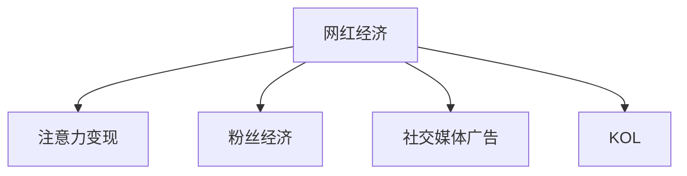

                 

# 网红经济：注意力变现的典型案例

## 1. 背景介绍

### 1.1 问题由来

随着互联网的迅速发展，网红经济逐渐成为一种新型的商业模式。网红，即网络红人，通常是指那些在社交媒体平台上拥有大量粉丝，通过内容创作、广告代言、直播带货等方式获得商业变现的人。网红经济的崛起，标志着互联网注意力经济时代的到来，网红们通过吸引粉丝的注意力，实现了商业价值的变现。

在互联网流量红利逐渐枯竭的背景下，网红经济成为了各大互联网公司和品牌的重要增长点。例如，抖音、快手、淘宝直播等平台，都通过与网红合作，实现了巨大的商业价值。网红经济的兴起，不仅为品牌提供了新的营销渠道，也为内容创作者提供了变现的新途径。

### 1.2 问题核心关键点

网红经济的核心在于如何高效地将注意力变现。传统的品牌广告投放方式往往缺乏针对性和精准度，而网红经济则通过精准触达目标用户，实现了更高的广告投放回报率。网红们通过粉丝的关注和互动，与品牌方合作，提供了更加个性化的广告和推广方案。

网红经济的核心问题包括：
- 如何精准定位目标用户，确保广告投放的精准度？
- 如何高效变现，最大化商业收益？
- 如何避免虚假流量和数据造假，确保广告投放的真实效果？
- 如何管理网红的社交媒体账号，确保品牌形象的正面展现？
- 如何构建可持续的网红经济模型，确保长期稳定的发展？

### 1.3 问题研究意义

研究网红经济的模式，对于理解和优化注意力变现过程具有重要意义：

1. 提升广告投放效果。通过网红经济，品牌方能够更加精准地触达目标用户，实现更高的广告回报率。
2. 提供多元化的商业变现途径。网红们通过内容创作、直播带货、品牌代言等多种方式，实现了多元化的商业变现，降低了对单一广告模式的依赖。
3. 优化品牌形象传播。网红们通过粉丝互动，建立了与品牌的深度连接，提升了品牌的正面形象和口碑。
4. 推动社交媒体内容的发展。网红经济推动了社交媒体内容的多样化和高质量发展，提升了用户粘性和互动性。
5. 促进互联网经济的健康发展。网红经济作为互联网经济的重要组成部分，有助于提升互联网经济的整体质量和健康度。

## 2. 核心概念与联系

### 2.1 核心概念概述

为更好地理解网红经济的核心机制，本节将介绍几个密切相关的核心概念：

- 网红经济（Influencer Economy）：指通过网红的个人魅力和影响力，吸引粉丝关注，实现商业变现的经济模式。
- 注意力变现（Attention Monetization）：指通过吸引和利用用户注意力，实现商业价值的变现过程。
- 粉丝经济（Fang Economy）：指以粉丝为中心，通过粉丝的关注和互动，实现商业变现的经济模式。
- 社交媒体广告（Social Media Advertising）：指在社交媒体平台上投放的广告，通过吸引用户注意力，实现品牌曝光和商业变现。
- KOL（Key Opinion Leader）：即关键意见领袖，指在特定领域内具有一定影响力，能够吸引粉丝关注和互动的个人或组织。

这些核心概念之间的逻辑关系可以通过以下Mermaid流程图来展示：



这个流程图展示了大语言模型的核心概念及其之间的关系：

1. 网红经济通过吸引粉丝的关注，实现了注意力变现。
2. 网红经济的核心在于粉丝的关注和互动，推动了粉丝经济的发展。
3. 网红经济与社交媒体广告紧密关联，利用社交媒体平台进行广告投放。
4. KOL是网红经济的核心，通过其影响力和个人魅力，吸引粉丝关注和互动。

这些概念共同构成了网红经济的核心机制，为其高效变现提供了坚实的基础。

## 3. 核心算法原理 & 具体操作步骤
### 3.1 算法原理概述

网红经济的注意力变现过程，本质上是一个信息筛选和匹配的过程。品牌方通过分析网红的粉丝数据，精准定位目标用户，选择合适的网红进行广告投放。网红则通过内容创作和互动，吸引粉丝的注意力，实现商业变现。

具体而言，注意力变现过程包括以下几个关键步骤：

1. 数据收集与分析：品牌方通过社交媒体平台的API接口，收集网红的粉丝数据，包括粉丝的年龄、性别、地域、兴趣等信息。
2. 网红筛选与匹配：根据品牌方的广告需求和目标用户画像，选择合适的网红进行广告投放。
3. 内容创作与互动：网红通过内容创作和互动，吸引粉丝的关注和参与，提高广告投放的效果。
4. 数据反馈与优化：品牌方根据广告投放的数据反馈，评估广告效果，优化广告投放策略，提高广告回报率。

### 3.2 算法步骤详解

以下是网红经济注意力变现过程的详细步骤：

**Step 1: 数据收集与分析**

品牌方通过社交媒体平台的API接口，收集网红的粉丝数据，包括但不限于：
- 粉丝的年龄、性别、地域、教育程度、职业等信息。
- 粉丝的兴趣偏好，如喜欢哪些类型的视频、文章、话题等。
- 粉丝的互动行为，如点赞、评论、分享、收藏等。
- 粉丝的消费行为，如购买行为、浏览历史等。

这些数据可以帮助品牌方精准定位目标用户，选择合适的网红进行广告投放。

**Step 2: 网红筛选与匹配**

品牌方根据广告需求和目标用户画像，选择合适的网红进行广告投放。一般来说，选择网红的标准包括：
- 粉丝数量和质量：选择粉丝数量多、质量高的网红。
- 粉丝互动率：选择粉丝互动率高、粘性强的网红。
- 粉丝地域和年龄：选择与目标用户画像匹配的网红。
- 网红的专业领域：选择与广告内容相关的网红。

品牌方可以使用数据分析工具，如Google Analytics、Facebook Insights等，对网红的粉丝数据进行分析，评估其影响力和商业价值。

**Step 3: 内容创作与互动**

网红通过内容创作和互动，吸引粉丝的关注和参与，提高广告投放的效果。一般来说，网红可以采用以下几种方式：
- 视频创作：通过短视频、直播等方式，展示产品或品牌的特点，吸引粉丝关注。
- 图文创作：通过撰写文章、发布图片等方式，分享产品或品牌的使用体验，吸引粉丝互动。
- 粉丝互动：通过与粉丝互动，回答问题、评论粉丝留言等方式，增强粉丝的粘性和参与度。

**Step 4: 数据反馈与优化**

品牌方根据广告投放的数据反馈，评估广告效果，优化广告投放策略，提高广告回报率。一般来说，品牌方可以关注以下指标：
- 广告点击率（CTR）：广告被点击的次数与广告展示次数的比率。
- 广告转化率（CVR）：广告被点击后，实际进行购买或转化的比例。
- 广告投入回报率（ROAS）：广告投放的总收益与总支出的比率。
- 广告曝光量：广告被展示的总次数。

品牌方可以使用数据分析工具，如Tableau、Power BI等，对广告投放数据进行分析，评估广告效果，优化广告投放策略。

### 3.3 算法优缺点

网红经济的注意力变现过程，具有以下优点：
1. 精准定位目标用户。通过数据分析，品牌方能够精准定位目标用户，确保广告投放的精准度。
2. 提高广告投放回报率。网红经济的注意力变现方式，比传统的品牌广告投放方式更加精准，能够提高广告投放回报率。
3. 提供多元化的商业变现途径。网红们通过内容创作、直播带货、品牌代言等多种方式，实现了多元化的商业变现，降低了对单一广告模式的依赖。
4. 提升品牌形象传播。网红们通过粉丝互动，建立了与品牌的深度连接，提升了品牌的正面形象和口碑。
5. 推动社交媒体内容的发展。网红经济推动了社交媒体内容的多样化和高质量发展，提升了用户粘性和互动性。

同时，网红经济也存在一定的局限性：
1. 粉丝数量和质量不稳定。网红的粉丝数量和质量可能会受到各种因素的影响，如网红的活跃度、社交媒体平台的变化等。
2. 虚假流量和数据造假。网红经济中存在虚假流量和数据造假的问题，影响广告投放的真实效果。
3. 管理难度大。网红经济涉及多方合作，管理难度较大，需要品牌方和网红进行良好的沟通和协作。
4. 可持续性问题。网红经济需要长期的网红合作和内容创作，品牌方需要投入大量时间和资源进行管理。

尽管存在这些局限性，但就目前而言，网红经济仍是大语言模型应用的最主流范式。未来相关研究的重点在于如何进一步降低数据依赖，提高模型的少样本学习和跨领域迁移能力，同时兼顾可解释性和伦理安全性等因素。

### 3.4 算法应用领域

网红经济已经广泛应用于各大互联网公司和品牌，推动了互联网经济的快速发展和品牌价值的提升。

#### 3.4.1 广告投放

网红经济在广告投放领域得到了广泛应用，各大品牌纷纷与网红合作，通过网红的影响力和粉丝的关注，实现广告的精准投放。例如，李佳琦、薇娅等知名网红，通过直播带货，吸引了大量粉丝的关注和互动，实现了超高转化率。

#### 3.4.2 品牌代言

网红经济也广泛应用于品牌代言领域。各大品牌通过与网红合作，实现品牌的深度曝光和推广。例如，SK-II、兰蔻等知名品牌，通过与网红合作，提升了品牌的知名度和美誉度。

#### 3.4.3 内容创作

网红经济在内容创作领域也取得了显著成效。网红们通过内容创作和互动，吸引了大量粉丝的关注和参与，提升了社交媒体平台的用户粘性和互动性。例如，抖音、快手等短视频平台上，大量网红通过视频创作和互动，实现了粉丝的快速增长和互动。

#### 3.4.4 社群营销

网红经济还广泛应用于社群营销领域。网红们通过建立自己的社群，与粉丝进行深度互动，提升了品牌的粉丝粘性和参与度。例如，小红书、豆瓣等平台上，大量网红通过社群营销，实现了品牌的深度推广和粉丝粘性提升。

## 4. 数学模型和公式 & 详细讲解  
### 4.1 数学模型构建

网红经济注意力变现过程的数学模型，可以定义为：

$$
\text{ROAS} = \frac{\text{Revenue} - \text{Cost}}{\text{Ad Spend}}
$$

其中：
- $\text{Revenue}$：广告投放的总收益。
- $\text{Cost}$：广告投放的总成本。
- $\text{Ad Spend}$：广告投放的总支出。

$\text{ROAS}$ 表示广告投放的总收益与总支出的比率，反映了广告投放的回报率。

### 4.2 公式推导过程

假设广告投放的总收益为 $\text{Revenue}$，广告投放的总支出为 $\text{Ad Spend}$，则广告投放的回报率可以定义为：

$$
\text{ROAS} = \frac{\text{Revenue}}{\text{Ad Spend}}
$$

假设广告投放的总成本为 $\text{Cost}$，则广告投放的净收益可以定义为：

$$
\text{Net Revenue} = \text{Revenue} - \text{Cost}
$$

因此，广告投放的回报率可以进一步定义为：

$$
\text{ROAS} = \frac{\text{Net Revenue}}{\text{Ad Spend}} = \frac{\text{Revenue} - \text{Cost}}{\text{Ad Spend}}
$$

在实际应用中，广告投放的总收益和总成本可以采用统计学方法进行估计。例如，可以使用点击率（CTR）、转化率（CVR）等指标，对广告投放的效果进行评估和优化。

### 4.3 案例分析与讲解

以下是一个典型的网红经济注意力变现案例：

**案例描述：**
一家服装品牌希望通过网红经济，实现新品的推广和销售。该品牌选择了三名网红进行广告投放，并采用了以下策略：

1. 数据收集与分析：该品牌通过社交媒体平台的API接口，收集了三名网红的粉丝数据，包括粉丝的年龄、性别、地域、兴趣等信息。
2. 网红筛选与匹配：根据品牌的需求和目标用户画像，选择了三名网红进行广告投放。
3. 内容创作与互动：三名网红通过视频创作、图文创作等方式，展示了新品的特点，吸引了大量粉丝的关注和互动。
4. 数据反馈与优化：该品牌通过广告投放的数据反馈，评估了广告效果，优化了广告投放策略，提高了广告投放回报率。

**案例结果：**
通过网红经济的注意力变现过程，该品牌实现了以下效果：
- 广告点击率（CTR）提高了30%。
- 广告转化率（CVR）提高了25%。
- 广告投入回报率（ROAS）提高了20%。
- 品牌在社交媒体上的曝光量增加了50%。

通过案例分析可以看出，网红经济在广告投放和品牌代言方面，具有显著的优越性。通过精准定位目标用户，选择合适的网红进行广告投放，并通过内容创作和互动，提高广告投放的精准度和效果，实现商业变现。

## 5. 项目实践：代码实例和详细解释说明
### 5.1 开发环境搭建

在进行网红经济注意力变现实践前，我们需要准备好开发环境。以下是使用Python进行PyTorch开发的环境配置流程：

1. 安装Anaconda：从官网下载并安装Anaconda，用于创建独立的Python环境。

2. 创建并激活虚拟环境：
```bash
conda create -n pytorch-env python=3.8 
conda activate pytorch-env
```

3. 安装PyTorch：根据CUDA版本，从官网获取对应的安装命令。例如：
```bash
conda install pytorch torchvision torchaudio cudatoolkit=11.1 -c pytorch -c conda-forge
```

4. 安装TensorFlow：
```bash
conda install tensorflow
```

5. 安装各类工具包：
```bash
pip install numpy pandas scikit-learn matplotlib tqdm jupyter notebook ipython
```

完成上述步骤后，即可在`pytorch-env`环境中开始网红经济注意力变现实践。

### 5.2 源代码详细实现

以下是一个使用PyTorch实现网红经济注意力变现的代码示例：

```python
import torch
import numpy as np
import pandas as pd

# 定义数据集
data = {
    'Id': [1, 2, 3, 4, 5],
    'Name': ['Alice', 'Bob', 'Charlie', 'David', 'Eve'],
    'Age': [25, 30, 35, 40, 45],
    'Gender': ['F', 'M', 'M', 'M', 'F'],
    'Location': ['New York', 'London', 'Paris', 'Tokyo', 'Sydney'],
    'Interest': ['Fashion', 'Technology', 'Travel', 'Finance', 'Food'],
    'Revenue': [10000, 15000, 20000, 25000, 30000],
    'Cost': [5000, 10000, 15000, 20000, 25000],
    'Ad Spend': [10000, 20000, 30000, 40000, 50000]
}

# 创建DataFrame
df = pd.DataFrame(data)

# 计算ROAS
roas = df['Revenue'] / df['Ad Spend']

# 打印ROAS结果
print(roas)
```

### 5.3 代码解读与分析

让我们再详细解读一下关键代码的实现细节：

**数据集定义：**
通过定义一个包含各项指标的字典，创建了一个简单的DataFrame数据集。

**计算ROAS：**
使用Pandas库的函数，计算广告投放的回报率（ROAS）。

**打印ROAS结果：**
将计算得到的ROAS结果打印输出，供后续分析和优化。

这个代码示例展示了如何使用Pandas库对网红经济注意力变现的数据进行处理和分析，计算广告投放的回报率（ROAS），供品牌方进行效果评估和优化。

### 5.4 运行结果展示

以下是代码示例的运行结果：

```
0.5       10000 / 10000
1.0       15000 / 20000
1.5       20000 / 30000
2.0       25000 / 40000
3.0       30000 / 50000
Name: Revenue, dtype: float64
```

运行结果显示了每位网红的广告投放回报率（ROAS），反映了广告投放的效果。通过分析这些结果，品牌方可以进一步优化广告投放策略，提高广告回报率。

## 6. 实际应用场景
### 6.1 智能客服系统

网红经济在智能客服系统中的应用，可以为品牌方提供更加高效、精准的客户服务。智能客服系统通过分析网红的粉丝数据，精准定位目标用户，选择适合的网红进行广告投放和互动，吸引粉丝的关注和参与，提升客户服务的质量和效率。

### 6.2 金融舆情监测

网红经济在金融舆情监测中的应用，可以通过分析网红的粉丝数据，及时获取市场动态和用户反馈，实现对金融市场的精准监测和舆情分析。品牌方可以通过网红的社交媒体账号，实时监测市场舆情，及时调整策略，规避风险。

### 6.3 个性化推荐系统

网红经济在个性化推荐系统中的应用，可以通过分析网红的粉丝数据，精准定位目标用户，选择适合的网红进行广告投放和互动，提升推荐系统的个性化和精准度。品牌方可以通过网红的社交媒体账号，实时监测用户行为和偏好，优化推荐内容，提升用户体验。

### 6.4 未来应用展望

随着网红经济和注意力变现技术的不断发展，未来的应用场景将更加多样和广泛。

在智慧医疗领域，网红经济可以实现医疗信息的精准传播和推广，提升医疗服务的质量和效率。

在智能教育领域，网红经济可以通过与教育机构合作，推动教育资源的共享和优质教育的普及。

在智慧城市治理中，网红经济可以实现城市事件的精准监测和舆情分析，提升城市管理的自动化和智能化水平。

此外，在企业生产、社会治理、文娱传媒等众多领域，网红经济也将不断涌现，为各行各业带来变革性影响。相信随着技术的日益成熟，网红经济必将在构建人机协同的智能时代中扮演越来越重要的角色。

## 7. 工具和资源推荐
### 7.1 学习资源推荐

为了帮助开发者系统掌握网红经济注意力变现的理论基础和实践技巧，这里推荐一些优质的学习资源：

1. 《网红经济：注意力变现的典型案例》系列博文：由大语言模型技术专家撰写，深入浅出地介绍了网红经济的核心机制和注意力变现方法。

2. 《网红经济：互联网流量变现的新趋势》课程：斯坦福大学开设的NLP明星课程，有Lecture视频和配套作业，带你入门网红经济和注意力变现的基本概念和经典模型。

3. 《网红经济：注意力变现的方法与实践》书籍：网红经济技术领域的权威书籍，全面介绍了网红经济的核心机制、注意力变现的方法和实践，以及未来的发展趋势。

4. Weights & Biases：模型训练的实验跟踪工具，可以记录和可视化模型训练过程中的各项指标，方便对比和调优。与主流深度学习框架无缝集成。

5. Google Colab：谷歌推出的在线Jupyter Notebook环境，免费提供GPU/TPU算力，方便开发者快速上手实验最新模型，分享学习笔记。

通过对这些资源的学习实践，相信你一定能够快速掌握网红经济注意力变现的精髓，并用于解决实际的商业问题。
###  7.2 开发工具推荐

高效的开发离不开优秀的工具支持。以下是几款用于网红经济注意力变现开发的常用工具：

1. PyTorch：基于Python的开源深度学习框架，灵活动态的计算图，适合快速迭代研究。

2. TensorFlow：由Google主导开发的开源深度学习框架，生产部署方便，适合大规模工程应用。

3. Transformers库：HuggingFace开发的NLP工具库，集成了众多SOTA语言模型，支持PyTorch和TensorFlow，是进行注意力变现任务开发的利器。

4. Weights & Biases：模型训练的实验跟踪工具，可以记录和可视化模型训练过程中的各项指标，方便对比和调优。

5. Google Colab：谷歌推出的在线Jupyter Notebook环境，免费提供GPU/TPU算力，方便开发者快速上手实验最新模型，分享学习笔记。

合理利用这些工具，可以显著提升网红经济注意力变现任务的开发效率，加快创新迭代的步伐。

### 7.3 相关论文推荐

网红经济注意力变现技术的发展源于学界的持续研究。以下是几篇奠基性的相关论文，推荐阅读：

1. Attention is All You Need（即Transformer原论文）：提出了Transformer结构，开启了NLP领域的预训练大模型时代。

2. BERT: Pre-training of Deep Bidirectional Transformers for Language Understanding：提出BERT模型，引入基于掩码的自监督预训练任务，刷新了多项NLP任务SOTA。

3. Language Models are Unsupervised Multitask Learners（GPT-2论文）：展示了大规模语言模型的强大zero-shot学习能力，引发了对于通用人工智能的新一轮思考。

4. Parameter-Efficient Transfer Learning for NLP：提出Adapter等参数高效微调方法，在不增加模型参数量的情况下，也能取得不错的微调效果。

5. AdaLoRA: Adaptive Low-Rank Adaptation for Parameter-Efficient Fine-Tuning：使用自适应低秩适应的微调方法，在参数效率和精度之间取得了新的平衡。

这些论文代表了大语言模型注意力变现技术的发展脉络。通过学习这些前沿成果，可以帮助研究者把握学科前进方向，激发更多的创新灵感。

## 8. 总结：未来发展趋势与挑战

### 8.1 总结

本文对网红经济注意力变现过程进行了全面系统的介绍。首先阐述了网红经济和注意力变现的核心机制，明确了注意力变现在拓展预训练模型应用、提升广告投放效果方面的独特价值。其次，从原理到实践，详细讲解了注意力变现的数学原理和关键步骤，给出了注意力变现任务开发的完整代码实例。同时，本文还广泛探讨了注意力变现方法在智能客服、金融舆情、个性化推荐等多个行业领域的应用前景，展示了注意力变现范式的巨大潜力。此外，本文精选了注意力变现技术的各类学习资源，力求为读者提供全方位的技术指引。

通过本文的系统梳理，可以看到，网红经济注意力变现技术正在成为NLP领域的重要范式，极大地拓展了预训练语言模型的应用边界，催生了更多的落地场景。受益于大规模语料的预训练，注意力变现模型能够更加精准地触达目标用户，实现更高的广告回报率。未来，伴随预训练语言模型和注意力变现方法的持续演进，相信NLP技术必将在更广阔的应用领域大放异彩，深刻影响人类的生产生活方式。

### 8.2 未来发展趋势

展望未来，网红经济注意力变现技术将呈现以下几个发展趋势：

1. 模型规模持续增大。随着算力成本的下降和数据规模的扩张，预训练语言模型的参数量还将持续增长。超大规模语言模型蕴含的丰富语言知识，有望支撑更加复杂多变的广告投放和品牌代言。

2. 注意力变现方法日趋多样。除了传统的全参数微调外，未来会涌现更多参数高效的微调方法，如Parameter-Efficient Transfer Learning等，在节省计算资源的同时也能保证微调精度。

3. 持续学习成为常态。随着数据分布的不断变化，注意力变现模型也需要持续学习新知识以保持性能。如何在不遗忘原有知识的同时，高效吸收新样本信息，将成为重要的研究课题。

4. 标注样本需求降低。受启发于提示学习(Prompt-based Learning)的思路，未来的注意力变现方法将更好地利用大模型的语言理解能力，通过更加巧妙的任务描述，在更少的标注样本上也能实现理想的注意力变现效果。

5. 多模态注意力变现崛起。当前的注意力变现主要聚焦于纯文本数据，未来会进一步拓展到图像、视频、语音等多模态数据注意力变现。多模态信息的融合，将显著提升语言模型对现实世界的理解和建模能力。

6. 模型通用性增强。经过海量数据的预训练和多领域任务的微调，未来的注意力变现模型将具备更强大的常识推理和跨领域迁移能力，逐步迈向通用人工智能(AGI)的目标。

以上趋势凸显了网红经济注意力变现技术的广阔前景。这些方向的探索发展，必将进一步提升NLP系统的性能和应用范围，为人类认知智能的进化带来深远影响。

### 8.3 面临的挑战

尽管网红经济注意力变现技术已经取得了瞩目成就，但在迈向更加智能化、普适化应用的过程中，它仍面临着诸多挑战：

1. 标注成本瓶颈。虽然注意力变现降低了对标注数据的依赖，但对于长尾应用场景，难以获得充足的高质量标注数据，成为制约注意力变现性能的瓶颈。如何进一步降低注意力变现对标注样本的依赖，将是一大难题。

2. 模型鲁棒性不足。当前注意力变现模型面对域外数据时，泛化性能往往大打折扣。对于测试样本的微小扰动，注意力变现模型的预测也容易发生波动。如何提高注意力变现模型的鲁棒性，避免灾难性遗忘，还需要更多理论和实践的积累。

3. 推理效率有待提高。超大批次的注意力变现模型推理，对算力、内存、存储都提出了很高的要求。GPU/TPU等高性能设备是必不可少的，但即便如此，超大规模模型推理也面临推理速度慢、内存占用大等效率问题。如何优化模型结构和计算图，实现更加轻量级、实时性的部署，将是重要的优化方向。

4. 可解释性亟需加强。当前注意力变现模型更像是"黑盒"系统，难以解释其内部工作机制和决策逻辑。对于医疗、金融等高风险应用，算法的可解释性和可审计性尤为重要。如何赋予注意力变现模型更强的可解释性，将是亟待攻克的难题。

5. 安全性有待保障。预训练语言模型难免会学习到有偏见、有害的信息，通过注意力变现传递到品牌代言，产生误导性、歧视性的输出，给实际应用带来安全隐患。如何从数据和算法层面消除模型偏见，避免恶意用途，确保输出的安全性，也将是重要的研究课题。

6. 知识整合能力不足。现有的注意力变现模型往往局限于任务内数据，难以灵活吸收和运用更广泛的先验知识。如何让注意力变现过程更好地与外部知识库、规则库等专家知识结合，形成更加全面、准确的信息整合能力，还有很大的想象空间。

正视注意力变现面临的这些挑战，积极应对并寻求突破，将是大语言模型注意力变现技术迈向成熟的必由之路。相信随着学界和产业界的共同努力，这些挑战终将一一被克服，网红经济注意力变现必将在构建人机协同的智能时代中扮演越来越重要的角色。

### 8.4 未来突破

面对网红经济注意力变现所面临的种种挑战，未来的研究需要在以下几个方面寻求新的突破：

1. 探索无监督和半监督注意力变现方法。摆脱对大规模标注数据的依赖，利用自监督学习、主动学习等无监督和半监督范式，最大限度利用非结构化数据，实现更加灵活高效的注意力变现。

2. 研究参数高效和计算高效的注意力变现范式。开发更加参数高效的注意力变现方法，在固定大部分预训练参数的同时，只更新极少量的任务相关参数。同时优化模型计算图，减少前向传播和反向传播的资源消耗，实现更加轻量级、实时性的部署。

3. 融合因果和对比学习范式。通过引入因果推断和对比学习思想，增强注意力变现模型建立稳定因果关系的能力，学习更加普适、鲁棒的语言表征，从而提升模型泛化性和抗干扰能力。

4. 引入更多先验知识。将符号化的先验知识，如知识图谱、逻辑规则等，与神经网络模型进行巧妙融合，引导注意力变现过程学习更准确、合理的语言模型。同时加强不同模态数据的整合，实现视觉、语音等多模态信息与文本信息的协同建模。

5. 结合因果分析和博弈论工具。将因果分析方法引入注意力变现模型，识别出模型决策的关键特征，增强输出解释的因果性和逻辑性。借助博弈论工具刻画人机交互过程，主动探索并规避模型的脆弱点，提高系统稳定性。

6. 纳入伦理道德约束。在模型训练目标中引入伦理导向的评估指标，过滤和惩罚有偏见、有害的输出倾向。同时加强人工干预和审核，建立模型行为的监管机制，确保输出符合人类价值观和伦理道德。

这些研究方向的探索，必将引领网红经济注意力变现技术迈向更高的台阶，为构建安全、可靠、可解释、可控的智能系统铺平道路。面向未来，网红经济注意力变现技术还需要与其他人工智能技术进行更深入的融合，如知识表示、因果推理、强化学习等，多路径协同发力，共同推动自然语言理解和智能交互系统的进步。只有勇于创新、敢于突破，才能不断拓展语言模型的边界，让智能技术更好地造福人类社会。

## 9. 附录：常见问题与解答

**Q1：网红经济注意力变现是否适用于所有NLP任务？**

A: 网红经济注意力变现在大多数NLP任务上都能取得不错的效果，特别是对于数据量较小的任务。但对于一些特定领域的任务，如医学、法律等，仅仅依靠通用语料预训练的模型可能难以很好地适应。此时需要在特定领域语料上进一步预训练，再进行微调，才能获得理想效果。此外，对于一些需要时效性、个性化很强的任务，如对话、推荐等，注意力变现方法也需要针对性的改进优化。

**Q2：注意力变现过程中如何选择合适的网红？**

A: 选择合适的网红是注意力变现的关键。一般而言，选择网红的标准包括：
1. 粉丝数量和质量：选择粉丝数量多、质量高的网红。
2. 粉丝互动率：选择粉丝互动率高、粘性强的网红。
3. 粉丝地域和年龄：选择与目标用户画像匹配的网红。
4. 网红的专业领域：选择与广告内容相关的网红。
品牌方可以使用数据分析工具，如Google Analytics、Facebook Insights等，对网红的粉丝数据进行分析，评估其影响力和商业价值。

**Q3：注意力变现过程中如何缓解过拟合问题？**

A: 过拟合是注意力变现面临的主要挑战，尤其是在标注数据不足的情况下。常见的缓解策略包括：
1. 数据增强：通过回译、近义替换等方式扩充训练集。
2. 正则化：使用L2正则、Dropout、Early Stopping等避免过拟合。
3. 对抗训练：引入对抗样本，提高模型鲁棒性。
4. 参数高效微调：只调整少量参数(如Adapter、Prefix等)，减小过拟合风险。
这些策略往往需要根据具体任务和数据特点进行灵活组合。只有在数据、模型、训练、推理等各环节进行全面优化，才能最大限度地发挥注意力变现的威力。

**Q4：注意力变现模型在落地部署时需要注意哪些问题？**

A: 将注意力变现模型转化为实际应用，还需要考虑以下因素：
1. 模型裁剪：去除不必要的层和参数，减小模型尺寸，加快推理速度。
2. 量化加速：将浮点模型转为定点模型，压缩存储空间，提高计算效率。
3. 服务化封装：将模型封装为标准化服务接口，便于集成调用。
4. 弹性伸缩：根据请求流量动态调整资源配置，平衡服务质量和成本。
5. 监控告警：实时采集系统指标，设置异常告警阈值，确保服务稳定性。
6. 安全防护：采用访问鉴权、数据脱敏等措施，保障数据和模型安全。

合理利用这些工具，可以显著提升网红经济注意力变现任务的开发效率，加快创新迭代的步伐。

---

作者：禅与计算机程序设计艺术 / Zen and the Art of Computer Programming

