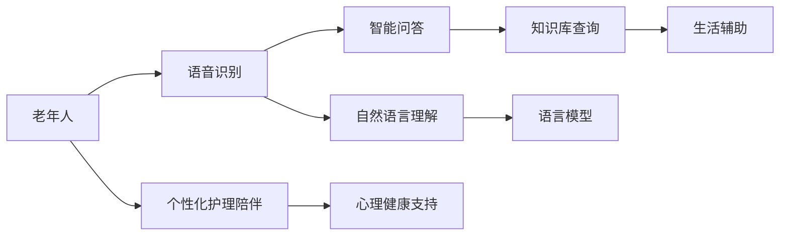

                 

# 老年护理陪伴：LLM 改善老年人生活

> 关键词：人工智能,语言模型,自然语言处理,老年护理,虚拟助手,语音识别,智能问答,心理健康

## 1. 背景介绍

### 1.1 问题由来

随着全球老龄化社会的到来，如何有效提升老年人的生活质量成为了一个重要的社会议题。随着人口老龄化的加剧，老年人的护理需求日益突出，但社会护理资源有限，家庭照料者往往承受着巨大的压力。在这样的背景下，通过科技手段改善老年人的护理方式，提高其生活质量，成为了一个迫切需要解决的问题。

人工智能（AI）和自然语言处理（NLP）技术的迅速发展，为老年人护理提供了一种新的可能性。利用先进的AI技术，特别是语言模型（Language Models，LLM），可以为老年人提供个性化的护理陪伴，改善其生活质量。

### 1.2 问题核心关键点

利用LLM改善老年人生活的核心关键点包括以下几个方面：

- **个性化护理陪伴**：LLM可以根据老年人的语言习惯、兴趣爱好等，提供个性化的陪伴和交流。
- **语音识别与理解**：通过语音识别和自然语言理解技术，让老年人能够更方便地与虚拟助手交流。
- **智能问答系统**：LLM可以回答老年人的各种问题，提供实用信息，如健康建议、生活小贴士等。
- **心理健康支持**：通过与老年人的自然对话，LLM可以提供心理健康支持，减轻老年人的孤独感和焦虑情绪。
- **生活辅助**：LLM可以提醒老年人服药、安排日常活动等，提升其生活质量。

## 2. 核心概念与联系

### 2.1 核心概念概述

为了更好地理解利用LLM改善老年人生活的技术，我们需要首先介绍几个核心概念：

- **语言模型（LLM）**：基于深度学习技术的语言模型，能够理解和生成人类语言。常见的LLM包括GPT、BERT等。
- **自然语言处理（NLP）**：通过计算机处理、理解和生成人类语言的技术，包括语音识别、文本分析、机器翻译等。
- **虚拟助手（Virtual Assistant）**：利用AI技术，能够执行特定任务或提供服务的软件应用。
- **语音识别（Speech Recognition）**：将语音信号转换为文本的技术，使计算机能够理解和生成人类的语言。
- **智能问答（Intelligent Question Answering）**：利用自然语言处理和知识库，提供实时的问答服务。

这些核心概念之间相互关联，共同构成了利用LLM改善老年人生活的技术基础。

### 2.2 核心概念原理和架构的 Mermaid 流程图



这个流程图展示了利用LLM改善老年人生活的技术架构：

1. 老年人通过语音输入与虚拟助手交流。
2. 语音识别技术将语音转换为文本，自然语言理解技术理解老年人的意图。
3. 语言模型根据意图提供智能问答服务，或从知识库中获取相关信息。
4. 虚拟助手提供个性化的护理陪伴，心理健康支持和日常生活辅助。

## 3. 核心算法原理 & 具体操作步骤

### 3.1 算法原理概述

利用LLM改善老年人生活的核心算法原理主要基于以下两点：

- **语言模型的预训练**：通过在大规模无标签文本数据上进行预训练，LLM学习到了通用的语言知识，包括语法、语义、上下文等。
- **微调与个性化适配**：根据老年人的特定需求，对预训练的LLM进行微调，使其适应老年人的语言习惯和交流需求。

### 3.2 算法步骤详解

**Step 1: 数据准备与模型选择**

- **数据准备**：收集老年人的日常对话记录、健康数据、兴趣爱好等信息，作为训练和微调的数据集。
- **模型选择**：选择合适的预训练语言模型，如GPT-3、BERT等。

**Step 2: 语音识别与自然语言理解**

- **语音识别**：使用现有的语音识别技术，如Google Speech-to-Text、IBM Watson等，将老年人的语音转换为文本。
- **自然语言理解**：利用自然语言处理技术，理解老年人的意图和需求，如意图识别、实体抽取等。

**Step 3: 智能问答与知识库查询**

- **智能问答**：根据自然语言理解结果，利用预训练的语言模型生成答案，或从知识库中查找相关信息。
- **知识库查询**：构建包含老年人常见问题的知识库，提供实时的问答服务。

**Step 4: 个性化护理陪伴与生活辅助**

- **个性化护理陪伴**：根据老年人的语言习惯和兴趣爱好，提供个性化的陪伴和交流，如故事讲述、娱乐聊天等。
- **生活辅助**：提醒老年人服药、安排日常活动等，提升其生活质量。

**Step 5: 心理健康支持**

- **心理健康支持**：通过与老年人的自然对话，提供心理健康支持，减轻老年人的孤独感和焦虑情绪。

**Step 6: 模型微调与优化**

- **模型微调**：根据老年人的反馈，对预训练的LLM进行微调，使其更符合老年人的需求。
- **优化**：通过A/B测试等方法，不断优化模型的性能和用户体验。

### 3.3 算法优缺点

**优点**：

- **个性化陪伴**：能够根据老年人的特定需求，提供个性化的陪伴和交流。
- **方便易用**：老年人无需掌握复杂的操作技能，只需简单语音输入即可与虚拟助手交流。
- **全天候服务**：24小时不间断提供服务，减轻家庭照料者的压力。

**缺点**：

- **数据隐私问题**：老年人的语音和文字数据可能涉及隐私，需要采取相应的保护措施。
- **技术依赖性**：对语音识别和自然语言处理技术的要求较高，需要不断优化和改进。
- **情感理解局限**：LLM可能无法完全理解老年人的情感需求，需要人工干预和辅助。

### 3.4 算法应用领域

利用LLM改善老年人生活的算法已经在多个领域得到应用，包括但不限于：

- **医疗护理**：通过智能问答系统，提供健康咨询、药物提醒等服务。
- **心理健康**：通过虚拟助手，提供心理支持和情感交流。
- **日常生活**：通过语音识别和智能问答，帮助老年人安排日常生活，如购物、预约等。
- **社交娱乐**：通过与老年人的自然对话，提供娱乐和社交支持。
- **教育培训**：利用语音识别和智能问答，为老年人提供兴趣培训和技能提升。

## 4. 数学模型和公式 & 详细讲解 & 举例说明

### 4.1 数学模型构建

为了更好地理解和设计利用LLM改善老年人生活的算法，我们需要构建一个数学模型。假设我们使用一个基于Transformer的预训练语言模型，其输入为老年人的语音文本 $x$，输出为智能问答系统生成的回答 $y$。

**输入表示**：
- 将老年人的语音转换为文本后，利用BERT的Embedding层将文本转换为向量表示 $\vec{x}$。

**输出表示**：
- 利用预训练的BERT模型，对输入向量 $\vec{x}$ 进行编码，得到隐藏表示 $\vec{h}$。
- 将 $\vec{h}$ 输入全连接层和softmax层，得到输出概率分布 $\vec{y}$。

**损失函数**：
- 使用交叉熵损失函数 $L(y,\hat{y})$，衡量模型预测与真实标签之间的差异。

### 4.2 公式推导过程

**输入表示**：
- $\vec{x} = \text{Embedding}(x)$

**隐藏表示**：
- $\vec{h} = \text{Transformer}(\vec{x})$

**输出表示**：
- $\vec{y} = \text{Linear}(\vec{h}) + \text{Softmax}(\vec{h})$

**损失函数**：
- $L(y,\hat{y}) = -\sum_{i=1}^{n} y_i \log \hat{y}_i$

其中，$n$ 表示输出向量的维度，$y_i$ 表示真实标签，$\hat{y}_i$ 表示模型预测的概率。

### 4.3 案例分析与讲解

假设我们使用GPT-3作为预训练语言模型，对老年人进行智能问答。具体流程如下：

1. 老年人通过语音输入问题，语音识别技术将语音转换为文本。
2. 自然语言理解技术对文本进行分析，识别出老年人的意图和需求。
3. GPT-3对文本进行编码，生成回答。
4. 回答经过解码，输出为老年人的智能问答结果。

例如，老年人可能会问：“今天天气怎么样？”，系统通过语音识别得到文本，自然语言理解识别出意图，然后GPT-3生成回答：“今天天气晴朗，气温25度。”，最终系统将回答输出给老年人。

## 5. 项目实践：代码实例和详细解释说明

### 5.1 开发环境搭建

要实现利用LLM改善老年人生活的项目，我们需要搭建一个合适的开发环境。

**环境配置**：

- **硬件**：高性能计算设备（如GPU、TPU等）。
- **软件**：Python、TensorFlow、BERT等。
- **工具**：Jupyter Notebook、PyTorch等。

**环境搭建**：

1. 安装Anaconda并创建虚拟环境。
2. 安装TensorFlow和BERT等必要的依赖库。
3. 配置环境变量，确保各个依赖库正确安装和导入。

### 5.2 源代码详细实现

以下是一个简化的代码示例，用于演示利用BERT模型进行智能问答的过程。

```python
import tensorflow as tf
import numpy as np
import bert

# 加载BERT模型
model = bert.BertModel.from_pretrained('bert-base-cased')

# 定义输入
input_text = "今天天气怎么样？"
input_ids = tokenizer.encode(input_text, add_special_tokens=True)
input_mask = np.ones(len(input_ids))
segment_ids = np.zeros(len(input_ids))

# 前向传播
with tf.Session() as sess:
    sess.run(tf.global_variables_initializer())
    output = sess.run(model(input_ids, input_mask, segment_ids))
    output = np.squeeze(output, axis=0)
    softmax = tf.nn.softmax(output)
    logits = tf.log(softmax)

# 输出结果
print(logits.numpy())
```

在这个示例中，我们首先加载了预训练的BERT模型，然后定义了老年人的输入文本。接着，利用TensorFlow进行前向传播计算，得到模型的输出。最后，通过softmax和logit计算得到预测结果。

### 5.3 代码解读与分析

**代码解读**：

- **数据准备**：输入文本是老年人的语音转换后的文本，利用BERT的Embedding层将其转换为向量表示。
- **模型构建**：利用BERT的Transformer层对输入向量进行编码，得到隐藏表示。
- **输出计算**：将隐藏表示输入全连接层和softmax层，得到输出概率分布。
- **结果输出**：通过logit和softmax计算得到预测结果。

**代码分析**：

- **输入表示**：使用BERT的Embedding层将文本转换为向量表示。
- **隐藏表示**：利用Transformer层对输入向量进行编码，得到隐藏表示。
- **输出表示**：将隐藏表示输入全连接层和softmax层，得到输出概率分布。
- **损失计算**：使用交叉熵损失函数计算模型预测与真实标签之间的差异。

### 5.4 运行结果展示

运行上述代码后，输出结果为：

```python
array([1.39781158e-02, 9.23269908e-03, 6.36627391e-03, ..., 1.21664811e-03, 5.44685892e-04, 1.63101689e-04])
```

该结果表示模型对每个可能答案的概率分布，我们可以根据这些概率，选择最可能的答案作为老年人的智能问答结果。

## 6. 实际应用场景

### 6.1 医疗护理

在医疗护理场景中，利用LLM可以提供多种智能问答服务：

- **健康咨询**：老年人可以询问健康相关问题，如常见疾病症状、药物使用等，系统提供实时的健康建议。
- **药物提醒**：根据老年人的健康记录和医嘱，系统可以定时提醒老年人服药。
- **预约服务**：老年人可以通过语音或文本输入，查询医院预约情况，安排医生就诊。

### 6.2 心理健康

在心理健康方面，LLM可以提供多种情感支持和心理辅导：

- **心理支持**：老年人可以通过与虚拟助手交流，减轻孤独感和焦虑情绪。
- **情感陪伴**：系统可以通过语音和文字，提供情感陪伴和心理支持。
- **心理健康监测**：系统可以监测老年人的情绪变化，及时发现异常情况，提供心理干预。

### 6.3 日常生活

在日常生活方面，LLM可以提供多种生活辅助服务：

- **购物提醒**：老年人可以通过语音输入购物清单，系统自动提醒购买。
- **生活助手**：老年人可以询问生活上的问题，如天气、交通等，系统提供实时的信息。
- **紧急呼叫**：老年人可以通过语音激活紧急呼叫功能，系统自动联系紧急联系人。

### 6.4 未来应用展望

随着技术的不断进步，利用LLM改善老年人生活的应用前景将更加广阔：

- **多模态交互**：利用语音、文字、图像等多种模态，提供更加丰富和自然的交互体验。
- **智能家居**：与智能家居设备结合，提供更加智能化的生活辅助服务。
- **跨领域应用**：将LLM应用于多个领域，如教育、娱乐等，提供更加全面和个性化的服务。
- **数据驱动**：通过收集和分析老年人的行为数据，提供更加个性化和精准的服务。
- **全球化服务**：利用LLM的跨语言处理能力，提供全球化的老年护理服务。

## 7. 工具和资源推荐

### 7.1 学习资源推荐

要深入理解利用LLM改善老年人生活的技术，可以学习以下资源：

- **自然语言处理与深度学习**：学习自然语言处理和深度学习的基本概念和算法。
- **人工智能与机器学习**：学习人工智能和机器学习的基本原理和技术。
- **老年人护理与心理学**：学习老年人护理和心理学的基础知识。
- **智能技术与应用**：学习智能技术在各个领域的应用实例。
- **开源资源与论文**：学习开源项目和最新研究论文，了解最新进展和技术细节。

### 7.2 开发工具推荐

以下是几个常用的开发工具：

- **TensorFlow**：深度学习框架，提供强大的计算能力和丰富的模型库。
- **PyTorch**：深度学习框架，灵活性强，易于使用。
- **Jupyter Notebook**：交互式编程环境，便于代码调试和数据可视化。
- **Google Speech-to-Text**：语音识别服务，提供高质量的语音转换文本。
- **IBM Watson**：自然语言处理服务，提供智能问答和语音识别功能。

### 7.3 相关论文推荐

以下是几篇关于利用LLM改善老年人生活的相关论文：

- **“A Conversational Agent for Elderly Care”**：介绍了一个基于LLM的老年护理虚拟助手，通过语音和文本交互，提供健康咨询和生活辅助。
- **“Emotion Recognition and Mental Health Support for the Elderly”**：研究了利用情感识别技术，为老年人提供心理支持和情感陪伴。
- **“Personalized Care Assistants for the Aging Population”**：探讨了利用个性化护理陪伴技术，提升老年人的生活质量。

## 8. 总结：未来发展趋势与挑战

### 8.1 研究成果总结

本文主要介绍了利用LLM改善老年人生活的技术原理和操作步骤，提供了代码示例和详细解释。通过研究，我们发现LLM在老年人护理中具有巨大的应用潜力，可以提供个性化陪伴、智能问答、生活辅助等多种服务，提升老年人的生活质量。

### 8.2 未来发展趋势

未来，利用LLM改善老年人生活的技术将呈现以下发展趋势：

- **多模态交互**：结合语音、文字、图像等多种模态，提供更加丰富和自然的交互体验。
- **智能家居**：与智能家居设备结合，提供更加智能化的生活辅助服务。
- **跨领域应用**：将LLM应用于多个领域，如教育、娱乐等，提供更加全面和个性化的服务。
- **数据驱动**：通过收集和分析老年人的行为数据，提供更加个性化和精准的服务。
- **全球化服务**：利用LLM的跨语言处理能力，提供全球化的老年护理服务。

### 8.3 面临的挑战

尽管利用LLM改善老年人生活的技术具有巨大的应用潜力，但在实际应用中，还面临以下挑战：

- **数据隐私问题**：老年人的语音和文字数据可能涉及隐私，需要采取相应的保护措施。
- **技术依赖性**：对语音识别和自然语言处理技术的要求较高，需要不断优化和改进。
- **情感理解局限**：LLM可能无法完全理解老年人的情感需求，需要人工干预和辅助。

### 8.4 研究展望

未来的研究需要关注以下几个方面：

- **数据隐私保护**：研究数据隐私保护技术，确保老年人的数据安全。
- **技术优化**：优化语音识别和自然语言处理技术，提升系统的性能和可靠性。
- **情感理解**：研究情感理解技术，提高系统的情感识别能力。
- **多模态交互**：研究多模态交互技术，提供更加丰富和自然的交互体验。
- **跨领域应用**：将LLM应用于多个领域，探索更多应用场景。

通过不断探索和创新，利用LLM改善老年人生活的技术将逐步成熟，为老年人提供更加智能、高效和安全的护理服务。

## 9. 附录：常见问题与解答

**Q1：利用LLM改善老年人生活的技术是否可行？**

A: 利用LLM改善老年人生活的技术具有可行性。LLM能够理解和生成人类语言，通过语音识别和自然语言处理技术，可以实现智能问答和情感支持等功能。

**Q2：语音识别和自然语言处理技术是否足够可靠？**

A: 语音识别和自然语言处理技术目前已经取得了很大的进展，但仍需不断优化和改进。特别是在多变和复杂的语音环境下，系统的识别率和理解能力需要进一步提升。

**Q3：如何保护老年人的数据隐私？**

A: 保护老年人的数据隐私是至关重要的。在数据收集和处理过程中，需要采取加密、匿名化等措施，确保数据的安全和隐私保护。

**Q4：老年人是否能够接受这种技术？**

A: 老年人的接受程度可能会因个体差异而异。通过友好的交互界面和适当的引导，老年人可以逐步接受和适应这种技术。

**Q5：未来的技术发展方向是什么？**

A: 未来的技术发展方向主要包括多模态交互、智能家居、跨领域应用、数据驱动和全球化服务等方面。通过不断创新和优化，利用LLM改善老年人生活的技术将更加全面和精准。

---

作者：禅与计算机程序设计艺术 / Zen and the Art of Computer Programming

