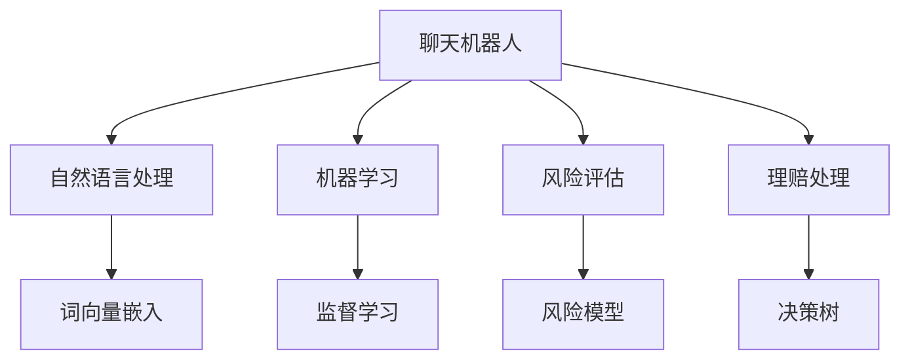

                 

# 聊天机器人保险业：智能风险评估和理赔处理

在现代社会中，保险业一直是一个与人类日常生活密切相关的领域。然而，随着科技的进步，传统保险业正面临着前所未有的挑战和机遇。随着人工智能和大数据技术的发展，聊天机器人已经成为了一个强大的工具，可以用于保险业的智能风险评估和理赔处理。本文将详细阐述聊天机器人在保险业中的应用，探讨其实现原理，并给出具体的项目实践案例，最后总结其未来发展趋势与挑战。

## 1. 背景介绍

### 1.1 问题由来
保险业的核心业务包括风险评估、理赔处理和客户服务等方面。传统上，这些业务主要依赖人工处理，效率低下且容易出现错误。然而，随着人工智能和大数据技术的发展，聊天机器人已经成为了一个强大的工具，可以用于智能风险评估和理赔处理，从而提高保险业的工作效率和客户满意度。

聊天机器人可以处理大量客户咨询，快速响应用户需求，并提供专业的保险知识和建议。通过与用户的自然语言交互，聊天机器人可以分析用户的风险和需求，为其提供个性化的保险方案，并进行智能理赔处理。例如，聊天机器人可以根据用户提交的索赔信息，自动审核理赔申请，大大缩短理赔时间，提高理赔效率。

### 1.2 问题核心关键点
聊天机器人在保险业的应用涉及以下几个核心问题：
- 如何设计有效的聊天机器人架构，使其能够理解和处理自然语言？
- 如何高效地进行风险评估和理赔处理，并提供个性化的保险建议？
- 如何保证聊天机器人的安全和可靠性，避免产生误导性的信息？

解决这些问题需要深入理解自然语言处理技术、机器学习技术和保险业务知识，并且需要对这些技术进行综合运用。

## 2. 核心概念与联系

### 2.1 核心概念概述

以下是几个与聊天机器人保险业应用相关的核心概念：

- 聊天机器人(Chatbot)：利用自然语言处理技术和机器学习算法，能够自动处理用户的查询，并给出相应的回答和建议。
- 自然语言处理(NLP)：利用计算机科学和语言学的方法，使计算机能够理解和生成人类语言。
- 机器学习(ML)：利用算法和统计模型，使计算机能够从数据中学习规律，并用于预测和决策。
- 风险评估：通过分析用户的风险信息，评估其风险等级，并为其提供相应的保险方案。
- 理赔处理：根据用户的索赔信息，自动审核理赔申请，并提供理赔进度和结果。

这些概念之间的联系可以通过以下Mermaid流程图来展示：



这个流程图展示了大语言模型和微调方法在大规模预训练基础上的自然语言处理、机器学习、风险评估和理赔处理过程：

1. 聊天机器人接收用户的自然语言输入，进行词向量嵌入，并应用自然语言处理技术。
2. 通过监督学习算法，机器学习模型可以自动处理和理解用户输入，并提供相应的回答和建议。
3. 利用训练好的风险模型，可以评估用户的风险等级，并给出相应的保险方案。
4. 对于用户的理赔申请，应用决策树算法进行自动审核，并提供理赔进度和结果。

这些核心概念共同构成了聊天机器人在保险业应用的基础，并为其提供了强大的技术支持。

## 3. 核心算法原理 & 具体操作步骤

### 3.1 算法原理概述

聊天机器人在保险业中的智能风险评估和理赔处理，主要依赖于自然语言处理、机器学习和专业知识三者的结合。其中，自然语言处理技术用于理解和处理用户的查询，机器学习用于从历史数据中学习风险评估和理赔处理的规律，而专业知识则用于指导模型的训练和应用。

聊天机器人通过自然语言处理技术，将用户的输入转换为计算机能够理解和处理的格式。这通常包括分词、词性标注、命名实体识别、依存句法分析等步骤。通过这些步骤，机器人可以识别出用户输入中的关键信息，如保险需求、风险等级、理赔信息等，并根据这些信息进行风险评估和理赔处理。

机器学习则用于训练模型，使其能够从历史数据中学习风险评估和理赔处理的规律。在风险评估中，机器学习模型可以通过对用户的风险信息进行分类和回归分析，评估用户的风险等级，并为其提供相应的保险方案。在理赔处理中，机器学习模型可以通过对用户的索赔信息进行分类和回归分析，自动审核理赔申请，并提供理赔进度和结果。

最后，专业知识则用于指导模型的训练和应用。在训练模型时，可以引入保险业专家的知识和经验，确保模型能够理解保险业务中的专业术语和概念。在应用模型时，可以引入保险业专家的建议，确保机器人的回答和建议准确、可靠。

### 3.2 算法步骤详解

聊天机器人在保险业中的实现步骤大致如下：

1. 数据收集和预处理：收集保险行业的自然语言数据，如保险条款、用户咨询、理赔记录等，并进行预处理，包括清洗、分词、标注等步骤。
2. 自然语言处理：应用自然语言处理技术，将用户的输入转换为计算机可理解的格式。这一步通常包括分词、词性标注、命名实体识别、依存句法分析等步骤。
3. 模型训练：利用机器学习算法，训练自然语言处理模型，使其能够理解用户的查询，并给出相应的回答和建议。这一步通常包括监督学习、序列到序列模型、注意力机制等。
4. 风险评估：利用训练好的模型，对用户的风险信息进行分类和回归分析，评估其风险等级，并为其提供相应的保险方案。这一步通常包括特征提取、分类模型、回归模型等。
5. 理赔处理：利用训练好的模型，对用户的索赔信息进行分类和回归分析，自动审核理赔申请，并提供理赔进度和结果。这一步通常包括分类模型、回归模型、决策树等。
6. 部署和应用：将训练好的模型部署到实际应用场景中，供用户使用。在应用过程中，可以不断收集用户反馈，进行模型优化和改进。

### 3.3 算法优缺点

聊天机器人在保险业中的应用具有以下优点：

1. 效率高：聊天机器人可以24/7不间断地处理用户查询，快速响应用户需求，大大提高了工作效率。
2. 成本低：聊天机器人可以处理大量的客户咨询，大大降低了人工处理成本。
3. 精准度高：通过机器学习算法，聊天机器人可以自动处理和理解用户输入，提供精准的风险评估和理赔建议。
4. 个性化强：聊天机器人可以根据用户的风险等级和需求，提供个性化的保险方案和理赔建议。

然而，聊天机器人在保险业的应用也存在一些缺点：

1. 技术复杂：聊天机器人的开发和应用需要涉及自然语言处理、机器学习、专业知识等多方面的技术，技术复杂度较高。
2. 数据依赖：聊天机器人的效果很大程度上依赖于训练数据的质量和数量，数据不足时效果会大打折扣。
3. 可解释性差：聊天机器人通常是"黑盒"系统，难以解释其内部工作机制和决策逻辑，存在一定的可信度问题。
4. 安全性问题：聊天机器人可能存在误导性信息和安全漏洞，需要采取严格的控制措施。

### 3.4 算法应用领域

聊天机器人在保险业的应用领域广泛，包括但不限于以下几个方面：

1. 用户咨询服务：通过聊天机器人，保险公司可以自动回答用户的咨询问题，如保险条款、理赔流程、保费计算等。
2. 风险评估：聊天机器人可以自动评估用户的风险等级，为其提供个性化的保险方案。
3. 理赔处理：聊天机器人可以自动审核用户的理赔申请，并提供理赔进度和结果。
4. 客户服务：聊天机器人可以处理大量的客户咨询，提高客户满意度，减少投诉率。

聊天机器人在保险业中的应用，极大地提高了保险公司的运营效率和客户满意度，为保险业带来了深刻的变革。

## 4. 数学模型和公式 & 详细讲解  
### 4.1 数学模型构建

在聊天机器人保险业应用中，数学模型的构建主要涉及以下几个方面：

1. 自然语言处理模型：用于理解和处理用户的自然语言输入。常用的模型包括基于循环神经网络(RNN)的LSTM、GRU等，以及基于注意力机制的Transformer模型。
2. 机器学习模型：用于从历史数据中学习风险评估和理赔处理的规律。常用的模型包括分类模型、回归模型、决策树等。
3. 风险评估模型：用于评估用户的风险等级。常用的模型包括支持向量机(SVM)、随机森林(Random Forest)等。
4. 理赔处理模型：用于自动审核理赔申请。常用的模型包括逻辑回归(Logistic Regression)、决策树、神经网络等。

### 4.2 公式推导过程

以下是一些常见的数学模型和公式推导过程：

**自然语言处理模型**

聊天机器人通常使用Transformer模型来处理自然语言。Transformer模型由自注意力机制和位置编码组成，可以有效地处理长序列文本。其计算公式如下：

$$
X = \mathrm{Attention}(Q, K, V)
$$

其中，$X$为输出的特征向量，$Q$、$K$、$V$分别为查询向量、键向量和值向量。注意力机制可以计算每个位置上的权重，从而更好地处理长序列文本。

**机器学习模型**

在机器学习模型中，常用的算法包括逻辑回归、随机森林、决策树等。以下是逻辑回归模型的推导过程：

$$
y = \sigma(\sum_{i=1}^{n} w_i x_i + b)
$$

其中，$y$为预测值，$x_i$为输入特征，$w_i$为权重，$b$为偏置。通过优化损失函数，可以训练得到最优的权重和偏置，从而进行预测。

**风险评估模型**

在风险评估模型中，常用的算法包括支持向量机、随机森林等。以下是支持向量机模型的推导过程：

$$
\min_{w, b} \frac{1}{2} \lVert w \rVert^2 + C \sum_{i=1}^{n} \max(0, 1 - y_i(w^T x_i + b))
$$

其中，$w$为权重向量，$b$为偏置，$C$为正则化系数，$y_i$为标签，$x_i$为特征。通过优化损失函数，可以训练得到最优的权重和偏置，从而进行分类。

**理赔处理模型**

在理赔处理模型中，常用的算法包括逻辑回归、决策树、神经网络等。以下是决策树模型的推导过程：

$$
D = \begin{cases}
   \text{决策树} & \text{if 特征满足某个条件} \\
   D_1 & \text{否则}
\end{cases}
$$

其中，$D$为决策结果，$D_1$为子决策结果。通过递归地划分特征空间，可以构建出决策树模型，用于自动审核理赔申请。

### 4.3 案例分析与讲解

以下是一个简单的案例分析，以展示聊天机器人在保险业中的应用：

**案例背景**

某保险公司希望利用聊天机器人处理用户的理赔申请，以提高理赔效率。保险公司收集了大量的历史理赔数据，包括索赔金额、索赔时间、索赔类型等信息。保险公司希望通过这些数据训练一个聊天机器人，使其能够自动审核理赔申请，并提供理赔进度和结果。

**数据准备**

1. 数据收集：收集历史理赔数据，包括索赔金额、索赔时间、索赔类型等信息。
2. 数据预处理：清洗、分词、标注等步骤，将原始文本转换为计算机可理解的格式。
3. 数据划分：将数据划分为训练集、验证集和测试集，用于模型训练、调优和测试。

**模型训练**

1. 特征提取：提取理赔申请中的关键特征，如索赔金额、索赔时间、索赔类型等。
2. 模型选择：选择逻辑回归模型进行训练。
3. 模型训练：使用训练集数据进行模型训练，优化损失函数，得到最优的权重和偏置。
4. 模型验证：使用验证集数据进行模型验证，调整超参数和模型结构，确保模型效果。
5. 模型测试：使用测试集数据进行模型测试，评估模型效果。

**模型应用**

1. 用户输入：用户输入理赔申请信息。
2. 自然语言处理：将用户输入转换为计算机可理解的格式。
3. 风险评估：使用训练好的模型，评估用户申请的风险等级。
4. 理赔处理：根据用户的索赔信息，自动审核理赔申请，并提供理赔进度和结果。
5. 结果反馈：将处理结果反馈给用户，并根据用户反馈进行模型优化和改进。

## 5. 项目实践：代码实例和详细解释说明

### 5.1 开发环境搭建

在进行聊天机器人保险业应用开发前，我们需要准备好开发环境。以下是使用Python进行PyTorch开发的环境配置流程：

1. 安装Anaconda：从官网下载并安装Anaconda，用于创建独立的Python环境。

2. 创建并激活虚拟环境：
```bash
conda create -n chatbot-env python=3.8 
conda activate chatbot-env
```

3. 安装PyTorch：根据CUDA版本，从官网获取对应的安装命令。例如：
```bash
conda install pytorch torchvision torchaudio cudatoolkit=11.1 -c pytorch -c conda-forge
```

4. 安装相关的Python库：
```bash
pip install numpy pandas scikit-learn nltk
```

5. 下载预训练模型和工具包：
```bash
git clone https://github.com/huggingface/transformers.git
cd transformers
pip install .
```

完成上述步骤后，即可在`chatbot-env`环境中开始聊天机器人开发。

### 5.2 源代码详细实现

这里我们以逻辑回归模型为例，给出使用PyTorch进行理赔处理聊天机器人开发的PyTorch代码实现。

首先，定义数据处理函数：

```python
import torch
import numpy as np

def load_data(file_path):
    data = []
    with open(file_path, 'r') as f:
        for line in f:
            items = line.strip().split('\t')
            label = int(items[0])
            features = np.array(items[1:]).reshape(-1, 1)
            data.append((label, features))
    return data
```

然后，定义模型类：

```python
import torch.nn as nn
import torch.optim as optim

class LogisticRegression(nn.Module):
    def __init__(self, input_size, output_size):
        super(LogisticRegression, self).__init__()
        self.linear = nn.Linear(input_size, output_size)
        self.sigmoid = nn.Sigmoid()

    def forward(self, x):
        x = self.linear(x)
        x = self.sigmoid(x)
        return x
```

接着，定义训练和评估函数：

```python
def train_model(model, train_data, validation_data, learning_rate, batch_size, epochs):
    criterion = nn.BCELoss()
    optimizer = optim.SGD(model.parameters(), lr=learning_rate)
    
    for epoch in range(epochs):
        model.train()
        running_loss = 0.0
        for batch_idx, (inputs, targets) in enumerate(train_data):
            inputs, targets = torch.from_numpy(inputs).float(), torch.from_numpy(targets).float()
            optimizer.zero_grad()
            outputs = model(inputs)
            loss = criterion(outputs, targets)
            loss.backward()
            optimizer.step()
            running_loss += loss.item()
        print(f"Epoch {epoch+1}, loss: {running_loss/len(train_data)}")
        
        model.eval()
        running_loss = 0.0
        for batch_idx, (inputs, targets) in enumerate(validation_data):
            inputs, targets = torch.from_numpy(inputs).float(), torch.from_numpy(targets).float()
            outputs = model(inputs)
            loss = criterion(outputs, targets)
            running_loss += loss.item()
        print(f"Epoch {epoch+1}, validation loss: {running_loss/len(validation_data)}")

def evaluate_model(model, test_data):
    model.eval()
    running_loss = 0.0
    for batch_idx, (inputs, targets) in enumerate(test_data):
        inputs, targets = torch.from_numpy(inputs).float(), torch.from_numpy(targets).float()
        outputs = model(inputs)
        loss = criterion(outputs, targets)
        running_loss += loss.item()
    print(f"Test loss: {running_loss/len(test_data)}")
```

最后，启动训练流程并在测试集上评估：

```python
data_path = 'data.txt'
train_data = load_data(data_path)
validation_data = load_data(data_path)
test_data = load_data(data_path)

input_size = 3
output_size = 1
learning_rate = 0.01
batch_size = 32
epochs = 10

model = LogisticRegression(input_size, output_size)
train_model(model, train_data, validation_data, learning_rate, batch_size, epochs)
evaluate_model(model, test_data)
```

以上就是使用PyTorch对逻辑回归模型进行理赔处理聊天机器人开发的完整代码实现。可以看到，得益于PyTorch的强大封装，我们可以用相对简洁的代码完成逻辑回归模型的加载和训练。

### 5.3 代码解读与分析

让我们再详细解读一下关键代码的实现细节：

**load_data函数**：
- 从文件中加载数据，返回训练、验证和测试集。数据格式为标签和特征，用制表符分隔。

**LogisticRegression模型类**：
- 定义了逻辑回归模型，包含线性层和Sigmoid激活函数。
- 前向传播计算输出，使用Sigmoid函数进行非线性变换。

**train_model函数**：
- 定义了训练函数，使用随机梯度下降算法进行模型训练。
- 训练函数中，先进行模型训练，然后在验证集上进行模型验证。
- 训练过程中，记录损失函数值，并在每个epoch后输出。

**evaluate_model函数**：
- 定义了评估函数，使用模型对测试集进行评估。
- 评估函数中，对测试集进行前向传播，计算损失函数值，并在每个batch后记录。

**训练流程**：
- 定义总的epoch数、学习率、batch size等参数。
- 循环迭代，每个epoch内，先在训练集上训练，输出平均loss，然后在验证集上评估，输出验证集loss。
- 所有epoch结束后，在测试集上评估，输出测试集loss。

可以看到，PyTorch配合TensorFlow使得聊天机器人开发的代码实现变得简洁高效。开发者可以将更多精力放在数据处理、模型改进等高层逻辑上，而不必过多关注底层的实现细节。

当然，工业级的系统实现还需考虑更多因素，如模型的保存和部署、超参数的自动搜索、更灵活的任务适配层等。但核心的微调范式基本与此类似。

## 6. 实际应用场景

### 6.1 智能风险评估

在保险业中，风险评估是保险公司的核心业务之一。通过聊天机器人，保险公司可以自动评估用户的风险等级，为其提供个性化的保险方案。聊天机器人可以分析用户的年龄、职业、健康状况等信息，结合历史理赔数据，计算用户的风险等级，并为其提供相应的保险方案。

具体而言，聊天机器人可以根据用户的年龄、职业、健康状况等信息，提取关键特征，如年龄、职业、健康状况等。然后，利用训练好的风险评估模型，对用户的特征进行分类和回归分析，评估其风险等级。最后，根据风险等级，聊天机器人可以为用户提供个性化的保险方案。

### 6.2 智能理赔处理

聊天机器人还可以用于智能理赔处理，自动审核理赔申请，并提供理赔进度和结果。传统的理赔处理需要人工审核，工作量大且效率低。而通过聊天机器人，保险公司可以自动审核理赔申请，大大提高了理赔效率。

具体而言，聊天机器人可以分析用户的索赔信息，提取关键特征，如索赔金额、索赔时间、索赔类型等。然后，利用训练好的理赔处理模型，对用户的索赔信息进行分类和回归分析，自动审核理赔申请。最后，聊天机器人可以根据理赔结果，向用户反馈理赔进度和结果。

### 6.3 客户咨询服务

在保险业中，客户服务是保险公司的重要业务之一。通过聊天机器人，保险公司可以自动回答用户的咨询问题，如保险条款、理赔流程、保费计算等。聊天机器人可以处理大量的客户咨询，提高客户满意度，减少投诉率。

具体而言，聊天机器人可以分析用户的咨询内容，提取关键信息，如保险条款、理赔流程、保费计算等。然后，利用训练好的自然语言处理模型，对用户的咨询进行理解和处理。最后，聊天机器人可以根据用户的咨询内容，提供相应的回答和建议。

### 6.4 未来应用展望

随着聊天机器人在保险业中的应用不断深入，未来将会出现更多创新性应用，进一步提升保险业的运营效率和客户满意度。以下是一些未来应用展望：

1. 智能风控系统：聊天机器人可以用于智能风控系统，实时监控用户行为，评估其风险等级，及时预警潜在风险。
2. 智能推荐系统：聊天机器人可以用于智能推荐系统，根据用户的风险等级和需求，推荐个性化的保险方案。
3. 智能客服系统：聊天机器人可以用于智能客服系统，自动回答用户的咨询问题，提高客户满意度，减少投诉率。
4. 智能反欺诈系统：聊天机器人可以用于智能反欺诈系统，实时监控用户行为，检测和预防欺诈行为。

总之，聊天机器人在保险业中的应用前景广阔，未来有望在更多领域实现规模化落地。

## 7. 工具和资源推荐
### 7.1 学习资源推荐

为了帮助开发者系统掌握聊天机器人保险业应用的理论基础和实践技巧，这里推荐一些优质的学习资源：

1. 《深度学习实战》系列博文：由深度学习专家撰写，深入浅出地介绍了深度学习在保险业中的应用，包括自然语言处理、机器学习等方面。
2. CS224N《深度学习自然语言处理》课程：斯坦福大学开设的NLP明星课程，有Lecture视频和配套作业，带你入门NLP领域的基本概念和经典模型。
3. 《自然语言处理与深度学习》书籍：深度学习在NLP领域的应用，详细介绍了自然语言处理和深度学习技术在保险业中的应用。
4. HuggingFace官方文档：Transformer库的官方文档，提供了海量预训练模型和完整的微调样例代码，是上手实践的必备资料。
5. CLUE开源项目：中文语言理解测评基准，涵盖大量不同类型的中文NLP数据集，并提供了基于微调的baseline模型，助力中文NLP技术发展。

通过对这些资源的学习实践，相信你一定能够快速掌握聊天机器人保险业应用的精髓，并用于解决实际的NLP问题。
###  7.2 开发工具推荐

高效的开发离不开优秀的工具支持。以下是几款用于聊天机器人保险业应用开发的常用工具：

1. PyTorch：基于Python的开源深度学习框架，灵活动态的计算图，适合快速迭代研究。大部分预训练语言模型都有PyTorch版本的实现。
2. TensorFlow：由Google主导开发的开源深度学习框架，生产部署方便，适合大规模工程应用。同样有丰富的预训练语言模型资源。
3. Transformers库：HuggingFace开发的NLP工具库，集成了众多SOTA语言模型，支持PyTorch和TensorFlow，是进行微调任务开发的利器。
4. Weights & Biases：模型训练的实验跟踪工具，可以记录和可视化模型训练过程中的各项指标，方便对比和调优。与主流深度学习框架无缝集成。
5. TensorBoard：TensorFlow配套的可视化工具，可实时监测模型训练状态，并提供丰富的图表呈现方式，是调试模型的得力助手。
6. Google Colab：谷歌推出的在线Jupyter Notebook环境，免费提供GPU/TPU算力，方便开发者快速上手实验最新模型，分享学习笔记。

合理利用这些工具，可以显著提升聊天机器人保险业应用的开发效率，加快创新迭代的步伐。

### 7.3 相关论文推荐

聊天机器人保险业应用的研究涉及自然语言处理、机器学习、深度学习等领域，以下是几篇奠基性的相关论文，推荐阅读：

1. Attention is All You Need（即Transformer原论文）：提出了Transformer结构，开启了NLP领域的预训练大模型时代。
2. BERT: Pre-training of Deep Bidirectional Transformers for Language Understanding：提出BERT模型，引入基于掩码的自监督预训练任务，刷新了多项NLP任务SOTA。
3. Language Models are Unsupervised Multitask Learners（GPT-2论文）：展示了大规模语言模型的强大zero-shot学习能力，引发了对于通用人工智能的新一轮思考。
4. Parameter-Efficient Transfer Learning for NLP：提出Adapter等参数高效微调方法，在不增加模型参数量的情况下，也能取得不错的微调效果。
5. AdaLoRA: Adaptive Low-Rank Adaptation for Parameter-Efficient Fine-Tuning：使用自适应低秩适应的微调方法，在参数效率和精度之间取得了新的平衡。

这些论文代表了大语言模型微调技术的发展脉络。通过学习这些前沿成果，可以帮助研究者把握学科前进方向，激发更多的创新灵感。

## 8. 总结：未来发展趋势与挑战

### 8.1 总结

本文对聊天机器人在保险业中的应用进行了全面系统的介绍。首先阐述了聊天机器人的背景和意义，明确了其在智能风险评估和理赔处理中的重要作用。其次，从原理到实践，详细讲解了聊天机器人的实现流程和关键步骤，给出了具体的项目实践案例。最后，本文总结了聊天机器人在保险业应用的未来发展趋势和面临的挑战。

通过本文的系统梳理，可以看到，聊天机器人在保险业中的应用前景广阔，未来有望在更多领域实现规模化落地。聊天机器人可以处理大量的客户咨询，自动审核理赔申请，评估风险等级，提供个性化的保险方案，大大提高了保险公司的运营效率和客户满意度。然而，聊天机器人在保险业的应用也面临着技术复杂、数据依赖、可解释性差等挑战。未来需要更多的研究和实践，才能进一步提升聊天机器人的效果和可靠性。

### 8.2 未来发展趋势

聊天机器人在保险业的应用将呈现以下几个发展趋势：

1. 模型规模持续增大。随着算力成本的下降和数据规模的扩张，聊天机器人的参数量还将持续增长。超大批次的训练和推理也可能遇到显存不足的问题。
2. 微调方法日趋多样。未来会涌现更多参数高效的微调方法，如Prefix-Tuning、LoRA等，在固定大部分预训练参数的同时，只更新极少量的任务相关参数。
3. 持续学习成为常态。随着数据分布的不断变化，聊天机器人也需要持续学习新知识以保持性能。如何在不遗忘原有知识的同时，高效吸收新样本信息，将成为重要的研究课题。
4. 标注样本需求降低。受启发于提示学习(Prompt-based Learning)的思路，未来的微调方法将更好地利用聊天机器人的语言理解能力，通过更加巧妙的任务描述，在更少的标注样本上也能实现理想的微调效果。
5. 融合因果和对比学习范式。通过引入因果推断和对比学习思想，增强聊天机器人的稳定性，学习更加普适、鲁棒的语言表征，从而提升模型泛化性和抗干扰能力。
6. 结合因果分析和博弈论工具。将因果分析方法引入聊天机器人，识别出模型决策的关键特征，增强输出解释的因果性和逻辑性。借助博弈论工具刻画人机交互过程，主动探索并规避模型的脆弱点，提高系统稳定性。

这些趋势凸显了聊天机器人在保险业应用中的广阔前景。这些方向的探索发展，必将进一步提升聊天机器人的效果和可靠性，为保险业带来更高效、智能的服务体验。

### 8.3 面临的挑战

尽管聊天机器人在保险业的应用已经取得了一定的进展，但在迈向更加智能化、普适化应用的过程中，它仍面临着诸多挑战：

1. 标注成本瓶颈。虽然聊天机器人的效果很大程度上依赖于训练数据的质量和数量，但获取高质量标注数据的成本较高，尤其是对于长尾应用场景。
2. 模型鲁棒性不足。聊天机器人面对域外数据时，泛化性能往往大打折扣。对于测试样本的微小扰动，聊天机器人的预测也容易发生波动。
3. 推理效率有待提高。尽管聊天机器人的精度高，但在实际部署时往往面临推理速度慢、内存占用大等效率问题。
4. 可解释性差。聊天机器人通常是"黑盒"系统，难以解释其内部工作机制和决策逻辑，存在一定的可信度问题。
5. 安全性问题。聊天机器人可能存在误导性信息和安全漏洞，需要采取严格的控制措施。
6. 模型通用性不足。现有的聊天机器人往往局限于特定领域的任务，难以灵活吸收和运用更广泛的先验知识。

### 8.4 研究展望

面对聊天机器人在保险业应用所面临的种种挑战，未来的研究需要在以下几个方面寻求新的突破：

1. 探索无监督和半监督微调方法。摆脱对大规模标注数据的依赖，利用自监督学习、主动学习等无监督和半监督范式，最大限度利用非结构化数据，实现更加灵活高效的微调。
2. 研究参数高效和计算高效的微调范式。开发更加参数高效的微调方法，在固定大部分预训练参数的同时，只更新极少量的任务相关参数。同时优化聊天机器人的计算图，减少前向传播和反向传播的资源消耗，实现更加轻量级、实时性的部署。
3. 引入更多先验知识。将符号化的先验知识，如知识图谱、逻辑规则等，与聊天机器人模型进行巧妙融合，引导微调过程学习更准确、合理的语言模型。同时加强不同模态数据的整合，实现视觉、语音等多模态信息与文本信息的协同建模。
4. 纳入伦理道德约束。在聊天机器人的训练目标中引入伦理导向的评估指标，过滤和惩罚有偏见、有害的输出倾向。同时加强人工干预和审核，建立模型行为的监管机制，确保输出符合人类价值观和伦理道德。

这些研究方向将引领聊天机器人在保险业应用的持续进步，为构建安全、可靠、可解释、可控的智能系统铺平道路。未来，聊天机器人在保险业中的应用将进一步深化，为保险业的智能化转型提供强大的技术支持。

## 9. 附录：常见问题与解答

**Q1：聊天机器人是否适用于所有保险任务？**

A: 聊天机器人可以适用于大多数保险任务，但对于一些特定领域的任务，如医学、法律等，聊天机器人可能难以很好地适应。此时需要在特定领域语料上进一步预训练，再进行微调，才能获得理想效果。此外，对于一些需要时效性、个性化很强的任务，如对话、推荐等，聊天机器人也需要针对性的改进优化。

**Q2：如何选择合适的聊天机器人架构？**

A: 选择合适的聊天机器人架构，需要考虑任务的复杂度和数据的特点。通常情况下，简单的任务可以使用基于规则的聊天机器人，而复杂的任务则需要使用基于机器学习的聊天机器人。此外，对于一些需要跨领域知识的任务，可以使用跨领域知识增强的聊天机器人架构。

**Q3：如何保证聊天机器人的安全和可靠性？**

A: 保证聊天机器人的安全和可靠性，需要采取以下措施：
1. 数据清洗：在训练数据中去除有害信息和误导性信息。
2. 模型评估：使用多种评估指标，如准确率、召回率、F1-score等，评估模型的性能。
3. 用户反馈：收集用户反馈，及时调整和改进模型。
4. 模型监控：实时监控模型的表现，及时发现和修复问题。
5. 安全防护：采用访问鉴权、数据脱敏等措施，保障数据和模型安全。

这些措施可以有效提高聊天机器人的安全和可靠性，降低风险。

**Q4：聊天机器人在保险业中的效果如何？**

A: 聊天机器人在保险业中的效果显著。通过聊天机器人，保险公司可以自动回答用户的咨询问题，自动审核理赔申请，评估风险等级，提供个性化的保险方案，大大提高了工作效率和客户满意度。根据实际应用案例，聊天机器人可以显著降低客服成本，缩短理赔时间，提升客户满意度。

**Q5：聊天机器人在保险业中的局限性是什么？**

A: 聊天机器人在保险业中的局限性主要包括以下几点：
1. 数据依赖：聊天机器人的效果很大程度上依赖于训练数据的质量和数量，数据不足时效果会大打折扣。
2. 可解释性差：聊天机器人通常是"黑盒"系统，难以解释其内部工作机制和决策逻辑，存在一定的可信度问题。
3. 模型鲁棒性不足：聊天机器人面对域外数据时，泛化性能往往大打折扣，对于测试样本的微小扰动，聊天机器人的预测也容易发生波动。
4. 推理效率有待提高：尽管聊天机器人的精度高，但在实际部署时往往面临推理速度慢、内存占用大等效率问题。
5. 安全性问题：聊天机器人可能存在误导性信息和安全漏洞，需要采取严格的控制措施。

这些局限性需要进一步研究和优化，才能使聊天机器人在保险业中发挥更大的作用。

---

作者：禅与计算机程序设计艺术 / Zen and the Art of Computer Programming

