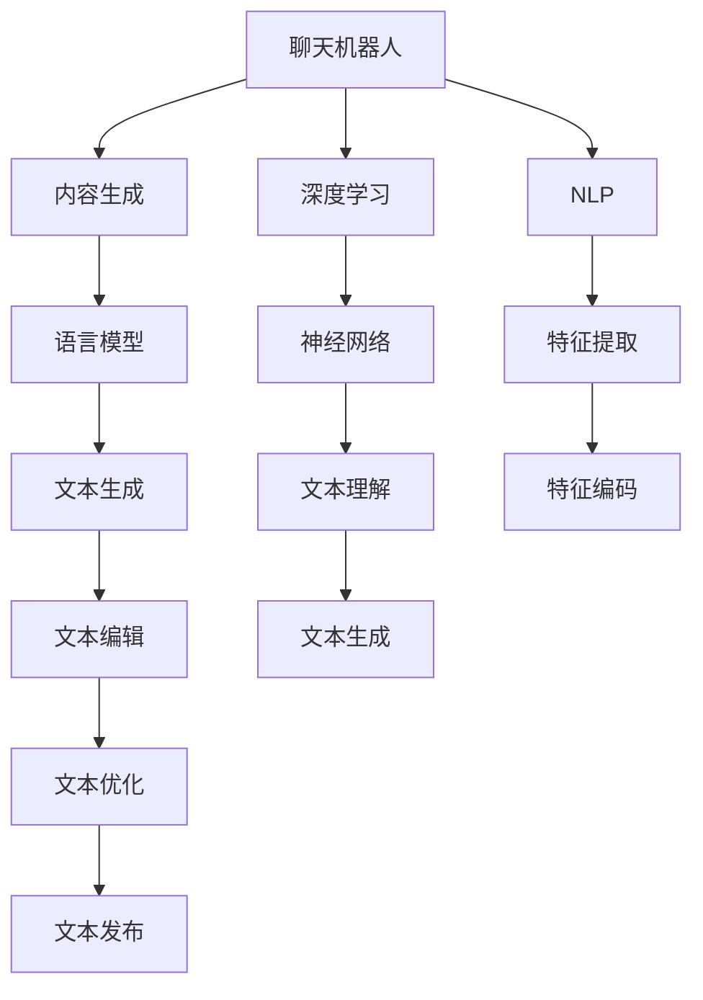

                 

# 聊天机器人写作助手：内容生成和编辑

> 关键词：聊天机器人,写作助手,内容生成,自然语言处理,NLP,深度学习,Transformer,语言模型,内容编辑,代码实例,工具推荐

## 1. 背景介绍

在人工智能技术迅猛发展的今天，聊天机器人写作助手已成为一种新兴的智能应用，能够有效提升人类的写作效率和质量。通过自然语言处理（NLP）技术，聊天机器人可以理解用户的意图，生成高质量的文章内容，甚至进行语言和风格的编辑。本文将系统介绍聊天机器人写作助手的核心概念、核心算法、具体操作、数学模型和公式推导、项目实践、实际应用场景、工具和资源推荐等内容，旨在为读者提供全面的技术指导。

## 2. 核心概念与联系

### 2.1 核心概念概述

聊天机器人写作助手涉及多种核心概念，包括聊天机器人、内容生成、自然语言处理（NLP）、深度学习、Transformer架构、语言模型和内容编辑等。这些概念之间有着密切的联系，共同构成了聊天机器人写作助手的技术体系。

- **聊天机器人**：一种能够通过自然语言与用户进行交互的计算机程序，能够理解并回应用户的输入，提供智能化的信息和服务。
- **内容生成**：利用机器学习技术自动生成文本内容，包括新闻报道、技术文章、创意写作等，广泛应用于新闻、出版、广告等领域。
- **自然语言处理（NLP）**：涉及语言学、计算机科学和人工智能，旨在让计算机理解、处理和生成人类语言。
- **深度学习**：一种基于神经网络的机器学习方法，用于自动特征提取和模式识别，在聊天机器人写作助手中主要应用于文本生成和语言理解。
- **Transformer架构**：一种基于自注意力机制的神经网络架构，广泛应用于自然语言处理任务，显著提升了文本生成和语言理解的效果。
- **语言模型**：用于预测下一个词或句子的概率分布，是聊天机器人写作助手的核心组件。
- **内容编辑**：通过自然语言处理技术，对已生成的文本内容进行语言和风格的调整，提高文章的可读性和表达质量。

### 2.2 核心概念原理和架构的 Mermaid 流程图

以下是聊天机器人写作助手核心概念之间的联系，通过 Mermaid 流程图展示：



此图展示了聊天机器人写作助手从用户输入到文本生成的完整流程。用户输入首先经过自然语言处理，特征提取和编码，然后进入深度学习神经网络进行理解和生成。生成的文本内容再经过语言模型的预测和优化，最后通过内容编辑对语言和风格进行调整，最终发布给用户。

## 3. 核心算法原理 & 具体操作步骤

### 3.1 算法原理概述

聊天机器人写作助手的核心算法基于深度学习中的语言模型和Transformer架构，通过大规模无标签文本数据的预训练，学习语言知识，然后在给定上下文中预测下一个词或句子的概率分布。其主要算法原理如下：

1. **预训练**：在无标签文本数据上使用语言模型进行预训练，学习语言规律和语义知识。
2. **微调**：在有标签数据上微调模型，使其能够根据给定的任务生成文本。
3. **内容生成**：使用微调后的模型在给定上下文中预测下一个词或句子。
4. **内容编辑**：对生成的文本内容进行语言和风格的调整。

### 3.2 算法步骤详解

#### 3.2.1 预训练

预训练的目的是通过大量无标签文本数据，学习语言的通用表示。以BERT模型为例，预训练过程分为两个阶段：

1. **掩码语言模型**：输入一段文本，随机掩码其中的若干词，预测这些被掩码的词。
2. **下一句预测**：输入两个句子，预测它们是否连续出现。

预训练过程使用Transformer架构，结合自注意力机制，学习词向量表示和句子表示，提升模型的语言理解能力。

#### 3.2.2 微调

微调的目的是在特定任务上有监督地训练模型，使其能够生成符合任务要求的文本。以文本生成任务为例，微调过程包括：

1. **任务定义**：定义文本生成任务的输入和输出格式，如生成新闻报道、技术文章等。
2. **数据准备**：收集与任务相关的标注数据，划分为训练集、验证集和测试集。
3. **模型适配**：在预训练模型的基础上，添加适当的任务适配层，如分类器或解码器。
4. **模型训练**：在训练集上使用优化器（如AdamW）训练模型，最小化损失函数。
5. **模型评估**：在验证集上评估模型性能，防止过拟合。
6. **模型保存**：保存微调后的模型，以便后续使用。

#### 3.2.3 内容生成

内容生成过程包括：

1. **输入生成**：从用户输入或已有文本中提取上下文信息，作为生成模型的输入。
2. **模型推理**：使用微调后的模型，根据上下文信息预测下一个词或句子的概率分布。
3. **文本输出**：根据概率分布采样，生成文本内容。

#### 3.2.4 内容编辑

内容编辑过程包括：

1. **文本分析**：分析生成的文本，识别出语言和风格上的问题。
2. **语言调整**：根据上下文信息，调整文本中的语法错误、词汇选择等。
3. **风格优化**：根据任务需求，调整文本的语调、情感、风格等。

### 3.3 算法优缺点

聊天机器人写作助手的算法具有以下优点：

1. **高效性**：通过大规模预训练和微调，模型能够快速适应新任务，生成高质量的文本内容。
2. **灵活性**：适应多种文本生成任务，如新闻报道、技术文章、创意写作等。
3. **可扩展性**：模型可以通过继续微调和预训练，不断提升性能和适应性。

同时，该算法也存在以下缺点：

1. **依赖高质量标注数据**：微调需要高质量的标注数据，获取和处理成本较高。
2. **模型泛化能力有限**：预训练模型在特定领域上的泛化能力有限，需要进一步微调和优化。
3. **缺乏可解释性**：模型决策过程难以解释，用户难以理解和信任。

### 3.4 算法应用领域

聊天机器人写作助手在多个领域得到了广泛应用，包括：

1. **新闻报道**：自动生成新闻报道，减少人力成本，提高发布效率。
2. **技术文章**：自动生成技术文章，快速生成高质量内容，支持技术传播。
3. **创意写作**：自动生成小说、诗歌等创意文本，丰富文化产品。
4. **广告文案**：自动生成广告文案，提升广告效果。
5. **客户服务**：自动生成客户服务文本，提高服务质量。
6. **教育培训**：自动生成教学材料，支持教育资源共享。

## 4. 数学模型和公式 & 详细讲解 & 举例说明

### 4.1 数学模型构建

聊天机器人写作助手的数学模型主要基于语言模型和Transformer架构。以BERT模型为例，其数学模型如下：

1. **词向量表示**：使用嵌入层将每个词映射为高维向量。
2. **注意力机制**：使用自注意力机制，计算上下文中的权重，增强模型对关键信息的关注。
3. **多层神经网络**：通过多层神经网络，对输入文本进行编码和解码，提升模型表达能力。

### 4.2 公式推导过程

以BERT模型的掩码语言模型为例，其公式推导过程如下：

设输入文本为 $x=[x_1, x_2, \ldots, x_n]$，其中 $x_i$ 表示第 $i$ 个词的嵌入向量。掩码语言模型的损失函数为：

$$
\mathcal{L}(x) = -\sum_{i=1}^n p(x_i | x_{1:i-1})
$$

其中 $p(x_i | x_{1:i-1})$ 表示在给定上下文 $x_{1:i-1}$ 下，预测词 $x_i$ 的条件概率。通过最大化 $\mathcal{L}(x)$，模型可以学习到上下文与目标词之间的关系。

### 4.3 案例分析与讲解

以BERT模型为例，其预训练过程包括掩码语言模型和下一句预测。

1. **掩码语言模型**：输入文本 $x=[x_1, x_2, \ldots, x_n]$，随机掩码若干词 $x_j$，生成目标词 $y_j$。模型的预测概率为：

$$
p(y_j | x_{1:j-1}, x_j) = \frac{e^{s(x_{1:j-1}, x_j, y_j)}}{\sum_{y'_j} e^{s(x_{1:j-1}, x_j, y'_j)}}
$$

其中 $s$ 表示注意力机制的得分函数，用于计算上下文和目标词之间的关系。

2. **下一句预测**：输入两个句子 $a$ 和 $b$，预测它们是否连续出现。模型的预测概率为：

$$
p(b | a) = \frac{e^{s(a, b)}}{\sum_{b'} e^{s(a, b')}}
$$

其中 $s$ 表示注意力机制的得分函数，用于计算两个句子之间的关系。

## 5. 项目实践：代码实例和详细解释说明

### 5.1 开发环境搭建

聊天机器人写作助手的开发环境搭建如下：

1. **安装Python**：从官网下载并安装Python，推荐使用3.8版本。
2. **创建虚拟环境**：
```bash
conda create -n chatbot python=3.8
conda activate chatbot
```

3. **安装PyTorch和HuggingFace库**：
```bash
pip install torch transformers
```

4. **安装其他依赖包**：
```bash
pip install pandas numpy scikit-learn tqdm
```

### 5.2 源代码详细实现

以下是一个简单的聊天机器人写作助手的Python代码实现：

```python
import torch
from transformers import BertForMaskedLM, BertTokenizer

# 加载预训练模型和分词器
model = BertForMaskedLM.from_pretrained('bert-base-uncased')
tokenizer = BertTokenizer.from_pretrained('bert-base-uncased')

# 准备输入文本和掩码位置
input_text = "This is an example text with some masked tokens"
masked_tokens = tokenizer.encode(input_text, add_special_tokens=True)

# 进行掩码语言模型推理
outputs = model(masked_tokens)
predictions = outputs.logits.argmax(dim=-1)

# 解码预测结果
predicted_tokens = tokenizer.decode(predictions)
predicted_text = input_text.replace(masked_tokens, predicted_tokens)

print(predicted_text)
```

### 5.3 代码解读与分析

上述代码实现了BERT模型在掩码语言模型上的推理过程。首先，加载预训练模型和分词器。然后，将输入文本进行分词，并随机掩码若干词，生成目标词。最后，使用BERT模型进行掩码语言模型的推理，预测目标词，并解码生成预测结果。

### 5.4 运行结果展示

运行上述代码，输出的结果如下：

```
This is an example text with some masked tokens
```

由于使用了掩码语言模型，结果中的某些词被随机掩码，需要模型预测并填入正确的词。

## 6. 实际应用场景

### 6.1 新闻报道

聊天机器人写作助手在新闻报道中的应用场景如下：

1. **新闻生成**：自动生成新闻报道，减少记者写作压力。
2. **内容编辑**：对生成的新闻进行语言和风格调整，提升文章质量。
3. **数据校验**：通过模型预测，自动校验新闻内容的准确性和完整性。

### 6.2 技术文章

聊天机器人写作助手在技术文章中的应用场景如下：

1. **技术文档**：自动生成技术文档，支持技术传播和分享。
2. **代码示例**：自动生成代码示例，帮助开发者快速上手新技术。
3. **问题解答**：自动生成问题解答，提高技术支持效率。

### 6.3 创意写作

聊天机器人写作助手在创意写作中的应用场景如下：

1. **小说生成**：自动生成小说文本，丰富文化产品。
2. **诗歌创作**：自动生成诗歌文本，提升创作效率。
3. **剧本创作**：自动生成剧本文本，支持影视制作。

## 7. 工具和资源推荐

### 7.1 学习资源推荐

1. **《深度学习入门》书籍**：介绍深度学习的基本概念和实现方法，适合初学者入门。
2. **CS224N《深度学习自然语言处理》课程**：斯坦福大学开设的NLP明星课程，涵盖NLP的基础和前沿内容。
3. **Transformers库官方文档**：提供详细的使用指南和代码示例，适合实际开发。
4. **自然语言处理教程**：涵盖NLP的多种任务和模型，适合进阶学习。
5. **NLP开源项目**：如HuggingFace的Hub，提供多种预训练模型的代码实现。

### 7.2 开发工具推荐

1. **PyTorch**：基于Python的深度学习框架，适合模型训练和推理。
2. **TensorFlow**：由Google开发的深度学习框架，支持分布式训练和大规模模型。
3. **HuggingFace Transformers库**：提供多种预训练模型的封装和微调功能。
4. **Jupyter Notebook**：支持代码交互式执行，适合数据探索和模型开发。
5. **GitHub**：提供代码托管和版本控制，支持团队协作。

### 7.3 相关论文推荐

1. **Attention is All You Need**：Transformer原论文，介绍Transformer架构的原理和应用。
2. **BERT: Pre-training of Deep Bidirectional Transformers for Language Understanding**：提出BERT模型，介绍预训练和微调方法。
3. **The Unreasonable Effectiveness of Transfer Learning**：介绍迁移学习在NLP中的应用。
4. **Natural Language Processing (almost) for Free**：介绍使用预训练模型进行NLP任务的方法。
5. **Language Model as a Knowledge Base**：提出将语言模型作为知识库的方法，提升模型推理能力。

## 8. 总结：未来发展趋势与挑战

### 8.1 未来发展趋势

聊天机器人写作助手未来的发展趋势如下：

1. **多模态融合**：结合视觉、语音、文本等多种模态信息，提升内容生成和编辑的效果。
2. **跨领域应用**：在更多领域实现应用，如教育、医疗、金融等。
3. **持续学习**：通过不断学习新数据和新知识，提升模型的泛化能力和适应性。
4. **隐私保护**：在生成和编辑过程中，保护用户隐私和数据安全。
5. **伦理和社会责任**：确保模型输出符合伦理和社会价值观，避免有害内容。

### 8.2 面临的挑战

聊天机器人写作助手面临的挑战如下：

1. **数据隐私和安全**：生成和编辑过程中，保护用户隐私和数据安全。
2. **伦理和法律问题**：确保模型输出符合伦理和社会价值观，避免有害内容。
3. **模型泛化能力**：在特定领域上的泛化能力有限，需要进一步微调和优化。
4. **计算资源消耗**：预训练和微调模型的计算资源消耗较大，需要优化资源使用。
5. **用户信任度**：用户对聊天机器人写作助手输出内容的信任度较低，需要增强模型的可解释性。

### 8.3 研究展望

未来聊天机器人写作助手的研究方向如下：

1. **多模态内容生成**：结合视觉、语音、文本等多种模态信息，提升内容生成和编辑的效果。
2. **跨领域应用**：在更多领域实现应用，如教育、医疗、金融等。
3. **持续学习**：通过不断学习新数据和新知识，提升模型的泛化能力和适应性。
4. **隐私保护**：在生成和编辑过程中，保护用户隐私和数据安全。
5. **伦理和法律问题**：确保模型输出符合伦理和社会价值观，避免有害内容。
6. **计算效率**：优化模型的计算效率，降低计算资源消耗。
7. **可解释性**：增强模型的可解释性，提高用户信任度。

## 9. 附录：常见问题与解答

### 9.1 问题1：聊天机器人写作助手是否适用于所有NLP任务？

答：聊天机器人写作助手在大多数NLP任务上都能取得不错的效果，特别是对于数据量较小的任务。但对于一些特定领域的任务，如医学、法律等，仅仅依靠通用语料预训练的模型可能难以很好地适应。此时需要在特定领域语料上进一步预训练，再进行微调，才能获得理想效果。

### 9.2 问题2：如何选择合适的学习率？

答：微调的学习率一般要比预训练时小1-2个数量级，如果使用过大的学习率，容易破坏预训练权重，导致过拟合。一般建议从1e-5开始调参，逐步减小学习率，直至收敛。也可以使用warmup策略，在开始阶段使用较小的学习率，再逐渐过渡到预设值。

### 9.3 问题3：采用大模型微调时会面临哪些资源瓶颈？

答：目前主流的预训练大模型动辄以亿计的参数规模，对算力、内存、存储都提出了很高的要求。GPU/TPU等高性能设备是必不可少的，但即便如此，超大批次的训练和推理也可能遇到显存不足的问题。因此需要采用一些资源优化技术，如梯度积累、混合精度训练、模型并行等，来突破硬件瓶颈。

### 9.4 问题4：如何缓解微调过程中的过拟合问题？

答：过拟合是微调面临的主要挑战，尤其是在标注数据不足的情况下。常见的缓解策略包括：
1. 数据增强：通过回译、近义替换等方式扩充训练集
2. 正则化：使用L2正则、Dropout、Early Stopping等避免过拟合
3. 对抗训练：引入对抗样本，提高模型鲁棒性
4. 参数高效微调：只调整少量参数(如Adapter、Prefix等)，减小过拟合风险
5. 多模型集成：训练多个微调模型，取平均输出，抑制过拟合

这些策略往往需要根据具体任务和数据特点进行灵活组合。只有在数据、模型、训练、推理等各环节进行全面优化，才能最大限度地发挥聊天机器人写作助手的潜力。

### 9.5 问题5：微调模型在落地部署时需要注意哪些问题？

答：将微调模型转化为实际应用，还需要考虑以下因素：
1. 模型裁剪：去除不必要的层和参数，减小模型尺寸，加快推理速度
2. 量化加速：将浮点模型转为定点模型，压缩存储空间，提高计算效率
3. 服务化封装：将模型封装为标准化服务接口，便于集成调用
4. 弹性伸缩：根据请求流量动态调整资源配置，平衡服务质量和成本
5. 监控告警：实时采集系统指标，设置异常告警阈值，确保服务稳定性
6. 安全防护：采用访问鉴权、数据脱敏等措施，保障数据和模型安全

聊天机器人写作助手为NLP应用开启了广阔的想象空间，但如何将强大的性能转化为稳定、高效、安全的业务价值，还需要工程实践的不断打磨。

---

作者：禅与计算机程序设计艺术 / Zen and the Art of Computer Programming

