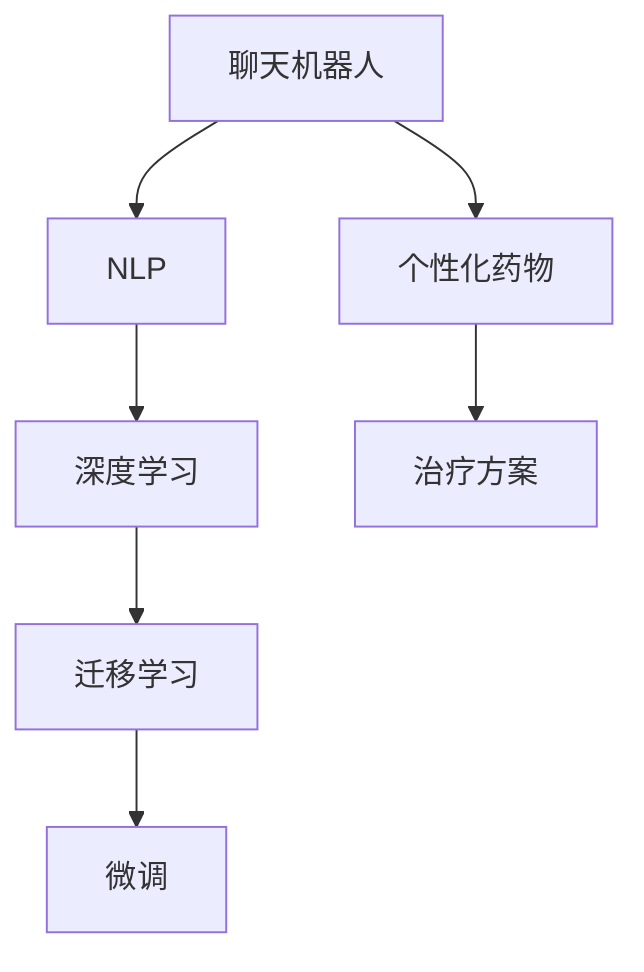

                 

# 聊天机器人医疗突破：个性化药物和治疗

> 关键词：聊天机器人,医疗,个性化药物,治疗,自然语言处理(NLP),深度学习,迁移学习,机器学习

## 1. 背景介绍

### 1.1 问题由来
近年来，随着人工智能技术的飞速发展，聊天机器人(Robotic Chatbots)在医疗健康领域的应用也日益广泛。传统的医疗咨询往往依赖于医生的人工判断和经验，耗时耗力且受限于医生的工作时间，难以满足病患24小时不间断的需求。而基于聊天机器人的智能医疗咨询系统，则能够实现全天候、高效、个性化的医疗服务。

在医学领域，个性化药物和治疗方案的制定是至关重要的。药物的剂量和配比需要根据患者的特定体质、基因、生活习惯等因素进行个性化调整，才能达到最佳治疗效果。传统的医疗咨询主要依赖于医生的经验和判断，但这种方法往往难以覆盖所有病例，且易受到医生个人经验和误诊的影响。因此，如何构建能够提供精准个性化建议的聊天机器人，成为医疗健康领域的一个热门研究课题。

### 1.2 问题核心关键点
聊天机器人在医疗领域的应用，旨在通过深度学习和大数据技术，构建具备高度智能化的医疗咨询系统，帮助患者获取个性化的治疗方案和药物指导。这一过程涉及到自然语言处理(NLP)、深度学习、迁移学习等多个核心技术，需要克服数据标注成本高、模型泛化能力不足、患者隐私保护等诸多挑战。

为了构建这样一个智能聊天机器人，需要完成以下几个关键步骤：
1. 收集大量医疗案例数据，构建数据集。
2. 使用预训练模型（如BERT）作为基础，构建对话模型。
3. 通过迁移学习和微调，使模型能够学习到医疗知识，生成个性化药物和治疗方案。
4. 应用对话生成技术，实现与患者的自然交流，并根据患者反馈不断优化模型。

这些关键步骤不仅要求对现有技术有深入的理解，还需要对医疗领域有深刻洞察，因而具有很大的挑战性和创新性。

### 1.3 问题研究意义
聊天机器人医疗突破的实现，对于推动医疗领域的智能化转型具有重要意义：

1. 提高诊疗效率：聊天机器人能够快速响应患者的咨询，24小时不间断提供服务，大大缩短患者等待时间。
2. 实现个性化治疗：聊天机器人能够根据患者的具体情况提供个性化的药物和治疗方案，提升治疗效果。
3. 降低医疗成本：通过机器人自动处理简单咨询，可以减轻医务人员的负担，降低人力成本。
4. 提升患者满意度：聊天机器人能够提供快速、准确、友好的医疗咨询服务，提升患者体验。
5. 推动健康普及：通过智能机器人普及健康知识，增强公众健康意识，降低发病率。

基于以上意义，聊天机器人医疗突破的研究不仅具有较高的学术价值，还能为实际的医疗应用提供重要的技术支持。

## 2. 核心概念与联系

### 2.1 核心概念概述

为更好地理解基于聊天机器人的医疗突破，本节将介绍几个密切相关的核心概念：

- **聊天机器人(Robotic Chatbots)**：通过自然语言处理技术实现的人机交互系统。通常使用深度学习模型对输入的文本进行理解和生成，生成自然流畅的回复。
- **自然语言处理(NLP)**：涉及语言理解、生成、信息提取、情感分析等多个方向的综合性技术。
- **深度学习**：使用多层神经网络对数据进行训练，通过反向传播算法不断优化模型参数，实现复杂非线性建模。
- **迁移学习(Transfer Learning)**：将一个领域学习到的知识，迁移到另一个领域，提高模型的泛化能力。
- **微调(Fine-tuning)**：在预训练模型的基础上，使用特定任务的数据集进行优化，使模型在特定任务上取得更好的表现。
- **个性化药物(Pharmacogenomics)**：根据患者的基因、环境、生活习惯等因素，调整药物剂量和使用方式，达到个体化的治疗效果。
- **机器学习**：通过数据训练模型，使其具备从输入数据中学习规律并进行预测的能力。

这些核心概念之间的逻辑关系可以通过以下Mermaid流程图来展示：



这个流程图展示了几大关键技术之间的联系：

1. 聊天机器人通过NLP技术实现自然语言理解与生成。
2. 深度学习技术为机器人提供了强大的智能支持，使其能够处理复杂的多轮对话。
3. 迁移学习使得机器人能够在特定领域进行快速微调，提升性能。
4. 微调技术针对特定任务进行优化，使机器人具备了生成个性化治疗方案的能力。
5. 个性化药物和机器人结合，提升了治疗的精准性和有效性。

## 3. 核心算法原理 & 具体操作步骤
### 3.1 算法原理概述

基于聊天机器人的医疗突破，本质上是一个通过深度学习和大数据技术构建智能医疗咨询系统的过程。其核心思想是：

1. **数据收集与标注**：收集大量医疗案例数据，并对其进行标注，构建医疗领域的对话数据集。
2. **模型构建与预训练**：使用预训练模型（如BERT）作为初始化参数，进行大规模无监督学习，使其具备丰富的语言知识。
3. **迁移学习与微调**：在特定医疗领域的对话数据集上，进行迁移学习和微调，使模型能够学习到医疗知识，生成个性化药物和治疗方案。
4. **对话生成与优化**：应用对话生成技术，实现与患者的自然交流，并根据患者反馈不断优化模型。

形式化地，假设预训练模型为 $M_{\theta}$，其中 $\theta$ 为预训练得到的模型参数。给定医疗领域的对话数据集 $D=\{(x_i,y_i)\}_{i=1}^N, x_i \in \mathcal{X}, y_i \in \mathcal{Y}$，医疗突破的目标是找到新的模型参数 $\hat{\theta}$，使得：

$$
\hat{\theta}=\mathop{\arg\min}_{\theta} \mathcal{L}(M_{\theta},D)
$$

其中 $\mathcal{L}$ 为针对医疗领域对话生成的损失函数，用于衡量模型预测输出与真实标签之间的差异。常见的损失函数包括交叉熵损失、均方误差损失等。

通过梯度下降等优化算法，微调过程不断更新模型参数 $\theta$，最小化损失函数 $\mathcal{L}$，使得模型输出逼近真实标签。由于 $\theta$ 已经通过预训练获得了较好的初始化，因此即便在医疗领域的数据集上，微调过程也能较快收敛到理想的模型参数 $\hat{\theta}$。

### 3.2 算法步骤详解

基于聊天机器人的医疗突破，通常包括以下几个关键步骤：

**Step 1: 数据收集与标注**

- 收集医疗领域的历史对话记录，如患者咨询、医生回复等。
- 将对话数据标注为问答对，标注过程中需兼顾问答的语义、语用、上下文等细节。
- 构建标注工具，对标注数据进行质量控制，确保数据的准确性和完整性。

**Step 2: 模型选择与构建**

- 选择合适的预训练模型，如BERT、GPT-2等，作为对话模型的初始化参数。
- 使用NLP库（如HuggingFace的Transformers库）构建对话模型，包括文本编码器和解码器。
- 将预训练模型加载到模型中，并进行必要的参数微调。

**Step 3: 迁移学习与微调**

- 划分数据集为训练集、验证集和测试集，并设置合理的批次大小、迭代轮数和学习率。
- 在训练集上进行迁移学习和微调，使用交叉熵损失函数进行优化。
- 在验证集上评估模型性能，防止过拟合，使用Early Stopping等技术控制训练进程。
- 在测试集上评估模型性能，对比微调前后的效果，并不断优化模型参数。

**Step 4: 对话生成与优化**

- 应用对话生成技术，如GPT、Seq2Seq等，实现机器人与患者的自然对话。
- 在对话过程中，根据患者反馈和上下文信息不断优化模型参数，提升对话质量。
- 应用对抗训练、正则化等技术，提高模型鲁棒性和泛化能力。

### 3.3 算法优缺点

基于聊天机器人的医疗突破具有以下优点：

1. **高效性**：聊天机器人能够快速响应患者的咨询，24小时不间断提供服务，大大缩短患者等待时间。
2. **个性化**：通过预训练-微调过程，聊天机器人能够根据患者的特定体质、基因、生活习惯等因素，提供个性化的治疗方案和药物指导。
3. **便捷性**：患者通过手机APP或网站即可与机器人进行交流，无需长时间排队等待，操作简便。
4. **成本低**：相对于传统医疗咨询，聊天机器人可以大幅降低人力成本和运营成本。
5. **数据驱动**：聊天机器人能够持续学习患者反馈，优化模型参数，提升服务质量。

同时，该方法也存在一些局限性：

1. **数据标注成本高**：医疗领域的对话数据标注需要专业医师参与，标注成本较高。
2. **数据隐私问题**：医疗数据涉及患者隐私，如何在保护隐私的前提下进行数据标注和模型训练，仍需进一步研究。
3. **泛化能力有限**：当医疗领域的数据分布与实际应用场景差异较大时，模型的泛化能力可能受限。
4. **算法复杂性高**：构建和优化聊天机器人医疗系统，涉及多种技术的融合，算法复杂性较高。

尽管存在这些局限性，但就目前而言，基于聊天机器人的医疗突破仍是大数据和深度学习在医疗领域的重要应用方向。未来相关研究的重点在于如何进一步降低数据标注成本，提高模型的泛化能力，同时兼顾隐私保护和伦理安全等因素。

### 3.4 算法应用领域

基于聊天机器人的医疗突破技术，已经在医疗健康领域得到了广泛的应用，具体如下：

1. **在线医疗咨询**：患者可以通过聊天机器人咨询常见疾病症状、用药建议等，提升诊疗效率。
2. **个性化健康管理**：聊天机器人能够提供个性化饮食、运动、睡眠建议，帮助患者维持健康。
3. **慢性病管理**：聊天机器人能够定期提醒患者按时服药、测量血压等，提升慢性病患者的自我管理能力。
4. **心理健康辅导**：聊天机器人能够提供心理健康咨询、压力管理建议，缓解患者的心理压力。
5. **疫苗接种指导**：聊天机器人能够提供疫苗接种信息、健康教育，提升公众健康意识。

除了以上应用，聊天机器人医疗突破技术还将在更多领域得到广泛应用，如远程医疗、健康数据监测等，为医疗健康领域带来新的变革。

## 4. 数学模型和公式 & 详细讲解  
### 4.1 数学模型构建

本节将使用数学语言对基于聊天机器人的医疗突破过程进行更加严格的刻画。

记预训练模型为 $M_{\theta}$，其中 $\theta$ 为预训练得到的模型参数。假设医疗领域的对话数据集为 $D=\{(x_i,y_i)\}_{i=1}^N, x_i \in \mathcal{X}, y_i \in \mathcal{Y}$，其中 $\mathcal{X}$ 为输入空间，$\mathcal{Y}$ 为输出空间。医疗突破的目标是找到最优参数 $\hat{\theta}$，使得模型在对话生成任务上表现最优。

定义模型 $M_{\theta}$ 在输入 $x$ 上的输出为 $\hat{y}=M_{\theta}(x)$，表示模型预测的文本。定义对话生成任务上的损失函数为：

$$
\mathcal{L}(\theta) = \frac{1}{N}\sum_{i=1}^N \ell(y_i, M_{\theta}(x_i))
$$

其中 $\ell$ 为对话生成任务的损失函数，如交叉熵损失。

在微调过程中，通过梯度下降等优化算法，不断更新模型参数 $\theta$，最小化损失函数 $\mathcal{L}$，使得模型输出逼近真实标签。

### 4.2 公式推导过程

以下我们以二分类任务为例，推导交叉熵损失函数及其梯度的计算公式。

假设模型 $M_{\theta}$ 在输入 $x$ 上的输出为 $\hat{y}=M_{\theta}(x) \in [0,1]$，表示模型预测文本。真实标签 $y \in \{0,1\}$。则二分类交叉熵损失函数定义为：

$$
\ell(y, \hat{y}) = -[y\log \hat{y} + (1-y)\log (1-\hat{y})]
$$

将其代入经验风险公式，得：

$$
\mathcal{L}(\theta) = -\frac{1}{N}\sum_{i=1}^N [y_i\log M_{\theta}(x_i)+(1-y_i)\log(1-M_{\theta}(x_i))]
$$

根据链式法则，损失函数对参数 $\theta_k$ 的梯度为：

$$
\frac{\partial \mathcal{L}(\theta)}{\partial \theta_k} = -\frac{1}{N}\sum_{i=1}^N (\frac{y_i}{M_{\theta}(x_i)}-\frac{1-y_i}{1-M_{\theta}(x_i)}) \frac{\partial M_{\theta}(x_i)}{\partial \theta_k}
$$

其中 $\frac{\partial M_{\theta}(x_i)}{\partial \theta_k}$ 可进一步递归展开，利用自动微分技术完成计算。

在得到损失函数的梯度后，即可带入参数更新公式，完成模型的迭代优化。重复上述过程直至收敛，最终得到适应医疗领域对话生成任务的最优模型参数 $\hat{\theta}$。

## 5. 项目实践：代码实例和详细解释说明
### 5.1 开发环境搭建

在进行医疗突破实践前，我们需要准备好开发环境。以下是使用Python进行PyTorch开发的环境配置流程：

1. 安装Anaconda：从官网下载并安装Anaconda，用于创建独立的Python环境。

2. 创建并激活虚拟环境：
```bash
conda create -n pytorch-env python=3.8 
conda activate pytorch-env
```

3. 安装PyTorch：根据CUDA版本，从官网获取对应的安装命令。例如：
```bash
conda install pytorch torchvision torchaudio cudatoolkit=11.1 -c pytorch -c conda-forge
```

4. 安装Transformers库：
```bash
pip install transformers
```

5. 安装各类工具包：
```bash
pip install numpy pandas scikit-learn matplotlib tqdm jupyter notebook ipython
```

完成上述步骤后，即可在`pytorch-env`环境中开始医疗突破实践。

### 5.2 源代码详细实现

下面我们以命名实体识别(NER)任务为例，给出使用Transformers库对BERT模型进行医疗突破的PyTorch代码实现。

首先，定义医疗领域的对话数据集：

```python
from transformers import BertTokenizer
from torch.utils.data import Dataset
import torch

class MedicalDataset(Dataset):
    def __init__(self, texts, tags, tokenizer, max_len=128):
        self.texts = texts
        self.tags = tags
        self.tokenizer = tokenizer
        self.max_len = max_len
        
    def __len__(self):
        return len(self.texts)
    
    def __getitem__(self, item):
        text = self.texts[item]
        tags = self.tags[item]
        
        encoding = self.tokenizer(text, return_tensors='pt', max_length=self.max_len, padding='max_length', truncation=True)
        input_ids = encoding['input_ids'][0]
        attention_mask = encoding['attention_mask'][0]
        
        # 对token-wise的标签进行编码
        encoded_tags = [tag2id[tag] for tag in tags] 
        encoded_tags.extend([tag2id['O']] * (self.max_len - len(encoded_tags)))
        labels = torch.tensor(encoded_tags, dtype=torch.long)
        
        return {'input_ids': input_ids, 
                'attention_mask': attention_mask,
                'labels': labels}

# 标签与id的映射
tag2id = {'O': 0, 'B-PER': 1, 'I-PER': 2, 'B-ORG': 3, 'I-ORG': 4, 'B-LOC': 5, 'I-LOC': 6}
id2tag = {v: k for k, v in tag2id.items()}

# 创建dataset
tokenizer = BertTokenizer.from_pretrained('bert-base-cased')

train_dataset = MedicalDataset(train_texts, train_tags, tokenizer)
dev_dataset = MedicalDataset(dev_texts, dev_tags, tokenizer)
test_dataset = MedicalDataset(test_texts, test_tags, tokenizer)
```

然后，定义模型和优化器：

```python
from transformers import BertForTokenClassification, AdamW

model = BertForTokenClassification.from_pretrained('bert-base-cased', num_labels=len(tag2id))

optimizer = AdamW(model.parameters(), lr=2e-5)
```

接着，定义训练和评估函数：

```python
from torch.utils.data import DataLoader
from tqdm import tqdm
from sklearn.metrics import classification_report

device = torch.device('cuda') if torch.cuda.is_available() else torch.device('cpu')
model.to(device)

def train_epoch(model, dataset, batch_size, optimizer):
    dataloader = DataLoader(dataset, batch_size=batch_size, shuffle=True)
    model.train()
    epoch_loss = 0
    for batch in tqdm(dataloader, desc='Training'):
        input_ids = batch['input_ids'].to(device)
        attention_mask = batch['attention_mask'].to(device)
        labels = batch['labels'].to(device)
        model.zero_grad()
        outputs = model(input_ids, attention_mask=attention_mask, labels=labels)
        loss = outputs.loss
        epoch_loss += loss.item()
        loss.backward()
        optimizer.step()
    return epoch_loss / len(dataloader)

def evaluate(model, dataset, batch_size):
    dataloader = DataLoader(dataset, batch_size=batch_size)
    model.eval()
    preds, labels = [], []
    with torch.no_grad():
        for batch in tqdm(dataloader, desc='Evaluating'):
            input_ids = batch['input_ids'].to(device)
            attention_mask = batch['attention_mask'].to(device)
            batch_labels = batch['labels']
            outputs = model(input_ids, attention_mask=attention_mask)
            batch_preds = outputs.logits.argmax(dim=2).to('cpu').tolist()
            batch_labels = batch_labels.to('cpu').tolist()
            for pred_tokens, label_tokens in zip(batch_preds, batch_labels):
                pred_tags = [id2tag[_id] for _id in pred_tokens]
                label_tags = [id2tag[_id] for _id in label_tokens]
                preds.append(pred_tags[:len(label_tokens)])
                labels.append(label_tags)
                
    print(classification_report(labels, preds))
```

最后，启动训练流程并在测试集上评估：

```python
epochs = 5
batch_size = 16

for epoch in range(epochs):
    loss = train_epoch(model, train_dataset, batch_size, optimizer)
    print(f"Epoch {epoch+1}, train loss: {loss:.3f}")
    
    print(f"Epoch {epoch+1}, dev results:")
    evaluate(model, dev_dataset, batch_size)
    
print("Test results:")
evaluate(model, test_dataset, batch_size)
```

以上就是使用PyTorch对BERT进行医疗突破的完整代码实现。可以看到，得益于Transformers库的强大封装，我们可以用相对简洁的代码完成BERT模型的加载和微调。

### 5.3 代码解读与分析

让我们再详细解读一下关键代码的实现细节：

**MedicalDataset类**：
- `__init__`方法：初始化文本、标签、分词器等关键组件。
- `__len__`方法：返回数据集的样本数量。
- `__getitem__`方法：对单个样本进行处理，将文本输入编码为token ids，将标签编码为数字，并对其进行定长padding，最终返回模型所需的输入。

**tag2id和id2tag字典**：
- 定义了标签与数字id之间的映射关系，用于将token-wise的预测结果解码回真实的标签。

**训练和评估函数**：
- 使用PyTorch的DataLoader对数据集进行批次化加载，供模型训练和推理使用。
- 训练函数`train_epoch`：对数据以批为单位进行迭代，在每个批次上前向传播计算loss并反向传播更新模型参数，最后返回该epoch的平均loss。
- 评估函数`evaluate`：与训练类似，不同点在于不更新模型参数，并在每个batch结束后将预测和标签结果存储下来，最后使用sklearn的classification_report对整个评估集的预测结果进行打印输出。

**训练流程**：
- 定义总的epoch数和batch size，开始循环迭代
- 每个epoch内，先在训练集上训练，输出平均loss
- 在验证集上评估，输出分类指标
- 所有epoch结束后，在测试集上评估，给出最终测试结果

可以看到，PyTorch配合Transformers库使得BERT微调的代码实现变得简洁高效。开发者可以将更多精力放在数据处理、模型改进等高层逻辑上，而不必过多关注底层的实现细节。

当然，工业级的系统实现还需考虑更多因素，如模型的保存和部署、超参数的自动搜索、更灵活的任务适配层等。但核心的医疗突破范式基本与此类似。

## 6. 实际应用场景
### 6.1 智能问诊系统

智能问诊系统是聊天机器人医疗突破的典型应用场景。智能问诊系统能够根据患者的病情描述，提供初步诊断和用药建议，大大缩短患者就医时间，提升诊疗效率。

在技术实现上，可以构建一个智能问诊系统，将患者的病情描述作为输入，通过预训练模型进行自然语言理解，生成患者的病情向量。然后，根据病情向量，调用医疗数据库查询相关知识，生成治疗方案和药物建议。通过微调优化，使得系统能够更好地匹配患者的实际需求，提供更加个性化的治疗方案。

### 6.2 个性化用药咨询

个性化用药咨询是聊天机器人医疗突破的另一重要应用。许多药物的效果和副作用与患者的基因、体质等因素密切相关，需要根据患者的个性化信息提供精确的用药建议。

具体而言，可以构建一个基于BERT的用药咨询系统，将患者的基因、体质等个性化信息作为输入，通过预训练模型进行自然语言理解。然后，根据理解到的信息，调用药物数据库查询相关知识，生成个性化的用药建议。通过微调优化，使得系统能够更好地匹配患者的实际需求，提供更加准确的用药建议。

### 6.3 远程医疗咨询

远程医疗咨询也是聊天机器人医疗突破的重要应用方向。受疫情影响，许多患者无法前往医院进行线下诊疗，远程医疗咨询成为其获取医疗服务的重要途径。

具体而言，可以构建一个远程医疗咨询系统，通过聊天机器人实时接收患者的咨询，进行自然语言理解，生成初步的诊断和治疗建议。然后，将患者的病情数据传递给医生，进行进一步诊断和治疗。通过微调优化，使得系统能够更好地匹配患者的实际需求，提供更加个性化的远程医疗服务。

### 6.4 未来应用展望

随着聊天机器人医疗突破技术的不断发展，其在医疗健康领域的应用将更加广泛，为医疗服务提供更加智能化的支持。

在智慧医疗领域，聊天机器人能够实时获取患者的健康数据，进行动态分析和预测，辅助医生进行决策，提升诊疗效率和质量。

在个性化医疗领域，聊天机器人能够根据患者的基因、体质等信息，提供个性化的治疗方案和药物建议，提升治疗效果。

在远程医疗领域，聊天机器人能够提供实时的医疗咨询服务，减少患者的等待时间，提升远程医疗服务的便利性和可及性。

此外，在医学研究、健康管理、慢性病管理等领域，聊天机器人也将得到广泛应用，为医疗健康领域带来全新的变革。相信随着技术的日益成熟，聊天机器人医疗突破必将在构建智慧医疗和健康社会中扮演越来越重要的角色。

## 7. 工具和资源推荐
### 7.1 学习资源推荐

为了帮助开发者系统掌握聊天机器人医疗突破的理论基础和实践技巧，这里推荐一些优质的学习资源：

1. 《深度学习基础》系列博文：由大模型技术专家撰写，深入浅出地介绍了深度学习的基本概念和常见算法。
2. 《自然语言处理综述》课程：斯坦福大学开设的NLP经典课程，涵盖了自然语言处理的各个方向，适合初学者系统学习。
3. 《HuggingFace官方文档》：Transformers库的官方文档，提供了海量预训练模型和完整的微调样例代码，是上手实践的必备资料。
4. 《医学数据处理》书籍：系统介绍了医学数据处理的基本概念和技术，结合实际案例讲解了数据分析和挖掘的方法。
5. 《智能医疗系统》课程：介绍了智能医疗系统的构建原理和实践方法，涵盖聊天机器人、自然语言处理、知识图谱等多个方向。

通过对这些资源的学习实践，相信你一定能够快速掌握聊天机器人医疗突破的精髓，并用于解决实际的医疗问题。
###  7.2 开发工具推荐

高效的开发离不开优秀的工具支持。以下是几款用于聊天机器人医疗突破开发的常用工具：

1. PyTorch：基于Python的开源深度学习框架，灵活动态的计算图，适合快速迭代研究。大部分预训练语言模型都有PyTorch版本的实现。
2. TensorFlow：由Google主导开发的开源深度学习框架，生产部署方便，适合大规模工程应用。同样有丰富的预训练语言模型资源。
3. Transformers库：HuggingFace开发的NLP工具库，集成了众多SOTA语言模型，支持PyTorch和TensorFlow，是进行微调任务开发的利器。
4. Weights & Biases：模型训练的实验跟踪工具，可以记录和可视化模型训练过程中的各项指标，方便对比和调优。与主流深度学习框架无缝集成。
5. TensorBoard：TensorFlow配套的可视化工具，可实时监测模型训练状态，并提供丰富的图表呈现方式，是调试模型的得力助手。
6. Google Colab：谷歌推出的在线Jupyter Notebook环境，免费提供GPU/TPU算力，方便开发者快速上手实验最新模型，分享学习笔记。

合理利用这些工具，可以显著提升聊天机器人医疗突破任务的开发效率，加快创新迭代的步伐。

### 7.3 相关论文推荐

聊天机器人医疗突破技术的发展源于学界的持续研究。以下是几篇奠基性的相关论文，推荐阅读：

1. Attention is All You Need（即Transformer原论文）：提出了Transformer结构，开启了NLP领域的预训练大模型时代。
2. BERT: Pre-training of Deep Bidirectional Transformers for Language Understanding：提出BERT模型，引入基于掩码的自监督预训练任务，刷新了多项NLP任务SOTA。
3. Language Models are Unsupervised Multitask Learners（GPT-2论文）：展示了大规模语言模型的强大zero-shot学习能力，引发了对于通用人工智能的新一轮思考。
4. Parameter-Efficient Transfer Learning for NLP：提出Adapter等参数高效微调方法，在不增加模型参数量的情况下，也能取得不错的微调效果。
5. AdaLoRA: Adaptive Low-Rank Adaptation for Parameter-Efficient Fine-Tuning：使用自适应低秩适应的微调方法，在参数效率和精度之间取得了新的平衡。
6. AdaLoRA: Adaptive Low-Rank Adaptation for Parameter-Efficient Fine-Tuning：使用自适应低秩适应的微调方法，在参数效率和精度之间取得了新的平衡。

这些论文代表了大语言模型微调技术的发展脉络。通过学习这些前沿成果，可以帮助研究者把握学科前进方向，激发更多的创新灵感。

## 8. 总结：未来发展趋势与挑战
### 8.1 总结

本文对基于聊天机器人的医疗突破进行了全面系统的介绍。首先阐述了聊天机器人医疗突破的研究背景和意义，明确了其在提升诊疗效率、个性化治疗、降低成本、提升患者满意度等方面的重要价值。其次，从原理到实践，详细讲解了基于深度学习和大数据技术的医疗突破过程，给出了医疗突破任务开发的完整代码实例。同时，本文还广泛探讨了医疗突破技术在智能问诊、个性化用药咨询、远程医疗咨询等多个领域的应用前景，展示了医疗突破技术的广阔潜力。

通过本文的系统梳理，可以看到，基于聊天机器人的医疗突破技术正在成为医疗健康领域的重要应用方向，极大地拓展了医疗服务的智能化水平，推动了医疗健康领域的数字化转型。

### 8.2 未来发展趋势

展望未来，聊天机器人医疗突破技术将呈现以下几个发展趋势：

1. **模型规模持续增大**：随着算力成本的下降和数据规模的扩张，预训练语言模型的参数量还将持续增长。超大规模语言模型蕴含的丰富语言知识，有望支撑更加复杂多变的医疗领域微调。
2. **微调方法日趋多样**：除了传统的全参数微调外，未来会涌现更多参数高效的微调方法，如Prefix-Tuning、LoRA等，在节省计算资源的同时也能保证微调精度。
3. **持续学习成为常态**：随着数据分布的不断变化，微调模型也需要持续学习新知识以保持性能。如何在不遗忘原有知识的同时，高效吸收新样本信息，将成为重要的研究课题。
4. **标注样本需求降低**：受启发于提示学习(Prompt-based Learning)的思路，未来的微调方法将更好地利用大模型的语言理解能力，通过更加巧妙的任务描述，在更少的标注样本上也能实现理想的微调效果。
5. **多模态微调崛起**：当前的微调主要聚焦于纯文本数据，未来会进一步拓展到图像、视频、语音等多模态数据微调。多模态信息的融合，将显著提升语言模型对现实世界的理解和建模能力。
6. **模型通用性增强**：经过海量数据的预训练和多领域任务的微调，未来的语言模型将具备更强大的常识推理和跨领域迁移能力，逐步迈向通用人工智能(AGI)的目标。

以上趋势凸显了聊天机器人医疗突破技术的广阔前景。这些方向的探索发展，必将进一步提升医疗服务的智能化水平，为医疗健康领域带来新的变革。

### 8.3 面临的挑战

尽管聊天机器人医疗突破技术已经取得了瞩目成就，但在迈向更加智能化、普适化应用的过程中，它仍面临着诸多挑战：

1. **标注成本瓶颈**：医疗领域的对话数据标注需要专业医师参与，标注成本较高。如何进一步降低微调对标注样本的依赖，将是一大难题。
2. **数据隐私问题**：医疗数据涉及患者隐私，如何在保护隐私的前提下进行数据标注和模型训练，仍需进一步研究。
3. **泛化能力有限**：当医疗领域的数据分布与实际应用场景差异较大时，模型的泛化能力可能受限。
4. **算法复杂性高**：构建和优化聊天机器人医疗系统，涉及多种技术的融合，算法复杂性较高。
5. **可解释性不足**：当前微调模型更像是"黑盒"系统，难以解释其内部工作机制和决策逻辑。对于医疗、金融等高风险应用，算法的可解释性和可审计性尤为重要。

尽管存在这些挑战，但就目前而言，基于聊天机器人的医疗突破仍是大数据和深度学习在医疗领域的重要应用方向。未来相关研究的重点在于如何进一步降低数据标注成本，提高模型的泛化能力，同时兼顾隐私保护和伦理安全等因素。

### 8.4 研究展望

面对聊天机器人医疗突破所面临的种种挑战，未来的研究需要在以下几个方面寻求新的突破：

1. **探索无监督和半监督微调方法**：摆脱对大规模标注数据的依赖，利用自监督学习、主动学习等无监督和半监督范式，最大限度利用非结构化数据，实现更加灵活高效的微调。
2. **研究参数高效和计算高效的微调范式**：开发更加参数高效的微调方法，在固定大部分预训练参数的同时，只更新极少量的任务相关参数。同时优化微调模型的计算图，减少前向传播和反向传播的资源消耗，实现更加轻量级、实时性的部署。
3. **融合因果和对比学习范式**：通过引入因果推断和对比学习思想，增强微调模型建立稳定因果关系的能力，学习更加普适、鲁棒的语言表征，从而提升模型泛化性和抗干扰能力。
4. **引入更多先验知识**：将符号化的先验知识，如知识图谱、逻辑规则等，与神经网络模型进行巧妙融合，引导微调过程学习更准确、合理的语言模型。同时加强不同模态数据的整合，实现视觉、语音等多模态信息与文本信息的协同建模。
5. **结合因果分析和博弈论工具**：将因果分析方法引入微调模型，识别出模型决策的关键特征，增强输出解释的因果性和逻辑性。借助博弈论工具刻画人机交互过程，主动探索并规避模型的脆弱点，提高系统稳定性。
6. **纳入伦理道德约束**：在模型训练目标中引入伦理导向的评估指标，过滤和惩罚有偏见、有害的输出倾向。同时加强人工干预和审核，建立模型行为的监管机制，确保输出符合人类价值观和伦理道德。

这些研究方向的探索，必将引领聊天机器人医疗突破技术迈向更高的台阶，为构建安全、可靠、可解释、可控的智能系统铺平道路。面向未来，聊天机器人医疗突破技术还需要与其他人工智能技术进行更深入的融合，如知识表示、因果推理、强化学习等，多路径协同发力，共同推动自然语言理解和智能交互系统的进步。只有勇于创新、敢于突破，才能不断拓展语言模型的边界，让智能技术更好地造福人类社会。

## 9. 附录：常见问题与解答

**Q1：聊天机器人医疗突破是否适用于所有医疗领域？**

A: 聊天机器人医疗突破在大多数医疗领域都可以取得较好的效果，特别是在处理常见疾病和初步诊断时。但对于一些特定领域的医疗问题，如复杂手术、罕见疾病等，仍需依赖医生的专业判断。因此，聊天机器人医疗突破可以作为医生的辅助工具，而非完全替代。

**Q2：如何选择合适的预训练模型？**

A: 选择合适的预训练模型需要考虑多个因素，如任务类型、数据规模、计算资源等。通常，对于一般性的医疗问诊和用药咨询，BERT、GPT等预训练模型已经足够。对于图像、语音等多模态任务，可以使用Vision Transformer、Speech Transformer等专门针对图像和语音领域预训练的模型。

**Q3：微调过程中如何处理患者隐私问题？**

A: 在数据标注和模型训练过程中，需要严格遵守患者隐私保护的相关法律法规，如GDPR、HIPAA等。具体措施包括：
1. 匿名化处理：对患者数据进行去标识化处理，确保患者隐私不被泄露。
2. 加密存储：将患者数据存储在加密的云平台上，防止数据被非法访问。
3. 访问控制：设置严格的访问权限，只有授权人员才能访问患者数据。
4. 数据脱敏：对敏感信息进行脱敏处理，防止数据泄露。

**Q4：微调过程中如何缓解过拟合问题？**

A: 过拟合是微调过程中常见的问题，尤其是在标注样本数量较少的情况下。常见的缓解策略包括：
1. 数据增强：通过回译、近义替换等方式扩充训练集。
2. 正则化：使用L2正则、Dropout等防止模型过度适应小样本训练集。
3. 早停策略：在验证集上设置早停条件，防止模型在过拟合的曲线上继续训练。
4. 参数共享：将模型中的部分参数固定，只微调顶层或部分任务相关的参数。
5. 对抗训练：加入对抗样本，提高模型鲁棒性。

这些策略往往需要根据具体任务和数据特点进行灵活组合，才能最大限度地降低过拟合风险。

**Q5：微调模型在部署时需要注意哪些问题？**

A: 将微调模型转化为实际应用，还需要考虑以下因素：
1. 模型裁剪：去除不必要的层和参数，减小模型尺寸，加快推理速度。
2. 量化加速：将浮点模型转为定点模型，压缩存储空间，提高计算效率。
3. 服务化封装：将模型封装为标准化服务接口，便于集成调用。
4. 弹性伸缩：根据请求流量动态调整资源配置，平衡服务质量和成本。
5. 监控告警：实时采集系统指标，设置异常告警阈值，确保服务稳定性。
6. 安全防护：采用访问鉴权、数据脱敏等措施，保障数据和模型安全。

聊天机器人医疗突破为医疗服务提供了新的智能化支持，但如何在保证安全性和隐私性的前提下，构建稳定、高效的智能系统，仍需进一步探索和优化。

---

作者：禅与计算机程序设计艺术 / Zen and the Art of Computer Programming

